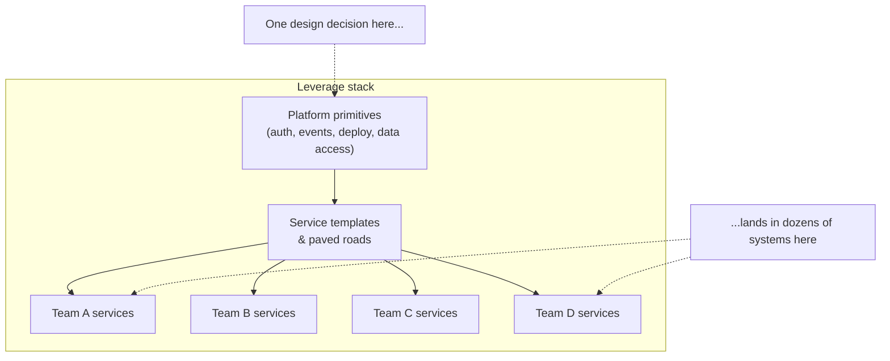
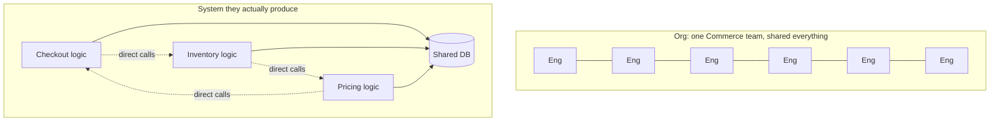
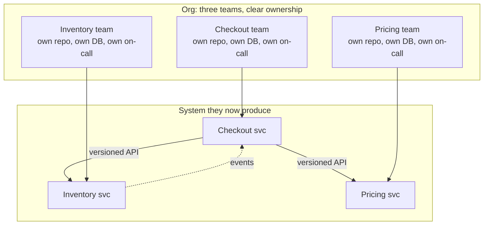
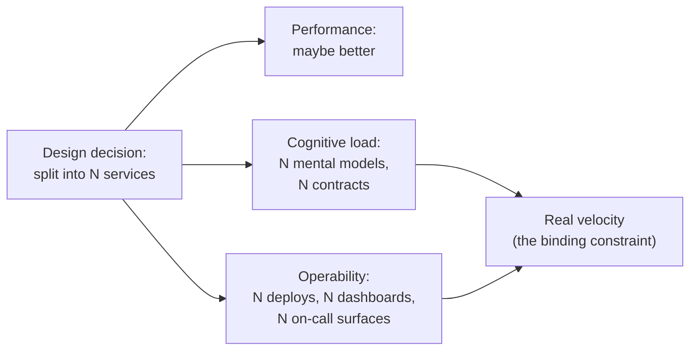
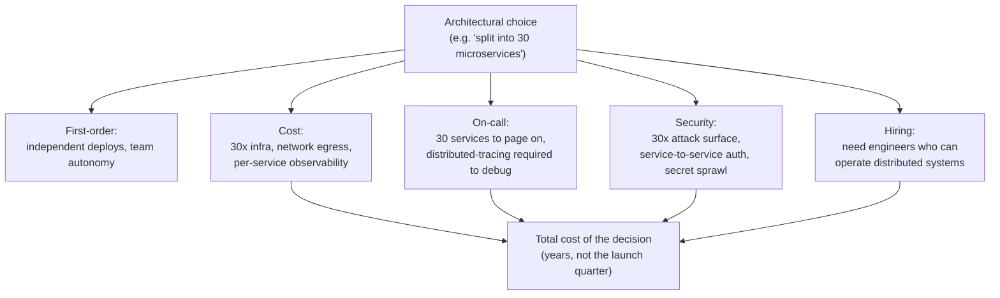

# What Is System Design? — Staff / Principal Level

At junior and senior levels, "system design" means producing a good design for *a* system: a service, a pipeline, a schema. At the Staff and Principal level, the unit of work changes. You are no longer designing one system in isolation; you are shaping the *space of systems* that dozens of teams will build, operate, and inherit over the next two to three years — usually without the formal authority to make any of them comply. System design becomes an organizational discipline as much as a technical one.

This page is about that shift. It treats "What is system design?" along the *organizational axis*: leverage, build-vs-buy, Conway's Law, designing for reorgs and 10x growth, cognitive load, the discipline of *not* over-designing, the second-order consequences of architecture, and how judgment is exercised through influence rather than command.

---

## Table of Contents

1. [The Staff-Level Redefinition](#1-the-staff-level-redefinition)
2. [System Design as Leverage and Platform Thinking](#2-system-design-as-leverage-and-platform-thinking)
3. [Build vs Buy vs Adopt as a Recurring Decision](#3-build-vs-buy-vs-adopt-as-a-recurring-decision)
4. [Conway's Law: Org Structure Is System Structure](#4-conways-law-org-structure-is-system-structure)
5. [Designing to Survive Reorgs and 10x Growth](#5-designing-to-survive-reorgs-and-10x-growth)
6. [Cognitive Load and Operability as Design Outputs](#6-cognitive-load-and-operability-as-design-outputs)
7. [When NOT to Over-Design](#7-when-not-to-over-design)
8. [Second-Order Consequences of Architecture](#8-second-order-consequences-of-architecture)
9. [Exercising Judgment Without Authority](#9-exercising-judgment-without-authority)
10. [A Decision Walkthrough: One Choice, Many Teams](#10-a-decision-walkthrough-one-choice-many-teams)
11. [Anti-Patterns at the Staff Level](#11-anti-patterns-at-the-staff-level)
12. [Key Takeaways](#12-key-takeaways)

---

## 1. The Staff-Level Redefinition

A senior engineer is measured by the systems they ship. A Staff engineer is measured by the *decisions* they make durable across teams and time. The same words — "system design" — now point at a different object.

| Dimension | Senior framing | Staff / Principal framing |
|---|---|---|
| Unit of design | A service or subsystem | A platform, boundary, or design *constraint* others build inside |
| Time horizon | This quarter, this launch | 2–3 years; survives reorgs and leadership changes |
| Primary failure mode | Wrong tech choice, missed scale target | Right tech, wrong boundaries; org can't operate it |
| Optimization target | Latency, throughput, correctness | Total org throughput, cognitive load, blast radius |
| Authority | Owns the codebase | Owns the *argument*; persuades many owners |
| Success signal | It works in prod | Other teams reach for it by default, years later |
| Hidden cost | Tech debt in one repo | Coupling, on-call load, and hiring drag across many |

The redefinition has a sharp consequence: **a technically excellent design that the organization cannot staff, operate, or evolve is a failed design.** Staff-level system design is the practice of making choices that are *good in the organizational system*, not just good on the whiteboard.

The mental model shifts from "design the system" to "design the *forces* that will repeatedly produce systems." You are tuning defaults, paved roads, review gates, and shared primitives. Every one of those acts as a multiplier or a tax on hundreds of downstream decisions you will never personally see.

---

## 2. System Design as Leverage and Platform Thinking

Leverage is the central Staff-level idea: the ratio between the decisions you make and the decisions you influence. Designing one service well has a leverage of roughly 1. Designing the *authentication primitive that 40 services adopt* has a leverage of 40 — and so does getting it wrong.

A platform is any system whose primary users are other engineers, not end users. Internal platforms — the deployment pipeline, the event bus, the service template, the data-access layer, the feature-flag system — are where Staff engineers spend disproportionate design attention, because their blast radius is the whole org.

Platform thinking carries an obligation that one-off design does not: **the platform must be cheaper to adopt than to ignore.** Internal platforms fail not because they are technically weak but because the paved road is bumpier than the dirt road beside it. If a team can stand up its own queue in an afternoon but onboarding to the central event bus takes three weeks of approvals, teams will route around you — and now you own a platform nobody uses *and* a fleet of shadow systems you can't see.

The Staff discipline here:

- **Design for the median team, not the strongest team.** The platform's value is realized only when the team that *can't* build it themselves adopts it.
- **Make the right thing the easy thing.** Adoption is a UX problem. Good defaults beat good documentation.
- **Treat the migration path as part of the design.** A platform with no incremental on-ramp is a rewrite request to every consumer, and those never get prioritized.
- **Own the deprecation, not just the launch.** Every primitive you introduce is a thing some team will be running at 3 a.m. in 2028.

The leverage cuts both ways. A bad abstraction that 40 teams depend on cannot be fixed by 40 teams independently; it can only be fixed by a coordinated migration that costs more than the original system. This is why Staff engineers are conservative about *what* they centralize and aggressive about *how easy* they make it once they do.

---

## 3. Build vs Buy vs Adopt as a Recurring Decision

Most write-ups frame this as a one-time buy-or-build coin flip. At the Staff level it is a *recurring* decision with three options, made dozens of times a year, and the meta-skill is having a consistent, defensible framework rather than re-litigating it each time.

The three options:

- **Build** — write and own it in-house.
- **Buy** — pay a vendor (SaaS or licensed) and own the integration.
- **Adopt** — take an existing open-source or internal-shared component and own the operation and patching.

The right question is never "which is cheapest today?" It is **"where do we want to be spending our scarce engineering attention in two years?"** Every option moves cost around in time and across the org; none removes it.

| Factor | Build | Buy (vendor / SaaS) | Adopt (OSS / internal shared) |
|---|---|---|---|
| Time to first value | Slowest | Fastest | Fast |
| Upfront cost | High (eng time) | Low–medium (license) | Low |
| Ongoing cost | Eng salaries forever | Subscription, scales with usage | Ops + patching + version chasing |
| Differentiation fit | Perfect — it's yours | Generic; you bend to it | Generic; community-shaped |
| Control over roadmap | Total | None (vendor's priorities) | Partial (you can fork / contribute) |
| Operational burden | You own everything | Vendor owns uptime (mostly) | You own uptime, vendor owns code |
| Hiring implication | Need experts to maintain | Need integrators | Need operators familiar with the OSS |
| Lock-in risk | Lock-in to your own code | Vendor lock-in, price hikes | Lock-in to a community's direction |
| Exit cost | Refactor | Migration + data export | Migration |
| Best when | It's core differentiation | It's undifferentiated & well-served | Mature OSS exists & ops capacity is cheap |

The decisive heuristic: **build only what is core to your competitive advantage; buy or adopt everything that is necessary but undifferentiated.** A payments company builds its ledger and buys its CRM. A logistics company builds its routing engine and adopts an off-the-shelf message broker. The error Staff engineers must police is *building the undifferentiated thing* — usually out of NIH instinct or because building is more fun than integrating.

Three second-order traps to watch:

1. **"Build" often hides the real cost.** The build estimate covers v1. It rarely covers the on-call rotation, the security patching, the docs, and the five years of incremental feature requests that turn a weekend project into a team's full-time job.
2. **"Buy" transfers control, not just cost.** When the vendor raises prices 3x at renewal, or sunsets the product, or the feature you need sits in their backlog forever, you discover what you actually bought: a dependency you don't steer.
3. **"Adopt" is build's burden with buy's lack of control.** You own the operations and the patching, but you don't own the roadmap. Healthy for mature, stable software; risky for fast-moving projects where you'll be perpetually chasing breaking changes.

The recurring nature matters: a consistent framework means teams across the org make *compatible* decisions. If every team independently picks a different queue, you've built a future integration nightmare. Part of the Staff job is making this decision *once, well, and reusably* — turning it into a paved-road default so most teams never have to decide at all.

---

## 4. Conway's Law: Org Structure Is System Structure

> "Any organization that designs a system will produce a design whose structure is a copy of the organization's communication structure." — Melvin Conway, 1967.

This is not a slogan; it is the single most reliable predictor of what architecture an organization will *actually* produce, regardless of what the architecture diagram says it wants. Systems mirror the communication paths of the teams that build them, because the interfaces between components end up matching the interfaces between the people.

The Staff-level corollary — the **Inverse Conway Maneuver** — is to deliberately shape team boundaries to *get* the architecture you want, rather than fighting your org chart with diagrams it will quietly defeat.

### Worked example

Suppose you want three cleanly separated services: **Checkout**, **Inventory**, and **Pricing**, each with its own database and a stable API between them. You hand the architecture to the org as it currently stands: one large "Commerce" team of twelve engineers who all share a codebase, a standup, and a database.

What you will actually get:

Because everyone talks to everyone and shares one database, the "three services" collapse into a distributed monolith: tangled direct calls, a shared schema nobody can change safely, and deploys that must be coordinated across all three. The clean boundaries on the diagram never materialize, because there was no *communication boundary* to mirror them.

Now apply the Inverse Conway Maneuver — split the org *first*:

Now the team boundary *forces* an API boundary. Checkout can't reach into Inventory's database because they don't share one; they have to negotiate a contract. The architecture you wanted emerges as a natural consequence of how people are organized, not as a rule you must constantly enforce.

The Staff insight: **if the architecture and the org chart disagree, the org chart wins.** When you propose a system design, you are implicitly proposing an org design. If you can't get the team boundaries moved, design *for the boundaries you actually have* — a well-run modular monolith owned by one cohesive team will beat a microservice diagram imposed on a team structure that contradicts it.

A practical checklist before committing to a service decomposition:

- Does each proposed service map to exactly one team that owns it end-to-end (build + run + on-call)?
- Are there service boundaries that would require two teams to coordinate every deploy? Those are the seams that will rot.
- Does the data ownership follow the team ownership, or are two teams fighting over one schema?
- If a reorg moves people, which boundaries break? (See next section.)

---

## 5. Designing to Survive Reorgs and 10x Growth

A senior design targets *this year's* load and *this team's* shape. A Staff design has to survive two events that are nearly certain over a multi-year horizon: a **reorg** and **an order of magnitude of growth**. Designs that assume the org and the load are fixed are designing for a world that won't exist by the time the system matters.

### Surviving 10x growth

"10x" is the planning unit because it is where qualitative things break, not just quantitative ones. The design principle is to make choices that hold across *one* order of magnitude and to leave clean seams for the *next* one — not to build for 1000x today (that's over-design; see section 7).

A useful framing is to ask, for each layer, *"what breaks at 10x, and is the fix a tuning knob or a rewrite?"*

| Layer | Holds at 10x if... | Breaks (rewrite) if... |
|---|---|---|
| Stateless compute | Horizontal scaling + load balancer in place | Sticky in-memory session state assumed |
| Database | Read replicas / partition key chosen with growth in mind | Single primary, no partition key, joins everywhere |
| Async work | Queue-based, idempotent consumers | Synchronous fan-out, no backpressure |
| Identifiers | Globally unique (UUID/snowflake) from day one | Auto-increment integers tied to one DB |
| Coupling | Versioned contracts between services | Shared mutable state across teams |

The cheap insurance is in the *primitives chosen early*: a sensible partition key, globally unique IDs, idempotent operations, and a clear async boundary. These cost almost nothing on day one and save a migration that costs a year when traffic 10x's. Retrofitting a partition key into a system that assumed a single database is one of the most expensive migrations in our field — Staff engineers spend their early-design capital precisely here.

### Surviving reorgs

By Conway's Law, a reorg is a *redesign of your system whether you consented or not*. When teams merge, split, or move under new leadership, the system's de facto boundaries shift to match. A design survives a reorg when its module and service boundaries are **clean enough to be re-assigned to a different team without a rewrite**.

The test: *if this subsystem were handed to a brand-new team tomorrow, with no shared history, could they own it?* That requires:

- A boundary that is a real interface (a versioned API, an event contract), not a shared database or a tangle of cross-imports.
- Operational independence: its own deploy, its own dashboards, its own on-call story.
- Documentation that lets a stranger operate it (see cognitive load, section 6).

Designs that depend on *specific people* — "Maria knows how the reconciliation job works" — are designs that don't survive the reorg that moves Maria. Staff-level design makes knowledge structural, not personal.

---

## 6. Cognitive Load and Operability as Design Outputs

At junior levels, a design's outputs are latency, throughput, and correctness. At the Staff level, two more outputs are *first-class*, on equal footing with performance: **cognitive load** (how hard the system is to understand) and **operability** (how hard it is to run). A system that is fast and correct but that no one can safely change or operate at 3 a.m. is a liability, not an asset.

**Cognitive load** is the total amount a team must hold in their heads to work on the system safely. It is the real constraint on team velocity — far more than raw engineering hours. Three kinds (after Sweller, popularized for teams by *Team Topologies*):

- **Intrinsic** — the inherent difficulty of the problem domain. Irreducible; you hire for it.
- **Extraneous** — load from how the work is presented: clunky deploys, surprising tooling, undocumented conventions. *Pure waste; the Staff job is to eliminate it.*
- **Germane** — load that goes toward genuinely valuable understanding. The kind you want to protect.

The design lever: **a team has a finite cognitive-load budget, and a system that exceeds it will be operated badly no matter how good the people are.** This reframes architecture decisions. Splitting a service in two isn't free — it adds a network boundary, a contract, and a failure mode to everyone's mental model. Merging two services isn't free either — it grows the surface one team must hold. The right granularity is the one that keeps each team *inside* its cognitive-load budget.

**Operability** is the set of properties that make a system safe to run in production by people who didn't build it:

- Clear, actionable alerts (and the absence of noisy ones).
- Dashboards that answer "is it healthy?" in one glance.
- Runbooks for the known failure modes.
- Safe, reversible deploys and a tested rollback path.
- Sensible defaults and graceful degradation under load.

The Staff discipline is to treat these as *deliverables of the design*, named in the design doc, not as cleanup work to be done "later" (which means never). A design review that only asks "is it correct and fast?" and not "what is the on-call experience, and what is the cognitive load on the owning team?" is a junior design review.

---

## 7. When NOT to Over-Design

The most common Staff-level *failure* is not under-building — it is over-designing: solving problems you don't have yet, at the cost of the problems you do have. Seniority makes this temptation worse, because the more patterns you know, the more elaborate the design you *can* justify. The discipline of restraint is what separates a good Staff engineer from a clever one.

**The simplest design that meets the real requirements is usually the correct one.** Complexity must be *earned* by a concrete, present need — not by an imagined future or by the desire to use an interesting technique.

Signs you are over-designing:

- You're introducing microservices for a team of four with one product.
- You're adding a message queue, a cache layer, and event sourcing before the product has users.
- You're building configurable, plugin-based generality for a single known use case ("we might need to swap the database someday").
- You're optimizing for 1000x scale when you're not sure you'll reach 2x.
- The design doc spends more words on hypothetical extensibility than on the actual requirement.

The costs of over-design are real and immediate, even though the "benefits" are hypothetical:

| Over-design adds... | Paid by... |
|---|---|
| More moving parts | Higher cognitive load on every future change |
| More failure modes | More on-call pages, harder debugging |
| Premature abstraction | Wrong abstraction that's expensive to undo |
| More infrastructure | Real dollar cost and more to secure |
| Slower v1 | Lost time-to-learning; you optimize before you know what to optimize |

The asymmetry that justifies restraint: **a simple system that proves insufficient can be evolved; a complex system that proves unnecessary is very hard to simplify.** Adding the cache when you finally have the read load is a localized change. Removing event sourcing from a system that never needed it is a rewrite. You can always make a simple thing more capable; you can rarely make a complex thing simpler without a fight.

The Staff judgment is *not* "always simple." It is **"match complexity to the genuine, present requirement, and leave clean seams where future complexity will plug in."** That is the skill: knowing which complexity to accept now (the partition key, the idempotency, the versioned contract — cheap insurance from section 5) and which to defer (the second region, the custom scheduler, the plugin framework — expensive bets that should wait for evidence).

A practical filter before adding any piece of complexity, ask: *"What concrete, current requirement forces this? If I leave it out, what specifically breaks, and how expensive is it to add later when I actually need it?"* If the answer is "nothing breaks now" and "it's cheap to add later," leave it out.

---

## 8. Second-Order Consequences of Architecture

A senior engineer evaluates a design by its first-order effects: does it meet the latency target, does it handle the load. A Staff engineer is responsible for the *second-order* effects — the consequences that don't show up in the benchmark but dominate the total cost over the system's life. Architecture is a set of bets, and the bets are paid in cost, on-call burden, security surface, and hiring — long after the launch.

Four second-order dimensions a Staff engineer must price into every significant design:

**Cost.** Every architectural choice has a cloud bill. Choosing a chatty microservice mesh adds network egress and per-service overhead. Choosing a managed database trades engineering time for a recurring bill that scales with data. Choosing multi-region for availability roughly doubles infra and adds replication complexity. The Staff engineer asks: *what does this cost at 10x usage, and is that line item defensible to a CFO?* A design that's elegant but quintuples the unit cost of the product is an organizational risk, not a technical win.

**On-call burden.** Every service, queue, and integration is something a human gets paged about. The architecture *is* the on-call rotation. A decision to split a service in two means someone now carries two pagers' worth of failure modes. A decision to add an async pipeline means new classes of "stuck/delayed/duplicate" incidents. The humane and durable design minimizes the *number and severity* of things that can page someone at 3 a.m., because burned-out on-call is how good teams quietly lose their best people.

**Security.** Every new component, dependency, and network path is attack surface. Thirty microservices means thirty things to patch, thirty sets of secrets to rotate, and service-to-service authentication you now must design and maintain. Adopting an OSS component means inheriting its CVE stream. Buying a vendor means trusting their security posture with your data. Architecture decisions are security decisions; the Staff engineer counts the surface, not just the features.

**Hiring and skills.** A design implies a *team you must be able to staff*. Choosing an exotic language or a bleeding-edge framework may be technically optimal and a hiring liability — you've made the team dependent on a skill the market is thin on. Choosing a complex distributed architecture means you now need engineers who can operate it, who are scarcer and pricier than those who can run a well-built monolith. The most sophisticated design is worthless if you can't hire and retain the people to run it. *Design for the team you can realistically build, not the team you wish you had.*

The throughline: **the cleverest architecture frequently has the worst second-order profile.** Part of being Staff is being the person in the room who says, "Yes, that's the most interesting design — and it will double our cloud cost, triple our on-call surface, and require us to hire two distributed-systems specialists we don't have. Here's the simpler one that meets the requirement."

---

## 9. Exercising Judgment Without Authority

Here is the structural reality of the Staff role: **you are responsible for the technical health of systems you do not own and cannot command.** You can't order Team B to adopt your event schema, refuse Team C's risky design, or mandate the migration off the legacy service. Your formal authority is roughly that of a senior engineer; your *scope of responsibility* is the whole org. The entire job is closing that gap with influence rather than power.

How Staff judgment actually gets exercised:

- **Through artifacts that outlive the meeting.** A clear design doc, an RFC, or a one-page "here are the three options and the trade-offs" travels to rooms you're not in and persuades people you'll never meet. The written argument *is* the leverage. A decision made verbally in a meeting is a decision that gets re-litigated; a decision captured in a well-reasoned doc becomes the org's default.

- **By making the right thing the easy thing.** You rarely win by telling teams what to do. You win by building the paved road, the template, the default that makes the good choice the path of least resistance (section 2). Defaults are the quietest and strongest form of authority.

- **By being right, visibly and repeatedly, until trust compounds.** Influence without authority runs entirely on credibility. Every prediction that comes true ("this design won't survive the next traffic spike," and it doesn't) is deposited into a trust account you draw on for the next, harder call. Staff influence is a reputation asset built one accurate judgment at a time.

- **By disagreeing well.** You will be overruled, and you must be able to *disagree and commit* without poisoning the relationship — while leaving a written record of your concern so that if the risk materializes, the org learns rather than blames. The goal is the system's health over years, not winning today's argument.

- **By choosing which hills to die on.** You can't fight every suboptimal decision; you'd burn your credibility on small things and have none left for the decisions that matter. Staff judgment includes *judgment about where to spend your influence.* Let teams make locally suboptimal choices when the blast radius is contained; intervene hard only when a choice will couple teams, leak across boundaries, or be expensive to reverse.

- **By teaching, so the judgment scales past you.** The highest-leverage thing a Staff engineer does is raise the design ceiling of everyone around them — through reviews, through mentoring, through the questions they ask in design docs. A Staff engineer whose good decisions all require their personal involvement has *low* leverage; one who has taught the org to make those decisions without them has the highest leverage of all.

The mindset shift is from "I need to be in the room to make the decision" to "I need the room to make the right decision whether I'm there or not." That is the difference between a senior engineer with a big title and an actual Staff engineer.

---

## 10. A Decision Walkthrough: One Choice, Many Teams

To make the abstract concrete, here is how a Staff engineer reasons through a single, representative decision end-to-end — pulling together every thread above.

**The situation.** Six product teams each need to send transactional emails (receipts, password resets, alerts). Three have already built their own integration to different email vendors. A fourth is about to start. Leadership asks: *should we standardize?*

**Step 1 — Frame it as build-vs-buy-vs-adopt (section 3).** Email sending is *undifferentiated* — no customer chooses the product because of how the email is sent. That immediately rules out "build a mail server." The real choice is: each team buys its own vendor integration (status quo), or the org builds a thin shared *notification service* in front of one bought vendor.

**Step 2 — Check Conway's Law (section 4).** Six teams independently integrating means six mental models, six on-call surfaces, six CVE streams, and inconsistent deliverability. A shared service implies a team that owns it. Is there one? If not, a shared service with no clear owner will rot — better to standardize on a *library* and a vendor than a service nobody runs.

**Step 3 — Price the second-order effects (section 8).** A shared notification service: +1 thing to operate and page on, but −5 vendor integrations to secure and patch, one place to handle rate limits and deliverability, one consistent cost line. Net second-order profile is *positive* — *if* an owning team exists.

**Step 4 — Resist over-designing (section 7).** The temptation is to build a general "notification platform" supporting email, SMS, push, in-app, with templating, scheduling, and a plugin system. The present requirement is *transactional email.* Build exactly that, with a clean seam to add channels later. Earn the platform with real demand.

**Step 5 — Design for adoption and 10x (sections 2, 5).** Ship a dead-simple client library so adopting the shared service is *easier* than the team's current bespoke code. Use idempotency keys from day one (so retries don't double-send at scale), and a queue so a vendor outage degrades gracefully instead of blocking checkout.

**Step 6 — Exercise judgment without authority (section 9).** You can't force the three teams with existing integrations to migrate. So: make the new service the obvious default for the *fourth* team (path of least resistance), document the trade-offs in an RFC, and let the existing teams migrate when their vendor contract renews or their integration breaks — not on your schedule, on theirs. Win the default, not the mandate.

The outcome is rarely the most technically elaborate option. It is the one with the best *organizational* profile: low cognitive load, contained blast radius, an owner who can run it, an easy on-ramp, and a clean seam for the future you can't yet justify building.

---

## 11. Anti-Patterns at the Staff Level

| Anti-pattern | What it looks like | Why it fails organizationally |
|---|---|---|
| Architecture astronaut | Elegant diagrams, abstract frameworks, no concrete requirement | Over-design (sec 7); high cognitive load; nobody can build it |
| Ivory-tower mandate | "All teams will use the new platform" decree, no on-ramp | Ignores Conway's Law and adoption UX; teams route around it |
| Resume-driven design | Choosing tech because it's interesting/new | Hiring and operability debt (sec 8); team can't run it |
| Hero dependency | System only Maria understands | Doesn't survive the reorg that moves Maria (sec 5) |
| Distributed monolith | Microservices that all share a DB and deploy together | Org boundaries don't match service boundaries (sec 4) |
| Boiling the ocean | One migration to fix everything at once | No incremental path; never finishes; loses org trust |
| Authority cosplay | Trying to command instead of influence | Burns credibility; Staff has scope, not power (sec 9) |
| Premature platform | Building the platform before two real consumers exist | Wrong abstraction at high leverage; expensive to undo (sec 2) |

The common root of nearly all of them: optimizing the *technical* system while ignoring the *organizational* system it lives inside. That is precisely the gap the Staff level exists to close.

---

## 12. Key Takeaways

- **The object changes.** At the Staff level, "system design" means shaping the constraints, defaults, and boundaries dozens of teams build inside — over years — not designing one system in isolation.
- **Leverage is the lens.** A decision's value is its blast radius. Platforms multiply both your best and worst choices; make the right thing the easy thing, and own the deprecation as much as the launch.
- **Build only the differentiated thing.** Buy or adopt everything necessary-but-undifferentiated. Use a consistent build-vs-buy-vs-adopt framework so teams make *compatible* decisions, and watch for "build" hiding its true lifetime cost.
- **The org chart wins.** Conway's Law means your system will mirror your communication structure regardless of the diagram. Shape team boundaries to get the architecture you want; if you can't, design for the boundaries you actually have.
- **Design for the reorg and the 10x.** Clean, re-assignable boundaries survive reorgs; cheap early primitives (partition keys, unique IDs, idempotency, versioned contracts) survive growth. Make knowledge structural, not personal.
- **Cognitive load and operability are deliverables.** A fast, correct system nobody can safely run or change is a liability. Name the on-call experience and the cognitive-load budget in the design doc.
- **Simplest-that-works wins.** Earn complexity with a present requirement; leave clean seams for the future. Simple-but-insufficient evolves cheaply; complex-but-unnecessary rarely simplifies.
- **Own the second-order effects.** Cost, on-call, security surface, and hiring dominate the total cost over a system's life — and the cleverest architecture often has the worst second-order profile.
- **Influence, not authority.** You are responsible for systems you don't own. Win through durable artifacts, good defaults, compounding trust, disagreeing well, choosing your hills, and teaching the org to decide well without you.

---

*Next step:* [Interview questions](interview.md)
