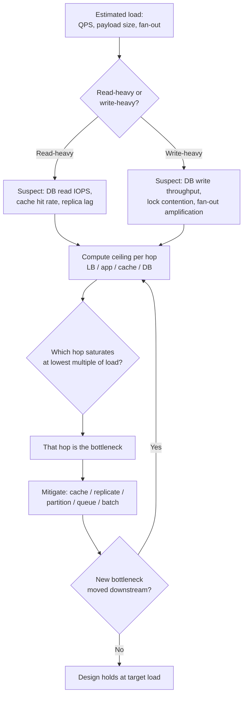
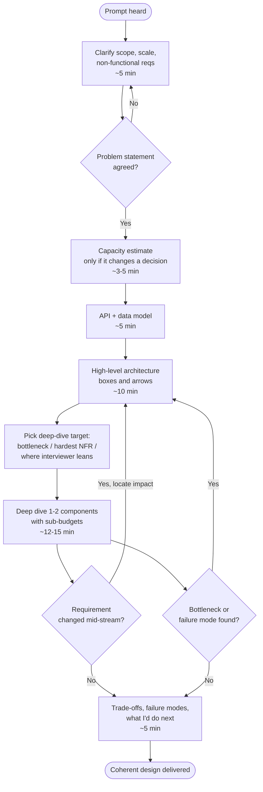

# How to Approach System Design — Interview Questions

This page drills the *process* of system design, not any specific system. The questions below test whether you have a repeatable method: how you open a problem, where you spend your minutes, when you reach for math, how you pick what to deep-dive, how you recover when you stall, and how you behave when the interviewer moves the goalposts. Strong answers are concrete about the method and show judgment under time pressure.

## Table of Contents

1. [Junior Questions](#junior-questions)
2. [Middle Questions](#middle-questions)
3. [Senior Questions](#senior-questions)
4. [Professional / Deep-Dive Questions](#professional--deep-dive-questions)
5. [Staff / Judgment Questions](#staff--judgment-questions)
6. [The 45-Minute Timeline at a Glance](#the-45-minute-timeline-at-a-glance)

---

## Junior Questions

**Q1: What are the very first things you do when you hear a design prompt like "Design Twitter"?**

> I do not draw anything for the first few minutes. The prompt is intentionally one sentence, and that sentence hides ninety percent of the actual problem. My first move is to *scope the problem into something buildable in 40 minutes* by asking clarifying questions in three buckets:
>
> 1. **Functional scope** — which features are in and out? For "Twitter" I'd confirm: post a tweet, follow users, and view a home timeline. I'd explicitly defer search, DMs, notifications, trends, and ads unless asked. I say this out loud: "I'll focus on tweet, follow, and timeline; is that the right core?"
> 2. **Scale** — how many users, how many reads vs writes, how big is the working set? This decides whether the answer is "one Postgres box" or "fan-out across a fleet."
> 3. **Constraints / non-functional** — latency targets, consistency expectations, availability bar. "Is a few seconds of staleness on the timeline acceptable?" almost always returns *yes*, and that single answer unlocks caching and async fan-out.
>
> The goal of this opening is a written, agreed problem statement on the board. Designing the wrong system perfectly is the most common way juniors fail.

**Q2: Why is asking questions better than immediately proposing an architecture?**

> Because a system design interview is a *collaboration simulation*, not a quiz. Jumping straight to "I'll use Kafka and Cassandra" signals that I pattern-match buzzwords instead of reasoning from requirements. The interviewer planted ambiguity on purpose to see if I notice it. Every clarifying question also does double duty: it narrows scope so I can finish in time, and it surfaces the constraint that will drive the interesting trade-off later. A good question like "are reads or writes dominant?" isn't filler — it's the question whose answer determines the entire data flow.

**Q3: How do you structure the 45 minutes so you don't run out of time?**

> I keep a rough budget in my head and announce my plan at the start so the interviewer can steer. My default split:
>
> | Phase | Minutes | Output |
> |---|---|---|
> | Clarify requirements & scope | 5 | Agreed feature list + scale numbers |
> | Capacity estimate (if it matters) | 3–5 | QPS, storage, bandwidth ballparks |
> | API + data model | 5 | A few endpoints, core entities |
> | High-level architecture | 10 | Boxes-and-arrows diagram |
> | Deep dive on 1–2 components | 12–15 | The actual engineering |
> | Bottlenecks, failures, wrap-up | 5 | Trade-offs, what I'd do next |
>
> The numbers flex, but the *order* is fixed: requirements before estimates before APIs before architecture before deep dive. I never deep-dive before I have a high-level picture, and I leave 5 minutes at the end on purpose so I'm not cut off mid-sentence.

**Q4: What is a back-of-the-envelope estimate and why bother doing one?**

> It's a rough calculation — accurate to within an order of magnitude — of the load the system must handle: requests per second, storage per year, bandwidth, and memory for caching. I bother because the *numbers choose the architecture*. If a design is 100 writes/second, a single primary database is fine and anything fancier is over-engineering. If it's 1,000,000 writes/second, I need partitioning, queues, and async processing. Without the estimate I'm guessing which regime I'm in, and guessing wrong makes the rest of the design either over-built or under-built.

**Q5: Should you draw the diagram first or talk first?**

> Talk first, then draw to anchor what I just said. I start a box-and-arrows diagram only after requirements are agreed, because the diagram is a shared artifact we both point at for the rest of the interview. I keep it deliberately simple at first — client, load balancer, app server, database, cache — and add boxes as the conversation justifies them. A diagram that appears before the requirements is a diagram of a system nobody agreed to build.

---

## Middle Questions

**Q6: How do you decide *which* component to deep-dive when you can't cover everything in time?**

> I deep-dive where the *risk and the interest* concentrate, not where I'm most comfortable. My selection heuristic, in order:
>
> 1. **The bottleneck the scale numbers point to.** If reads are 1000× writes, the read path (caching, replicas, timeline materialization) is where the design lives or dies — so that's the dive.
> 2. **The component that satisfies the hardest non-functional requirement.** If the prompt stresses "must never lose a message," I dive into delivery guarantees and durability, not the UI.
> 3. **Where the interviewer leans in.** I watch for the follow-up question — "how does the timeline stay fresh?" is an explicit invitation, and I take it.
>
> I also *ask*: "There are three areas I could go deep on — fan-out, the cache, or storage partitioning. Which is most interesting to you?" That hands the steering wheel to the interviewer for one beat and guarantees I spend my best minutes on what they're grading.

**Q7: When in the interview do you run the capacity estimate, and when do you skip it?**

> I run it right after requirements, *before* committing to an architecture, because its whole purpose is to inform that architecture. I skip or shrink it when the prompt is explicitly about a design pattern rather than scale — for example "design a rate limiter" cares more about the algorithm than about petabytes. But even then I'll do a 30-second sanity check ("at 10k QPS, can a single Redis instance hold the counters?") because that one number can still flip a decision. The rule: estimate when a number would change my design; don't perform ritual math that changes nothing.

**Q8: The interviewer changes a requirement mid-design — "actually, assume 50× the traffic." How do you handle it?**

> I treat it as the real test, not an annoyance — they're probing whether my design has *give*. My move is explicit:
>
> 1. **Acknowledge and locate the impact.** "50× traffic — that pushes us from ~2k to ~100k writes/second, so the single primary I sketched is now the bottleneck."
> 2. **Name what breaks first.** I point at the specific box that saturates: "The database write path falls over before anything else."
> 3. **Adapt incrementally.** I don't tear up the diagram. I introduce a write-ahead queue to absorb bursts, then partition the database by user ID, and call out the new cost — cross-partition queries get harder.
> 4. **State the new trade-off.** "We bought write throughput; we paid with eventual consistency on aggregate reads."
>
> Reacting smoothly to a moved requirement is worth more than the original design, because production requirements move constantly.

**Q9: What does "driving the conversation" actually look like, concretely?**

> It means *I* hold the structure and narrate where we are, instead of waiting to be asked the next question. Concretely:
>
> - I state the plan up front: "I'll clarify, estimate, sketch the high level, then go deep on the timeline."
> - I signal transitions: "Requirements look settled — let me size the load before I draw."
> - I offer choices instead of going silent: "I see two ways to do fan-out; let me lay out both and pick."
> - I check in without surrendering control: "Does that scope match what you had in mind?"
>
> The interviewer should feel like a passenger giving occasional directions, not a driver dragging answers out of me. Silence and waiting are the opposite of driving.

**Q10: How do you present a trade-off so it sounds like engineering and not hand-waving?**

> I name the **two options, the axis they trade on, the number that decides it, and my pick with a reason.** Weak: "We could use SQL or NoSQL." Strong: "For the timeline I'll denormalize into a per-user feed cache. That trades storage and write amplification — every tweet fans out to all followers — for sub-10ms reads. Given reads outnumber writes 1000:1, paying on the rare write to make the common read cheap is the right deal." The structure — option A vs B, the axis (write cost vs read latency), the decisive number (1000:1), and a justified choice — is what makes it sound senior.

**Q11: How do you keep the design simple instead of bolting on every technology you know?**

> I start with the simplest thing that meets the agreed requirements and add complexity *only when a number forces it*. My internal checklist before adding any component: "What requirement does this satisfy that the current design fails?" If I can't answer with a specific number or constraint, the component is decoration and I drop it. A monolith plus one database plus a cache handles a shocking amount of load; I introduce queues, shards, and services as the estimate demands them, narrating the trigger each time: "We cross ~50k QPS here, which is why I'm adding the queue."

---

## Senior Questions

**Q12: How do you actually find the bottleneck in a design rather than guessing?**

> I trace a single request end to end and ask, at each hop, "what is the limiting resource and what's its ceiling?" The bottleneck is the hop that saturates first under the estimated load. I reason through it systematically — here's the mental model I walk through:

> The discipline is to *quantify each hop's ceiling* — a primary doing ~5k writes/s, a Redis node doing ~100k ops/s, a NIC doing ~10 Gbps — and compare against the estimated demand. Whichever hits its ceiling at the lowest multiple of current load is the bottleneck. I also remember that fixing one bottleneck just moves it downstream, so I re-run the trace after each mitigation. Saying "I think the database is the bottleneck" without the ceiling number is a guess; "the primary tops out near 5k writes/s and we need 30k, so it's the bottleneck" is engineering.

**Q13: You've gone completely blank in the middle of the interview. How do you recover?**

> I have a recovery routine so a stall is a pause, not a collapse:
>
> 1. **Narrate back to firm ground.** "Let me restate where we are: we've agreed on the timeline read path, and I'm deciding between push and pull fan-out." Re-summarizing reloads my own working memory and buys time without dead air.
> 2. **Return to requirements.** When the design feels tangled, the requirements list is the anchor. "What does the system actually need here? Reads must be fast and slightly stale is fine — so the answer is cache the materialized feed." The requirement usually dictates the next move.
> 3. **Reason from first principles out loud.** "Forget what the standard solution is — what's the limiting resource, and what's the cheapest way to relieve it?" Thinking aloud lets the interviewer hint, and an interviewer hint isn't a penalty; refusing to think aloud is.
> 4. **Decompose.** If the whole feels too big, I pick the smallest sub-problem — "how does one tweet reach one follower?" — and solve that, then generalize.
>
> The worst recovery is silence. Visible structured thinking, even while stuck, reads as competence.

**Q14: How do you balance breadth and depth — covering the whole system versus going deep?**

> Breadth first to *prove I see the whole system*, then depth to *prove I can build a hard part*. I lay out the complete high-level diagram so nothing critical is missing — that's the breadth pass, and an interviewer who sees a gap will steer me there. Then I deliberately pick one or two components and go to production depth: schema, partition key, failure modes, the actual data structure. A design that's all breadth reads as shallow; one that's all depth on the first component I happened to like reads as someone who can't prioritize. The signal of seniority is choosing *where* to be deep on purpose and saying why.

**Q15: When does it make sense to *not* do a capacity estimate, or to do a minimal one?**

> When the architecture is determined by something other than raw scale. Three cases: (1) the prompt is algorithm-shaped — "design a URL shortener's key generation" turns on collision math, not QPS; (2) the prompt is correctness-shaped — "design a distributed lock" turns on consistency and fencing, where throughput is secondary; (3) numbers are explicitly given, so I skip deriving and go straight to using them. Even then I do a *targeted* one-line estimate to validate a specific decision. The anti-pattern is performing full storage-and-bandwidth math on a problem where no number I produce changes a single box — that just burns minutes I need for the deep dive.

**Q16: How do you tell a strong candidate's process from a weak one's, if you were the interviewer?**

> | Dimension | Weak process | Strong process |
> |---|---|---|
> | Opening | Jumps to architecture / buzzwords | Clarifies scope and scale first |
> | Estimation | Skips it or does ritual math | Estimates only what changes a decision |
> | Direction | Waits to be asked next question | Narrates plan, signals transitions |
> | Trade-offs | "We could use X or Y" | Names axis, decisive number, justified pick |
> | Depth choice | Deep-dives the familiar part | Deep-dives the bottleneck / hardest NFR |
> | Requirement change | Freezes or restarts | Locates impact, adapts incrementally |
> | When stuck | Goes silent | Restates, returns to requirements, reasons aloud |
> | Tech choices | Adds components for their own sake | Adds only when a number forces it |
>
> The single biggest tell: a strong candidate is *driving* — they own the structure and could finish a coherent design even if I said nothing for ten minutes. A weak candidate needs me to pull each step out of them.

**Q17: How do you handle a requirement you genuinely don't know how to satisfy?**

> I say so honestly and then show how I'd *attack the unknown*, because nobody knows every system and faking it is instantly visible. "I haven't built exactly-once delivery before — let me reason about what it requires." Then I decompose: dedup needs idempotency keys, idempotency needs a store of seen IDs, that store needs its own scaling story. I'll state my assumptions, propose the most likely approach, and explicitly flag it as the part I'd validate first in real life. Reasoning toward an unfamiliar requirement from first principles is exactly the senior skill the interview is measuring; pretending to know is the failure.

---

## Professional / Deep-Dive Questions

**Q18: Walk through how you'd time-box the deep-dive phase itself so one component doesn't eat the whole interview.**

> The deep dive is the highest-value phase, so I protect it with internal sub-budgets and a hard exit. For a ~13-minute dive I run roughly: 3 minutes framing the sub-problem and its requirement, 6–7 minutes on the core mechanism (data structure, partition strategy, failure handling), and 3 minutes on its trade-offs and failure modes. I set a mental checkpoint: "if I'm not at trade-offs by the two-minute warning, I summarize and stop." The discipline is recognizing when I've made the point — once I've shown I can design the fan-out cache correctly, drilling its tenth edge case has diminishing returns versus showing breadth elsewhere. I'd rather give a complete picture with one well-executed deep dive than a half-built second one. I narrate the exit: "I'll stop the cache here; it's solid — let me make sure the failure story across the system holds together."

**Q19: How do you decide between adding depth versus addressing a failure mode the interviewer hasn't raised?**

> I weigh which one better proves I think about production. If my deep dive has already demonstrated mechanical competence, proactively raising a failure mode — "what happens when this cache node dies mid-write?" — is usually the higher-value move, because it shows operational maturity that juniors skip entirely. I scan the diagram for single points of failure, unbounded queues, retry storms, and split-brain risk, and I name the one most likely to actually page someone at 3am. The judgment is to volunteer the failure mode that's *realistic and severe*, not to recite a generic checklist. Raising "what if the entire datacenter floods" when the real risk is replica lag wastes the credibility I'm trying to build.

**Q20: An interviewer keeps pushing back on every choice you make. How do you read it and respond?**

> Pushback is almost always a *probe*, not a verdict — they want to see whether I hold a defensible position under pressure or fold instantly. My response depends on the merit:
>
> - **If the pushback is valid,** I concede crisply and adapt: "You're right that synchronous fan-out won't scale to celebrity accounts — let me special-case high-follower users with pull-on-read." Conceding to a real problem is strength, not weakness.
> - **If my choice still holds,** I defend it with the reason and the number, not stubbornly: "I'd keep the queue here — without it a write spike takes down the database directly, and the added latency is acceptable given our staleness budget. But if you're worried about the operational cost, the alternative is..."
>
> The trap is treating every push as a command to reverse course; that signals I never had conviction. The other trap is digging in on a genuinely wrong choice. Reading *which* kind of pushback it is — and showing I can both defend and concede appropriately — is the actual skill being tested.

**Q21: How do you allocate time across a hybrid prompt that has both a heavy algorithmic core and a heavy scaling story — say, "design a real-time leaderboard"?**

> I identify which half carries more of the grade and weight my deep dive there, but I never drop the other half to zero. For a leaderboard, the algorithmic core — maintaining a sorted set with O(log n) updates and fast rank queries — and the scaling core — sharding the leaderboard and merging shard-local rankings — are both essential, so I split the deep dive. I spend the first half on the in-memory ranking structure (a Redis sorted set, why it beats a SQL ORDER BY at write-heavy scale), then pivot to "now there are 100M players across regions — how do I shard and still answer global top-100?" I announce the pivot so the interviewer knows I'm consciously covering both. The failure mode here is sinking all 13 minutes into the elegant data structure and never confronting the distributed-merge problem, which is where the real difficulty lives.

**Q22: How do you keep your estimates honest and useful instead of fake-precise?**

> I round aggressively to powers of ten, carry units explicitly, and only compute the number that drives a decision. "300M daily active users, each posting twice, is 600M writes/day — over ~10^5 seconds in a day that's ~6,000 writes/second average, call it ~30,000 at peak." Then I immediately *use* it: "30k writes/s exceeds a single primary, so I partition." I never chase a falsely precise 6,247 writes/second — the order of magnitude is what selects the architecture, and pretending to more precision wastes time and invites correction. I also state my assumptions out loud (peak is ~5× average, a day is ~10^5 seconds) so the interviewer can correct an input rather than mistrust the whole calculation. An estimate that doesn't end in a design decision was theater.

---

## Staff / Judgment Questions

**Q23: At staff level, the prompt is deliberately vague — "design the next version of our checkout system." How does your approach change from a clean greenfield prompt?**

> The method gets *more* about requirements discovery and *less* about reciting an architecture, because the hardest part is figuring out what problem we're actually solving. My approach shifts in three ways:
>
> 1. **I invest more up front in context, not features.** "What's wrong with the current checkout — is it latency, conversion drop-off, payment-provider lock-in, or maintainability?" The motivation determines whether this is a performance project, a reliability project, or a re-platforming, and those are entirely different designs.
> 2. **I surface constraints that come from the existing world.** Migration from the live system, backward compatibility with current order data, and not breaking in-flight transactions are usually the real engineering, more than the happy-path architecture.
> 3. **I optimize for an incremental, reversible rollout.** A staff answer doesn't propose a big-bang rewrite; it proposes a strangler-fig path — route a slice of traffic to the new flow behind a flag, validate, expand. The judgment being tested is whether I can deliver change to a system people already depend on, not whether I can draw a clean diagram from scratch.

**Q24: How do you decide when the right answer to a design question is "we shouldn't build this" or "the simple version is correct"?**

> I treat "don't build it" and "the boring version is right" as legitimate, sometimes optimal answers, and I'm willing to defend them — that willingness is itself a senior signal. My triggers:
>
> - **The scale doesn't justify the complexity.** If the estimate says 50 requests/second, proposing a sharded, multi-region, event-sourced platform is a red flag about my judgment, not a strength. I'll say plainly: "At this load, a single well-indexed Postgres instance with a read replica is correct, and anything more is cost and operational burden with no payoff."
> - **The complexity buys a requirement nobody has.** If there's no consistency or availability requirement that forces it, I don't add consensus protocols, exactly-once semantics, or microservices to look sophisticated.
> - **The honest answer is a buy, not a build.** Sometimes the right call is a managed service or an existing system, and the interesting design work is integration and failure handling around it.
>
> The maturity being graded is matching the solution's complexity to the problem's actual demands. Junior engineers reach for the most impressive architecture; senior engineers reach for the *cheapest one that meets the requirements* and can articulate exactly why nothing more is needed. Knowing when to stop is as much a part of the method as knowing what to add.

---

## The 45-Minute Timeline at a Glance

The diagram below is the staged process every answer above assumes — the loop you should be able to run on any prompt. Note the explicit feedback edges: a changed requirement or a discovered bottleneck sends you *back*, not forward, and that's by design.

The phases are a budget, not a straitjacket — the loop back from the bottleneck and requirement-change checks is where real design happens. What never changes is the *ordering of concerns*: understand before you size, size before you draw, draw before you dive, and always leave the last five minutes for the trade-offs that prove you understood the cost of every choice you made.

*Next step:* [Functional vs Non-Functional Requirements](../03-functional-vs-nonfunctional/junior.md)
