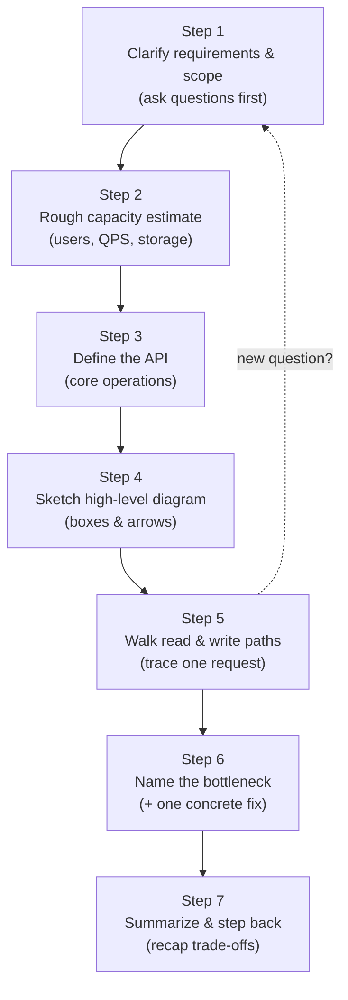
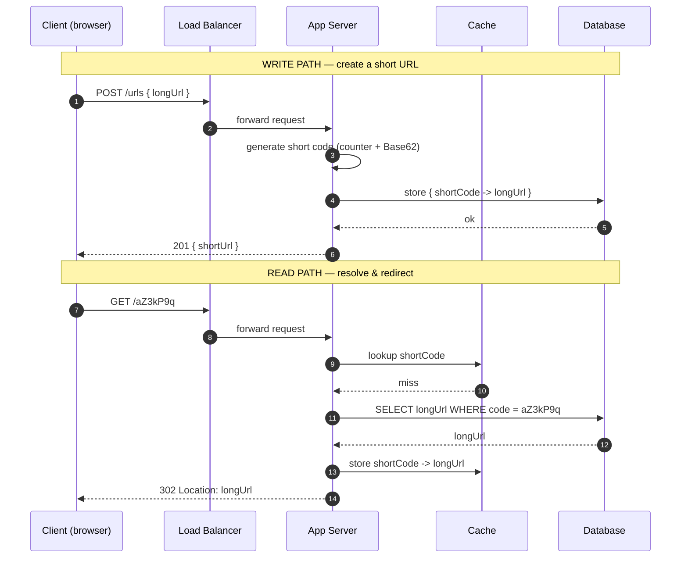

# How to Approach System Design — Junior

<!-- level-focus -->
At junior level, focus on this question:

> How can I apply **How to Approach System Design** in one small example and prove the result?

Use the smallest realistic scenario that exposes the decision and its failure behavior.
A blank whiteboard and an open-ended prompt — "Design a URL shortener" — is one of the most intimidating moments in an engineer's early career. The fear is rarely about not knowing the components. It is about not knowing *where to start*. This page gives you a calm, repeatable method: a fixed sequence of seven steps you can run every single time, on any problem, even when your mind goes blank.

The single most important idea: **do not jump to a solution.** The first sentence out of your mouth should be a question, not a database name. A junior who quietly draws "Cassandra + Kafka + Redis" in the first thirty seconds looks less competent than one who slowly asks "How many users? Read-heavy or write-heavy?" Designing is a conversation, not a recital.

We will carry one running example — a basic **URL shortener** (think `bit.ly`) — through all seven steps so you see the method applied end to end, not just described.

## 1. The Mindset Before the Method

Three beliefs separate a calm designer from a panicked one.

**There is no single right answer.** A design interview is not a leetcode problem with a hidden test case. It is an open exploration of trade-offs. The interviewer wants to see *how you reason*, not whether you reproduced their favorite architecture. Two completely different designs can both be "correct" if you can justify them.

**Requirements come before solutions, always.** Building before you understand the problem is the number-one mistake. If you do not know whether the system serves 100 users or 100 million, you literally cannot make a single good decision. Every component choice depends on numbers and constraints you do not have yet — so go get them.

**Talking is part of the work.** In real engineering, a design that lives only in your head is worthless; it has to be communicated, reviewed, and agreed on. In an interview, silence is invisible thinking, and invisible thinking earns no credit. Narrate. Say "I'm choosing X because Y, but if Z were true I'd reconsider." That sentence alone demonstrates senior reasoning.

Keep these three in your pocket. The seven steps below are simply a structured way to *act* on them.

---

## 2. The Seven-Step Method at a Glance

Here is the entire method on one screen. Memorize the order; the details come later.



The dotted arrow matters: the method is *mostly* linear, but you are allowed to loop back. If walking the read path in Step 5 reveals a requirement you forgot to clarify, go ask it. Good designers revisit; they do not pretend the early steps were perfect.

A reasonable time budget for a 45-minute exercise:

| Step | What you do | Rough time |
| --- | --- | --- |
| 1 | Clarify requirements & scope | 5–8 min |
| 2 | Capacity estimate | 3–5 min |
| 3 | Define the API | 3–5 min |
| 4 | High-level diagram | 5–8 min |
| 5 | Walk read & write paths | 8–10 min |
| 6 | Bottleneck + one fix | 5–8 min |
| 7 | Summarize | 2–3 min |

Notice that clarifying plus diagramming plus walking the paths is the bulk of the time. That is correct. The thinking is the deliverable.

---

## 3. Step 1 — Clarify Requirements and Scope

Before a single box is drawn, you turn a vague prompt into a concrete, bounded problem. You do this by asking questions and writing the answers down where everyone can see them.

Split requirements into two buckets:

- **Functional requirements** — what the system *does*. Verbs and features.
- **Non-functional requirements** — how *well* it does them. Scale, latency, availability, consistency.

For our URL shortener, a junior who asks good questions might produce this:

**Functional (the features we will support):**
1. Given a long URL, return a short URL.
2. Given a short URL, redirect the user to the original long URL.

**Functional (explicitly *out* of scope — say these out loud too):**
- Custom aliases (user picks `bit.ly/my-name`) — *skip for v1.*
- Analytics dashboards (click counts) — *skip for v1.*
- User accounts and link management — *skip for v1.*

Stating what you will *not* build is a senior move. It shows you can scope, and it stops the problem from sprawling.

**Non-functional (the qualities that shape the design):**

| Question to ask | Example answer | Why it matters |
| --- | --- | --- |
| How many users / how much traffic? | ~100M new links/month | Drives storage & QPS math |
| Read-heavy or write-heavy? | Read-heavy (~100:1) | Decides where to add caching |
| How fast must redirects be? | Under ~100 ms | Pushes us toward caching |
| How long do links live? | ~5 years | Sets total storage budget |
| Can a redirect ever fail? | Should be highly available | Favors replication |
| Must two shortenings of the same URL match? | No, uniqueness not required | Simplifies write path |

You will not get clean answers to all of these — sometimes the interviewer says "you decide." That is fine. When you decide, *state your assumption explicitly*: "I'll assume reads dominate writes about 100 to 1, since people share a link once and click it many times." Now your later choices have a documented justification.

The output of Step 1 is a short written list of features and a handful of numbers/assumptions. Do not move on until you have it. Everything downstream depends on it.

---

## 4. Step 2 — A Rough Capacity Estimate

Now turn the scale answers into back-of-the-envelope numbers. The goal is **order of magnitude**, not precision. Whether the answer is 1,000 requests per second or 1,000,000 changes the design completely; whether it is 1,000 or 1,200 changes nothing.

Use round numbers and simple unit conversions. A few constants worth memorizing:

| Constant | Approximate value |
| --- | --- |
| Seconds in a day | ~86,400 ≈ 100,000 |
| Seconds in a month | ~2.5 million |
| 1 thousand | 10³ |
| 1 million | 10⁶ |
| 1 billion | 10⁹ |

**Write QPS (queries per second).** 100M new links per month ÷ 2.5M seconds per month ≈ **40 writes/second**. That is tiny. A single modest server handles this without breaking a sweat.

**Read QPS.** With a 100:1 read-to-write ratio, that is **~4,000 reads/second**. Still very manageable, but now we know reads are the side that matters — a clue we will use in Step 6. Always estimate the *peak*, not just the average; multiply the average by maybe 2–3× for busy periods, so call peak reads ~10,000/second.

**Storage.** Each record is roughly: short code (~7 bytes) + long URL (~500 bytes) + a little metadata ≈ ~600 bytes, call it ~500 bytes to keep it round. Over 5 years:

```
100M links/month × 12 months × 5 years = 6 billion links
6 × 10⁹ links × 500 bytes ≈ 3 × 10¹² bytes ≈ 3 TB
```

Three terabytes. That comfortably fits in a single well-sized database with room to spare — meaning for v1 we likely do *not* need sharding, and saying so demonstrates judgment.

**Bandwidth** is negligible here: a redirect response is tiny (a few hundred bytes of HTTP headers), so even 10,000 reads/second is only a few MB/s.

State each number as you compute it: "About 40 writes per second, 4,000 reads per second, and roughly 3 terabytes over five years — so this is a read-heavy system that fits on modest hardware." That one sentence frames every decision that follows.

For deeper estimation technique, the dedicated estimation topic in this section covers the arithmetic shortcuts in detail. Here, rough is enough.

---

## 5. Step 3 — Define the API and Core Operations

Before drawing servers, decide what the system actually *offers* to the outside world. The API is the contract; everything inside exists to serve it. Defining it now forces clarity about inputs, outputs, and the two core operations.

For the URL shortener, the functional requirements map directly to two operations:

**Create a short URL** — a write.

```
POST /urls
Request body:  { "longUrl": "https://example.com/some/very/long/path?x=1" }
Response 201:  { "shortUrl": "https://sho.rt/aZ3kP9q" }
```

**Resolve a short URL** — a read. This is just the redirect a browser performs.

```
GET /{shortCode}
Example:       GET /aZ3kP9q
Response 302:  Location: https://example.com/some/very/long/path?x=1
```

Two things worth naming out loud:

- **The redirect uses HTTP 302 (or 301).** A 301 is a *permanent* redirect, which browsers and proxies cache aggressively — fast, but you lose the ability to ever change or count that link. A 302 is *temporary*; the browser asks every time, which costs a round trip but keeps control on your server. For v1, mention both and pick 302 if you ever want analytics later, 301 if raw speed wins.
- **How is the short code generated?** This is the heart of the write path. Two simple beginner-friendly options:

| Approach | How it works | Pros | Cons |
| --- | --- | --- | --- |
| Hash the URL | Take MD5/SHA of the long URL, keep first 7 chars | Stateless, no counter | Collisions possible; must check & retry |
| Counter + Base62 | A global incrementing number, encoded into `[a-zA-Z0-9]` | No collisions; short codes | Needs a shared, coordinated counter |

You do not have to solve this perfectly. Saying "I'll start with a counter encoded in Base62 because it guarantees uniqueness, and note that the counter itself becomes a coordination point we'd have to scale later" is exactly the level of awareness expected.

Why Base62 and 7 characters? Base62 means each character is one of 62 symbols, so 7 characters give 62⁷ ≈ 3.5 trillion possible codes — far more than the 6 billion links we estimated, so 7 characters is plenty. This is a nice moment to connect Step 2's numbers to Step 3's design.

The output of Step 3 is a tiny, concrete list of endpoints with their inputs and outputs. Keep it small — two operations is correct for v1.

---

## 6. Step 4 — Sketch a High-Level Diagram

Now, and only now, you draw boxes. The high-level diagram shows the major components and how a request flows between them. Keep it simple: a junior diagram with five or six boxes that you can explain is far stronger than fifteen boxes you cannot.

Start with the smallest thing that works, then add only what the requirements justify. Our minimum viable shape:

- A **client** (the user's browser).
- A **load balancer** spreading traffic across application servers.
- One or more **application servers** running our API logic.
- A **database** storing the `shortCode → longUrl` mapping.
- A **cache** in front of the database for the hot read path (we know reads dominate).



As you draw, explain each box in one sentence and *why it earns its place*:

- "The load balancer lets me run several app servers, so one machine failing doesn't take the system down."
- "The app servers are **stateless** — they hold no per-user data — so I can add more of them freely. State lives in the database and cache."
- "The cache sits in front of the database because we estimated reads outnumber writes 100 to 1, and the same popular links get clicked over and over."

That word **stateless** is worth saying explicitly. Stateless servers are the foundation of horizontal scaling, and naming it early signals you understand *why* this shape scales. If you cannot yet justify a box, do not draw it.

---

## 7. Step 5 — Walk the Read and Write Paths

A diagram is a static picture. Now you bring it to life by tracing exactly what happens for one request of each type. This is where you catch gaps — and where interviewers learn whether you actually understand your own design.

**The write path** (creating a short URL), step by step:

1. Browser sends `POST /urls` with the long URL; it hits the load balancer.
2. The load balancer forwards to any available app server.
3. The app server generates a unique short code (next counter value → Base62).
4. The app server writes the `shortCode → longUrl` row to the database.
5. The app server returns `201` with the assembled short URL.

A natural question to raise yourself: *what if the same long URL is submitted twice?* For v1 we decided uniqueness is not required, so we happily create two different codes — and saying "I'm deliberately allowing duplicates to keep the write path simple" shows you remember your own Step 1 decisions.

**The read path** (resolving and redirecting), step by step:

1. Browser sends `GET /aZ3kP9q`; load balancer forwards it.
2. App server checks the **cache** first.
3. **Cache hit:** return the long URL immediately as a `302`. Fast, no database touch.
4. **Cache miss:** query the database for the code.
5. App server stores the result in the cache (so the *next* request is a hit), then returns the `302`.

This cache-first pattern is called **cache-aside** (or lazy loading): the application checks the cache, falls back to the database on a miss, and populates the cache for next time. You do not need the formal name to use it, but mentioning it is a nice touch.

One more question to ask out loud: *what if the code doesn't exist at all* (someone typed a random URL)? Return a `404`. Handling the unhappy path, not just the happy one, is a hallmark of careful design.

Walking both paths slowly, narrating each hop, is often the most impressive part of a junior interview — because it proves the boxes in your diagram are connected by real reasoning, not decoration.

---

## 8. Step 6 — Name the Obvious Bottleneck and One Fix

No first design is perfect, and your interviewer knows it. The skill being tested here is *self-critique*: can you look at your own diagram and find the part most likely to break first? You do not need ten optimizations. You need to name **one** real bottleneck and propose **one** concrete fix, with a sentence of justification.

Walk your own design and ask "what breaks first as traffic grows?" For the URL shortener, several honest candidates exist:

| Candidate bottleneck | Why it's a concern | A simple first fix |
| --- | --- | --- |
| Database read load | 10,000 peak reads/sec all hitting one DB | Cache (already added) + read replicas |
| The single counter | One shared counter for code generation is a coordination point | Hand each server a *range* of IDs to allocate locally |
| One database node | All 3 TB and all traffic on one machine | Add read replicas; shard later if it grows |
| Cache failure | If the cache dies, every read hits the DB at once | Replicate the cache; warm it gradually |

Pick the one that matters most for *your* stated requirements. Since we are read-heavy, the strongest answer is: **"The database read path is the bottleneck. My first fix is the cache I already drew, because the same popular links are requested repeatedly — a small cache serves a large share of traffic. If that's not enough, I add read replicas so reads spread across several database copies."**

That answer is excellent at the junior level because it (a) identifies a *specific* bottleneck tied to your own numbers, (b) proposes a concrete fix, and (c) hints at the *next* fix without over-engineering. You are not expected to design a globally distributed system. You are expected to show you know where the pressure is and have a sensible first move.

Resist the urge to fix everything. If you list ten optimizations, you look like you are reciting a checklist. One well-justified fix, clearly tied to your capacity estimate, beats ten name-dropped technologies.

---

## 9. Step 7 — Summarize and Step Back

End deliberately. A strong close pulls the threads together and shows you can see the whole system, not just the part you just drew. Spend two or three minutes on a verbal recap:

1. **Restate the problem and scope.** "We designed a read-heavy URL shortener supporting create and redirect, with custom aliases and analytics explicitly out of scope."
2. **Recap the shape.** "Clients hit a load balancer, then stateless app servers, which read through a cache to a database storing the code-to-URL mapping."
3. **Name the key trade-off you made.** "I chose a counter-plus-Base62 code generator for guaranteed uniqueness, accepting that the counter is a coordination point we'd scale by handing out ID ranges."
4. **Acknowledge what you'd do next with more time.** "If we needed more scale, the next steps are read replicas and eventually sharding the database, plus a strategy for cache failures."

That fourth point is important: openly naming the limits of your v1 is *strength*, not weakness. It tells the interviewer you know the design is a starting point and you understand the path forward. Designs are never "finished" — they are "good enough for the stated requirements, with a known direction for growth." Closing this way leaves exactly the right impression.

---

## 10. The Method as a State Machine

It helps to picture the whole process as a small state machine you can always re-enter. You are never lost; you are always in one of these states, and you always know the next one.

The two back-arrows capture the truth that real design is iterative. Walking the paths might surface a forgotten requirement — go re-clarify. Proposing a fix might add a box — go update the diagram. You move forward most of the time, but you are allowed, and expected, to loop back when reality demands it. The machine never traps you.

---

## 11. Do and Don't — A Beginner's Table

Internalize these. Almost every weak junior performance comes from violating one of the "don'ts" in the right column.

| Do | Don't |
| --- | --- |
| Ask clarifying questions before drawing anything | Start naming databases in the first thirty seconds |
| State your assumptions out loud and write them down | Make silent decisions the interviewer can't follow |
| Use round numbers; aim for order of magnitude | Chase precise arithmetic to three decimal places |
| Start with the simplest design that works | Open with a microservices-plus-Kafka mega-diagram |
| Justify every box with one sentence | Add components because they "sound scalable" |
| Trace one real request through the system | Leave the diagram as disconnected, unexplained boxes |
| Name one bottleneck and one concrete fix | List ten optimizations you can't justify |
| Say "I don't know, here's how I'd find out" | Bluff with buzzwords you can't explain |
| Keep talking — narrate your reasoning | Go silent and think privately for two minutes |
| Treat it as a collaborative conversation | Treat it as a one-way recital to defend |

If you only remember one row: **ask questions first, draw second.** That single habit fixes the most common and most damaging junior mistake.

---

## 12. Thinking Out Loud — Why It Matters

A design exercise evaluates your *reasoning*, and reasoning that stays inside your head is unevaluable. Narration is not optional polish; it is the actual signal being measured.

Concretely, thinking out loud does four things for you:

- **It earns partial credit.** Even if your final design has a flaw, a clearly reasoned path to it shows competence. Silence followed by a wrong box shows nothing.
- **It invites course-correction.** When you say "I'm leaning toward hashing the URL for codes," an interviewer who sees a problem can nudge you. Silent designers miss these lifelines.
- **It demonstrates collaboration.** Real design happens in rooms with other engineers. Showing you can reason aloud and take input is itself a senior trait.
- **It slows you down productively.** Speaking forces you to make each decision explicit, which catches the leaps where you assumed something you never verified.

Useful sentence templates to keep handy:

- "Before I design anything, let me clarify a few things…"
- "I'll assume X — is that reasonable?"
- "I'm choosing X over Y because of requirement Z."
- "The weakest part of this so far is X; here's how I'd shore it up."
- "With more time, the next thing I'd improve is…"

These are not tricks. They are the externalized form of genuine engineering thought. Practice them until they are automatic, and a blank whiteboard stops being frightening.

---

## 13. Hands-On Exercise

Time-box this to 30 minutes. Use paper or a whiteboard — no looking up architectures. The point is to *run the method*, not to produce a perfect answer.

**Prompt:** Design a basic **Pastebin** — a service where a user submits a block of text and gets back a short URL; anyone visiting that URL sees the text.

Work the seven steps in order and write a sentence or two for each:

1. **Clarify.** List two functional requirements and two things you put out of scope. Pick three non-functional questions to ask, and write your assumed answers (scale, read/write ratio, how long pastes live).
2. **Estimate.** Assume 1 million new pastes per day, each averaging 10 KB of text, kept for 1 year. Compute writes/second, reads/second (assume 10:1 read ratio), and total storage. Round aggressively.
3. **API.** Write the two endpoints: one to create a paste, one to fetch it. Decide what the create endpoint returns and what status code the fetch uses.
4. **Diagram.** Draw client, load balancer, app servers, a store for the text, and decide whether you need a cache (justify it from your read ratio). Where does the actual text live — in the same database, or somewhere else? Note that 10 KB pastes are larger than a 500-byte URL, which may push you toward object storage.
5. **Walk the paths.** Trace a create request and a fetch request, hop by hop. Handle the "paste doesn't exist" case.
6. **Bottleneck.** Name the single component most likely to strain first under your numbers, and propose one concrete fix.
7. **Summarize.** In three sentences, recap the design, the main trade-off you made, and the one thing you'd improve with more time.

**Self-check.** Did you ask questions *before* drawing? Did you write your assumptions down? Could a friend follow your diagram from your spoken explanation alone? Did you name exactly one bottleneck, not ten? If yes to all four, you have run the method correctly — the specific answer matters far less than the habit.

A nudge on the storage decision: a paste's text body is much bigger than a short URL, so a very reasonable design stores the *metadata* (id, creation time, expiry) in a database and the *text blob* in object storage, keyed by id. Reaching that on your own is a great sign. Not reaching it is fine too — the method got you close, and you'll get there with practice.

---

## 14. Key Takeaways

- **Have a fixed sequence.** Clarify → estimate → API → diagram → walk paths → bottleneck → summarize. Running the same steps every time removes the panic of the blank page.
- **Questions before solutions.** The first thing you do is ask, not draw. Requirements and numbers drive every later decision.
- **Rough numbers are enough.** Order of magnitude — thousands versus millions — is what changes a design. Don't chase precision.
- **Start simple, justify every box.** The smallest design that satisfies the requirements, with each component explained in a sentence, beats an over-engineered diagram you can't defend.
- **Trace a real request.** Walking the read and write paths proves your boxes are actually connected by reasoning.
- **One bottleneck, one fix.** Show self-critique with a single, well-justified improvement tied to your own estimates — not a checklist of buzzwords.
- **Narrate everything.** Thinking out loud is the signal being measured. Silence earns nothing; clear reasoning earns credit even when the answer is imperfect.

You now have a method you can run on any prompt, calmly, from the first second. The same seven steps that handled a URL shortener will handle a chat app, a news feed, or a ride-sharing service — the components change, the *approach* does not. Practice the steps until they feel like muscle memory, and the blank whiteboard becomes an invitation rather than a threat.

*Next step:* [Middle level](middle.md)

---

## Apply it

1. Choose one small, known input for **How to Approach System Design**.
2. Predict the output or observable behavior.
3. Run the smallest example or probe that exercises the concept.
4. Change one input to trigger a failure or boundary case.
5. Explain the evidence using the guide's vocabulary.

## Verify your work

- Record the exact input, command or code path, and output.
- Repeat the probe and confirm the result is consistent.
- Show one expected success and one expected failure.
- Resolve any difference between the prediction and the evidence.

## Review questions

- What problem does How to Approach System Design solve in the example?
- Which input changes the observed result, and why?
- What is the smallest useful success check?
- Which beginner mistake would your evidence catch?
