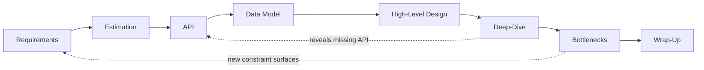
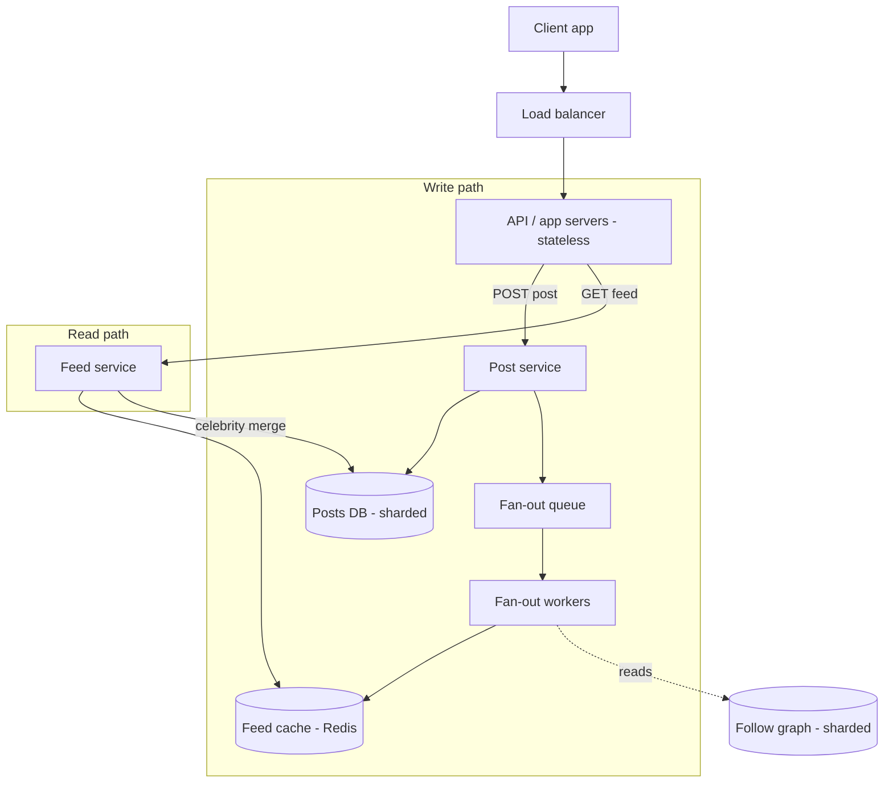

# How to Approach System Design — Middle

<!-- level-focus -->
At middle level, focus on this question:

> Where does **How to Approach System Design** belong in a maintainable component, and which trade-off selects the design?

Use the smallest realistic scenario that exposes the decision and its failure behavior.
You already know the building blocks: load balancers, caches, queues, replicas, shards, CDNs. What separates a middle engineer from a junior in a design discussion is not knowing *more* components — it is having a **reliable process** that turns a vague prompt into a defensible architecture inside a fixed time box, without freezing, rambling, or solving the wrong problem.

This page gives you that process. It is a named, repeatable framework you can run in a 45-minute interview *and* in a real design review. We carry one concrete example — a **news feed** — through every phase so you can see the method produce decisions, not just headings.

## 1. The Framework at a Glance

Several named frameworks exist — RESHADED (Requirements, Estimation, Storage, High-level, API, Detailed, Evaluation, Distinctive), the "PEDALS" loop, and the informal interview standard most engineers converge on. They are the same skeleton with different mnemonics. We will use the standard loop because its ordering mirrors how real designs are actually reasoned about:

```
Requirements → Estimation → API → Data Model → High-Level Design
             → Deep-Dive → Identify & Resolve Bottlenecks → Wrap-Up
```

The ordering is not arbitrary. Each phase produces an artifact the next phase consumes:

| Phase | Question it answers | Output artifact |
|-------|--------------------|-----------------|
| Requirements | *What* are we building, for whom, at what scale? | Scoped feature list + SLOs |
| Estimation | Does scale break the obvious design? | QPS, storage, bandwidth numbers |
| API | What does a client actually call? | Endpoint signatures |
| Data Model | How is state stored and accessed? | Tables/collections + access patterns |
| High-Level Design | How do requests flow end to end? | Boxes-and-arrows diagram |
| Deep-Dive | How does the hardest part actually work? | Detailed sub-design |
| Bottlenecks | Where does it fall over, and what's the fix? | Trade-off discussion |
| Wrap-Up | What did we decide and what's left? | Summary + future work |

The discipline that matters most: **finish a thin pass through all phases before perfecting any single one.** A complete-but-shallow design beats a beautiful authentication subsystem with no feed pipeline behind it. Breadth first, depth second.



The dotted backward arrows are intentional. The loop is *mostly* forward but you will sometimes discover, mid-deep-dive, that you missed a requirement or need a new endpoint. Going back briefly is a sign of rigor, not failure — just announce it ("this changes my read path, let me revise the data model") so the interviewer can follow.

---

## 2. The 45-Minute Budget

The single most common way to fail an otherwise-strong design interview is **time mismanagement**: 25 minutes on requirements and estimation, then a panicked, hand-wavy architecture. A budget converts the open-ended hour into a sequence of short sprints. Treat these as soft targets — glance at the clock at each boundary.

| Phase | Minutes | Cumulative | Goal of the phase |
|-------|---------|-----------|-------------------|
| Requirements | 5 | 0–5 | Pin functional scope + 2–3 key non-functionals |
| Estimation | 3 | 5–8 | Only the numbers that drive a decision |
| API | 4 | 8–12 | 3–5 core endpoints, signatures only |
| Data Model | 5 | 12–17 | Entities, keys, and access patterns |
| High-Level Design | 8 | 17–25 | Draw the full end-to-end flow |
| Deep-Dive | 12 | 25–37 | Solve the 1–2 hardest components |
| Bottlenecks | 5 | 37–42 | Find limits, propose fixes |
| Wrap-Up | 3 | 42–45 | Summarize, name trade-offs and next steps |

Three rules make the budget hold:

- **The deep-dive is where you win.** It gets the largest single block (12 min). Everything before it exists to *set up* a credible deep-dive. If you are running long early, compress requirements and estimation — never the deep-dive.
- **Estimation is a *tool*, not a ritual.** Three minutes, and only if a number will change a decision (see Phase 2). Skip the arithmetic theater.
- **Always leave the wrap-up.** Even if you are behind, stop at minute 42 and summarize. An interviewer's notes are written from your wrap-up; an abrupt cutoff with no synthesis reads as "didn't finish."

For a real design review (not an interview), the same proportions hold but the absolute time expands to hours or days. The value is the *ratio*: spend the bulk of effort on the genuinely hard component, not on re-deriving that you need a load balancer.

---

## 3. Phase 1 — Requirements (Functional, Non-Functional, Scope)

**You drive this phase.** The prompt ("Design a news feed") is deliberately under-specified. Your job is to convert it into a concrete, bounded problem by asking targeted questions and stating assumptions out loud. Silence here is the worst option; a wrong assumption stated aloud is fine because it can be corrected.

Split requirements into three buckets:

**Functional requirements** — what the system *does*, as verbs the user performs:

- A user can **post** content (text, image, link).
- A user can **follow** other users.
- A user can **view a feed** of recent posts from people they follow, newest-relevant first.
- A user can **like** and **comment** (note these; decide if in-scope).

**Non-functional requirements** — the *qualities* the system must have. These shape the architecture far more than the feature list does:

- **Read-heavy.** Feed views vastly outnumber posts (often 100:1). This single fact justifies a fan-out / precomputed-feed design.
- **Availability over strong consistency.** A feed that's a few seconds stale is fine; a feed that's *down* is not. We accept eventual consistency.
- **Low read latency.** Target p99 feed load under ~200 ms.

**Scope / out-of-scope** — explicitly cut things to fit the time box:

- In scope: posting, following, feed generation, feed read.
- Out of scope (state these): ranking ML, ads, notifications, direct messages, media transcoding. "I'll assume a simple reverse-chronological feed with light relevance; ML ranking is out of scope for today."

A good middle-level move is to **anchor on the one or two non-functionals that dominate** and say *why*. For the feed: "Because reads dominate writes ~100:1 and staleness is acceptable, I'll lean toward precomputing each user's feed on write rather than computing it on read." You've just justified your entire architecture in one sentence, from requirements alone — before drawing a single box.

---

## 4. Phase 2 — Estimation (When It's Worth Doing)

Estimation is not a tax you pay on every problem. It is a probe you use **when a number might break the obvious design**. Run it when scale could push you across a threshold — single machine vs. distributed, fits-in-RAM vs. needs-disk, one DB vs. sharded. Skip it when the answer is obviously "any laptop handles this" or when no decision hinges on the figure.

For the feed, the decision-driving questions are: *Can one machine hold the data? Can one database serve the read QPS? How big does the precomputed feed storage get?*

Use round numbers and powers of ten. Precision is worthless; the order of magnitude is everything.

```
Users:            300 M total, 100 M daily active (DAU)
Posts:            DAU posts ~2/day      → 200 M posts/day
                  200 M / 86,400 s      ≈ 2,300 writes/sec (avg)
                  peak ≈ 5×              ≈ 12,000 writes/sec

Feed reads:       each DAU opens feed ~10×/day → 1 B reads/day
                  1 B / 86,400          ≈ 11,500 reads/sec (avg)
                  peak ≈ 5×             ≈ 58,000 reads/sec   ← read-heavy, confirmed

Storage/post:     ~300 bytes text + metadata (no media blob; that's in object storage)
                  200 M × 300 B/day     ≈ 60 GB/day → ~22 TB/year   ← must shard
```

What each number *decides*:

| Number | Threshold it crosses | Design consequence |
|--------|---------------------|--------------------|
| ~58k peak reads/sec | Past single-DB read capacity | Cache + read replicas / precomputed feed |
| ~22 TB/year posts | Past single-node storage | Shard the posts store by user/post ID |
| 100:1 read:write | Read amplification | Fan-out **on write** beats fan-out on read |

That last row is the payoff. The arithmetic confirms the architectural hunch from requirements: because each post is read ~100× more than it's written, doing the expensive work (assembling feeds) *at write time* and serving reads from a precomputed list is the right trade. We spent three minutes and earned a decision. That is the entire point of estimation — anything beyond what changes a decision is wasted time.

---

## 5. Phase 3 — API Design

The API forces precision. Once you commit to endpoint signatures, the request and response shapes constrain everything downstream — the data model must answer these queries, and the high-level diagram must route these calls. Keep it to the 3–5 endpoints that exercise the core flows. Signatures only; you are not writing OpenAPI specs.

For the feed:

```
POST /v1/posts
  body:   { content, mediaUrl? }
  auth:   bearer token → userId
  returns:{ postId, createdAt }

POST /v1/users/{userId}/follow
  returns:{ ok }

GET  /v1/feed?cursor={opaque}&limit=20
  auth:   bearer token → userId
  returns:{ items: [Post...], nextCursor }
```

Two middle-level details that signal maturity:

- **Cursor-based pagination, not offset.** `GET /feed?offset=2000` forces the database to scan and discard 2000 rows, and breaks when new posts shift the offset. An opaque cursor (encoding the last-seen post's sort key) is O(1) to resume and stable under inserts. For an infinitely-scrolling feed this is the correct choice, and saying so is a clear competence signal.
- **The user is implicit.** `GET /feed` derives `userId` from the auth token, not a path parameter. A client must never be able to fetch *another* user's feed by changing a URL — that's an authorization (IDOR) hole. Mentioning it shows security awareness for free.

Defer the long tail (edit post, delete, unfollow, like/comment) with one sentence: "These follow the same patterns; I'll skip them to save time." That keeps you on budget while showing you know they exist.

---

## 6. Phase 4 — Data Model and Storage

Now choose how state is stored. The decision is driven by **access patterns** (from your API) and **scale** (from your estimation), not by a favorite database. State the access patterns first, then pick storage to serve them.

Access patterns for the feed:

1. Write a post → append a row keyed by `postId`.
2. Look up "who does user X follow" → read by `followerId`.
3. Read user X's feed → read a precomputed list of post IDs for X, newest first.

Entities:

| Entity | Key | Notable fields | Store |
|--------|-----|----------------|-------|
| `Post` | `postId` (snowflake, time-sortable) | `authorId`, `content`, `mediaUrl`, `createdAt` | Sharded SQL or wide-column |
| `Follow` | `(followerId, followeeId)` | `createdAt` | Sharded by `followerId` |
| `FeedCache` | `userId` | ordered list of recent `postId`s | Redis (sorted set / list) |

The pivotal storage choice is **how the feed is materialized**, which flows directly from the 100:1 read ratio:

- **Fan-out on write (push):** when a user posts, immediately push the `postId` into every follower's `FeedCache`. Reads become a single cache lookup — extremely fast. Cost: a post by someone with N followers triggers N writes.
- **Fan-out on read (pull):** store nothing precomputed; at read time, query recent posts from everyone the user follows and merge them. Cheap writes, expensive reads.

| Dimension | Fan-out on write (push) | Fan-out on read (pull) |
|-----------|------------------------|------------------------|
| Read latency | Very low — one cache hit | High — merge across followees |
| Write cost | High — N writes per post | Low — one write per post |
| Storage | Large (duplicated feed lists) | Small |
| Best when | Most users have modest follower counts | Users follow huge numbers / celebrities |
| Failure mode | "Celebrity" with 50 M followers → write storm | Hot users make reads slow |

Because we are read-heavy, **push is the default**. But push breaks for celebrities. The standard, senior-flavored answer is the **hybrid**: push for normal accounts, pull for a small set of high-fan-out accounts whose posts are merged into the feed at read time. We *name* this now and *develop* it in the deep-dive — note how the data model phase deliberately hands off the hardest question downstream rather than solving it here.

Pick `Post` IDs that are **time-sortable** (e.g., Snowflake IDs embedding a timestamp). This lets the feed sort by ID without a separate `createdAt` index and makes the cursor in your API trivial to implement.

---

## 7. Phase 5 — High-Level Design

Draw the end-to-end picture: every request from the API enters somewhere and reaches storage. The diagram is the spine of the rest of the interview — the deep-dive points *into* it, and the bottleneck discussion points *at* it. Keep it to one screen of boxes.



Walk it as a story, in flow order:

- **Write path.** A `POST /posts` hits a stateless app server → Post service persists to the sharded Posts DB → enqueues a fan-out job. **Asynchronous fan-out** is the key move: the user's write returns immediately after the post is durable; the expensive feed-spreading happens off the request path via workers. This keeps write latency low and absorbs spikes in the queue.
- **Read path.** A `GET /feed` hits the Feed service → reads the precomputed list from the feed cache (one fast lookup) → for any celebrity accounts the user follows, merges their recent posts pulled live from the Posts DB → returns the page.

Two properties to call out explicitly because they are what make the system scale:

- **Stateless app servers.** No session state on the box; any server handles any request. This is what lets the load balancer spread traffic and lets you autoscale horizontally.
- **The queue decouples write latency from fan-out work.** Posting is fast and stays fast even when a popular user posts, because the heavy work is buffered and processed by workers that scale independently.

You now have a complete thin design — every endpoint is served end to end. *This is the checkpoint at ~minute 25.* Resist polishing it. Move to the deep-dive, where the marks actually are.

---

## 8. Phase 6 — Deep Dive (Picking 1–2 Components)

You cannot deep-dive everything in 12 minutes. **Choose deliberately.** Pick the 1–2 components that are (a) hardest, (b) most central to the requirements, and (c) where you have something non-obvious to say. Bad picks: "let me detail the load balancer" (commodity, nothing to add). Good picks: the part the interviewer is clearly probing for.

A quick rubric for choosing:

| Candidate component | Hard? | Central? | Interesting trade-offs? | Pick? |
|---------------------|-------|----------|------------------------|-------|
| Fan-out + celebrity hybrid | Yes | Yes — defines the feed | Yes | **Primary** |
| Feed cache sizing/eviction | Medium | Yes | Some | **Secondary** |
| Load balancer | No | No | No | No |
| Auth | Medium | No (out of scope) | No | No |

**Deep-dive 1 — the celebrity hybrid (the hard part we deferred).** The pure push model dies when a user with 50 M followers posts: 50 M cache writes per post, a write storm that starves the workers and delays everyone's feed. Resolve it:

- Tag accounts above a follower threshold (say 100k) as **high-fan-out**. *Do not* push their posts.
- At read time, the Feed service takes the user's precomputed feed (from normal followees) and **merges in** recent posts from the handful of high-fan-out accounts the user follows, pulled live and cached briefly. Most users follow only a few celebrities, so this merge is cheap.
- This bounds both costs: writes never storm (celebrities don't fan out), and reads stay cheap (only a small live-merge per request). It's fan-out-on-write for the common case and fan-out-on-read for the pathological case — each used exactly where it's strong.

**Deep-dive 2 — feed cache management.** The cache can't grow unbounded. Cap each user's `FeedCache` to the most recent ~500–1000 post IDs (a Redis sorted set, trimmed on insert). Beyond that, fall back to recomputing older pages from the Posts DB — acceptable because nearly all reads hit the top of the feed. Handle the **cold/inactive user** case: don't fan out to users who haven't opened the app in 30 days; rebuild their feed lazily on next login. This alone can cut fan-out write volume dramatically, since most "followers" are inactive.

The pattern to internalize: a deep-dive **states the failure of the naive approach, then resolves it with a specific mechanism and the threshold/number that triggers it.** Vague gestures ("we'd add caching") score nothing; concrete mechanisms with named thresholds score everything.

---

## 9. Phase 7 — Bottlenecks, Then Wrap-Up

With a concrete design on the board, methodically hunt for where it breaks. Walk the request path and ask at each hop: *what happens at 10× traffic? what happens when this node dies? what is the hottest key?* Surface each bottleneck, then propose a fix and its cost.

| Bottleneck | Symptom at scale | Fix | Cost of the fix |
|------------|------------------|-----|-----------------|
| Posts DB write hotspot | One shard gets all of a viral thread | Shard by `postId`, not `authorId` | Cross-shard reads for a user's posts |
| Fan-out worker backlog | Queue grows during traffic spikes | Autoscale workers; prioritize active users | More compute; complexity |
| Feed cache node failure | A slice of users lose feeds | Replicate cache; lazy rebuild from DB on miss | Memory; brief slow reads on rebuild |
| Hot celebrity post | Live-merge read amplification | Cache the celebrity's recent posts (short TTL) | Slight staleness |
| Single region | Latency for distant users; region outage | Read replicas per region; CDN for media | Replication lag; consistency care |

Notice every fix has a **cost column**. That is the discipline that distinguishes a middle engineer: you don't just add a cache, you acknowledge what it costs (staleness, invalidation, memory). Stating the trade-off, not just the fix, is what reads as senior.

**Wrap-up (last 3 minutes), every time.** Synthesize:

1. **Recap the design in two sentences.** "Read-heavy feed; fan-out-on-write into a Redis feed cache for normal users, hybrid live-merge for celebrities, async fan-out workers behind a queue."
2. **Name the central trade-off.** "We chose eventual consistency and write amplification to get sub-200 ms reads."
3. **List what you'd do next with more time.** Ranking/relevance, multi-region, media pipeline, notifications. This shows you know the design isn't finished and where its edges are.

A clean wrap-up turns a scattered hour into a coherent narrative. It is the cheapest, highest-leverage three minutes in the interview — never skip it.

---

## 10. The Phase Checklist

Run this mentally at each boundary. If you can tick the box, advance; if not, fix it in one sentence and move on (don't stall).

- [ ] **Requirements** — Functional list bounded? Top 2–3 non-functionals named? Out-of-scope stated aloud?
- [ ] **Estimation** — Did I compute *only* numbers that change a decision? Did I derive read:write ratio and a storage figure?
- [ ] **API** — 3–5 core endpoints with signatures? Cursor pagination? Auth-derived identity?
- [ ] **Data Model** — Entities + keys + access patterns? Storage choice justified by access pattern, not preference?
- [ ] **High-Level Design** — Full end-to-end flow drawn? Stateless servers? Async work off the request path?
- [ ] **Deep-Dive** — Picked the 1–2 *hardest, central* components? Stated naive failure + concrete fix + threshold?
- [ ] **Bottlenecks** — Walked the path at 10×? Each fix paired with its cost?
- [ ] **Wrap-Up** — Recapped, named the central trade-off, listed next steps?

If you're behind on time, the checklist tells you what's safe to compress: requirements and estimation can each lose a minute; the deep-dive and wrap-up cannot.

---

## 11. Common Failure Modes and How the Process Prevents Them

| Failure mode | What it looks like | How the framework prevents it |
|--------------|--------------------|-------------------------------|
| Jumping to components | Drawing Kafka + Redis before knowing requirements | Requirements phase is mandatory and first |
| Estimation theater | 8 minutes of arithmetic that changes nothing | Phase 2 rule: only numbers that drive a decision |
| Perfecting one corner | Beautiful auth design, no feed pipeline | "Thin pass through all phases first" + budget |
| Vague deep-dive | "We'd add caching for performance" | Deep-dive rule: naive failure + mechanism + threshold |
| Adding without cost | "Just add a cache / a queue / a replica" | Bottleneck table forces a cost column |
| No synthesis | Time runs out mid-sentence | Reserved 3-minute wrap-up; stop at minute 42 |
| Solving the wrong problem | Building ML ranking when asked for basic feed | Explicit out-of-scope statement in Phase 1 |

The meta-lesson: the framework is a forcing function. Each phase exists to prevent a specific, common, fatal mistake. You don't follow the process because it's tidy — you follow it because each step blocks a known way to fail.

---

## Apply it

1. Find a real component where **How to Approach System Design** affects an interface or dependency.
2. Write two plausible choices and the constraint that favors each one.
3. Make the smallest reversible change at that boundary.
4. Exercise the component alone, then exercise the integrated flow.
5. Keep the decision note with the evidence that selected the option.

## Verify your work

- A focused check proves the local behavior.
- An integrated check proves callers and dependencies still agree.
- Logs, traces, compiler output, or benchmarks expose the boundary.
- Reverting the change restores the previous behavior without unrelated edits.

## Review questions

- Which boundary is most affected by How to Approach System Design?
- What constraint would make you choose the alternative design?
- How would you isolate a local defect from an integration defect?
- What evidence shows that the change remains maintainable?
