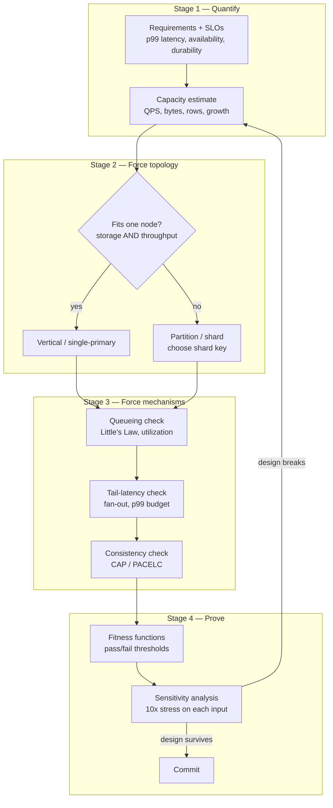
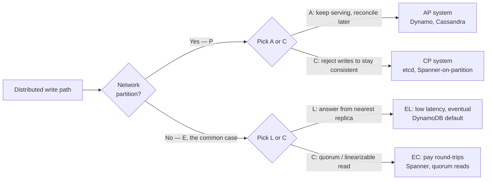

# How to Approach System Design — Theory and Formal Foundations

<!-- level-focus -->
At professional level, focus on this question:

> How should teams adopt and operate **How to Approach System Design — Theory and Formal Foundations** with measurable outcomes and limited coordination?

Use the smallest realistic scenario that exposes the decision and its failure behavior.
Most engineers approach system design as storytelling: a narrative of boxes and arrows, justified by analogy ("Netflix does it this way") and defended by intuition. At the principal level, the approach inverts. Every box must be forced into existence by a number, every arrow must survive a queueing-theory and consistency-model check, and the finished design must come with executable criteria that *prove* it meets its non-functional requirements (NFRs). This page treats "how to approach" as a formal discipline: how to drive each phase with arithmetic, how to convert estimates into forcing functions for technology choice, how to validate against CAP/PACELC and Little's Law before committing, and how to write fitness functions that make "good enough" falsifiable.

The thesis: **a design you cannot break with arithmetic is a design you do not yet understand.**

## 1. The Quantitative Approach: Numbers as Forcing Functions

A *forcing function* is a calculation whose output leaves you no architectural choice. When a number says "one machine cannot hold this," the conversation about whether to shard is over; only *how* remains. The discipline is to find these forcing functions early, before the whiteboard fills with components nobody can defend.

Three classes of number do almost all the forcing:

| Class | Question it answers | Forces |
|-------|--------------------|--------|
| **Capacity** | Does it fit on one node? (bytes, rows, QPS) | Partitioning / sharding |
| **Concurrency** | How many in-flight requests at peak? (Little's Law) | Instance count, pool sizing |
| **Tail** | What is p99/p999 under load and fan-out? | Replication, hedging, caching, timeouts |

The order matters. Capacity decides *topology* (single-node vs. distributed). Concurrency decides *scale-out factor* (how many of each thing). Tail decides *resilience mechanisms* (what you add to keep the distribution well-behaved). Reversing the order — picking a fashionable database first, then back-filling numbers — is the single most common failure mode in design reviews.

A useful mental rule for back-of-envelope work: carry one significant figure and powers of ten. The goal is not accuracy to 3%; it is to know whether the answer is "fits on a laptop," "fits on a beefy box," or "needs a fleet." Those three regions have entirely different architectures, and an order-of-magnitude estimate reliably tells you which region you are in. Precision beyond that is false confidence at the estimation stage — you refine it later with load tests, not with more decimal places on a guess.

A second rule: **always estimate two numbers and divide them.** A single absolute number ("we store 50 TB") is hard to sanity-check. A ratio ("50 TB / 2 TB-per-node = 25 shards") carries its own forcing function and its own error analysis — if either operand is off by 2x, you see immediately how the conclusion moves.

---

## 2. Phase Pipeline Driven by Arithmetic

The classic phases (requirements → estimates → API → data model → high-level design → deep dives → bottlenecks) are unchanged. What changes at the professional level is that **each arrow in the pipeline is a calculation, not a transition.** The estimate phase emits a number that constrains the data-model phase; the data-model phase emits a row count that constrains the storage choice; and so on. Information flows as quantities, and each downstream phase can *reject* an upstream decision by arithmetic.



The feedback edge from Stage 4 back to Stage 2 is the part juniors omit. Sensitivity analysis is *expected* to send you back: if a 10x error in any single assumption would break the architecture, that assumption must either be hardened (measured, not guessed) or the architecture must absorb the variance. A design that only works if all guesses are right is not a design — it is a hope.

---

## 3. Worked Analysis A — Estimate That Forces Sharding

**Scenario.** A photo-sharing service. Requirement: store original uploads for 5 years; serve a feed. We want to decide, *by arithmetic alone*, whether a single primary database (plus read replicas) survives, or whether write-path sharding is mandatory.

**Inputs (stated, so they can be challenged):**

- Daily active users (DAU): 50 M
- Uploads per active user per day: 2 → 100 M uploads/day
- Average original photo size: 2 MB
- Metadata row per photo: ~1 KB (ids, captions, EXIF, references)
- Retention: 5 years

**Step 1 — Write throughput.**

```
100 M uploads/day ÷ 86,400 s/day ≈ 1,160 writes/s  (average)
Peak factor ≈ 3x (diurnal)                          ≈ 3,500 writes/s (peak)
```

A single well-tuned Postgres primary can sustain a few thousand small write transactions per second, but 3,500 writes/s of *durable, replicated* metadata writes is already near the comfortable ceiling for one primary once you add indexing, foreign-key checks, and replication overhead. This is a **yellow flag**, not yet a forcing function.

**Step 2 — Metadata row count (the real forcing function).**

```
100 M rows/day × 365 days × 5 years = 1.825e11 rows  ≈ 182 billion rows
182 B rows × 1 KB/row                ≈ 182 TB of metadata (before indexes)
```

Indexes typically add 50–150% on top of base table size for a row this index-heavy, so call it **~350–450 TB** of *metadata alone*. No single node holds that with healthy operational margins. The blob storage (2 MB × 182 B ≈ 365 PB) obviously goes to object storage, not a database — but the *metadata* number is what kills the single-primary design.

**Step 3 — The forcing function.**

```
Required metadata capacity:  ~400 TB (with indexes)
Healthy per-node ceiling:    ~2 TB   (keeps a node's working set, backup, and reindex windows sane)
Shard count:                 400 TB ÷ 2 TB ≈ 200 shards
```

The arithmetic has removed the choice. At ~400 TB and 182 B rows, a single primary is impossible; the question "should we shard?" is answered. The remaining work is *how*: shard key (likely `user_id` for locality of a user's photos), rebalancing strategy, and cross-shard feed assembly. Note that the **throughput** number alone (3,500 writes/s) was merely a yellow flag — sharding was forced by **capacity**, not concurrency. This is exactly why the order in §1 matters: the topology decision came from the capacity class, and it would have been wrong to reach for sharding on the throughput number alone.

**Step 4 — Sanity ratio.** If our "uploads per user" guess is 2x too high, shard count halves to ~100 — still firmly in "must shard" territory. The conclusion is *robust* to a 2x error in the most uncertain input. That robustness is what lets us commit to a sharded topology with confidence rather than treating it as a reversible bet (see §10 for the formal version of this check).

---

## 4. Justifying Storage and Database Choices with Quantified Trade-offs

Once topology is forced, the next decision — *which* storage engine — must also be quantified. The trap is to choose by familiarity. The discipline is to choose by matching the workload's access pattern to the engine's cost model, with numbers attached to each axis.

The dominant axis is **read/write mix and access shape**, because storage engines are fundamentally trade-offs in the *write-amplification vs. read-amplification vs. space-amplification* triangle (the "RUM conjecture": you can optimize at most two of Read, Update, Memory). A B-tree engine (Postgres/MySQL InnoDB) optimizes reads and space at the cost of random write I/O. An LSM-tree engine (Cassandra, RocksDB, ScyllaDB) optimizes write throughput and sequential I/O at the cost of read amplification and background compaction.

| Engine class | Write cost | Point-read cost | Range/scan | Best when | Quantified tell |
|--------------|-----------|-----------------|-----------|-----------|-----------------|
| **B-tree (RDBMS)** | Random I/O, in-place; high write-amp under churn | 1 logarithmic seek, cached | Excellent (clustered) | Read-heavy, joins, transactions | reads/writes ≥ ~5:1; needs ACID across rows |
| **LSM (wide-column)** | Sequential append, low write-amp | Read-amp = #SSTables touched (mitigated by bloom filters) | Good per-partition | Write-heavy, time-series, append logs | writes ≥ reads; high ingest QPS |
| **Document (Mongo)** | B-tree-ish; flexible schema | 1 lookup by `_id`/index | Per-collection | Aggregate-oriented, evolving schema | one-document-per-request access |
| **KV cache (Redis)** | In-memory, O(1) | Sub-ms, RAM-bound | Limited | Hot working set, derived data | working set fits RAM; p99 budget < 1 ms |
| **Object store (S3)** | High-latency PUT | High-latency GET, huge throughput | N/A | Large immutable blobs | object > ~100 KB; durability 11 nines |

**Worked justification (continuing §3).** The metadata workload is feed-read-dominated (a user opens the app and reads, far more than they upload). Estimate reads: 50 M DAU each loading ~20 feed views/day ≈ 1 B reads/day vs. 100 M writes/day → **read:write ≈ 10:1**. That ratio, plus the need for relational integrity between users, photos, and follows, points to a **B-tree RDBMS, sharded** — *not* Cassandra, despite Cassandra's write-throughput edge, because the workload is read-heavy and relational. The 2 MB blobs go to **object storage** (object size ≫ 100 KB; durability requirement is high), with only the URL stored in the metadata row. Each choice is now backed by a number and a stated threshold, so a reviewer can attack the *number*, not your taste.

The cost axis deserves its own arithmetic. A back-of-envelope monthly cost — `bytes × $/GB-month + reads × $/op + egress × $/GB` — frequently reverses a decision that looked correct on latency alone. Putting 365 PB of photo blobs in a database's storage tier instead of object storage would be both technically and financially absurd, and the cost line makes that obvious before anyone argues about it.

---

## 5. Validating Against CAP and PACELC Before Committing

A distributed design is not validated until it has survived a consistency-model check. CAP is the coarse filter; PACELC is the one you actually use, because it forces you to reason about the *normal* (no-partition) case where latency lives.

**CAP** says: during a network **P**artition, you must choose **C**onsistency (refuse stale/conflicting answers) or **A**vailability (answer anyway, possibly stale). It is a statement about behavior *only during partitions*, which makes it nearly useless for everyday sizing — partitions are rare.

**PACELC** extends it: *if* **P**artition, choose **A** or **C**; **E**lse (normal operation), choose **L**atency or **C**onsistency. The "else" branch is where 99.9% of your system's life is spent, so it dominates the user experience. PACELC turns a rare-event coin flip into a continuous design dial.



**How to apply it as a check, not a label.** For each critical operation, write down the PACELC class *the requirement demands*, then confirm the chosen store provides it:

| Operation | Requirement | Demanded class | Acceptable store |
|-----------|-------------|----------------|------------------|
| "Place order / deduct inventory" | Never oversell | PC/EC (linearizable) | Spanner, CockroachDB, single-shard txn |
| "Post a photo to my feed" | Eventually visible is fine | PA/EL | Dynamo, Cassandra |
| "Read my own profile edit" | Must see my last write | EL + read-your-writes (session) | Dynamo w/ session consistency |
| "Display follower count" | Approximate is fine | PA/EL | eventually-consistent counter |

The forcing function here is subtle: **mixing classes in one transaction is the bug.** If "place order" needs EC (linearizable) but you put inventory in an EL store to chase latency, no amount of careful coding fixes the oversell — the consistency model itself permits the anomaly. The check must happen *before* commit, because it is a property of the chosen store, not of your application code. You cannot test your way out of a wrong consistency model; you can only re-architect.

A practical heuristic: most systems are *not* uniformly one class. Split the data by its consistency demand. Put the small, money-touching, must-be-correct subset in a CP/EC store (it is small, so the latency cost of quorums is affordable), and put the large, tolerant, must-be-fast subset in an AP/EL store. The arithmetic justifies the split: the EC store handles maybe 5% of operations, so its higher per-op latency barely moves the aggregate.

---

## 6. Queueing Limits: Little's Law and Utilization

Capacity arithmetic tells you whether data *fits*. Queueing theory tells you whether requests *flow*. The two governing facts are Little's Law and the utilization–latency curve, and together they set instance counts and pool sizes with a rigor that "just add servers until it feels fine" never achieves.

**Little's Law:** in any stable system,

```
L = λ × W
```

where `L` = average number of requests *in the system concurrently*, `λ` = arrival rate (req/s), and `W` = average time a request spends in the system (s). It is exact, holds for any arrival distribution, and is the most under-used tool in capacity planning. It directly sizes connection pools, thread pools, and concurrency limits: if you serve λ = 2,000 req/s and each request holds a DB connection for W = 10 ms, you need `L = 2000 × 0.010 = 20` concurrent connections *on average* — and headroom above that for bursts and tail.

**The utilization wall.** The reason you cannot run servers at 90% CPU is not superstition; it is the shape of the queueing curve. For an M/M/1 queue (Poisson arrivals, exponential service, one server), the expected waiting time scales as:

```
W_queue = (ρ / (1 − ρ)) × service_time
```

where `ρ` is utilization (0 to 1). The `1/(1−ρ)` term is the killer. As ρ climbs, latency does not rise linearly — it explodes:

| Utilization ρ | Queue-delay multiplier `ρ/(1−ρ)` | Effect on latency |
|---------------|----------------------------------|-------------------|
| 50% | 1.0× | service time again in queue |
| 70% | 2.3× | manageable |
| 80% | 4.0× | tail starts to hurt |
| 90% | 9.0× | p99 falls off a cliff |
| 95% | 19.0× | effectively unusable |
| 99% | 99.0× | meltdown |

This table is *the* reason every sizing calculation must leave headroom. Targeting ρ ≈ 0.65–0.70 per node is not waste; it is buying a bounded tail. A system sized for 95% average utilization has no answer for a momentary 2x traffic spike except to fall over. Headroom is the price of a predictable p99, and the next worked analysis makes that price concrete.

---

## 7. Worked Analysis B — Utilization Headroom Sets Instance Count

**Scenario.** A stateless API tier in front of the §3 service. We must decide the **number of instances** for the peak window, sized so p99 latency stays within budget rather than "until CPU looks busy."

**Inputs:**

- Peak request rate: λ = 30,000 req/s
- Mean service time per request (CPU-bound work, measured): S = 8 ms = 0.008 s
- Each instance is single-vCPU-equivalent for this work (model as one server per instance)
- Target per-instance utilization: ρ_target = 0.65 (from the §6 wall, to protect p99)

**Step 1 — Raw concurrency demand (Little's Law).**

```
L = λ × S = 30,000 × 0.008 = 240 requests in flight at any instant
```

So we need enough instances to keep 240 requests processing *concurrently*, with comfortable queueing headroom.

**Step 2 — Per-instance safe throughput.**

```
Max theoretical throughput per instance = 1 / S = 1 / 0.008 = 125 req/s
Safe throughput at ρ = 0.65             = 125 × 0.65 ≈ 81 req/s
```

We deliberately do *not* run an instance at its 125 req/s ceiling, because at ρ → 1 the §6 multiplier explodes the tail.

**Step 3 — Instance count.**

```
Instances = λ / safe-per-instance = 30,000 / 81 ≈ 370 instances
```

**Step 4 — Validate against the utilization wall.** At 370 instances, per-instance load is `30,000 / 370 ≈ 81 req/s`, i.e. ρ ≈ 0.65, giving a queue-delay multiplier of `0.65/0.35 ≈ 1.86×`. Expected in-system time ≈ `S × (1 + 1.86) ≈ 8 ms × 2.86 ≈ 23 ms` mean. That leaves room under a, say, 100 ms p99 budget even after tail effects. Had we sized at ρ = 0.90 (only `30,000 / (125×0.9) ≈ 267` instances), the multiplier would be 9×, pushing mean in-system time to `8 × 10 = 80 ms` *before* tail amplification — blowing the budget. **The 100 extra instances are not waste; they are the difference between meeting and missing the SLO.**

**Step 5 — Headroom for failure and bursts.** Size for the loss of one availability zone. If we run 3 AZs and must survive one failing, the surviving two must carry full peak: provision `370 / (2/3) ≈ 555` instances total so that *after* an AZ loss, the remaining ~370 still run at ρ ≈ 0.65. This is the N+1 (here, N+½) reasoning made quantitative — the multiplier is `1/(1 − fraction_lost)`.

**Result.** ~555 provisioned instances, ~370 of them load-bearing at peak, target ρ = 0.65, validated to hold p99 under budget and survive one-AZ loss. Every number traces back to a measured input (S = 8 ms) or a stated policy (ρ = 0.65, survive 1 of 3 AZs), so the count is defensible line by line — and the autoscaler's target metric should be *utilization-derived QPS*, not raw CPU.

---

## 8. Tail Latency and the Cost of Fan-out

Averages lie; the user feels the tail. The professional sizing question is never "what is the mean latency?" but "what is p99/p999 *under load and after fan-out*?" Two compounding effects make tails dangerous:

**1. Utilization amplifies the tail.** From §6, the queue multiplier grows as `1/(1−ρ)`. The *mean* moves, but the high percentiles move far more, because queueing variance grows faster than the mean as ρ → 1. A system whose mean looks fine at ρ = 0.85 can have a p99 that is 5–10x its median.

**2. Fan-out multiplies tail exposure.** If a single user request fans out to N backend calls and waits for *all* of them, the request's latency is the **maximum** of N samples. The probability that *at least one* of N independent calls lands in its own p99 tail is:

```
P(at least one slow) = 1 − (1 − 0.01)^N
```

| Fan-out N | P(request hits a per-call p99 tail) | Effective experienced percentile |
|-----------|-------------------------------------|----------------------------------|
| 1 | 1.0% | p99 |
| 10 | 9.6% | ~p90 |
| 50 | 39.5% | ~p60 |
| 100 | 63.4% | worse than median |

The lesson is brutal: **with fan-out of 100, the *typical* request experiences your backend's p99.** A service whose p99 is "only" 50 ms will deliver ~50 ms to the median user once requests fan out to 100 shards. This is why scatter-gather designs (search, feed assembly across §3's 200 shards) must treat per-shard p99 — not p50 — as the design input, and why the mitigations below are mandatory rather than optional.

**Quantitative mitigations:**

- **Reduce N or partition into a tree.** Hierarchical fan-out (root → 10 mid → 10 leaf each) bounds each level's exposure instead of compounding 100 in one wait.
- **Hedged requests.** Send to a second replica if the first has not answered by p95; cuts the tail at a small (~5%) extra-load cost. Concretely, hedging at p95 adds ~5% load but can pull p99 toward p95.
- **Tighten per-call timeouts** to a value derived from the budget: if the overall budget is 100 ms and you fan out to 50, no single call may be allowed to consume the whole budget; the timeout must be set so the slowest tolerated call still leaves room. Set it from the distribution, never from a round guess.
- **Lower ρ** on the fanned-out tier specifically, because its tail is multiplied — it may warrant ρ = 0.5 where a non-fanned tier tolerates 0.7.

---

## 9. Fitness Functions: Executable Acceptance Criteria

A fitness function is an **automated, repeatable test that returns pass/fail against a quantified NFR.** It converts "the system should be fast and reliable" — unfalsifiable — into "p99 latency under 30k req/s must be ≤ 100 ms, measured over a 10-minute soak; the build fails otherwise." Architecture without fitness functions decays, because nobody can tell when a change has violated an unwritten budget. This is the formal analogue of unit tests, applied to NFRs.

A good fitness function has four parts: a **metric**, a **load/condition** under which it is measured, a **threshold**, and a **consequence** when breached.

```
fitness_function "api_tail_latency" {
  metric:    p99 of request latency
  condition: synthetic load at 30,000 req/s for 10 min (peak profile)
  threshold: p99 <= 100 ms  AND  p999 <= 250 ms
  consequence: FAIL the release pipeline; page if seen in production SLO burn
}
```

**Worked example with a concrete pass/fail.** For the §7 API tier, the executable criterion is:

| Field | Value |
|-------|-------|
| Metric | p99 end-to-end latency |
| Condition | Load generator at 30,000 req/s, steady, 10 minutes, after warm cache |
| Threshold | **PASS if p99 ≤ 100 ms; FAIL if p99 > 100 ms** |
| Secondary | error rate < 0.1%; p999 ≤ 250 ms |
| Cadence | Every release candidate + nightly against staging |

If a candidate build measures p99 = 118 ms, it **fails** — not "looks a bit slow," but *fails*, blocking the merge. The threshold (100 ms) traces directly to the §7 sizing math, which proved the design *can* hit it at ρ = 0.65; the fitness function then *verifies* the implementation actually does. Design and verification are linked by the same number.

Fitness functions are not only for latency. Examples that translate NFRs into executable checks:

| NFR | Fitness function | Pass threshold |
|-----|------------------|----------------|
| Scalability | Throughput at fixed p99 as instances double | ≥ 1.8× per doubling (≥ 90% linear) |
| Durability | Inject node loss; verify zero acknowledged-write loss | 0 lost committed writes |
| Cost efficiency | $ per 1M requests at peak | ≤ target budget $/M |
| Availability | Chaos: kill 1 AZ; measure error rate | error spike < 1%, recovers < 60 s |
| Consistency | Linearizability checker (e.g. Jepsen-style) on critical path | 0 consistency violations |

The principal-level move is to write these *before* building, so the design's claims are testable from day one. A design document that asserts "scales linearly" without an accompanying fitness function that would *catch* it not scaling linearly is making an untestable claim — and untestable claims are how systems silently rot.

---

## 10. Sensitivity Analysis: Which Assumption Breaks the Design

Every estimate rests on assumptions, and assumptions are wrong. Sensitivity analysis asks, methodically: **for each input, if it were wrong by 10x, would the architecture survive?** The inputs that *would* break the design are the ones that must be measured, hardened, or designed around; the inputs that wouldn't can stay as rough guesses. This turns "we made a lot of assumptions" into a ranked list of risks.

The procedure:

1. List every numeric assumption (QPS, sizes, ratios, growth, fan-out, hit-rate).
2. For each, multiply by 10 (and divide by 10) *in isolation*.
3. Re-run the forcing functions (§3, §7) with the perturbed value.
4. Classify the outcome: **absorbed** (design unchanged), **scaled** (more of the same — add nodes), or **broken** (topology or consistency model invalidated).

| Assumption (§3/§7 example) | Baseline | ×10 stress | Outcome | Action |
|----------------------------|----------|-----------|---------|--------|
| Uploads/user/day | 2 | 20 | Shard count 200 → 2,000; **scaled** | Ensure shard scheme rebalances cheaply |
| Avg photo size | 2 MB | 20 MB | Blob 365 PB → 3.65 EB; **scaled** (object store) | Object store absorbs; cost line moves |
| Read:write ratio | 10:1 | 1:1 | RDBMS read-replica plan weakens; **broken** | Re-evaluate engine; cache layer becomes critical |
| Service time S | 8 ms | 80 ms | Instances 370 → 3,700; **scaled but costly** | Profile/optimize hot path; this is the dangerous one |
| Cache hit rate | 95% | (÷10 → 9.5%) | Backend load 5× → 50×; **broken** | Cache hit rate is load-bearing — must be measured, SLO'd |

The two rows that should alarm you are **read:write ratio** and **cache hit rate**: a 10x miss there does not merely cost more nodes, it *invalidates the architecture* (the engine choice, the whole point of the cache). Those are the assumptions you must measure before committing — ideally with a fitness function (§9) that fails the build if the real hit rate drifts below the design point. Contrast with "photo size," where a 10x error just flows through to the (elastic) object-store bill: unpleasant, but not architectural.

**The principle:** *robustness is asymmetric.* You do not need every assumption to be accurate; you need the *load-bearing* ones to be accurate and the rest to merely scale. Sensitivity analysis is how you find which is which — and it is the formal justification for the §3 "sanity ratio" step. A design whose every assumption is load-bearing is fragile by construction; a good architecture concentrates fragility into a few inputs you then measure relentlessly.

---

## 11. Pitfalls in Quantitative Reasoning

Numbers create false confidence as easily as they create real confidence. The professional knows where the arithmetic itself misleads:

- **Averaging the tail away.** Sizing on mean latency hides the `1/(1−ρ)` explosion (§6) and the fan-out max (§8). Always size on percentiles, and remember a mean is a *terrible* summary of a long-tailed distribution.
- **Forgetting Amdahl / contention.** Doubling instances does not double throughput if there is a shared serialized resource (a single lock, one primary, one queue partition). The fitness function "≥ 1.8× per doubling" (§9) exists precisely to catch a hidden serialization point before it caps you.
- **Linear extrapolation across a regime change.** "It handled 1k req/s, so 10k is just 10x the hardware" ignores that at 10x you may cross the single-node ceiling (§3) and enter a *different architecture*. Forcing functions are step functions, not slopes.
- **Confusing average and peak.** Provisioning for average traffic guarantees you are under-provisioned half the time. Always carry a peak factor (diurnal ×2–3, event spikes ×10) and size for peak with headroom.
- **Ignoring the cost of consistency in the common case.** Choosing a linearizable store "to be safe" everywhere pays the EC latency tax (§5) on 100% of operations when only 5% needed it. Split by consistency demand.
- **Spurious precision.** Reporting "2,347 instances" from inputs that are order-of-magnitude guesses launders a guess into a fact. Round to one significant figure and state the assumptions, so reviewers attack the right thing.
- **Single-point estimates with no error analysis.** Always estimate a ratio and run the §10 stress, so you know whether your conclusion is robust or balanced on a knife's edge.

---

## 12. Summary and Checklist

The formal approach replaces narrative with arithmetic at every phase. You do not *argue* that a design works; you *force* its topology with capacity numbers, *size* it with queueing math, *validate* it against PACELC and the utilization wall, *prove* it with fitness functions, and *stress* it with sensitivity analysis. A design that survives all five is one you can commit to and defend line by line.

**The principal-level checklist:**

- [ ] **Forcing functions identified.** For each major component, a capacity/throughput number that *removes* the architectural choice (§1, §3).
- [ ] **Topology forced, not chosen.** Single-node vs. sharded decided by arithmetic (storage *and* throughput ceilings), with a sanity ratio (§3).
- [ ] **Engine justified by access pattern + cost.** Read:write ratio, access shape, and $/op cited; RUM trade-off acknowledged (§4).
- [ ] **PACELC checked per critical operation.** No transaction mixes consistency classes; money-path is EC, tolerant data is EL (§5).
- [ ] **Little's Law applied.** Pool sizes and concurrency limits derived from `L = λW`, not guessed (§6).
- [ ] **Utilization headroom set.** Target ρ ≈ 0.65–0.70; instance count validated against the `1/(1−ρ)` wall and AZ-loss survival (§6, §7).
- [ ] **Tail sized after fan-out.** Per-call p99 (not p50) used as input; mitigations (hedging, timeouts-from-budget, tree fan-out) attached (§8).
- [ ] **Fitness functions written.** Each NFR has a metric + condition + threshold + consequence, runnable in the pipeline, with concrete pass/fail numbers (§9).
- [ ] **Sensitivity analysis done.** Every input stressed ×10; load-bearing assumptions (those that *break* the design) identified and slated for measurement (§10).

When all nine boxes are checked, the design is no longer a story — it is a quantitative claim with attached proofs. That is the difference between "I think this will scale" and "this scales, here is the arithmetic, and here is the test that fails if it ever stops."


---

## Apply it

1. Define the user or business outcome that **How to Approach System Design — Theory and Formal Foundations** should improve.
2. Assign one owner for code, contracts, operations, and incidents.
3. Split delivery into reversible increments that produce evidence early.
4. Publish responsibilities, escalation paths, and compatibility windows.
5. Stop or expand only when the agreed measures support that decision.

## Verify your work

- Each increment has an owner, rollback path, and observable exit condition.
- Adoption, reliability, delivery time, and coordination cost are measured.
- Incident and migration exercises prove that responsibility is executable.
- The old path is removed only after telemetry proves it is unused.

## Review questions

- Which measurable outcome justifies investing in How to Approach System Design — Theory and Formal Foundations?
- Which team owns the full lifecycle and incident response?
- What reversible increment produces the earliest useful evidence?
- Which exit condition proves that migration or adoption is complete?
