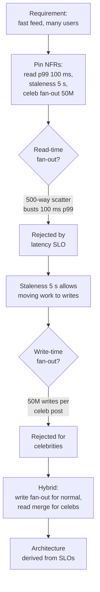
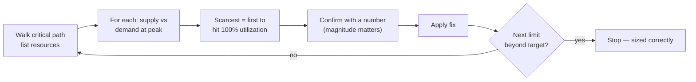

# How to Approach System Design — Senior

<!-- level-focus -->
At senior level, focus on this question:

> Which system invariant is affected by **How to Approach System Design** under failure, load, and change?

Use the smallest realistic scenario that exposes the decision and its failure behavior.
At the senior level, the design itself is the easy part. The hard part is *owning the conversation*: turning a vague ask into measurable targets, deciding what deserves your attention, defending trade-offs out loud, and knowing when to stop. A junior produces a diagram. A senior produces a *decision*, with the reasoning that makes it defensible six months later when it pages someone at 3 a.m.

This page is about method, not components. It assumes you already know the building blocks (caches, queues, replicas, shards) and focuses on how an owner drives a design from requirements and SLOs, finds the first bottleneck on purpose rather than by accident, and steers the room.

## 1. The Owner's Mindset

A senior engineer in a design discussion is not answering questions — they are *running* a small project whose deliverable is a shared decision. Three habits separate owners from implementers:

- **You name the success criteria before you draw anything.** If you cannot state what "working" means numerically, you are guessing.
- **You spend attention like a budget.** Your time in the room (or in the design doc) is finite. You allocate it to the parts most likely to fail or to be wrong, not the parts you enjoy.
- **You make the trade-off visible.** Every box on the diagram bought something and cost something. Saying both out loud is the job.

The mental posture is closer to risk management than to architecture. You are continuously asking: *what is the most expensive thing I could be wrong about right now, and how do I cheaply reduce that uncertainty?* That single question reorders everything that follows.

A useful tell: juniors talk about *what* they would build; seniors talk about *what would have to be true* for the design to hold, and what they'd measure to find out.

---

## 2. From Fuzzy Requirements to Measurable Non-Functionals

Requirements arrive as adjectives — "fast", "scalable", "reliable", "real-time". Adjectives cannot be designed against because they cannot be falsified. Your first move as the owner is to convert each adjective into a number with a unit, a percentile, and a scope.

The conversion is mechanical once you have the questions:

| Fuzzy word | Question to ask | Measurable form |
|------------|-----------------|-----------------|
| "Fast" | At which percentile, for which operation? | p99 read latency ≤ 150 ms |
| "Scalable" | To what peak, over what horizon? | 50k writes/s sustained, 3× burst for 5 min |
| "Real-time" | What staleness is tolerable? | end-to-end propagation ≤ 2 s p95 |
| "Reliable" | What downtime is acceptable per year? | 99.95% availability (≈ 4.4 h/yr) |
| "Consistent" | Does a stale read break a user promise? | read-your-writes within a session |
| "Cheap" | What's the budget per unit of work? | ≤ $0.0002 per request at scale |

Three discipline rules make this rigorous:

1. **Separate functional from non-functional, and design against the non-functional.** *What* the system does (post a tweet, charge a card) is usually agreed in minutes. *How well* it must do it under load is where architecture is decided. Pin the second.
2. **Always attach a percentile to a latency.** "Average latency 50 ms" is nearly meaningless; the user who churns is the one at p99. A target without a percentile is a target you can hit while still failing.
3. **Bound the workload in three numbers:** steady-state load, peak/burst factor, and growth over the design horizon. A system sized for the average dies on the peak.

The output of this step is a short table of non-functional requirements (NFRs). It is the contract. Everything downstream is in service of it, and any later proposal that doesn't move an NFR is a candidate to cut.

---

## 3. SLOs and Latency Budgets as Design Inputs

An SLO (Service Level Objective) is an NFR you've committed to operate against — a target with a measurement window and an error budget. The senior move is to treat SLOs not as a reporting concern bolted on at the end, but as a *design input* that constrains the architecture from the first box.

Two SLOs do most of the architectural work:

- **A latency SLO** decides your *call topology*. It sets how many sequential network hops you can afford and whether expensive work must move off the request path.
- **An availability SLO** decides your *redundancy and failure model*. It sets how many independent failure domains you need and whether you can tolerate a synchronous dependency on a single component.

### Building a latency budget

A latency SLO is a budget you must *spend down* across the request path. Start from the user-facing target and subtract each hop. If the sum of the parts exceeds the budget, the architecture is already disproven — before you've written a line of code.

```
p99 budget: 200 ms  (user-facing)
 ├─ TLS + edge/CDN ........  10 ms
 ├─ API gateway + auth ....  15 ms
 ├─ service hop 1 .........  25 ms
 ├─ DB read (cached) ......  10 ms
 ├─ DB read (cache miss) .. 120 ms   ← danger
 ├─ serialization/network .  20 ms
 └─ headroom .............. remainder
```

The cache-miss line jumps out: a single uncached read consumes more than half the budget. That observation *is* the architecture — it forces a decision (raise hit rate, precompute, denormalize, or relax the SLO) before anything is built.

Two budgeting rules seniors apply reflexively:

- **Sequential hops add; you cannot hide latency behind a chain of synchronous calls.** Five services at 40 ms each is a 200 ms floor with zero margin. The fix is usually *fewer hops* (collapse services, fan out in parallel, or move work off the path), not faster ones.
- **Tail latency compounds under fan-out.** If a request fans out to 100 backends and each has a p99 of 10 ms, the *slowest of 100* dominates: the request's p99 is governed by the backends' p99.9, not their p99. High fan-out demands hedged requests, tighter per-leaf tails, or smaller fan-out.

### Error budgets change behavior

A 99.9% availability SLO grants ≈ 43 minutes of unavailability per month — that is the *error budget*. Stating it converts a values argument ("should we ship or harden?") into an arithmetic one ("we've burned 80% of the budget; freeze risky changes"). The senior uses the budget as the lever that decides pace versus safety, instead of arguing taste.

---

## 4. Worked Example: When SLOs Rewrite the Architecture

Requirements turning into SLOs that *change the architecture* is the senior skill. Here is the full move.

**The ask (as received):** *"Build a feed for a social app. Should be fast and handle a lot of users."*

**Step 1 — Pin the NFRs.** After questions, the table reads:

| NFR | Value |
|-----|-------|
| Feed read latency | p99 ≤ 100 ms |
| Read load | 500k feed reads/s at peak |
| Write load | 5k posts/s |
| Fan-out | avg 200 followers; celebrities up to 50M |
| Staleness tolerance | new posts may appear up to 5 s late |
| Availability | 99.95% |

**Step 2 — First architecture (the obvious one).** Read-time fan-out: when a user opens the feed, query the posts of everyone they follow, merge, sort, return.

**Step 3 — Test it against the SLOs.** At read time, a user following 500 accounts triggers a scatter-gather across 500 partitions, merge-sorted, under a 100 ms p99 — at 500k reads/s. The per-read work is enormous and the fan-out tail (Section 3) makes p99 unachievable. **The latency SLO disproves read-time fan-out.**

**Step 4 — Let the SLO pick the architecture.** The staleness tolerance (5 s) is the escape hatch. Because the read SLO is tight but the freshness SLO is loose, we can **shift work from read time to write time**: fan-out-on-write. When a user posts, push the post id into each follower's precomputed feed list (in a fast store). A feed read becomes a single sequential range read — trivially inside 100 ms.

**Step 5 — Find where the new design breaks.** Fan-out-on-write breaks on celebrities: one post by a 50M-follower account means 50M writes. That violates nothing in the read path but blows up write amplification and tail. **A second NFR (the celebrity fan-out) disproves pure write-time fan-out.**

**Step 6 — The hybrid the SLOs forced.** Use fan-out-on-write for normal accounts and fall back to read-time merge for the handful of celebrity accounts a user follows. This is the actual architecture used in production at scale — and notice it was *derived* from two numbers (100 ms read SLO, 5 s staleness SLO), not chosen from a catalog.



The lesson is not "feeds use hybrid fan-out." It is the *method*: state the numbers, propose the obvious design, let each SLO disprove a design, and accept the architecture that survives. The SLOs did the choosing.

---

## 5. Choosing What to Deep-Dive: Follow the Risk

A design has a dozen components but you have time to interrogate two or three. Juniors deep-dive the part they know best (the comfort trap). Seniors deep-dive the part most likely to be *wrong* or to *fail* — they follow the risk, not the familiarity.

Rank candidates for deep-dive by a simple product:

> **Attention = (probability this is wrong or fails) × (cost if it does)**

The components that win are usually:

- **The scarcest resource** — whatever runs out first under load (covered in Section 6).
- **The hardest invariant** — exactly-once payment, no double-booking, read-your-writes. Correctness under concurrency is where designs quietly break.
- **The newest or least-proven choice** — a component nobody on the team has run in production carries hidden cost.
- **The blast radius** — the dependency that, when it fails, takes everything with it.

What you can *defer*: anything that is well-understood, easily changed later, or cheap to get wrong. CRUD endpoints, standard auth, a logging pipeline — acknowledge them and move on. Spending equal time on every component is a junior signature; it signals you can't tell what matters.

A senior says this out loud: *"The two things that can sink this are the write-path consistency and the cache hit rate under a cold start. I'll go deep there; the rest is standard and I'll move fast."* That sentence reorders the whole conversation around risk — and demonstrates judgment, which is what's actually being evaluated.

---

## 6. Systematically Locating the First Bottleneck

"Where's the bottleneck?" should never be answered by intuition. There is a procedure, and it always finds the *first* limit — the one that binds before any other.

**Step 1 — Walk the critical path.** Trace one request end to end and list every resource it consumes in order: network, CPU, memory, disk I/O, locks, a connection-pool slot, a downstream quota. The bottleneck always lives on the critical path; work off the path (async, batch) can wait.

**Step 2 — Find the scarcest resource.** For each resource on the path, compute supply versus demand at peak load. The bottleneck is the resource whose *utilization reaches 100% first*. Common culprits, roughly in order of how often they bind:

| Resource | What exhausts it | Typical symptom |
|----------|------------------|-----------------|
| Single-leader DB writes | write QPS > what one leader sustains | rising write latency, replication lag |
| Connection pool | concurrency > pool size | requests queue, then time out |
| Hot partition / hot key | skewed key distribution | one shard at 100%, others idle |
| Network bandwidth | large payloads × high QPS | saturated NIC, retransmits |
| Lock / serialized section | contention on shared state | throughput flat as you add cores |
| Downstream rate limit | your QPS > their quota | 429s, backpressure |

**Step 3 — Confirm with arithmetic, not adjectives.** Estimate the number. If a single Postgres leader does ~10k writes/s comfortably and you need 50k, the leader is the bottleneck *by a factor of 5* — that magnitude tells you the fix must be structural (sharding), not a tuning knob.

**Step 4 — Fix it, then re-walk the path.** Removing a bottleneck always reveals the next one. Sharding the DB might next expose the connection pool, then the network, then a downstream quota. Bottleneck-hunting is iterative: solve, re-measure, repeat — and stop when the next limit sits comfortably beyond your load target.



The discipline is refusing to guess. "I think the database is the bottleneck" is a junior sentence. "At 50k writes/s against a single leader that sustains ~10k, the write path saturates 5× over — that's the first wall" is a senior one.

---

## 7. Little's Law and Utilization Reasoning

Two pieces of queueing theory let you reason about capacity on a whiteboard, no simulation required.

**Little's Law:** `L = λ × W`, where `L` is the average number of requests in the system, `λ` is arrival rate, and `W` is the average time each request spends inside. It connects three things you usually half-know and lets you solve for the third.

The most common senior use is sizing concurrency:

> **Required concurrency = throughput × latency.**
> 10,000 req/s × 0.2 s average service time = **2,000 in-flight requests**.

That single line tells you the thread pool, connection pool, or goroutine count you must support. If your pool is 200, you can serve at most `200 / 0.2 = 1,000 req/s` — and the other 9,000 queue or fail. Many "mysterious" latency spikes are just a pool too small for the Little's-Law concurrency the load demands.

**Utilization and the latency wall.** Queueing theory's second gift: as utilization `ρ` (demand ÷ capacity) approaches 1, waiting time blows up non-linearly. A rough M/M/1 approximation:

```
average wait ∝ ρ / (1 − ρ)
ρ = 0.5  →  wait factor 1×    (comfortable)
ρ = 0.8  →  wait factor 4×    (getting hot)
ρ = 0.9  →  wait factor 9×    (latency cliff)
ρ = 0.95 →  wait factor 19×   (effectively down)
```

This is why seasoned engineers size systems for **~60–70% peak utilization**, not 95%. The "wasted" 30% is the buffer that keeps the tail latency flat when a burst arrives. A system run at 95% utilization isn't efficient — it's one traffic spike away from a latency collapse. Naming this explicitly ("I'll target 65% utilization so the p99 stays flat under burst") is a strong senior signal: you understand that headroom is a feature, not slack.

You don't need exact queueing math in a design discussion. You need the *shape*: latency is fine until utilization climbs, then it falls off a cliff. Reason in that shape and you'll size capacity correctly without a single benchmark.

---

## 8. Communicating Trade-offs Explicitly

Every architectural choice is a trade. The senior skill is making the trade *legible* — stating what you bought, what you paid, and why the exchange is worth it here. An unstated trade-off reads as either ignorance (you didn't see the cost) or evasion (you're hiding it).

Use a consistent structure so trade-offs are easy to follow:

> *"I'm choosing **X** over **Y**. X gives us **[benefit tied to an NFR]** at the cost of **[concrete downside]**. That's the right trade here because **[the NFR that dominates]**. If **[condition changed]**, I'd switch to Y."*

The final clause — *what would change my mind* — is what distinguishes a defensible decision from a stubborn one. It shows you chose, rather than defaulted.

A worked comparison, made explicit:

| Decision | Option A | Option B | Senior framing |
|----------|----------|----------|----------------|
| Consistency model | Strong (synchronous) | Eventual | "Eventual, because the 5 s staleness SLO permits it and it unlocks the read SLO. If this were a ledger balance, I'd pay for strong." |
| Data store | Single SQL leader | Sharded | "Single leader until we cross ~8k writes/s; sharding adds cross-shard query and resharding pain we don't need yet. The growth curve says we revisit in ~12 months." |
| Communication | Synchronous RPC | Async queue | "Async for the fan-out write path to absorb bursts and decouple failure; sync for the read path where the user is waiting and a queue only adds latency." |

Two further habits:

- **Quantify the cost.** "Sharding adds operational complexity" is vague. "Sharding means cross-shard joins become application-level scatter-gather and resharding is a multi-week project" is a cost someone can weigh.
- **Tie every benefit to an NFR.** A benefit that doesn't move a stated requirement is gold-plating in disguise (Section 10). If you can't name the NFR a choice serves, question the choice.

The goal is that anyone in the room could explain *why* the design is what it is. If only you can, you've built a system that depends on your presence — the opposite of ownership.

---

## 9. Steering the Interviewer or the Design Review

Whether the audience is an interviewer or a room of staff engineers, the meta-skill is the same: you drive, they navigate. Letting the other party ask all the questions cedes ownership and signals you're waiting to be told what matters.

**Open by framing, not building.** Spend the first minutes establishing scope and NFRs out loud: *"Let me pin down what we're optimizing for before I draw. I'm hearing read-heavy, latency-sensitive, with eventual consistency tolerated. I'll assume X, Y, Z — stop me if any of those are wrong."* This does three things: it surfaces the success criteria, it gets buy-in on assumptions, and it puts you in the driver's seat.

**State assumptions explicitly and invite correction.** Assumptions are not weaknesses; *hidden* assumptions are. "I'll assume single-region to start and treat multi-region as an extension" lets the other side redirect cheaply if you've guessed wrong about scope. It also protects you: when an assumption turns out false, you adjust a stated premise instead of discovering a contradiction late.

**Signpost your path.** *"I'll do the high-level design first, then deep-dive the write path since that's where the risk is, then talk failure modes."* A stated plan reads as control. It also lets the listener steer — they'll say "actually I care more about X," and now you're spending time on what they value.

**Read signals and reallocate.** If the interviewer keeps probing consistency, that's where the points are — go deeper there and trim elsewhere. If a reviewer's eyes glaze during your CRUD walkthrough, you're spending attention in the wrong place. Steering means adjusting your time budget live based on the audience's signals, not marching through a fixed script.

**Manage the clock like the owner you are.** A senior leaves time for failure modes, scaling, and trade-offs rather than over-polishing the happy path. If you're 30 minutes in and still on the data model, you've mismanaged the budget. Say it: *"I'll lock the schema here and move to the scaling story, since that's where this design lives or dies."*

The throughline: in both settings you're demonstrating *judgment under ambiguity*. The diagram is evidence; the steering is the skill.

---

## 10. Good Enough vs Gold-Plating

The hardest senior judgment is knowing when to *stop*. Over-engineering is not a sign of thoroughness — it's a failure to map effort to requirements. A design that handles 1000× the realistic load, supports five regions for a single-country product, or abstracts every dependency behind a swap-ready interface has spent real time and complexity buying NFRs nobody asked for.

The test is mechanical: **for every piece of complexity, name the NFR it serves.** If you can't, cut it. "We might need it later" is not an NFR — it's a guess, and you can usually defer the work until the guess becomes a fact, at lower total cost.

| Situation | Good enough | Gold-plating |
|-----------|-------------|--------------|
| Load is 5k req/s, growth is slow | Single region, vertical headroom, plan to shard later | Multi-region active-active from day one |
| Consistency SLO tolerates 5 s | Async replication, eventual reads | Distributed consensus for every write |
| One downstream integration | Direct call with retry + timeout | Generic plugin framework "for future providers" |
| 99.9% availability target | One failover replica | Three-region quorum with chaos testing |

Two principles guide the call:

- **Design for the next order of magnitude, not the next three.** Build for plausible near-term growth (say, 10×) with a *known* path to the next step — not for a hypothetical scale you may never reach. A clear migration path beats premature generality.
- **Prefer reversible decisions made fast over irreversible ones made slow.** The cost of getting a reversible choice wrong is a future refactor; the cost of over-building is paid *now*, every day, in complexity you carry. Most decisions are reversible — make those quickly and save your deliberation for the few that aren't (data model, public API, consistency model).

Knowing what *not* to build is as much a senior signal as knowing what to build. "Good enough" delivered and maintainable beats "perfect" that ships late and pages on weekends.

---

## 11. The Senior Checklist

Run this in any design conversation or review. It is ordered: the early items gate the later ones.

**Frame**
- [ ] Did I convert every adjective ("fast", "scalable") into a number with a percentile, unit, and scope?
- [ ] Did I bound the workload in three numbers: steady-state, peak/burst, growth horizon?
- [ ] Did I separate functional from non-functional and commit to designing against the NFRs?
- [ ] Did I state my assumptions out loud and invite correction?

**Drive from SLOs**
- [ ] Do I have a latency budget that sums each hop against the user-facing target?
- [ ] Did I let each SLO try to *disprove* a candidate design before I accepted one?
- [ ] Did I state the availability SLO as an error budget and let it set my redundancy?
- [ ] Did I account for tail amplification under fan-out?

**Find the limit**
- [ ] Did I walk the critical path and identify the scarcest resource?
- [ ] Did I confirm the first bottleneck with an actual number (and its magnitude)?
- [ ] Did I apply Little's Law to size concurrency (throughput × latency)?
- [ ] Did I size for ~60–70% peak utilization, leaving headroom for burst?
- [ ] Did I re-walk the path after each fix to find the next limit?

**Decide and communicate**
- [ ] Did I deep-dive the highest risk × cost components and move fast on the standard ones?
- [ ] Did I state each trade-off as benefit + cost + the NFR that breaks the tie?
- [ ] Did I name what would change my mind for each major decision?
- [ ] For every piece of complexity, can I name the NFR it serves — and did I cut the ones I couldn't?
- [ ] Did I leave time for failure modes, scaling, and trade-offs rather than polishing the happy path?

If you can answer yes down this list, you've driven the design as an owner — not just drawn one.

---

## 12. Anti-Patterns to Avoid

These are the failure modes that mark a non-senior approach even when the final diagram looks fine:

- **Designing against adjectives.** Building before "fast" becomes "p99 ≤ 100 ms." You can't disprove a design without a number.
- **The comfort deep-dive.** Spending your attention on the component you know best instead of the one most likely to fail. Follow the risk, not the familiarity.
- **Equal time on every box.** Treating CRUD and a payment-consistency invariant as equally worthy of attention. It signals you can't tell what matters.
- **Sizing for the average.** Capacity math on mean load, then dying on the peak. Always design against the burst and the tail.
- **Running hot.** Sizing for 95% utilization because it looks efficient — and falling off the latency cliff on the first spike. Headroom is a feature.
- **Silent trade-offs.** Choosing eventual consistency (or sync RPC, or a single leader) without naming the cost. It reads as ignorance or evasion.
- **Gold-plating.** Multi-region, infinite-scale, fully-abstracted designs for a single-region, 5k-req/s, one-integration reality. Complexity you can't tie to an NFR is complexity you pay for and never use.
- **Waiting to be asked.** Letting the interviewer or reviewer drive while you answer. Ownership means you frame the problem and set the agenda.
- **Stopping too late.** Polishing the happy path until the clock runs out, leaving no time for failure modes — which is where designs actually break.

Every one of these is the same root cause: failing to map effort to measured requirements, and failing to make the reasoning visible. Fix that and the diagram takes care of itself.

---

*Next step:* [Professional level](professional.md)

---

## Apply it

1. State the system invariant that **How to Approach System Design** must protect.
2. Mark ownership, state, and failure propagation at each boundary.
3. Compare two designs under load, dependency failure, and future change.
4. Define recovery and compatibility behavior before implementation.
5. Test the riskiest assumption with a focused experiment.

## Verify your work

- The experiment supports the design with evidence, not preference.
- Failure injection shows the blast radius and recovery path.
- Compatibility checks cover old and new callers or data.
- Operational signals reveal invariant violations and recovery progress.

## Review questions

- Which invariant must remain true when How to Approach System Design fails?
- Where should recovery responsibility live, and why?
- Which assumption deserves an experiment before implementation?
- How can the design evolve without changing every consumer at once?
