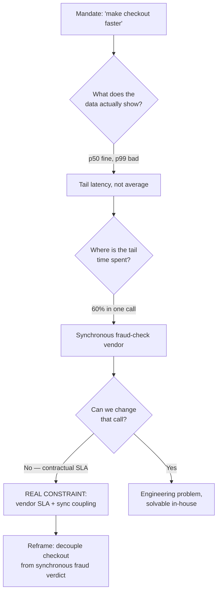
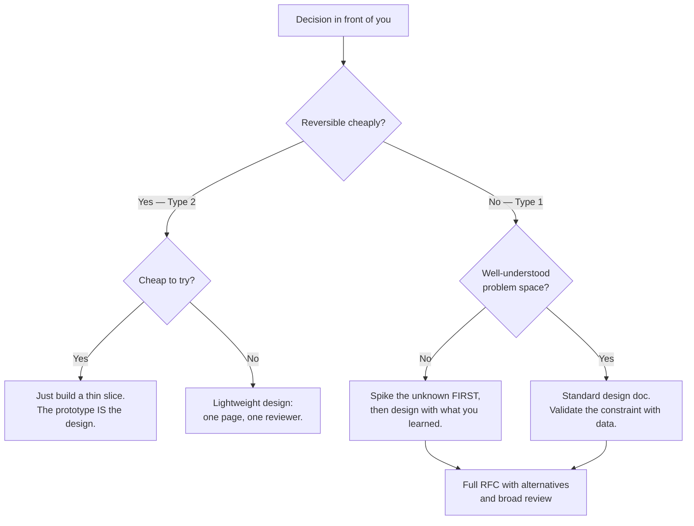

# How to Approach System Design — Staff / Principal Level

At Staff and Principal level, the hard part of system design is almost never the design. It is everything that surrounds the design: figuring out which problem is actually worth solving, getting a dozen people with conflicting incentives to agree on the same plan, sequencing the work so the org survives the transition, and writing it all down clearly enough that people act on it without you in the room. The whiteboard diagram is the easy 10%. This document is about the other 90%.

The interview teaches you to optimize a well-posed problem under a 45-minute clock. Real staff work hands you a one-sentence mandate from a VP — "make checkout faster," "we need a platform," "consolidate the data stores" — and asks you to turn that into a scoped, sequenced, reversible plan that ships value before anyone loses patience. The skills barely overlap.

---

## Table of Contents

1. [The staff mindset shift](#1-the-staff-mindset-shift)
2. [Framing an under-defined problem](#2-framing-an-under-defined-problem)
3. [Whose problem is it, really](#3-whose-problem-is-it-really)
4. [Finding the real constraint](#4-finding-the-real-constraint)
5. [Defining what is explicitly out of scope](#5-defining-what-is-explicitly-out-of-scope)
6. [Aligning stakeholders and surfacing hidden requirements](#6-aligning-stakeholders-and-surfacing-hidden-requirements)
7. [Sequencing delivery: what ships first](#7-sequencing-delivery-what-ships-first)
8. [Designing for reversibility and incremental rollout](#8-designing-for-reversibility-and-incremental-rollout)
9. [Writing the design doc / RFC that gets buy-in](#9-writing-the-design-doc--rfc-that-gets-buy-in)
10. [How much design is enough](#10-how-much-design-is-enough)
11. [Running a design review as the most senior person](#11-running-a-design-review-as-the-most-senior-person)
12. [Worked example: "make checkout faster"](#12-worked-example-make-checkout-faster)
13. [Interview approach vs real-world approach](#13-interview-approach-vs-real-world-approach)
14. [Anti-patterns and failure modes](#14-anti-patterns-and-failure-modes)
15. [A staff design checklist](#15-a-staff-design-checklist)

---

## 1. The staff mindset shift

The jump from Senior to Staff is a change in the unit of work. A senior engineer is measured on systems they build. A staff engineer is measured on outcomes that survive contact with other teams, other quarters, and other priorities. That changes what "a good design" means.

A good senior design is technically correct. A good staff design is technically correct *and* organizationally viable: it can be staffed, sequenced, funded, rolled out without an outage, and abandoned cheaply if it turns out to be wrong. A brilliant architecture that no team has bandwidth to build, or that requires a six-team coordinated migration with no rollback, is a worse staff artifact than a mediocre one that ships next sprint and can be evolved.

Three reflexes define the level:

- **You optimize for the org, not the diagram.** The best technical answer that the org can't execute is the wrong answer. You factor delivery capacity, team boundaries, and political reality into the design itself — they are not someone else's problem to solve after you hand off the architecture.
- **You sell reversibility over correctness.** You rarely have enough information to be right, so you design so that being wrong is cheap. Decisions that are hard to reverse get the most scrutiny; decisions that are easy to reverse get made fast and adjusted later.
- **You make the implicit explicit.** Half of senior-vs-staff is just *writing the thing down* — the constraint nobody named, the assumption everyone made differently, the scope boundary nobody agreed to. Ambiguity is where projects die, and your job is to drain it out of the room and onto the page.

---

## 2. Framing an under-defined problem

A mandate like "make checkout faster" is not a problem statement. It is a symptom, a hope, and a political signal compressed into three words. Framing is the act of decompressing it into something a team can actually design against. It is the single highest-leverage thing you do, and it happens before any architecture.

A well-framed problem answers, in writing, before any solution is sketched:

| Frame element | The question it answers | Failure if skipped |
|---|---|---|
| **The actual pain** | What hurts, for whom, observed how? | You optimize a metric nobody feels. |
| **The success metric** | What number moves, and to what target? | "Faster" is unfalsifiable; you can't tell when you're done. |
| **The real constraint** | What is the binding limit — cost, latency, team size, a deadline? | You solve the wrong bottleneck. |
| **The non-goals** | What are we explicitly *not* doing? | Scope creep eats the timeline. |
| **The deadline and why** | When, and what happens if we miss? | You over- or under-engineer the urgency. |

Framing is iterative and social. You write a draft frame, take it to the people who hold the context, and let them shoot it down. The frame is correct when the stakeholders read it and say "yes, that's the problem" — not when you're satisfied with it. A frame nobody has tried to falsify is just your first guess in a nicer font.

A useful test: can you state the problem as *"Today, [who] experiences [pain], measured by [metric], because [cause]. We will know we've succeeded when [metric] reaches [target] by [date]. We are deliberately not addressing [non-goals]."* If you can't fill every bracket from evidence rather than assumption, you are not ready to design.

---

## 3. Whose problem is it, really

Every mandate has an originator, a sponsor, and a set of victims — and they are frequently different people with different definitions of success. "Make checkout faster" might originate from a PM watching conversion dashboards, be sponsored by a VP who promised the board a revenue number, and be felt by users on slow mobile networks in markets you've never instrumented. If you optimize for the wrong one, you can succeed technically and fail completely.

Map the stakeholders before you design:

- **The sponsor** holds the budget and the political cover. Their definition of success is the one that funds or kills the project. Get it explicit and in writing early — sponsors' goals drift, and an undocumented goal will be redefined retroactively to call your project a failure.
- **The originator** noticed the pain. They have the richest context on the symptom but often the weakest grip on the cause.
- **The affected users** experience the problem. Their reality is the ground truth that dashboards approximate. If you can't name them concretely, you're designing against a metric, not a problem.
- **The implementing teams** will live with the result. If their incentives aren't served, they will deprioritize you no matter how clean the design.

When these constituencies disagree, surface it immediately rather than averaging across them silently. "The sponsor wants p99 checkout under 500ms to hit a conversion target; the data shows the pain is concentrated in two emerging markets on slow networks; closing that specific gap moves the metric most. Is the goal the global number or that segment?" Forcing that question early reframes the entire project and prevents you from boiling the ocean to move a number a targeted fix would have moved cheaply.

---

## 4. Finding the real constraint

Most systems have one binding constraint at a time. Everything else is slack. Staff-level framing is largely the discipline of finding that one constraint and refusing to be distracted by the comfortable problems you already know how to solve.

The real constraint is rarely the one in the mandate. "Make checkout faster" sounds like a latency problem. Profile it and you might find that p50 is fine, p99 is dominated by a synchronous third-party fraud check, and the *actual* binding constraint is a contractual SLA with that vendor — an organizational constraint wearing a performance costume. No amount of caching fixes a vendor contract.

Techniques for finding the binding constraint:

- **Measure before you theorize.** A profile, a query of the slow-request logs, or a single well-chosen dashboard beats a week of architecture debate. The constraint is usually visible in data the moment you go looking.
- **Ask "what happens if this were free?"** If you imagine the obvious bottleneck costs nothing and the problem persists, you've found the real constraint. If latency were zero but checkout still leaked revenue at a confusing error page, the constraint was UX, not speed.
- **Follow the money and the org chart.** Constraints often live at team boundaries (a service another team owns and won't change) or in contracts (a vendor, a compliance deadline). These are real and binding even though no profiler will show them.

---

## 5. Defining what is explicitly out of scope

Scope is defined by its boundary, and the boundary is the explicit list of things you are *not* doing. Stating non-goals is not bureaucratic hedging — it is the most powerful tool you have for protecting a timeline and aligning expectations. Every unstated non-goal is a future argument and a scope-creep vector.

Good non-goals are specific and slightly painful to write, because they say no to something a stakeholder wanted:

- "We are **not** redesigning the cart, only the checkout submit path."
- "We are **not** addressing checkout on the native apps in this phase — web only."
- "We will **not** replace the fraud vendor; we will decouple from its latency."
- "We are **not** building a generic 'payments platform'; we are fixing this one flow."

Write non-goals into the design doc and read them aloud in the kickoff. When a stakeholder asks for one of them mid-project, you point at the list: "That's an explicit non-goal — we agreed to defer it. If priorities changed, let's reopen scope as a decision, not absorb it silently." This converts scope creep from an ambient pressure into a visible, costed decision with an owner. The deferred items are not deleted; they go on a "later / not now" list, which is itself a form of stakeholder reassurance — you heard them, you just sequenced them out.

---

## 6. Aligning stakeholders and surfacing hidden requirements

The requirements that kill projects are the ones nobody said out loud because everyone assumed they were obvious. The compliance team assumes you know PCI data can't transit the new service. The mobile team assumes you'll keep the existing API contract. The SRE team assumes any new service comes with on-call runbooks. None of this is in the mandate, and all of it is binding.

Surfacing hidden requirements is active archaeology, not passive listening:

- **Interview adjacent teams before designing, not after.** A 30-minute conversation with security, data, mobile, and SRE leads before you write a line of design surfaces more constraints than three review cycles afterward. Ask each: "What would make this a problem for you? What's the thing I'm definitely going to get wrong?"
- **Name the politics, at least to yourself.** Two teams want to own the new service. A director has a pet technology. A reorg is coming that changes who owns checkout. These are real forces on the design. You don't have to write them in the doc, but a design that ignores them will be ground to dust in review. Pre-aligning the people who can block you — getting their objections in private before the public review — is not politics-as-dirty-work; it's how aligned decisions actually get made.
- **Drive disagreement to the surface early and cheaply.** Silent disagreement is the most expensive kind, because it resurfaces during rollout when changes cost the most. A 10-minute "does anyone fundamentally disagree with this framing?" in week one is worth a hundred hours of late-stage rework.

The output of alignment is a shared frame, not a vote. You are not seeking consensus on every detail — you are seeking enough buy-in from the people who can block or starve the project that they'll let it proceed and lend it their teams' time.

---

## 7. Sequencing delivery: what ships first

A staff design is a sequence, not a snapshot. The architecture diagram shows the destination; the value comes from the path. Two designs with identical end-states can have wildly different odds of survival depending on what ships first and what's deferred.

Sequence to **deliver value early and de-risk continuously**:

- **Ship a thin slice end-to-end before building any layer fully.** A checkout improvement that works for 1% of traffic, end to end, in production, teaches you more than a fully-built backend that's never seen a real request. The first milestone should produce a real, measurable outcome — even a small one — not infrastructure that "enables future work."
- **Front-load the riskiest unknown.** If the whole design hinges on whether you can decouple from the fraud vendor without raising fraud losses, prove that in the first milestone. Don't spend three months on the easy parts and discover the load-bearing assumption is false in month four.
- **Make each milestone independently valuable and shippable.** If milestone 3 slips, milestones 1 and 2 should already have delivered something worth keeping. A plan where value only materializes at the end is a plan that gets cancelled before the end.
- **Plan the migration path as a first-class deliverable.** Greenfield is rare; you're usually changing a running system. The migration — dual-writes, backfills, traffic shifting, the old-system decommission — is often more work than the new system itself. Sequence it explicitly: how does traffic move from old to new, in what increments, with what verification at each step, and how do you roll back at any point?

A useful sequencing heuristic: order milestones by *(risk reduced × value delivered) / cost*, and put anything that's hard to reverse behind a checkpoint where you can still change your mind.

---

## 8. Designing for reversibility and incremental rollout

You will be wrong about something. Staff design assumes this and makes being wrong survivable. The central question for any consequential decision is: *how expensive is it to undo?*

Jeff Bezos's framing is useful here — distinguish **Type 1 (one-way door)** decisions from **Type 2 (two-way door)** decisions:

| | Type 1 — one-way door | Type 2 — two-way door |
|---|---|---|
| **Reversibility** | Hard or impossible to undo | Cheap to reverse |
| **Examples** | Public API contract, data format on disk, choice of system of record, splitting a service | Internal interface, a cache, a feature flag default, a library choice behind an interface |
| **How to decide** | Slowly, with broad review, with data | Fast, by whoever's closest, adjusted later |
| **Design goal** | Add an abstraction so it *becomes* Type 2 | Just pick one and move |

Most of the craft is **converting Type 1 decisions into Type 2 decisions** by adding the right seam. You can't easily undo "we replaced the database," but you can undo "we put a repository interface in front of the database and swapped the implementation behind it." The interface costs you a little now and buys you the option to reverse cheaply later — that option is frequently worth more than picking the right database the first time.

Incremental rollout is reversibility applied to deployment:

- **Feature-flag everything consequential.** A flag turns a deploy into a decision you can reverse in seconds without a code change or a revert.
- **Roll out by percentage, by segment, by region.** 1% → 5% → 25% → 100%, watching the metrics that matter at each step. Each gate is a chance to abort cheaply.
- **Run old and new in parallel and compare.** Dual-write, shadow-read, or run the new path in "compute the answer but don't use it" mode and diff it against the old answer. You catch divergence before it touches a user.
- **Define the rollback trigger before you roll out.** "If p99 fraud-decision latency exceeds X or fraud loss rate rises above Y, we roll back automatically." A rollback you have to debate at 2 a.m. is a rollback that happens too late.

---

## 9. Writing the design doc / RFC that gets buy-in

The design doc is the actual deliverable of staff design work — more than any diagram or prototype. It is how a decision gets made by people who weren't in your head, how it survives your going on vacation, and how the org remembers *why* six months later. A design that lives only in your mind or a Slack thread does not exist organizationally.

A doc that gets buy-in is structured for the reader's decision, not for your narration of how you got there. Lead with the conclusion; bury the deliberation.

A strong RFC structure:

1. **Context & problem (the frame).** The decompressed mandate from §2: pain, metric, constraint, non-goals, deadline. If a reader stops here, they should understand *what* and *why*.
2. **Goals and non-goals.** Explicit, including the deferred list. This is where you pre-empt scope creep.
3. **Proposed approach.** The recommendation, stated up front, in enough detail to evaluate but not implement. Diagrams here.
4. **Alternatives considered.** The two or three serious options you rejected and *why*. This is the most-read and most-skipped section — it's where reviewers check whether you actually thought, and it preempts the "did you consider X?" derailment in review.
5. **Sequencing & migration.** The milestones from §7, the rollout plan from §8, the rollback story.
6. **Risks, trade-offs, open questions.** What you're unsure about, stated honestly. A doc with no open questions reads as naïve, not thorough. Inviting reviewers to help close open questions is how you convert them from critics into co-owners.
7. **Decision needed.** What, specifically, you want the reader to approve, and by when.

Principles that separate docs that move the org from docs that gather comments:

- **Write the conclusion first.** Busy readers (the ones whose buy-in you need) read the top and skim the rest. If your recommendation is on page 7, it doesn't exist.
- **Show the alternatives you killed.** Buy-in comes from readers trusting your judgment, and they trust it when they see you considered and rejected their idea before they raised it.
- **State trade-offs, not just benefits.** A doc that claims your approach has no downsides is not credible. Naming the cost of your own proposal is the single strongest trust signal in the document.
- **Make the ask unambiguous.** End with exactly what decision you need and who makes it. A doc that asks for nothing gets nothing.
- **Right-size the doc to the decision.** A reversible Type 2 choice needs a page. A one-way door that reorganizes three teams needs the full treatment. Matching doc weight to decision weight is itself a staff skill — over-documenting a cheap decision wastes the org's most expensive resource (senior attention) and trains people to ignore your docs.

---

## 10. How much design is enough

The most common staff failure modes are symmetric: designing forever without shipping, and shipping without designing the one thing that's expensive to get wrong. The skill is calibrating design depth to decision reversibility — the same axis from §8.

Practical calibration rules:

- **Design until the next most-likely-to-be-wrong assumption is one you'd bet on — then start building.** Further design past that point yields diminishing returns; you'll learn more from one real milestone than from another week of diagrams.
- **The cost of changing your mind sets the design budget.** A decision you can reverse in an afternoon deserves an afternoon of thought. A decision that locks in a data format for five years deserves weeks.
- **Spike before you design when the core unknown is technical.** If you don't know whether the approach is even feasible, a two-day prototype that answers "yes/no" is worth more than a beautiful design predicated on a guess. Design what you *can't* cheaply learn by building; build to learn the rest.
- **Beware "design as procrastination."** Endless design is often fear of committing. If you notice you're refining a diagram for the third time without new information, that's the signal to ship a slice and let reality correct you.

---

## 11. Running a design review as the most senior person

When you're the most senior person in a review, your job inverts. You are no longer there to find flaws — you're there to make the room find them, raise the level of the discussion, and convert a critique into a decision. A review where only you talk is a review that failed, no matter how sharp your feedback.

How to run it well:

- **Set the frame in the first two minutes.** State what decision the review needs to produce and what's explicitly out of scope for today. Reviews drift into rabbit holes when the goal isn't named; "today we're deciding whether to decouple from the fraud vendor, not which queue technology to use" keeps an hour of senior time on the load-bearing question.
- **Ask before you assert.** Your opinion stated first becomes the anchor everyone reacts to, and junior engineers stop offering theirs. Draw out the room — "what's the riskiest assumption here?" — before adding your own view. Your most valuable contribution is often a question that reveals an unexamined assumption, not an answer.
- **Protect the author and the dissenters.** People stop surfacing real concerns the moment a review feels like a gauntlet. Make it safe to say "I think this is wrong." The quietest person in the room often holds the objection that matters most; explicitly invite it.
- **Separate the reversible from the irreversible, out loud.** Spend the room's scarce attention on the one-way doors. Wave the two-way doors through: "that's reversible, pick one offline, let's not spend the room on it." This is the highest-leverage move a senior reviewer makes — it stops a review from drowning in bikeshedding while the genuinely expensive decision goes unexamined.
- **Drive to a decision and an owner.** A review that ends in "let's think more" with no owner and no date is a review that will repeat. End with: decided / decided-with-conditions / needs-spike, who owns the next step, and by when. Capture it in writing while the room is still there.
- **Disagree-and-commit, explicitly.** When the room can't reach consensus and the decision is reversible, name it: "we don't all agree, it's a two-way door, we're going with X and we'll revisit if the data says otherwise." Stating it converts lingering dissent into aligned action instead of quiet sabotage.

---

## 12. Worked example: "make checkout faster"

A VP forwards a board slide. The only instruction is: *"Checkout is too slow, it's costing us conversions — make it faster this quarter."* Here is the staff approach from mandate to sequenced plan.

**Step 1 — Refuse to design yet; frame the problem.** Before touching architecture, pull the data. The conversion dashboard shows a 3% drop-off correlated with slow page loads. But segmenting reveals p50 checkout latency is 800ms (fine) while p99 is 6 seconds, and the slow tail is concentrated on mobile in two emerging markets. The "slowness" is a *tail* problem in a *segment*, not a global average problem.

**Step 2 — Find the real constraint.** Tracing the p99 requests shows 60% of the tail time is a single synchronous call: a third-party fraud-verification vendor whose own p99 is terrible, made *blocking* before the order confirms. The binding constraint is not our code — it's the synchronous coupling to a vendor we have a contract with and can't replace this quarter.

**Step 3 — Reframe and align.** The reframed problem: *"Mobile users in markets A and B see p99 checkout latency of 6s because we block order confirmation on a slow external fraud check. We will cut p99 to under 1.5s for these segments by Q-end by decoupling confirmation from the synchronous fraud verdict. We are NOT replacing the vendor, redesigning the cart, or touching desktop or other markets in this phase."* Take this to the sponsor (confirm the conversion number is the goal), fraud/risk (confirm we can confirm-then-verify without unacceptable loss), and SRE (confirm async fraud handling is operable). Risk team's buy-in is the load-bearing alignment — without it, the design is dead.

**Step 4 — Choose a reversible approach.** Move fraud verification from synchronous-blocking to *confirm-optimistically-then-verify-async*: the order confirms immediately, the fraud check runs in the background, and flagged orders are held/reversed before fulfillment. This is a one-way-door-ish change to order semantics, so we put it behind a feature flag and a segment gate to make it reversible in practice.

**Step 5 — Sequence the delivery.**

| Milestone | Ships | Risk it retires | Reversible? |
|---|---|---|---|
| M1 (wk 1–2) | Shadow mode: async fraud path runs, computes verdict, compared against sync verdict; user still on old path | Proves async verdict matches sync verdict — the core fraud-loss risk | Fully — no user impact |
| M2 (wk 3–4) | Flip to async confirm for 1% of segment-A traffic, behind flag, with auto-rollback on fraud-loss or latency triggers | Proves real-world latency win and operational handling | Flag flip, seconds |
| M3 (wk 5–7) | Ramp 1% → 25% → 100% of segments A and B, watching conversion and fraud-loss dashboards | Proves the conversion thesis at scale | Percentage rollback |
| M4 (wk 8+) | Decommission shadow comparison; document runbook; report conversion delta to sponsor | — | n/a |

**Step 6 — Write it down.** A two-page RFC: the reframed problem, the segment data, the async-confirm approach, the two rejected alternatives (just cache more — doesn't touch the vendor tail; replace the vendor — can't this quarter, contract), the milestone table above, the rollback triggers, and one ask: *"Approve confirm-then-verify for the fraud check, segment-gated, by Friday."*

The deliverable was never "a faster checkout." It was a reframe that turned a vague global mandate into a targeted, sequenced, reversible change with a clear owner and a falsifiable success metric — and the judgment to *not* boil the ocean re-architecting a checkout that was mostly fine.

---

## 13. Interview approach vs real-world approach

The 45-minute interview and the real staff mandate share a vocabulary and almost nothing else. Treating the real problem like an interview is one of the most common ways capable engineers fail at the next level.

| Dimension | Interview approach | Real-world staff approach |
|---|---|---|
| **The problem** | Given, well-posed, agreed by the interviewer | Vague, contested; framing it *is* the work |
| **Requirements** | You state assumptions and the interviewer nods | You excavate hidden requirements from five teams who disagree |
| **Success metric** | "Design Twitter" — scope is the conversation | A specific number a sponsor will be judged on |
| **Constraints** | Scale numbers handed to you (100M DAU) | Found via profiling, contracts, org chart; often non-technical |
| **The deliverable** | A whiteboard diagram in 45 minutes | An RFC, a sequenced plan, and aligned stakeholders over weeks |
| **Time horizon** | Static end-state design | A migration path; what ships first matters most |
| **Reversibility** | Rarely considered | The central design axis |
| **Rollout** | Hand-waved or ignored | The hard part; feature flags, ramps, rollback triggers |
| **Stakeholders** | One interviewer | A sponsor, originator, affected users, implementing teams, blockers |
| **Politics** | None | A first-class force on the design |
| **"Done"** | Time runs out | Value shipped, metric moved, system operable, old path decommissioned |
| **Optimize for** | Demonstrating breadth and correctness | Org-executable outcomes; being cheaply wrong |

The interview rewards a fast, broad, correct sketch. The real world rewards a slow, narrow, *right-problem* frame followed by a sequenced, reversible rollout. The interview's "design the whole thing in 45 minutes" instinct is actively harmful on the job, where designing the whole thing before shipping a slice is how projects die.

The overlap worth keeping from interview practice: structured thinking, back-of-envelope estimation to sanity-check feasibility, knowing the standard building blocks, and articulating trade-offs clearly. The overlap to discard: that the problem is given, that the deadline is 45 minutes, that a diagram is the deliverable, and that you optimize alone.

---

## 14. Anti-patterns and failure modes

- **Solving the stated problem instead of the real one.** Building exactly what the mandate said and discovering it moved no metric. The mandate is a symptom; design against the cause.
- **Boiling the ocean.** Turning "fix this one flow" into "build a generic platform." Platforms earn the right to exist by serving two or three concrete cases first; a platform built ahead of demand is speculative inventory.
- **Big-bang migration.** Designing a flawless end-state with no incremental path and no rollback. The day you flip the switch is the day you discover the assumption you got wrong, and now it's in production for everyone.
- **The hero design.** A brilliant architecture that only you understand and only you can build. Bus-factor of one is an organizational liability, not a flex. If it can't be staffed and handed off, it's not done.
- **Design as procrastination.** Refining diagrams to avoid the discomfort of committing and being judged by reality. Ship a slice.
- **Consensus theater.** Mistaking "nobody objected in the meeting" for alignment. Silent disagreement is the most expensive kind; drive it to the surface early and cheaply.
- **Ignoring the org chart.** A design that requires a team to do work that serves no goal of theirs will be deprioritized into oblivion, no matter how clean. Incentives are part of the design.
- **Undocumented decisions.** The choice made in a hallway that nobody can reconstruct in six months, so the team re-litigates it — or, worse, silently reverses it.

---

## 15. A staff design checklist

Before you commit to building, you should be able to answer yes — in writing — to most of these:

- **Frame:** Can I state the problem as "*[who] experiences [pain], measured by [metric], because [cause]*," from evidence, not assumption?
- **Owner:** Do I know who the sponsor is, and is their definition of success written down?
- **Constraint:** Have I found the *one* binding constraint with data, and is it the real one (not the comfortable one)?
- **Non-goals:** Is there an explicit, slightly-painful list of what we're not doing?
- **Hidden requirements:** Have I interviewed security, data, mobile, and SRE *before* designing?
- **Alignment:** Have the people who could block or starve this seen the frame and not objected — and did I drive their disagreement out *before* the public review?
- **Sequence:** Does milestone 1 ship real, measurable value and retire the biggest risk?
- **Migration:** Is the path from old system to new explicit, incremental, and verifiable at each step?
- **Reversibility:** For every one-way-door decision, have I either added a seam to make it reversible or given it the scrutiny it deserves?
- **Rollout:** Is it feature-flagged, ramped by segment, with rollback triggers defined *before* launch?
- **Doc:** Is there an RFC that leads with the conclusion, shows the rejected alternatives, names the trade-offs, and ends with a specific ask?
- **Design budget:** Did I match the depth of design to the cost of being wrong — neither over-engineering a reversible choice nor under-thinking an irreversible one?
- **Done:** Do I know what "done" means beyond "code shipped" — metric moved, system operable, old path decommissioned?

If most of these are yes, you've done the staff work. The architecture diagram — the part everyone thinks is the job — is the last and easiest 10%.

---

*Next step:* [Interview questions](interview.md)
