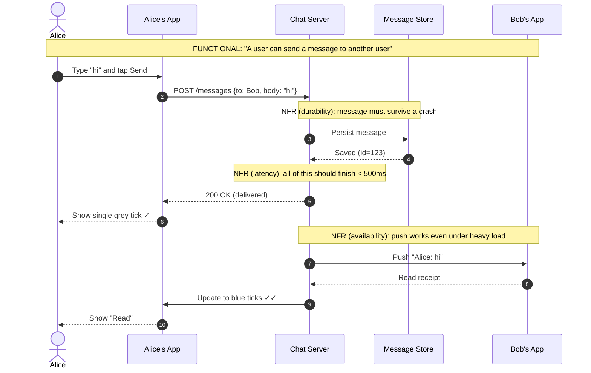
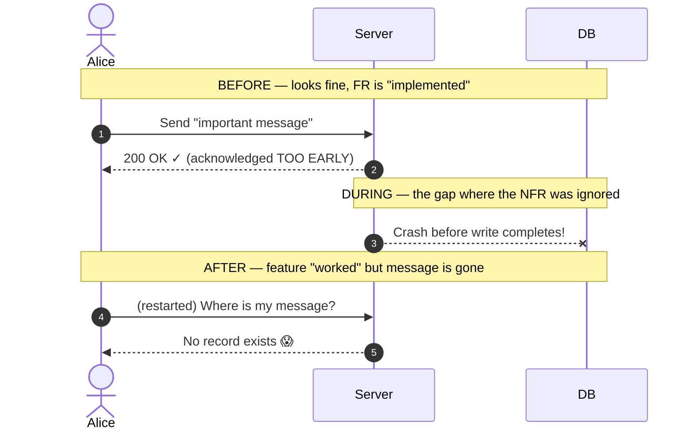

# Functional vs Non-Functional Requirements — Junior

<!-- level-focus -->
At junior level, focus on this question:

> How can I apply **Functional vs Non-Functional Requirements** in one small example and prove the result?

Use the smallest realistic scenario that exposes the decision and its failure behavior.
Before you draw a single box-and-arrow diagram, before you pick a database, before you even think about "scaling", you have to answer one deceptively simple question: **what is this system actually supposed to do, and how well does it have to do it?** Those are two different questions. The first is about *behavior* — features, actions, outputs. The second is about *quality* — speed, uptime, safety, cost. Confusing the two is one of the most common reasons junior engineers design systems that technically "work" in a demo but collapse the moment real users show up.

This page teaches you the vocabulary and the instinct to separate the two. We will keep a single running example — a **chat application** like WhatsApp or Slack — and use it everywhere so the abstract definitions stay grounded in something you can picture.

---

## 1. Why this distinction matters

Imagine two engineers are asked to build a "search box for an online store."

- Engineer A builds a search box. You type "red shoes," it returns red shoes. Done.
- Engineer B asks: "How fast must results appear? How many people search at once on Black Friday? What if the search service crashes — does the whole store go down? Can a user inject a malicious query? How much will running this cost per month?"

Engineer A delivered the **functional** requirement: *search returns matching products.* Engineer B remembered that the search box also has to be **fast, available under load, safe, and affordable** — those are the **non-functional** requirements.

Both engineers' search boxes look identical in a screenshot. But Engineer A's version returns results in 4 seconds, falls over at 500 concurrent users, and takes the storefront down with it when it crashes. Engineer B's version returns results in 120 milliseconds, survives Black Friday, and degrades gracefully. **The feature was the same. The quality was completely different.** That gap is the entire subject of this page.

A useful one-liner to memorize:

> **Functional requirements describe *what* the system does. Non-functional requirements describe *how well* it does it.**

Functional = verbs and nouns ("send a message", "delete an account"). Non-functional = adjectives and adverbs ("quickly", "reliably", "securely", "cheaply").

---

## 2. What is a functional requirement (FR)?

A **functional requirement** is a specific behavior the system must exhibit — an input it must accept, an action it must perform, or an output it must produce. If you can phrase it as *"The system shall ..."* followed by a concrete action, it is almost always functional.

Characteristics of an FR:

- It is **binary and testable by behavior**: either the feature works or it doesn't. "A user can reset their password" is either true or false.
- It maps to something a **user or another system directly experiences** as a capability.
- It usually becomes a **user story, an API endpoint, a button, or a screen**.
- If you removed it, the product would be **missing a feature**, not merely slower or shakier.

Examples of functional requirements (note the verbs):

- "A user can **register** with an email and password."
- "A user can **send** a text message to another user."
- "A user can **see** whether their message was delivered and read."
- "An admin can **ban** a user from a group."
- "The system **stores** message history and lets a user scroll back through it."

Every one of these describes an *action* or an *output*. You can demo each of them. A product manager can tick a checkbox next to each: "Yes, that works." That checkbox-ability is the fingerprint of a functional requirement.

---

## 3. What is a non-functional requirement (NFR)?

A **non-functional requirement** is a constraint on the *quality* of the system's behavior. It does not add a new feature; it puts a *bar* on how the existing features must perform. NFRs are often called **"quality attributes"** or **"the -ilities"** (scalability, reliability, availability, maintainability, observability...).

Characteristics of an NFR:

- It is **measured on a scale**, not a yes/no. "Fast" is meaningless until you say "under 200 ms for the 99th percentile of requests."
- It usually applies **across many features at once** ("all reads should be under 200 ms"), not to a single button.
- It is **invisible when met and catastrophic when missed**. Nobody praises a chat app for loading in 100 ms, but everyone complains when it takes 8 seconds.
- It is frequently **harder and more expensive** to satisfy than any single feature.

Examples of non-functional requirements for the same chat app:

- "Message delivery latency must be **under 500 ms** for 99% of messages."
- "The service must be **available 99.95%** of the time (about 4.4 hours of downtime per year)."
- "The system must support **10 million concurrent connections**."
- "Messages must be **encrypted in transit and at rest**."
- "A new engineer must be able to **deploy a change safely within one day** of joining."

None of these adds a feature. They constrain *how well* the features must run. That is the heart of the FR/NFR split.

---

## 4. The running example: a chat app

Let's anchor everything in one product. Our chat app lets people message each other one-to-one and in groups. We'll list its functional and non-functional requirements, then keep referring back to this list.

Here is the high-level flow of the single most important functional requirement — **sending a message** — drawn as a staged sequence diagram. Notice that even this "simple" feature involves several actors, and that every step quietly carries non-functional expectations (speed, reliability, durability).

Read that diagram carefully. The **functional** requirement is "send a message and show delivery/read status." But layered on top are at least three **non-functional** requirements — durability (don't lose the message), latency (do it fast), and availability (keep working under load). Same feature, multiple quality bars. This layering is exactly what we mean when we say FRs and NFRs are two different axes of the same system.

---

## 5. FRs and NFRs side by side

Here are 7 functional and 7 non-functional requirements for the chat app, side by side. Reading them in two columns trains your eye to spot the difference instantly.

| # | Functional requirement (WHAT) | Non-functional requirement (HOW WELL) |
|---|-------------------------------|---------------------------------------|
| 1 | A user can register and log in with email + password | Login must complete in under 1 second at the 95th percentile |
| 2 | A user can send a 1:1 text message | 99% of messages are delivered in under 500 ms |
| 3 | A user can create a group of up to 256 members | A group send must fan out to all 256 members within 2 seconds |
| 4 | A user can see delivered/read receipts | The service is available 99.95% of the time (≈4.4 h/year downtime) |
| 5 | A user can scroll back through full message history | History queries return the last 50 messages in under 300 ms |
| 6 | A user can send images and files | All messages are end-to-end encrypted; only sender and recipient can read them |
| 7 | An admin can remove a user from a group | The system supports 10 million concurrent connected users |

Look at the **left column**: every entry is a *capability* you could demo and tick off. Look at the **right column**: every entry is a *measurable bar* with a number, a percentage, or a quality word. The left answers "Can the user do X?" The right answers "How fast / how reliably / how safely / how cheaply does X happen?"

A subtle but important point: the two columns are **not paired one-to-one**. NFRs often cut across *all* the features at once. "99.95% availability" applies to login, sending, history, *everything*. That cross-cutting nature is part of why NFRs are harder to get right — you can't just fix one button; you have to architect the whole system to honor them.

---

## 6. How to tell them apart

When you read a requirement and aren't sure which bucket it belongs in, run it through these quick tests.

**Test 1 — The "verb vs adverb" test.**
Does the sentence describe an *action* (a verb the system performs)? → Functional. Does it describe *how well* an action is performed (an adverb/adjective: fast, reliably, securely)? → Non-functional.

- "Send a message" → action → **FR**.
- "Send a message *within 500 ms*" → the *within 500 ms* part → **NFR**.

**Test 2 — The "remove it" test.**
If you removed the requirement, what breaks?

- If a **feature disappears** ("users can no longer reset passwords") → it was an **FR**.
- If the feature still exists but becomes **slow / flaky / unsafe / expensive** → it was an **NFR**.

**Test 3 — The "how do I verify it" test.**
- If you verify it by **clicking a button and watching it work** → **FR** (functional/acceptance test).
- If you verify it by **measuring a number under load** (latency, throughput, uptime, cost) → **NFR** (performance/load/security test).

**Test 4 — The "scope" test.**
- Does it apply to **one feature**? → usually **FR**.
- Does it apply **across the whole system** ("all pages must load in under 2 s")? → usually **NFR**.

Here is the decision flow as a small state diagram you can run in your head:

One trap to watch for: a single sentence can contain **both**. "The user can search products *and results must return in under 200 ms*" packs an FR ("search products") and an NFR ("under 200 ms") into one line. When you spot this, **split it** — write the feature as one requirement and the performance bar as a separate, clearly-labeled NFR. Mixing them makes both harder to test and track.

---

## 7. The common NFR families

NFRs are not a random grab-bag. They cluster into recognizable families. Knowing the families means that when someone hands you a feature, you can systematically ask "what's the bar here?" for each one. These eight cover the vast majority of what you'll meet early in your career.

| NFR family | The question it answers | Concrete chat-app example | How you'd measure it |
|------------|-------------------------|---------------------------|----------------------|
| **Performance / latency** | How *fast* does a single operation feel? | A message reaches the recipient in < 500 ms | p50 / p95 / p99 latency in milliseconds |
| **Scalability** | Can it handle *growth* in users or data? | Goes from 1M to 50M users without a redesign | Throughput (msgs/sec) vs. cost as load grows |
| **Availability** | What fraction of the time is it *up*? | Up 99.95% (≈4.4 h/year of downtime) | Uptime % over a month; error rate |
| **Reliability** | Does it behave *correctly* and *not lose data*? | A sent message is never silently dropped | Data-loss incidents; mean time between failures |
| **Security** | Is data *protected* from bad actors? | Messages end-to-end encrypted; auth required | Pen-test results; encryption coverage |
| **Maintainability** | How easy is it to *change* safely? | A new dev ships a fix in their first week | Time-to-onboard; deploy frequency; test coverage |
| **Observability** | Can we *see* what's happening inside? | On-call can find why messages are slow in minutes | Logs/metrics/traces coverage; MTTR |
| **Cost** | Is it *affordable* to run? | Stays under $0.001 per active user per month | $ per user / per request / per GB stored |

A few clarifications juniors often need:

- **Latency vs. throughput.** Latency is *how long one request takes* (500 ms per message). Throughput is *how many requests per second* the system handles (100,000 messages/sec). A system can have great latency for one user but terrible throughput under a crowd — they are different bars and you usually need both.
- **Availability vs. reliability.** Availability is "is it up right now?" Reliability is "when it's up, does it do the right thing and keep my data?" A system can be 100% available and still lose your messages (available but unreliable), or perfectly correct but down half the day (reliable but unavailable). You want both.
- **The "nines" of availability.** Each extra nine is roughly 10× harder and more expensive:

| Availability | "Nines" | Approx. downtime per year |
|--------------|---------|----------------------------|
| 99% | two nines | ~3.65 days |
| 99.9% | three nines | ~8.77 hours |
| 99.95% | — | ~4.38 hours |
| 99.99% | four nines | ~52.6 minutes |
| 99.999% | five nines | ~5.26 minutes |

Notice how the jump from 99% to 99.99% is *not* a small polish — it's the difference between **3.65 days** and **52 minutes** of yearly downtime. That cost is why you should never write "100% uptime" on a requirements doc. There is no such thing in the real world, and chasing it bankrupts teams.

---

## 8. Why ignoring NFRs sinks real systems

Junior engineers tend to over-focus on FRs because FRs are *visible*: they're the features in the demo, the tickets in the sprint, the things the product manager asks for by name. NFRs are *invisible until they break*. Nobody writes a ticket that says "make sure the site doesn't fall over." So they get skipped — and then they sink the system. Here are the classic failure patterns, each tied to an NFR family.

**Performance ignored → the system feels broken even when it "works."**
A page that takes 8 seconds to load is functionally correct and practically useless. Studies on real e-commerce sites show that every extra second of load time measurably drops conversions. The feature was delivered; the *latency NFR* was not; the business still lost money.

**Scalability ignored → launch day is also death day.**
A startup builds everything to run on one database server. The product is great, it goes viral, 100,000 users arrive in a weekend — and the single server melts. Every feature worked perfectly with 100 test users and fails completely with 100,000 real ones. The functional requirements were all green; the *scalability NFR* was never considered.

**Availability ignored → one crash takes everything down.**
The chat server is a single process. It crashes at 2 a.m. There's no second instance to take over, so the entire app is dark until someone wakes up and restarts it. The "send message" feature is flawless — when the server happens to be running.

**Reliability ignored → silent data loss.**
The server accepts a message, returns "200 OK" to make the user happy, but crashes *before* writing it to the database. The user sees a delivered tick; the recipient never gets the message. This is the worst kind of bug because the system *looks* fine. The *reliability/durability NFR* — "never acknowledge a message you haven't safely stored" — was missed.

**Security ignored → one breach ends the company.**
Passwords stored in plaintext, no encryption, no authentication checks. Everything *works* — for the attacker too. A single leaked database can destroy user trust permanently and trigger legal penalties.

**Cost ignored → the system works and bankrupts you.**
You achieve five-nines availability and sub-50-ms latency... by running 40 idle servers. The product is a technical triumph and a financial disaster. *Cost is an NFR too*, and "we can't afford to keep it running" sinks a system just as surely as a crash.

Let's visualize the silent-data-loss failure as a before → during → after timeline, because it's the most instructive one:

The lesson is blunt: **the demo passed, the feature shipped, and the system still failed** — because the durability NFR ("persist before acknowledging") was never part of the design. NFRs are not polish you add at the end. They are structural decisions you must bake in from the start, because retrofitting them often means rebuilding.

---

## 9. How requirements feed into a design

Requirements are not paperwork you file and forget. They are the *inputs* that drive every architectural decision. The flow looks like this:

Here's the key insight a lot of juniors miss: **FRs tell you which components you need; NFRs tell you how to build and arrange those components.**

- The FR *"users can send messages"* tells you that you need a chat server, a message store, and a way to push notifications. That gives you the **boxes**.
- The NFR *"support 10 million concurrent connections"* tells you that **one** chat server box won't do — you need many servers behind a load balancer, and a way to route a message to whichever server holds the recipient's connection. That changes the **shape** of the whole system.
- The NFR *"99% of messages under 500 ms"* might push you to keep an in-memory index of who's online, instead of querying a slow database on every send.
- The NFR *"never lose a message"* forces the rule "write to the database *before* you send 200 OK" — the exact bug from Section 8.
- The NFR *"end-to-end encrypted"* changes what the server is even *allowed* to see, which ripples into how features like search-in-chat can work.

In short: take the same set of features and change the NFRs, and you get a completely different architecture. A chat app for 100 users at a company and a chat app for a billion users worldwide have **the same functional requirements** and **wildly different designs** — and the difference is driven entirely by the non-functional requirements. This is why, in a system-design interview or a real design doc, the first thing a strong engineer does is **pin down both the FRs and the NFRs (with numbers)** before drawing anything. The numbers are what make the design real.

A practical habit to adopt now: whenever someone gives you a feature, immediately ask three NFR questions —
1. **How fast** does it need to be? (latency)
2. **How many** users / requests at once? (scalability/throughput)
3. **What happens when it fails?** (availability/reliability)

Those three questions alone will make your designs dramatically more senior, because they force the invisible requirements into the open.

---

## 10. Exercise: is this an FR or an NFR?

Read each requirement and decide: **functional** or **non-functional**? Cover the answers below and try first — this is the single best way to build the instinct. All of these are for our chat app.

1. "A user can block another user so they can't send messages."
2. "Blocking takes effect within 100 ms of tapping 'Block'."
3. "The app supports group video calls of up to 8 people."
4. "Video call audio must stay in sync with video within 150 ms."
5. "All user passwords are stored hashed with bcrypt, never in plaintext."
6. "A user can change their display name and profile photo."
7. "The system stays online during a single data-center outage."
8. "Message history is searchable by keyword."
9. "Search results for a 10,000-message history return in under 400 ms."
10. "The codebase has automated tests so a change can be deployed safely the same day."
11. "An admin can export all messages in a group to a file."
12. "The service costs no more than $0.002 per active user per month to run."

Notice how items 8 and 9 describe the **same feature** (search) but split cleanly into an FR (search works) and an NFR (search is fast). That pairing shows up constantly. The feature is the floor; the NFR is the bar above it.

---

## 11. Common mistakes juniors make

**Mistake 1 — Treating NFRs as "nice to have" extras.**
NFRs are not garnish. "Fast," "available," and "secure" are often *more* important to users than any individual feature. A slow, flaky chat app loses to a fast, reliable one even if the slow one has more features. Treat NFRs as first-class requirements from day one.

**Mistake 2 — Writing vague NFRs with no numbers.**
"The system should be fast" is not a requirement — it's a wish. *Fast* for whom, doing what, measured how? Always attach a number and a percentile: "p99 message latency under 500 ms." Without a number, you cannot test it, and an untestable requirement is useless. The number is what turns an opinion into an engineering target.

**Mistake 3 — Only listing FRs in a design doc.**
If your design doc lists ten features and zero quality bars, you've described a prototype, not a system. Reviewers will (and should) immediately ask: "How many users? How fast? What's your uptime target?" Pre-empt those questions by listing NFRs up front.

**Mistake 4 — Cramming an FR and NFR into one sentence and tracking it as one thing.**
"Users can search and it must be fast" hides a performance bar inside a feature. Split it so each can be tested and tracked separately.

**Mistake 5 — Promising impossible NFRs.**
"100% uptime," "infinite scale," "zero latency." None exist. Real engineering is about *trade-offs*: more availability costs more money; more security can cost some latency; lower cost may cost some performance. A senior engineer states realistic, measurable targets and the trade-offs behind them.

**Mistake 6 — Forgetting that NFRs change the whole architecture.**
A junior adds NFRs as an afterthought ("we'll make it fast later"). But the NFRs are precisely what determine whether you need one server or a thousand, one region or five. Decide them *before* you draw the design, because they shape the design.

---

## 12. Key takeaways

- **Functional requirements (FRs)** describe *what* the system does — features, actions, outputs. They are testable as yes/no ("can the user send a message?"). They give you the **boxes** in your design.
- **Non-functional requirements (NFRs)** describe *how well* the system does it — speed, scale, uptime, safety, maintainability, cost. They are measured on a scale ("p99 under 500 ms"). They give your design its **shape**.
- To tell them apart, ask: *Is this an action (FR) or a quality bar on an action (NFR)?* Use the verb-vs-adverb, the remove-it, the how-do-I-verify, and the scope tests.
- The common NFR families are **performance/latency, scalability, availability, reliability, security, maintainability, observability, and cost.** When handed a feature, ask each family "what's the bar here?"
- **Always attach numbers to NFRs.** "Fast" is a wish; "p99 < 200 ms" is a requirement.
- **Ignoring NFRs sinks real systems** even when every feature works: slow pages lose money, single servers melt under load, early-acknowledged writes lose data, plaintext passwords leak, and over-provisioned systems bankrupt teams.
- **Requirements drive design.** FRs decide which components you need; NFRs decide how you build and arrange them. The very same features at 100 users versus a billion users produce completely different architectures — and the difference is entirely in the NFRs.
- Build the habit now: for every feature, ask **how fast, how many at once, and what happens when it fails?** Those three questions turn invisible requirements into explicit engineering targets — and make your designs look far more senior than your years.

Get this distinction into your bones. Everything else in system design — load balancers, replicas, caches, queues, sharding — is just *machinery for satisfying non-functional requirements without breaking the functional ones.* Once you see systems through that lens, the whole field starts to make sense.

---

*Next step:* [Middle level](middle.md)

---

## Apply it

1. Choose one small, known input for **Functional vs Non-Functional Requirements**.
2. Predict the output or observable behavior.
3. Run the smallest example or probe that exercises the concept.
4. Change one input to trigger a failure or boundary case.
5. Explain the evidence using the guide's vocabulary.

## Verify your work

- Record the exact input, command or code path, and output.
- Repeat the probe and confirm the result is consistent.
- Show one expected success and one expected failure.
- Resolve any difference between the prediction and the evidence.

## Review questions

- What problem does Functional vs Non-Functional Requirements solve in the example?
- Which input changes the observed result, and why?
- What is the smallest useful success check?
- Which beginner mistake would your evidence catch?
