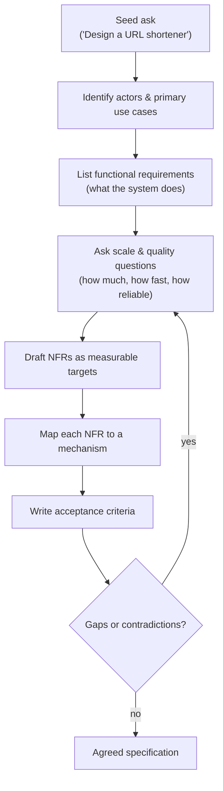
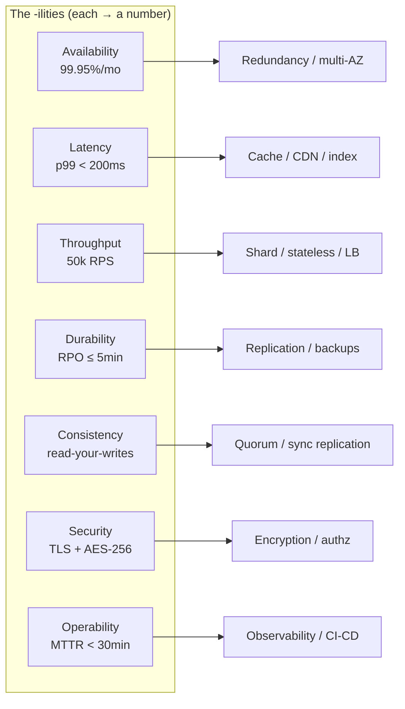
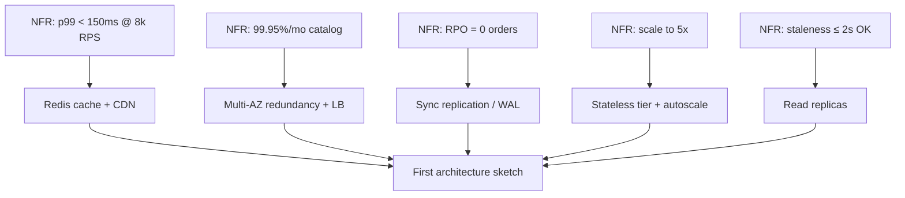
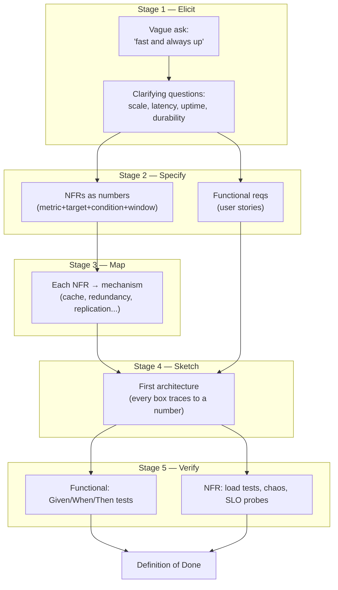

# Functional vs Non-Functional Requirements — Middle

<!-- level-focus -->
At middle level, focus on this question:

> Where does **Functional vs Non-Functional Requirements** belong in a maintainable component, and which trade-off selects the design?

Use the smallest realistic scenario that exposes the decision and its failure behavior.
You have shipped features. You know how to take a ticket and turn it into
working code. The skill this level adds is the one that separates a feature
engineer from a system designer: taking a vague, ambiguous, sometimes
self-contradictory business ask and converting it into a set of **measurable,
testable, mechanism-forcing requirements** that an architecture can actually be
built — and defended — against.

The junior page told you *what* the two categories are. This page is about the
*craft*: how to elicit requirements in an interview or a planning meeting, how
to write a non-functional requirement that has a number instead of an
adjective, how each "-ility" pins down a concrete architectural mechanism, and
how the whole thing becomes acceptance criteria a QA engineer can check.

---

## 1. Why this is the highest-leverage skill

Most failed systems are not failures of code. They are failures of requirements.
A team builds exactly what was asked — and what was asked turns out to be wrong,
under-specified, or measured against an adjective nobody can falsify.

Consider the difference between these two statements an architecture must honor:

- "The checkout should be reliable."
- "Checkout must succeed for 99.95% of valid requests measured monthly, with
  p99 latency below 800 ms at 2,000 requests per second, and no committed order
  may be lost for more than 1 minute of acknowledged writes (RPO ≤ 1 min)."

The first cannot be designed against. Any architecture is "reliable" until it
isn't, and there's no test that fails. The second forces concrete decisions:
99.95% monthly availability allows roughly **21.6 minutes of downtime per
month**, which rules out a single-instance deployment; p99 < 800 ms at 2,000 RPS
forces capacity planning and probably a cache; RPO ≤ 1 min forces synchronous or
near-synchronous replication of the order log.

The number is not bureaucracy. **The number is the design.** Every measurable
target you write down eliminates whole families of architectures and forces a
specific mechanism. That is why eliciting and writing requirements well is the
first real system-design skill — everything downstream inherits from it.

---

## 2. The elicitation loop: how to gather requirements

Requirements never arrive complete. They arrive as a sentence from a product
manager, a paragraph in a ticket, or a one-line prompt from an interviewer:
"Design a URL shortener." Your job is to run a structured loop that converts
that seed into a specification.



The loop has four properties worth internalizing:

1. **Functional first, then non-functional.** You cannot ask "how fast must
   `create_short_url` be?" until you know `create_short_url` exists. Establish
   *what* before *how well*.
2. **Scale drives everything.** The single most important number is the load:
   reads/sec, writes/sec, data volume, growth rate. A system at 10 RPS and a
   system at 100,000 RPS that do the *same thing functionally* are completely
   different architectures.
3. **It iterates.** When you map an NFR to a mechanism you often discover a new
   question ("if we cache, what staleness is acceptable?"), which sends you back
   to elicitation. This is normal, not a sign you did it wrong the first time.
4. **It terminates in agreement, not in a document.** The artifact matters less
   than the shared, falsifiable understanding it encodes.

---

## 3. The clarifying questions you actually ask

In a real planning meeting or a system-design interview, the questions below are
your toolkit. Memorize the *categories*; the specific questions follow from them.
A senior engineer who asks no clarifying questions and dives straight into boxes
and arrows is demonstrating the wrong instinct.

### Functional scope

- Who are the actors? (end users, admins, internal services, third parties)
- What are the top 3–5 use cases? What is explicitly **out** of scope?
- What is the read/write split — is this read-heavy, write-heavy, or balanced?
- Is there a "core" path that must never break vs. "nice-to-have" features?

### Scale and load

- How many users — total, daily active, peak concurrent?
- What is the request rate — average and peak QPS for the hot path?
- How much data total, and how fast does it grow per day/month/year?
- What is the largest single object (payload, file, row)?

### Latency and performance

- What does "fast" mean here — what p50/p99 latency is acceptable, and to whom?
- Is there a hard timeout the client enforces?
- Are reads and writes held to the same latency bar? (Usually not.)

### Availability and consistency

- What uptime is required — three nines, four nines? Measured over what window?
- During a partition, do we favor availability or consistency?
- Is stale data acceptable for reads, and for how long?

### Durability and data loss

- If we crash right after acknowledging a write, can we lose it?
- What is the acceptable data-loss window (RPO) and recovery time (RTO)?
- Are there regulatory retention or deletion requirements?

### Security and compliance

- Is the data sensitive (PII, payment, health)? Encryption at rest/in transit?
- Who is authorized to do what? Is there an audit requirement?

> The interviewer's answers may be "assume X." That's fine — **state your
> assumption explicitly and move on.** An unstated assumption is a latent
> requirement bug; a stated one is a documented design boundary.

---

## 4. Writing functional requirements as user stories

Functional requirements describe behavior — what the system does in response to
inputs. The most durable format is the **user story** plus its concrete
scenarios, because it ties behavior to an actor and a goal, and it naturally
extends into acceptance criteria (Section 9).

The canonical template:

> **As a** `<actor>`, **I want to** `<capability>`, **so that** `<value>`.

For a URL shortener:

> As an authenticated user, I want to submit a long URL and receive a short
> alias, so that I can share a compact link.

> As any visitor, I want to follow a short alias and be redirected to the
> original URL, so that the link works.

Each story decomposes into **scenarios** in Given/When/Then form, which are the
seeds of test cases:

| Scenario | Given | When | Then |
|---|---|---|---|
| Happy path create | a valid `https://` URL | user submits it | a 7-char alias is returned and stored |
| Duplicate URL | the same URL was shortened before by this user | user submits it again | the existing alias is returned (idempotent) |
| Redirect | a known alias | a visitor requests it | HTTP 301/302 to the original URL |
| Unknown alias | an alias that does not exist | a visitor requests it | HTTP 404 |
| Expired alias | an alias past its TTL | a visitor requests it | HTTP 410 Gone |

Notice what user stories do **not** contain: numbers about speed, uptime, or
load. "The redirect returns a 302" is functional. "The redirect returns in under
50 ms at the p99" is non-functional. Keep the two separated in your writing even
when they describe the same endpoint — they are verified by different kinds of
tests and forced by different mechanisms.

---

## 5. The core rule: NFRs are numbers, not adjectives

This is the single most important habit on this page. A non-functional
requirement written with an adjective is not a requirement — it is a wish.

| Adjective (wrong) | Measurable target (right) |
|---|---|
| "It should be fast." | "p99 read latency < 200 ms at 10,000 RPS, measured server-side." |
| "It should be highly available." | "99.95% successful responses per calendar month (≤ 21.6 min downtime)." |
| "It should scale." | "Sustain 5× current peak (50k RPS) by adding stateless nodes, no schema change." |
| "It should be reliable / durable." | "RPO ≤ 5 min; RTO ≤ 30 min; zero loss of acknowledged committed writes." |
| "It should be secure." | "All traffic over TLS 1.2+; PII encrypted at rest (AES-256); audit log retained 1 year." |
| "It should respond quickly under load." | "Latency SLO holds up to 2× peak; beyond that, shed load with 429, never time out silently." |
| "It should be easy to operate." | "MTTR < 30 min; every alert has a runbook; deploy with zero downtime." |

A well-formed NFR has **four parts**:

1. **A metric** — what you measure (latency, success rate, lost-data window).
2. **A target value** — the threshold (200 ms, 99.95%, 5 min).
3. **A condition** — under what load and at what percentile (at 10k RPS, p99).
4. **A measurement window / method** — over a month, server-side, excluding
   client network.

Drop any one of the four and the requirement becomes unfalsifiable. "p99 < 200
ms" with no load condition is meaningless — *anything* is fast at 1 RPS.
"99.95%" with no window lets a team hide a four-hour outage inside a yearly
average. **Specify all four, every time.**

A useful sanity test: *could a QA engineer write a script that returns
pass/fail against this requirement, with no judgment calls?* If yes, it's a real
NFR. If the answer requires an opinion, it's still an adjective in disguise.

---

## 6. The "-ilities," each with a measurable definition

The "-ilities" are the vocabulary of non-functional requirements. Each one is
useless as an adjective and powerful as a number. Here is each, with the metric
that makes it concrete and the mechanism it tends to force.

### Availability

- **Adjective:** "always up."
- **Metric:** percentage of successful responses over a window.
- **Example:** 99.95% per month → ~21.6 min/month downtime budget.
- **Forces:** redundancy, multi-AZ deployment, health checks, automated failover.

Reference table for the "nines" — know these cold:

| Availability | Downtime / year | Downtime / month | Downtime / day |
|---|---|---|---|
| 99% (two nines) | 3.65 days | 7.31 hours | 14.4 min |
| 99.9% (three nines) | 8.77 hours | 43.8 min | 1.44 min |
| 99.95% | 4.38 hours | 21.9 min | 43.2 sec |
| 99.99% (four nines) | 52.6 min | 4.38 min | 8.64 sec |
| 99.999% (five nines) | 5.26 min | 26.3 sec | 0.86 sec |

### Latency / Performance

- **Adjective:** "fast," "responsive."
- **Metric:** response time at a percentile, under a stated load.
- **Example:** p99 < 200 ms at 10k RPS; p50 < 50 ms.
- **Forces:** caching, CDN, indexing, read replicas, connection pooling.

> Always specify a **percentile**, never an average. The average hides the tail,
> and the tail is what users feel. A p50 of 40 ms with a p99 of 3 s is a broken
> system that "averages" fine.

### Throughput / Scalability

- **Adjective:** "handles a lot," "scales."
- **Metric:** sustained requests or bytes per second; growth headroom.
- **Example:** sustain 50k RPS; scale to 5× by adding stateless nodes.
- **Forces:** horizontal scaling, statelessness, sharding/partitioning, load balancing.

### Durability

- **Adjective:** "doesn't lose data."
- **Metric:** probability of data loss, and the loss window (RPO).
- **Example:** 99.999999999% (11 nines) object durability; RPO ≤ 5 min.
- **Forces:** replication (≥ 3 copies), backups, write-ahead logging, multi-region copies.

### Consistency

- **Adjective:** "correct," "up to date."
- **Metric:** staleness bound; consistency model (strong, read-your-writes, eventual).
- **Example:** "writes visible to the writer within 0 ms (read-your-writes);
  visible to others within 2 s."
- **Forces:** synchronous replication, quorum reads/writes, or accepting eventual consistency.

### Recoverability

- **Adjective:** "recovers from failure."
- **Metric:** RTO (time to restore service), RPO (data-loss window).
- **Example:** RTO ≤ 30 min; RPO ≤ 5 min.
- **Forces:** backups + tested restore, failover automation, runbooks, chaos drills.

### Security

- **Adjective:** "secure."
- **Metric:** specific controls and their coverage.
- **Example:** TLS 1.2+ everywhere; AES-256 at rest; auth on every endpoint;
  audit log retained 1 year.
- **Forces:** encryption, authn/authz layer, secrets management, audit pipeline.

### Maintainability / Operability

- **Adjective:** "easy to maintain."
- **Metric:** MTTR, deploy frequency, lead time, change-failure rate.
- **Example:** MTTR < 30 min; zero-downtime deploys; every alert has a runbook.
- **Forces:** observability (metrics/logs/traces), CI/CD, feature flags, blue-green deploys.

### Cost-efficiency

- **Adjective:** "affordable."
- **Metric:** cost per unit of work or per user.
- **Example:** ≤ $0.001 per 1,000 redirects; infra cost ≤ 15% of revenue.
- **Forces:** autoscaling, right-sizing, caching to cut compute, storage tiering.



---

## 7. Worked example: "fast and always up" → measurable NFRs

Let's run the full conversion on a real-sounding ask. A product manager says:

> "We're building a product catalog API for the mobile app. It needs to be
> fast and always up, and obviously we can't lose orders."

Three adjectives — *fast*, *always up*, *can't lose* — and zero numbers. Here's
the elicitation dialogue, compressed:

- **Q:** How many users and what request rate at peak?
  **A:** ~2M daily active; peak around 8,000 catalog reads/sec; ~200 order
  writes/sec.
- **Q:** What latency does the mobile team need before the UI feels sluggish?
  **A:** Product page should render in under a quarter second; they budget
  ~150 ms for our part.
- **Q:** What uptime can the business tolerate? What's the cost of an outage?
  **A:** Catalog down = lost sales; we want "as close to no downtime as
  reasonable."
- **Q:** For orders specifically — if we crash right after confirming an order,
  is losing it acceptable?
  **A:** Absolutely not. A confirmed order must survive.
- **Q:** Is slightly stale catalog data (price/stock a few seconds old)
  acceptable on reads?
  **A:** A couple seconds of staleness on the catalog is fine; orders must be
  exact.

Now the adjectives become a specification:

| Original adjective | Measurable NFR | Window / condition |
|---|---|---|
| "fast" (catalog read) | p99 < 150 ms; p50 < 40 ms | at 8k RPS, server-side |
| "fast" (order write) | p99 < 400 ms | at 200 writes/sec |
| "always up" (catalog) | 99.95% success / month (≤ 21.9 min) | rolling calendar month |
| "always up" (orders) | 99.99% success / month (≤ 4.4 min) | orders are higher-tier |
| "can't lose orders" | RPO = 0 for acknowledged orders; RTO ≤ 15 min | committed writes only |
| stale reads (implicit) | catalog staleness ≤ 2 s; orders strongly consistent | per-operation |

Two things to note. First, **we split the latency and availability targets by
operation** — reads and writes have different bars, and orders get a stricter
tier than catalog browsing. Lumping them into one number would over-engineer the
cheap path and under-engineer the critical one. Second, the *implicit* staleness
requirement only surfaced because we asked. Had we not, someone would have
assumed strong consistency everywhere and paid for synchronous replication on a
path that didn't need it.

---

## 8. Requirement → mechanism mapping

This is the payoff. Each measurable NFR does not just sit in a document — it
*forces* a specific architectural mechanism. Internalizing this mapping is what
lets you go from a requirements list to a first architecture sketch in minutes.

| NFR (measurable) | Forces this mechanism | Why |
|---|---|---|
| p99 read latency < 150 ms at 8k RPS | **Cache (Redis) + CDN + DB index** | Can't hit a cold DB on every read at that rate; cache the hot set, push static near users. |
| Catalog read 99.95% / month | **Multi-AZ + redundant instances + LB health checks** | A single instance's reboots/failures exceed the 21.9-min budget. |
| Order write 99.99% / month | **Active-active or fast failover; redundant write path** | 4.4-min budget rules out single-node; needs automated failover. |
| Sustain 8k RPS, scale to 5× | **Stateless app tier + horizontal scaling + LB** | Vertical scaling caps out; statelessness lets you add nodes freely. |
| RPO = 0 for acknowledged orders | **Synchronous replication / WAL + quorum write** | Async replication can lose the last writes on crash; sync guarantees durability before ack. |
| RTO ≤ 15 min | **Automated failover + tested backups + runbook** | Manual recovery and untested backups blow the time budget. |
| Catalog staleness ≤ 2 s OK | **Read replicas / async replication / TTL cache** | Permission to be stale lets you scale reads cheaply off replicas. |
| Orders strongly consistent | **Primary reads for orders; quorum or single-leader** | Exactness forbids reading a stale replica for order state. |
| PII encrypted, TLS everywhere | **TLS termination + at-rest encryption (KMS)** | Compliance control mapped to a concrete crypto layer. |
| Throughput grows; data > 1 node | **Sharding / partitioning by key** | Single node runs out of disk/IOPS; partition by a chosen key. |
| MTTR < 30 min | **Metrics + logs + traces + alerting + runbooks** | You can't fix fast what you can't see; observability is the mechanism. |
| Handle bursts > 2× peak | **Rate limiting / load shedding (429) + autoscale** | Protect the SLO by shedding excess rather than failing the whole tier. |

The discipline here: **never name a mechanism without the requirement that
justifies it.** "Let's add Redis" is architecture astrology. "p99 < 150 ms at 8k
RPS forces a cache, and Redis is our cache" is engineering. In a design review —
or an interview — every box on your diagram should be traceable to a number on
your requirements list. If a component answers no requirement, delete it.



---

## 9. Turning requirements into acceptance criteria

A requirement that can't be verified is a liability. The final step is turning
each requirement — functional and non-functional — into **acceptance criteria**:
concrete, pass/fail checks that close the loop between "what we agreed" and "what
we shipped."

### Functional → Given/When/Then

Functional acceptance criteria fall straight out of the user-story scenarios from
Section 4:

```gherkin
Scenario: Shorten a new URL
  Given a valid URL "https://example.com/a/very/long/path"
  When the user POSTs it to /shorten
  Then the response is 201 with a 7-character alias
  And following that alias redirects to the original URL
```

These become integration tests. A QA engineer runs them; they pass or they fail;
there is no argument.

### Non-functional → SLO-style assertions

NFR acceptance criteria are checked by load tests, chaos tests, and monitoring,
not by unit tests:

| NFR | Acceptance criterion (how it's verified) |
|---|---|
| p99 read < 150 ms at 8k RPS | Load test at 8k RPS for 10 min; assert measured p99 ≤ 150 ms. |
| 99.95% availability / month | Synthetic probes every 30 s; monthly success ratio ≥ 99.95%. |
| RPO = 0 for orders | Chaos test: kill primary mid-write; assert no acknowledged order lost. |
| RTO ≤ 15 min | Failover drill; measure time from failure injection to healthy serving. |
| Catalog staleness ≤ 2 s | Write then poll replica; assert convergence within 2 s. |
| Scale to 5× | Ramp load to 40k RPS; assert SLO holds after autoscale stabilizes. |

The pattern is the same as the four-part NFR rule: a metric, a target, a
condition, and a method — now phrased as a test that produces a verdict.

> **Definition of done** for a system-design requirement is not "we built the
> feature." It is "the feature passes its functional scenarios **and** the
> service meets its NFR targets under load **and** there is monitoring that will
> tell us when it stops."

---

## 10. The end-to-end pipeline, staged

Here is the whole journey from a vague ask to a verified system, staged so you
can see how each phase feeds the next. Read it top to bottom; this is the mental
model to carry into any design meeting or interview.



The phases are not optional steps you might skip under time pressure — they are a
dependency chain. You cannot map without numbers; you cannot get numbers without
asking; you cannot verify without targets. Skipping Stage 1 or Stage 2 is the
root cause of most "the architecture is fine but the product doesn't meet the
SLA" disasters.

---

## 11. Common mistakes at this level

Engineers who have shipped features tend to make a recognizable set of
requirements mistakes. Watch for these in your own designs and in reviews.

**1. Adjectives that never became numbers.** "Should be performant" survives all
the way into the design doc. Catch it: scan every NFR and ask "what's the
number?" No number, no requirement.

**2. Averages instead of percentiles.** "Average latency 80 ms" looks great and
hides a p99 of 4 seconds. Always specify the percentile; the tail is the
experience.

**3. One latency bar for all operations.** Holding a 50-ms p99 on both a key
lookup and a complex analytical query forces you to over-engineer one and miss
the other. Split bars per operation.

**4. Availability without a window.** "99.99%" with no period lets a team average
away a multi-hour outage. Always state the window (per month is the common
default).

**5. Gold-plating durability.** Declaring "strong consistency, RPO = 0
everywhere" when the catalog tolerates 2-second staleness. Synchronous
replication is expensive in latency and money — buy it only where a real
requirement demands it.

**6. Mechanisms with no requirement.** Reaching for Kafka, a cache, or sharding
because they're "best practice." Every component must trace to a number. If it
doesn't, you've added cost and a failure mode for nothing.

**7. Requirements with no acceptance criteria.** A target nobody can test will
silently rot. If you can't describe the load test or probe that verifies it,
the requirement isn't done.

**8. Not asking, in an interview.** Diving into boxes and arrows on "design a
URL shortener" without first asking scale, read/write split, and latency
expectations. The questions *are* the signal the interviewer is grading.

**9. Treating assumptions as facts.** When you assume peak is 10k RPS, *write it
down* as an assumption. An unstated assumption is a bug; a stated one is a
design boundary you can revisit.

---

## 12. Checklist

Before you call a set of requirements "done," confirm:

- [ ] Functional requirements written as user stories with Given/When/Then scenarios.
- [ ] Out-of-scope items listed explicitly, not just in-scope items.
- [ ] Read/write split and peak load identified with actual numbers.
- [ ] Every NFR has all four parts: metric, target, condition, window/method.
- [ ] No adjectives left as requirements ("fast," "reliable," "secure" all numbered).
- [ ] Latency stated as a percentile (p99/p50), under a stated load.
- [ ] Availability stated with a window; the downtime budget computed.
- [ ] Durability stated as RPO (and recoverability as RTO) where data matters.
- [ ] Consistency / staleness expectations stated per operation.
- [ ] Each NFR mapped to the mechanism it forces.
- [ ] Every architectural component traces back to at least one requirement.
- [ ] Each requirement has acceptance criteria a test can produce pass/fail on.
- [ ] Assumptions written down explicitly where answers were unavailable.

If every box is checked, you have a specification an architecture can be built
against, defended in review, and verified in production — which is exactly the
skill that distinguishes a system designer from someone who writes features.

---

*Next step:* [Senior level](senior.md)

---

## Apply it

1. Find a real component where **Functional vs Non-Functional Requirements** affects an interface or dependency.
2. Write two plausible choices and the constraint that favors each one.
3. Make the smallest reversible change at that boundary.
4. Exercise the component alone, then exercise the integrated flow.
5. Keep the decision note with the evidence that selected the option.

## Verify your work

- A focused check proves the local behavior.
- An integrated check proves callers and dependencies still agree.
- Logs, traces, compiler output, or benchmarks expose the boundary.
- Reverting the change restores the previous behavior without unrelated edits.

## Review questions

- Which boundary is most affected by Functional vs Non-Functional Requirements?
- What constraint would make you choose the alternative design?
- How would you isolate a local defect from an integration defect?
- What evidence shows that the change remains maintainable?
