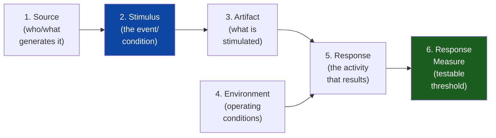
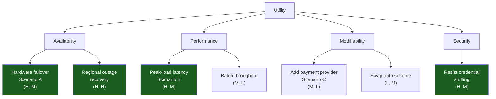
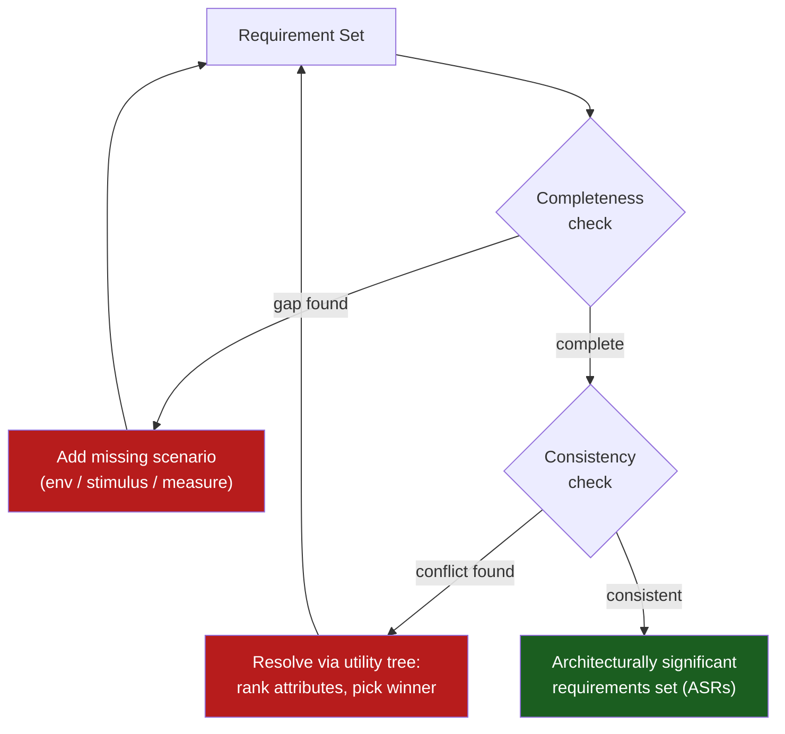
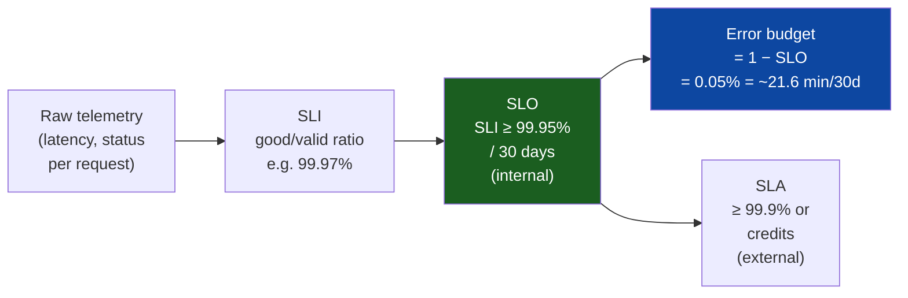
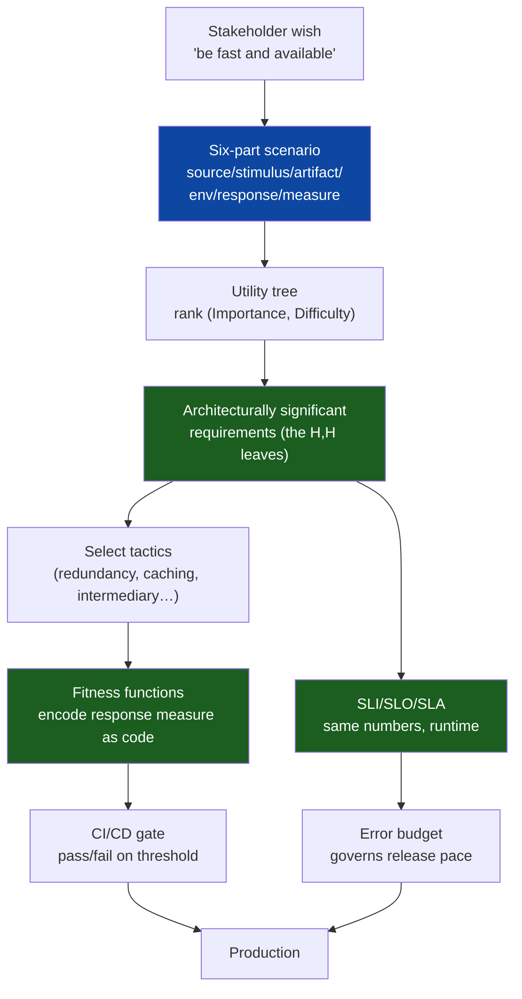

# Functional vs Non-Functional Requirements — Theory and Formal Foundations

<!-- level-focus -->
At professional level, focus on this question:

> How should teams adopt and operate **Functional vs Non-Functional Requirements — Theory and Formal Foundations** with measurable outcomes and limited coordination?

Use the smallest realistic scenario that exposes the decision and its failure behavior.
A functional requirement (FR) states *what* the system must do: a mapping from input states to output states. A non-functional requirement (NFR), more precisely a **quality attribute requirement**, constrains *how well* that mapping must behave — its latency, availability, security, modifiability, and so on. The asymmetry between them is the central fact of software architecture. Functional requirements can almost always be satisfied by any reasonable structure; quality attributes cannot. You can implement a payments API on a monolith, on microservices, or on a single shell script, and all three will "transfer money." Only the architecture decides whether the transfer completes in 50 ms at the 99th percentile, survives a datacenter loss, and can be modified in a day rather than a quarter. This is why the SEI (Software Engineering Institute) doctrine states bluntly that *functionality is largely independent of structure, but quality attributes are not* — architecture is the discipline of engineering quality attributes.

The professional problem is that "the system should be fast, available, and secure" is not a requirement. It is a wish. It is **untestable**, **unprioritizable**, and **unverifiable**. This document develops the formal machinery that turns wishes into engineering: the six-part quality attribute scenario from ATAM, the utility tree for prioritization, the architectural-tactics catalog that connects attributes to mechanisms, fitness functions that make NFRs executable, and the formal SLI/SLO/SLA hierarchy that operationalizes them in production.

## 1. The Formal Distinction

Model the system as a transition function `δ: S × I → S × O`, where `S` is the state space, `I` the inputs, and `O` the outputs.

- A **functional requirement** is a predicate over `δ` itself: for input `i` in state `s`, the produced `(s', o)` must satisfy some logical condition. *"A withdrawal of amount `a` from an account with balance `b ≥ a` produces balance `b − a` and dispenses `a`."* This is a statement about correctness of the mapping.
- A **non-functional / quality requirement** is a predicate over *the execution* of `δ` — its temporal, probabilistic, or evolutionary properties. *"95% of withdrawals complete within 200 ms under a load of 1000 req/s"* says nothing about which output is correct; it constrains the *runtime quality* of producing it.

This is why NFRs are sometimes called **emergent properties**: latency, availability, and throughput are not local properties of any one component but properties of the whole system's behavior over time, under environmental conditions, against a measure. You cannot point at a line of code and say "this is the availability." Availability emerges from redundancy, failover, retry, and detection mechanisms acting together.

A second formal lens: FRs are typically **boolean and discrete** (the function does or does not produce the right output), whereas quality attributes are **continuous and probabilistic** (latency has a distribution; availability is a fraction of time). This is why FRs are verified by example-based tests and quality attributes are verified by *statistical* tests against thresholds — a distinction that drives the entire fitness-function discussion in §8.

| Dimension | Functional Requirement | Quality Attribute Requirement |
|---|---|---|
| Question answered | *What* does it do | *How well* does it do it |
| Formal nature | Predicate over the mapping `δ` | Predicate over executions of `δ` |
| Locality | Often local to a component | Emergent across the system |
| Value type | Boolean / discrete | Continuous / probabilistic |
| Independence | Largely independent of structure | Determined by structure |
| Verification | Example-based test (pass case) | Statistical test vs threshold |
| Failure visibility | Obvious (wrong answer) | Subtle (right answer, too slow) |
| Cost of late change | Often local | Often architectural (expensive) |

The last row is the principal engineer's lever. A missed FR is a bug ticket. A missed quality attribute discovered in production — *"it works, but it falls over at 3× load and we cannot shard"* — is a re-architecture. Quality attributes must therefore be elicited, quantified, and prioritized **before** the structure is fixed, because the structure is chosen *to satisfy them*.

## 2. Why Vague NFRs Fail: Three Failure Modes

"The system shall be highly available" fails in three independent ways, and naming them precisely is the first job of requirements engineering.

1. **Untestable.** "Highly available" has no pass/fail boundary. Is 99% available? 99.999%? Measured over what window — a minute, a quarter? Without a measure and a window, no test can return red or green. An untestable requirement is a requirement that can never be *shown to be unmet*, which means it can never be *shown to be met* either.
2. **Unprioritizable.** Quality attributes conflict. Security adds latency; availability adds cost; modifiability can reduce performance. "Be available and be fast and be secure" gives the architect no way to choose when (not if) they collide. Without relative priority and a sense of difficulty, there is no rational basis for a design decision.
3. **Unattributable.** Vague NFRs do not name the *stimulus* or *environment*. "Available" — during normal operation, or during a node failure, or during a regional outage? The answer changes the architecture by an order of magnitude in cost. A requirement that does not name its conditions cannot drive a design.

The remedy to all three is a single artifact that forces *source, stimulus, environment, response, and measure* to be made explicit: the quality attribute scenario.

## 3. The Quality Attribute Scenario (Six-Part Form)

The **quality attribute scenario**, from the SEI's ATAM (Architecture Tradeoff Analysis Method) and codified in *Software Architecture in Practice* (Bass, Clements, Kazman), is the canonical unit of a quality requirement. It decomposes any NFR into six parts, every one of which must be filled in:



The six parts, defined precisely:

1. **Source of stimulus.** The entity (a user, another system, an internal timer, an attacker, a developer) that generates the stimulus. Naming the source disambiguates "load from legitimate users" vs "load from a DoS attacker" — they demand different responses.
2. **Stimulus.** The condition that requires a response. For availability it is a *fault* (crash, omission, timing fault, Byzantine fault). For performance it is the *arrival of a request*. For modifiability it is a *change request*. The stimulus is the trigger the architecture must be designed to handle.
3. **Artifact.** The part of the system that is stimulated — the whole system, a specific service, a data store, a UI. Naming the artifact prevents the requirement from being unboundedly global.
4. **Environment.** The operating conditions when the stimulus arrives: normal operation, peak load, overloaded, degraded mode, during a deploy, after a regional failover. The same stimulus can have *different* required responses in different environments, and the environment is where most ambiguity hides.
5. **Response.** The observable activity that results — the system detects the fault and fails over; the request is processed; the change is made and deployed. The response is what the architecture *does* about the stimulus.
6. **Response measure.** The quantified, testable threshold against which the response is judged: latency at a percentile, a recovery-time bound, a fraction of changes deployable without other modules, a probability. **This is the part that makes the requirement falsifiable.** No measure, no requirement.

The discipline is brutal and deliberate: if you cannot fill in all six parts, you do not yet understand the requirement well enough to design for it. A scenario with an empty "response measure" is a wish wearing a requirement's clothes.

## 4. Worked Scenarios

Below are three complete scenarios in the six-part form, one each for availability, performance, and modifiability — the three attributes most often decisive in backend systems.

### Scenario A — Availability (single-node failure)

| Part | Value |
|---|---|
| **Source** | Internal hardware (a process/VM in the payments service) |
| **Stimulus** | A fault: an unresponsive node (crash fault / omission) |
| **Artifact** | The payments processing service |
| **Environment** | Normal operation, business hours, 1,200 req/s sustained |
| **Response** | The health-check mechanism detects the fault, the load balancer evicts the node, and in-flight idempotent requests are retried against a healthy replica with no operator intervention |
| **Response measure** | No requests are lost; tail latency for the affected requests stays under 800 ms; **mean time to recovery (MTTR) ≤ 5 s**; downtime contributes ≤ 0.001% to the monthly availability budget |

Prose form: *"When a payments-service node crashes during normal business-hours load, the system shall automatically detect the failure and reroute traffic to a healthy replica within 5 seconds, losing no requests and keeping affected-request latency below 800 ms."*

Notice what the six parts force: we had to decide that the fault is a *crash* (not a Byzantine fault — a separate, much harder scenario), that recovery is *automatic* (no human in the loop), and that the bound is *5 seconds* (which immediately implies sub-5-second health-check intervals and a hot or warm standby, not a cold restart). Three architectural decisions fall directly out of one well-formed scenario.

### Scenario B — Performance (peak-load latency)

| Part | Value |
|---|---|
| **Source** | 50,000 concurrent end users (legitimate traffic) |
| **Stimulus** | A burst of "view product catalog" requests at the start of a flash sale |
| **Artifact** | The catalog read API and its backing cache + database |
| **Environment** | Peak load: 8,000 req/s, 4× the normal steady-state rate |
| **Response** | Requests are served, predominantly from cache, with overflow served from read replicas; the system does not shed legitimate load |
| **Response measure** | **p99 latency ≤ 200 ms, p50 ≤ 40 ms; error rate ≤ 0.1%; throughput sustained at 8,000 req/s for 30 minutes** |

The precision of the measure is doing real work. "Fast" is replaced by *a distribution with named percentiles*. p50 and p99 are specified separately because a single mean would hide tail latency — and tail latency is what users actually experience under load (a 200 ms p99 over a request that fans out to 10 services means many users see the tail). The environment (4× normal, 30-minute sustained) tells the architect to design for the *burst*, which is the difference between provisioning for the average and provisioning for the spike.

### Scenario C — Modifiability (adding a payment provider)

| Part | Value |
|---|---|
| **Source** | A developer on the payments team |
| **Stimulus** | A change request: integrate a new third-party payment provider (e.g., a regional bank's gateway) |
| **Artifact** | The payment-provider integration layer |
| **Environment** | Design/build time, on the mainline branch |
| **Response** | The new provider is added by implementing a single well-defined `PaymentProvider` interface; no changes are required to the orchestration, ledger, or settlement modules; the change is feature-flagged and deployed independently |
| **Response measure** | **The change touches ≤ 1 module; effort ≤ 3 developer-days; zero changes to ≥ 4 downstream modules; no regression in the existing provider test suite** |

Modifiability measures are *structural and economic*, not temporal: number of modules touched, developer-days, ripple count. This scenario is testable at design-review time (count the modules the design touches) and at delivery time (measure the actual diff and effort). It is the scenario that justifies the cost of an abstraction layer: without it, "easy to add providers" is unfalsifiable; with it, an architecture that requires touching the ledger to add a provider *fails a written test*.

These three scenarios illustrate the general truth: each quality attribute has a *characteristic measure* — availability in time/probability, performance in latency/throughput distributions, modifiability in modules-touched/effort. Knowing the characteristic measure of an attribute is most of knowing how to specify it.

## 5. Utility Trees: Prioritizing Quality Attributes

Scenarios solve untestability and unattributability. The **utility tree** solves unprioritizability. It is the ATAM artifact that organizes scenarios into a tree rooted at overall system *utility*, branching into quality attributes, then sub-attributes (refinements), then leaves that are concrete scenarios. Each leaf scenario is annotated with a two-part rank `(Importance, Difficulty)`, each typically `H`/`M`/`L`.



The `(Importance, Difficulty)` ranking is the engine of prioritization:

- **(High, High)** leaves are the *architectural drivers*. They are important to the business *and* hard to achieve — exactly where architectural decisions matter most and where ATAM evaluation focuses its limited time. Scenario A2 (regional outage recovery) is the classic example: business-critical and genuinely difficult (multi-region replication, data consistency under partition, failover orchestration).
- **(High, Low)** leaves are important but easy — satisfy them and move on; they rarely drive structure.
- **(Low, *)** leaves are deprioritized regardless of difficulty.

The utility tree forces a conversation that vague NFR lists never do: *"We have engineering budget to drive the architecture toward three or four (H,H) scenarios. Which three?"* Because quality attributes conflict (security vs latency, availability vs cost), this is a tradeoff conversation, and the tree makes the tradeoffs explicit and rankable. The architecturally significant requirements (ASRs) are exactly the high-importance leaves — usually a small subset of all requirements that nonetheless dictate most of the structure.

A small utility tree like the one above, with eight to fifteen leaf scenarios, is typically enough to drive the architecture of a substantial system. The goal is not exhaustiveness; it is to surface the handful of `(H, H)` scenarios that the architecture must be *evaluated against*.

## 6. Architectural Tactics Mapped to Attributes

A **tactic** is a design decision that influences the response of a single quality attribute. Tactics are the vocabulary that connects a scenario ("recover from a node fault in 5 s") to a mechanism ("active redundancy + heartbeat detection"). The SEI catalog organizes tactics under each attribute; the principal engineer's fluency is in knowing which tactic answers which part of a scenario.

| Quality Attribute | Tactic Category | Concrete Tactic | Scenario Part It Addresses |
|---|---|---|---|
| Availability | Detect faults | Heartbeat / Ping-Echo / Monitor | Detect the *stimulus* (fault) |
| Availability | Detect faults | Timeout / Exception detection | Detect omission & timing faults |
| Availability | Recover (preparation) | Active redundancy (hot spare) | Bound MTTR in *response measure* |
| Availability | Recover (preparation) | Passive redundancy (warm spare) | Cheaper recovery, looser bound |
| Availability | Recover (reintroduction) | Rollback / State resynchronization | Restore consistency post-fault |
| Availability | Prevent faults | Removal from service / Transactions | Reduce fault *stimulus* rate |
| Performance | Control demand | Bound queue / Rate limit / Sample | Protect *response* under peak *environment* |
| Performance | Control demand | Prioritize events / Reduce overhead | Meet tail-latency *measure* |
| Performance | Manage resources | Caching / Multiple copies of data | Lower p50/p99 *measure* |
| Performance | Manage resources | Increase concurrency / Replicate | Sustain throughput *measure* |
| Performance | Manage resources | Bound execution times | Cap worst-case *response* |
| Modifiability | Reduce coupling | Use an intermediary / Abstract common services | Limit *modules touched* in change |
| Modifiability | Reduce coupling | Restrict dependencies / Encapsulate | Reduce *ripple* in *response measure* |
| Modifiability | Increase cohesion | Increase semantic coherence | Localize the *change stimulus* |
| Modifiability | Defer binding | Configuration / Plug-ins / Late binding | Change without recompile/redeploy |
| Security | Resist attacks | Authenticate / Authorize / Limit access | Counter attacker *stimulus* |
| Security | Detect attacks | Detect intrusion / Verify message integrity | Detect the *stimulus* |
| Security | React / Recover | Revoke access / Audit / Lock computer | Bound damage *response* |

The table is read as a design move-list. Given Scenario A (5-second MTTR for a crash fault), the architect reads down the Availability rows: detection via *heartbeat* with a sub-5-second interval, recovery via *active redundancy* so a hot spare is already warm, reintroduction via *state resynchronization* so the recovered node rejoins cleanly. The 5-second measure *rejects* passive redundancy (a warm spare takes too long to promote) — the measure constrains the tactic. This is the whole point: a quantified response measure does not just test the design, it *selects* the tactics.

Tactics also expose tradeoffs. *Caching* (a performance tactic) and *modifiability* conflict: a cache adds invalidation logic that couples modules. *Active redundancy* (availability) raises cost. ATAM names these tradeoff points and sensitivity points explicitly — a sensitivity point is a decision that strongly affects one attribute; a tradeoff point is a decision that affects several in opposing directions (a cache TTL is a classic tradeoff point between performance and consistency).

## 7. Quantifying NFRs: From Adjective to Number

Every quality attribute has a *characteristic measure*. Quantification is the act of replacing the adjective with that measure plus a window and a percentile. The following table is the translation dictionary every principal engineer carries.

| Attribute | Vague form | Quantified form |
|---|---|---|
| Performance (latency) | "fast" | p50 ≤ 40 ms, p99 ≤ 200 ms, p99.9 ≤ 500 ms, over a 5-min window |
| Performance (throughput) | "handle the load" | ≥ 8,000 req/s sustained 30 min, error rate ≤ 0.1% |
| Availability | "highly available" | ≥ 99.95% successful requests / 30-day rolling window |
| Reliability | "reliable" | MTBF ≥ 720 h; ≤ 1 incident / quarter of severity ≥ SEV2 |
| Recoverability | "recovers quickly" | MTTR ≤ 5 s (node), RTO ≤ 15 min (region), RPO ≤ 5 s |
| Scalability | "scales" | Linear throughput to 10× nodes; ≤ 15% efficiency loss |
| Modifiability | "easy to change" | New provider ≤ 3 dev-days, ≤ 1 module, 0 ledger changes |
| Security | "secure" | ≤ 1% account-takeover on credential stuffing; MFA on 100% of admin actions; secrets rotated ≤ 90 d |
| Usability | "user-friendly" | Task completion ≥ 95%; first-success ≤ 90 s |

Three rules govern quantification at the professional level:

1. **Always specify a percentile, never just a mean.** Means hide tails, and tails are what fan-out architectures and real users experience. A system with a 50 ms mean and a 4 s p99.9 is a system that hangs for one request in a thousand — invisible to the mean, catastrophic to a 30-fan-out request where the slowest dependency sets the response time.
2. **Always specify a window.** "99.95% available" is meaningless without "per 30-day rolling window." The window determines the error budget (see §10) and the alerting math.
3. **Always specify the environment.** A latency target under normal load and under 4× peak are different requirements demanding different tactics. The environment from the scenario is part of the number.

The characteristic-measure idea also tells you when an attribute is *mis-specified*. If someone quantifies modifiability in milliseconds, they have confused it with performance. If someone quantifies availability without a window, they have not quantified it at all.

## 8. Fitness Functions and Executable Acceptance Tests

A quantified NFR is testable in principle. A **fitness function** makes it testable in practice and *continuously*. Borrowed from evolutionary computation and popularized for architecture by Ford, Parsons, and Kua (*Building Evolutionary Architectures*), a fitness function is any automated, objective check that returns a pass/fail (or a number compared to a threshold) for a quality attribute. It is the executable form of a scenario's response measure.

The defining move is to **encode the response measure as code that runs in CI/CD or in production**, so that a regression in a quality attribute breaks a build or trips an alert exactly as a functional regression breaks a unit test.

A concrete example for **Scenario B** (peak-load latency, p99 ≤ 200 ms at 8,000 req/s):

```python
import statistics
from load_harness import run_load

def fitness_p99_latency_under_peak():
    # Drive the catalog read API at the scenario's peak environment.
    result = run_load(
        target="https://catalog.internal/api/v1/products",
        rps=8000,                 # environment: 4x normal
        duration_seconds=1800,    # 30-minute sustained burst
        warmup_seconds=120,
    )
    latencies_ms = result.latencies_ms        # one sample per request
    p50 = statistics.quantiles(latencies_ms, n=100)[49]
    p99 = statistics.quantiles(latencies_ms, n=100)[98]
    error_rate = result.errors / result.total

    # Thresholds == the scenario's response measure. Numeric, not adjectival.
    THRESHOLD_P50_MS   = 40.0
    THRESHOLD_P99_MS   = 200.0
    THRESHOLD_ERR_RATE = 0.001

    assert p50 <= THRESHOLD_P50_MS,   f"p50 {p50:.1f}ms > {THRESHOLD_P50_MS}ms"
    assert p99 <= THRESHOLD_P99_MS,   f"p99 {p99:.1f}ms > {THRESHOLD_P99_MS}ms"
    assert error_rate <= THRESHOLD_ERR_RATE, f"errors {error_rate:.4f} > {THRESHOLD_ERR_RATE}"
    return {"p50": p50, "p99": p99, "error_rate": error_rate}  # pass
```

This function *is* the requirement. The threshold `200.0` is the scenario's response measure, transcribed. If a code change pushes p99 to 230 ms, the build goes red — the quality attribute is now defended by automation exactly like correctness. Note three professional details: the load is driven at the *scenario's environment* (8,000 rps, 30 min) not a convenient small number; the measure uses *percentiles* not a mean; and the test returns the measured numbers so trends can be tracked, not just the boolean.

Fitness functions generalize across attributes:

| Attribute | Fitness function form | Threshold example |
|---|---|---|
| Performance | Load test asserting p99 | p99 ≤ 200 ms |
| Availability | Chaos test killing a node, measuring MTTR | MTTR ≤ 5 s, 0 lost requests |
| Modifiability | Static dependency analysis (e.g., ArchUnit) asserting no forbidden edge | 0 dependencies from `provider.*` to `ledger.*` |
| Scalability | Stepped load test, measuring efficiency vs node count | ≥ 85% efficiency at 10× |
| Security | Automated SAST/DAST + dependency CVE gate | 0 high-severity CVEs in build |
| Code structure | Cyclic-dependency detection | 0 cycles between top-level packages |

Fitness functions are classified as **atomic vs holistic** (one attribute vs an interaction of several), **triggered vs continuous** (run on a build vs always-on in production via monitoring), and **static vs dynamic** (fixed threshold vs one that adapts to context). The principal-level practice is to maintain a *suite* of fitness functions — the executable, regression-proof embodiment of the utility tree's significant scenarios — so that the architecture's quality attributes are continuously, objectively guarded.

## 9. Completeness and Consistency Checking

A set of requirements is an artifact that can itself be *wrong* in two formal ways: it can be **incomplete** (missing requirements) or **inconsistent** (containing contradictory requirements). Both are checkable.

**Completeness** asks: does every input have a specified output, and does every quality attribute have a scenario for each environment that matters? Practical completeness checks:

- *Coverage of environments.* For each `(H, *)` attribute in the utility tree, is there a scenario for normal operation, for peak, and for failure/degraded mode? A performance requirement with a normal-load scenario but no peak-load scenario is incomplete — and peak is exactly where systems fail.
- *Coverage of stimuli.* For availability, are all relevant fault classes covered — crash, omission, timing, response (Byzantine)? Most specs cover crash and silently omit the rest.
- *No empty parts.* Every scenario must have all six parts filled. An empty response measure is an incompleteness defect, full stop.
- *Boundary and exception coverage* for FRs: every input domain partition (valid, invalid, boundary, empty) has a specified behavior.

**Consistency** asks: can all requirements be satisfied simultaneously? Inconsistency is usually a *latent tradeoff made explicit too late*:

- *Direct numeric contradiction.* "p99 ≤ 50 ms" and "all writes synchronously replicated across three regions" may be jointly unsatisfiable, because cross-region round-trips alone exceed 50 ms. The contradiction is arithmetic and can be caught by back-of-envelope math at review time.
- *Attribute conflict.* "Zero data loss (RPO = 0)" requires synchronous replication, which conflicts with "lowest possible write latency." These cannot both be maximized; the spec must state which yields. An unresolved conflict is an inconsistency.
- *Security vs usability.* "MFA on every action" vs "task completion in ≤ 90 s" may collide. The spec must rank them.



The professional output of this stage is a *consistent, complete, ranked* set of architecturally significant requirements — the input the architecture is actually designed and evaluated against. Tools assist (ArchUnit and dependency analyzers for structural consistency, capacity math for numeric consistency, model checkers for protocol-level consistency), but the decisive act is human: when two requirements conflict, the utility tree's rankings decide which wins, and that decision is recorded.

## 10. SLI, SLO, SLA: The Formal Hierarchy

The runtime operationalization of quality attributes is the SLI/SLO/SLA hierarchy from Google's SRE practice. The three are distinct and frequently confused; the distinction is formal.

- **SLI — Service Level Indicator.** A *measured* quantity: a number, usually a ratio of good events to total events, in `[0, 1]`. Formally `SLI = good_events / valid_events`. Example: *the fraction of HTTP requests served in < 200 ms with a 2xx/3xx status, over the trailing 5 minutes.* An SLI is a **measurement** — the instrument reading. It maps directly to a scenario's *response measure*.
- **SLO — Service Level Objective.** A *target* on an SLI: a threshold the SLI must meet over a window. Formally `SLO: SLI ≥ target over window`. Example: *the latency SLI ≥ 99.5% over a 30-day rolling window.* An SLO is the **internal goal** — the line the team commits to defend. It maps to the scenario's response measure *promoted to a continuous objective*.
- **SLA — Service Level Agreement.** A *contract* with a customer that includes the SLO **plus consequences** (credits, penalties) for breaching it. Example: *if monthly availability drops below 99.9%, the customer receives a 10% credit.* An SLA is the **external, legal/commercial** wrapper. SLAs are almost always *looser* than the internal SLO (you defend 99.95% internally to safely promise 99.9% externally), so that the team has margin before contractual penalties trigger.

| Aspect | SLI | SLO | SLA |
|---|---|---|---|
| What it is | A measurement | An internal target | An external contract |
| Form | `good / valid` ∈ [0,1] | `SLI ≥ target / window` | SLO + consequences |
| Audience | Engineering | Engineering / product | Customer / legal |
| Consequence of miss | None (just a number) | Burn error budget; freeze risky work | Credits / penalties |
| Tightness | n/a | Tighter than SLA | Looser (margin below SLO) |
| Maps to scenario | Response measure | Measure as continuous objective | Commercial promise |



The hierarchy yields one of the most important operational primitives: the **error budget**, `1 − SLO`. If the availability SLO is 99.95% over 30 days, the error budget is 0.05% of the time, which is about **21.6 minutes of allowed unavailability per 30 days** (`0.0005 × 30 × 24 × 60 ≈ 21.6`). The error budget converts a quality attribute into a *spendable resource*: while budget remains, the team may ship faster and take risks; when budget is exhausted, risky changes freeze until reliability is restored. This is the mechanism by which an abstract NFR ("highly available") becomes a concrete, daily engineering decision — the final, operational answer to the untestability that opened this document.

Two professional cautions. First, **choose few SLIs that reflect user experience** — typically availability, latency, and correctness on the critical path — not a dashboard of fifty metrics; Goodhart's law punishes the over-indicator-ed team. Second, the SLI's definition of "good" must match the scenario: if the latency scenario says p99 ≤ 200 ms, the SLI's "good" predicate is "served in < 200 ms," not "< 1 s." The SLI, the SLO, the scenario's response measure, and the fitness function's threshold should all carry *the same number*. When they do, the requirement is coherent from elicitation through contract.

## 11. The Verification Pipeline (Staged)

The full lifecycle, from a vague stakeholder wish to a continuously defended production guarantee, is a pipeline. Each stage consumes a less-formal artifact and produces a more-formal, more-testable one.



The invariant that makes the pipeline rigorous: **the same number flows through every stage.** The "200 ms p99" that a stakeholder approves in a scenario is the response measure in the utility-tree leaf, the threshold in the fitness function, the "good" boundary in the SLI, and the line in the SLO. When the numbers diverge — when the fitness function tests 1 s but the SLO promises 200 ms — the requirement has silently fractured, and the system will pass its tests while failing its contract. Auditing for *number coherence across stages* is a high-leverage principal-engineer review.

## 12. Principal-Level Synthesis

The functional/non-functional distinction is not bookkeeping; it is the boundary between what any structure can do and what only the *right* structure can do. The professional discipline summarized:

1. **Functional requirements constrain the mapping; quality attributes constrain its executions, and only quality attributes determine architecture.** Design effort follows the (High, High) scenarios because those are the ones the structure exists to satisfy.
2. **The six-part scenario is the atomic unit of a quality requirement.** No scenario is complete until source, stimulus, artifact, environment, response, *and* a numeric response measure are all filled in. The response measure is what makes the requirement falsifiable.
3. **The utility tree turns a flat list into a ranked tradeoff.** `(Importance, Difficulty)` surfaces the architecturally significant requirements and forces the conflict conversations (security vs latency, availability vs cost) to happen at design time, not in an incident review.
4. **Tactics connect scenarios to mechanisms, and the response measure selects the tactic.** A 5-second MTTR rejects passive redundancy; a 200 ms p99 demands caching. Quantification is not just for testing — it constrains the design space.
5. **Fitness functions make quality attributes regression-proof.** Encoding the response measure as a CI/CD or production check defends latency, availability, and modifiability exactly as unit tests defend correctness.
6. **Completeness and consistency are properties of the requirement set itself.** Check that every important attribute has scenarios across normal/peak/failure environments, and that no two requirements are arithmetically or attribute-conflict unsatisfiable; resolve conflicts via the utility-tree ranking.
7. **SLI → SLO → SLA operationalizes the same numbers in production**, and the error budget (`1 − SLO`) converts an abstract quality attribute into a spendable resource that governs the daily pace of change.

The through-line is a single phrase: *replace the adjective with a number, attach the number to a scenario, rank the scenarios, encode the number as a test, and carry that one number unchanged from elicitation to contract.* That is the entire engineering content of "functional vs non-functional requirements" at the level where systems are built to last.


---

## Apply it

1. Define the user or business outcome that **Functional vs Non-Functional Requirements — Theory and Formal Foundations** should improve.
2. Assign one owner for code, contracts, operations, and incidents.
3. Split delivery into reversible increments that produce evidence early.
4. Publish responsibilities, escalation paths, and compatibility windows.
5. Stop or expand only when the agreed measures support that decision.

## Verify your work

- Each increment has an owner, rollback path, and observable exit condition.
- Adoption, reliability, delivery time, and coordination cost are measured.
- Incident and migration exercises prove that responsibility is executable.
- The old path is removed only after telemetry proves it is unused.

## Review questions

- Which measurable outcome justifies investing in Functional vs Non-Functional Requirements — Theory and Formal Foundations?
- Which team owns the full lifecycle and incident response?
- What reversible increment produces the earliest useful evidence?
- Which exit condition proves that migration or adoption is complete?
