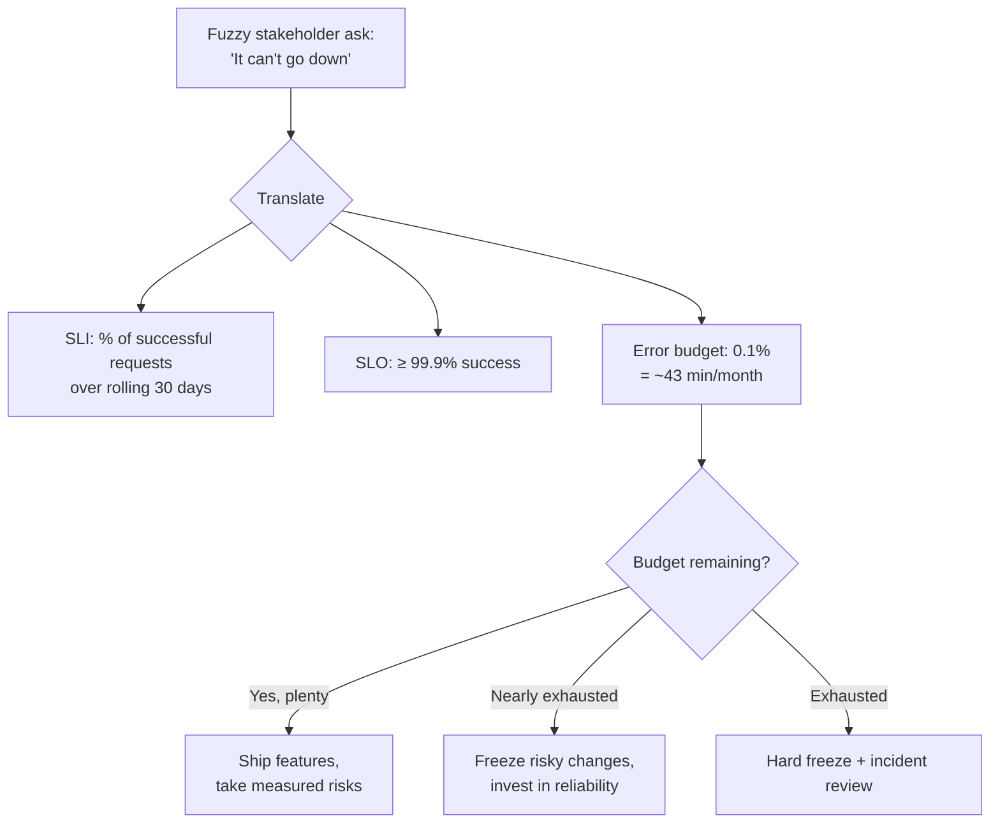
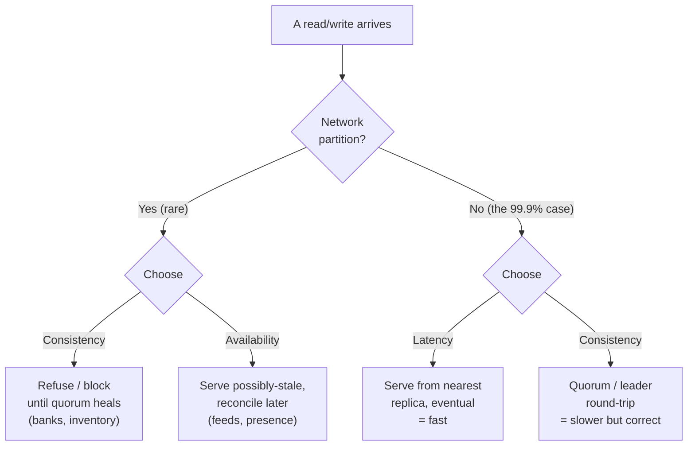
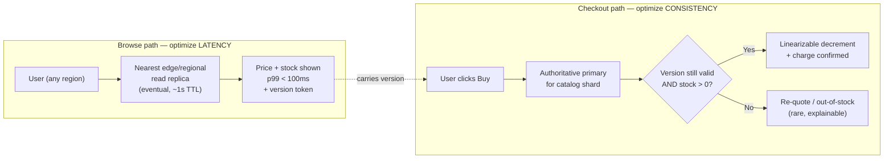

# Functional vs Non-Functional Requirements — Senior

<!-- level-focus -->
At senior level, focus on this question:

> Which system invariant is affected by **Functional vs Non-Functional Requirements** under failure, load, and change?

Use the smallest realistic scenario that exposes the decision and its failure behavior.
At the junior level you learn that functional requirements (FRs) say *what* the system does and non-functional requirements (NFRs) say *how well* it does it. That framing is correct but it buries the lead. As a system owner, your job is to internalize a harder truth: **the features are usually the easy part, and the NFRs are what actually determine your architecture, your headcount, your cloud bill, and whether you get paged at 3 a.m.** Two systems with an identical feature list — "users can post a message and others can read it" — can differ by three orders of magnitude in cost and complexity depending solely on the NFRs attached: 100 users vs. 100 million, eventual vs. linearizable reads, 99.9% vs. 99.999% availability, best-effort vs. sub-50ms p99 latency.

This document treats requirements as a negotiation and an engineering trade space, not a checklist. You will not learn how to *list* NFRs here; you will learn how to *price* them, *prioritize* them against each other, *negotiate* them down when they are unaffordable, and *document* them so they are testable and owned.

## 1. Why NFRs Drive Architecture and Cost

A feature is a localized decision. "Add a 'like' button" touches an endpoint, a table column, and a UI widget. An NFR is a *systemic* decision: "every like must be visible to every other user within 200ms, globally, at 99.99% availability" forces a geo-replicated, multi-region, conflict-handling, monitored, capacity-planned topology — and that topology is now the substrate on which *all* your features live, including features you haven't designed yet.

This is why experienced owners say the NFRs *are* the architecture. Concretely:

- **Latency targets pick your data placement.** A 50ms p99 for users in Sydney means your read path cannot cross the Pacific. That single number forces edge caching, regional replicas, or CDN-fronted reads. It changes your storage engine, your replication topology, and your deployment regions.
- **Availability targets pick your redundancy and your budget.** Going from 99.9% (≈8.8h downtime/year) to 99.99% (≈52min/year) typically means eliminating every single point of failure, multi-AZ deployment, automated failover, and a much more mature on-call and testing discipline. The marginal cost of each "nine" is roughly an order of magnitude.
- **Consistency requirements pick your database and your failure semantics.** "A user must never see a stale balance" (linearizability) vs. "stale by a few seconds is fine" (eventual) is the difference between a consensus-bound write path and a cheap, fast, replicate-anywhere path.
- **Durability and compliance pick your storage tier and your audit overhead.** "Zero data loss, ever" (RPO = 0) requires synchronous replication, which taxes every write's latency. "We can lose the last 5 minutes" (RPO = 5min) lets you use cheap async backups.

The mental model to carry: **features add columns; NFRs add zeros to the bill.** When you cost a system, you are mostly costing its NFRs.

### The cost gradient, made concrete

| NFR dial | Cheap setting | Expensive setting | What the expensive setting forces |
|---|---|---|---|
| Availability | 99.9% (3 nines) | 99.999% (5 nines) | No SPOFs, multi-region active-active, automated failover, chaos testing, 24/7 on-call |
| Read latency (p99) | 500ms, single region | 50ms, global | Edge/CDN caching, regional read replicas, denormalization |
| Consistency | Eventual | Linearizable | Consensus (Raft/Paxos) on the write path, leader election, fencing |
| Durability (RPO) | 24h (nightly backup) | 0 (no loss) | Synchronous cross-AZ/region replication, write-latency tax |
| Recovery (RTO) | Hours (manual restore) | Seconds (hot standby) | Warm/hot replicas, automated promotion, tested runbooks |
| Throughput | 100 RPS, one box | 1M RPS | Sharding, async pipelines, backpressure, capacity headroom |

Read this table as a price list. Every step to the right multiplies cost — in money, in engineering time, and in operational risk. The owner's job is not to push every dial right; it is to push *only the dials the business actually pays for* and leave the rest cheap.

---

## 2. The Taxonomy That Actually Matters to an Owner

Functional requirements are necessary but rarely contentious; they come from product and they are mostly a matter of building correctly. The owner's attention belongs on NFRs because they are where the money, the risk, and the arguments are. A useful owner-grade grouping:

- **User-perceived runtime qualities:** latency, throughput, availability, correctness/consistency. These the user *feels*. Violating them loses customers.
- **Survivability qualities:** durability (RPO), recoverability (RTO), fault tolerance, degradation behavior. These the user only feels on a bad day — but on that day, they feel them a lot.
- **Evolution qualities:** maintainability, modifiability, deployability, testability. These the *business* feels as velocity over months.
- **Trust qualities:** security, privacy, compliance, auditability. These the user never sees until they are breached, at which point they are existential.
- **Economic qualities:** cost-efficiency and scalability-of-cost. Often forgotten as an NFR, but cost is a first-class constraint that bounds all the others.

The reason to carry a taxonomy is not classification for its own sake. It is to make sure that when you negotiate the loud NFRs (latency, availability), you do not silently zero out the quiet ones (maintainability, cost) that have no stakeholder in the room shouting for them. The quiet NFRs are the ones that bankrupt you slowly.

---

## 3. From Fuzzy Language to SLOs and Error Budgets

Stakeholders do not speak in NFRs. They say "it should be fast," "it can't go down," "the data has to be correct," "it needs to scale." These sentences are unbuildable and untestable. The senior owner's first craft is **translation**: turning fuzzy desire into a measurable target that an engineer can design to and a monitor can verify.

### The translation pattern

Every fuzzy statement decomposes into four things:

1. **A metric** — what exactly is measured (e.g., server-side response time for `GET /timeline`).
2. **A threshold** — the number (e.g., < 200ms).
3. **A percentile or proportion** — the *shape* of the promise (e.g., at the 99th percentile, not the mean).
4. **A window and scope** — over what time and for whom (e.g., over any rolling 28 days, for authenticated EU users).

"It should be fast" → **"99% of `GET /timeline` requests complete server-side in under 200ms, measured over a rolling 28-day window."** That is an SLO. It is testable, monitorable, and arguable — all the properties "fast" lacked.

### Why percentiles, not averages

Averages lie. If 99 requests take 20ms and one takes 4 seconds, the mean is ~60ms — sounds great, while one user in a hundred had an awful experience. Real users live in the tail. Senior owners specify p95, p99, and sometimes p99.9, because those are the numbers that correlate with churn. A latency SLO without a percentile is not a requirement; it's a wish.

### SLI, SLO, SLA — keep them distinct

| Term | What it is | Audience | Consequence of breach |
|---|---|---|---|
| **SLI** | The *indicator* — the actual measured number (e.g., 99.95% success this month) | Engineering | None directly; it's just the measurement |
| **SLO** | The *objective* — your internal target (e.g., ≥ 99.9% success) | Engineering + product | Spend the error budget; freeze risky changes |
| **SLA** | The *agreement* — the contractual promise to customers (e.g., 99.5% or refund) | Legal + customers | Money: credits, penalties, breach of contract |

A critical discipline: **set your SLO stricter than your SLA.** If you promise customers 99.9% (SLA), target 99.95% internally (SLO). The gap is your safety margin; you start mitigating before you are in breach of contract.

### Error budgets turn reliability into a currency

If your availability SLO is 99.9%, you are *permitted* 0.1% downtime — about 43 minutes per 30-day month. That 43 minutes is your **error budget**: a finite, spendable resource. This reframing is one of the most powerful tools an owner has, because it converts an emotional argument ("we must never go down!") into an economic one ("we have 43 minutes of budget this month; do we spend it shipping this risky feature or do we hold it?").

The error budget also gives you a *decision rule* that depersonalizes conflict: when the budget is healthy, velocity wins; when it is spent, reliability wins. Nobody has to argue about it in the moment — the policy decided in advance.

---

## 4. You Cannot Maximize Every -ility: Prioritization

The single most important senior insight about NFRs: **they compete for the same finite resources** — engineering time, money, latency budget, and operational attention. You cannot have maximum consistency *and* minimum latency *and* maximum availability *and* minimum cost. Physics (the speed of light), distributed-systems theory (CAP/PACELC), and economics (budgets) all forbid it. Anyone who asks for "fast, cheap, always-on, and perfectly consistent" is asking for something that does not exist, and your job is to say so — diplomatically, with data.

### Force ranking is the deliverable

A list of NFRs where everything is "high priority" is not a prioritization; it is an abdication. The senior owner forces a strict ordering, because the architecture must resolve conflicts and it can only do so if it knows which NFR wins. A practical technique:

- **Tiering:** Sort every NFR into *Critical* (the system is worthless without it), *Important* (degrades the product but survivable), and *Desirable* (nice if free). Be ruthless: most systems have only two or three Critical NFRs.
- **Pairwise dominance:** For each pair of NFRs that can conflict, ask "if I could only satisfy one, which?" This surfaces the real ordering faster than abstract ranking. "If I must choose between a stale read and a failed read, which does this business prefer?" — the answer is the whole ballgame for a banking app vs. a social feed.
- **Tie to a business metric:** Every Critical NFR should map to revenue, retention, compliance, or safety. If you cannot name what an NFR protects in business terms, it is probably not Critical.

### The prioritization conversation, scripted

When a stakeholder says "all of these are must-haves," do not argue abstractly. Make the trade-off *concrete and costed*:

> "We can hit 50ms global reads, but that requires eventual consistency — users in different regions may see a value that's a few seconds stale. Or we can guarantee everyone sees the same value instantly, but cross-region reads will be ~150ms. We can have one or the other for this data. Which matters more for *this* screen — speed or freshness?"

This works because you have replaced "you can't have everything" (which sounds like an excuse) with "here are the two real options and their concrete consequences" (which sounds like engineering). The stakeholder now owns the trade-off with you.

---

## 5. The Hard Trade-Offs Between Competing NFRs

Below is the trade-space an owner navigates. Each row is a pair of NFRs that genuinely fight, the underlying reason, and the lever you actually pull. Internalize this table; it is the heart of system-design seniority.

| Tension | Why they conflict | The real lever / resolution |
|---|---|---|
| **Consistency vs. Availability** | A network partition forces a choice: refuse writes to stay consistent (CP) or accept writes and reconcile later (AP). You cannot have both during the partition (CAP). | Decide *per data type*. Money/inventory → CP. Likes/views/presence → AP. Most systems are a mix, not a single choice. |
| **Consistency vs. Latency** | Even with no partition, agreeing across replicas costs round-trips. Strong consistency adds quorum/consensus latency (PACELC's "else latency"). | Bound the consistency domain. Keep linearizable data in one region; replicate everything else with read-your-writes or eventual. |
| **Latency vs. Throughput** | Batching and queuing raise throughput but add wait time; optimizing tail latency wastes capacity headroom. | Pick which the user feels. Interactive paths optimize latency; bulk/analytics paths optimize throughput. Separate them. |
| **Latency vs. Cost** | Low tail latency needs over-provisioning, caching layers, and edge presence — all of which sit idle most of the time. | Buy latency only where it converts to revenue/retention. Tolerate higher latency on cold paths. |
| **Durability vs. Latency** | RPO = 0 needs synchronous replication; every write waits for the remote ack. | Make durability per-write. Sync-replicate the ledger; async-replicate the activity log. |
| **Availability vs. Consistency-of-cost** | More nines means more redundancy, which is mostly idle capacity you pay for continuously. | Match nines to business impact. Don't buy 5 nines for a feature whose outage costs nothing. |
| **Security vs. Latency/Usability** | Encryption, token validation, MFA, and audit logging all add hops and friction. | Right-size to threat model. Strong controls on sensitive paths; lighter on public read paths. |
| **Maintainability vs. Performance** | Hand-tuned, denormalized, cache-laden code is fast and brittle; clean, normalized code is slower and survivable. | Optimize only proven hot paths; keep everything else simple. Premature optimization taxes velocity forever. |

### CAP and PACELC, at owner altitude

You do not need to derive these theorems, but you must speak them fluently because they bound the consistency/availability/latency triangle.

- **CAP:** *When a network partition (P) happens, you must choose between Consistency (C) and Availability (A).* You cannot keep both while partitioned. A bank chooses C (refuse the write rather than risk a wrong balance); a social feed chooses A (accept the post, reconcile later).
- **PACELC** extends it and is more useful day-to-day: *if Partition then choose A or C; **Else** (normal operation) choose Latency or Consistency.* The "Else" clause is the one that bites you 99.9% of the time, because partitions are rare but the latency-vs-consistency tax is paid on *every single request*. PACELC reminds you that even when the network is healthy, strong consistency is not free — it costs latency.

The owner's takeaway: **classify your data, not your whole system.** A single product almost always contains both CP data (balances, orders, seats) and AP data (likes, view counts, last-seen). Forcing one global consistency choice is a junior mistake that either makes your feed slow or your bank wrong.

---

## 6. Worked Example: Strong Consistency vs. Sub-100ms Global Latency

Here is a concrete conflict an owner must resolve, end to end, with an explicit and justified trade-off.

### The setup

You own the backend for a global e-commerce marketplace. Two stakeholders bring NFRs to the table for the **product page**, which shows two things: the item's **price/availability** and a **"X people viewing now" / review-count** widget.

- **Product/UX:** "The product page must load in under 100ms at p99 for users *anywhere in the world* — Tokyo, São Paulo, Frankfurt, Mumbai. Slow product pages kill conversion; every 100ms costs us measurable revenue."
- **Finance/Legal/Trust:** "A customer must **never** be shown or charged a wrong price, and we must **never** sell inventory we don't have. Overselling means refunds, chargebacks, and reputational damage."

On their face these collide. Sub-100ms *global* latency means the read cannot leave the user's region — physics: a round trip Tokyo↔Frankfurt is ~250ms of light-in-fiber alone, before any processing. But "never wrong price, never oversell" sounds like it demands a single source of truth that everyone reads consistently — which, if centralized, cannot be reached in 100ms from the far side of the planet.

### The junior trap

A junior owner treats this as one decision and picks a side. If they pick consistency, they centralize the read and the Tokyo page loads in 280ms — conversion drops, Product is furious. If they pick latency, they replicate everything eventually and a customer in Mumbai sees a price that was changed 4 seconds ago and gets charged something different at checkout — Finance is furious and Legal opens a ticket. Either way the owner loses, because they accepted a false framing: that the *whole page* needs *one* consistency model.

### The senior resolution: decompose by data class, then by operation

The senior owner's first move is to reject the monolithic framing and **split the page's data by its true NFR**:

1. **Display price & stock-availability indicator** — what the user *reads* while browsing. This does **not** need to be linearizable. A price that is at most a few seconds stale on the *browsing* screen is commercially fine, because the binding decision happens later.
2. **Checkout price & inventory decrement** — what the user *commits to* when they click "Buy." This **must** be strongly consistent and authoritative. This is the moment money and stock change hands.
3. **"X viewing now" / review count** — pure AP data. Staleness here is invisible and irrelevant.

The key realization: **the strong-consistency requirement attaches to the checkout transaction, not to the browse read.** Conflating the two is what created the false conflict.

The second move is **read-your-writes via a fast regional read path with an authoritative, consistent write/commit path:**

- Prices and inventory are replicated to **regional read replicas / edge caches** with short TTLs (e.g., 1–2 seconds) and cache invalidation on price change. The product page reads from the nearest replica → **sub-100ms globally, satisfied.**
- The displayed price carries a **version/validity token**. At checkout, the request goes to the **authoritative regional primary** for that catalog partition, which performs a **conditional, linearizable operation**: "decrement inventory and confirm price *only if* the version the user saw still matches; otherwise re-quote." → **never oversell, never wrong charge, satisfied.**
- The cost of being authoritative (the quorum/leader round-trip) is paid **only at checkout**, which is a tiny fraction of traffic (most browsers never buy), instead of on every page view. So the expensive consistency tax lands where it's cheap to pay and where the user already expects a brief "confirming…" moment.

### The explicit, justified trade-off

The owner writes the decision down, in plain terms, so it is owned and not re-litigated:

> **Decision:** Product-page reads are served eventually-consistent from regional replicas (≤ ~2s staleness) to meet the sub-100ms p99 global latency SLO. Strong (linearizable) consistency is enforced **only** at the checkout commit via an optimistic-concurrency version check against the authoritative primary.
>
> **Accepted consequence:** A small fraction of users will occasionally see a price or stock state on the browse page that is invalidated at checkout. They are shown a clear re-quote/out-of-stock message. We measure this re-quote rate; if it exceeds 0.5% of checkouts we shorten the replica TTL or push invalidations more aggressively.
>
> **Rejected alternatives:** (a) Global strong consistency on browse reads — rejected because it breaks the 100ms SLO for ~half the planet and there is no business need for browse-time linearizability. (b) Global eventual consistency through checkout — rejected because it permits overselling and wrong charges, which carry direct financial and legal cost.
>
> **Owner:** Platform team. **Reviewed by:** Product (latency), Finance/Trust (correctness). **Revisit:** if re-quote rate breaches 0.5%, or if a market opens that legally forbids displayed-vs-charged price differences.

Notice what makes this senior-grade: the conflict was *dissolved* by decomposition rather than *won* by one side; the residual cost (occasional re-quotes) was named, bounded, measured, and assigned a trigger for revisiting; and every stakeholder's core concern was actually met. Nobody got "everything," but everybody got the thing they truly needed. That is the shape of every good NFR negotiation.

---

## 7. Requirement Creep and How to Push Back

NFRs creep more insidiously than features, because they often arrive as adverbs. "Make it *fast*" becomes "make it *instant*"; "highly available" becomes "never down"; "secure" becomes "encrypt everything end-to-end with hardware keys." Each escalation sounds reasonable in isolation and each one multiplies cost. The senior owner's defense is not to say "no" — it is to make the price visible so the asker can decide whether they actually want to pay it.

### Make the cost legible

The most effective push-back is a cost-disclosure, not a refusal:

> "Going from 99.9% to 99.99% availability for this service means active-active across two more regions, automated failover we'll have to build and chaos-test, and roughly 2x the infra spend plus ~6 engineer-weeks. The current outage history costs us about $X/year. Is the extra nine worth ~$Y/year and the delay to the roadmap?"

When the cost is concrete and tied to the business's own numbers, most gold-plating requests evaporate on their own, because the asker realizes they were optimizing a dial nobody pays for.

### Demand a business justification for each NFR escalation

Every tightened NFR should answer: *what does this protect, and what does its absence cost?* "We need p99 < 50ms" should be met with "what breaks at 100ms?" If the honest answer is "nothing measurable," the requirement is aspiration, not requirement. Aspirations are fine — but they go in the *Desirable* tier and they get cut first under pressure.

### Watch for the silent NFRs creep crushes

Creep on the loud NFRs (latency, availability) usually pays for itself by silently degrading the quiet ones — maintainability and cost. Every cache you add for latency is a cache-invalidation bug waiting to happen and a thing on-call must understand. Every nine of availability is operational complexity that slows every future change. Part of pushing back is *naming the hidden victim*: "Yes, we can shave that 30ms, but it adds a denormalized read model we'll maintain forever. The 30ms isn't worth the permanent velocity tax."

### Use the error budget as the gatekeeper

If a creep request would consume reliability you've already promised, the error budget answers it neutrally: "We're already at 60% of this month's budget. Adding this risky path means we likely breach the SLO and have to freeze. Do we want to spend the budget here?" The budget turns a personality conflict into an accounting decision.

---

## 8. Documenting Requirements So They Are Testable and Owned

An NFR that is not written down as a *number with a verification method and an owner* is not a requirement — it is a future argument. The senior owner produces requirement specifications that pass three tests: **measurable, testable, and owned.**

### The shape of a good NFR spec

Each NFR should be recorded with:

- **ID and title** — so it can be referenced (`NFR-LAT-001`).
- **Metric** — exactly what is measured and where (server-side `GET /timeline` p99).
- **Target** — the number and percentile (`< 200ms at p99`).
- **Window/scope** — over what period and for whom (`rolling 28 days, authenticated users`).
- **Verification method** — *how we prove it*: the monitoring query, the load test, the dashboard. If you cannot state how it's verified, it's not testable.
- **Priority tier** — Critical / Important / Desirable.
- **Owner** — the person/team accountable when it's breached.
- **Rationale & accepted trade-off** — why this number, and what was traded away to hit it (ties to the decision record in §6).

### Bad vs. good, side by side

| Fuzzy (unbuildable) | Senior spec (testable, owned) |
|---|---|
| "The site should be fast." | `NFR-LAT-001`: 99% of `GET /product/{id}` complete server-side < 100ms over rolling 28d, for all regions. Verified by Prometheus histogram + synthetic checks from 5 regions. Tier: Critical. Owner: Platform. |
| "It must be highly available." | `NFR-AVA-001`: ≥ 99.95% successful responses on the checkout API, rolling 30d (SLO). Customer SLA = 99.9%. Error budget = ~22min/month. Verified by success-ratio SLI dashboard. Tier: Critical. Owner: Payments. |
| "Data must be correct." | `NFR-CON-001`: Inventory decrement is linearizable at checkout; displayed price may be ≤ 2s stale. Re-quote rate must stay < 0.5% of checkouts. Verified by checkout-mismatch metric. Tier: Critical. Owner: Catalog. |
| "It should scale." | `NFR-THR-001`: Sustain 5,000 checkout RPS at stated latency SLO with < 70% CPU headroom. Verified by quarterly load test. Tier: Important. Owner: Platform. |

The right column is the difference between a requirement and a hope. Each entry can be wired to a monitor, gated in CI/load tests, and pointed at a person when it breaks.

### Ownership is the part everyone skips

A requirement with no owner is everyone's problem, which means it is no one's. Assigning an owner per NFR does two things: it gives the breach a name (someone gets paged and fixes it), and it gives the *negotiation* a name (someone is empowered to spend that error budget or push back on creep). Unowned NFRs are where systems rot — the latency target nobody is watching, the durability promise nobody tested until the restore failed.

### Treat the requirement set as a living artifact

NFRs decay. The 99.9% you set at launch may be wrong once you have paying enterprise customers; the 100ms latency target may be over-engineering for a back-office tool. Record a **revisit trigger** with each Critical NFR (a metric threshold or a calendar date), and review them as deliberately as you review code. The decision record from §6 — alternatives considered, consequence accepted, trigger to reopen — is the unit of durable architectural memory. Six months later, when someone asks "why are browse reads eventually consistent?", the answer is written down, with the names of the people who agreed to it.

---

## 9. Senior Checklist and Anti-Patterns

Carry this list into every design review and requirements conversation.

**Do:**

- Cost the NFRs first; the features are cheap by comparison. The bill is mostly nines, milliseconds, and consistency.
- Translate every fuzzy ask into metric + threshold + percentile + window before designing anything.
- Set SLOs tighter than SLAs; treat the gap as your safety margin.
- Classify data by its true consistency/durability need, not the system as a whole. Most systems are CP *and* AP.
- Force a strict priority ranking; refuse to let everything be "Critical."
- When NFRs conflict, *decompose by data class and by operation* before picking a side (the §6 move).
- Write each accepted trade-off down with its consequence, its bound, its owner, and its revisit trigger.
- Make creep self-defeating by disclosing its concrete, business-denominated cost.

**Avoid (anti-patterns):**

- **The monolithic consistency choice** — forcing one global C-vs-A decision and making either your feed slow or your money wrong.
- **Average-based SLOs** — specifying latency without a percentile, so the tail (where users churn) is invisible.
- **Gold-plating the quiet dial** — buying five nines, 50ms, and zero RPO for a feature whose outage costs nothing.
- **NFRs without owners** — promises nobody watches, tests, or is paged for.
- **Untestable requirements** — "fast," "secure," "scalable" with no number and no verification method.
- **Silent maintainability debt** — winning the loud NFR by quietly mortgaging velocity and on-call sanity.
- **Re-litigating settled trade-offs** — failing to write down *why*, so every reorg reopens the same fight.

The throughline of senior-level requirements work: you are not a stenographer collecting NFRs, and you are not a hero maximizing all of them. You are a negotiator and an economist who prices the qualities, ranks them against the business's real needs, resolves their conflicts with explicit and documented trade-offs, and assigns each one an owner. Do that well and the architecture mostly designs itself — because, as you now know, the NFRs *are* the architecture.

---

*Next step:* [Professional level](professional.md)

---

## Apply it

1. State the system invariant that **Functional vs Non-Functional Requirements** must protect.
2. Mark ownership, state, and failure propagation at each boundary.
3. Compare two designs under load, dependency failure, and future change.
4. Define recovery and compatibility behavior before implementation.
5. Test the riskiest assumption with a focused experiment.

## Verify your work

- The experiment supports the design with evidence, not preference.
- Failure injection shows the blast radius and recovery path.
- Compatibility checks cover old and new callers or data.
- Operational signals reveal invariant violations and recovery progress.

## Review questions

- Which invariant must remain true when Functional vs Non-Functional Requirements fails?
- Where should recovery responsibility live, and why?
- Which assumption deserves an experiment before implementation?
- How can the design evolve without changing every consumer at once?
