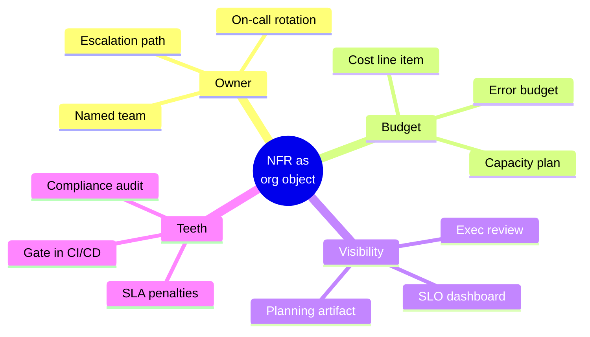
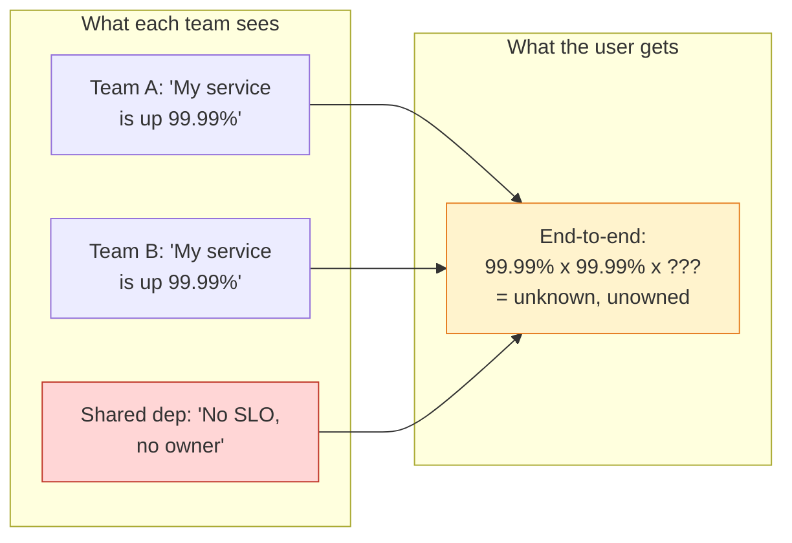
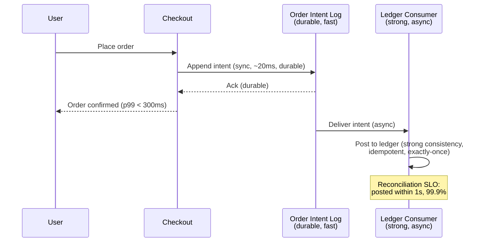
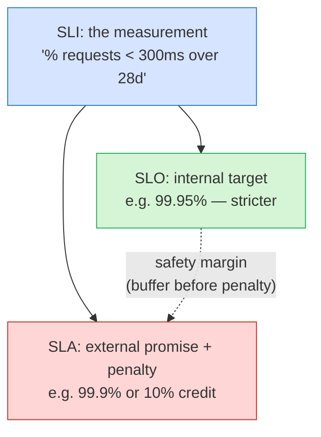
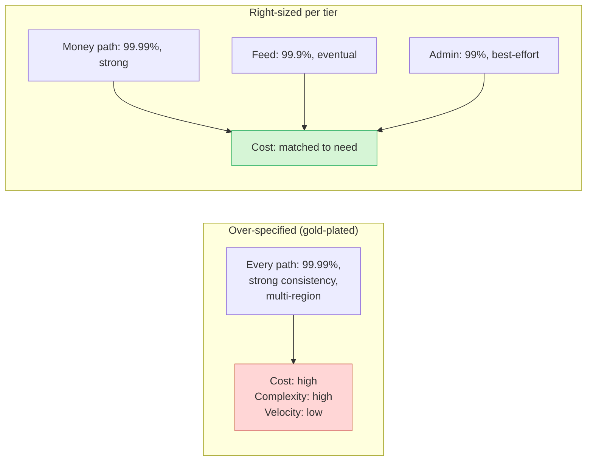
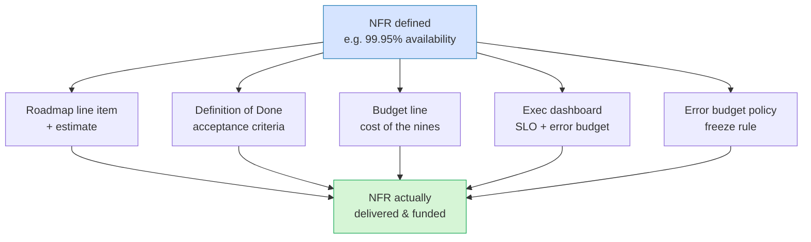

# Functional vs Non-Functional Requirements — Staff / Principal Level

At junior and senior levels, the functional/non-functional distinction is mostly a *modeling* skill: you learn to separate "what the system does" from "how well it does it," and you learn to express the latter as measurable targets. At the staff and principal level the distinction stops being a modeling exercise and becomes an *organizational* one. The hard questions are no longer "what is the p99 latency budget?" but "who owns that budget, who pays for it, who gets paged when it breaks, and what happens when two teams disagree about it?"

This document is about requirements as artifacts that live for years inside an organization. It treats non-functional requirements (NFRs) as objects with owners, costs, conflicts, drift, and legal teeth — not as a bullet list copied into a design doc and forgotten. The reframing matters because the most expensive requirement failures in real companies are almost never "we forgot to make it fast." They are "everyone assumed someone else owned durability," or "we promised four nines in a contract and built a system that does three," or "we gold-plated availability for a feature that ships once a quarter."

---

## Table of Contents

1. [The Staff Reframing: Requirements as Organizational Objects](#1-the-staff-reframing-requirements-as-organizational-objects)
2. [Who Actually Owns NFRs](#2-who-actually-owns-nfrs)
3. [Ownership Gaps and How They Cause Outages](#3-ownership-gaps-and-how-they-cause-outages)
4. [Resolving Cross-Team Requirement Conflicts](#4-resolving-cross-team-requirement-conflicts)
5. [Worked Example: A Cross-Team NFR Conflict](#5-worked-example-a-cross-team-nfr-conflict)
6. [SLA vs SLO vs SLI: The Contractual Gradient](#6-sla-vs-slo-vs-sli-the-contractual-gradient)
7. [Why Internal Targets Are Stricter Than External Promises](#7-why-internal-targets-are-stricter-than-external-promises)
8. [The Cost of an Extra Nine](#8-the-cost-of-an-extra-nine)
9. [The Real Cost of Over-Specified NFRs](#9-the-real-cost-of-over-specified-nfrs)
10. [Requirement Drift as Systems and Businesses Evolve](#10-requirement-drift-as-systems-and-businesses-evolve)
11. [Regulatory and Compliance NFRs as Non-Negotiable Constraints](#11-regulatory-and-compliance-nfrs-as-non-negotiable-constraints)
12. [Making NFRs Visible in Planning and Budgets](#12-making-nfrs-visible-in-planning-and-budgets)
13. [A Staff-Level Operating Checklist](#13-a-staff-level-operating-checklist)
14. [Key Takeaways](#14-key-takeaways)

---

## 1. The Staff Reframing: Requirements as Organizational Objects

A functional requirement answers *what the system does*: "users can reset their password," "the checkout service charges the card." A non-functional requirement answers *how well, under what constraints*: "password reset completes in under 2 seconds at p99," "checkout is available 99.95% of the month," "card data never leaves PCI-scoped infrastructure."

That framing is correct but incomplete for a staff engineer. The reason functional requirements feel easy and NFRs feel hard is structural, not intellectual:

- **Functional requirements have a natural owner.** A feature has a product manager, a squad, an epic, and a user-visible acceptance test. When the feature is broken, it is obviously broken, and it is obviously *that team's* problem.
- **Non-functional requirements have no natural owner.** Latency is shared across every service in a request path. Availability is the product of dozens of dependencies. Durability is invisible until the day it isn't. Cost is everyone's and therefore no one's. Security and compliance cut across every team.

This asymmetry is the root cause of most NFR failures at scale. Functional requirements decompose cleanly along team boundaries; non-functional requirements are *emergent properties of the whole system*, yet organizations are structured to deliver features, not properties. Conway's Law says your system mirrors your org chart — and your org chart is almost always optimized for functional delivery, leaving NFRs in the seams between teams.

The staff engineer's job is to make these emergent, ownerless properties into first-class objects: things with a name, an owner, a budget line, a dashboard, an alert, and an escalation path. Everything below is a consequence of taking that seriously.

---

## 2. Who Actually Owns NFRs

Ask three people in an organization "who owns availability?" and you will get three answers: "SRE," "the platform team," "well, everyone." All three are partially right, which is exactly the problem. Ownership of NFRs is distributed across roles, and the distribution is rarely written down.

A useful model is to separate **definition**, **delivery**, and **operation** of each NFR class, because these three responsibilities frequently land on *different* people.

| NFR class | Who *defines* the target | Who *delivers* it (builds for it) | Who *operates* it (keeps it true) |
|---|---|---|---|
| Latency (p50/p99) | Product + UX (user impact) | Feature teams + platform | SRE / on-call team |
| Availability | Product + business (revenue impact) | Service-owning teams | SRE + service owners |
| Durability | Architecture / data platform | Storage / data-platform team | Data-platform on-call |
| Throughput / scalability | Capacity planning + product growth | Service teams + infra | Infra / SRE |
| Security posture | Security org (CISO) | Every team | Security + service owners |
| Compliance (GDPR, PCI) | Legal + compliance + security | Every team in scope | Compliance + audit + DPO |
| Cost efficiency | Finance + eng leadership | Every team | FinOps + service owners |
| Operability / observability | Platform / SRE | Every team | Platform + on-call |

Two structural truths fall out of this table:

1. **Whoever defines a target rarely operates it.** Product decides availability matters; SRE gets paged when it breaks. This split is healthy only if the definer feels the operational cost — otherwise targets inflate without bound (more on that in §9).
2. **The teams that "deliver" most NFRs are *every team*.** Security, compliance, cost, and observability are not a department; they are a tax levied on all delivery. The moment they become "the security team's job" rather than "everyone's job, enabled by the security team," they fail at the seams.

The healthiest organizations make this explicit with a **RACI per NFR**, often embedded in a service catalog: each service declares its SLOs, names a responsible team, names an accountable owner (usually a manager or staff eng), and lists who must be consulted (security, compliance) and informed (dependent teams). When a service has no such entry, treat that as a latent incident.

---

## 3. Ownership Gaps and How They Cause Outages

The dangerous failure mode is not a *wrong* owner — it's *no* owner. Ownership gaps are the dark matter of system reliability: invisible until they collapse.

Classic ownership-gap outage patterns:

- **The shared dependency nobody owns.** A library, a sidecar, a config service, or an internal DNS resolver sits in everyone's critical path but on no one's roadmap. It has no SLO because it has no owner, so when it degrades, every team blames its upstream and nobody is accountable for the fix. The 2021 wave of "we all depend on this one config system" outages across the industry are textbook examples.
- **The handoff seam.** Team A produces events; Team B consumes them. A owns producing; B owns consuming; *nobody owns the contract guarantees of the queue between them* — ordering, at-least-once delivery, schema compatibility. The NFR (e.g., "events are delivered within 5 minutes, exactly once") lives in the seam.
- **The "platform provides it" assumption.** Application teams assume the platform team guarantees durability of writes; the platform team assumes apps fsync or use the durable API. Both are technically correct about *their* layer and both are wrong about the *end-to-end* property. Data loss happens in this gap.
- **The implicit SLO.** A service has *de facto* 99.99% availability because it has been lucky. Downstream teams build assuming four nines. Nobody ever wrote down the target, nobody provisioned for it, and the first real incident reveals it was never engineered — it was inherited from luck.

The mechanism is always the same: an emergent property of the whole system has no single accountable owner, so each local team optimizes its own slice and the global property silently degrades or was never guaranteed at all.

**The staff move:** maintain a *dependency-to-owner map* and audit it for nodes with no owner or no SLO. Any critical-path component without a named owner and a written SLO is a scheduled outage. Run "ownership game days" the same way you run disaster-recovery game days: pick a degraded dependency and ask "who gets paged, who decides, who fixes" — if the answers are vague, you found the gap before it found you.

---

## 4. Resolving Cross-Team Requirement Conflicts

NFR conflicts are inevitable because NFRs trade against each other and teams optimize locally. Latency fights consistency. Cost fights availability. Velocity fights operability. Security fights convenience. When two teams own opposite sides of a trade-off, they will pull in opposite directions, and the conflict surfaces as a stalled design review or, worse, a production incident.

A reliable resolution framework, in order of preference:

1. **Make the trade-off explicit and quantified.** Most "conflicts" are really two teams arguing from unstated assumptions. Force both sides to state the requirement as a number and a cost: "we need p99 < 50ms because checkout conversion drops X% per 100ms" vs. "strong consistency costs us 30ms of cross-region quorum." Once both are numbers, the argument becomes an optimization, not a turf war.
2. **Find the user-anchored truth.** NFRs exist to serve users and the business, not teams. Re-anchor on the actual user-visible or revenue-visible impact. Frequently one side's requirement turns out to be self-imposed (gold-plating, §9) and evaporates under scrutiny.
3. **Look for the design that dissolves the conflict.** Senior conflicts are zero-sum; staff conflicts often aren't. Caching, async processing, read replicas, CRDTs, or relaxing consistency *only where it doesn't matter* can satisfy both sides. The best resolution is the one where nobody had to lose.
4. **Escalate with a written trade-off, not a complaint.** When a genuine trade-off remains, escalate to the lowest shared owner (a director, a VP, an architecture review board) with a one-page decision doc: options, costs, risks, recommendation. The job of escalation is to get an *accountable decision-maker* to own the trade-off, because cross-cutting NFR trade-offs are exactly the decisions that belong above any single team.
5. **Record it as a decision (ADR).** Whatever is decided becomes an Architecture Decision Record so the next team doesn't relitigate it in eighteen months when the context is forgotten.

The anti-pattern is "resolution by exhaustion" — whoever cares most or shouts longest wins. That produces locally optimal, globally incoherent NFRs and breeds resentment. Staff engineers convert conflicts into quantified decisions owned by the right level.

---

## 5. Worked Example: A Cross-Team NFR Conflict

**Setting.** A mid-size payments company. Two teams:

- **Checkout** owns the user-facing purchase flow. Their NFR: p99 latency of the "place order" call must stay under **300 ms**, because their data shows conversion drops measurably above that. Their SLO is latency.
- **Ledger** owns the system of record for money movement. Their NFR: every confirmed order must be recorded with **strong durability and strong consistency** — no double-spend, no lost write, exactly-once accounting. Their SLO is correctness and durability.

**The conflict.** Ledger wants the order write to be synchronous and replicated to a quorum across three availability zones before returning success. That synchronous quorum write adds ~180 ms. Combined with the rest of the checkout path, p99 lands at ~420 ms — well over Checkout's 300 ms target. Checkout wants Ledger to make the write asynchronous (fire-and-forget into a queue) so the user gets an instant confirmation. Ledger refuses: an async confirmation means the system tells the user "order placed" before money movement is durably recorded, risking a confirmed order with no ledger entry — an unacceptable correctness violation in a payments system.

Each team is *right within its own NFR*. The design review stalls for three weeks.

**How a staff engineer resolves it.**

*Step 1 — Quantify both sides.* Checkout's number: each 100 ms over 300 ms costs ~0.3% conversion ≈ a known dollar figure per quarter. Ledger's number: probability and cost of a mis-recorded payment — regulatory exposure, chargebacks, reconciliation labor, reputational risk. Both are now dollars and risk, not opinions.

*Step 2 — Re-anchor on the user.* What the *user* actually needs is: (a) a fast acknowledgment that the order was received, and (b) a guarantee that their money and order are correct. Crucially, the user does **not** need the *ledger to be durably committed* before seeing acknowledgment — they need the *order intent* to be durably captured and a *promise* it will be reconciled.

*Step 3 — Find the dissolving design.* Split the single write into two:
- A **fast, durable "order intent" write** to a write-ahead log / outbox that *is* synchronous but cheap (single-region durable append, ~20 ms). This is enough to never lose the order.
- An **asynchronous, strongly-consistent ledger posting** consumed from that log, with idempotency keys guaranteeing exactly-once accounting.

The user gets acknowledgment after the fast durable intent write (path now well under 300 ms). Ledger keeps full correctness because the posting is still strongly consistent and idempotent — it just happens a few hundred milliseconds later, off the user's critical path. The window between "order acknowledged" and "ledger posted" is covered by a reconciliation job and a sub-second SLO on the consumer.

*Step 4 — Record the decision.* An ADR captures: the conflict, the two NFRs, the chosen split-write design, the new consumer SLO (ledger posting within 1 s at 99.9%), the residual risk (a small reconciliation window), and the owner of the new seam — **Ledger owns the consumer and its SLO**, so the dangerous handoff is not ownerless.

*Outcome.* Checkout hits its latency target. Ledger keeps its correctness guarantee. The conflict didn't require either team to lose; it required a staff engineer to refuse the false binary ("sync vs async") and find the design where durability and latency stopped competing. And critically, the new asynchronous seam got an explicit owner and SLO — so it didn't become the ownership gap of §3.

---

## 6. SLA vs SLO vs SLI: The Contractual Gradient

These three terms are routinely conflated, and the conflation is dangerous because they sit at different points on a *contractual gradient* — from a precise measurement, to an internal target, to a legally binding promise with money attached.

- **SLI — Service Level Indicator.** A *measurement*. A precise definition of what you measure: "the proportion of HTTP requests to `/checkout` that return a non-5xx status within 300 ms, measured at the load balancer over a rolling 28-day window." An SLI is a number with a rigorous definition. No SLI, no SLO.
- **SLO — Service Level Objective.** An *internal target* for an SLI: "99.9% of those requests succeed within budget." The SLO is what your team commits to *itself* and its internal consumers. It drives error budgets, alerting, and engineering prioritization. Breaching an SLO has *internal* consequences (freeze features, fix reliability) but no legal ones.
- **SLA — Service Level Agreement.** An *external, contractual promise* to a customer, with *penalties* for breach: "we guarantee 99.9% monthly availability; if we miss it, you get a 10% service-credit on that month's bill." An SLA has legal and financial teeth.

| Dimension | SLI | SLO | SLA |
|---|---|---|---|
| What it is | A measurement | An internal target | An external contract |
| Audience | Engineering | Engineering + internal consumers | Customers / legal |
| Consequence of breach | N/A (it's just data) | Error-budget spend, feature freeze | Financial penalty, legal liability, churn |
| Who owns it | SRE / service owner | Service owner + product | Legal + product + eng leadership |
| Typical strictness | Exact definition | Stricter than the SLA | The loosest publicly committed number |
| Changes how often | Rarely (definition is stable) | Each planning cycle | Rarely (contract renegotiation) |
| Failure visibility | Dashboard | Internal alert + review | Customer-facing, billing event |

The relationship between the three numbers is the key insight: **SLA ≤ public SLO < internal SLO target**, and the SLI is the shared measurement underneath all of them. You promise customers the least (the SLA), you target internally for more (the SLO), and you measure everything precisely (the SLI). The gap between SLA and SLO is your safety margin against legal penalties; the gap between SLO and reality is your error budget.

> Note: A subtle staff-level point is that an SLA is a *legal* artifact and an SLO is an *engineering* artifact. Confusing them leads teams to engineer to the contract number (too loose, no margin) or to write contract numbers from raw engineering targets (too tight, instant penalties on a bad month). Keep them separate, and keep the SLO strictly tighter.

---

## 7. Why Internal Targets Are Stricter Than External Promises

You always set the internal SLO *stricter* than the external SLA. This is not redundancy or paranoia; it is sound engineering economics, for several converging reasons:

1. **Penalty asymmetry.** Missing an SLA costs real money (service credits), legal exposure, and customer churn. Missing an internal SLO costs an internal review and a reliability sprint. You want the cheap alarm (SLO breach) to fire well before the expensive one (SLA breach). The SLO is the smoke detector; the SLA is the building on fire.
2. **Margin for the bad month.** Reliability is statistical. If you build *exactly* to 99.9% on average, roughly half your months will fall below it, and every below-average month is an SLA-breach payout. Building internally to 99.95% means your *expected* performance comfortably clears the 99.9% contract even on a bad month.
3. **Measurement and aggregation differences.** Your internal SLI may be measured more strictly than the customer's (more endpoints, tighter latency cutoff, deeper in the stack). The customer measures what *they* see; you measure more. The internal number must be tighter to ensure the customer-visible number clears.
4. **Composition of dependencies.** Your service's availability is the product of its dependencies' availability. To *promise* 99.9% externally, each link in the chain must target meaningfully higher, because availabilities multiply downward. The internal SLO of each component is necessarily stricter than the end-to-end SLA.
5. **Early warning via error budget.** A stricter SLO gives you an error budget that depletes *before* you near the SLA. When the budget is half spent, you slow feature work and invest in reliability — long before any customer-facing penalty is at risk.

A rule of thumb many organizations use: **internal SLO targets one "half-nine" to a full nine tighter than the SLA.** If the SLA is 99.9%, the internal SLO is 99.95% or 99.99%. The exact gap is an economic decision: wider gap = more safety but more engineering cost; narrower gap = cheaper but riskier on bad months.

---

## 8. The Cost of an Extra Nine

Availability is quoted in "nines," and each additional nine is roughly an order of magnitude less downtime — and, crucially, *much more than an order of magnitude more cost and effort*. This non-linearity is one of the most important economic intuitions a staff engineer carries into every requirements conversation.

| Availability | "Nines" | Downtime / year | Downtime / month | Downtime / day |
|---|---|---|---|---|
| 99% | two nines | ~3.65 days | ~7.2 hours | ~14.4 min |
| 99.9% | three nines | ~8.76 hours | ~43.8 min | ~1.44 min |
| 99.95% | three-and-a-half | ~4.38 hours | ~21.9 min | ~43 sec |
| 99.99% | four nines | ~52.6 min | ~4.38 min | ~8.6 sec |
| 99.999% | five nines | ~5.26 min | ~26.3 sec | ~0.86 sec |
| 99.9999% | six nines | ~31.5 sec | ~2.6 sec | ~0.086 sec |

Read the cost story off this table. Going from 99% to 99.9% might mean adding redundancy and basic auto-recovery — meaningful but achievable. Going from 99.9% to 99.99% means eliminating most single points of failure, multi-AZ deployment, automated failover, and rigorous deploy safety. Going from 99.99% to 99.999% means multi-region active-active, sub-minute automated detection *and* remediation (no human can react in the ~26 seconds/month budget), chaos engineering as routine, and a step-change in operational maturity. Five-nines effectively forbids humans in the recovery loop, which forces enormous automation investment.

**Why each nine costs disproportionately more:**

- The budget for failure shrinks 10× while the failures you must now prevent are progressively rarer and harder — the long tail of correlated failures, regional events, and "unknown unknowns."
- Human reaction time becomes the bottleneck. At three nines you have ~43 minutes/month — humans can respond. At five nines you have ~26 seconds/month — *only automation can respond*, and building that automation is expensive and itself a reliability risk.
- Testing the rare failure modes that matter at five nines (region loss, correlated AZ failure) requires investments like chaos engineering, game days, and standby capacity that sits idle most of the time.
- Each nine adds redundancy that costs hardware/cloud spend *and* adds system complexity, which itself reduces reliability if not managed — there is a point where adding a nine of designed availability *removes* a nine of actual availability through complexity.

The staff conclusion: **never accept an availability target without asking what it costs and whether the business needs it.** "Five nines" sounds prudent and is almost always wrong for anything but the narrowest revenue-critical or safety-critical paths. The right question is "what is the user and business cost of the *actual* downtime distribution, and what is the cheapest target that keeps that cost acceptable?" Frequently the honest answer is three nines for most services and four for the money path — and *nothing* needs five except a tiny core.

---

## 9. The Real Cost of Over-Specified NFRs

Under-specifying NFRs causes visible incidents; *over-specifying* causes invisible, chronic waste — and is far more common, because over-specifying feels responsible. "Let's make it highly available, low-latency, infinitely scalable, and globally consistent" sounds like good engineering. It is usually gold-plating, and gold-plating has a real and compounding cost.

Where over-specification hides its bill:

- **Infrastructure spend.** Multi-region active-active for a back-office reporting tool that five internal analysts use during business hours. The standby region, the cross-region replication, the global load balancing — all billed monthly, forever, for a requirement no user has.
- **Engineering opportunity cost.** Every hour spent engineering and operating a nine nobody needs is an hour not spent on a feature, a real reliability gap, or a security fix. Gold-plated NFRs are a tax on the roadmap.
- **Complexity-induced fragility.** Over-engineered availability adds moving parts (failover logic, replication, consensus) that themselves fail, often in subtle correlated ways. The system designed for five nines can deliver *fewer* real nines than a simpler three-nines design, because the failover machinery is the new top failure cause.
- **Operational burden.** Stricter NFRs mean more alerts, more on-call load, more runbooks, more game days. Over-specified latency SLOs page humans for blips that no user noticed, driving alert fatigue — which then masks the real incident.
- **Velocity drag.** Tight NFRs make every change risky and slow. Strong consistency where eventual would do means cross-region coordination on every write. Gold-plated requirements slow the whole org's ability to ship.

The discipline is to **specify NFRs to the actual need and no further**, and to *demand evidence* for every demanding target. For each NFR ask: who is the user, what is their real tolerance, what does the business lose at the next-looser tier, and what does the next-tighter tier cost? Often the answer is that the team copied "99.99%, p99 < 100ms, strong consistency" from a template or a more demanding system, and nobody ever checked whether *this* system, *these* users, needed it.

A simple heuristic: **right-size NFRs per data/path tier.** The money path gets four nines and strong consistency; the social-feed path gets three nines and eventual consistency; the internal admin tool gets two nines and best-effort latency. Uniform top-tier NFRs across a system is almost always over-specification somewhere.

---

## 10. Requirement Drift as Systems and Businesses Evolve

NFRs are not set once. They drift — sometimes because the business changes, sometimes because the system changes, and sometimes because nobody is watching. Drift is dangerous precisely because requirements feel permanent: they were "decided," so teams stop questioning them, and the gap between the written requirement and current reality widens silently.

Two directions of drift, both hazardous:

**Drift where the requirement should have tightened but didn't.** The classic case: a product launches as an internal beta with a 99% availability target and a single-region deployment. Two years later it is a flagship revenue product processing millions of transactions — but the NFRs were never revisited. The system is still engineered for the beta requirement while the business now depends on it like a tier-1 service. The requirement drifted *below* the need, and the gap is a latent outage waiting for the first regional event. Growth in scale (10×, 100× traffic) silently invalidates throughput and latency NFRs that were correct at launch.

**Drift where the requirement stayed tight but the need relaxed.** A feature that was once strategic is now legacy, used by a shrinking set of customers, but it still carries its original four-nines, multi-region NFRs — and the cost. The requirement drifted *above* the need, and the organization keeps paying gold-plating costs (§9) for a feature on its way out.

Causes of drift to watch for:

- **Business model shifts** — a free tool becomes a paid SLA-backed product; a B2C app adds enterprise customers with contractual availability demands; the company enters a regulated market (see §11), instantly imposing new non-negotiable NFRs.
- **Scale shifts** — traffic, data volume, or user count grows past the point where the original architecture's NFRs hold.
- **Dependency shifts** — a downstream service tightens or loosens its own SLO, changing what your end-to-end NFR can actually be.
- **Acquisition / integration** — inheriting a system whose NFRs were never written down, or whose NFRs conflict with yours.

**The staff practice:** treat NFRs as living artifacts with a review cadence. Tie an NFR review to each major planning cycle and to "trigger events" — a 5× traffic milestone, a new market, a new top customer, a new regulation. Keep NFRs in the service catalog with a "last reviewed" date; a stale date is itself a signal. The goal is to make drift *visible and intentional* rather than silent and accidental.

---

## 11. Regulatory and Compliance NFRs as Non-Negotiable Constraints

Most NFRs are negotiable trade-offs: you can spend more for an extra nine, or accept higher latency for lower cost. **Compliance NFRs are different in kind** — they are constraints, not objectives. You do not "optimize" GDPR; you *comply* with it or you face fines, banned operations, and personal liability for executives. A staff engineer must treat these as the hard boundaries of the design space, not as dials.

| Regime | Core NFR it imposes | Non-negotiable because |
|---|---|---|
| **GDPR** | Right to erasure, data minimization, lawful basis, breach notification within 72h, data residency in EU where required | Fines up to 4% of global annual revenue; regulator can ban processing |
| **PCI-DSS** | Cardholder data isolation, encryption, network segmentation, audit logging, no storing CVV | Loss of ability to process card payments; mandatory if you touch card data |
| **Data residency / sovereignty** | Certain data must physically stay in a jurisdiction (EU, China, Russia, India sectors) | Legal prohibition on cross-border transfer; can block market entry |
| **SOC 2** | Documented controls for security, availability, confidentiality; continuous audit evidence | Enterprise customers won't buy without it; contractual prerequisite |
| **HIPAA** | PHI encryption, access controls, audit trails, BAAs with vendors | Per-violation fines, criminal liability for willful neglect |

How compliance NFRs change the engineering reality:

- **They are architectural constraints, decided early.** Data residency dictates *where* your databases live before you write a line of code. Retrofitting residency into a deployed multi-region system is a months-long, error-prone migration. PCI scope dictates network topology. These NFRs must enter the design at requirement-gathering time, not at the security review.
- **They are binary, not graded.** You cannot be "99% GDPR-compliant." A single un-erasable copy of a user's data in a forgotten backup is a violation. This binary nature makes them more like correctness functional requirements than like graded NFRs.
- **They carry audit and evidence obligations.** SOC 2 and PCI require you to *prove* compliance continuously — logs, access reviews, change records. The NFR is not just "be secure" but "be able to demonstrate, on demand, that you were secure." This imposes observability and record-keeping requirements that pure engineering might skip.
- **They have named owners with legal accountability.** GDPR mandates a Data Protection Officer in many cases; PCI has a designated compliance contact. Unlike availability, these NFRs *cannot* be ownerless — the law requires a name. Staff engineers translate the legal requirement into concrete system constraints and partner with that owner.

The staff posture: identify compliance NFRs *first*, mark them as constraints (not objectives), and design within them. They cap the trade-off space. You can choose your latency target inside the box GDPR draws; you cannot choose to step outside the box. When a feature requirement collides with a compliance constraint, the compliance constraint wins by default, and the conversation moves to "how do we deliver the feature *within* the constraint" — never "can we relax the constraint."

---

## 12. Making NFRs Visible in Planning and Budgets

Everything above fails if NFRs remain invisible in the artifacts where the organization actually decides what to build and fund. The root cause of most NFR neglect is simple: feature work is on the roadmap and in the budget; reliability, security, compliance, and operability are not. What is not on the plan does not get staffed, and what is not staffed does not get done.

Making NFRs visible means putting them into the organization's *decision-making artifacts*:

- **In the roadmap.** Reliability and compliance work appears as planned, estimated, prioritized line items — not as "tech debt we'll get to." An NFR with no roadmap presence has no chance of being delivered against competing features.
- **In the definition of done.** A feature isn't "done" when it works in the demo; it's done when it meets its NFRs — has alerting, has an SLO, passes security review, handles its load. Bake NFRs into the acceptance criteria so they ship *with* the feature, not after.
- **In the budget.** The cost of each nine, each region, each compliance program is a visible line item. When availability targets are budgeted explicitly, the "do we really need five nines?" conversation happens *before* the spend (§8, §9), not after the bill arrives.
- **On dashboards reviewed by leadership.** SLOs and error budgets on a dashboard that executives actually look at create accountability. An error budget burning down in front of a VP gets reliability work prioritized faster than any engineer's plea.
- **In the error budget policy.** A pre-agreed rule — "when the error budget is exhausted, feature work pauses and reliability work takes priority" — converts an abstract NFR into a concrete, automatic prioritization mechanism. It removes the per-incident negotiation and makes the trade-off a policy, owned above any single team.

The staff engineer's leverage here is largely *translational*: converting "p99 latency" and "four nines" into the language of money, risk, and roadmap that the people holding the budget understand. An NFR expressed only in engineering terms competes poorly against a feature expressed in revenue terms. An NFR expressed as "$X/year, Y% of churn risk, Z engineer-weeks" competes on equal footing.

---

## 13. A Staff-Level Operating Checklist

A practical checklist for handling NFRs at organizational scale:

- **Ownership.** Does every critical-path component and every NFR have a *named* accountable owner and an on-call path? Audit the dependency map for ownerless nodes — they are scheduled outages (§3).
- **The gradient.** For every customer promise, is there a precisely defined SLI, an internal SLO *strictly tighter* than the SLA, and a clear separation between the legal artifact (SLA) and the engineering artifact (SLO)? (§6, §7)
- **Right-sizing.** Is every demanding NFR justified by an actual user/business need with evidence, or is it copied gold-plating? Are NFRs tiered per path rather than uniformly maxed out? (§8, §9)
- **Conflict resolution.** When two teams' NFRs collide, are they quantified into dollars/risk, re-anchored on the user, and resolved with a recorded decision (ADR) — not by exhaustion? (§4, §5)
- **Drift.** Are NFRs reviewed each planning cycle and on trigger events (scale milestones, new markets, new top customers, new regulations), with a visible "last reviewed" date? (§10)
- **Compliance.** Are regulatory NFRs identified *first*, treated as hard constraints (not dials), owned by a legally accountable name, and designed-in early rather than retrofitted? (§11)
- **Visibility.** Do NFRs appear in the roadmap, the definition of done, the budget, an exec-visible dashboard, and an error-budget policy — or are they invisible and therefore unfunded? (§12)

---

## 14. Key Takeaways

- At staff/principal scope, the functional/non-functional split is an **organizational** problem, not a modeling one. Functional requirements decompose cleanly along team lines; NFRs are emergent properties of the whole system and live in the seams between teams.
- **Ownership is the master variable.** Most large NFR failures are ownership gaps — a critical property that no single team is accountable for. Make every NFR an object with a name, a budget, a dashboard, and an escalation path.
- **SLI, SLO, and SLA sit on a contractual gradient**: a precise measurement, an internal target, a legally binding promise. Keep them distinct, and keep the internal SLO strictly tighter than the external SLA so the cheap alarm fires before the expensive one.
- **Each additional nine costs disproportionately more** and eventually forbids humans from the recovery loop. Never accept an availability target without pricing it and checking the business actually needs it — most things need three nines, the money path four, and almost nothing needs five.
- **Over-specified NFRs are a silent, compounding tax** on cost, velocity, and even reliability itself. Right-size per tier; demand evidence for every demanding target.
- **NFRs drift** as the business and system evolve — sometimes below the need (latent outage), sometimes above it (gold-plating). Treat them as living artifacts with a review cadence tied to planning cycles and trigger events.
- **Compliance NFRs are constraints, not objectives.** They are binary, carry legal teeth, require named owners and audit evidence, and must be designed in from the start. They bound the trade-off space rather than living inside it.
- **Invisible NFRs are unfunded NFRs.** The staff engineer's highest-leverage move is translating reliability, security, and compliance into the language of roadmap, budget, and risk so they compete on equal footing with features.

*Next step:* [Interview questions](interview.md)
