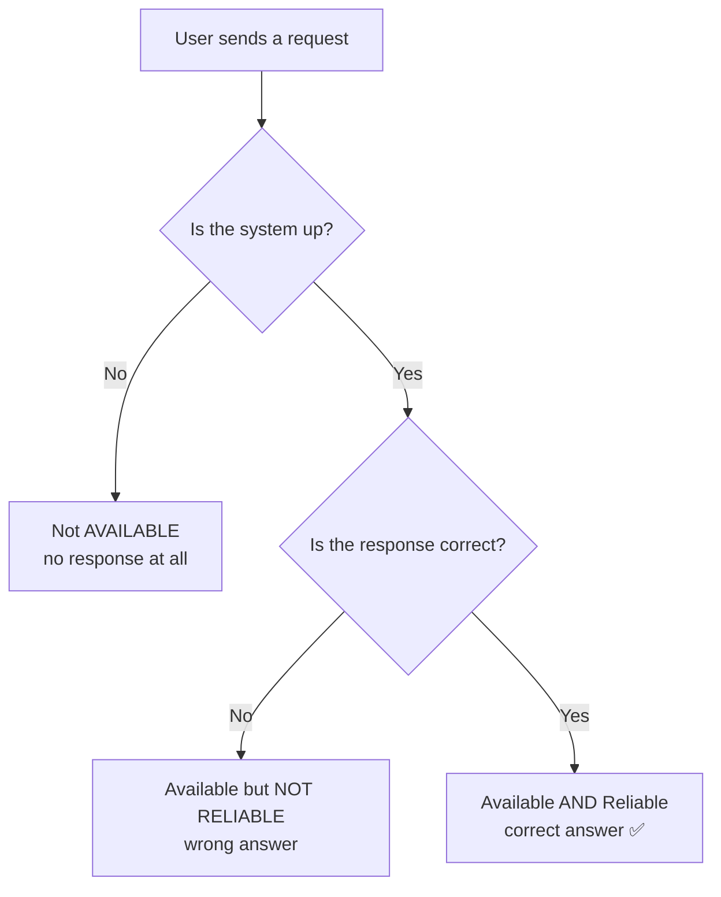
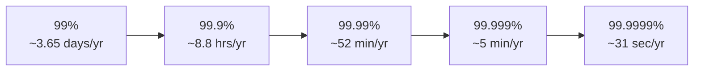
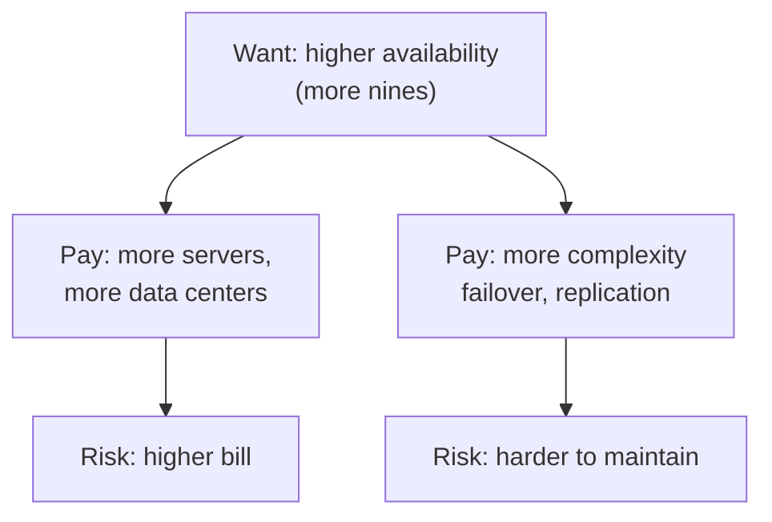
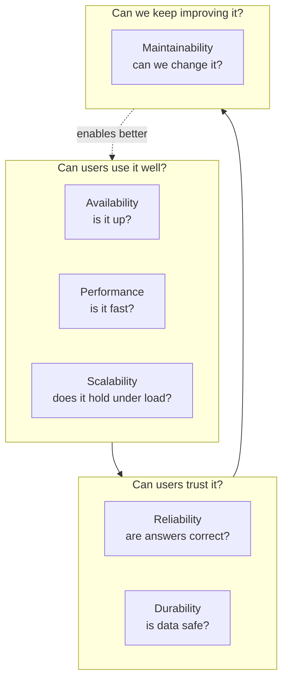

# Key Characteristics of Systems — Junior

<!-- level-focus -->
At junior level, focus on this question:

> How can I apply **Key Characteristics of Systems** in one small example and prove the result?

Use the smallest realistic scenario that exposes the decision and its failure behavior.
When engineers sit down to design a system — a chat app, an online store, a banking
backend — they don't just ask "does it work?" They ask a deeper set of questions:
*Will it still work when a million people show up? Will it stay up at 3 a.m. on a
Sunday? If a hard drive dies, do we lose anyone's data? Can a new teammate change it
without breaking everything?*

These questions map to a small vocabulary of **key characteristics**: the qualities
every serious system is judged by. They are the adjectives of system design. Before
you can design anything, you need to know what these words mean, how they differ, and
what they cost. That's what this page is about.

This is the junior-level introduction. The goal is not to make you an expert — it's to
make the words *crisp* in your head, so that when someone says "we need higher
availability" you know exactly what they're asking for and why it isn't free.

---

## 1. Why characteristics matter

Imagine two coffee shops on the same street.

- **Shop A** makes excellent coffee, but there is only one barista. When 50 people
  arrive at once, the line wraps around the block and most leave.
- **Shop B** makes equally good coffee, hires more baristas at rush hour, has a backup
  espresso machine when one breaks, keeps a written recipe book so any new barista can
  step in, and serves each customer in under two minutes.

Both shops "work." But Shop B has thought about its **characteristics**: it can handle a
crowd (scalability), it stays open when a machine dies (availability), it consistently
produces correct orders (reliability), a new hire can learn it fast (maintainability),
and it's quick (performance).

Software is the same. A feature can be technically correct and still fail in the real
world because nobody thought about what happens under load, during failures, or six
months later when the original author has left. **Functional requirements** describe
*what* the system does ("users can post a photo"). **Non-functional requirements** —
the characteristics on this page — describe *how well* it does it. Senior engineers spend
most of their design time on the second kind, because that's where systems actually break.

These characteristics are sometimes called the **"-ilities"**: scalab*ility*,
availab*ility*, reliab*ility*, maintainab*ility*, and so on. Keep that suffix in mind —
it's a quick way to recognize that someone is talking about a quality of the system
rather than a feature.

---

## 2. Scalability

**Plain definition:** Scalability is the ability of a system to handle *more work*
without falling over — more users, more requests, more data — usually by adding more
resources.

**Everyday analogy:** A highway. When traffic doubles, a one-lane road turns into a
parking lot. A road that can grow to four lanes (or open extra lanes at rush hour)
"scales." The key idea is that *growth doesn't break it* — you add capacity and it keeps
flowing.

**Software example:** Your app handles 1,000 users today. Marketing runs a campaign and
suddenly 100,000 users arrive in an hour. A scalable system absorbs that by spreading
the load across more servers. A non-scalable system slows to a crawl, times out, or
crashes — and you lose customers at the worst possible moment.

There are two basic ways to scale, and you should know both terms:

| Approach | What it means | Coffee-shop analogy | Catch |
|----------|---------------|---------------------|-------|
| **Vertical scaling** (scale *up*) | Make one machine bigger — more CPU, more RAM | Give the barista a faster espresso machine | Easy, but there's a ceiling; one giant machine is a single point of failure |
| **Horizontal scaling** (scale *out*) | Add more machines that share the work | Hire more baristas | Harder to coordinate, but nearly unlimited and more fault-tolerant |

Most large systems eventually scale *out* (horizontally), because you can always add one
more machine, but you can't buy an infinitely large one. A system that scales well also
tends to scale **cost-efficiently** — doubling traffic should not, ideally, ten-times the
cost.

> A quick mental test for scalability: *"If our traffic grew 10x next month, what would
> break first?"* If you can't answer that, you don't yet understand your system's limits.

---

## 3. Availability

**Plain definition:** Availability is the percentage of time a system is *up and able to
respond* to requests. If you send it a request right now, is it there to answer?

**Everyday analogy:** A 24-hour convenience store. Availability is the fraction of the
time the doors are open. A store that's open 23 hours a day has lower availability than
one open all 24. You measure it as "of all the moments a customer might walk up, how
often were we open?"

**Software example:** When you type a URL and the site loads, the site was *available*.
When you get "503 Service Unavailable" or an endless spinner, it wasn't. Availability is
usually written as a percentage of uptime over a period — for example, "99.9% available
last month."

The formula, in its simplest form:

```
Availability = Uptime / (Uptime + Downtime)
```

If a system was up for 719 hours in a 720-hour month and down for 1 hour, its
availability that month was 719 / 720 ≈ 99.86%.

Two related real-world measurements help reason about availability:

- **MTBF — Mean Time Between Failures:** on average, how long the system runs before it
  fails. Bigger is better.
- **MTTR — Mean Time To Recovery:** on average, how long it takes to get back up after a
  failure. Smaller is better.

Availability improves when you *fail less often* (raise MTBF) **and** when you *recover
faster* (lower MTTR). A system that crashes rarely but takes a full day to fix can have
worse availability than one that hiccups often but heals itself in seconds.

```
Availability ≈ MTBF / (MTBF + MTTR)
```

This is why automatic recovery — health checks, restarts, failover to a backup — matters
so much. Cutting MTTR from hours to seconds can move you up an entire "nine" (we'll
define nines shortly).

---

## 4. Reliability

**Plain definition:** Reliability is whether the system does the *right thing,
correctly,* when it does respond. A reliable system gives correct answers, doesn't
corrupt data, and behaves the way you expect — every time.

**Everyday analogy:** A vending machine. Reliability is whether, when you pay for a soda
and press B4, you actually get the B4 soda — not a different drink, not nothing, not your
money silently swallowed. The machine being *open* is availability. The machine giving
you *the correct item* is reliability.

**Software example:** You click "Transfer $100." A reliable banking system moves exactly
$100 — not $1,000, not zero, and it never double-charges you on a retry. If the system is
up (available) but transfers the wrong amount or loses your transaction, it is
*unreliable* even though it "responded."

Reliability has a few faces worth naming:

- **Correctness:** the output is right.
- **Consistency of behavior:** the same input gives the same result; no random glitches.
- **Fault tolerance:** when a part fails, the system handles it gracefully instead of
  producing garbage. (Note: fault tolerance helps *both* reliability and availability.)
- **No data corruption:** stored data stays intact and accurate.

A useful one-line definition from the field: **reliability is the probability that the
system performs its intended function correctly over a given period.** It's about
*trustworthiness*. Users forgive the occasional outage far more easily than they forgive
a system that quietly gives wrong answers — because a wrong answer that *looks* right is
the most dangerous failure of all.

---

## 5. Availability vs Reliability — the classic confusion

This is the single most common mix-up for newcomers, and interviewers love to probe it.
So let's make it razor-sharp.

- **Availability** = *Is it up? Can I reach it and get* a *response?*
- **Reliability** = *When it responds, is the response* correct *and trustworthy?*

A system can have one without the other:

| Scenario | Available? | Reliable? | What the user experiences |
|----------|:----------:|:---------:|---------------------------|
| Site loads instantly, shows correct data | ✅ Yes | ✅ Yes | The dream. Up *and* correct. |
| Site loads instantly, but shows your account balance as the wrong number | ✅ Yes | ❌ No | "It's fast, but I can't trust it." Dangerous. |
| Site is down for maintenance, but never corrupted a single record | ❌ No | ✅ Yes | "I can't use it right now, but my data is safe." |
| Site is down *and* lost your last transaction | ❌ No | ❌ No | The nightmare. Both broken. |

**Analogy that nails it:** Think of a doctor.
- **Availability** is whether the doctor is *in the office* when you arrive.
- **Reliability** is whether the doctor gives you the *correct diagnosis*.

A doctor who is always in but frequently misdiagnoses is *available but unreliable* — and
arguably worse than a doctor who is occasionally out but always right.

**Another framing:** Availability is about *time* (what fraction of the time can I get a
response). Reliability is about *correctness* (of the responses I do get, how many are
right). They are measured differently, improved by different techniques, and one does not
imply the other.



Why do they get confused? Because in everyday speech "reliable" loosely means
"dependable," which overlaps with "always up." In system design we make the words
precise: **up** is availability, **correct** is reliability. Keep them separate and you'll
be ahead of most juniors.

---

## 6. The "nines": availability and downtime

Availability is so important that the industry has a shorthand for it: the number of
**nines**. "Three nines" means 99.9% available. "Five nines" means 99.999% — a famously
demanding target.

What makes the nines vivid is translating each one into **how much downtime per year**
it permits. Every extra nine is a *ten-times* reduction in allowed downtime, and each one
is dramatically harder and more expensive to reach.

| Availability | Nickname | Downtime / year | Downtime / month | Downtime / day | Typical use |
|--------------|----------|-----------------|------------------|----------------|-------------|
| 90% | "one nine" | ~36.5 days | ~72 hours | ~2.4 hours | Hobby project; unacceptable for business |
| 99% | "two nines" | ~3.65 days | ~7.2 hours | ~14.4 min | Internal tools, low stakes |
| 99.9% | "three nines" | ~8.77 hours | ~43.8 min | ~1.44 min | Common SaaS baseline |
| 99.95% | — | ~4.38 hours | ~21.9 min | ~43 sec | Solid paid service |
| 99.99% | "four nines" | ~52.6 min | ~4.38 min | ~8.6 sec | Serious e-commerce, important APIs |
| 99.999% | "five nines" | ~5.26 min | ~26.3 sec | ~0.86 sec | Telecom, payment rails, critical infra |
| 99.9999% | "six nines" | ~31.5 sec | ~2.6 sec | ~0.086 sec | Extremely rare, very costly |

A few things to absorb from this table:

1. **The gaps are enormous.** Going from 99% to 99.9% cuts allowed yearly downtime from
   ~3.65 days to ~8.77 hours. Going from 99.9% to 99.99% cuts it again to under an hour.
   Each nine is roughly 10x stricter.
2. **Five nines is brutal.** ~5 minutes of downtime *per year* leaves almost no room for
   a server reboot, a bad deploy, or a network blip. You reach it only with redundancy,
   automation, and serious investment.
3. **Downtime budgets are a real tool.** Teams treat "allowed downtime" as a budget — an
   *error budget* — and spend it consciously. If your SLA promises 99.9% (~43 minutes a
   month), a single 50-minute outage blows the whole month.

> **Watch out:** these numbers assume *unplanned* downtime is what counts, and that you
> measure over a meaningful window (usually monthly or yearly). A "99.9% monthly"
> guarantee allows much less absolute downtime than "99.9% yearly," because the window is
> smaller. Always ask: *nines over what period?*

A simple way to compute the yearly downtime yourself:

```
Allowed downtime per year = (1 - availability) × 365 days
Example for 99.9%:  (1 - 0.999) × 365 days = 0.001 × 365 = 0.365 days ≈ 8.76 hours
```



Each arrow above represents a **10x harder** target and, usually, a steep jump in cost.

---

## 7. Maintainability

**Plain definition:** Maintainability is how *easy* the system is to understand, change,
fix, and operate over time — by people who didn't necessarily build it.

**Everyday analogy:** A car. Two cars can drive equally well, but one has a clean engine
bay where any mechanic can swap a part in minutes, and the other is a tangle where
changing a spark plug means removing half the engine. The first car is *maintainable*.
Most of a car's life — and most of a software system's life — is spent being *maintained*,
not being built.

**Software example:** A new engineer joins your team. In a maintainable codebase, they
can read the code, understand the structure, add a feature, and ship it in their first
week without breaking unrelated things. In an unmaintainable one, every change is scary,
nobody knows what depends on what, deploys take all day, and the same bugs keep coming
back.

Maintainability is usually broken into three sub-qualities:

- **Operability:** Easy to *run* in production — good logs, metrics, and dashboards, easy
  deploys, easy rollbacks. Can the on-call engineer figure out what's wrong at 3 a.m.?
- **Simplicity:** Easy to *understand* — minimal accidental complexity, clear naming,
  sensible structure. Complexity is the enemy; it hides bugs and slows everyone down.
- **Evolvability (modifiability):** Easy to *change* — you can add features or adapt to
  new requirements without rewriting everything. Also called *extensibility*.

Why juniors should care early: maintainability is invisible on launch day and *decisive*
a year later. The flashy demo means nothing if the system becomes impossible to change.
The vast majority of engineering cost over a system's lifetime is maintenance — bug
fixes, upgrades, new features, keeping the lights on. Designing for the people who come
after you (including future-you) is a senior habit worth building now.

> A good test: *"If I deleted this system's documentation and the original author quit,
> how long until a new engineer could safely make a change?"* The shorter that time, the
> more maintainable the system.

---

## 8. Performance and latency (a first look)

**Plain definition:** Performance is *how fast* and *how much* the system can do.
Two sub-terms matter:

- **Latency** — how long a *single* request takes (e.g., "the page loaded in 200
  milliseconds"). Lower is better.
- **Throughput** — how *many* requests the system handles per unit of time (e.g.,
  "5,000 requests per second"). Higher is better.

**Everyday analogy:** A pizza delivery.
- **Latency** is how long *your* pizza takes to arrive after you order.
- **Throughput** is how many pizzas the kitchen can deliver per hour total.

A kitchen can have great throughput (lots of pizzas per hour) while *your* individual
pizza is slow, and vice versa. They're related but not the same.

**Software example:** When you press "search" and results appear in 100 ms, that's low
latency — it feels instant. When 10,000 people search at the same moment and the system
serves them all without slowing down, that's high throughput.

A subtlety even juniors should hear early: **averages lie**. If 99 requests take 50 ms and
one takes 5 seconds, the *average* is around 100 ms — which sounds fine — but one user had
a terrible experience. That's why engineers measure **percentiles**:

- **p50 (median):** half of requests are faster than this.
- **p95 / p99:** 95% / 99% of requests are faster than this — the "tail."

The tail (p95, p99) matters because at scale, even rare slow requests hit many real users.
A "p99 latency of 2 seconds" means 1 in 100 requests takes at least 2 seconds — and if you
serve a million requests, that's 10,000 unhappy users.

| Term | Question it answers | Better when… | Units |
|------|---------------------|--------------|-------|
| Latency | "How long for *one* request?" | …it's **lower** | ms, µs |
| Throughput | "How many requests can we handle?" | …it's **higher** | req/sec |
| p50 latency | "Typical experience?" | …lower | ms |
| p99 latency | "Worst-case for most users?" | …lower | ms |

Performance isn't a separate island — it interacts with everything. A system under heavy
load (scalability pressure) often sees latency climb. A reliable retry might add latency.
You'll explore these connections more deeply in later levels; for now, just hold the
two words *latency* and *throughput* firmly, and remember to think in percentiles, not
averages.

---

## 9. Durability

**Plain definition:** Durability is whether *stored data survives* — even through crashes,
power loss, disk failures, or restarts. Once the system tells you "saved," is it truly,
permanently saved?

**Everyday analogy:** Writing in pencil versus carving in stone. A pencil note (low
durability) can be erased or smudged away. A stone carving (high durability) survives
storms, decades, and dropped buildings. Durability is about how permanently your data is
recorded.

**Software example:** You upload a photo and the app says "Uploaded." If a server crashes
two seconds later and your photo vanishes, the system lacked durability — it acknowledged
the write before the data was safely stored. A durable system guarantees that once it
confirms a write, that data will survive failures, typically by storing **multiple copies
(replicas)** across different disks or machines.

Cloud storage services advertise durability in nines too, but the numbers are eye-watering
because data loss is far less forgivable than downtime. A famous example is "eleven nines"
of durability (99.999999999%), which informally means that if you stored 10 million
objects, you'd expect to lose *one* roughly every 10,000 years.

**Durability vs availability — don't confuse these either:**

- **Durability** = "Will my data still *exist* later?" (Is it safely stored?)
- **Availability** = "Can I *get to* my data *right now*?" (Is the service reachable?)

Your data can be perfectly durable (safely written to three disks) but temporarily
unavailable (the service is down for maintenance). They're different promises. Durability
is achieved mainly through **redundancy** — keeping more than one copy — and through
careful write practices like flushing to disk and replicating before acknowledging.

---

## 10. Side-by-side: a comparison table

Here is the whole vocabulary in one place. Read each row as a different *question* you can
ask about any system.

| Characteristic | One-line meaning | The question it answers | Everyday analogy | Measured by | Improved mainly by |
|----------------|------------------|-------------------------|------------------|-------------|--------------------|
| **Scalability** | Handles more load gracefully | "Will it survive 10x traffic?" | Highway that adds lanes | Capacity / cost vs load | Horizontal scaling, caching, partitioning |
| **Availability** | Up and reachable | "Is it up when I need it?" | 24-hour store's open hours | % uptime ("nines") | Redundancy, failover, fast recovery (low MTTR) |
| **Reliability** | Behaves correctly | "Can I trust its answers?" | Vending machine gives right item | Error rate, correctness | Fault tolerance, testing, validation |
| **Maintainability** | Easy to change & operate | "Can we evolve it safely?" | Easy-to-service car | Time-to-change, defect rate | Simplicity, good docs, modularity |
| **Performance** | Fast and high-volume | "How quick? How much?" | Pizza speed & kitchen rate | Latency (p50/p99), throughput | Optimization, caching, better algorithms |
| **Durability** | Stored data survives | "Will my data still exist?" | Carving in stone vs pencil | Probability of data loss | Replication, backups, safe writes |

Notice that **redundancy** (keeping spare copies and spare machines) shows up as a fix for
availability, reliability, *and* durability. It's one of the most powerful tools in system
design — and one of the most expensive, which brings us to trade-offs.

---

## 11. Trade-offs: nothing is free

Here's the most important lesson of all, and the one juniors most often miss: **you can't
maximize every characteristic at once.** Pushing one up usually costs you money,
complexity, or another quality. Senior engineering is largely the art of choosing *which*
characteristics matter most for *this* system and accepting the cost.

A few classic trade-offs:

- **More availability costs money.** Each extra "nine" requires more redundancy — backup
  servers, multiple data centers, automated failover, 24/7 on-call. Going from 99.9% to
  99.999% can multiply your infrastructure bill many times over. Ask: *do we actually need
  five nines, or is three enough?* A hobby blog and a payment network have very different
  honest answers.

- **Consistency vs availability (a famous one).** When a system is spread across many
  machines and the network between them breaks, you face a choice: keep answering requests
  even if some machines might return slightly stale data (favor **availability**), or
  refuse to answer until you're sure the data is correct everywhere (favor
  **consistency**, a form of reliability). You generally can't have perfect both during a
  network failure. This trade-off is the heart of the **CAP theorem**, which you'll meet
  properly later — for now, just absorb that *during a partition, availability and strong
  consistency pull against each other.*

- **Performance vs durability.** The safest way to store data is to write multiple copies
  to disk and wait for all of them to confirm before saying "saved." But waiting is slow.
  Faster systems sometimes acknowledge writes *before* every copy is safely on disk —
  trading a little durability risk for lower latency. Databases expose exactly this dial.

- **Simplicity vs everything.** Adding caches, replicas, and failover improves
  performance and availability — but each new moving part makes the system *harder to
  maintain and reason about*. Complexity is a tax you pay forever. Sometimes the most
  senior decision is to *not* add the fancy mechanism.



The takeaway is not "redundancy is bad" — it's "every quality has a price, so spend
deliberately on the qualities your product truly needs." A medical-records system should
buy reliability and durability at almost any cost. A meme-generator can happily trade some
reliability for speed and cheapness. **Context decides.**

---

## 12. How the characteristics fit together

These qualities aren't isolated; they push and pull on each other. A mental map helps:



A rough way to group them:

- **"Can people use it well right now?"** → Availability, Performance, Scalability.
- **"Can people trust it with their data and decisions?"** → Reliability, Durability.
- **"Can the team keep it healthy and growing?"** → Maintainability.

And they reinforce or undercut each other:

- High **scalability** failures often look like **availability** failures (overloaded =
  unreachable).
- Poor **maintainability** leads to bad deploys, which lower **availability** and
  **reliability**.
- **Redundancy** lifts **availability** and **durability** together — at the cost of
  **maintainability** (more moving parts) and money.

You don't need to master these interactions yet. The goal at junior level is to *see that
they're connected*, so you stop thinking of each as a separate checkbox and start thinking
of the system as a whole.

---

## 13. Common beginner mistakes

A short list of traps to avoid — recognizing these alone puts you ahead:

1. **Confusing availability and reliability.** Re-read section 5 until "up" and "correct"
   feel like two genuinely different words. This is the number-one interview slip.

2. **Confusing durability and availability.** "Saved forever" (durability) is not the same
   as "reachable right now" (availability). Data can be safe but temporarily inaccessible.

3. **Chasing five nines reflexively.** More availability sounds always-good, but each nine
   costs dearly. Match the target to the product's real needs.

4. **Trusting averages for latency.** A good average can hide a terrible p99. Always ask
   about the tail, because at scale the tail hits real users.

5. **Treating maintainability as optional.** It's invisible at launch and decisive a year
   later. The "ugly but it works" codebase becomes the bottleneck that slows the whole team.

6. **Assuming you can max everything.** You can't. Every quality trades against money,
   complexity, or another quality. Design is *choosing*, not *maximizing*.

7. **Confusing scaling up with scaling out.** Vertical scaling (bigger machine) hits a
   ceiling and stays a single point of failure; horizontal scaling (more machines) is how
   big systems actually grow. Know which one a discussion is about.

---

## 14. Key takeaways

- **Characteristics are the adjectives of system design** — the non-functional qualities
  ("-ilities") that decide whether a correct feature actually survives the real world.

- **Scalability** = handles more load gracefully (scale *up* = bigger machine; scale *out*
  = more machines, the usual answer for big systems).

- **Availability** = is it up and reachable? Measured in **nines**; each extra nine is
  10x less allowed downtime and far more expensive. Improved by redundancy and *fast
  recovery* (low MTTR), not just rare failures (high MTBF).

- **Reliability** = when it responds, is the response *correct*? About trust and
  data-integrity, not uptime.

- **Availability vs reliability** is the classic confusion: *up* (availability) vs
  *correct* (reliability). The doctor who's always in but often wrong is available but
  unreliable.

- **Maintainability** = can people understand, change, and operate it over time? Invisible
  at launch, decisive over the system's life — where most cost actually lives.

- **Performance** = latency (how fast *one* request is) and throughput (how *many* per
  second). Think in **percentiles (p99)**, not averages.

- **Durability** = does stored data survive crashes? Achieved with redundancy and careful
  writes; "saved forever" ≠ "reachable now."

- **Everything trades off.** More availability costs money; consistency and availability
  fight during network failures; durability and performance pull against each other;
  complexity taxes maintainability forever. **Choose deliberately based on context.**

Hold this vocabulary firmly. Every later topic in system design — load balancers,
databases, caches, replication, the CAP theorem — is, in the end, a tool for buying more
of *one* of these characteristics while paying for it in *another*. Get the words crisp
now, and the rest of the roadmap will click into place.

*Next step:* [Middle level](middle.md)

---

## Apply it

1. Choose one small, known input for **Key Characteristics of Systems**.
2. Predict the output or observable behavior.
3. Run the smallest example or probe that exercises the concept.
4. Change one input to trigger a failure or boundary case.
5. Explain the evidence using the guide's vocabulary.

## Verify your work

- Record the exact input, command or code path, and output.
- Repeat the probe and confirm the result is consistent.
- Show one expected success and one expected failure.
- Resolve any difference between the prediction and the evidence.

## Review questions

- What problem does Key Characteristics of Systems solve in the example?
- Which input changes the observed result, and why?
- What is the smallest useful success check?
- Which beginner mistake would your evidence catch?
