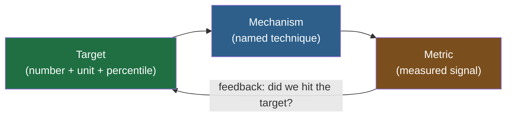
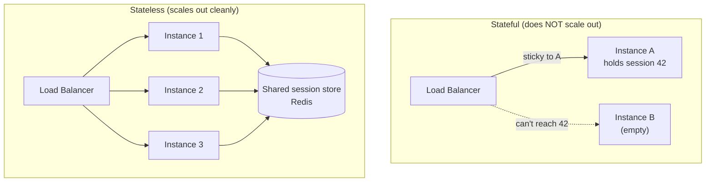
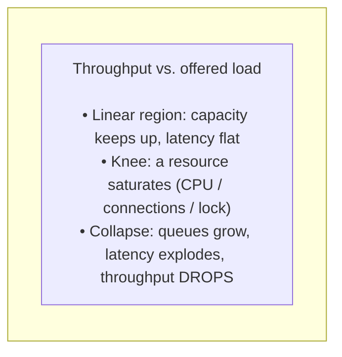
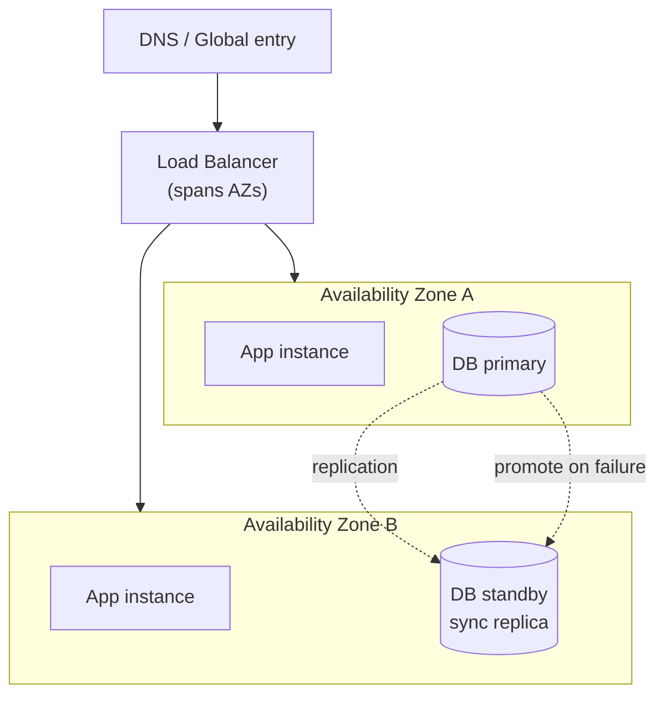
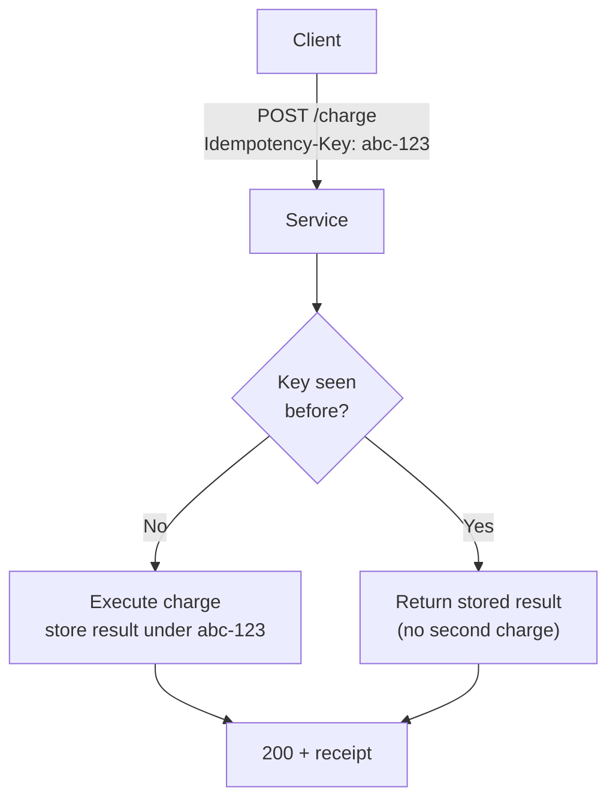
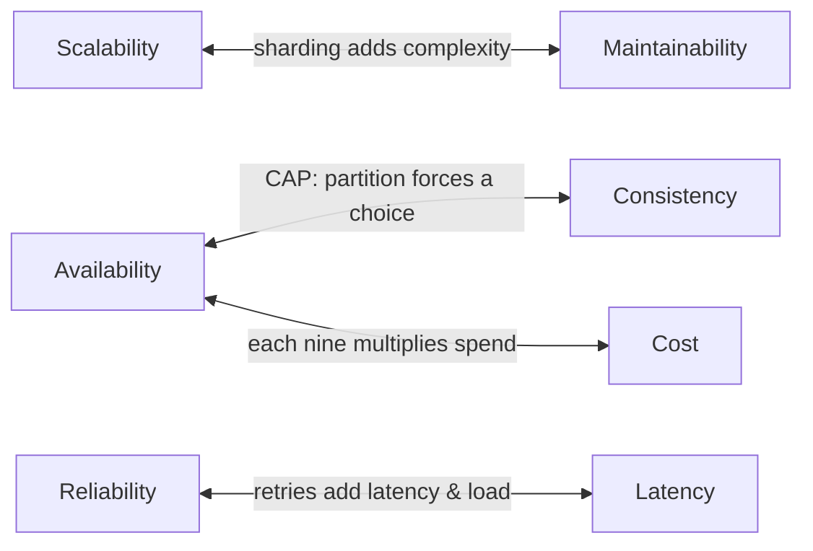
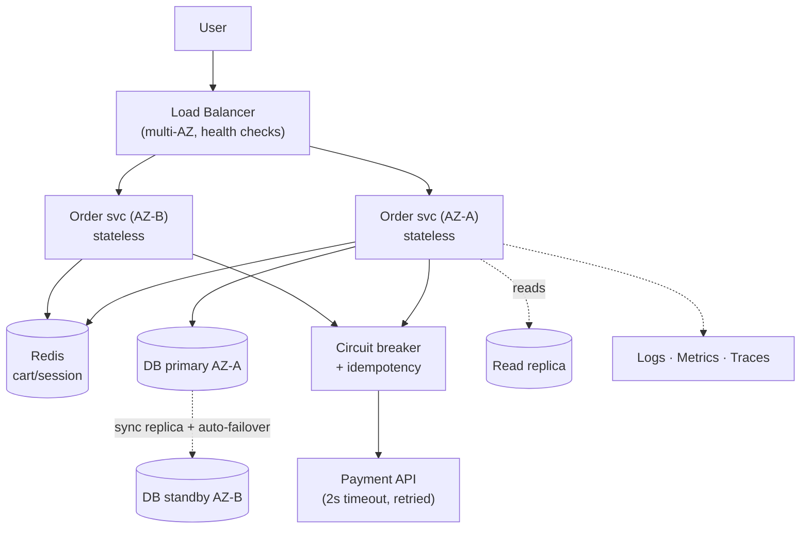

# Key Characteristics of Systems — Middle

<!-- level-focus -->
At middle level, focus on this question:

> Where does **Key Characteristics of Systems** belong in a maintainable component, and which trade-off selects the design?

Use the smallest realistic scenario that exposes the decision and its failure behavior.
At the junior level you learned *what* the characteristics are. At the middle level the job changes: you have to **design for** each characteristic and **prove** you achieved it with a number. "We made it scalable" is not an engineering claim. "We sustain 12,000 RPS at p99 = 180 ms with CPU under 65%, and a load test shows the curve stays linear to 20,000 RPS" is.

This document treats four characteristics — scalability, availability, reliability, maintainability — as design problems. For each one you get the **concrete mechanisms** you reach for, the **measurable signal** that tells you whether the mechanism worked, and a **worked mini-example** with real numbers. The recurring discipline is the triplet: *characteristic → design mechanism → metric*. If you cannot name all three, you do not yet understand the requirement.

## 1. The Mental Model: Design for a Number

Every characteristic decomposes into the same three questions:

1. **What is the target?** A scalar with a unit and a percentile. "p99 latency under 200 ms at 10k RPS." "99.95% monthly availability." "Recover from an AZ loss within 90 seconds."
2. **What mechanism gets me there?** A specific, nameable technique — statelessness, a read replica, a circuit breaker, structured logs.
3. **What metric confirms it?** A measurement you can read off a dashboard or a load test, ideally with an alert threshold.

A target without a mechanism is a wish. A mechanism without a metric is faith. The middle-level engineer always closes the loop.

Keep this loop in your head for the rest of this document. Each section below fills in one row of it.

---

## 2. Scalability: Designing for Load

**Definition you can act on:** a system is scalable if it can absorb increased load by adding resources, ideally so that *throughput grows roughly linearly with resources while latency stays flat*. The enemy is the curve bending: you double the servers and get only 1.3x the throughput.

### 2.1 Vertical vs. horizontal

- **Vertical scaling (scale up):** bigger box — more vCPUs, more RAM, faster disk. Simple, no code change, but capped by the largest machine and gives you a single failure domain. Good first move; bad final answer.
- **Horizontal scaling (scale out):** more boxes behind a load balancer. Effectively unbounded, fault-tolerant, but only works if your service is **stateless** and your data layer can partition.

The middle-level instinct: scale *up* until it is uncomfortable (it is fast and cheap to operate one big node), then invest in scaling *out* before you hit the ceiling, because the out-architecture takes weeks to build and you do not want to start it during an incident.

### 2.2 Statelessness is the precondition

Horizontal scaling only works if any request can land on any instance. That means **no per-user state in process memory**. Move session state to a shared store (Redis), a signed token (JWT in a cookie), or a sticky-session-free design. The test: kill any one instance mid-traffic and no user notices anything beyond a single failed request that retries successfully.

### 2.3 Partitioning / sharding the data tier

Stateless app servers push the bottleneck down to the database. A single primary has a hard ceiling on writes. Two moves:

- **Read replicas** for read-heavy workloads: writes go to the primary, reads fan out to N replicas. Scales reads, not writes.
- **Sharding (horizontal partitioning):** split rows across multiple primaries by a **shard key** (e.g., `user_id % 16`, or a hash range). Each shard owns a slice; writes scale with shard count. The cost: cross-shard queries and transactions become hard, and rebalancing is painful. Choose a shard key with high cardinality and even distribution — `user_id` good, `country` bad (one shard gets all of India).

### 2.4 Load balancing

A load balancer turns N instances into one virtual endpoint. Middle-level knobs you should know:

- **Algorithm:** round-robin (simple), least-connections (better for long-lived/uneven requests), consistent hashing (keeps a key on the same backend — vital for caches).
- **Health checks:** the LB must stop sending traffic to a sick instance within a few seconds (see §3.4). Without this, scaling out just spreads requests onto broken nodes.

### 2.5 The load-vs-resources curve

This is the single most important picture in scalability. Plot throughput against load and watch where the line bends.

The "collapse" region — where adding *more* load yields *less* useful throughput — is why you put admission control and rate limiting in front of systems. Past the knee, the polite thing a system can do is shed load, not melt.

### 2.6 How you measure scalability

- **RPS / QPS** — requests per second sustained at an acceptable latency.
- **Latency percentiles** — p50/p95/p99. Averages hide tail pain; always report p99.
- **Resource utilization** — CPU, memory, connection-pool saturation. If you are at 9k RPS and CPU is 95%, you have ~5% headroom, not "it works."
- **Scaling efficiency** — when you go from N to 2N instances, did throughput go to ~2x? Anything below ~1.7x means a shared bottleneck (the DB, a lock, a single cache node) is eating your gains.

### 2.7 Worked mini-example

> An API serves 5,000 RPS on 4 instances at p99 = 140 ms; CPU sits at 70%. Marketing forecasts a launch pushing 15,000 RPS.
>
> **Design:** the service is already stateless (sessions in Redis), so scale out. At 5k/4 = 1,250 RPS per instance and 70% CPU, each instance has headroom to ~1,600 RPS before saturating. For 15k RPS at a safe 60% target, plan ~12 instances (15,000 / 1,250). Add an auto-scaling policy: scale out when average CPU > 65% for 3 minutes.
>
> **Verify:** run a load test ramping to 18k RPS. The success criterion: throughput tracks linearly to 15k with p99 < 200 ms, and the DB primary's write CPU and the read-replica lag both stay healthy. If the line bends at 9k, the bottleneck is downstream (likely the DB), and more app instances won't help — that is the signal to add read replicas or shard.

---

## 3. Availability: Designing Out Single Points of Failure

**Definition you can act on:** availability is the fraction of time the system is able to serve requests, usually expressed as a percentage ("number of nines") over a window. The design goal is to ensure **no single component failure takes down the system** — i.e., eliminate single points of failure (SPOFs).

### 3.1 The nines, in real downtime

| Availability | Downtime / year | Downtime / month | What it implies |
|---|---|---|---|
| 99% ("two nines") | 3.65 days | ~7.2 hours | A hobby service; one bad deploy blows the budget |
| 99.9% ("three nines") | 8.77 hours | ~43 minutes | Typical internal/business app |
| 99.95% | 4.38 hours | ~22 minutes | Common SaaS SLA tier |
| 99.99% ("four nines") | 52.6 minutes | ~4.3 minutes | Serious production; needs multi-AZ + automation |
| 99.999% ("five nines") | 5.26 minutes | ~26 seconds | Telco/payments; very expensive, mostly automated failover |

The lesson: above three nines, *humans cannot be in the recovery loop*. Four nines means your failover must be automatic, because a human paged at 3 a.m. cannot diagnose and act inside four minutes a month.

### 3.2 Redundancy: the core mechanism

Availability is bought with redundancy. Every component that can be a SPOF gets a peer: two app instances minimum, a database with a standby, two load balancers, two of everything in the request path. The arithmetic of independent failures is friendly: if one instance has 99% availability, two independent ones in parallel give 1 − (0.01 × 0.01) = 99.99%. The catch is the word *independent* — if both sit in the same rack on the same power feed, they fail together.

### 3.3 Multi-AZ and removing correlated failure

An Availability Zone is an isolated datacenter (separate power, cooling, network) within a region. Spreading redundant instances across ≥2 AZs means a whole-datacenter loss costs you capacity, not uptime. This is the single highest-leverage availability move in cloud design and the reason "it's redundant" must always be followed by "...across failure domains."

### 3.4 Health checks and failover

Redundancy is useless if traffic still flows to a dead node. Two layers:

- **Health checks:** the load balancer probes each instance (e.g., `GET /healthz` every 5 s). After K consecutive failures it removes the instance from rotation. Design the endpoint to check *real* readiness — DB reachable, dependencies up — not just "the process is alive," but beware making it so deep that one slow dependency marks everything unhealthy.
- **Failover:** for stateful components (the DB), promote a standby to primary when the primary dies. Automatic failover with a controller is what separates three nines from four. Track the **failover time** — the seconds between failure and full recovery — because that interval *is* your downtime.

### 3.5 How you measure availability

- **Uptime %** over a window (the SLA number), computed from successful vs. total probe intervals or from the error rate of real traffic.
- **MTBF** (mean time between failures) — how often it breaks; raise it with redundancy and better components.
- **MTTR** (mean time to recovery) — how long recovery takes; lower it with automation, health checks, and runbooks. Availability ≈ MTBF / (MTBF + MTTR), so *halving MTTR improves availability exactly as much as doubling MTBF* — and is usually far cheaper.

### 3.6 Worked mini-example

> A checkout service runs on a single DB primary and two app instances in one AZ. Target: 99.95% (≤ ~22 min/month). Last quarter an AZ network blip caused a 35-minute outage — already over budget for the whole quarter.
>
> **Design:** add a synchronous standby in a second AZ with automatic failover (controller promotes standby in < 30 s). Move the two app instances to span both AZs. Put the load balancer's health check on `/healthz` (checks DB connectivity), failing an instance after 3 misses at 5 s = ~15 s detection.
>
> **Verify:** run a game day. Kill the primary; measure failover time (target < 30 s) and confirm in-flight transactions either committed or cleanly errored (no double charge — see reliability §4). Compute the new theoretical availability: with MTTR cut from 35 min to ~30 s, the same failure frequency now fits comfortably inside the 99.95% budget.

---

## 4. Reliability: Designing for Correct Behavior Under Failure

Availability asks "is it up?" **Reliability asks "does it do the right thing, even when its dependencies misbehave?"** A system can be 100% up and deeply unreliable if it double-charges cards or silently drops messages. Reliability is about *correctness under partial failure* — and in a distributed system, partial failure is the normal case, not the exception.

### 4.1 Timeouts: the foundation

Every network call must have a timeout. The default in most clients is "wait forever," which means one slow dependency can pin every thread in your service and take it down — a slow dependency is more dangerous than a dead one. Set timeouts deliberately: a downstream call that normally takes 50 ms should time out at, say, 500 ms, not 30 s. Budget timeouts so that the sum of downstream timeouts is less than your own caller's timeout, or retries stack into a cascade.

### 4.2 Retries with backoff and jitter

Transient failures (a dropped packet, a momentary 503) should be retried — but naively retrying causes two pathologies:

- **Retry storms:** thousands of clients all retry at once, hammering an already-struggling service. Fix with **exponential backoff** (wait 100 ms, 200 ms, 400 ms…) plus **jitter** (randomize the wait) so retries spread out instead of synchronizing.
- **Amplification:** retrying a non-idempotent call (a payment) can execute it twice.

### 4.3 Idempotency: making retries safe

An operation is **idempotent** if doing it twice has the same effect as doing it once. Reads are naturally idempotent; writes are not. The standard mechanism: the client sends an **idempotency key** (a UUID per logical operation); the server records it and, on a duplicate key, returns the original result instead of re-executing. This is what lets you retry a "charge $20" call without fear. Without idempotency, you cannot safely retry, and without safe retries, you cannot be reliable in the presence of timeouts.

### 4.4 Circuit breakers: stop hammering a dead dependency

When a dependency is failing, continuing to call it wastes resources and makes things worse. A **circuit breaker** wraps the call and tracks the failure rate. It has three states:

- **Closed:** normal, requests pass.
- **Open:** the breaker tripped; requests fail immediately (fail fast) for a cooldown period, protecting both your threads and the struggling dependency.
- **Half-open:** after cooldown, allow one trial request; success closes the breaker, failure re-opens it.

The payoff: a failing dependency degrades *one feature* instead of exhausting your thread pool and taking down the whole service.

### 4.5 Graceful degradation

When a non-critical dependency is down, serve a reduced experience rather than an error. Recommendations service down? Show a generic top-10 list. Avatar service slow? Render initials. The design rule: classify dependencies as **critical** (no checkout without payment) vs. **optional** (no checkout *needs* recommendations), and make optional ones fail soft. The circuit breaker's "open" state is where you wire in the fallback.

### 4.6 How you measure reliability

- **Success rate / error rate** of requests (e.g., 99.95% of requests succeed) — distinct from uptime; a system can be "up" while erroring.
- **Retry rate and retry-success rate** — high retries mean a flaky dependency; if retries rarely succeed, your retry policy is just adding load.
- **Idempotency-key collision handling** — verified by a test that fires the same key twice and asserts one effect.
- **Circuit-breaker trip count** — a rising trend points at the unhealthy dependency before users feel it.

### 4.7 Worked mini-example

> A booking service calls a third-party payment API. During the provider's brief outages, the booking service's threads all block on 30 s timeouts, the whole service stalls, and some users get charged twice when they refresh and resubmit.
>
> **Design:** (1) Set the payment-call timeout to 2 s. (2) Wrap it in a circuit breaker that opens at >50% failures over 20 calls, cooldown 10 s. (3) Require an `Idempotency-Key` per booking so a resubmit returns the original charge, never a second one. (4) When the breaker is open, queue the booking as "payment pending" and show "we'll confirm shortly" rather than an error.
>
> **Verify:** in a fault-injection test, make the payment API return 503 for 30 s. Assert: no thread-pool exhaustion (threads freed within 2 s), breaker opens within ~20 calls, duplicate submissions with the same key produce exactly one charge, and users see the degraded "pending" path, not a 500. Track breaker trips and duplicate-key hits in production dashboards.

---

## 5. Maintainability: Designing for the People Who Operate It

Most of a system's cost is incurred *after* it ships, by the engineers who extend, debug, and operate it. Maintainability is the characteristic that decides whether year three is pleasant or a death march. It has four practical pillars.

### 5.1 Simplicity — fight accidental complexity

There is *essential* complexity (the problem is genuinely hard) and *accidental* complexity (we made it hard). Maintainable systems ruthlessly remove the accidental kind: fewer moving parts, fewer special cases, fewer technologies. A boring, well-understood Postgres beats an exotic store you have to learn during an incident. The middle-level question for every component: "what does this earn, and could a simpler thing do the job?"

### 5.2 Modularity and evolvability

Split the system along **clear boundaries** so a change is local. Good boundaries hide implementation behind a stable interface (a module, a service, an API contract), so you can swap the inside without touching callers. **Evolvability** is the property that you can make a likely future change cheaply — e.g., versioned APIs and backward-compatible schema migrations (add-column then backfill then switch, never a breaking rename in one step) let you change without coordinating a flag-day across teams.

### 5.3 Observability — you cannot operate what you cannot see

The three pillars:

- **Logs** — structured (key-value/JSON), not free text, so they're queryable. Include a correlation/trace ID on every line.
- **Metrics** — numeric time series (RPS, latency percentiles, error rate, queue depth) for dashboards and alerts.
- **Traces** — follow one request across services to find *which hop* is slow.

The bar: when something breaks, can an on-call engineer answer "what's wrong and where" in minutes, from the telemetry, without adding new logging and redeploying? If not, the system isn't observable yet.

### 5.4 Operability — make the routine routine

Operability is everything that makes day-2 life easy: one-command deploys and rollbacks, feature flags to disable a misbehaving feature without a deploy, runbooks for known failure modes, and health/readiness endpoints. The strongest signal of good operability is that **rollback is fast and boring** — if rolling back a bad deploy takes one button and two minutes, your change-failure risk plummets.

### 5.5 How you measure maintainability

Maintainability resists a single number, but the DORA metrics make it concrete and benchmarkable:

| DORA metric | What it captures | "Elite" ballpark |
|---|---|---|
| **Lead time for change** | commit → production | < 1 day |
| **Deployment frequency** | how often you ship | on-demand / many per day |
| **Change-failure rate** | % of deploys causing a problem | 0–15% |
| **MTTR (time to restore)** | how fast you recover from a bad change | < 1 hour |

Supporting signals: cyclomatic complexity and module coupling (lower is more changeable), test coverage on critical paths, and the simple human metric "how long does onboarding a new engineer to first safe deploy take?"

### 5.6 Worked mini-example

> A monolith deploys once every two weeks; a third of deploys cause an incident; when one does, finding the cause means SSHing into boxes and grepping unstructured logs for an hour.
>
> **Design:** (1) Adopt structured logging with a trace ID propagated through the request, shipped to a central store. (2) Add metrics (RPS, p99, error rate per endpoint) and dashboards. (3) Put the risky feature behind a flag so it can be killed without a deploy. (4) Build a one-command rollback. (5) Slice the deploy so changes ship in small, frequent, reversible increments.
>
> **Verify (with DORA):** track lead time, deploy frequency, change-failure rate, and MTTR before and after. Targets: deploy frequency from biweekly to daily, change-failure rate from ~33% to <15%, MTTR from ~1 hour to <15 minutes (because trace IDs + dashboards turn "grep the boxes" into "read the dashboard"). The numbers, not opinions, tell you maintainability improved.

---

## 6. The Master Table: Characteristic → Mechanism → Metric

This is the table to internalize. In a design review you should be able to fill a row like this for every requirement on the table.

| Characteristic | Design mechanism(s) | Measurable signal (metric) | What "good" looks like |
|---|---|---|---|
| **Scalability** | Stateless services + horizontal scaling | Sustained RPS at target p99; CPU/conn-pool utilization | Throughput ~2x when instances ~2x; CPU < 70% at peak |
| | Read replicas | Replica read share; replication lag | Reads offloaded; lag < 1 s |
| | Sharding by shard key | Per-shard load skew | Even distribution; no hot shard |
| | Load balancer + autoscaling | Queue depth; scale events vs. load | LB spreads evenly; scales before knee |
| **Availability** | Redundancy across ≥2 AZs | Uptime %; nines over the window | Meets SLA; survives 1 AZ loss |
| | Health checks | Detection time (unhealthy → out of rotation) | < ~15 s |
| | Automatic failover | Failover time (= downtime per event) | < 30 s |
| | Remove SPOFs | Count of single-instance components in path | Zero in the critical path |
| **Reliability** | Timeouts on every call | p99 of downstream calls vs. timeout | No unbounded waits; no thread starvation |
| | Retries + exponential backoff + jitter | Retry rate; retry-success rate | Retries spread out; mostly succeed |
| | Idempotency keys | Duplicate-key handling test | Exactly-once effect on retry |
| | Circuit breakers | Trip count; fail-fast latency | Opens on bad dependency; protects pool |
| | Graceful degradation | Critical vs. optional dependency map | Optional failures → reduced UX, not 500 |
| **Maintainability** | Modularity / clear boundaries | Coupling; blast radius of a change | Changes stay local |
| | Observability (logs/metrics/traces) | Time-to-diagnose from telemetry | Root cause in minutes, no redeploy |
| | Operability (flags, 1-click rollback) | MTTR; rollback time | Fast, boring recovery |
| | Evolvability + simplicity | Lead time; change-failure rate (DORA) | Short lead time; low CFR |

---

## 7. How the Characteristics Trade Off

These four are not independent; pushing one often taxes another. Naming the tension is a senior-track skill.

- **Availability vs. consistency (the CAP tension).** A multi-AZ replicated database that stays available during a network partition may serve slightly stale reads. If you demand strong consistency, you sometimes refuse requests during partitions — trading availability for correctness. Most systems pick per-operation: strong for "account balance," eventual for "like count."
- **Scalability vs. simplicity.** Sharding scales writes but shatters the simple "one database, real transactions" model into cross-shard coordination. You buy scale with maintainability. Don't shard until a single (replicated) primary genuinely can't keep up — premature sharding is a classic self-inflicted wound.
- **Reliability vs. latency.** Retries and redundant calls improve success rate but add latency (a retried request is slower) and load. Timeouts that are too aggressive trade success for speed; too lax trade speed for hung threads. Tuning is the art.
- **Redundancy vs. cost.** Every nine roughly multiplies infrastructure and operational spend. Four nines with multi-AZ active-active costs far more than three nines. Match the target to the business: a payments path earns four nines; an internal analytics dashboard does not.

The point is not to maximize every characteristic — that is impossible and ruinously expensive. It is to hit the *business-justified target* for each and spend nothing more.

---

## 8. A Worked End-to-End Example

Tie it together with one realistic feature. **Requirement:** a "place order" endpoint for an e-commerce site. Targets: 8,000 RPS at peak, p99 < 250 ms, 99.95% availability, never double-charge, and the on-call team must diagnose issues in minutes.

**Scalability.** Make the order service stateless (cart and session in Redis), put it behind a load balancer, and autoscale on CPU > 65%. Sizing: if one instance handles 1,000 RPS at 60% CPU, run ~10 instances for 8k RPS with headroom. Reads (catalog, inventory checks) go to read replicas; the order write goes to the primary. *Metric:* load test to 10k RPS, confirm linear scaling and p99 < 250 ms, replica lag < 1 s.

**Availability.** Two AZs, instances and the database standby split across them, automatic DB failover under 30 s, LB health checks on `/healthz` (checks DB + inventory reachability) failing a node in ~15 s. *Metric:* a game day kills the primary AZ; uptime impact must fit the 99.95% budget.

**Reliability.** The payment call gets a 2 s timeout, a circuit breaker, and a required idempotency key so a client retry never double-charges. If inventory service (optional for the *confirmation* step) is down, accept the order as "confirming" and reconcile async. *Metric:* fault-injection test asserts exactly-once charge under retries and no thread-pool exhaustion when payment returns 503.

**Maintainability.** Structured logs with a trace ID spanning the LB → order service → payment → DB hops; dashboards for RPS, p99, error rate, breaker trips; the new flow behind a feature flag; one-command rollback. *Metric:* DORA — daily deploys, change-failure rate < 15%, MTTR < 15 min.

Notice every characteristic shows up as a concrete box and a stated metric. That is what a middle-level design looks like: no hand-waving, every claim measurable.

---

## 9. Checklist for a Design Review

Use this when reviewing your own or a peer's design. Each item is a row of the master loop.

**Scalability**
- [ ] Is the service stateless? Where does session/state live?
- [ ] What is the target RPS and p99, and is there a load test that proves it?
- [ ] Where is the bottleneck when app servers are no longer the limit (usually the DB)? What's the plan — replicas or shards?
- [ ] Is there an autoscaling policy, and does it trigger *before* the knee?

**Availability**
- [ ] What is the SLA target in nines, and what downtime budget does that imply?
- [ ] Is every component in the critical path redundant *across failure domains* (≥2 AZs)?
- [ ] What is the detection time (health checks) and failover time? Are they inside the budget?
- [ ] Name every remaining SPOF. (If you can't name them, you haven't looked hard enough.)

**Reliability**
- [ ] Does every network call have a timeout, and do the timeout budgets nest correctly?
- [ ] Are retries backed off with jitter, and are retried operations idempotent?
- [ ] Where are the circuit breakers, and what's the fallback when one opens?
- [ ] Which dependencies are critical vs. optional, and do optional ones fail soft?

**Maintainability**
- [ ] Can on-call diagnose a failure from telemetry alone, in minutes?
- [ ] Is there a one-command rollback and feature flags for risky changes?
- [ ] What are the current DORA numbers, and which mechanism moves the weak one?
- [ ] What's the simplest design that meets the targets — and did we accidentally exceed it?

If you can answer every box with a mechanism *and* a metric, you have designed for the characteristics rather than hoped for them. That is the whole job at this level.

---

*Next step:* [Senior level](senior.md)

---

## Apply it

1. Find a real component where **Key Characteristics of Systems** affects an interface or dependency.
2. Write two plausible choices and the constraint that favors each one.
3. Make the smallest reversible change at that boundary.
4. Exercise the component alone, then exercise the integrated flow.
5. Keep the decision note with the evidence that selected the option.

## Verify your work

- A focused check proves the local behavior.
- An integrated check proves callers and dependencies still agree.
- Logs, traces, compiler output, or benchmarks expose the boundary.
- Reverting the change restores the previous behavior without unrelated edits.

## Review questions

- Which boundary is most affected by Key Characteristics of Systems?
- What constraint would make you choose the alternative design?
- How would you isolate a local defect from an integration defect?
- What evidence shows that the change remains maintainable?
