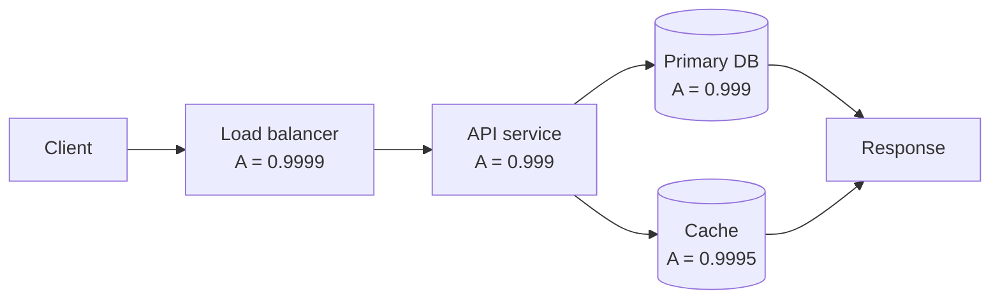
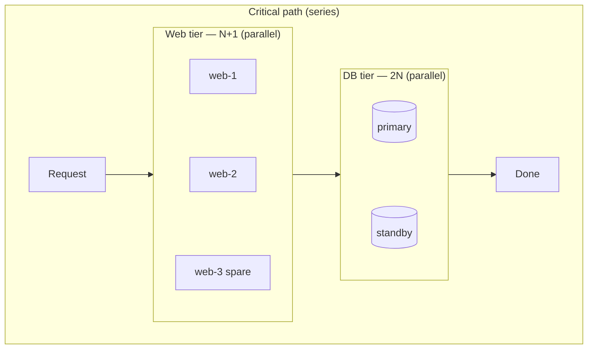
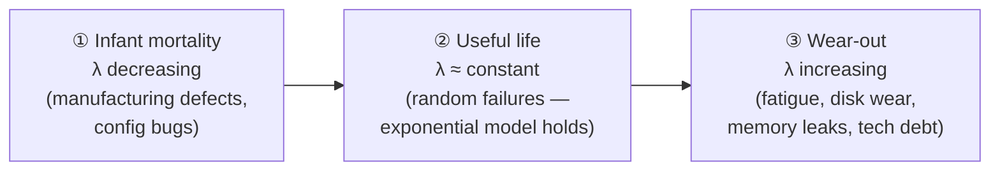
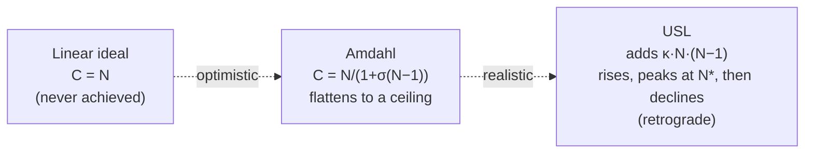
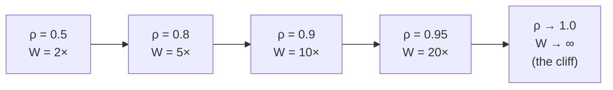

# Key Characteristics of Systems — Theory and Formal Foundations

<!-- level-focus -->
At professional level, focus on this question:

> How should teams adopt and operate **Key Characteristics of Systems — Theory and Formal Foundations** with measurable outcomes and limited coordination?

Use the smallest realistic scenario that exposes the decision and its failure behavior.
The qualities we casually call "availability," "reliability," "scalability,"
and "performance" are not vibes. Each is a *measurable quantity* governed by a
small number of mathematical laws. A principal engineer who can reason about
these laws turns architecture arguments from opinion-jousting into arithmetic:
"this design caps at 99.5% because of the series dependency on the email
provider," or "we will hit a retrograde throughput peak around 48 cores because
of cross-node coherency." This document develops the formal core behind the key
characteristics so you can do that arithmetic on a whiteboard.

## 1. The characteristics, defined precisely

Before the math, pin down the words. Loose definitions are the source of most
disagreements in design reviews.

| Characteristic | Precise definition | Unit / measure |
|----------------|--------------------|----------------|
| **Availability** | The probability that the system is operational and serving correct responses at a randomly chosen instant. | Dimensionless ratio in [0,1], often expressed as "nines." |
| **Reliability** | The probability that the system operates without failure over a *time interval* [0, t]. Availability is a point-in-time property; reliability is an interval property. | A function R(t) ∈ [0,1]. |
| **Durability** | The probability that committed data is not lost over an interval, independent of whether the system is currently reachable. | Often expressed as nines of durability (e.g., 11 nines). |
| **Scalability** | The degree to which throughput (or capacity) increases as resources increase. Perfect linear scalability means doubling resources doubles throughput. | Speedup or throughput as a function of N. |
| **Performance** | How fast a single request is served (latency) and how many can be served per unit time (throughput). | Latency in seconds (percentiles); throughput in req/s. |
| **Maintainability** | The ease and speed with which a failed or degraded system is restored, captured quantitatively as MTTR. | Time (MTTR). |

Three of these — availability, reliability, durability — are *probabilities*.
Treat them with the algebra of probability, not the algebra of percentages.
A common error is averaging availabilities ("two 99% services, so 99% overall");
the correct composition rules are in §3.

A subtle but load-bearing distinction:

- **Availability** answers "is it up *right now*?" A system that crashes and
  recovers every minute can still have high availability if recovery is instant.
- **Reliability** answers "will it run for the next *hour* without a hitch?"
  The same flapping system has terrible reliability.

You design for whichever your users actually care about. A batch job cares about
reliability over its runtime; a web API cares about availability per request.

---

## 2. Availability math: MTBF, MTTR, and the steady-state formula

Model a component as alternating between two states: **up** and **down**. It runs
for a while, fails, gets repaired, runs again. Over a long observation window:

- **MTBF** — Mean Time Between Failures — the average length of an *up* interval.
- **MTTR** — Mean Time To Repair (or Recover) — the average length of a *down*
  interval.

Steady-state availability is the fraction of time spent up:

```
A = MTBF / (MTBF + MTTR)
```

Equivalently, **unavailability** is U = 1 − A = MTTR / (MTBF + MTTR).

This formula is the single most important lever in availability engineering, and
it carries a non-obvious lesson: **A depends on the *ratio* of MTBF to MTTR, not
on MTBF alone.** Halving MTTR improves availability exactly as much as doubling
MTBF. Because MTTR is usually controllable through automation (fast failover,
auto-restart, blue-green deploys) while MTBF is bounded by hardware and software
quality, MTTR is often the cheaper knob.

### Worked calculation #1 — MTBF/MTTR availability

A service fails on average once every 30 days and takes 45 minutes to recover
(manual on-call response).

```
MTBF = 30 days       = 43,200 minutes
MTTR = 45 minutes

A = 43,200 / (43,200 + 45)
  = 43,200 / 43,245
  = 0.998959...
  ≈ 99.896%
```

That is roughly "three nines minus a bit" — about 8.7 hours of downtime per year.
Now suppose we add automated failover and cut MTTR to 90 seconds (1.5 minutes)
without touching failure frequency:

```
A = 43,200 / (43,200 + 1.5)
  = 43,200 / 43,201.5
  = 0.9999653...
  ≈ 99.9965%
```

Same failure rate, but recovery automation moved us from ~8.7 h/year of downtime
to ~18 minutes/year — a 30× reduction, achieved without making the software fail
any less often. This is why mature SRE organizations obsess over MTTR.

### The "nines" reference

| Availability | "Nines" | Downtime / year | Downtime / day |
|--------------|---------|------------------|----------------|
| 90% | one nine | 36.5 days | 2.4 h |
| 99% | two nines | 3.65 days | 14.4 min |
| 99.9% | three nines | 8.76 h | 1.44 min |
| 99.99% | four nines | 52.6 min | 8.64 s |
| 99.999% | five nines | 5.26 min | 0.86 s |
| 99.9999% | six nines | 31.5 s | 86 ms |

Internalize this table. When someone proposes "five nines," they are committing
to *under 5.3 minutes of total downtime per year* — including deploys, config
changes, and dependency outages. That is a strong claim, achievable only with
deep redundancy and aggressive automation.

---

## 3. Composing availability: series and parallel

Real systems are graphs of components. The end-to-end availability depends on the
*topology* of dependence.

### Series composition (dependency chain)

If a request must traverse components 1…n and *all* must be up for the request to
succeed, the components are in **series**. Assuming independence, availabilities
multiply:

```
A_series = A₁ · A₂ · ... · Aₙ = ∏ Aᵢ
```

Series composition is pessimistic by construction: adding any component can only
*lower* availability, because every factor is ≤ 1. This is the formal reason a
microservice on the critical path of a request degrades the whole request.



If the cache is on the *critical path* (a hard dependency), the chain
LB → API → DB → CACHE has:

```
A_series = 0.9999 × 0.999 × 0.999 × 0.9995
         = 0.99810...
         ≈ 99.81%
```

Four individually-strong components combine to something weaker than any of them.
The lesson: every hard dependency is a tax on availability. Make non-essential
dependencies *soft* (degrade gracefully when the cache is down) to remove them
from the series product.

### Parallel composition (redundancy)

If a function is served by k *redundant* replicas and the function succeeds when
*at least one* replica is up, the replicas are in **parallel**. The function is
down only when *all* replicas are down simultaneously:

```
A_parallel = 1 − ∏ (1 − Aᵢ)
```

Parallelism is optimistic: each replica multiplies the *unavailability*, driving
it toward zero. Two replicas at 99% each:

```
U_each = 1 − 0.99 = 0.01
A_parallel = 1 − (0.01 × 0.01) = 1 − 0.0001 = 0.9999  (four nines)
```

Two two-nines replicas combine into a four-nines pair. Redundancy *adds nines*;
each independent replica roughly doubles the number of nines (because it squares
the unavailability) — *if* failures are independent (see §4).

### The asymmetry

| Topology | Formula | Effect | Mnemonic |
|----------|---------|--------|----------|
| Series (all must work) | ∏ Aᵢ | Lowers availability | Weakest link; multiply availabilities |
| Parallel (one suffices) | 1 − ∏(1 − Aᵢ) | Raises availability | Multiply *unavailabilities* |

Real architectures are series-parallel graphs: redundant subsystems (parallel)
chained on the critical path (series). You reduce each redundant block to a single
equivalent availability, then multiply the blocks.

---

## 4. Redundancy: N+1, 2N, and the independence assumption

Redundancy schemes differ in how much spare capacity they carry.

- **N+1**: N units are needed to carry full load; you run N+1 so a single failure
  leaves N working units and full capacity. Cheap, tolerates one failure.
- **N+2**: tolerates two simultaneous failures (e.g., one failed unit plus one in
  maintenance). Common where maintenance windows overlap risk.
- **2N**: full duplication — two complete independent stacks (e.g., active-active
  across two data centers). Tolerates the loss of an entire stack.
- **2N+1**: full duplication plus a spare, used where even during a stack outage
  you want N+1 within the surviving stack.



### Worked calculation #2 — availability with redundancy

Design target: a stateless web tier and a database tier, both on the critical path
(series), each made redundant (parallel).

Assume each web node has A = 0.99 and we run **N+1 = 3** nodes where any 1 of 3
suffices for the calculation's availability (capacity headroom is separate). The
web *block* availability:

```
A_web_block = 1 − (1 − 0.99)³
            = 1 − (0.01)³
            = 1 − 0.000001
            = 0.999999   (six nines)
```

The database tier is **2N** active-standby with each node A = 0.995. The DB
*block*:

```
A_db_block = 1 − (1 − 0.995)²
           = 1 − (0.005)²
           = 1 − 0.000025
           = 0.999975
```

Now compose the two blocks in series (a request needs both tiers):

```
A_system = A_web_block × A_db_block
         = 0.999999 × 0.999975
         = 0.999974   (≈ four nines, ~13.6 min/year downtime)
```

Notice the database block — the *less* redundant, *lower*-availability tier —
dominates the result. End-to-end availability is gated by the weakest *block* in
the series. Pouring more web replicas in (already six nines) is wasted effort;
the marginal nine must be bought at the database tier.

### The independence assumption and correlated failure

Every parallel formula above silently assumed **failures are independent** —
P(both down) = P(down)·P(down). Reality routinely violates this:

- Both replicas share a power feed, a top-of-rack switch, a Kubernetes node, a
  bad config push, a poisoned cache entry, or the same buggy deploy.
- A correlated event (data-center power loss, certificate expiry, dependency
  outage) takes down "independent" replicas at once.

When failures are correlated, the true joint failure probability is far higher
than the product. Formally, with correlation coefficient ρ between two replicas:

```
P(both down) = U₁·U₂ + ρ·√(U₁(1−U₁)·U₂(1−U₂))
```

For positively correlated failures (ρ > 0), this exceeds U₁·U₂, so the *realized*
parallel availability is worse than the idealized 1 − ∏(1 − Aᵢ). The engineering
takeaway: **redundancy only adds nines to the extent that failure modes are truly
decorrelated.** This is why we spread replicas across availability zones, power
domains, and deploy waves — we are buying independence, which is the thing the
math actually rewards. Two replicas in the same rack are barely more available
than one.

---

## 5. Reliability theory: failure rate, the exponential model, and the bathtub

Reliability R(t) is the probability a component survives without failure through
time t. Define the **failure rate** (hazard rate) λ(t) as the instantaneous rate
of failure given survival so far.

When λ is *constant* — λ(t) = λ — the survival function is exponential:

```
R(t) = e^(−λt)
```

This constant-hazard, memoryless model is the workhorse of reliability
engineering. Two consequences:

1. **MTBF is the reciprocal of the failure rate.** For the exponential model,
   ```
   MTBF = ∫₀^∞ R(t) dt = ∫₀^∞ e^(−λt) dt = 1/λ
   ```
   So λ = 1/MTBF. If a disk has MTBF = 1,000,000 hours, λ = 10⁻⁶ failures/hour.

2. **Failure rates add for series systems.** Independent components in series have
   a combined failure rate equal to the sum of the individual rates:
   ```
   λ_system = Σ λᵢ   ⇒   MTBF_system = 1 / Σ λᵢ
   ```
   A box of 100 disks each at MTBF 1,000,000 h has a *system* MTBF of
   1,000,000 / 100 = 10,000 hours — about 14 months to *some* disk failing. More
   parts means more failures, faster. This is why large fleets always have
   something broken and why you design around continuous component failure rather
   than its absence.

### Reliability ≠ availability

R(t) ignores repair. A component might fail often but recover instantly: low
reliability over a long interval, high availability. Or it might be rock-solid for
years and then take a week to fix: high reliability, then a catastrophic
availability hit. The two are linked through MTTR but are not the same number.

### The bathtub curve

Real hardware (and arguably software) failure rates are *not* constant over the
full lifetime. The empirical **bathtub curve** has three regimes:



- **Phase ①** — high but *falling* λ. Defective units die early. Mitigation:
  burn-in testing, canary deploys, gradual rollout. Many software regressions are
  "infant mortality" — caught in the first hours after a release.
- **Phase ②** — flat λ. The exponential model R(t) = e^(−λt) is valid *only here*.
  Failures are random and memoryless.
- **Phase ③** — *rising* λ. Bearings wear, SSD cells exhaust write cycles, log
  partitions fill, accumulated state corrupts. Mitigation: proactive replacement,
  scheduled restarts, capacity refresh. "Turn it off and on again" is wear-out
  mitigation for software that leaks resources over uptime.

The practical caution: applying MTBF = 1/λ assumes you are in Phase ②. Quoting a
single MTBF for a component in infant-mortality or wear-out is misleading.

---

## 6. Scalability laws: Amdahl and the Universal Scalability Law

Scalability asks: as we add resources (cores, nodes, threads), how does throughput
or speedup grow? Two laws bound the answer, and the second is the one principals
must know because the first is dangerously optimistic.

### Amdahl's Law — the serial fraction ceiling

Let **p** be the fraction of work that can be parallelized and (1 − p) the strictly
serial fraction. With N processors, the speedup is:

```
S(N) = 1 / ( (1 − p) + p/N )
```

As N → ∞, the parallel term vanishes and:

```
S(∞) = 1 / (1 − p)
```

The serial fraction imposes a **hard ceiling** regardless of how many processors
you throw at the problem. Amdahl is the bad news that even a 95%-parallel program
caps at 20× speedup forever.

### Worked calculation #3 — Amdahl speedup

A job is 90% parallelizable (p = 0.9, serial fraction 0.1). Compute speedup at
several N:

```
S(2)   = 1 / (0.1 + 0.9/2)   = 1 / 0.55   = 1.82×
S(8)   = 1 / (0.1 + 0.9/8)   = 1 / 0.2125 = 4.71×
S(32)  = 1 / (0.1 + 0.9/32)  = 1 / 0.1281 = 7.80×
S(1000)= 1 / (0.1 + 0.9/1000)= 1 / 0.1009 = 9.91×
S(∞)   = 1 / 0.1             = 10×
```

Going from 8 to 1000 processors (125×) buys only 4.71× → 9.91×, a mere 2.1×
improvement. The serial 10% has eaten everything. Diminishing returns are *built
into the law*: each doubling of N moves you a smaller step toward the asymptote.

### The Universal Scalability Law — Amdahl plus coherency

Amdahl assumes adding processors never *hurts*. In real distributed systems it
often does: nodes must coordinate, and coordination cost grows with the number of
participants. Neil Gunther's **Universal Scalability Law (USL)** adds a second
penalty term — coherency — to capacity C(N):

```
C(N) = N / ( 1 + σ(N − 1) + κ·N·(N − 1) )
```

- **σ (sigma)** — the **contention** coefficient: the serialized fraction
  competing for a shared resource (a lock, a queue, a single coordinator). This is
  essentially Amdahl's serial fraction. It *flattens* the curve.
- **κ (kappa)** — the **coherency** coefficient: the cost of keeping N nodes
  *consistent* with each other (cache-coherency traffic, cross-shard gossip, N²
  point-to-point chatter). Because the κ·N·(N−1) term is *quadratic*, it
  eventually dominates and the curve doesn't just flatten — it **bends back down**.

This is the famous **retrograde region**: beyond an optimal point, adding nodes
*reduces* total throughput because every new node generates more coherency traffic
than the work it contributes. The peak occurs at:

```
N* = √( (1 − σ) / κ )
```

### Worked calculation #4 — USL retrograde peak

Suppose a system has measured σ = 0.03 (3% contention) and κ = 0.0002 (small but
nonzero coherency). Compute capacity at several N and find the peak:

```
C(10)  = 10  / (1 + 0.03·9   + 0.0002·10·9)   = 10  / (1 + 0.27 + 0.018)   = 10/1.288  = 7.76
C(40)  = 40  / (1 + 0.03·39  + 0.0002·40·39)  = 40  / (1 + 1.17 + 0.312)   = 40/2.482  = 16.12
C(70)  = 70  / (1 + 0.03·69  + 0.0002·70·69)  = 70  / (1 + 2.07 + 0.966)   = 70/4.036  = 17.34
C(100) = 100 / (1 + 0.03·99  + 0.0002·100·99) = 100 / (1 + 2.97 + 1.98)    = 100/5.95  = 16.81
```

Capacity rises, peaks near N ≈ 70, then *falls* — at N = 100 we get *less*
throughput than at N = 70 despite 43% more hardware. The analytic peak:

```
N* = √((1 − 0.03) / 0.0002) = √(0.97 / 0.0002) = √4850 ≈ 69.6
```

confirming the numeric peak. **More nodes made it slower.** This is not a bug; it
is the coherency term winning. Real-world examples: write-heavy databases past a
replica count, chatty service meshes, distributed locks under high contention,
naive cache-coherency at high core counts.



| Model | Formula | Behavior at large N | What it captures |
|-------|---------|---------------------|------------------|
| Linear | C = N | Unbounded growth | Fantasy baseline |
| Amdahl | C = N / (1 + σ(N−1)) | Asymptotes to 1/σ | Contention / serial fraction |
| USL | C = N / (1 + σ(N−1) + κN(N−1)) | Peaks at N*, then declines | Contention **and** coherency |

The principal-level move: *fit your throughput-vs-load measurements to the USL* to
recover σ and κ empirically. σ tells you how much serialization to remove (shard
the lock); κ tells you whether you have an N² coordination problem (reduce
cross-node chatter, partition state). The model converts a fuzzy "it doesn't scale"
into two numbers you can attack.

---

## 7. Performance: Little's Law and the utilization cliff

### Little's Law

For *any* stable system (no assumptions about arrival or service distributions),
the long-run average number of items in the system L relates to the average
arrival rate λ and the average time an item spends in the system W:

```
L = λ · W
```

It is exact, distribution-free, and absurdly useful for back-of-envelope work.
Examples:

- A service handling λ = 2,000 req/s with average end-to-end time W = 50 ms holds
  L = 2000 × 0.05 = **100 requests in flight** on average. That sets your minimum
  concurrency / thread-pool / connection-pool sizing.
- A queue draining at λ = 500 msg/s where each message sits W = 200 ms has
  L = 100 messages resident — size buffers accordingly.

Rearranged, W = L/λ lets you infer latency from observed concurrency, or λ = L/W
to infer throughput from concurrency limits. Whenever someone asserts a system can
"handle X concurrent users," Little's Law is how you check the implied latency and
throughput are mutually consistent.

### The M/M/1 utilization cliff

Little's Law tells you the averages but not *how latency behaves as load rises*.
For that, take the simplest queueing model: a single server with Poisson arrivals
and exponential service times (**M/M/1**). Define **utilization** ρ = arrival rate
/ service rate (ρ ∈ [0,1)). The mean time in system is:

```
W = (1/μ) / (1 − ρ)         where 1/μ is mean service time
```

The term **1 / (1 − ρ)** is the killer. It is the *queueing multiplier* — how much
slower a request is than its raw service time, purely due to waiting behind others.

| Utilization ρ | Queueing multiplier 1/(1−ρ) | Interpretation |
|---------------|-----------------------------|----------------|
| 0.50 | 2.0× | Comfortable |
| 0.70 | 3.3× | Getting warm |
| 0.80 | 5.0× | Noticeable queues |
| 0.90 | 10× | Latency doubling vs. ρ=0.8 |
| 0.95 | 20× | Danger zone |
| 0.99 | 100× | Effectively meltdown |

As ρ → 1, W → ∞. This is the **latency cliff**: latency does not rise linearly with
load — it rises *hyperbolically*, exploding as you approach saturation. A system at
50% utilization that gets a 40% traffic bump (to 90%) sees latency increase 5×, not
1.8×. This single fact explains why:

- You provision for *headroom* (target 50–70% utilization), not 100%. The "wasted"
  capacity buys latency stability and absorbs bursts.
- Autoscaling on CPU at a 50–60% target is a latency decision, not a cost decision.
- A small traffic spike near saturation produces a disproportionate latency
  incident — the cliff, not a gradual slope.



The M/M/1 formula is idealized (single server, Poisson, exponential), but the
*shape* — the 1/(1−ρ) blow-up — holds for essentially every queue. The exact peak
shifts, but the cliff is universal. Plan to stay off it.

---

## 8. Tail-latency amplification under fan-out

Modern requests **fan out**: one user request spawns calls to many backends
(shards, microservices, replicas) and waits for *all* of them. This interacts
viciously with tail latency.

Suppose each of N backend calls independently exceeds its latency SLO (is "slow")
with probability p. The probability that *at least one* of the N is slow — and
therefore the whole request is slow, because it waits for the slowest — is:

```
P(request slow) = 1 − (1 − p)^N
```

This is the parallel-failure formula from §3 wearing a different hat: the request's
tail is the *union* of its dependencies' tails.

### The amplification

| Per-call slow prob. p | N = 1 | N = 10 | N = 100 |
|-----------------------|-------|--------|---------|
| 1% (p99) | 1% | 9.6% | 63.4% |
| 0.1% (p99.9) | 0.1% | ~1.0% | ~9.5% |

Read the top row: even if each backend meets a p99 SLO (slow only 1% of the time),
a request fanning out to **100** backends is slow **63%** of the time. The
individually-acceptable tail becomes the *common case* at the aggregate level.
This is **tail-latency amplification**, and it is why a service can have great
per-dependency p99 numbers yet terrible user-facing p99.

### Worked illustration

With p = 0.01 and N = 100:

```
P(slow) = 1 − (1 − 0.01)^100
        = 1 − (0.99)^100
        = 1 − 0.366
        = 0.634   → 63.4% of requests are slow
```

To keep the *aggregate* p99 acceptable (say, ≤ 1% slow) at N = 100, each backend
must be slow with probability ~0.0001 (p99.99) — two extra nines on every
dependency. That is often infeasible, so the real fixes are architectural:

- **Reduce N** — fewer, coarser-grained calls; batch; denormalize so one read
  serves the request.
- **Hedged / tied requests** — issue a duplicate to a second replica after a brief
  delay and take the first to respond; this collapses the per-call tail.
- **Make some calls optional** — return partial results and fill the rest
  asynchronously, removing slow dependencies from the synchronous union.
- **Tail-tolerant aggregation** — wait for "enough" responses (e.g., 95 of 100)
  rather than all.

The formula is the *diagnosis*; these techniques are the *treatment*. A principal
who sees a fan-out of 50+ on the critical path should immediately reach for this
calculation before promising any aggregate latency SLO.

---

## 9. A worked end-to-end budget

Tie the laws together on one request path. Requirements: serve an API with a target
of **99.95% availability** and **p99 ≤ 300 ms**, at **3,000 req/s**.

**Step 1 — Availability budget (series of blocks).** The path is
LB → API → (DB or Cache). Allowed unavailability = 1 − 0.9995 = 0.0005. Allocate:

| Block | Topology | Per-unit A | Block A | Block U |
|-------|----------|-----------|---------|---------|
| Load balancer | 2N | 0.9999 | 1 − 0.0001² = 0.99999999 | ~1e-8 |
| API tier | N+1 (3 nodes) | 0.999 | 1 − 0.001³ ≈ 0.999999999 | ~1e-9 |
| Data tier | 2N | 0.999 | 1 − 0.001² = 0.999999 | 1e-6 |

```
A_system ≈ 0.99999999 × 0.999999999 × 0.999999 ≈ 0.99999899
```

That is ~five nines of *steady-state* availability — comfortably inside the 99.95%
target, leaving budget for correlated failures and deploys (the independence
caveat from §4 means we should *not* claim the full five nines; the 99.95% target
is the realistic commitment).

**Step 2 — Concurrency (Little's Law).** At λ = 3,000 req/s and target mean W ≈ 40
ms (to leave tail headroom under 300 ms), in-flight requests:

```
L = 3000 × 0.040 = 120 concurrent requests
```

Size thread/connection pools for ≥ 120 with headroom — say 200.

**Step 3 — Utilization headroom (M/M/1).** To keep the queueing multiplier ≤ 2×
(so queue waiting doesn't blow the 300 ms p99), hold ρ ≤ 0.5. If one node serves
~1,000 req/s at full tilt, running at ρ = 0.5 means ~500 req/s/node, so 3,000 req/s
needs **6 active nodes** (plus the +1 for redundancy → 7).

**Step 4 — Fan-out tail check.** If each API request fans out to N = 5 backends,
each needing to be fast for the p99 to hold, and each backend is slow with p:

```
P(slow) = 1 − (1 − p)^5 ≤ 0.01  ⇒  (1−p)^5 ≥ 0.99  ⇒  p ≤ 0.002
```

Each backend needs p99.8 (slow ≤ 0.2%) for the request to hit p99. Achievable with
hedged requests; document it as a dependency SLO.

This is the whole job in miniature: availability composition sets the topology,
Little's Law sets concurrency, the utilization cliff sets headroom, and fan-out
sets per-dependency tail SLOs. Four laws, one coherent design.

---

## 10. Summary of formulas

| Quantity | Formula | Notes |
|----------|---------|-------|
| Steady-state availability | A = MTBF / (MTBF + MTTR) | Depends on the ratio; MTTR is the cheap lever |
| Unavailability | U = 1 − A = MTTR / (MTBF + MTTR) | The thing redundancy squares away |
| Series availability | A = ∏ Aᵢ | All must work; pessimistic |
| Parallel availability | A = 1 − ∏ (1 − Aᵢ) | One suffices; each replica ~doubles nines |
| Correlated joint failure | U₁U₂ + ρ√(U₁(1−U₁)U₂(1−U₂)) | ρ>0 erodes redundancy's benefit |
| Reliability (constant λ) | R(t) = e^(−λt) | Valid in bathtub Phase ② only |
| MTBF ↔ failure rate | MTBF = 1/λ | Series: λ_sys = Σλᵢ |
| Amdahl speedup | S(N) = 1 / ((1−p) + p/N) | Ceiling S(∞) = 1/(1−p) |
| USL capacity | C(N) = N / (1 + σ(N−1) + κN(N−1)) | σ = contention, κ = coherency |
| USL retrograde peak | N* = √((1−σ)/κ) | Beyond N*, more nodes = less throughput |
| Little's Law | L = λ · W | Distribution-free; any stable system |
| M/M/1 latency | W = (1/μ) / (1 − ρ) | Cliff: 1/(1−ρ) blows up as ρ→1 |
| Fan-out tail | P(slow) = 1 − (1 − p)^N | Tail amplification under N-way fan-out |

---

## 11. Pitfalls and where the models lie

These laws are tools, not truths. Knowing their failure modes is what separates a
senior from a principal.

1. **The independence assumption is almost always false.** Parallel-availability
   and fan-out formulas assume uncorrelated events. Shared power, shared config,
   shared deploys, and shared dependencies create correlation that the math does
   not see. *Always* discount idealized redundancy nines and invest in
   decorrelation (multi-AZ, staggered deploys, blast-radius limits) — that is what
   makes the parallel formula approximately true.

2. **MTBF is a fleet average, not a promise.** A 1,000,000-hour disk MTBF does not
   mean *your* disk lasts 114 years; it means in a large fleet, failures arrive at
   rate 1/MTBF. And it only holds in the flat region of the bathtub — quoting MTBF
   during infant mortality or wear-out is meaningless.

3. **Amdahl is optimistic; USL is the real curve.** Amdahl never goes retrograde,
   so it overstates large-N performance. If your scaling tests show throughput
   *decreasing* past some point, you have a κ (coherency) problem, and only the USL
   names it. Fit the data; don't assume linear or even Amdahl scaling.

4. **The utilization cliff is non-negotiable.** No amount of tuning removes the
   1/(1−ρ) blow-up; you can only shift where it bites. Running hot to "save money"
   trades cost for a latency time-bomb that detonates on the next traffic spike.

5. **Averages hide the tail.** Little's Law gives means; users feel p99/p99.9.
   A healthy mean with a fat tail still fails users, and fan-out amplifies that
   tail. Design and SLO against percentiles, not averages.

6. **Models compose, but so do their errors.** An end-to-end budget multiplies
   several approximations. Treat the result as an order-of-magnitude guide that
   tells you *which tier to attack*, then validate with load tests and chaos
   experiments. The math points the flashlight; measurement confirms what's there.

The reward for this rigor: when the design review asks "will it scale?" or "what's
our real availability?", you answer with a number and the assumption behind it —
and you know exactly which assumption to go test first.


---

## Apply it

1. Define the user or business outcome that **Key Characteristics of Systems — Theory and Formal Foundations** should improve.
2. Assign one owner for code, contracts, operations, and incidents.
3. Split delivery into reversible increments that produce evidence early.
4. Publish responsibilities, escalation paths, and compatibility windows.
5. Stop or expand only when the agreed measures support that decision.

## Verify your work

- Each increment has an owner, rollback path, and observable exit condition.
- Adoption, reliability, delivery time, and coordination cost are measured.
- Incident and migration exercises prove that responsibility is executable.
- The old path is removed only after telemetry proves it is unused.

## Review questions

- Which measurable outcome justifies investing in Key Characteristics of Systems — Theory and Formal Foundations?
- Which team owns the full lifecycle and incident response?
- What reversible increment produces the earliest useful evidence?
- Which exit condition proves that migration or adoption is complete?
