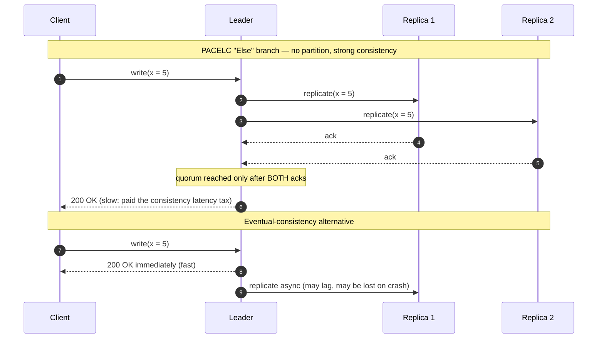

# Key Characteristics of Systems — Senior

<!-- level-focus -->
At senior level, focus on this question:

> Which system invariant is affected by **Key Characteristics of Systems** under failure, load, and change?

Use the smallest realistic scenario that exposes the decision and its failure behavior.
As a system owner, you do not "have" availability, latency, or scalability — you
**budget** them. Every characteristic is a dial wired to every other dial and to
the company's cash. The junior question is "is the system fast?" The senior
question is "what is our p99 latency objective, what does the next 9 of
availability cost us in dollars and engineering-weeks, and which characteristic
am I deliberately sacrificing to buy it?"

This document treats the key characteristics not as a checklist but as a system
of **coupled constraints**. You will set Service Level Objectives (SLOs) and
error budgets, navigate the fundamental tensions (CAP/PACELC, availability vs
cost, scalability vs simplicity), design for the next 10x without over-building
today, and learn how a single neglected characteristic — usually observability —
silently caps every other one.

## 1. The Senior's Mental Model: Characteristics as a Budget

A junior engineer optimizes the characteristic in front of them. A senior owner
accepts that **the characteristics are conserved quantities traded against a
finite budget of money, complexity, and engineering time.** You cannot maximize
all of them; you can only choose which ones matter for *this* system at *this*
stage, set numeric targets, and spend deliberately against the rest.

Three properties define the senior view:

- **Everything is numeric.** "Highly available" is not a design goal; "99.95%
  monthly availability measured as the fraction of successful requests at the
  load balancer" is. If you cannot write it as a number with a measurement
  method, you cannot own it, alert on it, or trade against it.
- **Every gain is paid for.** Adding a read replica buys read scalability and
  pays in replication lag (a consistency cost) and instance dollars. Adding a
  cache buys latency and pays in staleness and an invalidation bug surface.
- **The binding constraint moves.** Today your bottleneck is the single-writer
  database. After you shard it, the bottleneck becomes cross-shard fan-out
  latency. Design decisions should make the *next* bottleneck cheap to address,
  not eliminate a bottleneck you do not yet have.

The job is portfolio management, not optimization. You hold a basket of
characteristics, you know the current price of moving each one, and you rebalance
as the business changes.

## 2. The Full Characteristic Set a Senior Tracks

Mid-level engineers track the famous four — availability, latency, scalability,
consistency. A senior owner tracks at least these, each with an owner, a metric,
and an SLO:

| Characteristic    | What it measures                                  | Primary metric                          | Typical failure mode if neglected            |
|-------------------|---------------------------------------------------|-----------------------------------------|----------------------------------------------|
| Availability      | Fraction of time/requests served successfully     | Success rate (good ÷ valid requests)    | Outages, missed SLA penalties                |
| Latency           | How long a single request takes                   | p50 / p95 / p99 / p999                   | Slow UX, timeouts cascading into errors      |
| Tail latency      | Worst-case experienced latency                    | p99.9, max, slow-request rate           | "Fast on average, terrible for VIP users"    |
| Throughput        | Work per unit time at fixed latency               | requests/sec, MB/s sustained            | Queues back up, latency collapses under load |
| Scalability       | Cost-to-grow-capacity slope                       | $ per additional unit of load           | Re-architecture under fire, growth ceiling   |
| Consistency       | How current/agreed reads are                      | Staleness window, anomaly rate          | Double-spends, lost writes, support tickets  |
| Durability        | Probability data survives                         | Annual durability (e.g. 11 nines)       | Permanent data loss, unrecoverable state     |
| Reliability       | Correct behavior over time                        | MTBF, error budget burn                  | Intermittent corruption, flaky behavior      |
| Security          | Resistance to misuse and breach                   | Vuln SLA, blast radius, time-to-patch   | Breach, data exfiltration, compliance fines  |
| Observability     | Ability to ask new questions of the running system| MTTD, MTTR, % incidents explained       | Long outages, "we don't know why" postmortems|
| Cost-efficiency   | Useful work per dollar                            | $ per request, $ per active user, unit margin | Burning runway, negative unit economics |
| Maintainability   | Cost to change the system safely                  | Lead time, change-failure rate          | Velocity collapse, fear of deploys           |

Durability and availability are routinely confused and must be separated: a
system can be **available but not durable** (it serves requests but loses your
write on the next crash) or **durable but not available** (your data is safe on
replicated disks but the service is down). S3 advertises 99.999999999%
(eleven-nines) durability and 99.99% availability — eight orders of magnitude
apart by design, because losing data is catastrophic and being briefly
unreachable is merely expensive.

## 3. Setting SLOs and Error Budgets

An SLO is a target value for a Service Level Indicator (SLI), the actual measured
metric. The **error budget** is `1 − SLO`: the amount of failure you are
explicitly allowed to spend.

The error budget is the single most important governance tool a senior owns. It
converts "should we ship this risky feature?" from a political argument into an
arithmetic one. If the budget is healthy, you ship and move fast. If it is
exhausted, you freeze features and spend the next sprint on reliability. The
budget makes reliability and velocity *trade against each other on a shared
ledger* instead of fighting in meetings.

**The availability budget in absolute time** is the number that makes targets
feel real. For a 30-day month (43,200 minutes):

| Monthly SLO | "Nines"   | Allowed downtime / month | Allowed downtime / year |
|-------------|-----------|--------------------------|-------------------------|
| 99%         | two nines | 7 h 18 m                 | 3.65 days               |
| 99.9%       | three nines | 43.8 min               | 8.77 hours              |
| 99.95%      | —         | 21.9 min                 | 4.38 hours              |
| 99.99%      | four nines | 4.38 min                | 52.6 min                |
| 99.999%     | five nines | 26.3 sec                 | 5.26 min                |

The jump from three to five nines is roughly a 100x reduction in tolerable
downtime — and each nine typically costs *more* than the previous one, because
you are now fighting rarer and more correlated failure modes (a single bad deploy
can blow a five-nines budget for the entire quarter).

**Rules a senior follows when setting SLOs:**

- **SLO < 100%, always.** A 100% target means zero tolerance for the planned
  maintenance, dependency blips, and risky-but-valuable deploys that real systems
  need. It is unachievable and it removes your budget to ship.
- **Set the SLO just above what users actually need**, not at the technical
  ceiling. If users cannot perceive the difference between 99.9% and 99.99%, the
  extra nine is pure cost with no value.
- **Measure at the boundary the user experiences** — the load balancer or API
  gateway, not deep internal services. A 99.99% backend behind a flaky edge is a
  99.5% product.
- **Tie alerting to budget burn rate, not raw thresholds.** Page when you are on
  track to exhaust the monthly budget in hours; ticket (don't page) for slow
  burns. This is what kills alert fatigue.

A latency SLO needs a percentile *and* a threshold: "95% of `GET /cart` requests
complete in under 200 ms, measured at the edge, over a 28-day rolling window."
Never use the average — see §9.

## 4. SLO Walkthrough: An End-to-End Worked Example

Take a checkout service for an e-commerce site. Here is how a senior derives the
SLOs rather than guessing them.

**Step 1 — Start from the business consequence.** Product data shows that
checkout downtime costs ~$12,000/minute in lost orders during peak. Customer
research shows conversion drops measurably once the "Place Order" button takes
over 1 second to respond. These two facts anchor everything.

**Step 2 — Pick the SLI precisely.**
- Availability SLI = `count(checkout requests with HTTP < 500) ÷ count(valid checkout requests)`, measured at the API gateway.
- Latency SLI = server-side duration of `POST /checkout`, measured at the gateway, excluding client network time.

**Step 3 — Set the SLO from need, then sanity-check the cost.** Users tolerate
brief blips but not lost orders. We pick **99.95% availability** (21.9 min/month
budget) and **p99 latency < 1.0 s, p50 < 250 ms**. We deliberately do *not* pick
99.99% because closing that gap requires multi-region active-active writes, which
for a single-region database means a re-architecture costing an estimated two
engineer-quarters — not justified against the marginal downtime saved.

**Step 4 — Compute the error budget.** 99.95% over 30 days = **21.9 minutes** of
allowed failure, or about 0.05% of requests. If checkout does 2M requests/day,
the budget is roughly **30,000 failed requests/month**.

**Step 5 — Decide the budget policy.** While budget remains: feature teams ship
freely. When 75% is burned: deploys require a reliability review. When exhausted:
hard feature freeze until the next window, all hands on reliability. This is
agreed *with product in advance*, in writing, so it is not negotiated mid-crisis.

**Step 6 — Wire the alerts to burn rate.**

The output of the walkthrough is not a dashboard — it is a *contract* between
engineering and product, expressed in numbers, that decides automatically what
the team works on next.

## 5. The Fundamental Tensions

These are the conflicts that no clever engineering removes. You can only choose a
point on each curve.

**Consistency vs Availability vs Latency.** During a network partition you must
choose: refuse some requests to keep data consistent (CP), or serve possibly
stale/conflicting data to stay available (AP). Even with no partition, stronger
consistency means coordinating across replicas, which adds latency. This is the
PACELC refinement of CAP (§6).

**Availability vs Cost.** Each additional nine roughly multiplies infrastructure
and operational cost: redundant zones, then regions, then active-active writes,
plus the on-call and tooling to run them. The curve is convex — the last nine
costs far more than the first.

**Scalability vs Simplicity.** A single Postgres instance is trivially
consistent, debuggable, and cheap to operate — and has a hard ceiling. Sharding,
read replicas, eventual-consistency caches, and queues raise the ceiling but
multiply the number of failure modes, the difficulty of reasoning about
correctness, and the on-call surface. Premature distribution buys a scaling
headroom you don't need with a complexity tax you pay every single day.

**Latency vs Throughput.** Batching and queuing raise throughput (more work per
machine) while raising per-request latency (your request waits in line). Tuning
for one quietly degrades the other.

**Security vs Latency/Usability.** Encryption, token validation on every hop,
mTLS, and rate-limit checks each add milliseconds and friction. Defense in depth
is real cost paid on the hot path.

The senior skill is not resolving these tensions — it is *naming the point you've
chosen on each curve and writing down why*.

## 6. CAP and PACELC: The Latency Tax Nobody Mentions

CAP says: under a network **P**artition, choose **C**onsistency or
**A**vailability. It is true but incomplete, because partitions are rare and CAP
says nothing about the system's behavior the other 99.9% of the time.

**PACELC** completes it: **if Partition, then choose A or C; Else (normal
operation), choose Latency or Consistency.** This is the more useful framing for
daily design, because the "Else" branch is where you live almost always. Strong
consistency requires a write to be acknowledged by a quorum of replicas before it
returns — that round-trip is a permanent latency tax you pay on every write, not
only during partitions.

| System         | PACELC class | Partition choice | Normal-op choice | What you're buying                |
|----------------|--------------|------------------|------------------|-----------------------------------|
| DynamoDB (default) | PA/EL    | Availability     | Latency          | Always-on, fast, eventually consistent |
| Cassandra      | PA/EL        | Availability     | Latency          | High write throughput, tunable    |
| MongoDB        | PA/EC        | Availability     | Consistency      | Available under partition, consistent reads normally |
| HBase / BigTable | PC/EC      | Consistency      | Consistency      | Strong consistency, pays latency always |
| Spanner        | PC/EC        | Consistency      | Consistency      | Global strong consistency via TrueTime, pays commit-wait latency |

The takeaway for an owner: choosing a "strongly consistent" database is not a
free correctness upgrade. It is a standing latency bill on your write path,
charged whether or not a partition ever happens.

## 7. The Tension Table

This is the table to internalize. Each row is a lever a senior can pull, what it
buys, and what it silently degrades.

| You improve →     | …by doing                          | …which buys                    | …and degrades                          | Quantified example |
|-------------------|-------------------------------------|--------------------------------|----------------------------------------|--------------------|
| Availability      | Multi-region active-active          | Survives a region loss         | Cost (~2x infra), consistency, complexity | 99.95% → 99.99% may 2–3x infra spend |
| Latency (reads)   | Add cache / read replica            | p99 reads drop sharply         | Consistency (staleness window)         | 120 ms → 8 ms reads, but up to 5 s stale |
| Consistency       | Quorum / synchronous replication    | No stale or lost writes        | Write latency, availability under partition | +15–40 ms per write per extra replica RTT |
| Throughput        | Batch writes, async queues          | 5–10x more req/s per node      | Per-request latency, freshness         | 1k→8k rps, but +200 ms tail per request |
| Scalability       | Shard the database                  | Near-linear capacity growth    | Simplicity, cross-shard query latency  | Joins now need scatter-gather, +50 ms |
| Durability        | Synchronous multi-AZ + fsync        | Survives node/disk loss        | Write latency, cost                    | +several ms fsync; 2–3x storage cost |
| Security          | mTLS + token check every hop        | Smaller breach blast radius    | Latency, dev velocity                  | +1–5 ms/hop, slower onboarding |
| Cost-efficiency   | Spot instances, aggressive autoscale| 30–70% infra savings           | Availability (preemptions), tail latency | save 40%, but cold-start tail spikes |
| Observability     | Trace + high-cardinality metrics    | MTTR drops, faster RCA         | Cost (telemetry can be 10–30% of bill), some latency | MTTR 4h→20m, but $$ in storage |

Read the table as a graph: pulling any lever sends force down a coupled edge. The
senior's value is knowing *which edge*, *how hard*, and *whether the business
cares about the thing on the other end*.

## 8. Worked Trade-off: Improving One Characteristic Degrades Another

A concrete scenario — the kind that fills a real design review.

**Context.** A social feed service serves the user's home timeline. Current p99
read latency is **140 ms**, sourced live from a strongly-consistent primary
database. Product wants p99 under **30 ms** to make the feed feel instant.
Engineering proposes a Redis cache in front of the timeline query.

**The improvement.** Caching assembled timelines gives a 95%+ hit rate and drops
p99 reads to **~9 ms** — a clean win on the latency characteristic, comfortably
beating the 30 ms target.

**The degradation.** The cache introduces a staleness window. With a 30-second
TTL, a user who posts may not see their own post in their feed for up to 30
seconds, and a user who blocks someone may still see that person's content
briefly. This is a **consistency regression** caused entirely by the latency
improvement. It also adds a new failure mode (a cache stampede on cold start can
overload the primary) and ongoing cost (Redis cluster + the invalidation code's
bug surface).

**The senior's explicit trade-off.** Rather than accept blanket staleness, the
senior segments the requirement:

1. **Read-your-own-writes** is non-negotiable (users perceive "my post vanished"
   as a bug). So writes from a user bypass the cache for *that user's* next read
   for a few seconds, using a short per-user write marker — preserving the
   subjective consistency that users notice.
2. **Other people's content** can be up to 30 s stale; nobody perceives a
   30-second delay in a stranger's post. The TTL stays at 30 s here.
3. **Safety-critical state** (a block taking effect) is *not* cached at all — its
   correctness outweighs its latency.

The result: p99 latency target met, the one consistency guarantee users actually
perceive is preserved, and the consistency that no user can perceive is spent to
pay for the latency. The trade-off is **explicit, segmented, and documented**,
not a silent global TTL that someone discovers in a postmortem.

The deliverable of this exercise is the sentence a senior can say out loud in the
review: *"We are buying a 130 ms latency reduction by spending up to 30 seconds of
staleness on content nobody perceives as stale, while explicitly preserving
read-your-own-writes and never caching safety state."* That sentence is the job.

## 9. Tail Latency: The Characteristic That Hides in the Average

The average latency is the most dangerous number on a dashboard because it
**conceals the experience of your most important users.** Averages are dominated
by the fast majority; the slow tail is where churn, timeouts, and angry VIP
customers live.

Two systems can have identical 50 ms averages while one has a p99 of 70 ms and
the other a p99 of 2,000 ms. The product feels completely different. Always
specify SLOs as percentiles.

**Tail latency amplifies with fan-out.** This is the property seniors must
internalize. If a single backend call has a 1% chance of exceeding 1 second, and
a request fans out to **100** such backends and must wait for all of them, the
probability that *at least one* is slow is `1 − 0.99^100 ≈ 63%`. A rare
per-component slowness becomes the *common case* at the request level.

| Per-backend p99 slow probability | Backends fanned out | P(request hits ≥1 slow backend) |
|----------------------------------|---------------------|---------------------------------|
| 1% (p99 = 1s)                    | 1                   | 1%                              |
| 1%                               | 10                  | 9.6%                            |
| 1%                               | 50                  | 39.5%                           |
| 1%                               | 100                 | 63.4%                           |
| 0.1% (p999 = 1s)                 | 100                 | 9.5%                            |

The lesson: at scale, the relevant target is not p99 but **p99.9 of the component**,
because fan-out promotes the component's tail into the request's body.
Mitigations a senior reaches for — hedged requests (send a duplicate after a
short delay, take the first to return), request timeouts with retries, tail-tolerant
load balancing, and reducing fan-out width — are all tail-specific tools that do
nothing for the average.

## 10. How a Weak Characteristic Silently Caps All the Others

The deepest senior insight: **a system's characteristics are limited by the
weakest one you cannot measure.** A neglected characteristic does not announce
itself; it quietly lowers the ceiling on every other one.

**Observability is the canonical example.** Suppose your architecture is
theoretically capable of 99.99% availability, sub-10 ms tail latency, and clean
horizontal scaling. Now suppose you cannot trace a request across services, your
metrics are low-cardinality, and your logs are unsearchable. What actually
happens:

- **Availability is capped by MTTR, not MTBF.** Availability ≈ MTBF / (MTBF +
  MTTR). You can build a system that rarely breaks, but if every incident takes 4
  hours to *understand* because you're blind, your real-world availability is
  governed by recovery time. Poor observability turns a 5-minute fix into a
  4-hour outage and silently converts your 99.99% design into a 99.5% product.
- **Latency improvements stall.** You cannot optimize a tail you cannot see. Without
  per-percentile, per-endpoint, per-dependency latency data, "make it faster"
  becomes guesswork, and regressions ship undetected.
- **Scalability becomes a guess.** Without knowing *where* time and resources go
  under load, you scale blindly — over-provisioning (cost) or hitting an
  unforeseen bottleneck under traffic (outage).
- **Cost-efficiency is unknowable.** You cannot improve unit economics you cannot
  attribute. Which endpoint, tenant, or feature burns the money? Without it, every
  cost decision is a shot in the dark.

This is why observability is the highest-leverage early investment in a system's
life: it is the characteristic that *unblocks improvement of every other
characteristic.* A senior treats "we can ask new questions of production in
minutes, with traces, high-cardinality metrics, and structured logs" as a
prerequisite, not a nice-to-have. The same caps-everything dynamic applies, more
slowly, to **security** (one breach can zero out years of availability
reputation), **durability** (one data-loss event ends the company), and
**maintainability** (a system nobody can safely change cannot improve any
characteristic at all).

The rule: **find the characteristic you are not measuring, because that is the
one secretly setting your ceiling.**

## 11. Designing for the Next 10x Without Over-Building Today

The trap on both sides is real. Build for today only, and you re-architect under
fire when traffic 10x's. Build for 1000x today, and you pay a complexity and cost
tax for capacity you may never need — and slow yourself so much that you never
reach the scale you over-designed for.

The senior heuristic: **design so the next 10x is a known, bounded project — not
a rewrite — but do not implement it until the load is in sight.**

Concretely, the discipline is to *preserve optionality cheaply*:

- **Keep services stateless** so horizontal scaling later is "add instances," not
  "untangle in-memory state." This costs almost nothing today and removes the
  hardest scaling refactor.
- **Hide data access behind an interface** (a repository, a data-access layer) so
  that introducing sharding, read replicas, or a different store later changes one
  module, not the whole codebase. Cheap insurance.
- **Choose a shard key conceptually now, even if you run one database.** You don't
  have to shard today; you have to ensure that *when* you do, your access patterns
  already align with a clean partition key. Discovering your data has no good shard
  key at 10x is the expensive surprise.
- **Make the architecture decompose-able** along obvious seams (by domain), so the
  natural next step is "extract this hot module into its own service," not "rewrite
  the monolith."

What you should *not* do prematurely: stand up Kafka for 100 events/day, shard a
database holding 10 GB, or run multi-region active-active for a product with no
users. Each of these is a permanent operational tax — extra failure modes, extra
on-call burden, extra cost — paid daily for a scale you don't have.

**The test:** for each scaling decision, ask *"is this a one-way door?"* If
adding it later is a bounded, well-understood project (read replicas, more
instances, a cache), defer it — buy nothing today. If *not* adding it now makes
it nearly impossible later (a primary key with no shardable structure, a
stateful core, a schema with no tenant boundary), pay the small cost now to keep
the door open. Spend complexity only on the irreversible decisions.

## 12. Cost-Efficiency as a First-Class Characteristic

Cost is a characteristic with an SLO, not an afterthought. The metric is **unit
cost**: dollars per request, per active user, per transaction — whatever maps to
how the business makes money. A system with great availability and latency but
negative unit margins is a system that scales the company into bankruptcy.

A senior owns a small set of cost numbers:

- **Cost per request / per active user**, trended over time. If it rises as you
  grow, your architecture has a diseconomy of scale — find it before finance does.
- **Cost attribution** by service, endpoint, and tenant. You cannot optimize what
  you cannot attribute (and this requires observability — see §10).
- **The cost of each nine.** Knowing that pushing availability from 99.95% to
  99.99% costs an estimated $X/month and Y engineer-weeks is what lets you tell
  product "that nine isn't worth it" with authority.

The non-obvious move is that cost-efficiency *trades against availability and
tail latency*, and a senior makes that trade consciously: spot/preemptible
instances cut compute cost 50–70% but introduce preemption-driven availability
and tail-latency risk; aggressive scale-to-zero saves money but adds cold-start
latency to the first requests after idle. These are fine trades for a batch
pipeline and terrible ones for a checkout path. The characteristic table (§7)
tells you which edge you're pulling.

## 13. Decision Record: How a Senior Documents the Trade-off

Trade-offs that aren't written down get re-litigated, forgotten, and reversed by
the next engineer who doesn't know why. The senior artifact is a short,
numeric decision record. Using the §8 caching trade-off as the example:

> **Decision:** Introduce a Redis timeline cache with segmented consistency.
>
> **Characteristic improved:** Read latency — p99 140 ms → target <30 ms (achieved ~9 ms).
>
> **Characteristic traded:** Consistency — up to 30 s staleness on third-party content.
>
> **Guardrails preserved:** Read-your-own-writes (per-user write marker bypasses
> cache for ~5 s); safety state (blocks) never cached.
>
> **Cost:** +1 Redis cluster (~$X/mo) and invalidation-logic maintenance burden.
>
> **New failure modes:** Cache stampede on cold start — mitigated with request
> coalescing and a jittered TTL.
>
> **SLO impact:** Latency SLO now p99 < 30 ms; staleness SLO ≤ 30 s for
> non-author content; read-your-own-writes correctness = 100%.
>
> **Revisit when:** hit rate < 90%, staleness complaints > N/week, or primary
> read load returns to its pre-cache level.

This record does four things a verbal decision cannot: it states the trade in
numbers, it names what was *deliberately sacrificed*, it lists the new failure
modes the change introduced, and it sets a condition for revisiting. That is the
difference between a senior's trade-off and an accident.

## 14. Senior Checklist and Anti-Patterns

**The owner's checklist:**

- [ ] Every key characteristic has a **numeric SLO** with a defined SLI and
      measurement point (at the user boundary).
- [ ] Availability and latency SLOs have **error budgets** with an agreed,
      written **budget policy** (what happens at 75% / 100% burn).
- [ ] Alerts fire on **burn rate**, not raw thresholds.
- [ ] Latency is tracked as **percentiles (p99, p99.9)**, never the average, with
      explicit attention to **fan-out amplification**.
- [ ] **Durability** is specified separately from availability.
- [ ] **Observability** is treated as the unblocking characteristic — traces,
      high-cardinality metrics, structured logs exist *before* you need them.
- [ ] **Unit cost** ($/request, $/user) is tracked and attributable.
- [ ] The PACELC class of each datastore is **chosen, not inherited** — you know
      what latency tax strong consistency is charging you.
- [ ] Scaling decisions are filtered by the **one-way-door test**; only
      irreversible options get pre-built.
- [ ] Every significant trade-off has a **written decision record** naming what
      was sacrificed and when to revisit.

**Anti-patterns that mark a non-senior owner:**

- **"Make it highly available / fast / scalable"** with no number. Unmeasurable,
  un-ownable, un-tradeable.
- **Targeting 100% availability.** Removes your error budget and your ability to ship.
- **Optimizing the average latency.** Hides the tail where your worst experiences live.
- **Treating consistency as a free upgrade.** It's a standing latency bill (PACELC "Else").
- **Conflating durability and availability.** They are eight orders of magnitude apart for a reason.
- **Premature distribution** — Kafka, sharding, multi-region — for scale you don't
  have, paying daily complexity for hypothetical headroom.
- **Neglecting observability** and then wondering why every other characteristic
  underperforms its design ceiling.
- **Making trade-offs verbally**, so they're invisible, un-revisited, and reversed
  by the next person.

The throughline of senior-level system ownership: you do not eliminate the
tensions between characteristics — you *price* them, *budget* them, *trade* them
explicitly, and *write down* the trades. The characteristics are coupled
constraints on a shared budget, and your job is conscious, quantified
rebalancing as the business changes.

---

*Next step:* [Professional level](professional.md)

---

## Apply it

1. State the system invariant that **Key Characteristics of Systems** must protect.
2. Mark ownership, state, and failure propagation at each boundary.
3. Compare two designs under load, dependency failure, and future change.
4. Define recovery and compatibility behavior before implementation.
5. Test the riskiest assumption with a focused experiment.

## Verify your work

- The experiment supports the design with evidence, not preference.
- Failure injection shows the blast radius and recovery path.
- Compatibility checks cover old and new callers or data.
- Operational signals reveal invariant violations and recovery progress.

## Review questions

- Which invariant must remain true when Key Characteristics of Systems fails?
- Where should recovery responsibility live, and why?
- Which assumption deserves an experiment before implementation?
- How can the design evolve without changing every consumer at once?
