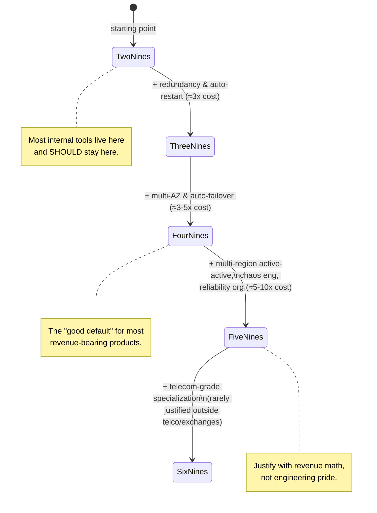
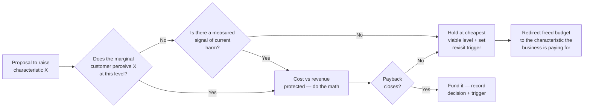

# Key Characteristics of Systems — Staff / Principal Level

At junior and senior levels, "key characteristics" is a vocabulary problem: learn
what availability, consistency, latency, throughput, durability, scalability,
maintainability, and cost mean, and how the textbook trade-offs work. At the staff
and principal level the problem inverts. You already know the menu. The job is now
*portfolio allocation under a fixed budget*: deciding which characteristics this
specific business will pay for, which it will deliberately under-resource, and how
to defend both decisions to a product VP and a CFO who do not care about CAP.

This document is about that judgment. It is not more theory. It is the
organizational and economic logic that decides where engineering effort goes —
and, just as importantly, where it should *not* go. The most expensive mistakes
staff engineers make are not under-building the characteristic that mattered; they
are silently over-building one that didn't, and burning eighteen months no one ever
got back.

---

## Table of Contents

1. [The framing: characteristics are a budget, not a checklist](#1-the-framing-characteristics-are-a-budget-not-a-checklist)
2. [Matching the characteristic profile to the business](#2-matching-the-characteristic-profile-to-the-business)
3. [Business-type → characteristic-priority profiles (the table)](#3-business-type--characteristic-priority-profiles-the-table)
4. [The cost of a nine](#4-the-cost-of-a-nine)
5. [Maintainability and operability as compounding leverage](#5-maintainability-and-operability-as-compounding-leverage)
6. [Trade-offs are business decisions, not engineering decisions](#6-trade-offs-are-business-decisions-not-engineering-decisions)
7. [Premature optimization of a single characteristic](#7-premature-optimization-of-a-single-characteristic)
8. [Worked example: deliberately choosing a lower target to fund something else](#8-worked-example-deliberately-choosing-a-lower-target-to-fund-something-else)
9. [The decision lifecycle: how a target gets set, revisited, and retired](#9-the-decision-lifecycle-how-a-target-gets-set-revisited-and-retired)
10. [Anti-patterns and how to spot them early](#10-anti-patterns-and-how-to-spot-them-early)
11. [Staff-level operating principles](#11-staff-level-operating-principles)
12. [Next step](#next-step)

---

## 1. The framing: characteristics are a budget, not a checklist

Every system has a finite supply of three things: engineering-hours, money, and
calendar time. Each unit of any characteristic — every additional nine of
availability, every millisecond of p99 latency you shave, every degree of
consistency you strengthen — is *purchased* with some combination of those three.
The supply is fixed in any given planning horizon. Therefore raising one
characteristic almost always lowers your ability to raise another, or to ship
features at all.

Junior framing: "We want the system to be highly available, consistent, fast,
durable, scalable, and cheap." Every one of those is individually defensible, which
is exactly why the sentence is useless. It describes a system no organization has
ever built, because the budget to build it does not exist.

Staff framing: "Of our finite budget, we will spend the largest slice on X because
it is where the business dies if we are wrong; we will buy a deliberately modest
amount of Y because the marginal customer does not perceive it; and we will accept Z
at the cheapest viable level and revisit only when a named, measured signal tells us
to." That sentence is a strategy. It can be wrong, which means it can be reasoned
about, funded, and audited.

The shift you are making is from *additive* thinking (what should we add?) to
*allocative* thinking (given that we cannot have it all, what do we starve?). The
rest of this document is tools for doing the allocation honestly.

A useful mental model: treat the characteristics as a fixed-area pie. You are not
choosing how big each slice is in absolute terms; you are choosing how to cut a pie
whose total size is set by headcount and runway. Anyone who proposes enlarging one
slice owes you an answer to "out of which other slice?"

---

## 2. Matching the characteristic profile to the business

There is no universal ranking of characteristics. There is only a ranking *for this
business, at this stage, given how it makes money and how it dies.* The single most
valuable habit at staff level is to derive the ranking from two questions:

1. **What is the failure that kills the company?** Not the failure that pages you —
   the one that loses the customer permanently, triggers a regulator, or ends the
   funding round. The characteristic that prevents *that* failure is your top
   priority, and it is usually obvious once you ask the question this bluntly.

2. **What does the marginal customer actually perceive?** Customers do not perceive
   architecture. They perceive whether the thing worked, whether it was fast enough
   to not annoy them, and whether it cost them money or trust. A characteristic the
   marginal customer cannot perceive is a candidate for under-investment regardless
   of how elegant it would be to maximize.

Run those two questions against three archetypes and the divergence is stark.

**A retail bank.** The company-killing failure is moving money incorrectly: a double
debit, a lost deposit, a balance that disagrees with itself. That is a *consistency
and durability* failure, and it is also a *regulatory* failure that can revoke the
license. Availability matters, but a bank that is down for two hours apologizes; a
bank that loses your balance is finished. So the profile is: durability and
correctness first, then availability, with latency a distant concern — nobody
abandons a bank because a transfer took 900 ms instead of 200 ms.

**A photo-sharing consumer startup.** The company-killing failure is *irrelevance* —
users who find the app slow, janky, or boring and never come back. That is a
*latency, availability, and feature-velocity* story. Strong consistency is mostly
unnecessary: if your like-count is eventually consistent and off by three for two
seconds, no one cares and no one is harmed. Durability matters for the originals
users uploaded (losing someone's photos is a betrayal), but the social graph and
counters can be reconstructed or approximated. The profile is: latency and velocity
first, durability-of-user-content second, strict consistency near the bottom.

**An ad-tech bidding pipeline.** The company-killing failure is *missing the
auction*. A real-time bidder has a hard ~100 ms budget to respond or it does not
participate, and a non-response is simply lost revenue, billions of times a day. That
is *latency and throughput* as an existential characteristic. Consistency is
explicitly traded away — slightly stale budget data that occasionally overspends by a
fraction of a percent is *cheaper than the latency it would cost to be exact*. The
profile is: latency and throughput first, cost-efficiency second (margins are thin and
volume is enormous), strong consistency deliberately sacrificed.

Same engineering toolkit, three opposite allocations. None of the three could adopt
another's profile without going out of business. That is the whole point: the profile
is downstream of the business model, and a staff engineer who imports a profile from
their last job — "at my last company we did five-nines and strong consistency
everywhere" — is making a category error.

---

## 3. Business-type → characteristic-priority profiles (the table)

The table below ranks each characteristic per business type on a simple scale:
**Critical** (company dies without it), **High** (real competitive harm),
**Moderate** (worth steady investment), **Low** (cheapest viable level), and
**Sacrificed** (deliberately traded away to fund something else). The "Sacrificed"
column is the one most teams refuse to fill in — and the refusal is the bug.

| Characteristic        | Retail bank | Photo-share startup | Ad-tech bidder | Healthcare EHR | Internal tooling |
|-----------------------|-------------|---------------------|----------------|----------------|------------------|
| Correctness / consistency | Critical    | Low (eventual ok)   | Sacrificed     | Critical       | Moderate         |
| Durability            | Critical    | High (user content) | Low            | Critical       | Low              |
| Availability          | High        | High                | High           | High           | Low              |
| Latency (p99)         | Low         | Critical            | Critical       | Moderate       | Low              |
| Throughput            | Moderate    | High                | Critical       | Moderate       | Low              |
| Scalability (elastic) | Moderate    | Critical            | Critical       | Low            | Low              |
| Security / privacy    | Critical    | High                | Moderate       | Critical       | Moderate         |
| Cost-efficiency       | Moderate    | Moderate            | Critical       | Moderate       | High             |
| Maintainability       | High        | High                | High           | High           | High             |
| Auditability          | Critical    | Low                 | Moderate       | Critical       | Low              |

Three things to notice, because they are the staff-level lessons hiding in the grid:

- **Maintainability is "High" in every column.** It is the one characteristic that
  is rarely a candidate for sacrifice, because it is the multiplier on your ability
  to adjust every *other* characteristic later. Section 5 is entirely about why.

- **Every column has at least one "Low" or "Sacrificed" entry.** A profile with no
  sacrifices is not a profile; it is a wish list, and it means the team has not yet
  decided what kind of company it is.

- **"Internal tooling" is Low almost everywhere.** That is correct and it is the
  cheapest, highest-return decision on the page. The most common waste at large
  companies is internal tools built to external-product standards — five-nines
  dashboards used by forty people. Section 7 returns to this.

The table is a starting template, not gospel. The exercise that matters is *filling
one in for your actual system* and forcing every cell to be justified by the two
questions in Section 2. A cell you cannot justify is a cell you are guessing.

---

## 4. The cost of a nine

Availability is the cleanest place to make the economics of characteristics legible,
because uptime maps to a number everyone understands. Here is the standard ladder,
with the downtime each nine permits and — the part that matters — the rough shape of
the architecture required to *earn* it.

| Availability | Downtime / year | Downtime / month | Architecture typically required |
|--------------|-----------------|------------------|---------------------------------|
| 99%   (two nines)   | ~3.65 days   | ~7.2 hours  | Single server, manual recovery, backups |
| 99.9% (three nines) | ~8.77 hours  | ~43 min     | Redundant instances, health checks, automated restart |
| 99.99% (four nines) | ~52.6 min    | ~4.3 min    | Multi-AZ, automated failover, no single points of failure, load shedding |
| 99.999% (five nines)| ~5.26 min    | ~26 sec     | Multi-region active-active, automated everything, chaos-tested, zero-downtime deploys |
| 99.9999% (six nines)| ~31.5 sec    | ~2.6 sec    | Specialized hardware/protocols, telecom-grade, dedicated reliability org |

The naive reading is "each nine is a 10x reduction in downtime, so it must be roughly
10x better." The expensive reading — the correct one — is that **each additional nine
costs roughly 3x to 10x more engineering effort and operational spend than the one
below it, and the increments are not linear.** The jump from 99% to 99.9% is mostly
buying redundancy and basic automation; a competent team can do it in a quarter. The
jump from 99.99% to 99.999% is qualitatively different: it requires eliminating
*every* single point of failure including the human in the loop, multi-region data
replication with its own consistency tax, continuous failure injection, and usually a
dedicated reliability function whose salaries dwarf the infrastructure bill.

Where does the money actually go as you climb? The cost is dominated not by hardware
but by the *removal of human latency and judgment* from the failure path. At three
nines, a human can be paged and fix it inside the budget. At five nines, the entire
budget for the month is 26 seconds — no human can read a page, log in, and diagnose
in 26 seconds, so every recovery must be automated, which means every recovery path
must be *built, tested, and continuously verified*, which is where the 3–10x goes.



The staff-level question is never "how many nines can we achieve?" It is **"at what
nine does the marginal cost exceed the marginal value, for this system?"** And the
value side is concrete: the value of an additional nine is *the revenue or
obligation protected by the downtime it removes.* If your product earns $50M/year and
a complete outage costs roughly proportional revenue plus some churn, then moving
from 99.9% (8.8 hours down) to 99.99% (53 min down) removes ~8 hours of exposure —
worth on the order of $45–90k/year of direct revenue plus churn risk. If buying that
nine costs you two engineers for two quarters plus ongoing multi-region spend, the
math may or may not close. *Do the math.* The number of teams that have chased four
nines for a product whose own customers tolerate two is not small.

A second subtlety: **your availability is capped by your dependencies.** If your
service calls three downstream services that are each independently 99.9% available
and you need all of them, your theoretical ceiling is roughly 0.999³ ≈ 99.7%. You
cannot buy a nine you do not control. Chasing four nines while sitting on three-nine
dependencies is not just wasteful — it is *impossible*, and recognizing that early
saves a quarter of doomed effort. The same logic applies in reverse: graceful
degradation (serving stale or partial results when a dependency is down) can *raise*
your effective availability above the naive product, which is often far cheaper than
making every dependency more reliable.

---

## 5. Maintainability and operability as compounding leverage

Maintainability is the strangest characteristic because the business never asks for
it directly. No customer files a ticket saying "your code is hard to change." No CFO
budgets for "operability." And yet it is "High" in every column of the Section 3
table, because of one property the others lack: **maintainability is the rate at
which you can adjust every other characteristic.**

Think of the other characteristics as positions and maintainability as your *velocity
through the space of positions.* A system with high maintainability can move from
"weak consistency" to "strong consistency," or from three nines to four, in weeks. A
system with low maintainability — tangled coupling, no tests, undocumented operational
tribal knowledge, a deploy that takes a day and breaks unpredictably — cannot move at
all without a rewrite. Its characteristic profile is *frozen.* That is the real cost
of low maintainability: not slow feature delivery, but the loss of optionality across
every other axis.

This is why maintainability *compounds* while feature velocity *depletes.* Shipping a
feature is a one-time gain. Improving maintainability is a change to the *interest
rate* on all future work. A team that spends 20% of its capacity on the codebase's
changeability is not losing 20% of its features; it is buying down the cost of every
feature it will ship for the next three years. The trade is invisible quarter to
quarter and decisive over the life of the system. This is precisely why short-term
feature velocity so reliably wins the argument and so reliably loses the war: the
velocity gain is on this quarter's dashboard, and the maintainability debt comes due
on a quarter when the people who incurred it have moved on.

Operability is maintainability's runtime twin. A system you cannot observe, cannot
deploy safely, and cannot recover without a wizard is one whose availability and
latency targets are aspirational — you cannot hold a number you cannot see or
influence in production. Three concrete operability investments that pay for
themselves faster than almost anything else:

| Investment | Up-front cost | What it compounds into |
|------------|---------------|------------------------|
| Good observability (metrics, traces, structured logs, dashboards tied to SLOs) | Weeks | Every incident gets shorter; you can actually *defend* an availability number; you find regressions before customers do |
| Safe, fast, reversible deploys (CI/CD, canaries, one-click rollback) | A quarter | Deploy frequency rises, blast radius falls, MTTR drops — directly buys availability without buying a nine of redundancy |
| Runbooks + automated remediation for the top failure modes | Ongoing | Removes the human from the critical path on known failures — the literal mechanism by which you climb the nine ladder cheaply |

The staff move is to **frame maintainability and operability in the currency of the
characteristics the business already values.** Do not ask for "time to pay down tech
debt." Ask for "the deploy-safety work that takes our recovery time from 40 minutes
to 4, which is the cheapest available path to the availability number we already
committed to." Now it is a funded line item with a measurable return, not a
moral appeal that loses to the next feature.

---

## 6. Trade-offs are business decisions, not engineering decisions

The most common failure mode at the senior-to-staff transition is making
characteristic trade-offs *unilaterally, inside engineering, in technical language,
and then being surprised when the business overrides them or — worse — never learns
they were made.* A characteristic target is a business commitment with a price tag.
It belongs in a conversation with product and finance, framed in their terms.

Why this is not optional:

- **The value side of every trade lives outside engineering.** Engineering can
  estimate what a nine *costs* (effort, infra spend, opportunity cost). Only product
  and finance can estimate what it is *worth* (revenue protected, churn avoided,
  contractual penalties, regulatory exposure, brand). A trade-off decided with only
  the cost side visible is half-blind.

- **The opportunity cost is a portfolio decision.** "Two engineers for two quarters
  on a fourth nine" is also "two engineers *not* on the new revenue feature." That
  is a capital allocation question, and capital allocation is the executive's job, not
  the architect's. Your role is to make the trade *legible* — to put both options on
  the same axis so a non-engineer can choose.

- **Accountability has to be shared for the decision to stick.** A target that
  engineering sets alone, engineering owns alone — and gets blamed for alone when the
  business reality shifts. A target set *with* product and finance is a decision the
  organization made, which means it survives the next reorg and the next incident
  review.

The translation discipline that makes this work: every characteristic claim must be
expressible in money or risk. "We need strong consistency" → "an inconsistent balance
is a regulatory finding that risks the license; here is the expected cost." "We need
four nines" → "each hour of downtime costs ~$X in revenue and ~$Y in churn; the fourth
nine removes ~8 such hours a year and costs ~$Z to build and run; here is the net."
"We want sub-100ms p99" → "above 100 ms our bid-response rate drops and we lose the
auction; that is directly ~$X/day of revenue." When you can say it in their currency,
the conversation becomes a normal business decision and you stop being the person who
"wants nice things for engineering reasons."

```mermaid
sequenceDiagram
    autonumber
    participant Eng as Staff Engineer
    participant Prod as Product
    participant Fin as Finance
    Note over Eng,Fin: Setting the availability target for a new payments service
    Eng->>Prod: Here are 3 options: 99.9% / 99.99% / 99.999%, with what each enables
    Eng->>Fin: Cost of each: $X / $Y / $Z one-time + ongoing infra & headcount
    Prod->>Eng: What downtime does each permit, and what does an outage cost a merchant?
    Eng->>Prod: 8.8h / 53m / 5m per year; outage = failed payments + merchant churn
    Fin->>Prod: At our merchant LTV, the 4th nine pays back in ~14 months
    Note over Prod,Fin: 5th nine does NOT pay back — defer it
    Prod->>Eng: Commit to 99.99%; revisit the 5th nine at 10x scale
    Eng->>Eng: Record decision + trigger condition in an ADR
    Note over Eng,Fin: Decision is now shared, dated, and auditable
```

Notice what the diagram does *not* show: engineering deciding alone and announcing.
It shows engineering supplying the cost-and-capability menu, the business supplying
the value-and-risk side, and a *jointly owned* commitment with an explicit
revisit-trigger. That is the artifact you are trying to produce every time.

---

## 7. Premature optimization of a single characteristic

Donald Knuth's "premature optimization is the root of all evil" is usually quoted
about code. At staff scope it applies to *characteristics*, and the damage is measured
in years rather than microseconds. Premature optimization of a characteristic means
investing heavily in a characteristic before the business has any evidence it needs
that level — and the cost is not just the wasted effort, it is the *compounding drag*
of carrying a more complex system forever.

The canonical example is the one in the Section 3 table: **five-nines availability for
an internal tool.** Picture a team that builds an internal admin dashboard, used by
forty employees during business hours, and — out of habit, pride, or résumé-driven
design — gives it multi-region active-active deployment, automated failover, and a
chaos-testing harness. Every number on that list is impressive and every one is waste.
The tool's actual availability requirement is "works during the workday, and if it is
down for an hour someone refreshes after lunch." That is two nines, maybe three. The
gap between what was built and what was needed is *years* of engineering capacity,
spread across the initial build and — this is the part people forget — the entire
maintenance lifetime, because the multi-region complexity has to be patched, secured,
upgraded, and reasoned about *forever*, by people who will curse the original author.

The insidious quality of premature characteristic optimization is that each individual
decision looks responsible. "Shouldn't an important internal tool be reliable?" Yes —
to the level the tool needs, which is far below where engineering pride wants to take
it. The defense is a discipline of *evidence before investment*:

- **Demand a measured signal before raising a target.** You do not buy the next nine
  because you imagine you might need it. You buy it when monitoring shows you are
  breaching the current target *and* the breaches are causing measured harm. No
  signal, no spend. Set the cheap target first; let production tell you when it hurts.

- **Make the default the cheapest viable level, and force a justification to exceed
  it.** Reverse the burden of proof. The question is not "why shouldn't this be
  highly available?" It is "what specific, measured business need justifies spending
  beyond the cheapest level that works?" Most of the time there is no good answer, and
  that absence is the correct answer.

- **Separate "irreversible" from "reversible" characteristics.** Some characteristic
  decisions are genuinely hard to change later (data model, consistency model, sharding
  key) and deserve up-front care. Others (a nine of availability, a deploy pipeline,
  a cache layer) can be added when needed at roughly the same cost as building them
  early. *Optimize the irreversible ones early; defer the reversible ones until the
  data demands them.* Conflating the two — treating a reversible nine as if it were an
  irreversible schema choice — is how teams justify premature spend.

The non-availability versions are just as common and just as expensive: building a
sharding layer for a database that will fit on one node for three years; adopting
microservices and their full operational tax for a team of six and a product with no
load; introducing strong global consistency into a system whose users would never
perceive eventual consistency. In each case the characteristic is real and someday
might matter — but spending on "someday" out of "today's" fixed budget is borrowing
against a future that may never arrive, at a brutal interest rate.

---

## 8. Worked example: deliberately choosing a lower target to fund something else

Abstract principles convince no one. Here is a concrete, numbers-bearing decision of
the kind a staff engineer is actually paid to make and defend.

**Setting.** A Series-B SaaS company, ~$30M ARR, sells a B2B analytics product. The
core product is a dashboard that customers log into during their workday. There is
also a newer, separately-priced **real-time alerting** feature that pages customers
when a metric crosses a threshold — the differentiating thing the sales team is
selling against competitors. Engineering capacity for the next two quarters is, in
round numbers, eight engineers. The platform team has put forward a proposal to take
the *core dashboard* from its current 99.9% availability to 99.99%, citing "enterprise
customers expect four nines." The cost estimate: roughly **three engineers for two
quarters** to do multi-region, automated failover, and the operational hardening it
requires.

**The naive decision.** Approve it. Four nines sounds enterprise-grade, the platform
team is technically right that it's achievable, and "more reliable" is hard to argue
against in a room.

**The staff decision — do the math, then reallocate.** Walk the two questions from
Section 2 and the economics from Section 4:

- *What kills the company?* Not dashboard downtime. The dashboard is used during
  business hours; at 99.9% it is down ~8.8 hours/year, and the support data shows
  those minutes are mostly off-hours and mostly unnoticed. The thing that kills the
  company right now is *losing the competitive deals the real-time alerting feature is
  winning* — and that feature is currently flaky, with alert delivery latency that
  occasionally misses the customer's SLA, which sales reports is costing deals.

- *What does the marginal customer perceive?* Enterprise buyers are asking about
  alerting reliability in *sales calls*. No customer has ever churned or complained
  about the dashboard's third-vs-fourth nine. The perceived value is entirely on the
  alerting side.

- *Do the nine math.* Moving the dashboard from 99.9% to 99.99% removes ~8 hours of
  exposure a year. At this product's revenue and the off-hours timing of the
  outages, the protected value is small — low tens of thousands of dollars, much of
  it on minutes no customer is online for. Cost to buy it: three engineers, two
  quarters. The payback does not close, and it consumes nearly 40% of total capacity.

- *What does the alternative buy?* Redirecting those three engineers to the alerting
  pipeline — making delivery latency consistent, adding the delivery guarantees and
  observability the feature lacks — directly addresses the thing sales says is losing
  deals. The expected value is *new* enterprise revenue plus retention of at-risk
  accounts, an order of magnitude larger than the dashboard nine.

**The decision, stated as a portfolio move.** *Hold* the core dashboard at 99.9% —
explicitly, with the trigger condition "revisit if measured dashboard downtime begins
correlating with churn or breaches a contractual SLA." *Reallocate* the three engineers
to harden the real-time alerting feature, whose reliability characteristics the market
is actually paying for. This is not "we don't care about reliability." It is "we are
buying reliability *where the customer perceives it and pays for it*, and declining to
buy it where they don't."

**Why this is the harder and better call.** Choosing the *lower* target is socially
costly. The platform team's proposal was technically sound and saying no to it can
read as not caring about quality. The staff engineer's job is to absorb that social
cost by making the trade legible — to walk product and finance through the math above
so the decision is *theirs and shared*, recorded in an ADR with its revisit trigger,
and defensible in the next incident review. A year later, when the dashboard has a
99.9%-permitted outage, the answer is on file: "we deliberately held this at three
nines to fund alerting, here is the math, here is the revenue that decision generated,
and here is the trigger that would change it." That is what a defended trade-off looks
like, and it is the entire skill.

The general pattern this example instantiates:



---

## 9. The decision lifecycle: how a target gets set, revisited, and retired

A characteristic target is not a one-time decision; it is a *position you hold and
periodically re-underwrite.* The most disciplined teams treat each target as having a
lifecycle with explicit transitions, so that yesterday's correct call does not silently
become today's waste.

**Set.** A target is established with: the business rationale (which of the two
Section-2 questions it answers), the cost to achieve and maintain it, the value it
protects in business currency, and — critically — a **revisit trigger**: the specific,
measurable condition that should cause the team to reconsider. "Revisit if QPS exceeds
10x current," "revisit if downtime correlates with churn," "revisit if a contractual
SLA changes." A target without a trigger is a target no one will ever question, which
means it will outlive its justification.

**Hold.** While held, the target is *monitored against its own SLO.* You cannot hold a
number you do not measure. This is the operability dependency from Section 5: a target
you are not instrumenting is an aspiration, not a commitment, and you will discover its
breach from an angry customer rather than a dashboard.

**Revisit.** When a trigger fires — or on a scheduled cadence, e.g. annually — the
target goes back through the Section-6 process: re-run the cost-vs-value math with
*current* numbers and *current* business priorities. Often the answer is "still
correct, hold." Sometimes the business has grown into needing the next nine, and now
the math closes where it didn't before. Either way the decision is re-underwritten
with fresh evidence rather than carried by inertia.

**Retire / downgrade.** The rarest and most valuable transition: actively *lowering* a
target that the business has outgrown the *need* for, or that was set too high to begin
with. Decommissioning a multi-region setup for a feature that turned out not to need it
recovers ongoing cost and complexity. Teams almost never do this — targets are sticky
upward and never ratchet down — which is exactly why a staff engineer who institutes
"downgrade reviews" finds enormous, invisible savings sitting in over-provisioned
characteristics no one has questioned in three years.

---

## 10. Anti-patterns and how to spot them early

| Anti-pattern | What it looks like | Early signal | The staff correction |
|--------------|--------------------|--------------|----------------------|
| **Wish-list profile** | Every characteristic is "high priority" | No "Low" or "Sacrificed" entries anywhere | Force a sacrifice; an org that won't choose hasn't decided what it is |
| **Imported profile** | "At my last company we did X everywhere" | Targets unchanged across very different business models | Re-derive from *this* business's failure mode and customer perception |
| **Résumé-driven nines** | Internal tool with five-nines architecture | Complexity vastly exceeds user count / revenue | Default to cheapest viable; require measured justification to exceed |
| **Engineering-only trade-off** | Targets set in tech terms, never seen by product/finance | No ADR, no business-currency framing | Translate to money/risk; make the decision joint and recorded |
| **Frozen profile** | Targets never revisited; set once, held forever | No revisit triggers on any target | Attach a trigger to every target; institute downgrade reviews |
| **Uncapped nine chase** | Pursuing more availability than dependencies allow | Target exceeds the product of dependency availabilities | Compute the dependency ceiling first; consider graceful degradation instead |
| **Velocity-only org** | All capacity on features, none on maintainability | Deploy time rising, MTTR rising, "we can't change X" | Reframe maintainability as the rate-limiter on every other characteristic |

The meta-signal underneath most of these: **a characteristic decision that nobody can
point to the *date and rationale* of.** If you ask "why is this service targeting four
nines?" and the honest answer is "it always has been" or "someone thought it should,"
you have found either waste or risk, and almost certainly an absent revisit trigger.

---

## 11. Staff-level operating principles

Distilled into the rules worth carrying into any architecture conversation:

1. **Treat characteristics as a fixed budget, not a checklist.** Every unit of one is
   purchased by starving another or by not shipping. Anyone proposing more of X owes
   an answer to "out of which other slice?"

2. **Derive the profile from the business, not from engineering taste.** Two questions:
   what failure kills the company, and what does the marginal customer perceive? The
   ranking falls out of the answers, and it differs wildly by business model.

3. **Fill in the "Sacrificed" column.** A profile with no deliberate sacrifices is a
   wish list. The willingness to under-resource a characteristic on purpose is the
   skill.

4. **Do the nine math before climbing the ladder.** Each nine costs ~3–10x the one
   below. The value of a nine is the revenue or obligation protected by the downtime
   it removes. If the payback doesn't close, don't buy it — and remember you cannot buy
   a nine your dependencies don't have.

5. **Protect maintainability and operability above almost everything.** They are the
   rate at which you can change every other characteristic, so they compound while
   features deplete. Frame them in the currency of the characteristics the business
   already values.

6. **Make every trade-off a joint, recorded business decision.** Engineering supplies
   the cost-and-capability menu; product and finance supply the value-and-risk side;
   the commitment is shared, dated, in an ADR, and carries a revisit trigger.

7. **Default to the cheapest viable level and require evidence to exceed it.** No
   measured signal of harm, no additional spend. Optimize the irreversible
   characteristics early; defer the reversible ones until the data demands them.

8. **Be willing to choose — and defend — a lower target to fund what the market is
   actually paying for.** The hardest call is saying no to a technically-sound
   reliability proposal so the budget can go where customers perceive value. Absorbing
   that social cost, with the math on file, is the job.

The thread through all eight: at this level you are not trying to build the best
possible system on every axis. You are trying to *allocate a fixed budget across
competing characteristics in the way that best serves a specific business* — and to
make that allocation so legible that the organization can own it, audit it, and change
it when the world changes. The engineering is table stakes. The allocation is the
work.

---

## Next step

*Next step:* [Interview questions](interview.md)
