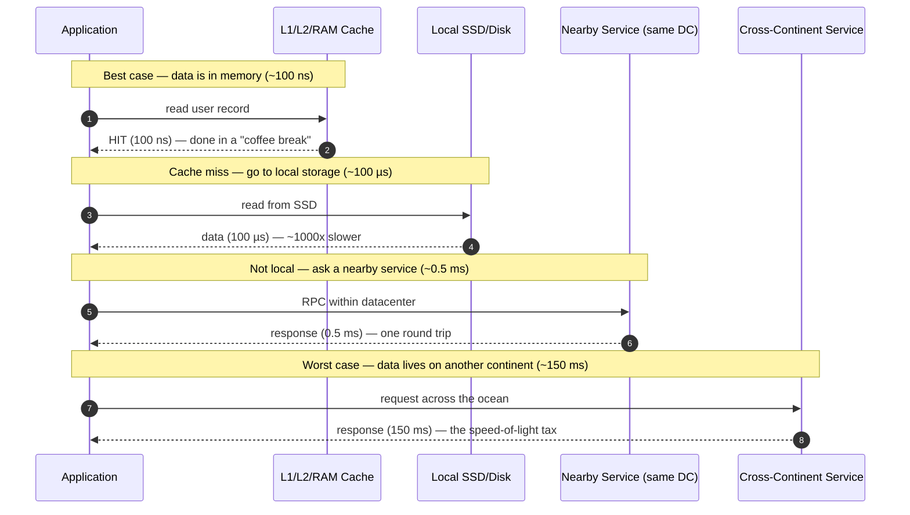

# Numbers Every Engineer Should Know — Junior

<!-- level-focus -->
At junior level, focus on this question:

> How can I apply **Numbers Every Engineer Should Know** in one small example and prove the result?

Use the smallest realistic scenario that exposes the decision and its failure behavior.
A system design conversation lives or dies on whether you can attach *numbers* to your ideas. "We'll just cache it" means nothing until you know that a memory read is ~100 nanoseconds and a cross-continent round trip is ~150 milliseconds — a difference of **1.5 million times**. Once you internalize a small table of reference numbers, you can reason about almost any system on a napkin, catch bad designs in seconds, and speak the language of senior engineers.

This page is a *memorize-and-build-intuition* reference. The goal is not to derive these numbers from physics. The goal is to lodge a dozen of them in your head, understand the order of magnitude, and know one concrete reason each one matters. Every number below is an approximation — engineers care about the **order of magnitude** (is it nanoseconds, microseconds, milliseconds, or seconds?), not the third decimal place.

> 🎞️ **See it animated:** [Latency Numbers Every Programmer Should Know](https://colin-scott.github.io/personal_website/research/interactive_latency.html)

---

## 1. Why These Numbers Matter

Imagine a senior engineer reviews your design. You propose: "For each item on the page, we'll call the database to fetch its details." They ask: "How many items, and what's the round trip to the database?" If you can answer "around 200 items, each call is about half a millisecond inside our datacenter, so 100 milliseconds just in database round trips," you've just shown that you can *estimate*. If instead you shrug, you've shown you're guessing.

Reference numbers turn arguments into arithmetic. They let you answer three questions almost instantly:

- **Is this fast enough?** Compare your estimate to the budget (e.g., a web page should respond in under ~200 ms).
- **Where is the time going?** A request that touches memory, disk, and the network spends almost all its time on the *slowest* component.
- **Will it fit?** Does this dataset fit in RAM, or must it live on disk? Does this traffic fit on one server, or do we need a hundred?

The numbers cluster into a few families. Memorize the families first, the exact values second:

| Family | What it answers | Typical unit |
|---|---|---|
| **Latency** | How long does one operation take? | ns → µs → ms |
| **Data size** | How many bytes is this? | bytes → KB → MB → GB → TB |
| **Availability** | How much downtime does X nines allow? | minutes / hours per year |
| **Throughput** | How many operations per second can one machine do? | ops/s, requests/s |

The single most important idea on this page: **each step away from the CPU is roughly 10× to 100× slower than the last.** Latency is not a smooth slope; it is a staircase, and crossing certain steps (memory → disk, or local → cross-continent) changes the rules of your design.

---

## 2. The Latency Ladder

Here is the canonical ladder, ordered from fastest to slowest. These are approximate, modern, round-number values — the kind you cite in an interview. Memorize the **order** and the **order of magnitude**; the exact digit matters far less.

| Operation | Latency (approx) | In nanoseconds | One-line reason it matters |
|---|---|---|---|
| L1 cache reference | 0.5 ns | 0.5 | The CPU's own pocket; a tight loop over cached data is essentially free. |
| Branch mispredict | 5 ns | 5 | Why unpredictable `if`s in hot loops hurt. |
| L2 cache reference | 7 ns | 7 | Still on-chip; ~14× slower than L1. |
| Mutex lock/unlock | 25 ns | 25 | Cheap, but contention turns it into queueing. |
| Main memory (RAM) reference | 100 ns | 100 | The baseline "fast" you compare everything to. |
| Compress 1 KB with a fast algorithm | ~2,000 ns (2 µs) | 2,000 | CPU work is cheaper than you'd guess vs. I/O. |
| Read 1 MB sequentially from RAM | ~10,000 ns (10 µs) | 10,000 | Bandwidth matters once data gets big. |
| SSD random read | 16–150 µs | ~100,000 | ~1,000× slower than RAM, but ~100× faster than spinning disk. |
| Read 1 MB sequentially from SSD | ~1 ms | 1,000,000 | A whole millisecond just to stream a megabyte. |
| Round trip within the same datacenter | ~0.5 ms | 500,000 | The cost of *one* call to another service nearby. |
| Read 1 MB sequentially from disk (HDD) | ~5–20 ms | ~10,000,000 | Why we avoid spinning disks on the hot path. |
| Disk (HDD) seek | ~10 ms | 10,000,000 | The mechanical arm moving — a glacial 10 million ns. |
| Round trip across continents (e.g., CA ↔ Netherlands) | ~150 ms | 150,000,000 | Speed of light is a hard wall; no caching fixes geography. |

A few anchor values to lock in permanently:

- **L1 ≈ 0.5 ns** — the floor.
- **RAM ≈ 100 ns** — the reference point. Everything is "X times slower than memory."
- **Datacenter round trip ≈ 0.5 ms** — one nearby network call.
- **Disk seek ≈ 10 ms** — the mechanical penalty.
- **Cross-continent round trip ≈ 150 ms** — the speed-of-light tax.

From RAM (100 ns) to a cross-continent round trip (150 ms) is a factor of **1,500,000×**. That is why "where does the data live" and "how far does the request travel" dominate almost every performance discussion.

---

## 3. Scaling Latency to Human Time

Nanoseconds are impossible to feel. The classic trick — popularized in many "numbers everyone should know" talks — is to **multiply every latency by one billion (10⁹)** so that 1 ns becomes 1 second. Now the whole ladder maps onto a human timescale you can actually imagine.

| Operation | Real latency | × 1 billion → human time | What it feels like |
|---|---|---|---|
| L1 cache reference | 0.5 ns | 0.5 seconds | One heartbeat. |
| L2 cache reference | 7 ns | 7 seconds | Tying your shoe. |
| Main memory reference | 100 ns | ~1.5 minutes | Brewing a cup of coffee. |
| SSD random read | ~100 µs | ~1 day | Waiting a full day. |
| Datacenter round trip | ~0.5 ms | ~6 days | Almost a week. |
| Disk (HDD) seek | ~10 ms | ~4 months | A whole season. |
| Cross-continent round trip | ~150 ms | ~5 years | Finishing a degree. |

Read that last column again. If a memory access is a **coffee break**, then a disk seek is **four months** and a transatlantic round trip is **five years**. This is the single most useful mental model on the page: the moment your code leaves the CPU/RAM neighborhood, it is no longer "a little slower" — it has stepped into a completely different epoch.

The practical lessons fall out immediately:

- **Keep hot data in RAM.** Going to SSD is a day; going to disk is a season.
- **Minimize network round trips.** One datacenter call is a week; one cross-continent call is five years. Batching ten calls into one is the difference between five years and fifty.
- **Geography is destiny.** No amount of clever code beats the speed of light. If your users are in Asia and your servers are in Virginia, every round trip carries a multi-year (in human terms) tax. The fix is to *move the data closer* (replicas, CDNs, edge caches), not to "optimize the loop."

Here is the same idea as a staircase, showing how each tier multiplies the cost:

---

## 4. Walking Up the Ladder: What Each Hop Costs

To make the ladder concrete, follow a single piece of data as a request tries to find it. Each "miss" pushes the request one rung higher (slower). This is exactly how a real cache hierarchy behaves.



The takeaway is a design heuristic you will use forever: **answer requests from the lowest (fastest) rung you can.** A well-designed system tries memory first, falls back to local storage, then to a nearby service, and only as a last resort crosses the network or the planet. Every rung you avoid saves an order of magnitude.

This is why the three most common performance tools — **caching**, **co-location**, and **replication** — exist. They all do the same thing: move the answer to a faster rung of this ladder.

| Technique | What it does | Which rung it targets |
|---|---|---|
| In-memory cache (e.g., Redis, local map) | Serve from RAM instead of disk/DB | RAM (100 ns) instead of SSD/DB |
| Co-locating services in one datacenter | Avoid cross-region calls | 0.5 ms instead of 150 ms |
| Read replicas near users | Keep a copy of data close | Local network instead of cross-continent |
| CDN / edge cache | Serve static content from a nearby city | ~10 ms instead of ~150 ms |

---

## 5. Powers of Two and Data-Size Units

Computers count in powers of two, but humans label sizes in powers of ten (kilo, mega, giga). The two systems are *close but not equal*, and confusing them is one of the most common junior mistakes. First, the powers of two worth memorizing:

| Power of 2 | Exact value | Approx (power of 10) | Nickname |
|---|---|---|---|
| 2¹⁰ | 1,024 | ~10³ (thousand) | "Kilo" (Ki) |
| 2²⁰ | 1,048,576 | ~10⁶ (million) | "Mega" (Mi) |
| 2³⁰ | 1,073,741,824 | ~10⁹ (billion) | "Giga" (Gi) |
| 2⁴⁰ | 1,099,511,627,776 | ~10¹² (trillion) | "Tera" (Ti) |
| 2⁵⁰ | ~1.13 × 10¹⁵ | ~10¹⁵ (quadrillion) | "Peta" (Pi) |

The trick: **every 10 powers of two is roughly ×1,000 (one SI prefix step).** So 2¹⁰ ≈ thousand, 2²⁰ ≈ million, 2³⁰ ≈ billion, 2⁴⁰ ≈ trillion. If you can count up by tens of exponents, you can size almost anything in your head.

Now the data-size units. Strictly, the binary units have their own names (KiB, MiB, GiB), but in everyday engineering most people say "KB/MB/GB" and mean the binary (1,024-based) sizes. Know both columns:

| Unit | Decimal (SI, 10ⁿ) | Binary (IEC, 2ⁿ) | Rough memory hook |
|---|---|---|---|
| Byte (B) | 1 byte | 1 byte | One ASCII character. |
| Kilobyte (KB / KiB) | 1,000 B | 1,024 B | A short email, a page of plain text. |
| Megabyte (MB / MiB) | 10⁶ B | 2²⁰ ≈ 1.05 × 10⁶ B | A high-res photo, a minute of MP3. |
| Gigabyte (GB / GiB) | 10⁹ B | 2³⁰ ≈ 1.07 × 10⁹ B | A movie; a comfortable amount of RAM. |
| Terabyte (TB / TiB) | 10¹² B | 2⁴⁰ ≈ 1.10 × 10¹² B | A laptop disk; a small database. |
| Petabyte (PB / PiB) | 10¹⁵ B | 2⁵⁰ ≈ 1.13 × 10¹⁵ B | A large company's data lake. |

**Why the difference matters:** the gap between decimal and binary grows at each step — about 2.4% at KB, ~5% at MB, ~7% at GB, ~10% at TB. This is exactly why a "1 TB" drive shows up as roughly 931 GB in your operating system: the manufacturer counts in decimal (10¹² bytes), and the OS displays in binary (2⁴⁰ bytes). Same bytes, different labels.

For back-of-the-envelope work, the simplification is liberating: **treat 2¹⁰ as ≈ 10³.** When you're estimating "is this 10 gigabytes or 10 terabytes," a 7% error is noise. Save the exact 1,024 for when you're allocating buffers or reading a spec.

---

## 6. How Big Is One Row? Sizes of Common Things

Latency tells you *how long*; size tells you *how much*. To estimate storage and bandwidth, you need a feel for how many bytes everyday objects take. Memorize this small table — it turns "we have a billion users" into "that's about X gigabytes."

| Thing | Typical size | Why this size |
|---|---|---|
| One ASCII character | 1 byte | 8 bits; the original character unit. |
| One Unicode character (UTF-8) | 1–4 bytes | English ≈ 1 byte; emoji/CJK ≈ 3–4 bytes. |
| Boolean | 1 byte (often) | A bit logically, but usually byte-aligned in storage. |
| 32-bit integer (`int`) | 4 bytes | Holds up to ~2.1 billion (signed). |
| 64-bit integer (`long` / `bigint`) | 8 bytes | Holds up to ~9.2 × 10¹⁸; used for IDs, timestamps. |
| Unix timestamp (seconds) | 4–8 bytes | An integer; 8 bytes if you need sub-second or far-future. |
| UUID | 16 bytes (raw) / 36 chars (text) | 128 bits; the text form with dashes is 36 bytes — store raw when you can. |
| One typical database row | ~100 bytes – 1 KB | A handful of columns: ids, a few strings, timestamps. |
| One small JSON API response | ~1–10 KB | A user profile, a list of a few items. |
| One web page (HTML + assets) | ~1–5 MB | Modern pages are heavy; mostly images and scripts. |

A worked feel for this: suppose a `users` table has an 8-byte ID, a 36-byte email, a 50-byte name, and two 8-byte timestamps. That's roughly **110 bytes** of raw data per row (databases add overhead, so call it ~200 bytes in practice). For **100 million users**, that's:

```
100,000,000 rows × ~200 bytes ≈ 20,000,000,000 bytes ≈ 20 GB
```

Twenty gigabytes fits comfortably in the RAM of a single modern server — which immediately tells you that this table *can* be fully cached in memory. That single estimate, done in fifteen seconds, shapes the whole design. This is the payoff of knowing sizes.

A handy estimation shortcut for "how many of X fit in Y":

| Container | Holds roughly | Example |
|---|---|---|
| 1 GB of RAM | ~5–10 million small rows (~100–200 B each) | A medium lookup table fits in memory. |
| 1 TB disk | ~5–10 billion small rows | A large dataset on one machine. |
| 1 MB | ~1,000 small rows, or ~250 UUIDs in text | A single page of results. |

---

## 7. Availability: The Nines and Their Downtime

"Availability" is the percentage of time a system is up. Engineers describe it by **how many nines** it has — 99.9% is "three nines," 99.99% is "four nines." Each extra nine cuts your allowed downtime by **10×**, and each one is dramatically harder and more expensive to achieve. The numbers you must memorize:

| Availability | Nines | Downtime / year | Downtime / month | Downtime / day |
|---|---|---|---|---|
| 90% | "one nine" | ~36.5 days | ~3 days | ~2.4 hours |
| 99% | "two nines" | ~3.65 days | ~7.2 hours | ~14.4 minutes |
| 99.9% | "three nines" | ~8.76 hours | ~43.8 minutes | ~1.44 minutes |
| 99.99% | "four nines" | ~52.6 minutes | ~4.38 minutes | ~8.6 seconds |
| 99.999% | "five nines" | ~5.26 minutes | ~26 seconds | ~0.86 seconds |
| 99.9999% | "six nines" | ~31.5 seconds | ~2.6 seconds | ~86 ms |

The fastest way to remember the yearly column: **three nines ≈ ~9 hours/year, four nines ≈ ~1 hour/year (about 52 min), five nines ≈ ~5 min/year.** Each nine divides the previous by ten.

Two practical lessons every junior should absorb:

1. **More nines cost a lot more.** Going from 99% to 99.9% might mean adding monitoring and a failover. Going from 99.9% to 99.99% might mean multi-region redundancy and a serious on-call rotation. Going to five nines might mean an entire reliability team. You pay exponentially for each nine, so you only buy the nines you actually need.

2. **Availability multiplies in a chain.** If your request must pass through three independent services that are each "three nines" (99.9%), the *combined* availability is roughly 99.9% × 99.9% × 99.9% ≈ **99.7%** — worse than any single component. Dependencies in series make you *less* available, which is a core reason engineers add redundancy and remove unnecessary hops.

When someone says "we need an SLA of three nines," now you can instantly translate that to "we're allowed about 8.76 hours of downtime per year, or roughly 43 minutes per month" — and judge whether the proposed design can actually deliver it.

---

## 8. Throughput: What One Machine Can Do

Latency is "how long for one operation." Throughput is "how many operations per second." A junior should carry a few rough single-machine capacity numbers, so you can answer "how many servers do we need?" These are deliberately round, conservative, order-of-magnitude figures — real numbers vary enormously with hardware and workload.

| Component | Rough throughput (single instance) | What it means in practice |
|---|---|---|
| A typical web/app server | ~1,000–10,000 requests/second | One machine serves a lot of light requests; heavy ones drop this fast. |
| Redis / in-memory store | ~100,000+ operations/second | Memory speed; one node handles enormous read/write rates. |
| A primary (single) relational DB | ~hundreds to a few thousand writes/second | Writes are the bottleneck; reads scale with replicas. |
| DB reads from a read replica | ~thousands–tens of thousands/second | Add replicas to scale reads horizontally. |
| Network (1 Gbps link) | ~125 MB/second | Bandwidth, not request count — sizes matter here. |
| Network (10 Gbps link) | ~1.25 GB/second | Common inside modern datacenters. |
| Sequential disk (HDD) | ~100 MB/second | Streaming is fine; random access is the killer. |
| Sequential read (SSD/NVMe) | ~0.5–5+ GB/second | Why SSDs transformed storage-bound workloads. |

The most useful heuristic here: **memory-speed systems (Redis) are ~10–100× higher throughput than disk-backed databases.** That asymmetry is why caching is the universal first answer to "the database is overloaded": you move the hottest reads off the slow rung (DB) onto the fast rung (memory).

The second heuristic: **reads scale easily, writes do not.** You can add read replicas almost endlessly to multiply read throughput, but every write must eventually be applied to a single authority (the primary). When a design needs a huge *write* rate, that's when you start hearing words like *sharding* and *partitioning* — splitting the data so each piece has its own primary.

A capacity estimate looks like this. Suppose a service must handle **50,000 requests/second** and one server safely handles **5,000 requests/second**:

```
50,000 req/s ÷ 5,000 req/s per server = 10 servers (minimum)
```

In reality you'd add headroom for spikes and failures — perhaps run 15–20 servers so the system survives losing a few. But the core sizing came from two numbers you already had in your head.

---

## 9. The 86,400 Trick: Seconds in a Day

Half of capacity estimation is converting between "per day" (how product people talk) and "per second" (how systems are measured). The conversion you must memorize:

> **One day = 86,400 seconds ≈ 100,000 (10⁵) seconds.**

It's actually 86,400, but rounding to **10⁵** makes mental math trivial and the error (~16%) is fine for estimates. This single trick converts daily volumes into per-second load — the number you actually design against.

| Per day | ÷ 86,400 (≈ 10⁵) | Per second (approx) | Feel |
|---|---|---|---|
| 1 million events/day | 1,000,000 ÷ 10⁵ | ~10 per second | Trivial; one small server. |
| 100 million events/day | 100,000,000 ÷ 10⁵ | ~1,000 per second | One solid server, with headroom. |
| 1 billion events/day | 1,000,000,000 ÷ 10⁵ | ~10,000 per second | Now you need several servers. |
| 10 billion events/day | 10,000,000,000 ÷ 10⁵ | ~100,000 per second | A real distributed system. |

Other time conversions worth keeping near this one:

| Span | Seconds | Rounded |
|---|---|---|
| 1 minute | 60 | 60 |
| 1 hour | 3,600 | ~3.6 × 10³ |
| 1 day | 86,400 | ~10⁵ |
| 1 month (~30 days) | ~2,592,000 | ~2.5 × 10⁶ |
| 1 year | ~31,536,000 | ~3 × 10⁷ (≈ π × 10⁷) |

That last line is a famous engineer's joke that happens to be true: **a year is about π × 10⁷ seconds** (≈ 31.4 million; the real value is ≈ 31.5 million). It's an oddly accurate shortcut for "per year" math.

Two cautions when you apply the 86,400 trick:

- **Traffic is rarely flat.** Dividing daily volume by 86,400 gives the *average* rate. Real systems peak — often the busiest hour carries far more than 1/24 of the day's traffic. A common rule of thumb is to design for **2–3× the average** to survive peaks.
- **State the assumption out loud.** In an interview, saying "1 billion events a day is about 10,000 per second average, and I'll size for ~30,000 to handle peaks" demonstrates exactly the estimation skill that's being tested.

---

## 10. Putting It Together: A Tiny Worked Example

Let's combine all four families on one small problem so you see how they interlock. **Problem:** design rough capacity for a photo-thumbnail service. We're told: 100 million users, each loads 50 thumbnails per day, each thumbnail is 20 KB, and we want three nines of availability.

**Step 1 — Throughput (use the 86,400 trick).**

```
100,000,000 users × 50 thumbnails = 5,000,000,000 thumbnail loads/day
5,000,000,000 ÷ 10⁵ seconds  ≈ 50,000 loads/second (average)
Size for peak (~3x)          ≈ 150,000 loads/second
```

**Step 2 — Bandwidth (sizes × throughput).**

```
50,000 loads/s × 20 KB = 1,000,000 KB/s ≈ 1 GB/second (average)
Peak ≈ 3 GB/second
```

At ~125 MB/s per 1 Gbps link, 1 GB/s average needs roughly **8 such links' worth** of egress — a strong hint you'll lean on a CDN to serve images from the edge rather than from your origin servers (recall the ladder: ~10 ms from a nearby edge vs. ~150 ms cross-continent).

**Step 3 — Storage (sizes × count).**

```
Suppose 10 billion thumbnails stored × 20 KB
= 200,000,000,000 KB ≈ 200 TB
```

That clearly does not fit on one machine (a big disk is ~1–4 TB), so the design needs distributed object storage. Another decision made from arithmetic alone.

**Step 4 — Servers (throughput ÷ per-server capacity).**

```
If one server serves 5,000 loads/s:
150,000 ÷ 5,000 = 30 servers (before redundancy headroom)
```

**Step 5 — Availability.** Three nines means ~8.76 hours/year of allowed downtime. With 30+ servers behind a load balancer and a CDN, losing a single server doesn't take the service down — so three nines is realistic *if* there's no single point of failure in the chain.

Notice that we sized an entire service — requests/sec, bandwidth, storage, server count, availability — using nothing but the tables on this page and a few divisions. **That** is why these numbers matter.

---

## 11. The One-Page Cheat Sheet

If you memorize nothing else, memorize this.

| Category | Number | Value to remember |
|---|---|---|
| Latency | L1 cache | ~0.5 ns |
| Latency | Main memory (RAM) | ~100 ns |
| Latency | SSD random read | ~100 µs (16–150 µs) |
| Latency | Datacenter round trip | ~0.5 ms |
| Latency | Disk (HDD) seek | ~10 ms |
| Latency | Cross-continent round trip | ~150 ms |
| Latency scale | Multiply by | 10⁹ → 1 ns becomes 1 second |
| Powers of 2 | 2¹⁰ / 2²⁰ / 2³⁰ / 2⁴⁰ | ≈ thousand / million / billion / trillion |
| Size | char / int32 / int64 / UUID | 1 / 4 / 8 / 16 bytes |
| Size | typical DB row | ~100 B – 1 KB |
| Availability | 99.9% (three nines) | ~8.76 hours/year |
| Availability | 99.99% (four nines) | ~52 minutes/year |
| Availability | Each extra nine | ÷10 downtime |
| Throughput | Web server | ~1k–10k req/s |
| Throughput | Redis | ~100k+ ops/s |
| Throughput | Single DB primary (writes) | ~hundreds–few thousand/s |
| Time | One day | 86,400 ≈ 10⁵ seconds |
| Time | One year | ~π × 10⁷ ≈ 31.5M seconds |

And the five intuitions behind them:

1. **Each step away from the CPU is ~10–100× slower.** Latency is a staircase.
2. **RAM ≈ 100 ns is your reference point.** Everything is "X times slower than memory."
3. **Network and geography dominate.** A cross-continent round trip (150 ms) is ~1.5 million × slower than RAM.
4. **Reads scale (replicas); writes don't (single primary).** That's why caching and sharding exist.
5. **Each nine costs ~10× more and removes ~10× the downtime.** Buy only the nines you need.

---

## 12. Common Mistakes Juniors Make

| Mistake | Why it's wrong | The fix |
|---|---|---|
| Confusing ns, µs, and ms | They differ by 1,000× each — a slip can hide a million-fold error | Always write the unit; sanity-check the order of magnitude |
| Treating disk and memory as similar | RAM (~100 ns) is ~100,000× faster than a disk seek (~10 ms) | Ask "where does the data live?" first |
| Ignoring round trips | Each network call is ~0.5 ms (local) to ~150 ms (far); 200 of them is a disaster | Batch calls; count round trips, not just CPU |
| Mixing decimal and binary sizes | "1 TB" vs. "1 TiB" differ ~10%; matters for capacity planning | Know both; round 2¹⁰ ≈ 10³ for estimates only |
| Using average load, forgetting peaks | Dividing daily volume by 86,400 gives the *average*, not the spike | Size for ~2–3× average |
| Chasing nines you don't need | Each nine is exponentially harder and pricier | Match availability to actual business need |
| Forgetting availability multiplies | Three services at 99.9% in series ≈ 99.7% combined | Reduce hops; add redundancy where it counts |
| Quoting exact digits | The third decimal is noise; engineers reason in orders of magnitude | Round aggressively; defend the magnitude |

The meta-mistake behind all of these: **memorizing values without internalizing the relationships.** Knowing "disk seek is 10 ms" is trivia. Knowing "disk seek is ~100,000× slower than memory, so never seek on the hot path" is engineering judgment. The relationships are what you actually use.

---

## 13. Recap and What to Memorize

This page gave you four families of numbers and the intuition to use them:

- **Latency ladder** — from L1 (~0.5 ns) to cross-continent round trips (~150 ms), where each rung is ~10–100× slower than the last. Use the **× 1 billion → human time** trick: memory is a coffee break, a disk seek is four months, a cross-continent hop is five years.
- **Powers of two and sizes** — 2¹⁰/2²⁰/2³⁰/2⁴⁰ ≈ thousand/million/billion/trillion, and the byte costs of common things (char = 1 B, int = 4 B, long/UUID = 8/16 B, a DB row ≈ 100 B – 1 KB). These turn "a billion rows" into a gigabyte figure instantly.
- **Availability nines** — 99.9% ≈ 8.76 h/year, and each added nine divides downtime by 10 while multiplying cost. Availability of a chain multiplies, so it's *worse* than any single link.
- **Throughput and time** — a web server ~1k–10k req/s, Redis ~100k+ ops/s, a single DB primary only ~hundreds–few thousand writes/s; reads scale, writes don't. And the workhorse conversion: **one day ≈ 86,400 ≈ 10⁵ seconds.**

The goal was never to recite digits. It was to give you a small set of anchors so that, when a problem appears, you can attach numbers to it in seconds, find the slow rung, and reason about whether a design is fast enough, big enough, and reliable enough — on a napkin, before writing a line of code.

Spend ten minutes with the [interactive latency visualization](https://colin-scott.github.io/personal_website/research/interactive_latency.html) cited at the top, watch how the numbers have shifted across hardware generations, and the latency ladder will stick for good.

*Next step:* [Middle level](middle.md)

---

## Apply it

1. Choose one small, known input for **Numbers Every Engineer Should Know**.
2. Predict the output or observable behavior.
3. Run the smallest example or probe that exercises the concept.
4. Change one input to trigger a failure or boundary case.
5. Explain the evidence using the guide's vocabulary.

## Verify your work

- Record the exact input, command or code path, and output.
- Repeat the probe and confirm the result is consistent.
- Show one expected success and one expected failure.
- Resolve any difference between the prediction and the evidence.

## Review questions

- What problem does Numbers Every Engineer Should Know solve in the example?
- Which input changes the observed result, and why?
- What is the smallest useful success check?
- Which beginner mistake would your evidence catch?
