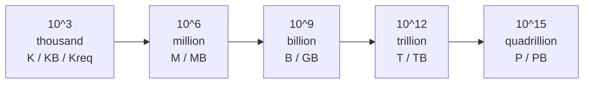
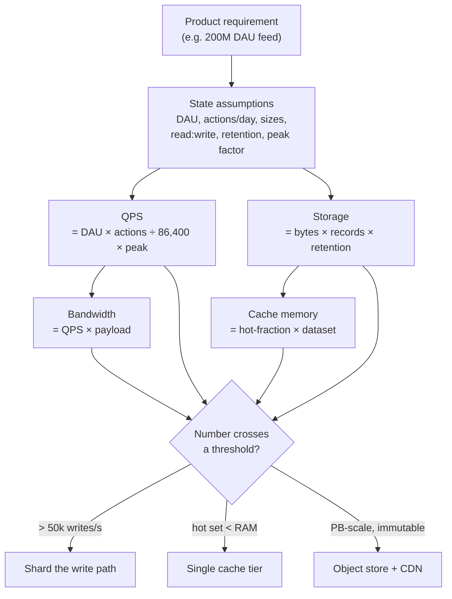
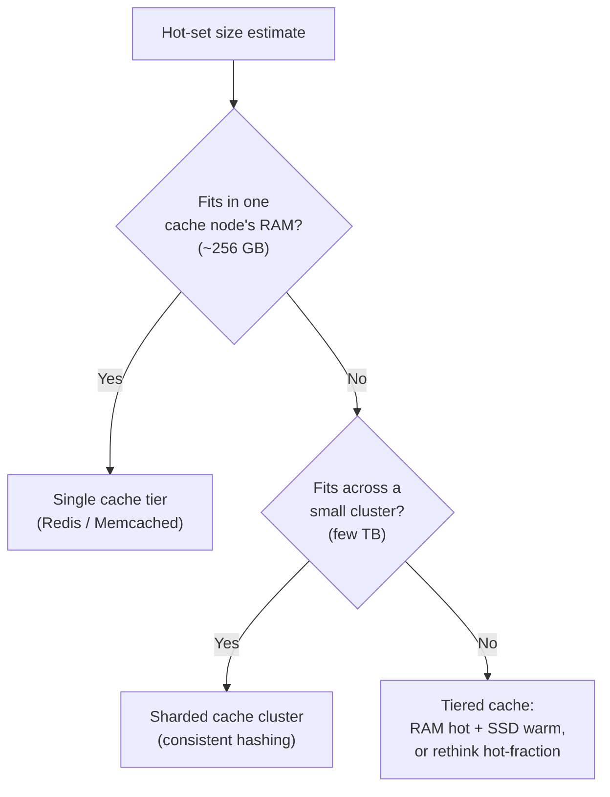
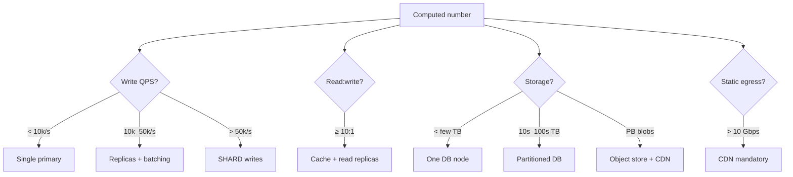

# Numbers Every Engineer Should Know — Middle

<!-- level-focus -->
At middle level, focus on this question:

> Where does **Numbers Every Engineer Should Know** belong in a maintainable component, and which trade-off selects the design?

Use the smallest realistic scenario that exposes the decision and its failure behavior.
Knowing the canonical latency and capacity numbers is necessary but not sufficient. The skill that actually moves an interview forward — and that actually sizes a real production cluster — is **back-of-envelope estimation**: turning a one-line product requirement ("build a Twitter-like feed for 200M daily users") into a defensible set of numbers for QPS, storage, bandwidth, and memory, and then letting those numbers *select* the architecture. This page teaches the estimation method as a repeatable procedure, then carries three complete worked examples end to end.

The goal is not precision. A back-of-envelope estimate that lands within a factor of 2–3 of reality is a success. The goal is to make the arithmetic *explicit and fast* so you can compare options ("does this fit on one node or do I need 10?") in under five minutes.

---

## 1. The constants you carry in your head

Every estimate is built from a small set of memorized constants. You should be able to recall all of these without looking anything up. They fall into three groups: time, data sizes, and latency.

### Time constants

| Quantity | Value | Rounded for math |
|---|---|---|
| Seconds in a day | 86,400 | **10^5** (≈86,400) |
| Seconds in a year | 31,536,000 | **3 × 10^7** |
| Minutes in a day | 1,440 | ~1.5 × 10^3 |
| Days in a year | 365 | ~400 for upper bound |
| Seconds in an hour | 3,600 | ~3.6 × 10^3 |

The single most useful shortcut on this entire page: **1 day ≈ 10^5 seconds.** The true value is 86,400, which is only 16% below 100,000. Using 10^5 makes division trivial and biases QPS estimates slightly *upward*, which is the safe direction for capacity planning.

### Data-size constants

| Unit | Bytes | Power of 2 | Power of 10 |
|---|---|---|---|
| 1 KB | 1,024 | 2^10 | ~10^3 |
| 1 MB | 1,048,576 | 2^20 | ~10^6 |
| 1 GB | ~1.07 × 10^9 | 2^30 | ~10^9 |
| 1 TB | ~1.10 × 10^12 | 2^40 | ~10^12 |
| 1 PB | ~1.13 × 10^15 | 2^50 | ~10^15 |

For estimation we treat KB/MB/GB/TB as clean powers of ten (10^3, 10^6, 10^9, 10^12). The 7% drift between 10^9 and 2^30 is far below our target accuracy.

Typical record/payload sizes worth memorizing:

| Object | Typical size |
|---|---|
| A single char / ASCII byte | 1 B |
| A UUID (as bytes) | 16 B |
| A UUID (as hex string) | 36 B |
| A short tweet / text post | ~300 B (with metadata ~1 KB) |
| A typical HTTP request line + headers | ~1 KB |
| A small JSON API response | 1–10 KB |
| A web page (HTML, no images) | ~100 KB |
| A compressed photo (mobile JPEG) | ~300 KB – 2 MB |
| A minute of 1080p video | ~50 MB |

### Latency constants (Jeff Dean / Colin Scott numbers)

| Operation | Latency | Mnemonic |
|---|---|---|
| L1 cache reference | ~1 ns | "nanosecond" |
| Branch mispredict | ~3 ns | — |
| L2 cache reference | ~4 ns | — |
| Mutex lock/unlock | ~17 ns | — |
| Main memory reference | ~100 ns | 100× slower than L1 |
| Compress 1 KB (Snappy) | ~2 µs | — |
| Read 1 MB sequentially from memory | ~10 µs | — |
| SSD random read | ~16 µs | — |
| Round trip within same datacenter | ~500 µs | half a millisecond |
| Read 1 MB sequentially from SSD | ~50–200 µs | — |
| Disk (HDD) seek | ~3–10 ms | — |
| Read 1 MB sequentially from disk | ~1–5 ms | — |
| Round trip CA → Netherlands → CA | ~150 ms | speed of light tax |

> 🎞️ **See it animated:** [Latency Numbers Every Programmer Should Know (Colin Scott)](https://colin-scott.github.io/personal_website/research/interactive_latency.html)

The latency table mostly governs *response-time* reasoning (does one request fit a 200 ms budget?). The time and size constants govern *capacity* reasoning (QPS, storage, bandwidth), which is the focus of this page.

---

## 2. Rounding discipline and unit hygiene

Estimation lives or dies on disciplined arithmetic. Two habits separate clean estimates from confused ones.

### Round everything to one significant figure × a power of ten

Convert every input to the form `a × 10^b` where `a` is a single digit. Then multiplication is "multiply the digits, add the exponents," and division is "divide the digits, subtract the exponents." You almost never need a calculator.

```text
QPS = (2 × 10^8 users) × (5 actions) / (10^5 s/day)
    = (2 × 5) × 10^(8+0-5)
    = 10 × 10^3
    = 10^4   →  ~10,000 QPS
```

The chained exponent rule means the only thing you ever track carefully is the *exponent*; the leading digit just multiplies.

### Carry units through every step

Treat units like algebra. They must cancel to leave the unit you want. If you are computing QPS, your units must reduce to `1/second`. If they don't, you made a structural error — caught for free.

```text
[users] × [requests / user / day] / [seconds / day]
  = requests / (user·day) × users × day / second   ... rearranged
  = requests / second   ✓
```

### Powers-of-ten ladder (keep this mental model)



When a result crosses one of these thresholds it usually crosses an *architectural* threshold too: thousands of QPS fit on one box; millions of records fit in RAM; billions of records need disk or sharding; trillions of bytes need a distributed store.

---

## 3. The estimation template

Every capacity estimate follows the same five-step skeleton. Memorize the template, not individual answers. Fill the blanks for whatever problem you're handed.

| Step | Question | Formula / source | Output unit |
|---|---|---|---|
| 1. Scope | What are the core actions? | Read the requirement, list 2–4 verbs | — |
| 2. Traffic | How many of each per second? | DAU × actions/day ÷ 86,400 × peak | QPS |
| 3. Storage | How much new data per day/year? | bytes/record × records × retention | bytes |
| 4. Bandwidth | How much data on the wire/s? | QPS × payload size | bytes/s |
| 5. Memory | What hot set must stay in RAM? | hot-fraction × dataset (Pareto) | bytes |

A clean answer in an interview literally walks down this table out loud. Below is the same template as a flow you can recite:



**Always state assumptions first and out loud.** "Assume 200M DAU, each user opens the app 5×/day, average post is 300 bytes, we keep posts forever, peak is 2× average." Now every number you produce is *traceable*. The interviewer can challenge an assumption ("what if it's 10×/day?") and you re-run one multiplication instead of starting over.

---

## 4. Estimating QPS

QPS (queries/requests per second) is the load on your request-serving tier. It drives how many app servers, how many database connections, and how much you must shard.

### The master formula

```text
Average QPS = (DAU × actions_per_user_per_day) / seconds_per_day
            = (DAU × actions) / 86,400
            ≈ (DAU × actions) / 10^5
```

Then apply a **peak factor** to size for the busy hour, not the daily average:

```text
Peak QPS = Average QPS × peak_factor
```

Typical peak factors:

| Traffic shape | Peak factor (peak ÷ avg) | Notes |
|---|---|---|
| Smooth global (always-on) | 1.5× – 2× | Spread across time zones |
| Single-region consumer app | 2× – 3× | Evening prime time |
| Office/B2B SaaS | 3× – 5× | 9–5 in one or two zones |
| Event-driven spikes (ticketing, flash sale) | 10× – 100× | Size for the spike, not the average |

### Worked QPS micro-example

A messaging app: **100M DAU**, each user sends **20 messages/day**. Smooth global traffic, peak factor 2×.

```text
Avg QPS = (100M × 20) / 86,400
        = (10^8 × 2×10^1) / 10^5
        = 2 × 10^9 / 10^5
        = 2 × 10^4
        = 20,000 QPS (writes)

Peak QPS = 20,000 × 2 = 40,000 QPS
```

So the message-*write* tier handles ~40k writes/s at peak. Note that we computed writes only; reads (delivering messages to recipients) are a separate calculation driven by the read:write ratio (Section 8).

### Splitting QPS by action

Real systems have multiple actions with very different rates. Compute each separately, then sum where it matters.

| Action | actions/user/day | QPS (100M DAU, ÷10^5) | Peak (×2) |
|---|---|---|---|
| Open feed (read) | 10 | 10,000 | 20,000 |
| Post message (write) | 2 | 2,000 | 4,000 |
| Like / react (write) | 8 | 8,000 | 16,000 |
| Search (read) | 1 | 1,000 | 2,000 |
| **Total reads** | 11 | 11,000 | 22,000 |
| **Total writes** | 10 | 10,000 | 20,000 |

This split is exactly what tells you to scale your read path and write path independently.

---

## 5. Estimating storage

Storage estimation answers: how big does the durable store get, and how fast does it grow? This selects between "fits on one disk," "needs a partitioned database," and "needs an object store + lifecycle policies."

### The master formula

```text
Storage per period = records_per_period × bytes_per_record
Total storage      = Storage_per_period × retention_periods
```

Always compute three horizons: **per day**, **per year**, **at retention limit**. Daily growth tells you ingest rate; the retention total tells you cluster size.

### Don't forget the multipliers

The raw `records × bytes` is almost always an *under*-estimate. Real storage is inflated by:

| Multiplier | Typical factor | Why |
|---|---|---|
| Metadata / indexes | 1.2× – 2× | Secondary indexes, timestamps, foreign keys |
| Replication | 3× | Standard 3-replica durability |
| Overhead / fragmentation | 1.1× – 1.3× | Page padding, B-tree fill factor |
| Backups / snapshots | 1× – 2× | Point-in-time recovery copies |

A common quick rule: **multiply your raw data estimate by ~5×** to get provisioned capacity (≈ 1.5× metadata × 3× replication × ~1.1× overhead). State this multiplier explicitly.

### Worked storage micro-example

The messaging app above: **2,000 messages/s** average write rate, each message **1 KB** stored (text + metadata + index entry). Retain for **5 years**.

```text
Messages/day  = 2,000 × 86,400 ≈ 2,000 × 10^5 = 2 × 10^8 (200M/day)
Bytes/day     = 2 × 10^8 × 10^3 B = 2 × 10^11 B = 200 GB/day

Bytes/year    = 200 GB × 365 ≈ 200 GB × 400 = 80,000 GB = 80 TB/year
5 years       = 80 TB × 5 = 400 TB (raw)

With ~3× replication = 1.2 PB provisioned
```

The jump from "200 GB/day" (single-disk territory) to "1.2 PB over 5 years" (definitely-distributed territory) is the whole point: storage growth, not instantaneous size, drives the architecture.

---

## 6. Estimating bandwidth

Bandwidth is the data crossing the network per second. It drives NIC capacity, load-balancer sizing, CDN egress cost, and inter-service link budgets.

### The master formula

```text
Bandwidth = QPS × payload_per_request
```

Compute **ingress** (write bandwidth = write QPS × request size) and **egress** (read bandwidth = read QPS × response size) separately. For consumer systems egress usually dominates by 10×–100× because reads dominate and responses are bigger than requests.

### Worked bandwidth micro-example

Photo feed: **20,000 reads/s** at peak, average response carries **1.5 MB** (a couple of images + JSON).

```text
Egress = 20,000 req/s × 1.5 MB/req
       = 2 × 10^4 × 1.5 × 10^6 B
       = 3 × 10^10 B/s
       = 30 GB/s
       = 240 Gbps
```

240 Gbps cannot leave a single server (a fast NIC is 25–100 Gbps). This single number tells you: you need a CDN. Static media must be served from edge caches, not your origin, or your egress bill and your NICs both melt.

### Bandwidth reference points

| Link | Capacity |
|---|---|
| 1 Gbps NIC | ~125 MB/s |
| 10 Gbps NIC | ~1.25 GB/s |
| 25 Gbps NIC | ~3 GB/s |
| 100 Gbps NIC | ~12.5 GB/s |

Convert bytes/s → bits/s by ×8. Mixing them up is the most common bandwidth error; carry the unit explicitly (`B/s` vs `bps`).

---

## 7. Estimating cache memory (hot-set sizing)

Caching is justified by access skew: a small fraction of data serves most requests. Memory estimation asks: *how much RAM holds the hot set?* If the hot set fits in RAM, a cache tier turns a disk-bound system into a memory-bound one.

### The Pareto / 80-20 heuristic

The standard assumption: **~20% of the data serves ~80% of the requests** (and often it's more extreme — 1% serves 90% for things like trending content). To size a cache:

```text
Hot set bytes = hot_fraction × total_dataset_bytes
```

Pick `hot_fraction` from the access pattern:

| Access pattern | Hot fraction to cache | Example |
|---|---|---|
| Classic Pareto | 20% | General-purpose object cache |
| Heavy skew (viral/trending) | 1–5% | Social feed top content |
| Recency-dominated | "last N days" of data | Time-series, chat history |
| Uniform (no skew) | caching does not help | Random-key lookups |

### Worked cache micro-example

A feed service stores **500 GB** of post objects. Access follows Pareto; we cache the hot 20%.

```text
Hot set = 0.2 × 500 GB = 100 GB

Per-node RAM (cache box) ≈ 64–256 GB.
100 GB hot set → 2 cache nodes (or 1 large + headroom).
```

Compare with a recency model: if 90% of reads hit posts from the last 3 days, and you ingest 200 GB/day, then `3 days × 200 GB = 600 GB` hot set — bigger, because recency keeps a wider window warm than pure Pareto. Stating *which* skew model you assume is part of the answer.

### Memory-fit decision



---

## 8. Read:write ratios and what they imply

Most systems are read-heavy. The read:write ratio shapes nearly every downstream choice. Estimate it explicitly — don't let reads hide.

| System type | Typical read:write | Implication |
|---|---|---|
| Social feed / timeline | 100:1 to 1000:1 | Heavy caching + read replicas; precompute feeds |
| E-commerce catalog | 100:1 | CDN + cache; writes are rare catalog updates |
| Messaging / chat | ~1:1 to 10:1 | Write path matters as much as read |
| Analytics ingestion | 1:100 (write-heavy) | Optimize ingest; batch; columnar store |
| URL shortener | 100:1 (redirects ≫ creates) | Cache redirects aggressively |
| Ledger / payments | ~10:1, but writes are sacred | Strong consistency on writes; replicas for reads |

The ratio lets you derive read QPS from write QPS (or vice versa) when the requirement only gives you one. If you know writes = 4,000 QPS and the system is a 100:1 read-heavy feed, then reads ≈ 400,000 QPS — and *that* is the number that forces a cache and read replicas.

```text
Read QPS = Write QPS × (read:write ratio)
4,000 writes/s × 100 = 400,000 reads/s
```

That asymmetry is why "scale the database" almost always means "scale reads first" (replicas, caches) and "shard writes only when one node can't keep up."

---

## 9. Worked example A — Twitter-like feed

**Requirement:** a Twitter-like service. Users post short messages; followers see them in a home feed.

### Step 1 — Assumptions (state them)

| Assumption | Value |
|---|---|
| DAU | 200M (2 × 10^8) |
| Posts per user per day | 0.5 (most users read, few post) |
| Feed opens per user per day | 10 |
| Avg post size (text + metadata) | 300 B → round to 1 KB stored w/ index |
| Avg followers per user | 200 |
| Retention | forever (5-year horizon) |
| Peak factor | 2× |

### Step 2 — QPS

```text
Write QPS (posts) avg = (2×10^8 × 0.5) / 10^5 = 10^8 / 10^5 = 10^3 = 1,000/s
Write QPS peak        = 1,000 × 2 = 2,000 posts/s

Read QPS (feed) avg   = (2×10^8 × 10) / 10^5 = 2×10^9 / 10^5 = 2×10^4 = 20,000/s
Read QPS peak         = 20,000 × 2 = 40,000 feed-loads/s
```

Read:write ≈ 20:1 at the request level. But each feed load fans out across many posts, and each post fans out to followers — the *internal* amplification is far larger.

### Step 3 — Fan-out amplification (the interesting part)

```text
Posts/day = 1,000/s × 86,400 ≈ 10^3 × 10^5 = 10^8 = 100M posts/day
Fan-out writes (push model) = posts/day × avg_followers
                            = 10^8 × 200 = 2 × 10^10 timeline-inserts/day
Per second = 2×10^10 / 10^5 = 2×10^5 = 200,000 inserts/s (avg), 400k peak
```

This 200k–400k writes/s on the timeline-fan-out path is the number that decides push-vs-pull: a naive "fan-out on write" for celebrity accounts with 100M followers would generate 100M inserts per post. That single derived number justifies a **hybrid** design (push for normal users, pull for celebrities).

### Step 4 — Storage

```text
Bytes/day = 100M posts × 1 KB = 10^8 × 10^3 = 10^11 B = 100 GB/day
Bytes/year ≈ 100 GB × 400 = 40 TB/year (raw)
5 years    = 200 TB raw → ×3 replication ≈ 600 TB
```

If you also materialize timelines (push model), timeline storage dwarfs post storage and you'd cap it (only store the most recent ~800 entries per user, regenerate older on demand).

### Step 5 — Bandwidth

```text
Feed egress: 40,000 feed-loads/s × ~10 KB/feed-page (text only)
           = 4×10^4 × 10^4 B = 4×10^8 B/s = 400 MB/s = 3.2 Gbps (text)
```

400 MB/s of text egress fits a handful of servers. (Add media and it would explode — but media goes through a CDN, not this path.)

### Step 6 — Cache

```text
Hot set: last ~2 days of posts dominate reads.
2 days × 100 GB = 200 GB of post bodies → fits a small Redis cluster.
Plus materialized home timelines for active users (IDs only, cheap).
```

### Example A summary

| Metric | Estimate | Decision triggered |
|---|---|---|
| Post writes (peak) | 2,000/s | Single sharded write tier is fine |
| Feed reads (peak) | 40,000/s | Cache + read replicas |
| Fan-out inserts (peak) | 400,000/s | Hybrid push/pull, cap celebrity fan-out |
| Storage / 5 yr | ~600 TB | Partitioned store + replication |
| Hot set | ~200 GB | Small cache cluster |

---

## 10. Worked example B — photo storage service

**Requirement:** an Instagram-like service. Users upload photos; followers view them.

### Step 1 — Assumptions

| Assumption | Value |
|---|---|
| DAU | 100M (10^8) |
| Uploads per user per day | 2 |
| Photo views per user per day | 50 |
| Avg stored photo (original + thumbnails) | 2 MB |
| Avg delivered photo (compressed for view) | 300 KB |
| Retention | forever |
| Peak factor | 2× |

### Step 2 — QPS

```text
Upload QPS avg  = (10^8 × 2) / 10^5 = 2×10^8 / 10^5 = 2×10^3 = 2,000/s
Upload QPS peak = 4,000/s

View QPS avg    = (10^8 × 50) / 10^5 = 5×10^9 / 10^5 = 5×10^4 = 50,000/s
View QPS peak   = 100,000/s
```

Read:write = 25:1. Views are the dominant force.

### Step 3 — Storage (this is the headline number)

```text
Photos/day = 2,000/s × 86,400 ≈ 2,000 × 10^5 = 2×10^8 = 200M photos/day
Bytes/day  = 2×10^8 × 2 MB = 2×10^8 × 2×10^6 B = 4×10^14 B = 400 TB/day

Per year = 400 TB × 365 ≈ 400 TB × 400 = 160 PB/year (raw)
```

160 PB/year of *raw* media is the defining constraint. With replication (erasure coding ~1.4× rather than 3× for cold blobs), call it ~220 PB/year provisioned. No relational database holds this; the only sane home is an **object store** (S3-style) with a **metadata DB** holding the small records (photo ID, owner, URL, dimensions, ~500 B each).

```text
Metadata storage/year = 200M/day × 400 × 500 B
                      = 8×10^10 × 5×10^2 = 4×10^13 B = 40 TB/year metadata
```

Metadata (40 TB/yr) is 4,000× smaller than the blobs (160 PB/yr) — the classic split that justifies "small metadata DB + giant blob store."

### Step 4 — Bandwidth

```text
View egress = 100,000 views/s × 300 KB
            = 10^5 × 3×10^5 B = 3×10^10 B/s = 30 GB/s = 240 Gbps
```

240 Gbps of media egress = mandatory **CDN**. Origin serves cache-fill only; the edge serves users. This is the number from Section 6, and it's the single most important output of the whole estimate: it changes the architecture from "web servers" to "web servers + global CDN."

### Step 5 — Cache

```text
Hot media: recent + viral. Assume hot fraction ~2% (heavy skew) of last 30 days.
Last 30 days raw = 400 TB × 30 = 12 PB; 2% hot = 240 TB across the CDN edge.
Metadata cache: hot 20% of 40 TB/yr active set → tens of GB in Redis. Trivial.
```

### Example B summary

| Metric | Estimate | Decision triggered |
|---|---|---|
| Uploads (peak) | 4,000/s | Async ingest + thumbnail pipeline |
| Views (peak) | 100,000/s | CDN + metadata read replicas |
| Media storage / yr | ~160 PB raw | Object store + erasure coding + lifecycle tiers |
| Metadata / yr | ~40 TB | Sharded metadata DB |
| View egress | 240 Gbps | CDN is mandatory |

---

## 11. Worked example C — URL shortener

**Requirement:** a TinyURL-like service. Create short codes; redirect on access. Deliberately small write rate, deliberately huge read rate — the canonical read-heavy system.

### Step 1 — Assumptions

| Assumption | Value |
|---|---|
| New URLs created per day | 100M (10^8) |
| Read:write ratio (redirects ÷ creates) | 100:1 |
| Stored record (short code, long URL, metadata) | ~500 B |
| Retention | 10 years |
| Peak factor | 2× |

### Step 2 — QPS

```text
Write QPS avg  = 10^8 / 10^5 = 10^3 = 1,000 creates/s
Write QPS peak = 2,000/s

Read QPS avg   = 1,000 × 100 = 100,000 redirects/s
Read QPS peak  = 200,000 redirects/s
```

The 100:1 ratio is the whole story: 200,000 reads/s vs 2,000 writes/s. Reads must be served from cache; writes can hit a single primary.

### Step 3 — Key space (a storage-flavored sizing)

A URL shortener has a unique sub-estimate: **how long must the short code be?**

```text
Total URLs over 10 years = 10^8/day × 365 × 10
                        ≈ 10^8 × 400 × 10 = 4×10^11 ≈ 3.65 × 10^11 URLs

Base-62 alphabet (a–z, A–Z, 0–9):
  62^6 ≈ 5.7 × 10^10   (too small — 57 billion)
  62^7 ≈ 3.5 × 10^12   (plenty — 3.5 trillion)
```

So a **7-character base-62 code** comfortably covers 10 years. This is a textbook example of an estimate *directly producing a design constant* (code length = 7).

### Step 4 — Storage

```text
Records/year = 10^8/day × 400 = 4×10^10/year
Bytes/year   = 4×10^10 × 500 B = 2×10^13 B = 20 TB/year
10 years     = 200 TB raw → ×3 replication ≈ 600 TB
```

200 TB of small key→value records over 10 years: this is comfortable for a partitioned key-value store. Not enormous, but past single-node — you'd shard by short-code hash.

### Step 5 — Bandwidth

```text
Redirect responses are tiny: an HTTP 301 with a Location header ≈ 500 B.
Read egress = 200,000/s × 500 B = 10^8 B/s = 100 MB/s = 800 Mbps.
```

Trivial bandwidth — fits a single modern NIC. Unlike the photo service, the shortener is *QPS-bound and cache-bound*, not bandwidth-bound.

### Step 6 — Cache

```text
Hot fraction: a small set of links go viral; assume 20% of last 30 days is hot.
30 days of records = 20 TB/yr ÷ 12 ≈ 1.7 TB; cache hot 20% ≈ 340 GB.
Practically: cache the most-redirected codes. Each entry is ~500 B,
so even 1 billion hot entries = 500 GB — a modest cache cluster.
```

With a 100:1 read ratio and a tiny per-record size, **the cache absorbs essentially all read load**, and the database sees only writes (2,000/s) plus cache misses. That's why a URL shortener famously runs on very little hardware.

### Example C summary

| Metric | Estimate | Decision triggered |
|---|---|---|
| Creates (peak) | 2,000/s | Single primary, async ID generation |
| Redirects (peak) | 200,000/s | Cache-first; DB only on miss |
| Code length | 7 chars (base-62) | Direct design constant from key-space math |
| Storage / 10 yr | ~600 TB | Sharded KV store |
| Read egress | 800 Mbps | One NIC; not bandwidth-bound |

---

## 12. From a number to a technology decision

The point of estimation is decision-making. Each number, once computed, lands in a *band* that selects a class of solution. Memorize these thresholds — they are the bridge from arithmetic to architecture.

| If your estimate is… | Then… |
|---|---|
| **Writes < ~10k/s** | A single well-tuned primary node handles it. No sharding yet. |
| **Writes ~10k–50k/s** | One node is stressed; add read replicas, batch writes, consider partitioning. |
| **Writes > ~50k/s on one node** | **Shard the write path.** No single node sustains this durably. |
| **Reads ≫ writes (10:1+)** | Add a cache tier and read replicas before anything else. |
| **Hot set < ~256 GB** | A single cache node (Redis/Memcached) suffices. |
| **Hot set in the TBs** | Sharded cache cluster with consistent hashing. |
| **Storage < ~single-disk (few TB)** | One database node; back it up. |
| **Storage in 10s–100s of TB** | Partitioned/sharded database. |
| **Storage in PB, immutable blobs** | Object store + CDN + lifecycle tiering; keep only metadata in the DB. |
| **Egress > ~10 Gbps of static media** | CDN is mandatory; origin serves cache-fill only. |
| **Spiky traffic (10×+ peak)** | Autoscaling + queue to absorb bursts; size for the spike. |



The discipline: **never propose a technology before stating the number that demands it.** "We need to shard" is hand-waving. "We computed 400k fan-out writes/s, which is 8× past the ~50k single-node ceiling, so we shard by user ID" is engineering.

---

## 13. Common mistakes and sanity checks

| Mistake | Symptom | Fix |
|---|---|---|
| Using daily average, not peak | Cluster falls over at prime time | Always apply a peak factor (2×–3× default) |
| Forgetting replication | Provisioned storage 3× too small | Multiply raw storage by ~3–5× |
| Bytes vs bits confusion | Bandwidth off by 8× | Carry `B/s` vs `bps` explicitly |
| Ignoring read amplification | "It's only 1,000 writes/s" while reads are 100k/s | Apply the read:write ratio |
| Counting only the request payload | Underestimating bandwidth | Include headers, metadata, indexes |
| Treating MAU as DAU | 30× overestimate of load | Convert: DAU ≈ MAU × (DAU/MAU stickiness, often 0.2–0.5) |
| Over-precision | 86,400 × 3.14159 in your head | Round to one sig-fig × power of ten |

### Three reflexive sanity checks

1. **Do the units cancel?** If your QPS expression doesn't reduce to `1/s`, stop — you have a structural error.
2. **Is the order of magnitude plausible?** 200,000 redirects/s for a global URL shortener is believable; 200,000,000 is not. Compare against the powers-of-ten ladder.
3. **Does the number contradict a known constant?** If you compute 500 Gbps of egress out of "a few web servers," you've found the CDN requirement — the contradiction *is* the design insight.

A good estimate is one you can defend line by line and re-run in 30 seconds when an assumption changes.

---

## 14. Practice estimates to do from memory

Run each of these end to end using only the template and the constants table. Time yourself: aim for under five minutes each, arithmetic spoken aloud.

| Scenario | Key numbers to derive | What the result should *select* |
|---|---|---|
| **Chat app, 50M DAU, 40 msgs/user/day** | Write QPS, storage/yr, fan-out for group chats | Sharded write tier? Push vs pull? |
| **Video platform, 1B views/day, 5 min avg** | View QPS, egress bandwidth, storage/yr | CDN sizing, transcoding pipeline |
| **Ride-hailing, 10M active drivers, ping every 4 s** | Location-update QPS, hot geo-index size | In-memory geospatial store, sharding by region |
| **Pastebin, 5M pastes/day, 10 KB avg, read:write 50:1** | Read QPS, storage/yr, hot set | Cache tier, key length |
| **Metrics ingestion, 1M hosts × 100 metrics/10 s** | Write QPS (write-heavy!), storage/day | Columnar/TSDB, downsampling, retention tiers |

For each, write down: assumptions → QPS (avg + peak) → storage (day/year/retention) → bandwidth → hot set → the *one decision* the biggest number forces. If you can do all five without a calculator, you've internalized the method, and that is exactly what a system-design interview — and a real capacity-planning meeting — is testing.

The arithmetic never gets harder than "multiply two digits, add two exponents." The judgment — which assumptions to state, which number is load-bearing, which threshold it crosses — is the senior skill. Estimation is how you practice that judgment quickly and out loud.

---

*Next step:* [Senior level](senior.md)

---

## Apply it

1. Find a real component where **Numbers Every Engineer Should Know** affects an interface or dependency.
2. Write two plausible choices and the constraint that favors each one.
3. Make the smallest reversible change at that boundary.
4. Exercise the component alone, then exercise the integrated flow.
5. Keep the decision note with the evidence that selected the option.

## Verify your work

- A focused check proves the local behavior.
- An integrated check proves callers and dependencies still agree.
- Logs, traces, compiler output, or benchmarks expose the boundary.
- Reverting the change restores the previous behavior without unrelated edits.

## Review questions

- Which boundary is most affected by Numbers Every Engineer Should Know?
- What constraint would make you choose the alternative design?
- How would you isolate a local defect from an integration defect?
- What evidence shows that the change remains maintainable?
