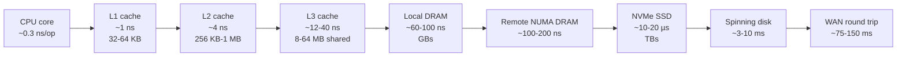
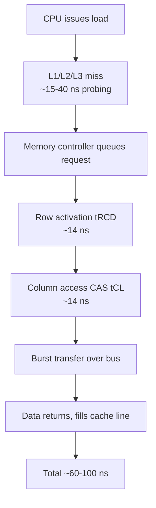
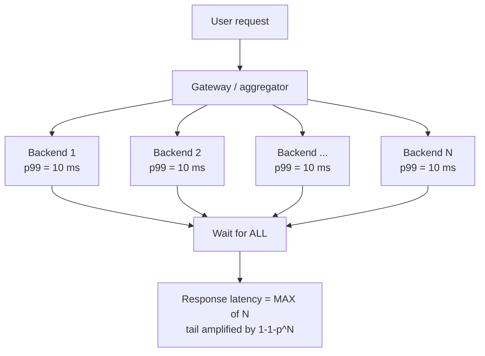
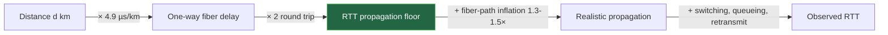
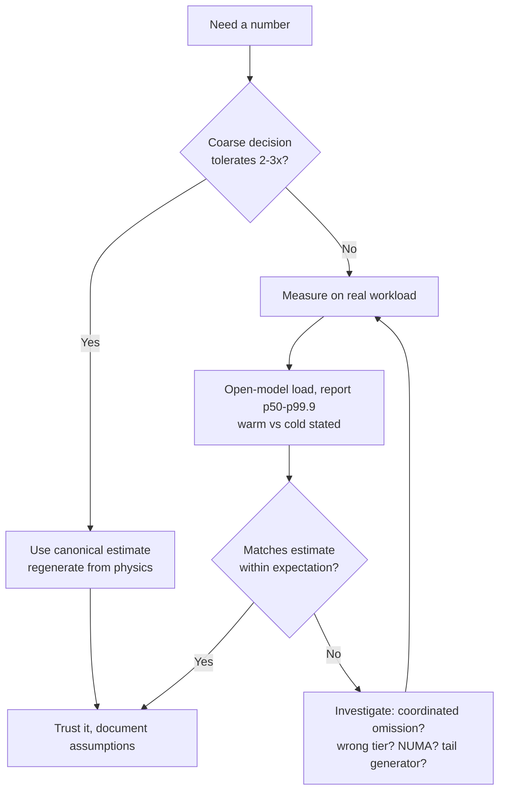

# Numbers Every Engineer Should Know — Theory and Formal Foundations

<!-- level-focus -->
At professional level, focus on this question:

> How should teams adopt and operate **Numbers Every Engineer Should Know — Theory and Formal Foundations** with measurable outcomes and limited coordination?

Use the smallest realistic scenario that exposes the decision and its failure behavior.
The canonical "latency numbers" table is folklore by the time most engineers
meet it: a memorized column of nanoseconds and microseconds, recited in
interviews and forgotten in design reviews. At principal level the table is not
the point. The point is the *generating function* behind it — the physics, the
queueing theory, and the statistics that determine *why* each number is what it
is, *how* it moves across hardware generations, and *when* a back-of-envelope
estimate is load-bearing versus decorative. This document treats the numbers as
derived quantities, not constants. We reconstruct each from first principles so
that when a new storage tier or interconnect appears, you can regenerate the
column instead of waiting for someone to publish a new screenshot.

## 1. Why the Numbers Are Not Constants

Every "number every engineer should know" is the output of a model with
parameters. Memorizing the output without the model produces two failure modes:

- **Stale precision.** Engineers quote "SSD random read = 150 µs" from a 2009
  table while running on NVMe drives that do it in 10–20 µs — a 10× error baked
  into a capacity plan.
- **Category errors.** Treating a latency as a single number when it is a
  distribution, so a design that is "fine on average" misses its SLO at p99
  because the tail was never on the slide.

The remedy is to know the *axis* each number lives on:

| Axis | What sets the floor | What you can change |
|------|---------------------|---------------------|
| Memory hierarchy | Distance + DRAM cell physics + signaling | Access pattern, locality, prefetch |
| Storage | Media physics (flash program time, seek) | Queue depth, batching, tier choice |
| Network (in-DC) | Switch hops + serialization + NIC | Topology, RPC batching, placement |
| Network (WAN) | **Speed of light** + fiber index | *Nothing* — only hide it or move data |
| Tail latency | Queueing + GC + contention | Hedging, fan-out width, isolation |

The speed-of-light row is the one to internalize first, because it is the only
floor that *no engineering effort* can lower. Everything else is a trade you can
make; that one is a constraint you must design around.

---

## 2. The Memory Hierarchy as a Latency Function

Treat memory access as a function `latency(address, pattern, state)`. The
hierarchy exists because a single technology cannot be simultaneously fast,
large, and cheap. Each tier trades capacity for latency along a roughly
logarithmic curve. The key insight is that the *ratios* between tiers — not the
absolute values — are the stable knowledge, because ratios change far more
slowly than absolute speeds.



The orders of magnitude are the headline. From L1 to DRAM is roughly 100×. From
DRAM to NVMe is roughly 100–200×. From NVMe to a transcontinental round trip is
another ~5,000×. The classic teaching trick — scale a CPU cycle to one second —
makes the gulf visceral:

| Tier | Real latency | Scaled (1 cycle = 1 s) | Human analogy |
|------|-------------|------------------------|---------------|
| L1 cache | ~1 ns | ~3 s | Grab a coffee on your desk |
| L2 cache | ~4 ns | ~13 s | Walk to the next room |
| L3 cache | ~12 ns | ~40 s | Walk to the kitchen |
| DRAM | ~100 ns | ~5 min | Drive across town |
| NVMe read | ~15 µs | ~14 hours | Cross-country flight |
| Disk seek | ~5 ms | ~6 months | Sail across an ocean |
| WAN RTT | ~100 ms | ~10 years | A childhood |

> 🎞️ **See it animated:** [Colin Scott — Latency Numbers Every Programmer Should Know (interactive, by year)](https://colin-scott.github.io/personal_website/research/interactive_latency.html)

The animation matters because it lets you *slide the year* and watch which
numbers move and which stay pinned. Disk seek barely improves across two
decades; SSD latency collapses; network RTT is essentially frozen because it is
governed by physics, not Moore's Law.

---

## 3. Cache Lines, DRAM Physics, and Where the Nanoseconds Go

Why is L1 ~1 ns and DRAM ~100 ns? The answer is not "DRAM is slower silicon" —
it is a stack of physical and architectural facts.

### 3.1 The cache line is the true unit of memory traffic

Memory is never moved one byte at a time. The hardware moves **cache lines**,
almost universally **64 bytes** on modern x86 and ARM. This single fact explains
a huge fraction of real-world performance:

- A sequential scan touches one line per 64 bytes, so the *amortized* per-byte
  cost approaches DRAM bandwidth, not DRAM latency.
- A pointer-chasing traversal (linked list, tree of small nodes) pays the full
  ~100 ns latency *per node* because each load depends on the previous one — the
  prefetcher cannot run ahead. This is why an array-backed structure can be 10×
  faster than a "theoretically equivalent" linked structure.

A back-of-envelope you should be able to do instantly: a 64-byte line at ~100 ns
random latency but, say, 20 GB/s streaming bandwidth means **random access is
~30× slower per byte than sequential**. Data layout *is* performance.

### 3.2 Why DRAM access is ~60–100 ns

DRAM latency is the sum of several physical steps, not one:



Each DRAM cell is a tiny capacitor that leaks charge (hence the periodic
*refresh* that makes it "dynamic"). Reading requires *activating* an entire row
into a sense-amplifier buffer (`tRCD`), then selecting a column (`CAS`/`tCL`).
These timings — typically 13–15 ns each on DDR4/DDR5 — are bounded by analog
sense-amplifier settling, not by the clock. They have barely improved in two
decades even as *bandwidth* exploded, which is why DRAM latency is "stuck near
~60–100 ns" while throughput climbs every generation. This is the latency/
bandwidth divergence: vendors widen the pipe far faster than they shorten it.

### 3.3 SRAM vs DRAM, and why L1 is small

L1/L2/L3 are **SRAM**: 6 transistors per bit, no refresh, accessible at near
core clock. SRAM is fast but ~6× larger and more power-hungry per bit than DRAM,
so it cannot scale to gigabytes. L1 is small (32–64 KB) partly because access
time grows with array size — a larger L1 would be slower, defeating its purpose.
The hierarchy is therefore *forced* by physics: you cannot have one flat fast
memory.

### 3.4 NUMA: distance inside the box

On multi-socket servers, "RAM" is not uniform. Each socket has *local* DRAM
reachable in ~60–100 ns and *remote* DRAM (attached to another socket, across an
inter-socket link like UPI) reachable in ~100–200 ns. A thread scheduled on the
wrong socket relative to its data silently pays a ~1.5–2× memory tax. At scale
this is why thread/memory affinity and NUMA-aware allocators exist — the number
"DRAM = 100 ns" is itself a distribution over *which* DRAM.

---

## 4. Latency Is a Distribution, Not a Number

This is the single most important conceptual upgrade from junior to principal
reasoning about numbers. "The service has 20 ms latency" is almost always a lie
of compression. What exists is a *distribution* of response times, and the
distribution's *shape* — specifically its tail — drives user experience and SLO
compliance.

### 4.1 Why the mean is misleading

Latency distributions are heavy-tailed and right-skewed. A handful of requests
hit a GC pause, a cache miss, a lock contention, a packet retransmit, or a
context switch and land at 10–100× the median. The mean is dragged upward by
these but still hides them; the median (p50) ignores them entirely. Neither
tells you what your *slowest* users feel.

The correct vocabulary is **percentiles**:

| Percentile | Meaning | Who it represents |
|------------|---------|-------------------|
| p50 (median) | Half of requests are faster | The "typical" request — least interesting for SLOs |
| p90 | 1 in 10 is slower | Starts to expose contention |
| p99 | 1 in 100 is slower | Standard SLO target; a busy user hits it constantly |
| p99.9 | 1 in 1,000 is slower | Fan-out and retries live here |
| p99.99 | 1 in 10,000 is slower | Where rare-but-systemic faults show |

### 4.2 Why a single user experiences the tail

A naive intuition says "p99 only affects 1% of requests, so it's a minor
concern." This is wrong at the *session* level. If a user's page load issues 100
backend requests, the probability that *at least one* of them lands in the p99
tail is enormous (we derive it in §5). Tail latency is not a rare event for the
user; it is the *common* event for any user whose interaction touches many
services. The p99 of a *component* becomes the p50 of a *page*.

### 4.3 Tail latency has structural causes

Tails are not noise to be averaged away; they have repeatable generators:

- **Queueing.** By Little's Law and the M/M/1 model, as utilization ρ → 1, the
  *mean* wait grows like `1/(1−ρ)` and the tail grows even faster. A system at
  80% utilization already has a p99 several times its p50. Running hot trades
  cost for tail.
- **Stop-the-world events.** GC pauses, compaction, log rotation, TLS
  renegotiation — periodic, correlated, and exactly the events coordinated
  omission (§6) hides.
- **Resource contention.** A noisy neighbor on a shared core, a saturated NIC, a
  flushed page cache.

The principal-level move is to design for the tail explicitly: hedged requests,
request reissue after a deadline, load shedding, and isolation — not to chase a
lower mean.

---

## 5. Tail Amplification at Fan-Out: The 1−(1−p)^N Law

This is the formula that converts "a small tail" into "a guaranteed slow
response," and every senior engineer should be able to derive and apply it on a
whiteboard.

### 5.1 Derivation

Suppose a single backend call has probability `p` of exceeding some latency
threshold `T` (e.g. `p = 0.01` for the p99 boundary). A request fans out to `N`
*independent* backends and must wait for **all** of them (the slowest dominates
— a scatter-gather). The probability that a *given* call is fast (≤ T) is
`1 − p`. The probability that *all N* are fast is `(1 − p)^N`. Therefore the
probability that **at least one** is slow — i.e. the whole fan-out exceeds T — is:

```
P(slow request) = 1 − (1 − p)^N
```

### 5.2 Worked calculation

Take a per-backend tail probability of `p = 0.01` (each backend's p99 = T). How
does the fan-out's chance of being slow grow with N?

| Fan-out N | P(at least one slow) = 1 − 0.99^N | Interpretation |
|-----------|-----------------------------------|----------------|
| 1 | 1.0% | The component's stated p99 |
| 5 | 1 − 0.99⁵ ≈ **4.9%** | A modest request collection |
| 10 | 1 − 0.99¹⁰ ≈ **9.6%** | Now ~1 in 10 page loads is slow |
| 50 | 1 − 0.99⁵⁰ ≈ **39.5%** | Two in five requests hit the tail |
| 100 | 1 − 0.99¹⁰⁰ ≈ **63.4%** | The **majority** of page loads are slow |
| 200 | 1 − 0.99²⁰⁰ ≈ **86.6%** | Tail is now the common case |

Read the bottom rows again. With 100 parallel calls each having a perfectly
respectable 1% chance of slowness, **63% of your user-facing requests will
contain at least one slow call**. The "p99" of a leaf service has become the
*p37* of the aggregate. This is why Google's "The Tail at Scale" paper argues
that at high fan-out, the p99 of components determines the p50 of the service.

### 5.3 A quick approximation

For small `p` and moderate `N`, the expansion `1 − (1 − p)^N ≈ Np` (the first
term of the binomial) is an excellent mental shortcut. With `p = 0.01`, `N = 50`
gives `Np = 0.5` — close to the exact 0.395, and instantly computable. The
approximation overestimates (because it ignores the chance of multiple slow
calls overlapping) but is conservative and fast. When `Np` approaches 1, stop
trusting the linear approximation and use the exact formula.

### 5.4 Design consequences

The formula dictates architecture, not just monitoring:

- **Reduce N.** Fewer, coarser-grained calls per request beat many fine-grained
  ones. Batching collapses N.
- **Lower per-call p.** Tightening a component's p99 helps *super-linearly* at
  the aggregate because of the exponent.
- **Hedge.** Send a duplicate request to a second replica after a short delay
  and take the first to respond. If failures are independent, hedging turns
  `p` into roughly `p²`, crushing the tail. The cost is a few percent extra
  load — a trade the formula tells you is worth it precisely when N is large.



---

## 6. Coordinated Omission: The Measurement Pitfall

You can have correct percentile math and still publish numbers that are wildly
optimistic, because the *measurement* itself is biased. The classic bias is
**coordinated omission**, named by Gil Tene. It is the single most common reason
a load test reports a great p99.9 that the real system never achieves.

### 6.1 The mechanism

Most naive load generators work as a closed loop: send a request, *wait for the
response*, then send the next. Now suppose the system stalls for 1 second (a GC
pause, a failover, a lock convoy). During that second, a well-behaved real-world
client population would have *issued* many requests — say, at 1,000 req/s, a
thousand of them — and every one would have experienced a latency between ~0 and
1 second. But the closed-loop load generator was *blocked* waiting; it issued
**none** of those requests. The long stall is recorded as **one** slow sample
instead of the thousand slow samples it should have produced.

The result: the tail is systematically *under-counted*. The very events that
matter most — the long pauses — are the ones most aggressively omitted, because
they are exactly when the generator stops generating. The omission is
*coordinated* with the system's bad behavior, hence the name.

### 6.2 Why it is so dangerous

The bias is not small and it is not random. A system whose true p99.9 is 1
second can report a p99.9 of a few milliseconds under coordinated omission. The
error grows precisely as the underlying problem grows worse, so the measurement
is least trustworthy exactly when you most need it to be right.

| Aspect | Closed-loop (afflicted) | Open-loop / corrected |
|--------|-------------------------|------------------------|
| Request issuance | Waits for prior response | Issues at fixed schedule |
| Effect of a stall | One slow sample | Many backfilled slow samples |
| Reported p99.9 | Optimistic, often 10–100× low | Reflects real client experience |
| Tail visibility | Hides correlated pauses | Surfaces them |

### 6.3 Corrections

- **Use an open-model load generator** that issues requests on a fixed schedule
  (constant arrival rate) regardless of whether prior responses returned, so
  stalls produce the full set of delayed samples. Tools such as `wrk2` were
  built specifically to fix this.
- **Correct after the fact.** If you know the intended request interval, you can
  synthesize the omitted samples: a response that took longer than the interval
  implies additional virtual requests with linearly decreasing latencies. HdrHistogram
  offers a coordinated-omission-correcting recording mode.
- **Measure with intended rate, not achieved rate.** Always report the *target*
  load you were trying to sustain, and treat the gap between target and achieved
  throughput as a red flag, not a footnote.

The principal lesson: a percentile is only as honest as its sampling process.
Before trusting any latency number, ask *how it was generated* and whether the
generator could have skipped the bad moments.

---

## 7. Physical Floors: The Speed of Light Sets the RTT

Of all the numbers, the network floor is the one you can reason about from pure
physics with no benchmark at all — and the one no amount of engineering can move.

### 7.1 The derivation

Light in a vacuum travels at `c ≈ 299,792 km/s ≈ 3 × 10⁸ m/s`. But signals in a
fiber-optic cable do **not** travel at `c`; they travel at `c / n`, where `n` is
the refractive index of the glass core, typically `n ≈ 1.47`. So the propagation
speed in fiber is:

```
v = c / n ≈ 299,792 / 1.47 ≈ 203,900 km/s ≈ 2.04 × 10⁸ m/s
```

The one-way propagation delay per kilometre is therefore:

```
t_per_km = 1 km / v = 1 / 203,900 s ≈ 4.9 µs/km  (≈ 5 µs/km one way)
```

This is the load-bearing constant: **roughly 5 µs of latency per kilometre of
fiber, one way.** Round trip, it is **~10 µs/km**. Memorize that and you can
estimate any WAN latency floor in your head.

### 7.2 Transcontinental and intercontinental floors

| Path | Approx. fiber distance | One-way floor (×5 µs/km) | RTT floor (×10 µs/km) |
|------|------------------------|--------------------------|-----------------------|
| US coast-to-coast (NYC↔SF) | ~4,200 km | ~21 ms | **~42 ms** |
| London ↔ New York | ~5,600 km | ~28 ms | **~56 ms** |
| US ↔ Europe (typical route) | ~7,500 km | ~37 ms | **~75 ms** |
| US ↔ Singapore | ~15,000 km | ~74 ms | **~148 ms** |
| Antipodal (max on Earth) | ~20,000 km | ~98 ms | **~196 ms** |

These are *floors*. Real cables do not run in straight lines — they follow
coastlines, avoid geopolitical and seabed obstacles, and route through landing
stations. The "great-circle" distance is typically inflated by 1.3–1.5× of
actual fiber path. Add switching, queueing, and the speed-of-light delay through
every router, and observed RTTs are commonly **30–50% above the straight-line
floor**. A real NYC↔London RTT of ~70–80 ms against a ~56 ms floor is normal.

### 7.3 Why this number cannot be engineered away

You can add bandwidth, better routers, TCP tuning, QUIC, and TLS 1.3 0-RTT — and
none of it lowers the propagation floor by a single microsecond, because the
floor is set by `c/n` and geographic distance. The only levers are:

- **Move the data closer.** CDNs, edge compute, and regional replicas exist
  *entirely* to defeat this constant by shrinking the distance term.
- **Reduce round trips.** Each RTT costs the full floor; protocols that need 3
  handshakes pay it three times. This is the whole motivation for connection
  reuse, request pipelining, 0-RTT resumption, and chatty-protocol elimination.
- **Hide it with concurrency.** Prefetch and parallelize so the user waits one
  RTT, not N serial RTTs.



### 7.4 The flip side: in-datacenter is *not* speed-of-light-bound

Inside a datacenter, distances are tens to hundreds of metres, so propagation is
sub-microsecond and *irrelevant*. There, latency is dominated by **serialization**
(time to clock bits onto the wire), **switch hops** (store-and-forward delay per
device), and **software stack** (kernel, NIC, interrupts). A same-rack RTT of
~50–100 µs and a cross-DC-within-region RTT of ~500 µs–1 ms are governed by
those terms, not by `c`. Knowing *which* term dominates at each scale is the
whole skill: physics for WAN, engineering for LAN.

---

## 8. How the Canonical Numbers Shifted: 2009 vs Today

Jeff Dean's "Latency Numbers Every Programmer Should Know" (circa 2009) is the
table everyone memorized. More than fifteen years later, several rows are
obsolete by an order of magnitude, while others are pinned by physics and have
not moved at all. Knowing *which is which* is the difference between a current
estimate and a museum piece.

| Operation | 2009 (Dean) | ~Today | Change | Why |
|-----------|-------------|--------|--------|-----|
| L1 cache reference | ~0.5 ns | ~1 ns | Flat-ish | Bound by SRAM/clock; cores wider not faster-latency |
| Branch mispredict | ~5 ns | ~3–5 ns | Flat | Pipeline depth physics |
| L2 cache reference | ~7 ns | ~4 ns | Slightly better | Cache redesign |
| Mutex lock/unlock | ~25 ns | ~15–25 ns | Flat | Atomic + cache coherence bound |
| Main memory reference | ~100 ns | ~60–100 ns | Slightly better | DRAM latency near-frozen (§3.2) |
| Compress 1 KB (Snappy-class) | ~3 µs | ~0.5–2 µs | Better | Faster cores, SIMD |
| Send 1 KB over 1 Gbps network | ~10 µs (serialization) | ~0.1 µs over 100 GbE | **~100× better** | 1 GbE → 100 GbE+ |
| **SSD random read** | ~150 µs (early SATA SSD) | **~10–20 µs (NVMe)** | **~10× better** | NVMe + PCIe replaced SATA/AHCI |
| Read 1 MB sequentially from memory | ~250 µs | ~30–60 µs | ~5× better | DRAM bandwidth growth |
| Round trip within same datacenter | ~500 µs | ~50–500 µs | Better | Faster switches, RDMA in places |
| Read 1 MB sequentially from SSD | ~1 ms (SATA) | ~50–200 µs (NVMe) | **~5–10× better** | NVMe bandwidth (GB/s) |
| Disk seek | ~10 ms | ~3–10 ms | **Essentially flat** | Mechanical — RPM-bound, unchanged |
| Read 1 MB from spinning disk | ~20 ms | ~5–10 ms | Modestly better | Higher areal density |
| **Transcontinental round trip** | ~150 ms | **~75–150 ms** | **Frozen** | Speed of light — cannot improve (§7) |

### 8.1 The three regimes of change

The table sorts cleanly into three buckets:

1. **Collapsed (≥10×).** Storage and network serialization. NVMe demolished the
   SSD-vs-disk gap on the SSD side; 100 GbE/200 GbE made 1 KB transfers
   essentially free in serialization terms. *Any* design that assumed 2009
   storage numbers is now badly miscalibrated — typically over-provisioning
   caching tiers that NVMe made unnecessary.

2. **Barely moved (~1–2×).** On-die latencies: L1/L2, branch misprediction,
   mutex, DRAM access latency. These are pinned by transistor switching, cache
   array size, and DRAM sense-amplifier settling. Bandwidth grew enormously here;
   *latency* did not. This is the latency/bandwidth divergence again.

3. **Frozen by physics.** WAN round trip and, mechanically, disk seek. The WAN
   number is `c/n × distance` and will be the same in 2050. Disk seek is bounded
   by platter RPM and actuator mechanics; it has been ~stuck for decades, which
   is precisely why the industry routed around it with flash rather than
   improving it.

### 8.2 The SSD-vs-disk gap is the headline shift

In 2009 the table had SSDs at ~150 µs and disk seek at ~10 ms — a ~60× gap. Today
NVMe sits near ~15 µs while disk seek is unchanged at ~5–10 ms — a gap closer to
**~500–1,000×**. The practical consequence is that the *architectural default*
flipped: in 2009 you designed to *avoid* disk and treated SSD as a premium
cache; today flash is the baseline and spinning disk is a cold/archival tier
chosen only for cost-per-byte. Many "clever" disk-avoidance designs from that era
(elaborate in-memory indexes to dodge a seek) are now net-negative complexity
because the NVMe read they avoid costs ~15 µs, not 10 ms.

### 8.3 NUMA and multi-socket realities the 2009 table omits

The original table implicitly assumed a single uniform memory. Modern servers are
multi-socket with NUMA (§3.4), so "main memory reference" is now a *bimodal*
distribution — local vs remote — and a 2× factor hides inside a single row.
Likewise "datacenter round trip" now spans RDMA/kernel-bypass paths (single-digit
µs) and ordinary kernel-stack TCP (hundreds of µs) that differ by 50×. The honest
modern table needs *ranges*, not points, in exactly the rows where the hardware
fractured into tiers.

---

## 9. Measuring vs Assuming: Benchmark Methodology

The numbers in §8 are *defaults for estimation* — useful for back-of-envelope
sizing where being within 2–3× is enough to make a decision. They are **not**
substitutes for measuring your own system. Principal-level discipline is knowing
when an assumed number is good enough and when it must be measured, and measuring
correctly when it must.

### 9.1 When an assumed number is fine

Back-of-envelope estimation (capacity planning, "will this fit in RAM?", "how
many machines?") tolerates 2–3× error because the *decisions* it informs are
coarse — you are choosing between architectures, not tuning a constant. Here the
canonical numbers are a feature: they let you reason in seconds without a
benchmark, and the conclusion ("we need ~50 machines, not 5 or 500") is robust to
the error bars.

### 9.2 When you must measure

You must measure — never assume — when:

- The number sits inside a hot loop where a 30% error changes the architecture.
- You are validating an SLO (you cannot promise p99 you have not measured).
- The workload is *your* workload: access pattern, object size, concurrency, and
  cache state make published numbers off by 10× routinely.

### 9.3 Methodology that produces honest numbers

- **Report the distribution, not the mean.** Always publish p50/p90/p99/p99.9.
  A mean alone is grounds to reject a benchmark.
- **Warm vs cold matters and must be stated.** A cold-cache, cold-JIT,
  cold-page-cache run measures a different thing than steady state. Decide which
  you care about — *both* are valid, but conflating them is not. Discard or
  separately report warm-up.
- **Defeat coordinated omission (§6).** Use an open-model generator and report
  *intended* load. Treat any gap between target and achieved throughput as
  signal.
- **Control the variables.** Pin CPU frequency (disable turbo/scaling for
  reproducibility), isolate cores, control for NUMA placement, and run long
  enough to capture periodic events (GC, compaction) — a 10-second benchmark
  that never sees a GC pause is measuring the wrong distribution.
- **Measure at the boundary you care about.** End-to-end (what the user feels)
  vs component (what you can tune) answer different questions. Tail amplification
  (§5) means component p99 and end-to-end p99 differ by design.
- **Beware the observer effect.** High-resolution timing and tracing add
  overhead; a profiler that perturbs the hot path measures the profiler.

### 9.4 The estimation/measurement loop



The loop is the deliverable. An estimate that you never reconcile against
measurement decays into folklore; a measurement with no estimate to anchor it has
no way to detect that it is wrong by 10×. Principals run both and use each to
audit the other.

---

## 10. A Principal's Reasoning Checklist

When a latency or capacity number shows up in a design review, run it through
this checklist before trusting it:

1. **Which axis is this number on?** Physics-bound (WAN, disk seek), pinned
   on-die (DRAM, cache, mutex), or engineering-bound (storage tier, network
   serialization)? The axis tells you whether it can ever improve.
2. **Is it a point or a distribution?** If someone quotes a single latency,
   demand p50/p99/p99.9. A point estimate of a heavy-tailed quantity is a
   category error.
3. **What is the fan-out N?** Apply `1 − (1 − p)^N`. If N is large, the
   component p99 is the aggregate p50, and you must hedge or batch.
4. **Could coordinated omission be hiding the tail?** Ask how the number was
   measured. Closed-loop generators lie about exactly the events you fear most.
5. **Is the WAN floor respected?** Estimate `~10 µs/km × distance` for RTT. If a
   design promises cross-continent latency below that floor, it is wrong — full
   stop.
6. **Is the number from the right decade?** Is it a 2009 SSD-or-disk assumption?
   Re-derive against NVMe (~15 µs), 100 GbE (~0.1 µs/KB), and NUMA reality.
7. **Estimate vs measurement — which is this, and do they agree?** If it is an
   estimate driving a coarse decision, fine. If it is load-bearing for an SLO,
   it must be measured on the real workload, warm/cold stated, open-model.

The throughline: every "number every engineer should know" is the output of a
model. Know the model — the cache line, the DRAM cell, the binomial tail, the
speed of light in glass — and you never have to memorize a stale table again.
You regenerate the column on demand, you know which rows are frozen and which
will shift next generation, and you can tell at a glance when a number in a
design doc is folklore rather than physics.


---

## Apply it

1. Define the user or business outcome that **Numbers Every Engineer Should Know — Theory and Formal Foundations** should improve.
2. Assign one owner for code, contracts, operations, and incidents.
3. Split delivery into reversible increments that produce evidence early.
4. Publish responsibilities, escalation paths, and compatibility windows.
5. Stop or expand only when the agreed measures support that decision.

## Verify your work

- Each increment has an owner, rollback path, and observable exit condition.
- Adoption, reliability, delivery time, and coordination cost are measured.
- Incident and migration exercises prove that responsibility is executable.
- The old path is removed only after telemetry proves it is unused.

## Review questions

- Which measurable outcome justifies investing in Numbers Every Engineer Should Know — Theory and Formal Foundations?
- Which team owns the full lifecycle and incident response?
- What reversible increment produces the earliest useful evidence?
- Which exit condition proves that migration or adoption is complete?
