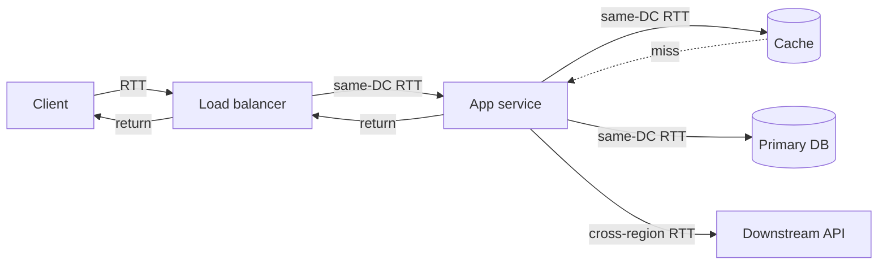
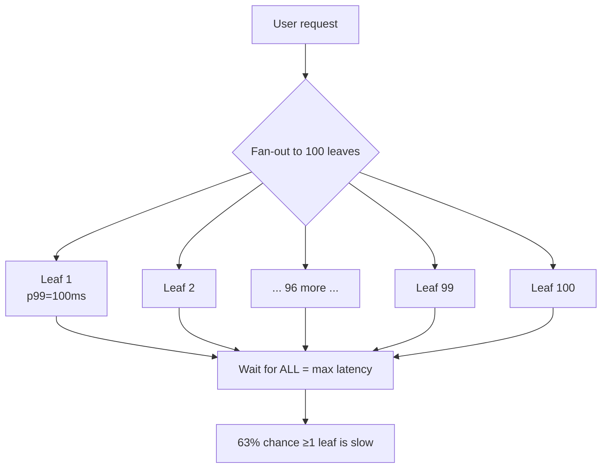
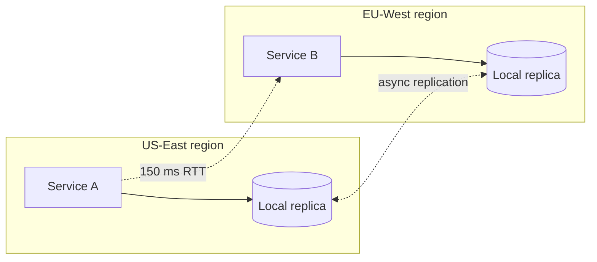
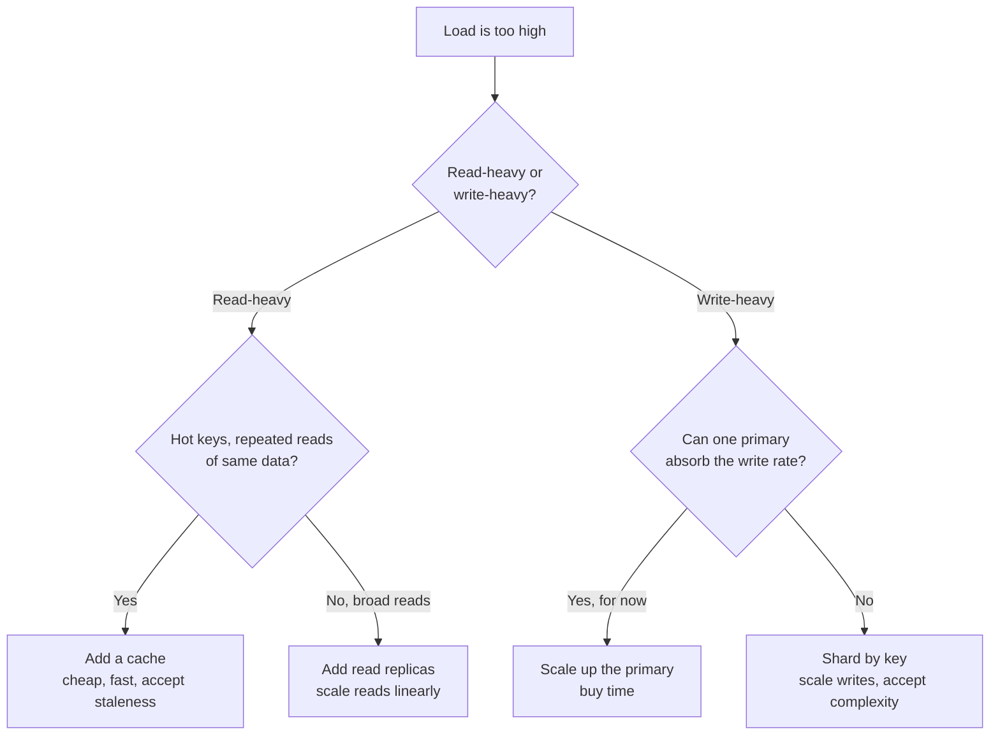

# Numbers Every Engineer Should Know — Senior

<!-- level-focus -->
At senior level, focus on this question:

> Which system invariant is affected by **Numbers Every Engineer Should Know** under failure, load, and change?

Use the smallest realistic scenario that exposes the decision and its failure behavior.
At the junior level the latency numbers are trivia you memorize. At the senior
level they are *evidence*. They are how you defend a design in a review, how you
size a fleet before you provision it, how you reject a teammate's plan in thirty
seconds without writing a line of code, and how you turn a vague SLO ("the page
should feel fast") into a contract each component must honor. This document is
about *using* the numbers — composing them down a call path, budgeting them,
and recognizing the exact moment a single number forces a design change.

## 1. The numbers, refreshed and rounded

You do not need the table to four significant figures. You need *orders of
magnitude* and the *ratios between them*, because the ratios are what survive
hardware generations. Round aggressively. Here is the working set, normalized so
the relationships jump out.

| Operation | Latency | Relative to L1 (≈1 ns) | Mental anchor |
|---|---|---|---|
| L1 cache reference | 1 ns | 1× | "free" |
| Branch mispredict | 3 ns | 3× | |
| L2 cache reference | 4 ns | 4× | |
| Mutex lock/unlock | 17 ns | 17× | |
| Main memory reference | 100 ns | 100× | RAM is 100× L1 |
| Compress 1 KB (snappy) | 2 µs | 2,000× | |
| Read 1 MB sequentially from RAM | 3 µs | 3,000× | |
| SSD random read | 16 µs | 16,000× | SSD ≈ 150× RAM |
| Read 1 MB sequentially from SSD | 49 µs | 49,000× | |
| Round trip within same datacenter | 500 µs | 500,000× | |
| Read 1 MB sequentially from disk (HDD) | 825 µs | ~825,000× | |
| Disk seek (HDD) | 2 ms | 2,000,000× | HDD seek ≈ 20× DC RTT |
| Round trip CA → Netherlands → CA | 150 ms | 150,000,000× | speed of light tax |

> 🎞️ **See it animated:** [Latency numbers every programmer should know — Colin Scott](https://colin-scott.github.io/personal_website/research/interactive_latency.html)

Three ratios are worth burning into memory because every architecture argument
eventually reduces to one of them:

- **RAM is ~100× faster than the network within a datacenter** (100 ns vs
  ~500 µs round trip → memory access is ~5,000× cheaper than a same-DC RTT once
  you count the full round trip, ~100× cheaper than the one-way wire time of a
  small packet). This is *why* caches exist.
- **A same-datacenter round trip is ~300× faster than a cross-region one**
  (500 µs vs 150 ms). This is *why* you replicate data instead of reading across
  the planet.
- **An SSD random read is ~150× slower than RAM but ~10× faster than a network
  round trip** (16 µs vs 500 µs). This is *why* local SSD beats a remote cache
  for some workloads, and why "just add Redis" is not automatically a win.

Everything below is the application of these three ratios.

---

## 2. Composing latency down a call path

A request is not one operation. It is a *chain* of hops, and end-to-end latency
is the **sum of the time spent in each hop plus the wire time between them**.
The senior skill is decomposing a request into its hops and assigning a number
to each.

Consider a read request for a user's profile page. The path:



The total latency the client perceives is:

```
T_total = T_client_LB
        + T_LB_service
        + T_service_logic
        + T_cache_lookup        (cache hit path)
        + T_db_query            (only on cache miss)
        + T_downstream_call     (if the request needs it)
        + serialization + queueing at every hop
```

Two non-obvious truths a senior engineer internalizes:

1. **Hops compose additively on the critical path, but only if they are
   sequential.** Work you can do in parallel (fanning out to the cache and the
   downstream API simultaneously) composes as `max()`, not `sum()`. Restructuring
   sequential hops into parallel ones is one of the cheapest latency wins
   available — no new hardware, just reordering the call graph.

2. **The dominant term is usually the slowest single hop, not the count of
   hops.** Ten same-DC round trips (10 × 500 µs = 5 ms) are invisible next to one
   cross-region call (150 ms). When you optimize, find the biggest term first.
   Engineers waste weeks shaving microseconds off in-process code while a single
   synchronous cross-region call sits on the path eating 150 ms.

---

## 3. A worked p50/p99 latency budget

Let's make it concrete. Suppose the SLO is **p99 ≤ 200 ms** for the profile read,
measured at the load balancer. We walk the path and assign a p50 and a p99 to
each component. The p99 of a component is typically **2×–10× its p50**, driven by
GC pauses, queueing, lock contention, a cold cache, or a slow replica.

| Hop | p50 | p99 | What sets the p99 |
|---|---|---|---|
| Client → LB (TLS terminated) | 1 ms | 5 ms | client network jitter, TLS resumption miss |
| LB → service routing | 0.3 ms | 2 ms | connection pool wait, health-check churn |
| Service request parsing + auth | 1 ms | 8 ms | token validation, GC pause |
| Cache lookup (Redis, same DC) | 0.6 ms | 3 ms | RTT + occasional Redis slow command |
| DB query (on cache miss only) | 4 ms | 40 ms | index scan vs seq scan, lock wait, replica lag |
| Downstream API (same region) | 15 ms | 90 ms | their tail, their GC, their queue |
| Serialization + response | 0.5 ms | 4 ms | large payload, JSON marshalling |
| **End-to-end (cache hit)** | **~3.4 ms** | **~22 ms** | dominated by downstream if called |
| **End-to-end (cache miss)** | **~22 ms** | **~150 ms** | DB tail + downstream tail stack up |

Read the table the way a reviewer reads it:

- **On the happy path (cache hit, no downstream), you are spending ~3 ms at p50
  and ~22 ms at p99.** You have enormous headroom under the 200 ms SLO. Good.
- **The cache-miss path is where the budget is consumed.** At p99 the DB (40 ms)
  and the downstream (90 ms) together account for 130 of the ~150 ms. If your
  cache hit rate is 90%, then 10% of requests take that path — and because of how
  percentiles work, your *overall* p99 is the cache-miss p99, ~150 ms. The
  happy-path number is a comfort, not a guarantee.
- **The downstream API is your single largest p99 term.** It is also the term you
  control least, because it is someone else's service. This is the line a senior
  engineer circles in the review and says: "What happens to our p99 when their
  p99 doubles? Do we have a timeout? A fallback? Is this call even on the critical
  path, or can it be async?"

The arithmetic that matters: **the end-to-end p99 is not the sum of the
component p99s** (that would be pessimistic — they don't all hit their tail on the
same request), but it is *much* closer to the sum than to the sum of the p50s.
A safe senior heuristic for a sequential path of independent hops:

> end-to-end p99 ≈ sum of component p99s of the **2–3 slowest hops** + sum of
> component p50s of the rest.

For the cache-miss path: `90 (downstream p99) + 40 (DB p99) + 3.4 (rest at p50)
≈ 133 ms`, comfortably under 200 ms but with little margin if either dependency
degrades.

---

## 4. Why tail latency dominates fan-out

The single most counterintuitive number-driven insight for a senior engineer:
**if a request fans out to N services and waits for all of them, the request's
latency is the *maximum* of N draws, and the max is governed by the tail, not
the median.**

Suppose one backend has a p99 of 100 ms — meaning 1 in 100 calls is slow. If a
single user request fans out to 100 such backends and must wait for all, the
probability that *at least one* of them lands in its slow 1% is:

```
P(at least one slow) = 1 − (0.99)^100 ≈ 1 − 0.366 = 0.634
```

So **63% of fan-out requests hit at least one 100 ms straggler.** A p99-per-leaf
service produces a p63 user experience under 100× fan-out. This is Jeff Dean's
"The Tail at Scale" result, and it is pure number sense — no system knowledge
required, just `(0.99)^100`.



**Design consequences this number forces:**

- Use **hedged requests** (send a second copy after p95, take the first
  response) to convert a tail problem into a median problem.
- **Limit fan-out width** or use **partial-response / "good enough" quorum**
  patterns (return after 95 of 100 leaves answer).
- Treat the p99 of any leaf service as *the* number that determines aggregate UX,
  not its p50. When a teammate optimizes a leaf's median, ask what happened to
  its tail.

---

## 5. Turning an SLO into a per-component budget

An SLO is a top-line promise. A *budget* is that promise decomposed and allocated
to each component, so each team knows its individual target. This is the senior
move that turns "we have a latency problem" into "the recommendation service is
over its 30 ms allocation."

The procedure:

1. **State the SLO at a measurement point.** "p99 ≤ 200 ms measured at the edge
   LB, for the profile read endpoint." Ambiguity here ("the page feels slow")
   makes every downstream decision unfalsifiable. Pin the percentile, the number,
   and where it's measured.

2. **Enumerate the critical-path components.** Only the path that blocks the
   response counts. Async/background work is out of the budget.

3. **Reserve a buffer.** Never allocate 100% of the SLO. Reserve ~20–30% for
   queueing, retries, and the gap between component-p99 sums and end-to-end p99.
   For a 200 ms SLO, budget against ~150 ms.

4. **Allocate the budget proportional to each component's irreducible cost and
   its variance.** A cross-region call gets a big slice because physics demands
   it; an in-memory cache lookup gets a tiny one.

5. **Make each allocation a measurable per-component SLO** that the owning team
   commits to and alerts on.

| Component | Allocated p99 budget | Rationale |
|---|---|---|
| Edge + LB + TLS | 10 ms | network jitter + termination, mostly fixed |
| Auth + request parsing | 10 ms | token validation; cacheable |
| Cache layer | 5 ms | same-DC RTT; should be tiny |
| Database (miss path) | 40 ms | indexed query + connection acquisition |
| Downstream service | 70 ms | their committed p99; the largest slice |
| Serialization + egress | 5 ms | keep payloads small |
| **Sum of allocations** | **140 ms** | |
| **Reserved buffer** | **60 ms** | absorbs cross-correlation + retries |
| **Total SLO** | **200 ms** | |

Now the budget is a *contract*. If the downstream team wants 90 ms instead of 70,
that 20 ms has to come from someone else's slice or from the buffer — and that's
a negotiation with numbers, not opinions. This is how senior engineers prevent
the "everyone optimistically assumes they get most of the budget" failure that
silently blows SLOs.

---

## 6. When a number forces a design change

Some numbers don't suggest a design — they *eliminate* options. The senior skill
is recognizing the moment a single figure makes an entire class of design
infeasible, before you've built it. Here is the table to keep in your head.

| The number | What it kills | The forced design |
|---|---|---|
| Cross-region RTT ≈ 150 ms | Synchronous cross-region reads on the hot path | Replicate data into each region, or relax consistency (read local, accept staleness) |
| Same-DC RTT ≈ 500 µs × N hops | Chatty designs with many sequential service calls | Batch calls, denormalize, parallelize, or co-locate |
| Disk seek ≈ 2 ms (HDD) | Random-access workloads on spinning disk | Move to SSD, or restructure to sequential I/O / log-structured storage |
| RAM is 100× faster than a same-DC RTT | "Just add a remote cache" for tiny, hot values | Use an in-process cache for the hottest keys; remote cache for the long tail |
| 1 Gbps NIC ≈ 125 MB/s | Streaming large blobs through an app tier | Offload to a CDN / object store with signed URLs; don't proxy bytes |
| Single Postgres ≈ thousands of writes/s | Write-heavy growth on one primary | Shard by key, or move hot writes to a log/queue and batch |
| p99 per leaf × 100-way fan-out | "It's fine, each service is p99=100 ms" | Hedge, limit fan-out, or return partial responses |
| GC pause ≈ 10–100 ms | Sub-10 ms p99 on a GC'd runtime under load | Tune/right-size heaps, use a low-pause collector, or a non-GC runtime for the hot path |

The discipline: when someone proposes a design, find the largest unavoidable
number on its critical path and ask whether the design can survive it. If the
proposal requires a synchronous cross-region read on every request and the SLO is
p99 ≤ 100 ms, the proposal is dead on arrival — 150 ms > 100 ms, full stop, no
prototype needed. You just saved a sprint.

---

## 7. The cross-region wall

The 150 ms number deserves its own section because it is the most common
architecture-killer and the one juniors most often underestimate. It is set by
the **speed of light in fiber** (~200,000 km/s, roughly 2/3 of c in vacuum) plus
routing and switching overhead. You cannot optimize it away with better code,
faster servers, or more money. Physics doesn't take a budget.



What the number forces, in order of preference:

- **Read local, replicate async.** Put a replica in every region the request
  originates from. Reads stay ~1 ms; writes propagate asynchronously. You accept
  *eventual consistency* — a write in US-East may not be visible in EU-West for a
  replication-lag window (tens to hundreds of ms). The number tells you the price
  of the alternative (150 ms per synchronous read) is too high to pay on the hot
  path.

- **Relax consistency deliberately.** If the use case can tolerate stale reads
  (social feeds, product catalogs, view counts), the 150 ms number makes the
  decision for you: never read across regions synchronously. If it *cannot*
  tolerate staleness (account balances at the point of a transfer), then you
  confine the strongly-consistent operation to a single region and route those
  requests there — eating the 150 ms only for the rare cross-region case, not the
  common one.

- **Pin the user to a home region.** Route each user to one region and keep their
  writes there, so the cross-region RTT is paid only during failover or when they
  travel — not on every request.

The senior framing in a review: "This design reads inventory from the primary in
us-east on every checkout, but 40% of our traffic is in Europe. That's 150 ms
added to 40% of checkouts. Our checkout SLO is p99 ≤ 300 ms and that one call
already consumes half of it before we've done any work. We need a regional
read replica or we need to make this read eventually consistent."

---

## 8. Sizing fleets with throughput numbers

Latency tells you whether a single request is fast enough. **Throughput tells you
how many machines you need.** The conversion is Little's Law and a one-line
division, and a senior engineer does it before opening the cloud console.

The core relationship for a single server:

```
max throughput (req/s) ≈ concurrency / per-request latency
```

If each request holds a worker for 20 ms and a server runs 200 concurrent
workers, one server handles `200 / 0.020 = 10,000 req/s` — *if* nothing else is
the bottleneck (CPU, the DB connection pool, downstream limits). Always sanity
this against the resource the request actually consumes.

**Worked fleet-sizing example.** Target: serve **50,000 req/s at steady state**,
each request costs ~10 ms of CPU-bound work, servers have 8 cores.

```
Per-server capacity ≈ cores / per-request CPU time
                    = 8 cores / 0.010 s
                    = 800 req/s per server (CPU-bound, 100% utilization)
```

Never size to 100% utilization — queueing latency explodes as you approach
saturation (the M/M/1 curve goes vertical near ρ=1). Size to ~60–70%:

```
Usable per-server ≈ 800 × 0.65 ≈ 520 req/s
Servers needed     = 50,000 / 520 ≈ 96 servers
Add redundancy (N+2, AZ spread, headroom for spikes) ≈ 110–120 servers
```

That number — ~120 servers — is now defensible. You can put it in a capacity doc,
attach a cost, and have a budget conversation grounded in arithmetic rather than
"feels like a lot." If someone proposes 300 servers, you can challenge it; if
someone proposes 30, you can show why it queues to death.

The same division sizes every other resource:

| Resource | Number to know | Fleet/capacity question it answers |
|---|---|---|
| CPU | cores ÷ per-req CPU time | How many app servers? |
| DB connections | pool size ÷ avg query hold time | How many concurrent queries before pool exhaustion? |
| Network | 125 MB/s per Gbps NIC | Can one host serve this bandwidth, or do I need a CDN? |
| Memory | working-set size ÷ RAM per host | How many hosts to keep the cache hot? |
| Disk IOPS | required IOPS ÷ per-device IOPS | SSD count, or is this a sequential-only workload? |

---

## 9. Deciding cache vs. replica vs. shard

When load grows, three scaling levers are available, and the numbers tell you
which one the problem demands. Misdiagnosing this is the most expensive mistake
in the section, because each lever has a different cost and operational burden.



The numbers behind each branch:

- **Cache** when the same data is read far more often than it changes. Quantify:
  if a key is read 1,000× per write, a cache with that key serves ~99.9% of reads
  from RAM (~100 ns) instead of the DB (~ms). The decision number is the
  **read/write ratio** and the **hit rate** it produces. A cache is the cheapest
  lever — one Redis cluster can offload most read load — but it adds a staleness
  window and an invalidation problem. If the read/write ratio is near 1, a cache
  buys you almost nothing; don't add it.

- **Read replicas** when reads are broad (low cache hit rate) but the workload is
  still read-dominated. Each replica adds roughly one primary's worth of read
  capacity. The decision number: `replicas needed ≈ read QPS / per-node read
  capacity`. Replicas don't help writes at all — every write still goes to the
  primary and then to every replica, so beyond a point replicas *increase* total
  write work.

- **Shard** when **writes** exceed what a single primary can absorb, or when the
  dataset no longer fits on one node. The decision number is the **write QPS vs.
  single-primary write ceiling** (often a few thousand to low tens of thousands of
  writes/s for a relational primary, depending on row size and durability
  settings). Sharding scales writes linearly but is the most expensive lever:
  cross-shard queries, rebalancing, and transactional boundaries all get harder.
  You shard because a number forced you to, never because it sounds scalable.

The senior anti-pattern to call out: reaching for sharding (huge complexity) when
the workload is read-heavy with hot keys (a cache would have solved it for 1% of
the effort). Or adding read replicas to fix a *write* bottleneck (they make it
worse). The numbers — read/write ratio, hit rate, write ceiling — disambiguate
these in seconds.

---

## 10. The 30-second sanity check

The highest-leverage use of these numbers is rejecting or validating a claim
without building anything. A senior engineer hears "we'll store every event and
query them in real time" and immediately runs the arithmetic in their head. The
template:

```
estimate = rate × size × time   (for storage)
         = rate × per-item cost  (for compute/latency)
```

**Example 1 — a storage claim.** "We'll keep one year of clickstream, 50,000
events/s, ~1 KB each, in a single Postgres table and query it interactively."

```
50,000 events/s × 1 KB = 50 MB/s
× 86,400 s/day          ≈ 4.3 TB/day
× 365                   ≈ 1.6 PB/year
```

1.6 PB does not live in one Postgres table you query interactively. The claim is
false on its face — in 30 seconds, no prototype. The forced redesign: tiered
storage, columnar/OLAP store, aggregation-on-ingest, and retention tiers.

**Example 2 — a latency claim.** "Our service does 5 sequential calls to a
cross-region dependency and still hits p99 ≤ 100 ms."

```
5 × 150 ms cross-region RTT = 750 ms, minimum, just for the wire
```

750 ms ≫ 100 ms. The claim is impossible regardless of how good their code is.
Either the calls aren't actually cross-region, or they aren't sequential, or the
SLO isn't being met. The number exposes the contradiction instantly.

**Example 3 — a bandwidth claim.** "One app server will stream 4K video to
10,000 concurrent users."

```
4K stream ≈ 25 Mbps per user
× 10,000 users = 250,000 Mbps = 250 Gbps
```

A single host has a ~10–25 Gbps NIC at best. 250 Gbps is 10–25× over the wire
capacity of one machine. The claim is off by an order of magnitude; the work
belongs on a CDN, not an app server. Thirty seconds, settled.

The pattern in all three: **multiply a rate by a per-unit cost, compare to a
known ceiling.** If the result is over the ceiling by an order of magnitude, the
claim is wrong and you've saved the team from building it.

---

## 11. Failure modes of estimation

Numbers are powerful, but misapplied they mislead with false confidence. Seniors
know the traps.

- **Averaging percentiles.** You cannot average two p99s to get a combined p99.
  Percentiles don't add or average like means. Compose tails using the heuristic
  in §3 (sum the worst few component p99s), and measure end-to-end directly.

- **Using p50 to reason about user experience under fan-out.** As §4 showed, the
  median is nearly irrelevant when a request waits on many things. Always carry
  the tail.

- **Forgetting queueing.** All the per-operation numbers assume an idle system.
  At 80% utilization, queueing can add multiples to latency. Size to 60–70% and
  treat the textbook numbers as floors, not expectations under load.

- **Trusting a single number across hardware generations.** The *ratios* are
  durable; absolute SSD/network numbers improve over time. Re-derive from current
  ratios, don't quote a 2012 table as gospel.

- **Counting hops instead of time.** Ten cheap hops can matter less than one
  expensive one. Always convert hop counts to time before optimizing.

- **Ignoring serialization, retries, and connection setup.** TLS handshakes,
  cold connection pools, and retries (which *multiply* latency) are real terms
  that don't appear in the canonical table but routinely dominate the tail.

- **Estimating to false precision.** "47,312 servers" is a red flag. The point of
  these numbers is order-of-magnitude correctness. Round to one significant
  figure and state assumptions.

---

## 12. Senior takeaways

- **End-to-end latency is the sum of sequential hops and the max of parallel
  ones.** Decompose every request into hops, assign a number to each, find the
  biggest term, and optimize *that*. Reordering sequential into parallel is a
  free win.

- **Budget the SLO, don't hope for it.** Turn the top-line p99 into a per-
  component allocation with a reserved buffer, and make each allocation a
  contract a team owns. This is how SLOs are defended, not just declared.

- **The tail governs fan-out.** Under N-way fan-out, the user sees the max, and
  the max is set by per-leaf p99, not p50. `(0.99)^100 ≈ 0.37` is the number that
  justifies hedging, fan-out limits, and partial responses.

- **Some numbers eliminate designs.** A 150 ms cross-region RTT kills synchronous
  cross-region reads on a tight SLO — replicate or relax consistency. Recognize
  these walls *before* prototyping.

- **Throughput numbers size fleets.** `capacity = resource ÷ per-request cost`,
  derate to ~65%, add redundancy. Now your server count is defensible arithmetic.

- **Read/write ratio, hit rate, and write ceiling pick the scaling lever.** Cache
  for hot repeated reads, replicas for broad reads, shards only when writes
  exceed one primary. Misdiagnosing this is the most expensive mistake.

- **A 30-second estimate beats a 3-week prototype for rejecting bad claims.**
  Multiply rate by per-unit cost, compare to a known ceiling. If it's over by an
  order of magnitude, the claim is wrong — say so, with the arithmetic.

The numbers are not trivia. They are the evidence behind every architecture
decision you will defend. Memorize the ratios, practice the composition, and you
will reason about latency and capacity faster and more correctly than any
intuition allows.

*Next step:* [Professional level](professional.md)

---

## Apply it

1. State the system invariant that **Numbers Every Engineer Should Know** must protect.
2. Mark ownership, state, and failure propagation at each boundary.
3. Compare two designs under load, dependency failure, and future change.
4. Define recovery and compatibility behavior before implementation.
5. Test the riskiest assumption with a focused experiment.

## Verify your work

- The experiment supports the design with evidence, not preference.
- Failure injection shows the blast radius and recovery path.
- Compatibility checks cover old and new callers or data.
- Operational signals reveal invariant violations and recovery progress.

## Review questions

- Which invariant must remain true when Numbers Every Engineer Should Know fails?
- Where should recovery responsibility live, and why?
- Which assumption deserves an experiment before implementation?
- How can the design evolve without changing every consumer at once?
