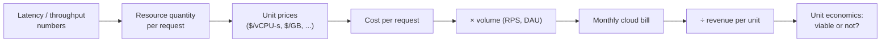
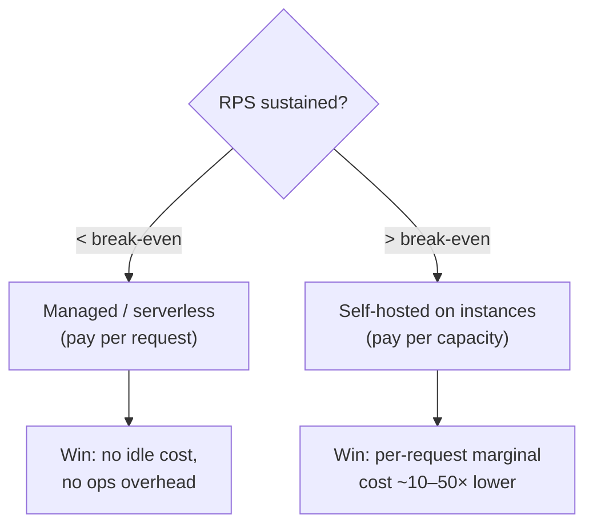
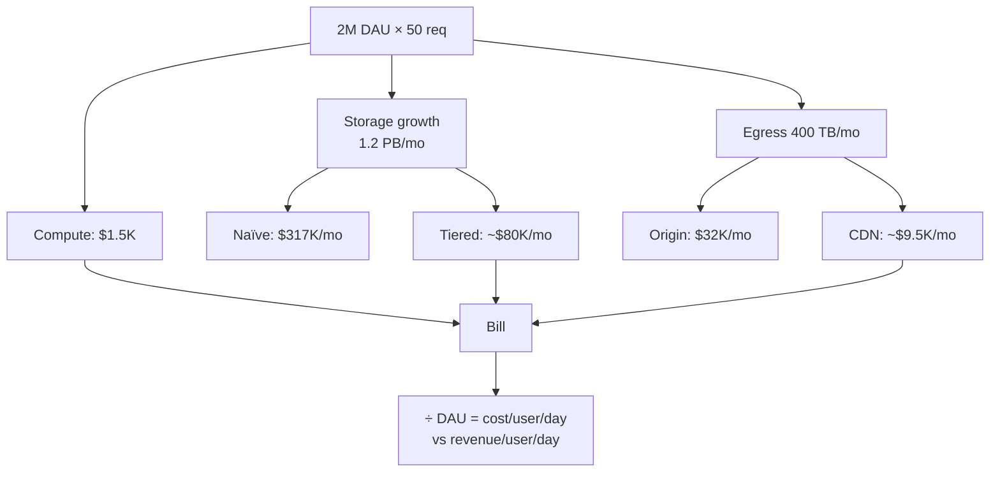
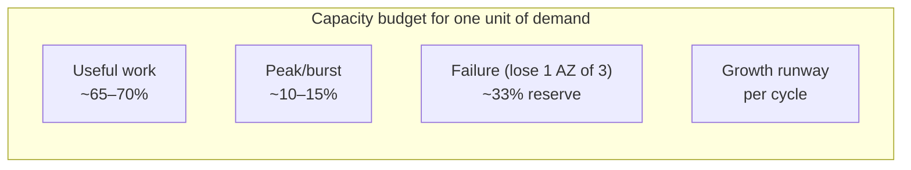

# Numbers Every Engineer Should Know — Staff / Principal Level

At junior and mid levels, the canonical latency numbers are a debugging aid: they tell you whether a request *should* be fast. At the senior level, they become a capacity-planning instrument: they tell you how many machines you need. At the **staff and principal level**, the same numbers become an **economic instrument**. They are the raw inputs to a cost model that decides whether an architecture is viable at all — before a single line of code is written, before a single instance is provisioned.

This document is not more latency theory. It is about turning the numbers every engineer should know into the numbers every *organization* should know: cost per request, cost per user, cost per GB stored, cost per GB egressed, and the headroom math that keeps a fleet from falling over at peak. The skill being taught here is the one that separates a staff engineer's design review comment from a mid engineer's: *"this works"* versus *"this works and it will cost us $1.4M/year, which is 6× the revenue this feature generates."*

---

## Table of Contents

1. [From Latency Numbers to a Cost Model](#1-from-latency-numbers-to-a-cost-model)
2. [The Unit-Economics Mindset](#2-the-unit-economics-mindset)
3. [Cloud Bill Estimation Before Committing to an Architecture](#3-cloud-bill-estimation-before-committing-to-an-architecture)
4. [Egress: The Silent Killer](#4-egress-the-silent-killer)
5. [A Worked Example: Architecture to Monthly Bill](#5-a-worked-example-architecture-to-monthly-bill)
6. [Capacity Planning with Utilization Headroom](#6-capacity-planning-with-utilization-headroom)
7. [When a Number Reveals the Architecture Is Unviable](#7-when-a-number-reveals-the-architecture-is-unviable)
8. [Building the Company's Own Numbers Reference](#8-building-the-companys-own-numbers-reference)
9. [Cargo-Culted Constants That No Longer Hold](#9-cargo-culted-constants-that-no-longer-hold)
10. [The Staff Engineer's Cost Review Checklist](#10-the-staff-engineers-cost-review-checklist)
11. [Key Takeaways](#11-key-takeaways)

---

## 1. From Latency Numbers to a Cost Model

The classic "Latency Numbers Every Programmer Should Know" table (L1 ~1ns, main memory ~100ns, SSD random read ~16µs, network round trip within a datacenter ~0.5ms, cross-continent ~150ms) tells you what is *physically* possible. The staff-level move is to attach a **dollar denominator** to each operation.

Every architecture is, at bottom, a function that maps a unit of user demand onto a quantity of four billable resources:

| Resource | What you pay for | Typical cloud unit |
|---|---|---|
| **Compute** | vCPU-seconds, memory-GB-seconds | per instance-hour or per million invocations |
| **Storage** | GB stored per month + IOPS/operations | per GB-month + per million ops |
| **Network egress** | GB leaving a boundary (AZ / region / internet) | per GB, tiered |
| **Managed-service fees** | per-request / per-row / per-GB-scanned | per million requests, per GB processed |

A cost model is just the arithmetic that converts *one request* into *some quantity of each of those four*, multiplies by unit prices, and then multiplies by volume. The latency numbers feed directly into the compute term: a request that spends 200ms of CPU costs roughly 20× one that spends 10ms, because you can pack 20× fewer of them onto the same core.



The discipline is to *always carry the denominator*. A mid engineer says "the cache cuts latency from 80ms to 4ms." A staff engineer says "the cache cuts the compute cost of a read from $0.0000044 to $0.0000002 *and* adds $0.000001 of Redis cost, so it's a net win above ~5% hit rate, and it pays for the Redis cluster at ~12k RPS."

---

## 2. The Unit-Economics Mindset

The fundamental question staff engineers ask of any design is: **what does one unit of the business cost to serve, and is that less than what one unit earns?**

The "unit" depends on the business: a search query, a video minute streamed, a message delivered, a transaction processed, a monthly active user. Pick the unit that the *revenue* is denominated in, so cost and revenue share a denominator and the comparison is honest.

### A unit-economics reference table

The following is the kind of table a staff engineer maintains for their domain. Numbers are illustrative but realistic order-of-magnitude figures for commodity cloud pricing circa mid-2020s; **always re-derive against your own provider's current price sheet** — that is the whole point of this document.

| Operation | Resource breakdown | Approx. cost | Notes |
|---|---|---|---|
| 1M simple HTTP requests (10ms CPU, stateless) | ~2.8 vCPU-hours compute | ~$0.10–$0.30 | At 70% utilization on commodity vCPUs |
| 1M Lambda-style invocations (128MB, 50ms) | per-invoke + GB-s | ~$0.30–$0.40 | Per-request fee dominates at low memory |
| 1 GB stored on object storage / month | GB-month | ~$0.021–$0.023 | "Standard" tier; cold tiers ~10× cheaper |
| 1 GB stored on block SSD / month | provisioned GB-month | ~$0.08–$0.12 | Provisioned whether used or not |
| 1M object-storage GET requests | per-request fee | ~$0.40 | PUT/POST ~10× the GET price |
| 1 GB internet egress | tiered per-GB | ~$0.05–$0.09 | First tier; drops with volume + commits |
| 1 GB cross-AZ traffic | per-GB each direction | ~$0.01–$0.02 | Often *both* in and out are billed |
| 1M managed-DB row reads (provisioned) | RCU/IOPS | ~$0.05–$0.25 | Wildly model-dependent |
| 1M relational queries (managed Postgres) | amortized instance | ~$0.02–$0.10 | Depends on query weight & instance size |

The single most important row to internalize: **egress is 2–4× the price of storing the same byte for a month, and 1000× the price of moving it within an AZ.** Section 4 is dedicated to it for a reason.

### Cost per user, derived

If your average user generates 200 requests/day, stores 50 MB, and pulls down 100 MB/month over the internet:

- Compute: 200 × 30 = 6,000 req/mo × ~$0.0000002/req ≈ **$0.0012**
- Storage: 0.05 GB × $0.023 ≈ **$0.00115**
- Egress: 0.1 GB × $0.08 ≈ **$0.008**

Cost per user ≈ **$0.0103/month**, dominated by *egress*, not compute. That is the non-obvious insight the numbers force out. If this is an ad-supported product earning $0.04/user/month, the gross infra margin is ~74% — healthy. If it earns $0.008/user/month, you are underwater on serving cost alone, and no amount of CPU optimization fixes it because CPU is 12% of the bill.

---

## 3. Cloud Bill Estimation Before Committing to an Architecture

The cheapest time to discover an architecture is too expensive is in the design doc, not the quarterly finance review. Back-of-envelope billing is the staff-level analogue of back-of-envelope capacity planning — same arithmetic, different denominator.

### The five-line estimate

For any proposed design, write these five lines before the design review:

1. **Compute:** peak RPS × CPU-seconds/req ÷ utilization target × $/vCPU-hour × hours/month.
2. **Storage:** dataset size × growth-adjusted × ($/GB-month) + replication factor.
3. **Egress:** bytes/request × RPS × seconds/month × $/GB, *segmented by boundary* (internet vs cross-region vs cross-AZ).
4. **Managed-service per-request fees:** RPS × seconds/month × ($/request) for every managed hop (API Gateway, queue, DB, cache, log ingestion).
5. **Fixed floor:** load balancers, NAT gateways, idle minimums, support plan, observability ingestion.

People consistently forget lines 3, 4, and 5. The **NAT gateway** and **log/metric ingestion** lines are notorious silent line items — a chatty microservice fleet can spend more on CloudWatch/Datadog ingestion and NAT data-processing than on the compute it instruments.

### Managed services: convenience has a per-request tax

Managed services trade a per-request fee for operational savings. The break-even is a number you should be able to compute on the spot.



A request that costs $0.0000002 of raw vCPU but $0.0000035 in API-Gateway + per-invoke fees is **17× more expensive** because of the managed tax. That is fine at 50 RPS (the ops savings dwarf it) and ruinous at 50,000 RPS. The crossover is usually somewhere in the low-thousands of sustained RPS — know roughly where yours is.

---

## 4. Egress: The Silent Killer

Egress deserves its own section because it is the line item that turns architecturally elegant designs into financially catastrophic ones, and it is *invisible* in latency-only thinking. Bandwidth within a host is effectively free; the moment a byte crosses a boundary, it is metered, and the price climbs with the boundary's distance.

| Boundary crossed | Approx. price per GB | Relative to same-host |
|---|---|---|
| Same host / process | ~$0 | 1× |
| Same AZ (private IP) | ~$0 (often free) | ~1× |
| Cross-AZ, same region | ~$0.01–$0.02 (sometimes both directions) | ~10,000× |
| Cross-region | ~$0.02–$0.09 | ~20,000× |
| Internet egress | ~$0.05–$0.09 (first tier) | ~50,000× |
| Egress to another cloud | internet rate + their ingress | highest |

Three architectural patterns that egress quietly destroys:

- **Multi-region active-active replication.** Every write replicated to N regions pays cross-region egress on every byte, every time. For a write-heavy workload this can make the *replication traffic* cost more than all the compute combined. A design that looks like "just add a second region for resilience" can 3–10× the bill.
- **Chatty cross-AZ service meshes.** Spreading replicas across AZs for availability is correct — but a fan-out request that hits 20 downstream services, each in a random AZ, pays cross-AZ egress on every hop. Topology-aware routing (prefer same-AZ replicas) can cut this dramatically.
- **Serving large media directly from object storage.** Per-GB internet egress on a viral video can dwarf storage. This is *the* reason CDNs exist: they convert expensive origin egress into cheaper, cached, edge egress with negotiated rates.

> The rule of thumb: **if your design moves bytes across a boundary on the hot path, price that movement before you price anything else.** Egress is usually the term that decides viability, and it is the term junior estimates omit entirely.

---

## 5. A Worked Example: Architecture to Monthly Bill

Let's price a realistic design end to end. The exercise is the deliverable; the exact numbers are less important than the *method* and the *order of magnitude*.

### The system

A B2C photo-sharing API. Requirements:

- **2M daily active users**, average 50 API requests/user/day.
- **Read:write ratio of 20:1.** Reads are 8ms CPU; writes are 40ms CPU (image resize).
- Each user uploads **5 photos/day at 4 MB each**; photos stored indefinitely.
- Average user **views/downloads 200 MB/month** of photos over the internet.
- Peak traffic is **3× the daily average** (evening spike).

### Step 1 — Traffic numbers

- Total requests/day = 2M × 50 = **100M req/day** ≈ 1,160 RPS average, **~3,470 RPS at peak**.
- Writes/day = 100M / 21 ≈ 4.76M ≈ 55 writes/s avg, ~165/s peak.
- Reads/day ≈ 95.2M ≈ 1,100/s avg, ~3,300/s peak.

### Step 2 — Compute

Weighted CPU-seconds per second at peak:
- Reads: 3,300 × 0.008 = 26.4 CPU-s/s → 26.4 cores busy.
- Writes: 165 × 0.040 = 6.6 CPU-s/s → 6.6 cores busy.
- Total: **33 cores busy at peak**. Provision at 65% utilization → **~51 vCPUs**.

At ~$0.04/vCPU-hour (commodity, partly committed/spot): 51 × $0.04 × 730 h ≈ **$1,490/mo**.

### Step 3 — Storage

- Daily new bytes = 2M users × 5 photos × 4 MB = 40 TB/day. That is **1.2 PB/month of growth.**

This is the number that should stop the design review cold. 1.2 PB/month is not a back-end detail; it is the dominant cost driver and a strategic problem.

- After 12 months: ~14.4 PB stored. At $0.022/GB-month, **month-12 storage ≈ 14.4M GB × $0.022 ≈ $317,000/month**, growing ~$26K/month every month.

This single line already swamps compute by 200×. The staff response is immediate: **lifecycle policy + tiering.** Move photos older than 30 days to a cold/archive tier (~$0.004/GB-month, ~5× cheaper) and old/never-viewed ones to deep archive (~$0.001/GB-month). With 90% of viewing concentrated in the first 30 days, this can cut the storage bill 60–80%.

### Step 4 — Egress (the killer)

- User downloads = 2M × 200 MB = 400,000 GB/month = **400 TB/month internet egress.**
- At $0.08/GB from origin: **$32,000/month.** Routed through a CDN at a negotiated ~$0.02/GB effective: **~$8,000/month** plus origin-to-edge fill. The CDN pays for itself ~4× over on egress alone, before counting the latency win.

### Step 5 — Managed-service fees & floor

- Object-storage PUTs: 2M × 5 = 10M/day = 300M/mo × ~$5/million ≈ **$1,500/mo**.
- GET requests on views (~say 4 photos/view, 30M views/day): ~3.6B GET/mo × $0.4/million ≈ **$1,440/mo**.
- Load balancers, NAT, observability ingestion, DB instances: assume **~$6,000/mo** floor.

### The bill, assembled

| Line item | Naïve design | Optimized (tiering + CDN) |
|---|---|---|
| Compute | $1,490 | $1,490 |
| Storage (month 12) | $317,000 | ~$80,000 |
| Internet egress | $32,000 | ~$9,500 (incl. CDN fill) |
| Object-store requests | $2,940 | $2,940 |
| Managed/floor | $6,000 | $6,500 (CDN mgmt) |
| **Monthly total (month 12)** | **~$359,000** | **~$100,000** |

Two conclusions a staff engineer draws *from the numbers, not from intuition*:

1. **Compute is rounding error.** Spending a sprint shaving 20% off read CPU saves ~$300/month against a ~$359,000 bill. That sprint should go to storage tiering instead, which saves ~$237,000/month.
2. **The unit economics must be checked.** $100,000/month ÷ 2M DAU ÷ 30 ≈ **$0.0017/user/day**. If the product earns more than that per user-day, ship it. If it earns $0.0005/user-day, the *business model* is broken, not the architecture, and that is a conversation for the design review — surfaced by the numbers, on day one, not by finance in Q3.



---

## 6. Capacity Planning with Utilization Headroom

Cost and capacity are the same calculation viewed from two ends. Capacity planning is where the latency/throughput numbers tell you *how much hardware*, and the headroom discipline tells you *how much more than the minimum* you must buy.

### Why you never run at 100%

Provisioning for average load is a guarantee of an outage. Real systems must absorb:

- **Diurnal/seasonal peaks** — evening spikes, Black Friday, end-of-month batch.
- **Growth** between capacity-planning cycles.
- **Failure headroom** — losing an AZ should not tip the survivors over the edge.
- **Queueing nonlinearity** — by queueing theory, latency rises sharply as utilization approaches 100%. At 80% utilization a system's queue wait is ~4× the wait at 50%; at 90% it is ~9×; at 95% it explodes. This is the single most important reason the canonical rule is **keep steady-state utilization below ~70–80%.**



### The headroom calculation

The formula a staff engineer carries:

```
required_capacity =
    (peak_demand × (1 + growth_until_next_cycle))
    ÷ target_utilization
    ÷ (1 − failure_fraction)
```

Worked: steady demand needs **33 cores** at peak (from §5). Plan for:
- Growth until next quarterly cycle: +25% → 41.25.
- Target utilization 65% → 41.25 / 0.65 = 63.5.
- Survive loss of 1 of 3 AZs (failure_fraction = 1/3, so survivors must carry everything): 63.5 / (1 − 0.333) = **~95 cores**.

So the *honest* provisioning number is ~95 vCPUs, not the 33 the raw latency math implies — **~2.9× the theoretical minimum.** That multiplier *is* the headroom tax, and it is a real, recurring cost line. Pretending it doesn't exist is how teams get paged at 8pm and how budgets get blown.

### Cost of headroom vs. cost of an outage

The headroom multiplier feels wasteful until you price the alternative. Extra 62 idle cores cost ~$1,800/month. One hour of full outage for this product — 2M users, lost transactions, SLA credits, reputation — is worth far more than $1,800. Headroom is cheap insurance. **The number proves the trade-off instead of leaving it to opinion.**

| Utilization target | Effective capacity needed | Relative cost | Queue-wait penalty | Verdict |
|---|---|---|---|---|
| 50% | 2.0× useful | high | minimal (~1×) | wasteful unless ultra-latency-sensitive |
| 65–70% | ~1.5× useful | balanced | low (~2×) | **typical sweet spot** |
| 80% | 1.25× useful | lean | moderate (~4×) | OK with autoscaling + fast scale-out |
| 90%+ | ~1.1× useful | minimal | severe (~9×+) | only batch / interruptible workloads |

Autoscaling shifts where you sit on this table dynamically — but only if scale-out is *faster than demand rises*. If a cold start or instance-boot takes 4 minutes and your spike arrives in 60 seconds, autoscaling is fiction; you must pre-provision. The latency number (boot time) decides whether the cost-saving (autoscaling) is even available.

---

## 7. When a Number Reveals the Architecture Is Unviable

The most valuable thing the numbers do is *kill bad designs early*. A few patterns where a single computed figure should end the discussion:

- **Egress dominates compute by 10×.** As in §5, if moving data costs an order of magnitude more than processing it, the architecture is "data-movement-bound." The fix is not more optimization — it is *not moving the data*: push compute to the data (edge, in-region processing), cache aggressively, or change the replication topology. A multi-region active-active design whose cross-region replication egress is 10× the compute bill is telling you that *active-passive with failover* is the economically correct choice, and the number is what makes that argument winnable in a review.
- **Storage growth outpaces revenue growth.** §5's 1.2 PB/month grows linearly forever while revenue may plateau. If month-N storage cost crosses revenue at any finite N, the design has a built-in expiry date. Tiering, deletion policies, or charging users for storage become *requirements*, not optimizations.
- **Per-request managed fees exceed the value of the request.** A pipeline that fans one user event into 30 queue messages, each costing $0.0000004, costs $0.000012/event in queue fees alone. If the event is a free analytics ping, you may be spending more to *record* engagement than the engagement is worth.
- **The headroom multiplier makes the lean budget a fantasy.** A design sold as "cheap because it's serverless and scales to zero" but which must keep warm pools to meet a 50ms p99 cold-start SLA isn't scaling to zero. The real, headroom-adjusted number may be 3× the pitch.

In each case the staff move is identical: **compute the number, compare it to the revenue or the alternative, and let the arithmetic make the decision** — depersonalizing what would otherwise be an opinion fight.

---

## 8. Building the Company's Own Numbers Reference

Jeff Dean's latency table is a *hardware* reference. At org scale, every team re-deriving cost estimates from scratch produces inconsistent, often wrong numbers and wastes enormous collective time. The staff/principal contribution is to build and maintain the **company's own numbers sheet**: a single source of truth for cost-per-unit constants, kept current against the actual bill.

### What goes in it

- **Cost per 1M requests** for each standard service tier (web, API, worker), derived from real utilization, not list price.
- **Cost per GB-month** for each storage class the company actually uses, *including* the replication factor the company actually runs.
- **Cost per GB egress** for each boundary, with the company's *negotiated/committed* rates, not public list prices (these can differ 2–5×).
- **The standard headroom multiplier** the org provisions to (e.g. "we plan to 65% with 1-AZ failure reserve → multiply theoretical by ~2.9").
- **Break-even RPS** for managed-vs-self-hosted on the common services.
- **The unit** the business measures (per MAU, per transaction) and its current blended serving cost.

### Why it must be *maintained*, not just written

Prices fall (compute) and structures change (egress tiers, new instance families, committed-use discounts kick in). A stale number is worse than no number because people trust it. The reference should be:

- **Versioned and dated**, like any other source of truth.
- **Reconciled quarterly** against the real cloud bill — if the model says $100K and the bill says $140K, the model is wrong and you find out *why* (usually a forgotten line item: NAT, log ingestion, cross-AZ).
- **Owned**, with a name attached, so it doesn't rot.

A good numbers sheet turns a half-day cost estimate into a 15-minute one and makes design reviews quantitative by default. That leverage — every team, every design, faster and more accurate — is exactly the kind of force-multiplier impact that defines staff/principal scope.

---

## 9. Cargo-Culted Constants That No Longer Hold

The danger of canonical numbers is that they outlive their hardware. Several "everyone knows" constants are now wrong by a large factor, and treating them as current produces bad designs and bad estimates.

| Cargo-culted belief | Why it's stale | Current reality |
|---|---|---|
| "Disk seeks are ~10ms" | True for spinning rust; most hot data is on SSD/NVMe now | NVMe random read ~10–100µs — **100× faster**; designs that avoid random I/O for SSDs over-optimize |
| "Memory is expensive, save every byte" | RAM is cheap relative to engineer time and to compute; large-memory instances are commodity | Caching whole datasets in RAM is often the *cheap* option now |
| "Network is the bottleneck" | Intra-DC networking is 10–100 Gbps; bottleneck is usually serialization/syscalls/egress *pricing*, not bandwidth | Re-measure: the constraint is often $/GB egress, not throughput |
| "Compute dominates the cloud bill" | For data-heavy products, storage + egress dominate (see §5) | Profile the *bill*, not the CPU |
| "Serverless is always cheaper" | True at low/spiky load; per-request fees make it expensive at scale | Compute the break-even RPS |
| "Add a region for resilience, it's just more instances" | Ignores cross-region egress, which can dominate | Price the replication egress first |

The meta-lesson: **a number without a date and a source is a liability.** Every constant in your reference should answer "measured when, on what hardware, at what price?" The staff engineer's instinct on hearing a constant quoted is not to accept it but to ask *"is that still true, and how do we know?"* — then to go re-measure if the answer is fuzzy. Re-deriving against current price sheets and current hardware is the entire discipline; the rest is arithmetic.

---

## 10. The Staff Engineer's Cost Review Checklist

When reviewing an architecture or design doc, run these questions. Each one maps a "number every engineer should know" onto an organizational decision.

1. **What is the unit, and what does one cost to serve?** If the doc can't answer this, it isn't done.
2. **Did you price all four resource classes** — compute, storage, egress, managed-service fees — and the fixed floor (LB, NAT, observability)?
3. **Where do bytes cross a boundary on the hot path?** Price every cross-AZ, cross-region, and internet hop *first*. Egress is usually the deciding term.
4. **What is the storage growth rate, and where does its cost line cross revenue?** Linear-forever growth needs a lifecycle/tiering plan, not a hope.
5. **What headroom multiplier did you provision to?** Theoretical minimum ÷ utilization target ÷ (1 − failure reserve). If they quoted the theoretical minimum, the budget is fiction.
6. **At your sustained RPS, is managed/serverless still the cheaper choice?** Show the break-even.
7. **Does scale-out actually keep up with demand?** If boot/cold-start is slower than the spike, autoscaling savings are imaginary; price the warm pool.
8. **Are any constants stale?** Challenge every quoted number for its date, source, and hardware/price assumptions.
9. **What's the blended cost per user/transaction, and what's the margin?** If margin is negative, the design review just found a business problem early — that's a win.
10. **Does this match the company numbers sheet?** If it diverges, either the design is unusual or the sheet is stale; resolve which.

A "no" or a shrug to any of these is not a nit — it is a gap that can cost six or seven figures a year. Surfacing it in a 30-minute review is among the highest-leverage things a staff engineer does.

---

## 11. Key Takeaways

- **The canonical numbers become an economic instrument at staff level.** Latency and throughput figures are the inputs to a cost model: cost per request, per user, per GB stored, per GB egressed.
- **Always carry the denominator.** "Faster" is a mid-level claim; "cheaper per unit, and here's the margin" is a staff-level one.
- **Egress is the silent killer.** It is 2–4× storage and ~10,000–50,000× intra-host bandwidth. Price boundary crossings before anything else; they usually decide viability.
- **Storage growth, not compute, often dominates data-heavy bills.** A 1.2 PB/month growth rate swamps compute by 200× and demands tiering as a requirement.
- **Headroom is a real, multiplicative cost.** Theoretical minimum × ~2–3× for utilization-below-80% plus failure reserve plus growth. Provisioning to the minimum guarantees an outage; queueing nonlinearity is why <70–80% utilization is the rule.
- **Let the arithmetic kill bad designs early.** When egress is 10× compute, or storage cost crosses revenue at finite N, the number ends the debate without it becoming personal.
- **Build and maintain the company's own numbers sheet.** A dated, owned, quarterly-reconciled cost-per-unit reference is a force multiplier across every team and every review.
- **Distrust cargo-culted constants.** Every number needs a date, a source, and a price/hardware assumption. Re-derive; the rest is arithmetic.

The staff/principal skill is not memorizing more numbers. It is wiring the numbers everyone already knows into the cost, capacity, and unit-economics decisions that determine whether an architecture — and sometimes a business — actually works at scale.

*Next step:* [Interview questions](interview.md)
