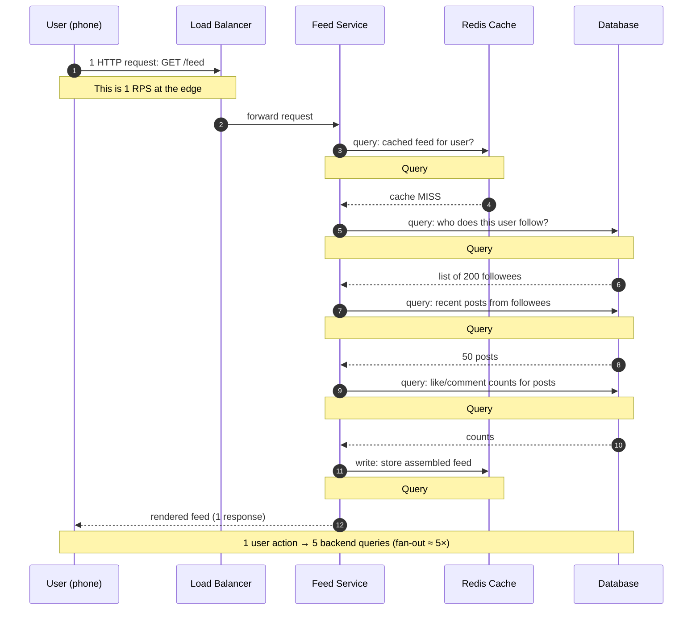
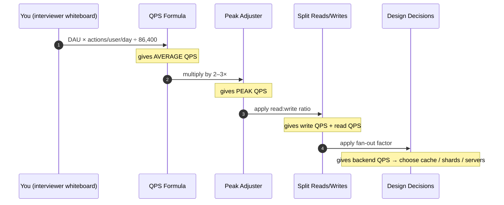

# QPS (Queries Per Second) — Junior

<!-- level-focus -->
At junior level, focus on this question:

> How can I apply **QPS (Queries Per Second)** in one small example and prove the result?

Use the smallest realistic scenario that exposes the decision and its failure behavior.
QPS is the heartbeat of every system-design estimate. Before you pick a database, count servers, or argue about caches, you need one number: **how many requests hit the system every second?** This page teaches you exactly how to produce that number from nothing but a user count and a napkin.

## 1. What QPS Actually Means

**QPS** stands for **Queries Per Second**. It is the rate at which your system receives work to do — measured in events per second.

You will also hear **RPS** (Requests Per Second). For the purposes of capacity estimation, treat **QPS and RPS as the same thing**: one unit of work arriving in one second. The distinction is mostly about which layer you are looking at:

- **RPS** usually means HTTP requests hitting your web server or load balancer.
- **QPS** often means queries hitting your database, cache, or search index.

One incoming HTTP request (1 RPS at the edge) frequently fans out into *several* database queries (multiple QPS deeper in the system). We will see exactly how that fan-out works in [Section 7](#7-how-one-user-action-becomes-n-queries). For now, lock in the mental model:

> **QPS = number of operations the system must handle each second.**

It is a *rate*, not a *total*. "We had 50 million requests yesterday" is a total. "We handle 600 requests per second" is a rate. Capacity planning lives in rates, because servers, networks, and databases all have per-second limits.

A useful way to feel the number:

| QPS | Roughly what it feels like |
|-----|-----------------------------|
| 1 QPS | One request every second — a hobby project |
| 10 QPS | A small internal tool with a few hundred users |
| 100 QPS | A healthy small startup product |
| 1,000 QPS | A solid mid-size service; needs care |
| 10,000 QPS | A large product; needs sharding, caching, multiple servers |
| 100,000+ QPS | Twitter / Instagram scale; needs serious distributed design |

The whole point of a junior-level capacity estimate is to figure out **which row of this table you are in**, because that decides everything else.

---

## 2. Why You Estimate QPS First

Imagine someone asks you to "design Twitter." If you immediately start talking about PostgreSQL vs Cassandra, you have skipped the most important step. You do not yet know whether the system handles 10 QPS or 100,000 QPS — and those two systems look *nothing* alike.

QPS comes first because it is the **input to almost every later decision**:

Concretely, your QPS number drives:

- **Number of servers.** If one app server handles ~1,000 QPS and you need 8,000 QPS, you need roughly 8 servers (plus headroom).
- **Storage choice.** 100 writes/sec fits comfortably in a single SQL database. 100,000 writes/sec does not — now you are talking sharding or a write-optimized store.
- **Caching strategy.** A read-heavy 50,000 QPS system screams "put a cache in front." A write-heavy or low-QPS system may not need one at all.
- **Cost.** More QPS means more machines means more dollars. QPS is the first line of a cost estimate.

You estimate QPS **before choosing technology** because technology is the *answer*, and QPS is part of the *question*. Picking the answer before understanding the question is how systems get over-engineered (a Kafka cluster for 5 QPS) or under-engineered (a single SQLite file for 50,000 QPS).

A junior who can confidently produce a QPS number in 90 seconds on a whiteboard already stands out. That is the skill this page builds.

---

## 3. The Core Formula

Almost every QPS estimate starts from the same single formula. Memorize it:

```
                DAU  ×  (actions per user per day)
   QPS  =  ───────────────────────────────────────────
                     86,400  (seconds in a day)
```

Let's name each part:

- **DAU** — *Daily Active Users*. The number of distinct users who actually use the product on a given day. Not total signups — *active* users. (A product with 500M signups might only have 100M DAU.)
- **Actions per user per day** — how many times a typical active user triggers the action you are measuring. Sending a tweet, opening the feed, sending a message — each is a separate "action" with its own count.
- **86,400** — the number of seconds in one day: `24 hours × 60 minutes × 60 seconds = 86,400`. This converts a *per-day* total into a *per-second* rate.

So the formula reads: take all the actions that happen across all users in a whole day, then spread them evenly across the 86,400 seconds of that day.

**Worked micro-example.** Suppose a note-taking app has:

- DAU = 1,000,000 users
- Each user saves a note 5 times per day → actions/user/day = 5

Then:

```
total actions per day = 1,000,000 × 5 = 5,000,000 actions/day

QPS = 5,000,000 / 86,400 ≈ 57.9 QPS  ≈ ~58 QPS (average)
```

That's it. From two human-readable numbers (a million users, five saves each) you produced an engineering number (~58 writes per second) that you can now design around. Notice we showed **every multiplication** — at junior level you should *never* skip arithmetic. Writing `1,000,000 × 5 = 5,000,000` explicitly catches errors and shows your reasoning to an interviewer.

---

## 4. The 86,400 Shortcut

Dividing by 86,400 by hand in an interview is annoying and error-prone. Senior engineers don't do it exactly — they **round 86,400 to 100,000**, i.e. `10^5`.

> **Rule of thumb:** `1 day ≈ 86,400 seconds ≈ 10^5 seconds.`

Why this is safe: `100,000 / 86,400 ≈ 1.157`. Using `10^5` instead of the exact value makes your QPS come out about **16% lower** than the true average. For back-of-the-envelope work, a 16% error is irrelevant — your *actions-per-user* guess is far rougher than that anyway. And because you'll later multiply the average by a peak factor of 2–3× ([Section 5](#5-average-vs-peak-qps)), the small undercount washes out completely.

The shortcut turns ugly division into *moving a decimal point*:

| Total actions per day | ÷ 86,400 (exact) | ÷ 100,000 (shortcut) |
|------------------------|------------------|----------------------|
| 1,000,000 (10^6)       | ≈ 11.6 QPS       | 10 QPS               |
| 10,000,000 (10^7)      | ≈ 115.7 QPS      | 100 QPS              |
| 100,000,000 (10^8)     | ≈ 1,157 QPS      | 1,000 QPS            |
| 1,000,000,000 (10^9)   | ≈ 11,574 QPS     | 10,000 QPS           |
| 10,000,000,000 (10^10) | ≈ 115,740 QPS    | 100,000 QPS          |

Read that table as a reflex: **"a billion actions a day is about ten thousand QPS."** When you internalize powers of ten this way, you can do capacity estimates in your head. The pattern is simply: *count the zeros in the daily total, subtract 5, and that's your power-of-ten QPS.*

For example, `10^8 actions/day → 10^(8−5) = 10^3 = 1,000 QPS`. No calculator required.

Keep both numbers in mind: use **10^5** for speed during the interview, and remember the true divisor is **86,400** if someone asks for precision.

---

## 5. Average vs Peak QPS

The formula in [Section 3](#3-the-core-formula) spreads all the day's traffic *evenly* across 86,400 seconds. But real users do **not** arrive evenly. They sleep at night, browse over lunch, and pile on in the evening. Traffic has a daily rhythm called a **diurnal pattern**.

The number from the core formula is the **average QPS**. But your system must survive the **peak**, not the average — if it falls over at 8 PM every night, "but the average was fine" is no defense.

> **Rule of thumb:** `peak QPS ≈ 2× to 3× average QPS.`

So you always finish an estimate with one more multiplication:

```
average QPS = 58            (from the note-app example)
peak QPS    = 58 × 2  =  116 QPS   (conservative)
peak QPS    = 58 × 3  =  174 QPS   (safe headroom)
```

You design and provision for the **peak** number (often with extra headroom on top). The exact multiplier depends on the product:

| Product type | Typical peak / average | Why |
|--------------|------------------------|-----|
| Global social app | ~2× | Users spread across time zones smooth the curve |
| Single-country consumer app | ~3× | Everyone is awake and online at the same hours |
| Ticketing / flash sale | 10×–100× | Huge crowd hits at one announced moment |
| Internal B2B tool | ~3–4× | Concentrated in one country's working hours |
| Live event / sports streaming | 5×–50× | Kickoff and goals cause sudden surges |

For a generic junior-level estimate, **multiply your average by 2 or 3 and call that your peak.** Mention to the interviewer that flash-sale or live-event systems need much bigger factors — it shows you understand the assumption isn't universal.

The takeaway: an estimate is not done at "average QPS." It is done at **peak QPS**, because that is the load the system actually has to withstand.

---

## 6. Read QPS vs Write QPS

Not all queries are equal. A system does two fundamentally different kinds of work:

- **Writes** — operations that *change* stored data: posting a tweet, sending a message, placing an order, uploading a photo.
- **Reads** — operations that *retrieve* data: loading a feed, viewing a profile, reading messages, searching.

You should *always split your QPS into reads and writes*, because they stress completely different parts of the system. Writes hit the primary database and are expensive to scale. Reads can be served from replicas and caches, so they scale more cheaply.

In most consumer products, **reads vastly outnumber writes.** One person posts a tweet (1 write); millions of people read it (millions of reads). This is captured by the **read:write ratio**:

| System | Typical read:write ratio | Intuition |
|--------|--------------------------|-----------|
| Social feed (Twitter/Instagram) | 100:1 | One post is read by huge audiences |
| Blogging / news site | 1000:1 | Content written rarely, read constantly |
| E-commerce catalog | 100:1 | Products listed once, browsed endlessly |
| Chat / messaging | 10:1 (sometimes ~1:1) | Each message is read by only a few people |
| Analytics ingestion pipeline | 1:50 (write-heavy!) | Mostly recording events, rarely queried |
| Banking ledger | ~1:1 to 5:1 | Reads and writes both matter, fewer reads per write |

So a single QPS estimate usually becomes **two** numbers. Suppose you computed a total of 600 actions/sec for a feed app and you know the read:write ratio is 100:1. That means out of every 101 operations, 100 are reads and 1 is a write:

```
fraction of writes = 1 / 101  ≈ 0.0099
fraction of reads  = 100 / 101 ≈ 0.9901

write QPS = 600 × 0.0099  ≈   6 writes/sec
read QPS  = 600 × 0.9901  ≈ 594 reads/sec
```

In practice juniors often *start* from the write rate (it's easier to reason about — "how many posts per day?") and then multiply by the ratio to get reads:

```
write QPS = 6
read QPS  = write QPS × 100 = 600 reads/sec
```

Either direction is fine. The key habit: **never report one blended QPS number.** Always say "X writes/sec and Y reads/sec," because the design responds to each differently — writes push you toward sharding, reads push you toward caching and replicas.

---

## 7. How One User Action Becomes N Queries

Here is a subtlety that trips up beginners: **one user action is rarely one query.** When a user taps "open feed," the phone sends *one* request to your server, but that single request fans out into *many* backend queries.

This staged sequence diagram shows what really happens when a user opens their feed:



So the **fan-out factor** here is about 5: one user request became five backend operations. This matters enormously for capacity estimation, because:

> **Edge RPS × fan-out factor ≈ database/cache QPS.**

If your feed service receives 600 requests/sec at the edge, and each one fans out into ~5 backend queries, your database/cache layer actually sees roughly:

```
backend QPS = 600 edge RPS × 5 fan-out = 3,000 QPS
```

A junior who estimates only the edge RPS and forgets the fan-out will *under-provision the database by 5×*. Always ask: **"How many backend queries does one user action cause?"** Common fan-out sources:

- Authentication / session lookup (almost every request does one).
- Loading related data (followees, friends, items in a cart).
- Counting / aggregating (likes, views, unread counts).
- Reading from *and* writing to a cache.

For junior estimates, a fan-out of **3–10×** is a reasonable default for a "page load" type action, and **1–2×** for a simple action like a single "like." State your assumption out loud — that's what separates a guess from an estimate.

---

## 8. Worked Example: A Twitter-Like Feed

Let's put everything together. **Prompt: estimate the QPS for a Twitter-like feed with 100 million DAU.** We'll show every multiplication.

**Step 1 — Estimate writes (tweets posted).**
Assume each active user posts on average **2 tweets per day** (most people post rarely; a few post a lot; 2 is a fair average).

```
total tweets/day = 100,000,000 DAU × 2 tweets/user/day
                 = 200,000,000 tweets/day   (2 × 10^8)
```

**Step 2 — Convert writes to average write QPS** using the 10^5 shortcut:

```
average write QPS = 200,000,000 / 100,000
                  = 2,000 writes/sec
```

(Exact would be `200,000,000 / 86,400 ≈ 2,315/sec` — the shortcut gives 2,000, close enough.)

**Step 3 — Apply the peak factor** (Twitter is global, so ~2×):

```
peak write QPS = 2,000 × 2 = 4,000 writes/sec
```

**Step 4 — Estimate reads.**
Assume each active user opens the feed **20 times per day** (scrolling sessions throughout the day):

```
total feed-opens/day = 100,000,000 × 20 = 2,000,000,000 opens/day  (2 × 10^9)

average read QPS = 2,000,000,000 / 100,000 = 20,000 reads/sec
peak read QPS    = 20,000 × 2 = 40,000 reads/sec
```

**Step 5 — Sanity-check the read:write ratio.**

```
read:write = 20,000 : 2,000 = 10:1
```

That's plausible for a feed where people post a couple of times but check it twenty times — read-heavy, as expected.

**Step 6 — Apply fan-out to find backend QPS.**
Each feed open fans out ~5× (from [Section 7](#7-how-one-user-action-becomes-n-queries)):

```
backend read QPS (peak) = 40,000 × 5 = 200,000 QPS hitting cache + DB
```

**Result summary:**

| Metric | Average | Peak | Notes |
|--------|---------|------|-------|
| Write QPS (tweets) | 2,000 | 4,000 | hits primary DB — needs sharding |
| Read QPS (feed opens) | 20,000 | 40,000 | at the edge |
| Backend read QPS | 100,000 | 200,000 | after ~5× fan-out → needs heavy caching |
| Read:write ratio | 10:1 | — | read-heavy, cache-friendly |

Now the design writes itself: 200,000 backend reads/sec means **caching is mandatory**; 4,000 writes/sec means the write database **must be sharded**. We reached those conclusions purely from a DAU number and a few honest assumptions — *that* is the power of a QPS estimate.

---

## 9. Worked Example: A Chat App

A second example with a *different shape*, so you see the method generalizes. **Prompt: estimate QPS for a WhatsApp-like chat app with 500 million DAU.**

**Step 1 — Estimate writes (messages sent).**
Chat is write-heavy compared to a feed. Assume each user sends **40 messages per day**:

```
total messages/day = 500,000,000 × 40 = 20,000,000,000 messages/day  (2 × 10^10)
```

**Step 2 — Average write QPS:**

```
average write QPS = 20,000,000,000 / 100,000 = 200,000 writes/sec
```

**Step 3 — Peak factor.** WhatsApp is global but usage clusters in evenings; use ~2.5×:

```
peak write QPS = 200,000 × 2.5 = 500,000 writes/sec
```

**Step 4 — Estimate reads (messages received/read).**
In a chat, a message is typically read by a small number of recipients. In one-to-one chat, a sent message is read by ~1 person; group chats push that higher. Assume an effective read:write ratio of about **2:1** (each message read on a couple of devices / by a couple of people on average):

```
average read QPS = 200,000 × 2 = 400,000 reads/sec
peak read QPS    = 400,000 × 2.5 = 1,000,000 reads/sec
```

**Step 5 — Compare the two systems.**

| Aspect | Twitter feed (100M DAU) | Chat app (500M DAU) |
|--------|--------------------------|----------------------|
| Dominant operation | Reads (feed opens) | Writes (messages) |
| Read:write ratio | ~10:1 | ~2:1 |
| Peak write QPS | ~4,000 | ~500,000 |
| Peak read QPS | ~40,000 | ~1,000,000 |
| Hardest design problem | Serving reads cheaply (caching) | Absorbing writes (sharding, queues) |

Notice the critical insight: even though chat is "read-heavy" in absolute numbers, its read:write ratio is *low*, so its **write load is enormous** — half a million writes per second. That pushes the design toward message queues, write sharding, and append-only storage, whereas Twitter's design is dominated by read caching. **Same formula, opposite conclusions** — because the per-user behavior and the read:write ratio differ.

This is exactly why you split reads from writes and state your ratio: those two numbers determine which scaling problem you're actually solving.

---

## 10. A Reusable Estimate Table

When you face a brand-new "design X" prompt, fill in this table top to bottom. It encodes everything above into a repeatable checklist. (Values shown are for the Twitter example so you can see it filled in.)

| # | Step | Formula | Twitter example |
|---|------|---------|-----------------|
| 1 | Daily Active Users | given / assumed | 100,000,000 |
| 2 | Actions/user/day (write) | assumed | 2 tweets |
| 3 | Total writes/day | DAU × actions | 200,000,000 |
| 4 | Average write QPS | total ÷ 86,400 (≈10^5) | 2,000 |
| 5 | Peak write QPS | avg × 2–3 | 4,000 |
| 6 | Actions/user/day (read) | assumed | 20 opens |
| 7 | Total reads/day | DAU × actions | 2,000,000,000 |
| 8 | Average read QPS | total ÷ 86,400 (≈10^5) | 20,000 |
| 9 | Peak read QPS | avg × 2–3 | 40,000 |
| 10 | Read:write ratio | read QPS ÷ write QPS | 10:1 |
| 11 | Fan-out factor | assumed per action | ~5× |
| 12 | Backend peak QPS | edge QPS × fan-out | 200,000 |

The whole process is a pipeline — **DAU in, design-driving numbers out**:



Run this table on autopilot and you will produce a defensible QPS estimate for *any* product in a couple of minutes.

---

## 11. Common Mistakes Juniors Make

Avoid these and you'll already estimate better than most:

1. **Reporting only the average.** The system must survive peak. Always finish with `× 2–3`. An estimate that stops at the average has stopped one step too early.

2. **Using total signups instead of DAU.** A product with 2 billion signups might have 400M DAU. *Active* users generate load; dormant accounts don't. If only "monthly active users" (MAU) is given, a common assumption is `DAU ≈ MAU / 3` — state it explicitly.

3. **Forgetting fan-out.** One feed open ≠ one query. Multiply edge RPS by the fan-out factor to get true database/cache QPS, or you'll under-provision your data layer several-fold.

4. **Blending reads and writes into one number.** They scale differently (replicas/cache for reads, sharding for writes). Always present two numbers and the ratio between them.

5. **Pretending precision you don't have.** `DAU × 2.37 actions ÷ 86,400 = 2,743.05 QPS` is *fake* precision — your "2.37" was a guess. Round aggressively: "~2,000 writes/sec." Estimates are about the right *order of magnitude*, not decimal places.

6. **Skipping the arithmetic.** At junior level, *write every multiplication on the board.* It catches mistakes and shows your reasoning. `100,000,000 × 2 = 200,000,000` belongs on the whiteboard, not just in your head.

7. **Assuming traffic is uniform across the world.** A single-country app peaks hard (everyone online at the same evening hour → 3×+). A globally distributed app smooths out (~2×). Match the peak factor to the product.

8. **Not stating assumptions.** "2 tweets per user per day" is an assumption, not a fact. Say it out loud. A good estimate is *transparent*: anyone can swap your assumption and re-run the numbers.

---

## 12. Quick Reference Cheat Sheet

Keep this within arm's reach for interviews:

| Thing | Value / Formula |
|-------|-----------------|
| Seconds per day | 86,400 ≈ **10^5** |
| Core formula | `QPS = DAU × actions/user/day ÷ 86,400` |
| Powers-of-ten trick | `(zeros in daily total) − 5 = power of 10 for QPS` |
| Peak factor (global app) | × 2 |
| Peak factor (single-country app) | × 3 |
| Peak factor (flash sale / live event) | × 10 to × 100 |
| MAU → DAU estimate | `DAU ≈ MAU / 3` |
| Feed read:write ratio | ~100:1 (often quoted 10:1 at the edge) |
| Chat read:write ratio | ~2:1 to 10:1 |
| Blog/news read:write ratio | ~1000:1 |
| Typical page-load fan-out | 3× to 10× |
| Simple-action fan-out | 1× to 2× |

**The three numbers you must always produce:**

1. **Peak write QPS** → drives storage / sharding decisions.
2. **Peak read QPS** → drives caching / replica decisions.
3. **Read:write ratio** → tells you which problem dominates.

---

## Apply it

1. Choose one small, known input for **QPS (Queries Per Second)**.
2. Predict the output or observable behavior.
3. Run the smallest example or probe that exercises the concept.
4. Change one input to trigger a failure or boundary case.
5. Explain the evidence using the guide's vocabulary.

## Verify your work

- Record the exact input, command or code path, and output.
- Repeat the probe and confirm the result is consistent.
- Show one expected success and one expected failure.
- Resolve any difference between the prediction and the evidence.

## Review questions

- What problem does QPS (Queries Per Second) solve in the example?
- Which input changes the observed result, and why?
- What is the smallest useful success check?
- Which beginner mistake would your evidence catch?
