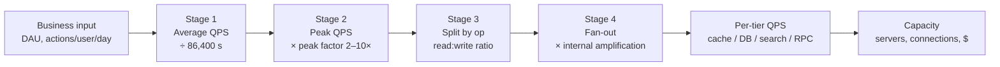
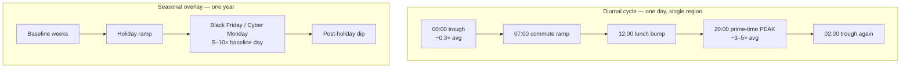
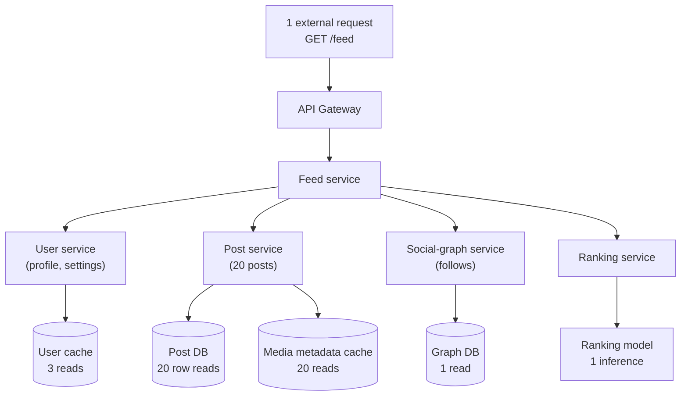

# QPS (Queries Per Second) — Middle

<!-- level-focus -->
At middle level, focus on this question:

> Where does **QPS (Queries Per Second)** belong in a maintainable component, and which trade-off selects the design?

Use the smallest realistic scenario that exposes the decision and its failure behavior.
Estimating QPS is the single most leveraged number in a capacity plan. Get it right and storage, bandwidth, server count, and cost all fall out of it. Get it wrong — usually by forgetting peaks or fan-out — and your design is wrong by an order of magnitude before you write a line of code. This page treats QPS as a **practitioner**: every number is derived with explicit arithmetic, and every transformation in the pipeline (daily volume → average → peak → internal) is shown step by step.

## 1. The QPS pipeline

QPS estimation is not one calculation; it is a **pipeline of transformations**, each of which multiplies or divides the previous number. The discipline is to never skip a stage and never collapse two stages into a single guessed number.



Read the chain left to right and notice the multipliers compound:

```
external average QPS
  × peak factor          (Stage 2)
  × fan-out factor        (Stage 4)
  = internal peak QPS at the tier you must size for
```

A modest-looking product — say 1,000 external requests/second on average — can demand a database tier provisioned for **tens of thousands** of QPS once peak (×3) and fan-out (×8) are applied. Every senior reviewer's first question is "is this the *peak internal* number or the *average external* number?" Knowing which is which is the whole skill.

---

## 2. Step 1 — daily volume to average QPS

The base conversion. There are **86,400 seconds in a day** (`24 × 60 × 60`). For mental math, round to **~100,000 (10⁵)** — it makes you slightly conservative (you divide by a bigger number, so average QPS comes out lower; remember to compensate at peak).

```
average QPS = total daily events / 86,400
```

Worked numbers you should be able to produce instantly:

| Daily events | ÷ 86,400 (exact) | ÷ 100,000 (mental) | Use |
|---|---|---|---|
| 1 million | 11.6 QPS | 10 QPS | A small service |
| 10 million | 116 QPS | 100 QPS | A growing feature |
| 100 million | 1,157 QPS | 1,000 QPS | A serious product |
| 1 billion | 11,574 QPS | 10,000 QPS | Large-scale |
| 86.4 billion | 1,000,000 QPS | ~864,000 QPS | Hyperscale |

The anchor worth memorizing: **1 billion events/day ≈ 11,574 average QPS ≈ ~12k QPS.** From there scale linearly.

Where does "daily events" come from? Usually `DAU × actions per user per day`:

```
DAU                       = 20,000,000        (20M daily active users)
feed opens per user/day   = 10
daily feed opens          = 20M × 10 = 200,000,000   (200M/day)
average feed-open QPS     = 200,000,000 / 86,400 ≈ 2,315 QPS
```

That 2,315 QPS is the **average external** QPS for one endpoint. It is the *smallest* number in the whole analysis. Everything that follows makes it bigger.

---

## 3. Step 2 — average to peak QPS

Traffic is never flat. Users sleep, wake, commute, and pile onto a service at predictable times. You must size for the **peak**, not the average, or the system falls over exactly when it matters most.

```
peak QPS = average QPS × peak factor
```

### Why peak ≈ 2–5×

The peak factor captures how concentrated traffic is. Two intuitions:

- **Daytime concentration.** If a region's traffic is squeezed into ~8 active hours instead of being spread over 24, the busy-hour rate is `24/8 = 3×` the flat average. Real curves are smoother than a step function but the order of magnitude holds: **2–5×** for most consumer apps over a single time zone.
- **Single-timezone vs. global.** A product serving one country sees a sharp single peak (higher factor, ~4–5×). A globally distributed product has overlapping time zones that flatten the curve (lower factor, ~2–3×) — the world's peak is never *everyone* at once.

### Why event spikes can be 10×+

Scheduled or viral events break the smooth diurnal model entirely. A flash sale, a ticket on-sale at noon, a push notification fired to 50M devices, a sports final, or a celebrity post can drive **10× to 100×** the average for a few minutes. These are not captured by a generic peak factor — you model them as named scenarios with their own multiplier.

### Peak-factor table (pick by workload, justify in writing)

| Workload type | Typical peak factor | Reasoning |
|---|---|---|
| Global consumer app (overlapping TZs) | 2–3× | Time zones flatten the global curve |
| Single-region consumer app | 3–5× | One sharp daily peak |
| Internal B2B / office-hours tool | 5–8× | Traffic crushed into ~8 working hours, near-zero overnight |
| Push-notification-driven app | 10–20× | Notification fires → synchronized open within minutes |
| Flash sale / ticket on-sale | 20–100× | Everyone arrives at the same scheduled second |
| Live event / breaking news | 10–50× | Viral, correlated, unpredictable onset |

Applying a 3× factor to the feed example from Step 1:

```
average feed-open QPS = 2,315 QPS
peak factor           = 3   (single-region consumer assumption)
peak feed-open QPS    = 2,315 × 3 ≈ 6,945 QPS  →  round up to ~7,000 QPS
```

Always **state your peak factor and why** in a design doc. A reviewer cannot evaluate "we need 7,000 QPS of capacity" without knowing whether you used 2× or 5×. And always carry the peak number forward — fan-out (Stage 4) multiplies the *peak*, not the average.

---

## 4. Diurnal and seasonal patterns

Peak factor is a scalar summary of a **curve**. Understanding the curve's shape tells you whether 2× or 10× is right and where the risk lives.



**Diurnal (daily).** A single-region app typically troughs around 03:00–05:00 local (≈0.3× average) and peaks in the evening (≈3–5× average). The trough matters too: it is your window for batch jobs, backups, and migrations, but it also means **average over 24h badly understates the rate you must serve at 20:00**.

**Time zones.** For a global service, sum the per-region curves offset by their UTC difference. The overlap of US-evening + Europe-night + Asia-morning produces a flatter aggregate (lower peak factor) than any single region. This is why global products quote 2–3× while a national product quotes 4–5×.

**Seasonal (yearly).** Retail is the canonical case: **Black Friday / Cyber Monday** can be 5–10× a normal *peak day* — i.e., the seasonal multiplier stacks on top of the diurnal one. Other seasonal drivers: tax-filing deadlines, back-to-school, New Year's Eve messaging, and product launches. The rule: **provision for the worst expected day of the year**, not the median day, even if that means idle capacity 360 days a year (or use autoscaling — but autoscaling has a warm-up lag that flash spikes outrun, so keep headroom).

Concrete seasonal stack for the feed example:

```
normal peak feed QPS              = 7,000 QPS
seasonal multiplier (launch day)  = 4×
launch-day peak feed QPS          = 7,000 × 4 = 28,000 QPS
```

If your architecture only survives 7,000 but a known launch will hit 28,000, you have a documented gap — far better to surface it in the estimate than discover it live.

---

## 5. Step 3 — read:write ratios

Reads and writes hit different subsystems with different costs. A read might be served from cache for ~0.5 ms; a write must hit the primary database, replicate, and invalidate caches. You must **split total QPS into read QPS and write QPS** because you size read replicas, caches, and write primaries independently.

```
read QPS  = total QPS × (R / (R + W))
write QPS = total QPS × (W / (R + W))
```

### Estimating the ratio per feature

Don't guess a global ratio — derive it from user behavior per feature:

| Feature | Typical read:write | How to estimate |
|---|---|---|
| Social feed | 100:1 or higher | Users scroll far more than they post |
| Twitter-like timeline | ~100:1 | Reads dominate; writes fan out (see Stage 4) |
| Messaging / chat | ~1:1 to 5:1 | Every send is read by ≥1 recipient |
| E-commerce browse vs. buy | 100:1 to 1000:1 | Many views per purchase |
| Analytics / logging ingest | 1:50 (write-heavy) | Mostly writes, queried rarely |
| Bank ledger | ~1:1 | Every read pairs with a posting |
| Config / feature flags | 10,000:1+ | Read on every request, written rarely |

The arithmetic, continuing the feed (using normal peak 7,000 QPS, read:write = 100:1):

```
total peak QPS = 7,000
R : W = 100 : 1   →   read fraction = 100/101 ≈ 0.990,  write fraction = 1/101 ≈ 0.0099

read QPS  = 7,000 × 0.990 ≈ 6,930 QPS
write QPS = 7,000 × 0.0099 ≈  70 QPS
```

This split immediately tells the architecture story: **6,930 read QPS** justifies an aggressive cache + read replicas; **70 write QPS** is comfortably handled by a single primary. Without the split you might over-provision write capacity 100× or, worse, under-provision read capacity. Note also that the *write* path is where fan-out often explodes (a single write becomes many) — which is exactly Stage 4.

---

## 6. Step 4 — request fan-out and amplification

This is the stage juniors miss and the reason **internal QPS ≫ external QPS**. One request arriving at your edge does not equal one query at your database. It spawns a tree of internal calls.



Count the leaves: **one** external `GET /feed` became **~5 microservice calls** and, at the storage tier, roughly **20 (posts) + 3 (users) + 20 (media) + 1 (graph) ≈ 44 backend reads** plus 1 ML inference. Two distinct amplification factors:

- **Service fan-out factor** — external requests → internal RPC calls. Here ≈ 5×.
- **Storage fan-out factor** — external requests → DB/cache operations. Here ≈ 44×.

```
internal QPS at tier X = external QPS × fan-out factor at tier X
```

### Where fan-out comes from

- **Aggregation endpoints.** A "load the screen" call gathers data from many services (the feed example).
- **Write fan-out (push model).** Posting to N followers writes N timeline entries. A celebrity with 50M followers turns **1 write into 50M writes** — the "fan-out on write" problem. The opposite, "fan-out on read," moves the cost to read time. Choosing between them is a core timeline-design decision, and the QPS estimate is what forces the choice.
- **Retries and hedged requests.** Each retry policy adds a multiplier (a 1% retry rate adds ~1%; an aggressive hedge can add 50%+).
- **N+1 query patterns.** A loop that issues one query per item silently multiplies storage QPS by the item count — often the difference between 44× and 4×.

### Worked fan-out: external RPS → internal QPS

```
external peak read QPS (feed)   = 6,930 QPS          (from Stage 3)

service fan-out (RPC)           = 5×
  internal RPC QPS              = 6,930 × 5  = 34,650 RPC/s

storage fan-out (DB + cache)    = 44×
  total backend ops/s           = 6,930 × 44 = 304,920 ops/s

  of which cache (≈ 95%)        ≈ 304,920 × 0.95 ≈ 289,674 cache ops/s
  of which DB   (≈  5%)         ≈ 304,920 × 0.05 ≈  15,246 DB QPS
```

The headline: a feed product whose **average external** rate was 2,315 QPS demands a cache tier built for **~290,000 ops/s** and a database for **~15,000 QPS** at peak. That is a **~125×** gap between the first number a PM quotes and the number that actually sizes your infrastructure. Surfacing that gap *is* the job.

---

## 7. Worked example A — a social feed

Putting all four stages together end to end, with every multiplier explicit.

```
INPUTS
  DAU                         = 20,000,000
  feed opens / user / day     = 10
  read:write ratio            = 100 : 1
  peak factor                 = 3
  service fan-out             = 5×
  storage fan-out             = 44× (95% cache, 5% DB)

STAGE 1 — average QPS
  daily feed opens   = 20,000,000 × 10        = 200,000,000 / day
  average QPS        = 200,000,000 / 86,400   ≈ 2,315 QPS

STAGE 2 — peak QPS
  peak QPS           = 2,315 × 3              ≈ 6,945 QPS  (round to 7,000)

STAGE 3 — read / write split
  read QPS           = 7,000 × (100/101)      ≈ 6,930 QPS
  write QPS          = 7,000 × (1/101)        ≈    70 QPS

STAGE 4 — fan-out to internal tiers (apply to the READ path)
  internal RPC/s     = 6,930 × 5              ≈ 34,650 RPC/s
  backend ops/s      = 6,930 × 44             ≈ 304,920 ops/s
    cache ops/s      = 304,920 × 0.95         ≈ 289,674 ops/s
    DB read QPS      = 304,920 × 0.05         ≈  15,246 QPS

  write fan-out (timeline materialization, push model)
    avg followers/poster        = 200
    timeline writes/s           = 70 × 200    ≈ 14,000 writes/s
```

| Tier | Peak QPS to provision | Driver |
|---|---|---|
| Edge / gateway (external) | ~7,000 | raw external requests |
| Inter-service RPC | ~34,650 | 5× service fan-out |
| Cache (reads) | ~289,674 | 44× storage fan-out × 95% |
| DB (reads) | ~15,246 | 44× storage fan-out × 5% |
| DB (timeline writes) | ~14,000 | write fan-out, push model |

Conclusion you can act on: cache is the dominant cost; the read DB needs replicas (~15k QPS exceeds a single node's comfortable range); and the **write path's 14k writes/s** — driven entirely by fan-out, not by the tiny 70 QPS of user posts — may be the real scaling bottleneck. Without Stage 4 you would never see it.

---

## 8. Worked example B — an e-commerce checkout

A different profile: low volume, high value, and a brutal seasonal spike. Here getting the **peak** right matters more than the average.

```
INPUTS
  orders / normal day         = 500,000
  read:write (browse:buy)     = 200 : 1   (lots of browsing per purchase)
  normal peak factor          = 4
  Black Friday multiplier     = 10× (on top of normal peak day)
  fan-out per checkout (writes): inventory, payment, order, ledger, email = 5 internal writes

STAGE 1 — average order QPS
  average order QPS  = 500,000 / 86,400       ≈ 5.79 QPS

STAGE 2 — normal peak
  normal peak order QPS = 5.79 × 4            ≈ 23 QPS

STAGE 2b — Black Friday peak (seasonal stacks on peak)
  BF peak order QPS  = 23 × 10                ≈ 230 QPS

STAGE 3 — implied browse (read) traffic at BF peak
  browse QPS = order QPS × 200 = 230 × 200    ≈ 46,000 read QPS

STAGE 4 — write fan-out per order
  internal write ops/s = 230 × 5              ≈ 1,150 write ops/s
```

| Scenario | Order QPS | Browse (read) QPS | Internal write ops/s |
|---|---|---|---|
| Average | 5.8 | ~1,160 | ~29 |
| Normal peak (×4) | 23 | ~4,600 | ~115 |
| Black Friday (×40 total) | 230 | ~46,000 | ~1,150 |

The lesson: the checkout *write* path is tiny even at Black Friday (1,150 ops/s — a single well-tuned primary handles it). The risk is the **46,000 read QPS** of browsing, and the fact that the seasonal multiplier (40× over average) means a system sized for the average day is **40× under-provisioned** on the one day that generates the year's revenue. Estimate the worst day, not the median.

---

## 9. Worked example C — a URL shortener redirect

The opposite extreme: massive read volume, trivial fan-out, cache-dominated. Shows how the same pipeline yields a very different architecture.

```
INPUTS
  redirects / day             = 10,000,000,000   (10B/day — a large public shortener)
  read:write ratio            = 10,000 : 1        (created once, read forever)
  peak factor                 = 2                  (global, well-distributed)
  storage fan-out             = 1× (one key lookup per redirect; ~99% cache hit)

STAGE 1 — average redirect QPS
  average QPS = 10,000,000,000 / 86,400          ≈ 115,741 QPS

STAGE 2 — peak QPS
  peak QPS    = 115,741 × 2                       ≈ 231,482 QPS

STAGE 3 — read / write split
  read QPS    = 231,482 × (10000/10001)           ≈ 231,459 QPS
  write QPS   = 231,482 × (1/10001)               ≈      23 QPS

STAGE 4 — storage tiers (cache hit ratio 99%)
  cache lookups/s = 231,459 × 1.0                 ≈ 231,459 ops/s
  DB read QPS     = 231,459 × (1 - 0.99)          ≈   2,315 QPS  (cache misses)
```

| Tier | Peak QPS | Note |
|---|---|---|
| Edge / read path | ~231,459 | dominated by reads |
| Cache | ~231,459 | the whole product lives here |
| DB reads (misses) | ~2,315 | 1% miss ratio collapses DB load |
| DB writes | ~23 | new short URLs, negligible |

Here fan-out is ~1× (no aggregation, no microservice tree), so external and internal QPS nearly match — but the **99% cache hit ratio** is the single most important number: it converts 231k read QPS into only ~2,315 DB QPS. Tune the hit ratio down to 90% and DB load jumps 10× to ~23,000 QPS. In cache-dominated systems, **the hit ratio is a first-class capacity input**, not an afterthought.

---

## 10. Converting QPS into the unit that matters

"QPS" is ambiguous until you say *queries against what*. The same external rate maps to different numbers per tier, and each tier has different limits.

| Tier | Unit | What sizes it | Rough single-node ceiling |
|---|---|---|---|
| Load balancer / edge | requests/s (RPS) | connection + TLS overhead | 100k–1M RPS |
| App server | RPS per instance | CPU per request, thread pool | 1k–10k RPS/instance |
| Cache (Redis/Memcached) | ops/s | network + single-thread (Redis) | ~100k–500k ops/s/node |
| SQL DB (primary) | QPS / TPS | disk IOPS, locks, replication | ~5k–20k QPS/node |
| SQL DB (read replica) | read QPS | replica count × per-node QPS | scale by adding replicas |
| Search (Elasticsearch) | queries/s | shard count, query cost | varies widely |
| Message queue | messages/s | partitions, consumer count | 10k–1M+ msg/s |

The transformation pattern, per tier:

```
tier QPS = external peak QPS × (fan-out factor to that tier)

servers needed = ceil( tier QPS / safe-per-node QPS )    (then add headroom)
```

Worked, from feed example A's DB read load of ~15,246 QPS:

```
DB read QPS          = 15,246
safe per replica     = 5,000 QPS   (conservative; leaves headroom under the 20k ceiling)
replicas needed      = ceil(15,246 / 5,000) = 4 read replicas
add 1 for headroom / failure tolerance        = 5 read replicas
```

Two rules to internalize:

- **Never provision to 100% of a node's ceiling.** Target 50–70% utilization at peak so that a node failure, a traffic spike, or a slow query doesn't cascade. The "safe per-node QPS" above is deliberately below the ceiling.
- **Size each tier to its own peak.** The cache, the read DB, and the write DB all peak from the same external traffic but at wildly different absolute numbers (290k vs 15k vs 14k in example A). One global QPS number cannot size all three.

---

## 11. Sanity checks and common mistakes

Before you trust an estimate, run it past these checks. Most bad estimates fail one of them.

**Sanity checks**

- **Order-of-magnitude only.** Capacity estimation answers "do I need 1 server or 1,000?" Carrying three significant figures is false precision — round aggressively and state assumptions.
- **Cross-check with a known anchor.** 1B events/day ≈ 12k average QPS. If your number is wildly off that scaling, recheck the division.
- **Does the per-user rate make sense?** 200M feed opens / 20M DAU = 10 opens/user/day. Is 10 plausible? If your inputs imply 1,000 opens/user/day, an input is wrong.
- **Does the tier number fit reality?** If you compute 2M QPS against a single Postgres primary, the *architecture* is wrong, not just the number — that's the estimate doing its job.

**Common mistakes**

| Mistake | Consequence | Fix |
|---|---|---|
| Sizing for average, not peak | System dies at prime time | Always apply a peak factor (state it) |
| Forgetting fan-out | DB under-provisioned 10–50× | Trace one request to the leaves |
| Forgetting write fan-out | Timeline/notification tier melts | Model push vs. pull explicitly |
| One global QPS for all tiers | Cache over-built, DB under-built | Split read/write, then fan-out per tier |
| Ignoring seasonal spikes | Outage on the highest-revenue day | Provision for worst expected day |
| Provisioning to 100% of node ceiling | No headroom for failure/spike | Target 50–70% utilization |
| Treating cache hit ratio as fixed/perfect | DB load off by 10× | Make hit ratio an explicit input |
| Using 86,400 vs 100,000 inconsistently | Small systematic bias | Pick one, note it, stay consistent |

The single highest-value habit: **write every multiplier on its own line.** When the chain is `2,315 → ×3 → ×(100/101) → ×44 → ×0.95`, anyone can audit it, challenge one factor, and recompute. A single guessed "we need ~300k QPS of cache" with no derivation is unreviewable and usually wrong.

---

## 12. Checklist

Before declaring a QPS estimate done, confirm:

- [ ] Daily volume derived from `DAU × actions/user/day`, not guessed.
- [ ] Average QPS = daily / 86,400 (or noted you used 100,000).
- [ ] Peak factor chosen, **stated, and justified** (single vs. multi-region).
- [ ] Seasonal / event spikes modeled as named scenarios where relevant.
- [ ] Read:write ratio derived per feature and the split computed.
- [ ] Service fan-out (external → RPC) counted.
- [ ] Storage fan-out (external → DB/cache ops) counted, with cache hit ratio.
- [ ] Write fan-out (push model) checked for explosive cases.
- [ ] Each tier's QPS computed separately and mapped to per-node ceilings.
- [ ] Headroom applied (target 50–70% utilization, not 100%).
- [ ] Every multiplier shown on its own line so the chain is auditable.

Master this pipeline and the rest of capacity estimation — storage, bandwidth, memory, cost — becomes mechanical, because every one of those numbers is downstream of a correct peak internal QPS.

---

*Next step:* [Senior level](senior.md)

---

## Apply it

1. Find a real component where **QPS (Queries Per Second)** affects an interface or dependency.
2. Write two plausible choices and the constraint that favors each one.
3. Make the smallest reversible change at that boundary.
4. Exercise the component alone, then exercise the integrated flow.
5. Keep the decision note with the evidence that selected the option.

## Verify your work

- A focused check proves the local behavior.
- An integrated check proves callers and dependencies still agree.
- Logs, traces, compiler output, or benchmarks expose the boundary.
- Reverting the change restores the previous behavior without unrelated edits.

## Review questions

- Which boundary is most affected by QPS (Queries Per Second)?
- What constraint would make you choose the alternative design?
- How would you isolate a local defect from an integration defect?
- What evidence shows that the change remains maintainable?
