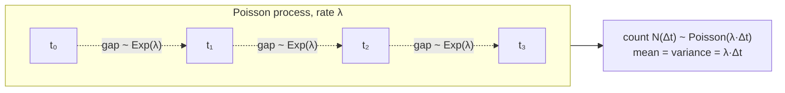
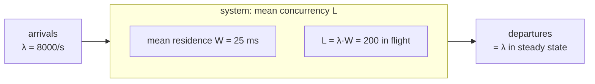
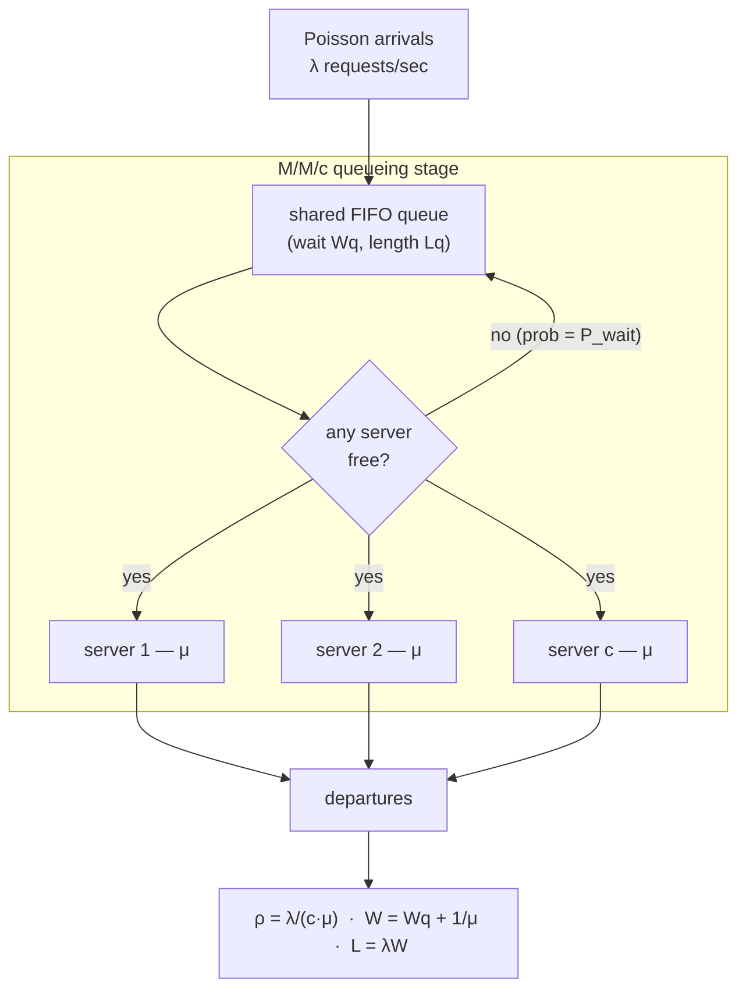
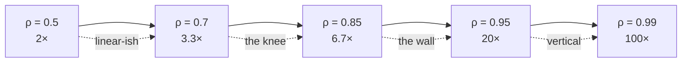
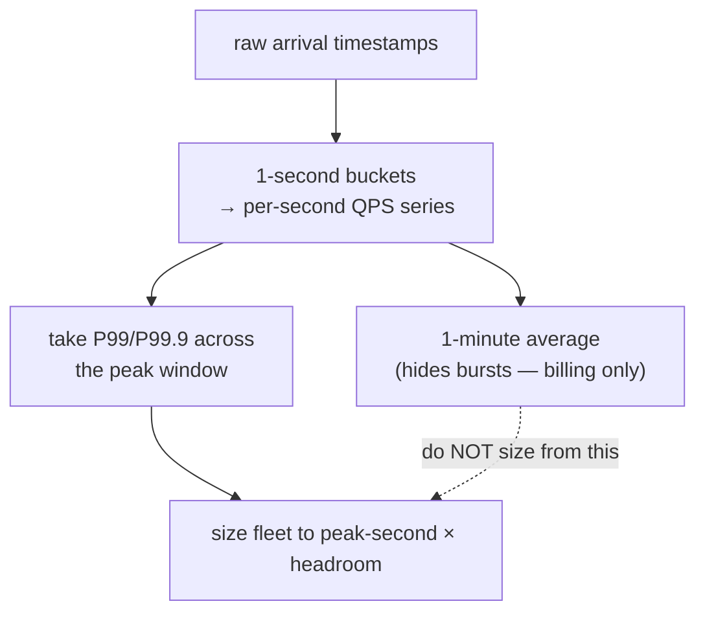

# QPS (Queries Per Second) — Theory and Formal Foundations

<!-- level-focus -->
At professional level, focus on this question:

> How should teams adopt and operate **QPS (Queries Per Second) — Theory and Formal Foundations** with measurable outcomes and limited coordination?

Use the smallest realistic scenario that exposes the decision and its failure behavior.
QPS is the single most abused number in capacity planning. People say "we do 10,000 QPS" and then size a fleet against that average, only to be paged at 2 a.m. when the system melts at a *measured* utilization of 65%. The gap between "the average was fine" and "the system fell over" is not a mystery — it is queueing theory, and it is quantitative. This document treats QPS as a *random process*, not a scalar. We model arrivals, derive the laws that bind throughput, concurrency, and latency, and show — with worked numbers — why you provision for the peak second and stop loading servers far below 100%.

## 1. QPS Is a Random Variable, Not a Number

When you write "QPS = 10,000," you are stating the *mean rate* of a counting process. A counting process `N(t)` counts how many requests have arrived by time `t`. The instantaneous rate is `λ = E[N(t)] / t`. But the system never experiences the mean. It experiences the actual sequence of arrivals — clustered, jittered, sometimes synchronized — and the *variance* of that sequence is what determines whether queues form.

Two systems can share the identical mean of 10,000 QPS and behave completely differently:

- **System A:** requests arrive smoothly, almost metronomic, one every 100 µs.
- **System B:** requests arrive in bursts of 500 within a 5 ms window, then silence for 45 ms.

System A keeps queues near empty. System B oscillates between idle and overload, builds standing queues, and shows tail latency an order of magnitude worse — at *the same mean QPS and the same mean service time*. Capacity planning that uses only the mean is blind to this. The discipline of this document is to keep the full distribution in view.

The three quantities that govern everything downstream:

| Symbol | Name | Meaning | Units |
|--------|------|---------|-------|
| `λ` | arrival rate | mean requests entering the system per second (this is "QPS") | 1/s |
| `μ` | service rate | mean requests one server completes per second = `1/E[S]` | 1/s |
| `c` | servers/threads | number of parallel service channels | count |
| `ρ` | utilization | offered load relative to capacity = `λ / (c·μ)` | dimensionless |
| `S` | service time | time one server spends on one request | s |
| `W` | sojourn time | total time in system = wait + service | s |
| `Wq` | queueing delay | time spent waiting before service starts | s |
| `L` | concurrency | mean number of requests in the system | count |

Everything below is a relationship among these eight symbols.

## 2. The Poisson Arrival Process

The standard baseline model for "independent users arriving randomly" is the **Poisson process** with rate `λ`. It is defined by three equivalent properties:

1. **Counts are Poisson-distributed.** The number of arrivals in any window of length `t` follows `P(N = k) = (λt)^k · e^(−λt) / k!`, with mean `λt` and variance `λt`.
2. **Inter-arrival times are exponential.** The gap `T` between consecutive arrivals is `P(T > x) = e^(−λx)`, with mean `1/λ`.
3. **Independent increments.** Arrivals in disjoint time windows are statistically independent.

The defining feature is **memorylessness**: `P(T > s + t | T > s) = P(T > t)`. The process has no memory of how long you have already waited. If the mean gap is 100 µs and 300 µs have already elapsed with no arrival, the expected remaining wait is *still* 100 µs. This is the only continuous distribution with this property, and it is what makes the Poisson process analytically tractable — the future depends only on the present, not the history, which is exactly the Markov property the M/M queues exploit.



**A useful consequence — superposition.** The sum of many independent renewal streams converges to a Poisson process (the Palm–Khintchine theorem). This is *why* Poisson is a reasonable first model for a large pool of independent users: each user's requests are bursty and non-Poisson, but a million such users, summed, look Poisson at the aggregate. The model breaks precisely when users *stop* being independent — see Section 3.

**A second consequence — PASTA.** "Poisson Arrivals See Time Averages." An arriving Poisson customer observes the system in its long-run stationary state. This is non-trivial: a non-Poisson arrival can systematically arrive at busy moments (think of a thundering herd that fires right when the previous batch is still draining). PASTA is the reason the M/M queue formulas for what an arrival experiences equal the formulas for the time-average state.

## 3. Why Real Traffic Is Burstier Than Poisson

Poisson is the optimistic baseline. Real internet and RPC traffic is consistently **burstier** — its variance exceeds the Poisson prediction, sometimes by orders of magnitude. Three structural reasons:

**Self-similarity / long-range dependence.** Seminal measurements of Ethernet (Leland, Willinger, et al., 1994) and later web/wide-area traffic showed traffic is *self-similar*: it looks bursty at every time scale — per-millisecond, per-second, per-minute — and does not smooth out when you aggregate, the way Poisson does. The autocorrelation decays as a power law (`~ k^(−β)`), not exponentially. A self-similar process is characterized by a Hurst parameter `H ∈ (0.5, 1)`; `H = 0.5` is Poisson-like, and measured web traffic frequently lands at `H ≈ 0.7–0.9`. Practically: aggregating to coarser windows does **not** kill the burstiness, so a "1-minute average looks calm" report is actively misleading.

**Heavy-tailed sources.** Individual flows (file sizes, session lengths, fan-out depths) follow heavy-tailed (Pareto-like) distributions: most are tiny, a few are enormous, and the few dominate the load. A single heavy request can monopolize a server and stall everything behind it. Heavy-tailed *service* times also break the "M" in M/M/c — the exponential service assumption — and push you toward M/G/1 analysis where the Pollaczek–Khinchine formula shows wait scales with `E[S²]`, the *second moment*, which a heavy tail inflates dramatically.

**Correlation and synchronization.** Retries, cron jobs, cache-expiry stampedes, client-side timeouts firing in lockstep, and "round-number" human behavior all inject *positive correlation* between arrivals. Correlated arrivals cluster, and clustering is precisely what queues punish.

| Property | Poisson (baseline) | Real traffic (typical) | Operational consequence |
|----------|--------------------|------------------------|--------------------------|
| Variance of count in window | `= λt` (Fano factor 1) | `≫ λt` (Fano factor 5–50+) | Bigger queues at same mean QPS |
| Autocorrelation | exponential decay | power-law / long-range | Aggregation does not smooth bursts |
| Self-similarity (Hurst `H`) | `H = 0.5` | `H ≈ 0.7–0.9` | Bursty at all timescales |
| Service-time tail | exponential | heavy / Pareto | Head-of-line blocking, P99 blowup |
| Independence | by definition | broken by retries/crons | Synchronized spikes |

**The takeaway:** Poisson/M-M analysis gives you a *floor* on how bad queueing will be. Real systems are worse. So when M/M/c says "keep ρ below 70%," real burstiness means your safe ceiling is often lower still. Treat the formulas as best-case lower bounds on delay, not promises.

## 4. Little's Law: L = λW

Little's Law is the most general and most useful result in all of queueing theory. For *any* stable system in steady state — any arrival process, any service discipline, any number of servers, no distributional assumptions whatsoever:

```
L = λ · W
```

where `L` is the long-run mean number of items *in the system*, `λ` is the long-run mean arrival rate (= throughput, since in steady state in equals out), and `W` is the mean time an item spends in the system. That is the entire content: **average concurrency equals arrival rate times average residence time.**

**Why it holds (sketch).** Imagine charging each in-flight request $1 per second. Over a long interval `T`, the total cost accrued is `∫ L(t) dt ≈ L·T` (counting by concurrency). The same cost counted per request is `(number of arrivals) × (mean time each spent) ≈ (λT) × W`. Equate the two and divide by `T`: `L = λW`. The accounting is exact in the limit; it needs no Poisson, no exponential service.

**Applying it to concurrency sizing.** Little's Law is how you turn a QPS target plus a latency target into a *concurrency* requirement — the number of simultaneous in-flight requests, which dictates thread-pool size, connection-pool size, and memory.

> **Worked Little's Law derivation.** A service handles `λ = 8,000` requests/second with a mean end-to-end latency of `W = 25 ms = 0.025 s`.
> Mean in-flight requests: `L = λ·W = 8000 × 0.025 = 200`.
> So at any instant, on average **200 requests are simultaneously in flight.** If each request pins one worker thread for its full duration, you need a thread pool of *at least* 200 — and because `L` is a mean, the instantaneous count fluctuates well above it, so you provision headroom (e.g. pool of 300–400). If each in-flight request holds a 2 MB buffer, that is ~400 MB of live request memory at the mean, more at peak.

**Applying it to throughput limits.** Rearrange to `λ = L / W`. If a downstream dependency caps you at `L = 50` concurrent connections and each call takes `W = 20 ms`, your ceiling is `λ = 50 / 0.020 = 2,500` QPS through that dependency — no matter how much you scale the callers. Little's Law turns an invisible concurrency limit into a hard QPS bound. This is the single most common cause of "we added more app servers and throughput didn't move": the bottleneck was a fixed `L` downstream.



## 5. The M/M/1 Queue

Now we add distributional assumptions to get *latency*, which Little's Law alone cannot give us. The Kendall notation `A/B/c` reads: `A` = arrival process, `B` = service-time distribution, `c` = servers. **M/M/1** means **M**arkovian (Poisson) arrivals, **M**arkovian (exponential) service, **1** server.

Let `λ` = arrival rate, `μ` = service rate of the single server, and utilization `ρ = λ/μ`. The queue is stable (steady state exists) only if `ρ < 1` — arrivals must be slower than the server can drain them, or the backlog grows without bound. The standard results:

| Quantity | Formula | Meaning |
|----------|---------|---------|
| Utilization | `ρ = λ/μ` | fraction of time the server is busy |
| Mean number in system | `L = ρ / (1 − ρ)` | includes the one in service |
| Mean number waiting | `Lq = ρ² / (1 − ρ)` | excludes the one in service |
| Mean time in system | `W = 1 / (μ − λ) = (1/μ)/(1−ρ)` | wait + service |
| Mean wait in queue | `Wq = ρ / (μ − λ)` | queueing delay only |

Note the consistency: `L = λW` (Little's Law) holds — `λ · 1/(μ−λ) = (λ/μ)/(1−λ/μ) = ρ/(1−ρ)`. ✓

The all-important term is the `1/(1−ρ)` factor. Service time alone is `1/μ`; the queue *multiplies* it by `1/(1−ρ)`. At `ρ = 0.5`, latency is 2× the raw service time. At `ρ = 0.9`, it is 10×. At `ρ = 0.99`, it is 100×. The function explodes near `ρ = 1`. This is the utilization cliff, derived below, and it is the central fact of capacity planning.

## 6. The M/M/c Queue and the Erlang-C Formula

Real fleets have many servers, so we use **M/M/c**: Poisson arrivals, exponential service, `c` identical servers drawing from one shared queue. Define:

- Offered load (in Erlangs): `a = λ/μ`. This is the mean number of *busy-server-equivalents* of work arriving.
- Utilization per server: `ρ = λ/(c·μ) = a/c`. Stability requires `ρ < 1`, i.e. `a < c`.

The probability that an arriving request must wait (all `c` servers busy) is the **Erlang-C formula**:

```
            (a^c / c!) · (1 / (1 − ρ))
P_wait =  ────────────────────────────────────────
          Σ_{k=0}^{c−1} (a^k / k!)  +  (a^c / c!)·(1/(1−ρ))
```

Given `P_wait`, the key latency results are clean:

| Quantity | Formula |
|----------|---------|
| Mean queue wait | `Wq = P_wait / (c·μ − λ) = P_wait / (c·μ·(1−ρ))` |
| Mean number waiting | `Lq = P_wait · ρ / (1 − ρ)` |
| Mean time in system | `W = Wq + 1/μ` |
| Mean number in system | `L = λ·W = Lq + a` |

The structure mirrors M/M/1: a base service time `1/μ` plus a queueing term that carries the `1/(1−ρ)` blow-up — but now scaled by `P_wait`, which itself depends on `c`. The crucial qualitative result of multi-server queueing is **economy of scale**: a single shared queue in front of many servers is dramatically more efficient than many small independent queues. Pooling `c` servers behind one queue means an idle server can always pick up a waiting request, so the system tolerates higher `ρ` before the cliff bites. Doubling both `λ` and `c` (keeping `ρ` fixed) *reduces* mean wait. This is the formal reason a single load-balanced pool beats sharded per-server queues, and why large fleets can safely run at higher utilization than small ones.



## 7. The Utilization Cliff: Why ρ → 1 Means Latency → ∞

The single most important shape in capacity planning is the graph of latency versus utilization. From the M/M/1 wait `Wq = ρ/(μ−λ) = (ρ/(1−ρ)) · (1/μ)`, the **latency-multiplier** over raw service time is `1/(1−ρ)` for the sojourn time. Here is that multiplier tabulated — this is the cliff, in numbers:

| Utilization ρ | Latency factor `1/(1−ρ)` | Mean # waiting `Lq` (M/M/1) | Marginal cost of +1% ρ | Regime |
|---------------|--------------------------|------------------------------|-------------------------|--------|
| 0.10 | 1.11× | 0.01 | negligible | wasteful idle |
| 0.30 | 1.43× | 0.13 | negligible | very safe |
| 0.50 | 2.00× | 0.50 | small | comfortable |
| 0.60 | 2.50× | 0.90 | small | comfortable |
| **0.70** | **3.33×** | **1.63** | **moderate** | **recommended ceiling** |
| 0.80 | 5.00× | 3.20 | steep | caution |
| 0.85 | 6.67× | 4.82 | steep | danger |
| 0.90 | 10.0× | 8.10 | severe | danger |
| 0.95 | 20.0× | 18.05 | severe | near-cliff |
| 0.99 | 100× | 98.0 | catastrophic | falling off |
| 0.999 | 1000× | 998 | unbounded | gone |

Read the *marginal* column. Going from 50% to 60% costs you a 0.5× increase in the latency factor. Going from 90% to 95% costs you a full 10× more. The penalty for additional load is not linear — it is convex and accelerating. Near `ρ = 1` the derivative `d/dρ [1/(1−ρ)] = 1/(1−ρ)²` diverges: each additional request of load costs progressively more latency than the last.



**Why the ~70% rule.** Three forces converge on a ceiling near 70% per server (and somewhat higher for large pooled fleets):

1. **The cliff itself.** Below ~70% the latency factor is under ~3.3× and grows slowly. Above it, the curve steepens fast; you are climbing toward the wall.
2. **Headroom for bursts.** Real traffic is burstier than Poisson (Section 3). A fleet provisioned to a *mean* of 70% will momentarily hit 90%+ during normal bursts — and those moments are where SLO violations happen. The 30% headroom is burst absorption.
3. **Failure tolerance.** If you run `c` servers at 70% and lose one (`c → c−1`), the survivors absorb the load. Lose a server from a fleet at 95% and the remaining capacity cannot cover the offered load at all — `ρ` for the survivors exceeds 1, the queue is unstable, and you cascade. The 70% target is also an `N+1`/`N+2` redundancy budget.

The rule is not superstition; it is the point where the convex cost of latency, the variance of real arrivals, and the redundancy budget all say "stop." For very large pooled fleets the economy-of-scale effect (Section 6) lets the *aggregate* run hotter, but the per-server burst and failure arguments keep practical targets in the 65–80% band.

## 8. A Worked M/M/c Capacity Calculation

Let us make the cliff concrete with a full M/M/c computation.

**Scenario.** A request-handling service. Each server processes one request in a mean service time of `1/μ = 20 ms`, so `μ = 50` req/s per server. We must serve a sustained `λ = 2,000` QPS. SLO: mean queue wait `Wq` under 5 ms.

**Step 1 — offered load.** `a = λ/μ = 2000 / 50 = 40` Erlangs. We need *more than* 40 servers (else `ρ ≥ 1`, unstable). The question is how much more.

**Step 2 — try `c = 45` servers.** Utilization `ρ = a/c = 40/45 = 0.889`. We are at 89% — already deep in the danger zone of the cliff table. Compute Erlang-C. With `a = 40`, the terms `a^k/k!` peak near `k = 40`; evaluating the formula gives approximately `P_wait ≈ 0.54`. Then:

```
Wq = P_wait / (c·μ − λ) = 0.54 / (45·50 − 2000) = 0.54 / 250 = 0.00216 s ≈ 2.16 ms
```

That meets the 5 ms SLO *on the mean* — but at `ρ = 0.889` we have almost no headroom. One lost server (`c = 44`) pushes `ρ = 40/44 = 0.909`, `c·μ−λ = 200`, and even a modest `P_wait ≈ 0.62` gives `Wq ≈ 3.1 ms` — still passing the mean, but the *tail* is now ugly and a single burst tips it over. We are operating on the wall.

**Step 3 — provision to the 70% rule: `c = 57`.** `ρ = 40/57 = 0.702`. Erlang-C drops sharply because there is real slack: `P_wait ≈ 0.10`. Then:

```
Wq = 0.10 / (57·50 − 2000) = 0.10 / 850 = 0.000118 s ≈ 0.12 ms
```

Mean wait is now ~0.12 ms — nearly negligible — and we tolerate losing several servers before `Wq` even approaches 5 ms.

**Step 4 — compare.** The cost of the safety is `57 − 45 = 12` extra servers, about 27% more hardware. The benefit is an ~18× lower mean queue wait, far better tail behavior, and survival of multi-server failure. This is the trade the 70% rule encodes.

| Config | `c` | `ρ = a/c` | `P_wait` (Erlang-C) | `Wq` | Survives losing 2 servers? |
|--------|-----|-----------|---------------------|------|-----------------------------|
| Aggressive | 45 | 0.889 | ≈ 0.54 | ≈ 2.16 ms | No — `ρ → 0.93`, near-unstable |
| Marginal | 50 | 0.800 | ≈ 0.31 | ≈ 0.62 ms | Barely — `ρ → 0.83` |
| **Safe (70%)** | **57** | **0.702** | **≈ 0.10** | **≈ 0.12 ms** | **Yes — `ρ → 0.73`** |
| Conservative | 67 | 0.597 | ≈ 0.03 | ≈ 0.03 ms | Yes, comfortably |

The lesson is the *non-linearity*: dropping `ρ` from 0.889 to 0.702 — only ~21% fewer requests per server — cut mean wait by ~18× and `P_wait` by ~5×. You are not buying linear improvement; you are buying your way back from the cliff.

## 9. Burstiness and the Index of Dispersion

To quantify "burstier than Poisson," we need a measure of variance relative to the mean. For a counting process, the **index of dispersion** (a.k.a. Fano factor) over a window of length `t` is:

```
I(t) = Var[N(t)] / E[N(t)]
```

For a Poisson process, `Var = E = λt`, so `I(t) = 1` for all `t` — dispersion is exactly one at every scale. This is the reference point:

- `I < 1` — **under-dispersed / smoother than Poisson.** Deterministic or paced traffic (e.g. a token-bucket-shaped feed). Queues smaller than Poisson predicts.
- `I = 1` — **Poisson.** The analytic baseline.
- `I > 1` — **over-dispersed / bursty.** Real traffic. Queues *larger* than Poisson predicts.

For self-similar traffic, `I(t)` does not settle to a constant — it *grows* with `t` (because variance scales as `t^(2H)` with `H > 0.5`, not as `t`). That growth is the formal signature of burstiness that does not average out. The **coefficient of variation** of inter-arrival times, `CV = σ/mean`, is the companion metric: `CV = 1` is exponential/Poisson, `CV > 1` is hyper-exponential and bursty, `CV < 1` is more regular.

**Why this matters for sizing — the G/G/1 approximation.** The widely used Kingman / Allen–Cunneen heavy-traffic approximation for mean wait in a general G/G/1 queue is:

```
Wq ≈ ( ρ / (1−ρ) ) · ( (Ca² + Cs²) / 2 ) · (1/μ)
```

where `Ca²` is the squared coefficient of variation of *inter-arrival* times and `Cs²` that of *service* times. Set `Ca² = Cs² = 1` (Poisson + exponential) and the middle factor is 1 — you recover M/M/1. But measured arrival burstiness pushes `Ca²` to 3, 5, even 10. The wait scales *linearly* in `(Ca² + Cs²)/2`. So traffic with `Ca² = 5` queues roughly **3× longer** than the Poisson model predicts at the *same* `ρ`. This is the quantitative correction for real traffic: burstiness doesn't just shift the cliff — it multiplies the entire wait curve. It is why you treat the M/M/c numbers as optimistic and lower your operating `ρ` further when you measure high dispersion.

## 10. Percentiles of Arrival Rate: Provision for the Peak Second

Here is the most consequential operational error in QPS estimation: **provisioning to the mean.** Capacity is consumed by the *instantaneous* arrival rate, and that rate has a distribution. You must provision to a high percentile of it — the **peak second** — not the average.

Consider a day with `λ_mean = 5,000` QPS averaged over 24 hours. The arrival rate is wildly non-stationary: near zero at 4 a.m., a lunchtime ramp, an evening peak. Even *within* the busy hour, second-to-second the rate fluctuates around its local mean. The relevant questions:

- **Diurnal peak.** The busiest hour might run at 3× the daily mean — `15,000` QPS sustained.
- **Peak-second within the peak hour.** Because of burstiness, the busiest *second* inside that hour can be 1.5–3× the hour's mean — say `30,000` QPS for one second.

If you size your fleet to the daily mean of 5,000, you are under-provisioned by **6×** during the moment that actually matters. The system will be on the floor every evening. The correct target is a high percentile — commonly the **P99 or P99.9 of per-second QPS over the peak window** — plus burst headroom on top.

| Metric | Example value | What it tells you | Use for sizing? |
|--------|---------------|--------------------|-----------------|
| Daily mean QPS | 5,000 | billing / cost baseline | No |
| Peak-hour mean QPS | 15,000 | rough scale of busy period | Partial |
| P99 peak-second QPS | 30,000 | what a server must survive | **Yes — primary** |
| P99.9 peak-second QPS | 38,000 | burst the fleet must absorb | **Yes — headroom** |
| Absolute max observed | 45,000 | worst recorded second | sanity ceiling |

**The mechanism.** Capacity is a per-second (really per-millisecond) constraint. A server that can do 50 req/s does not "save up" idle capacity from a quiet second to spend on a busy one — work that arrives in a 1-second burst beyond capacity *queues*, and per Section 7 the queue and latency explode. So the planning rate is the high-percentile *short-window* rate, and the planning equation from Section 8 must use `λ = λ_peak-second`, not `λ_mean`.

**Rule of thumb stack:** start from `λ_mean` → multiply by the peak-to-mean ratio (often 2–4×) to get peak-hour load → multiply by the within-hour burst factor (often 1.5–2×) to get peak-second load → size for that at `ρ ≈ 0.7`. The gap between the naive `λ_mean` sizing and this is routinely **5–10×**, which is exactly the magnitude of the "we sized it right and it still fell over" surprise.

## 11. Coordinated and Correlated Load

The Poisson independence assumption fails hardest when load becomes *coordinated* — many sources firing together. Coordination converts a manageable mean into a vicious spike, and it defeats both the averaging-out of superposition and the comfort of the M/M models. Common coordination sources:

- **Retry storms.** A transient blip causes timeouts; every client retries simultaneously; the retry traffic arrives correlated and *adds* to the original load exactly when the system is weakest. Without jitter and backoff, retries form a self-amplifying spike — the textbook cascading failure.
- **Cron / batch alignment.** Jobs scheduled at `:00` across a fleet fire in lockstep. "Every minute on the minute" is the opposite of Poisson — it is a deterministic synchronized impulse.
- **Cache-expiry stampedes (dogpile).** A popular cached key expires; every request that would have hit cache now misses *at the same instant* and stampedes the origin. The arrival process at the origin is near-zero, then a wall.
- **Thundering herd on wake-up.** A dependency recovers; all the requests that backed up while it was down release together.
- **Coordinated omission in measurement.** A subtler cousin: load generators that wait for a slow response before sending the next request *omit* the very load that would have arrived during the stall, under-reporting both QPS and latency. Always measure against a fixed-rate schedule, not a closed loop.

**Why coordination is worse than the math says.** The M/M/c economy-of-scale and the central-limit smoothing both rely on *independence*. Correlated arrivals violate it: the variance of a sum of positively correlated streams is `Σ Var + 2·Σ Cov`, and the covariance term — zero for independent Poisson — becomes large and positive. The effective `Ca²` in the Kingman formula spikes, the wait multiplies, and the spike often lands precisely when `ρ` is already elevated. The defenses are architectural, not capacity-based: jittered backoff, request hedging with caps, cache-stampede locks / probabilistic early expiration, randomized cron offsets, and load-shedding / admission control so the system degrades gracefully instead of collapsing. No amount of `ρ = 0.7` headroom survives a fully synchronized herd; you must *break the correlation*.

## 12. Measuring QPS Correctly

A QPS number is only as good as the window and statistic behind it. The most common measurement mistakes systematically hide the load that hurts you.

**Window size hides bursts.** A "QPS" reported as `requests / 60s` (a 1-minute average) smooths away every sub-minute burst. If 30,000 requests arrive in one second and nothing in the next 59, the 1-minute average reports 500 QPS — and your capacity plan based on 500 will be wrong by 60×. Always retain a *short* aggregation window (1 second, ideally sub-second) for the metric that feeds sizing. Report the **peak-second** rate, not just the rolling average.



**Average of percentiles is meaningless.** You cannot average P99s across servers or time buckets to get a fleet P99 — percentiles do not compose linearly. Aggregate the raw distribution (histograms / t-digest / HDR sketches), then compute the percentile once over the merged data.

**Mean vs. peak-second, side by side:**

| Reporting choice | Window | What it captures | Right use |
|------------------|--------|------------------|-----------|
| Rolling mean QPS | 1–5 min | smooth long-term load | dashboards, cost, trend |
| Peak-second QPS | 1 s | the burst that queues | **capacity sizing** |
| P99 of per-second QPS | 1 s, over peak hour | typical worst second | primary planning input |
| Per-second max | 1 s | absolute worst second | redundancy / shed threshold |

**Measure at the right boundary.** QPS at the load balancer, at the app tier, and at the database differ — fan-out (one front-end request → N back-end calls) multiplies QPS downstream. A single 5,000-QPS user-facing rate can be 50,000 QPS at a service that every request touches. Size each tier to *its own* measured rate, propagating fan-out, not the front-door number.

**Beware closed-loop generators (coordinated omission again).** A benchmark that sends request N+1 only after N returns will, under load, *throttle itself* and report a fictitiously low achievable QPS and latency. Use an open-loop, fixed-rate generator that fires on a schedule regardless of in-flight responses; only then does the measured QPS reflect what real, independent users impose.

## 13. Summary and Operating Rules

QPS is a stochastic process, and capacity planning is the discipline of sizing a system against the *distribution* of that process, not its mean. The formal results, distilled into rules you can act on:

1. **Model arrivals as Poisson as a baseline, then assume worse.** Poisson (`λ`, memoryless, `I = 1`) is the analytically clean floor. Real traffic is self-similar and heavy-tailed with index of dispersion `≫ 1`; treat the M/M/c numbers as optimistic lower bounds on delay.
2. **Little's Law `L = λW` is universal — use it to size concurrency.** Mean in-flight = QPS × latency. It converts a QPS+latency target into thread/connection-pool sizes and exposes hidden throughput ceilings (`λ = L/W`) imposed by fixed downstream concurrency.
3. **Latency = service time × `1/(1−ρ)`. This is the cliff.** `ρ = λ/(cμ)`. The latency multiplier is 2× at `ρ=0.5`, 3.3× at `ρ=0.7`, 10× at `ρ=0.9`, 100× at `ρ=0.99`. The cost of load is convex and diverges at `ρ=1`.
4. **Hold per-server utilization near ~70%.** It sits below the knee of the cliff, leaves headroom to absorb bursts (real traffic momentarily spikes well above the mean), and provides the `N+1`/`N+2` redundancy budget so a server failure doesn't push survivors past `ρ=1`. Large pooled fleets may run somewhat hotter thanks to economy of scale; small ones should run cooler.
5. **Pool servers behind one queue.** M/M/c economy of scale means a single shared queue beats many small ones; doubling `λ` and `c` together *reduces* wait.
6. **Provision for the peak-second QPS, not the mean.** Use the P99/P99.9 of per-second rate over the peak window, with the planning stack `mean → ×peak-to-mean → ×burst-factor → size at ρ≈0.7`. The naive-mean sizing is routinely 5–10× too small.
7. **Break correlation; don't just add headroom.** Retry storms, cron alignment, and cache stampedes synchronize arrivals and defeat the independence the math assumes. Fix them with jittered backoff, stampede locks, randomized scheduling, and load shedding.
8. **Measure on short windows, propagate fan-out, use open-loop generators.** A 1-minute average hides the burst that kills you; size from the 1-second peak. Aggregate raw distributions before taking percentiles. Account for downstream fan-out multiplying QPS per tier.

The through-line: every one of these rules is a consequence of variance. The mean tells you the *cost*; the variance tells you whether the system *survives*. Capacity planning that respects the `1/(1−ρ)` cliff, provisions for the peak second, and breaks coordinated load is the difference between a fleet that hums at 70% and one that melts at a measured 65%.


---

## Apply it

1. Define the user or business outcome that **QPS (Queries Per Second) — Theory and Formal Foundations** should improve.
2. Assign one owner for code, contracts, operations, and incidents.
3. Split delivery into reversible increments that produce evidence early.
4. Publish responsibilities, escalation paths, and compatibility windows.
5. Stop or expand only when the agreed measures support that decision.

## Verify your work

- Each increment has an owner, rollback path, and observable exit condition.
- Adoption, reliability, delivery time, and coordination cost are measured.
- Incident and migration exercises prove that responsibility is executable.
- The old path is removed only after telemetry proves it is unused.

## Review questions

- Which measurable outcome justifies investing in QPS (Queries Per Second) — Theory and Formal Foundations?
- Which team owns the full lifecycle and incident response?
- What reversible increment produces the earliest useful evidence?
- Which exit condition proves that migration or adoption is complete?
