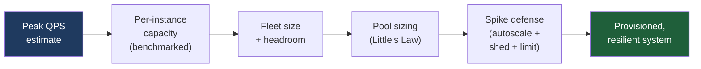
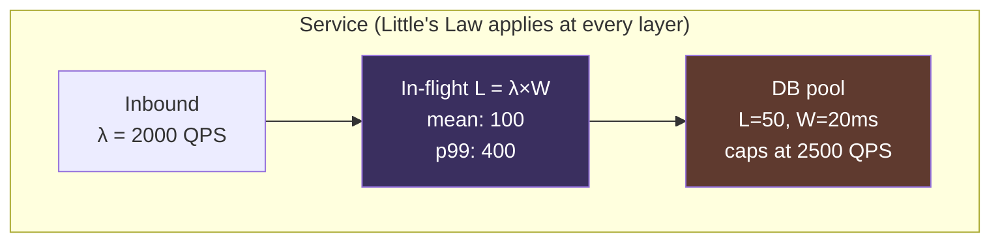
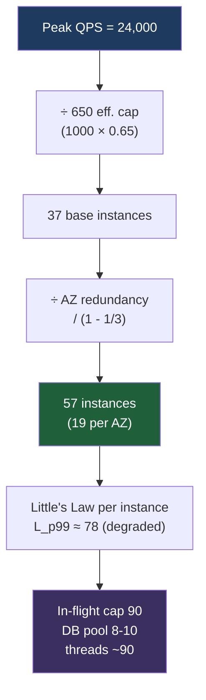
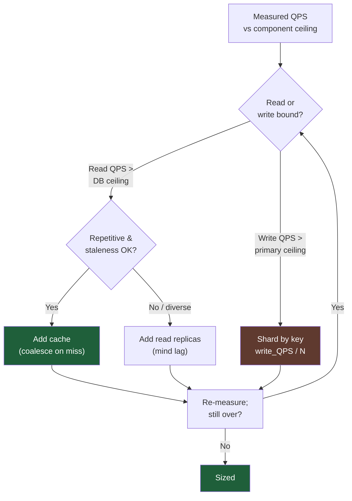
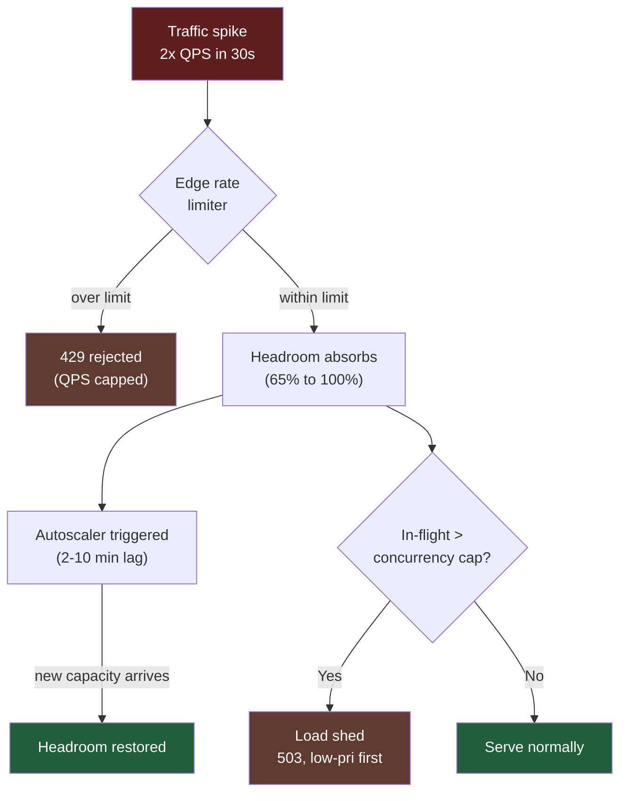

# QPS (Queries Per Second) — Senior

<!-- level-focus -->
At senior level, focus on this question:

> Which system invariant is affected by **QPS (Queries Per Second)** under failure, load, and change?

Use the smallest realistic scenario that exposes the decision and its failure behavior.
As a senior engineer you do not stop at *estimating* QPS — you **own the path from a number to a provisioned, resilient system**. A QPS figure is only useful when it becomes a fleet size, a thread-pool depth, a connection-pool limit, a sharding decision, and an autoscaling policy with explicit headroom. This document is the conversion machinery: how to turn "we expect 40k peak QPS at p99 = 80 ms" into concrete capacity, and how to keep that capacity standing up when traffic spikes faster than your autoscaler can react.

## 1. The Senior's Job: From Number to Sized System

Junior engineers compute QPS. Seniors **provision against it**. The conversion pipeline has five stages, and a mistake at any stage silently propagates:



Two numbers anchor everything downstream:

- **Peak QPS**, not average. Most systems see peak-to-average ratios of 2x–5x; consumer systems with daily cycles or event-driven spikes can hit 10x+. You provision for the peak you will actually serve, then add headroom on top of that.
- **A latency distribution**, not a mean. Little's Law and pool sizing depend on *how long a request occupies a resource*, and the tail (p99) — not the mean — drives queue depth and saturation.

The senior discipline is to make every capacity number **traceable**: each instance count, pool depth, and limit should map back to a benchmarked per-unit capacity and a stated utilization target. "We run 50 instances" is not an answer; "50 instances = 35k peak QPS ÷ (1000 QPS/instance × 0.65 target utilization), rounded up, plus one AZ's worth of redundancy" is.

---

## 2. QPS Per Instance: Where the Number Comes From

You cannot size a fleet without knowing what one instance can serve. This is the single most-faked number in capacity planning, so treat it with suspicion.

**Get it from a load test, not from intuition.** Run the real workload (representative request mix, real payload sizes, warm caches, production-like dependencies) against one instance and find the QPS at which latency SLO breaks — typically where p99 crosses your budget or the instance hits a resource ceiling (CPU, memory bandwidth, GC pauses, connection limits). That QPS is the **saturation point**, often called *maximum sustainable throughput*.

Critically: **per-instance capacity is the throughput at your latency SLO, not the absolute maximum.** An instance might push 1,500 QPS at p99 = 400 ms, but if your SLO is p99 ≤ 100 ms it might only deliver 900 QPS within budget. Use the SLO-bound number.

| Source of per-instance QPS | Trustworthiness | Notes |
|---|---|---|
| Production load test at SLO boundary | High | Gold standard; rerun after major releases |
| Staging load test (prod-like) | Medium-High | Watch for under-provisioned dependencies skewing results |
| Single-endpoint microbenchmark | Low-Medium | Ignores request mix, GC, contention; usually optimistic by 2–3x |
| "Similar service does X" analogy | Low | Different code paths, payloads, runtimes; a starting hypothesis only |
| Theoretical (cores × per-request CPU) | Low | Useful sanity bound, ignores I/O waits and tail latency |

A useful theoretical sanity check for CPU-bound work: if a request consumes **C milliseconds of CPU** and an instance has **N cores**, the ceiling is roughly `(1000 / C) × N` QPS — but real systems hit queueing-induced latency growth well before that, so discount by 30–50%. For I/O-bound work, CPU is the wrong limiter entirely; concurrency (Section 3) governs.

**Always re-benchmark after:** a runtime upgrade, a dependency that changed its latency, a payload-size change, or a new feature on the hot path. Per-instance QPS silently rots.

---

## 3. Little's Law: Sizing Concurrency from QPS and Latency

Little's Law is the most important tool in this document. It connects throughput, latency, and concurrency with a single equation:

```
L = λ × W
```

- **L** = average number of requests *in the system concurrently* (in-flight)
- **λ** (lambda) = arrival rate = **QPS**
- **W** = average time each request spends in the system = **latency** (in seconds)

It holds for any stable system regardless of arrival distribution or service discipline — which is exactly why it's so useful for sizing. The concurrency you must support is dictated by QPS and latency together; you cannot pick a thread-pool size without both.

**Worked concurrency calculation.** Suppose a service handles **2,000 QPS** with a **mean latency of 50 ms** (W = 0.05 s):

```
L = 2000 × 0.05 = 100 concurrent requests
```

So on average **100 requests are in flight at once**. A thread-per-request server needs ~100 worker threads just to keep up with the *mean*. But means lie — you must size for the latency you actually experience under load, and for tail spread.

**The tail correction.** If mean latency is 50 ms but p99 is 200 ms, requests don't drain uniformly. Sizing to mean concurrency leaves you queueing whenever a batch of slow requests coincides. A common senior heuristic: size in-flight capacity to **L at p95–p99 latency, or apply a 1.5x–2x multiplier to mean-derived L**. Using p99:

```
L_p99 = 2000 × 0.200 = 400 concurrent requests
```

The honest sizing for this service is somewhere between 100 (mean) and 400 (p99) — lean toward the higher end for pools that block (DB connections), and toward the lower end with a queue+shedding guard for cheap resources (async event-loop slots).

**Little's Law also works backwards.** If a downstream dependency caps you at **L = 50 concurrent connections** and that dependency's W = 20 ms, your maximum throughput through it is:

```
λ_max = L / W = 50 / 0.020 = 2,500 QPS
```

This is how you discover that a 50-connection pool to a database silently caps the whole service at 2,500 QPS — regardless of how many app instances you run.



---

## 4. Sizing Thread Pools, Connection Pools, and In-Flight Limits

Little's Law gives you the *demand* for concurrency; engineering judgment turns that into pool sizes that don't deadlock or thrash.

**Connection pools (to databases / downstreams).** Size the pool to the concurrency *that layer* needs, not to total app concurrency. A frequent mistake: a 200-thread app with a 200-connection DB pool, when the DB query is fast (W = 5 ms) and you only need `L = QPS × 0.005`. Over-sized DB pools cause more harm than under-sized ones — they let the app push more concurrent queries than the database can serve, collapsing it under context-switching and lock contention. PostgreSQL, for instance, typically performs best with a *small* connection count (often `cores × 2–4`), fronted by a pooler. The pool size should be `min(L_needed_at_this_layer, DB's healthy concurrency ceiling)`.

**Thread pools (blocking / thread-per-request models).** Size to L at the latency tail, because a blocked thread is occupied for the *full* request duration including downstream waits. If `L_p99 = 400`, a blocking server needs ~400 threads, which is often when teams reach for async I/O instead — async lets one thread service many in-flight requests, decoupling thread count from L.

**Async / event-loop models.** Thread count is no longer L; it tracks CPU cores. But L still matters: it's your count of in-flight futures/promises/goroutines, which consume memory and downstream connections. Little's Law still bounds your downstream pool needs.

**In-flight request limits (the load-shedding guard).** Set an explicit **maximum concurrency** (a semaphore / bounded queue) slightly above your provisioned L. When in-flight exceeds it, **reject fast (429/503) instead of queueing unboundedly**. This is the single most effective protection against the metastable failure where rising latency increases L (Little's Law in reverse: if W grows and λ is fixed, L grows), which exhausts pools, which grows W further — a death spiral. A hard in-flight cap breaks the loop.

| Resource | Sizing input | Typical target | Failure mode if oversized |
|---|---|---|---|
| Blocking thread pool | L at p99 latency | ~L_p99, capped by memory | Memory exhaustion, GC thrash, context-switch overhead |
| DB connection pool | L at *DB* latency | min(L_db, cores×2–4 + pooler) | Database meltdown under concurrent query load |
| HTTP client pool to downstream | L at downstream latency | L_downstream + small buffer | Overwhelms downstream, cascading failure |
| In-flight semaphore (shed guard) | Provisioned L | 1.1–1.5 × provisioned L | Admits too much load before shedding; no protection |

The rule: **every pool is a Little's-Law calculation at its own layer's latency.** Pools sized independently of latency are guesses.

---

## 5. Worked Example: QPS to Fleet Size with Headroom

Now the full conversion, end to end. This is the calculation a senior is expected to produce on a whiteboard.

**Given:**
- Average QPS: **8,000**
- Peak-to-average ratio: **3x** → **peak QPS = 24,000**
- Per-instance capacity at SLO (benchmarked): **1,000 QPS/instance** (p99 ≤ 80 ms holds up to here)
- Target utilization (headroom): **65%** (we want each instance running at ≤ 65% of saturation at peak)
- Deployed across **3 availability zones**, must survive **1 AZ loss**
- Mean latency under load: **40 ms**; p99: **120 ms**

**Step 1 — Effective per-instance capacity at the utilization target.**

```
Effective capacity = 1000 QPS × 0.65 = 650 QPS/instance
```

We deliberately do *not* plan to run instances at their saturation point. The 35% headroom absorbs sub-second bursts, GC pauses, autoscaling lag, and uneven load-balancer distribution.

**Step 2 — Base fleet size for peak.**

```
Instances = ceil(24,000 peak QPS / 650 QPS/instance)
          = ceil(36.9) = 37 instances
```

**Step 3 — Add AZ-failure redundancy (N+1 at the zone level).**

With 3 AZs, losing one AZ removes ~1/3 of capacity. To still serve peak after losing one zone, provision so that **2 zones can carry the full peak**:

```
Per-zone need (survive 1 AZ loss) = 24,000 / 2 zones = 12,000 QPS per surviving zone
Across 3 zones at peak = 12,000 × 3 / ...
```

More directly: provision total capacity = `peak / (1 - 1/AZ_count)` = `24,000 / (1 - 1/3)` = `24,000 / 0.667 = 36,000 QPS` of *deliverable* capacity.

```
Instances = ceil(36,000 / 650) = ceil(55.4) = 56 instances
```

Round to **57 instances (19 per AZ)** for clean per-zone distribution. If any one AZ drops, the remaining 38 instances still deliver `38 × 650 = 24,700 QPS ≥ 24,000 peak`. ✓

**Step 4 — Size the pools with Little's Law.** Per instance at peak: each carries `24,000 / 57 ≈ 421 QPS` (and up to `24,700/38 ≈ 650` in degraded mode — exactly the utilization ceiling). Per-instance concurrency:

```
L_mean = 421 × 0.040 = 17 in-flight (normal)
L_p99  = 421 × 0.120 = 51 in-flight (tail)
Degraded mode L_p99 = 650 × 0.120 = 78 in-flight
```

So per instance:
- **In-flight semaphore (shed guard): ~90** (above degraded L_p99 = 78, with margin) — beyond this, reject with 503.
- **Worker threads (if blocking): ~80–100**, or async event loop sized to cores with an 90-permit concurrency limiter.
- **DB connection pool:** if DB query W = 8 ms, `L_db = 650 × 0.008 ≈ 6 per instance at degraded peak`. Set pool to **8–10 per instance** — and verify `57 instances × 10 = 570 total connections` is within the database's healthy ceiling. If not, you've just discovered you need a connection pooler (PgBouncer) or fewer-but-larger instances.

**Step 5 — Cross-check the bottleneck.** `570 DB connections` may exceed Postgres comfort (often a few hundred). This is the moment caching/replicas/sharding enters the conversation (Section 6). The fleet math is fine; the *database* is the constraint.

**Result:** **57 instances (19/AZ), in-flight cap 90, thread/async limit ~90, DB pool 8–10/instance fronted by a pooler.** Every number traces to a benchmark and a stated target.



---

## 6. When QPS Forces Caching, Replicas, or Sharding

Stateless app tiers scale linearly — add instances, serve more QPS. The **data tier does not**, and that's where QPS estimates force architectural decisions. The trigger is always the same: *a per-component QPS ceiling has been crossed.*

**Read QPS that swamps the database → cache and/or read replicas.**

When read QPS exceeds what your primary can serve at SLO, you have two levers:

- **Cache (Redis/Memcached) in front of the DB.** Most effective when reads are repetitive and tolerate slight staleness. A cache hit ratio `h` reduces DB read load to `(1 - h) × read_QPS`. At 90% hit rate, 50,000 read QPS becomes 5,000 QPS to the DB. *Size the cache with Little's Law too:* a Redis node serving `R` QPS at `W` ms holds `L = R × W` in flight — cheap because W is sub-millisecond, but the per-node QPS ceiling (often 100k+ ops/s) and the **thundering-herd on cache miss/expiry** are real constraints. Use request coalescing / single-flight to prevent a popular key's expiry from stampeding the DB.
- **Read replicas.** When reads are too diverse to cache or must be fresh, route reads to N replicas, multiplying read capacity ~N×. Cost: **replication lag** — replicas serve slightly stale data, so reads that must be read-your-writes consistent stay on the primary. Replicas don't help write QPS at all.

**Write QPS that exceeds a single primary's ceiling → shard.**

This is the hard one. A single primary has a write-throughput ceiling (disk fsync rate, WAL throughput, lock contention). Caching doesn't help writes; replicas don't help writes (every write still hits the primary, then fans out). When **sustained write QPS > primary's write ceiling**, you must **shard**: partition data across independent primaries by a shard key, so each shard absorbs `write_QPS / shard_count`.



| Pressure | Symptom | First reach for | When that's not enough |
|---|---|---|---|
| High read QPS, repetitive | DB read CPU saturated, same keys hot | Cache | Replicas, then shard reads |
| High read QPS, diverse | DB read CPU saturated, low cache hit | Read replicas | Shard |
| High write QPS | Primary fsync/WAL/lock-bound | **Shard** (only real fix) | More shards; batch writes; CQRS |
| Hot key / hot shard | One shard or key dominates | Split hot key, finer shard fn | Dedicated capacity for hot entity |

**The ordering matters.** Cache before replicas before sharding — each step is more operationally expensive than the last. Sharding adds cross-shard query pain, rebalancing, and distributed-transaction complexity, so you defer it until QPS genuinely forces it. But the senior also recognizes when caching is a band-aid delaying an inevitable shard, and plans the shard key *before* the emergency.

---

## 7. Designing for Spikes: Autoscaling Lag, Load Shedding, Rate Limiting

Provisioning for *steady* peak QPS is necessary but not sufficient. Real traffic spikes faster than infrastructure can react, and the senior's job is to keep the system standing during the gap.

**Autoscaling lag is the core problem.** From "load rises" to "new instances serve traffic" there is a multi-minute pipeline:

```
detection (metric scrape + alarm)   ~30-90s
  + scaling decision / API call       ~10-30s
  + instance provision / VM boot      ~60-180s
  + app start + warmup (JIT, caches)  ~30-300s
  --------------------------------------------
  total cold-start lag:               2-10 minutes
```

A traffic spike that doubles QPS in 30 seconds will saturate your fleet **minutes before** new capacity arrives. Therefore autoscaling alone cannot protect you against sharp spikes — it handles *trends*, not *bursts*. You need three defenses working together:

1. **Provisioned headroom (Section 8)** absorbs the spike during the lag window. This is why you run at 65%, not 95% — the slack *is* your spike buffer.
2. **Rate limiting** caps QPS *entering* the system to a level the fleet can serve. A token-bucket limiter at the edge enforces "we accept at most X QPS" and rejects the rest with 429. This is a **QPS guard**: it converts an unbounded spike into a bounded, serve-able load plus a clean rejection signal. Per-tenant/per-key limits also prevent one client's burst from consuming the whole fleet's headroom.
3. **Load shedding** is the last line: when in-flight concurrency exceeds the Little's-Law-derived cap (Section 4), the server **rejects fast** rather than queueing into a latency death-spiral. Shed *cheap* and *early* — drop low-priority requests first (a `Priority` header or endpoint tier), preserve the critical path. A 503 served in 1 ms is infinitely better than a 30-second timeout that holds a thread and a connection hostage.



**The defenses are layered by cost and reach.** Rate limiting is cheapest and rejects at the edge (saves all downstream work). Headroom is pre-paid capacity. Load shedding is the in-process safety valve when the first two are overwhelmed. Autoscaling is the slow, durable fix that eventually makes the spike the new normal. A system with only autoscaling and no shedding/limiting will cascade-fail during any spike sharper than its provisioning pipeline — which is most real spikes.

**Pre-scaling for *known* spikes.** When the spike is predictable (a scheduled sale, a product launch, a sports event, a cron-driven batch), don't rely on reactive autoscaling at all — **pre-scale** by raising the floor before the event. Reactive autoscaling is for the unknown; scheduled scaling is for the known.

---

## 8. Headroom vs Cost: The Utilization Target

Headroom is not waste — it is purchased insurance against the lag in Section 7 and the variance in Section 3. But it's a real cost, and the senior makes the trade-off explicitly rather than by reflex.

**Why not run at 100%?** A system at 100% utilization has zero capacity to absorb (a) sub-second bursts within a "peak" second, (b) uneven load-balancer distribution (real hashing/least-conn is never perfectly even), (c) the latency growth that Little's Law guarantees as utilization approaches 1, and (d) the autoscaling lag window. Queueing theory is brutal here: as utilization ρ approaches 1, queue length and latency grow as roughly `1 / (1 - ρ)`. At ρ = 0.9, latency multiplier is ~10x the unloaded value; at ρ = 0.95 it's ~20x. **This is why p99 explodes when a fleet quietly drifts past ~80% utilization** even though "average CPU is fine."

| Target utilization | Headroom | Latency behavior | Cost | When appropriate |
|---|---|---|---|---|
| 50% | 2x | Flat, tail well-controlled | High | Spiky/unpredictable traffic, strict SLO, slow autoscaling |
| 60–70% | ~1.5x | Stable, predictable tail | Balanced | **Default for most online services** |
| 80% | 1.25x | Tail starts climbing | Lower | Smooth traffic, fast autoscaling, looser SLO |
| 90%+ | 1.1x | Tail explodes on any burst | Lowest | Batch/async only, where queueing is acceptable |

**The 60–70% default** balances cost against the queueing wall and the autoscaling lag. It says: at *peak*, instances run at ≤ 65% of their benchmarked SLO-bound saturation — leaving 35% to absorb the burst until autoscaling or shedding engages. Push lower (50%) when traffic is spiky and autoscaling is slow; push higher (80%) only when traffic is smooth, autoscaling is fast, and the SLO has slack.

**Cost lever, not just a safety lever.** The headroom target directly multiplies fleet size: dropping from 50% to 65% target shrinks the fleet by ~23%. On a 100-instance fleet that's real money every month. The senior's move is to *measure* the actual peak-to-average ratio and burst sharpness, then set the lowest utilization target that keeps p99 within SLO during real spikes — and revisit it as traffic patterns and autoscaling speed change. Headroom you never use is over-insurance; headroom you blow through during every spike is under-insurance.

---

## 9. A Capacity Decision Checklist

Before declaring a service "sized," a senior confirms each of these — every "yes" should trace to a number, not a feeling:

- [ ] **Peak QPS, not average**, drives the fleet math (with a measured, not assumed, peak-to-average ratio).
- [ ] **Per-instance capacity is benchmarked at the SLO boundary**, on a prod-like workload, and re-benchmarked after major changes.
- [ ] **Fleet size = peak QPS ÷ (per-instance × utilization target)**, rounded up, with the utilization target stated.
- [ ] **AZ/zone redundancy** is added so surviving zones carry full peak (`/ (1 - 1/AZ_count)`).
- [ ] **Every pool is sized via Little's Law at its own layer's latency** (thread, DB connection, downstream client), using the tail (p95–p99), not the mean.
- [ ] **An in-flight concurrency cap** exists and triggers fast rejection (load shedding) above provisioned L.
- [ ] **A rate limiter at the edge** caps incoming QPS to a serve-able level, with per-tenant fairness.
- [ ] **The data tier's QPS ceilings are checked** — read path (cache/replica) and write path (shard) — and the next scaling step is identified *before* it's an emergency.
- [ ] **Autoscaling lag is quantified** and **headroom covers the lag window**; known spikes are pre-scaled, not left to reactive scaling.
- [ ] **Utilization target reflects the queueing wall** (default 60–70%, lower for spiky traffic) and is justified against cost.

---

## 10. Common Mistakes Seniors Are Expected to Catch

**Sizing to average QPS.** Provisioning for 8,000 average when peak is 24,000 means the system melts every busy hour. Always peak, always with headroom.

**Trusting microbenchmark per-instance numbers.** A single-endpoint benchmark with warm caches and no contention overstates real capacity by 2–3x. The fleet built on it is a third too small.

**Sizing pools to mean latency.** Little's Law with mean W underestimates concurrency demand; the system queues whenever a batch of p99-tail requests coincides. Size to the tail.

**Oversizing the DB connection pool.** A huge pool lets the app overwhelm the database, turning a healthy DB into a context-switching, lock-contended mess. Size DB pools to the *DB's* healthy concurrency, fronted by a pooler — smaller than app concurrency.

**Caching to defer an inevitable shard.** Caching read QPS while write QPS climbs toward the primary's ceiling just postpones the wall. If writes are the pressure, only sharding helps — plan the shard key early.

**Relying on autoscaling for burst protection.** Autoscaling's multi-minute lag cannot catch a 30-second spike. Headroom + rate limiting + load shedding bridge the gap; autoscaling handles the trend afterward.

**No in-flight cap (no load shedding).** Without a hard concurrency ceiling, rising latency grows in-flight count (Little's Law in reverse), which exhausts pools, which grows latency further — a metastable death spiral. A fast-reject cap breaks it.

**Running the fleet near 100% to save cost.** The queueing wall makes p99 explode past ~80% utilization. The "savings" buy you a fragile system that fails on the first burst. Headroom is insurance with a measurable premium — set it deliberately.

**Ignoring uneven load distribution.** Load balancers don't distribute perfectly; the hottest instance runs well above the fleet average. Provision so the *hottest* instance, not the average one, stays within its utilization target.

The throughline: **every capacity number must trace to a benchmark and a stated target.** A senior who can recite their fleet size, pool depths, utilization target, and spike defenses — and connect each back to peak QPS and a latency distribution via Little's Law — has done the job. One who can only say "it seems like enough" has not.

---

*Next step:* [Professional level](professional.md)

---

## Apply it

1. State the system invariant that **QPS (Queries Per Second)** must protect.
2. Mark ownership, state, and failure propagation at each boundary.
3. Compare two designs under load, dependency failure, and future change.
4. Define recovery and compatibility behavior before implementation.
5. Test the riskiest assumption with a focused experiment.

## Verify your work

- The experiment supports the design with evidence, not preference.
- Failure injection shows the blast radius and recovery path.
- Compatibility checks cover old and new callers or data.
- Operational signals reveal invariant violations and recovery progress.

## Review questions

- Which invariant must remain true when QPS (Queries Per Second) fails?
- Where should recovery responsibility live, and why?
- Which assumption deserves an experiment before implementation?
- How can the design evolve without changing every consumer at once?
