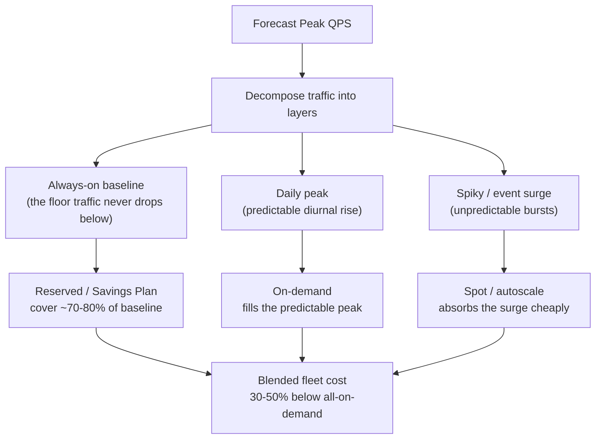
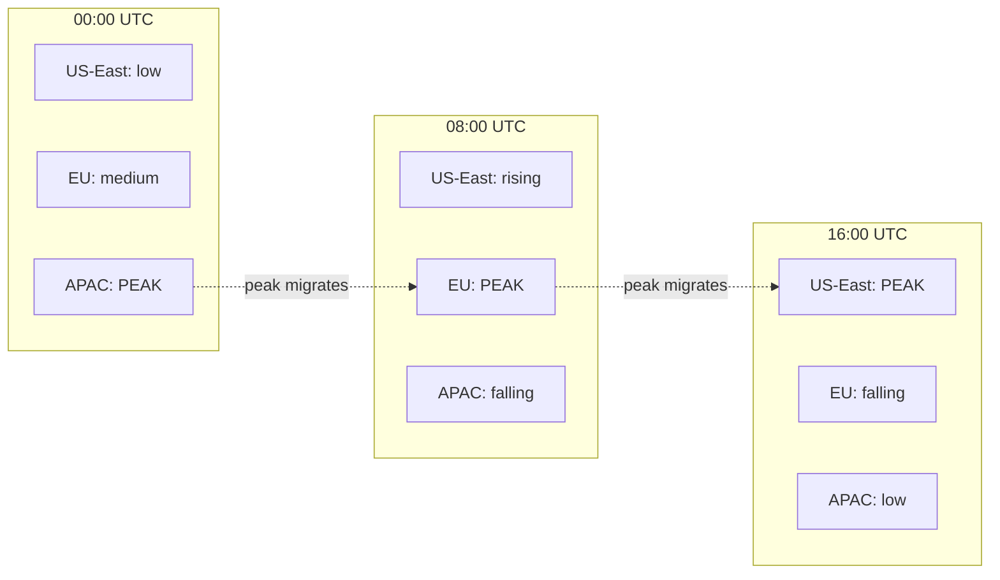
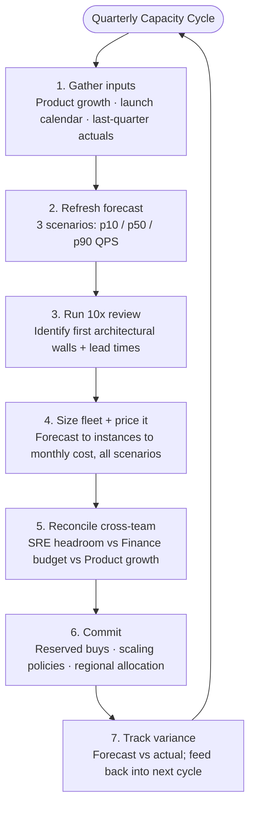
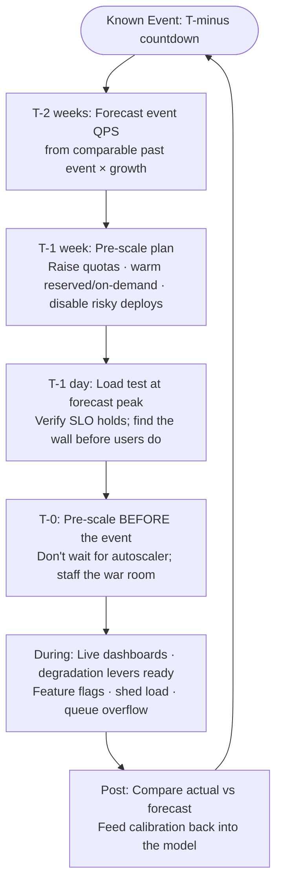

# QPS (Queries Per Second) — Staff / Principal Level

At junior and senior levels, QPS is a number you compute on a whiteboard to size a service. At the staff and principal level, QPS stops being a number and becomes an **instrument**: a forecast you defend to finance, a budget line you justify to your VP, a regional allocation you negotiate with SRE, and a war-room readiness gate you sign off before a launch. The arithmetic is the easy part. The hard part is that the same forecast feeds three audiences with opposing incentives — product wants to under-provision (cheaper, looks efficient), SRE wants to over-provision (safer, fewer pages), finance wants the number to stop changing. Your job is to make one defensible model that all three can act on.

This document treats QPS as an **organizational and economic axis**, not a deeper dive into the math. It covers growth modeling, turning peak-QPS into a cost budget, regional distribution, the recurring capacity-planning ritual, the asymmetric cost of over- vs under-provisioning, and event-driven forecasting. It ends with a worked forecast → fleet → monthly-cost example you can lift into a real planning doc.

A guiding principle runs through everything below: **the value of a capacity forecast is not its precision, but the decisions it enables.** A forecast accurate to three significant figures that nobody acts on is worthless; a rough forecast with honest confidence bands that triggers a reserved purchase, a sharding project, and a quota increase at the right times is gold. Throughout, the question to keep asking is "what *decision* does this number change, and for whom?" If a number changes no decision, it doesn't belong in the planning doc. If a decision is being made without a number behind it, that's the gap to fill. Staff-level capacity work is the discipline of connecting forecasts to commitments — and being right often enough that people keep listening.

## Table of Contents

1. [From Number to Instrument: What Changes at Staff Level](#1-from-number-to-instrument-what-changes-at-staff-level)
2. [Growth Modeling: Projecting QPS Forward](#2-growth-modeling-projecting-qps-forward)
3. [The "Design for the Next 10×" Capacity Review](#3-the-design-for-the-next-10-capacity-review)
4. [From Peak QPS to a Fleet: Sizing the Machine Count](#4-from-peak-qps-to-a-fleet-sizing-the-machine-count)
5. [From Fleet to Budget: The Cost of Headroom](#5-from-fleet-to-budget-the-cost-of-headroom)
6. [Reserved vs On-Demand vs Spot: The Commitment Trade-off](#6-reserved-vs-on-demand-vs-spot-the-commitment-trade-off)
7. [Regional QPS Distribution: Where Traffic Is, Capacity Must Be](#7-regional-qps-distribution-where-traffic-is-capacity-must-be)
8. [The Capacity-Planning Cycle as a Cross-Team Ritual](#8-the-capacity-planning-cycle-as-a-cross-team-ritual)
9. [The Asymmetric Cost of Over- vs Under-Provisioning](#9-the-asymmetric-cost-of-over--vs-under-provisioning)
10. [Autoscaling Shifts the Decision, It Does Not Remove It](#10-autoscaling-shifts-the-decision-it-does-not-remove-it)
11. [Event-Driven Forecasting and War-Room Readiness](#11-event-driven-forecasting-and-war-room-readiness)
12. [Buffer vs Burst: Two Patterns for Absorbing Forecast Error](#12-buffer-vs-burst-two-patterns-for-absorbing-forecast-error)
13. [Worked Example: Forecast → Fleet → Monthly Cost](#13-worked-example-forecast--fleet--monthly-cost)
14. [Common Failure Modes and How They Read in a Review](#14-common-failure-modes-and-how-they-read-in-a-review)
15. [Staff-Level Judgment Checklist](#15-staff-level-judgment-checklist)
16. [Visualization](#16-visualization)

---

## 1. From Number to Instrument: What Changes at Staff Level

A senior engineer asked "what's the QPS?" answers with a point estimate: "peak is about 40k." A staff engineer asked the same question answers with a **distribution and a horizon**: "median 12k, daily peak 40k, forecast peak in 12 months is 95k at the p90 growth scenario, and here's what each scenario costs." The shift is from *measuring* to *committing*.

The deepest shift is in what "wrong" costs. At senior level, a wrong QPS estimate means you re-tune autoscaling next sprint — cheap, reversible, contained within engineering. At staff level, the same model has already triggered a multi-year reserved-capacity purchase, set a launch-readiness gate, and allocated capacity across regions. Wrong now propagates outward into capital, calendar, and on-call burden — slow and expensive to reverse. The estimate carries more leverage, so the rigor around it has to be higher, and the honesty about its uncertainty has to be explicit rather than implied.

Three things change:

- **Time horizon.** Senior sizing is for *now plus a safety margin*. Staff sizing is for *now, next quarter, and the 10× event two years out* — because the architecture you choose today either survives that growth or forces a rewrite you'll be blamed for.
- **Audience.** The number now leaves engineering. Finance turns it into a capital commitment; product turns it into a launch gate; SRE turns it into an on-call burden. A wrong forecast doesn't just cause a latency blip — it causes a budget overrun or a missed launch.
- **Ownership.** "What's the QPS" has an owner now, and a cadence. Someone is on the hook to refresh the forecast every quarter and explain the variance. At staff level, that someone is frequently you.

The recurring failure mode is treating the forecast as a one-time spreadsheet. Traffic forecasts decay — a model built on last year's growth curve is wrong the moment a competitor launches, a feature ships, or a market opens. The instrument needs maintenance, not just construction.

There's also a credibility dimension that's easy to miss. The first time your forecast is wrong by 3× in a budget review, you lose the room — finance stops trusting your numbers and starts applying their own arbitrary discount to everything you present. Calibration is not just an engineering nicety; it's the currency that lets you get capacity investments approved at all. A staff engineer who is *reliably roughly right* — and who explicitly states confidence bands so a miss inside the band isn't a surprise — accumulates the trust to make a big ask when it matters (a new region, a sharding project, a reserved commitment). The engineer who presents false precision and misses spends their credibility down to zero and then can't get the headroom approved when the real spike is coming.

---

## 2. Growth Modeling: Projecting QPS Forward

QPS growth is rarely a single curve. Decompose it into the factors you can independently forecast and defend:

```
Future QPS  =  Current QPS
            ×  User-Growth Multiplier      (more users)
            ×  Engagement Multiplier        (each user does more)
            ×  Feature Multiplier           (new surfaces generate calls)
            ÷  Efficiency Factor            (caching, batching, dedup reduce calls/action)
```

Modeling each factor separately matters because they have different drivers, owners, and uncertainty bands. User growth is a product/marketing number. Engagement is a function of product stickiness. The feature multiplier is the most dangerous and most overlooked: a single new feature that fans out 5 backend calls per page view can dwarf organic user growth. The efficiency factor is the one *you* control — it's the engineering lever that buys time.

**Choose a curve that matches the regime:**

| Growth regime | Model | When it applies | Forecast risk |
|---|---|---|---|
| Early/viral | Exponential (`Q₀·(1+r)ⁿ`) | Pre-product-market-fit, viral loops | Over-forecasts late; compounds error fast |
| Mature scaling | Logistic / S-curve | Approaching market saturation | Under-forecasts if you misjudge the ceiling |
| Steady | Linear / seasonal-adjusted | Established product, predictable cohorts | Misses step-changes from launches |
| Event-driven | Baseline + spike envelope | Sales, launches, news cycles | Spikes don't fit any smooth curve |

Each model also implies a different *uncertainty shape* over the horizon, which matters more than the central estimate. An exponential model's error compounds: a small mis-estimate in the growth rate becomes an enormous mis-estimate in QPS twelve months out, so the confidence band fans open dramatically and the far end of the forecast is nearly worthless for committing capital. A logistic model's uncertainty is concentrated around *when* you hit the inflection and *where* the ceiling sits — get those wrong and you misjudge the plateau, but you won't be off by 10×. Knowing the shape of your uncertainty tells you how far out you can responsibly commit reserved capacity (short, for exponential regimes; longer, once you're near the logistic plateau) and how wide a buffer the forecast-error margin needs to be.

The single biggest mistake is applying an exponential model to a maturing product — you provision for a curve the traffic will never reach and burn budget, or you apply linear to a viral product and get paged when it goes parabolic. **Always run three scenarios** — conservative (p10 growth), expected (p50), aggressive (p90) — and price all three. Presenting a single number to leadership hides the uncertainty that is the whole point of the exercise.

A defensible forecast also uses **leading indicators**, not just the QPS time series. Signups, DAU, items-created, and connected accounts often lead QPS by weeks; tracking the leading metric gives you runway to provision before the traffic arrives rather than after the page.

A subtle but critical point: **QPS and user count are not linearly coupled.** Doubling users rarely doubles QPS — and sometimes more than doubles it. A power-user cohort can generate 10× the requests of a casual user, so a marketing push that adds casual signups moves QPS less than expected, while a feature that activates dormant users moves it more. The correct unit of forecasting is often **QPS-per-engaged-user × engaged-users**, decomposed by cohort, rather than a single blended ratio. When you see a forecast built on "users × constant requests-per-user," distrust it: the constant is rarely constant, and the error compounds over the horizon.

Finally, separate **read QPS from write QPS** in the model. They scale differently, hit different bottlenecks, and cost differently. Reads scale almost linearly with caching and replicas — they're cheap to absorb. Writes hit the single-writer wall from §3, often can't be cached, and frequently fan out to replication, indexing, and downstream consumers. A forecast that reports one blended QPS number hides whether the growth is in the cheap dimension (reads) or the expensive one (writes). Two services with identical total QPS forecasts can have wildly different cost and architectural-risk profiles depending on the read/write split.

---

## 3. The "Design for the Next 10×" Capacity Review

The "next 10×" review is a deliberate ritual: take the current peak QPS, multiply by 10, and ask *what breaks first*. It is not about provisioning 10× the fleet today — it's about discovering which architectural assumption becomes a wall before the budget does.

The value is that bottlenecks at 10× are almost never where the fleet is. The stateless service tier scales linearly with money; the things that don't are:

- **Single-writer databases** — a primary that handles 40k writes/s may have no path to 400k without sharding, and sharding is a 6-month project, not a scale-up.
- **Connection limits** — every app instance holds DB connections; 10× instances can exhaust the database's connection ceiling long before CPU does.
- **Coordination services** — ZooKeeper/etcd, leader election, distributed locks, and anything doing global consensus scale poorly and fail loudly.
- **Hot keys and fan-out** — a celebrity user or a viral item creates a per-key hotspot that no amount of horizontal scaling fixes.
- **Cross-AZ/region bandwidth and cost** — chatty east-west traffic that's invisible at 1× becomes a six-figure line item at 10×.

The deliverable from a 10× review is a ranked list of "first walls" with a rough QPS at which each is hit and the lead time to fix it. That lead time is the real output: if sharding takes two quarters and the p90 forecast hits the write ceiling in three quarters, you start *now*. Capacity planning at staff level is fundamentally about matching **fix lead-time** against **forecast arrival-time**.

A useful framing is to distinguish **elastic** from **non-elastic** scaling, because they demand opposite responses. Elastic dimensions (stateless compute, read replicas, cache tier) scale with money on a timescale of minutes-to-days — you can defer the decision and buy capacity when the traffic actually arrives. Non-elastic dimensions (sharding a primary, changing a partition key, migrating a datastore, renegotiating a third-party API quota) scale on a timescale of months and often require a migration that itself risks downtime. For elastic dimensions, *forecasting buys efficiency*; for non-elastic dimensions, *forecasting buys survival*. The whole point of the 10× review is to surface the non-elastic walls early enough that their long lead-time fits inside the forecast horizon. A non-elastic wall discovered at 80% of capacity is an emergency; the same wall discovered two years out is a roadmap item.

It's worth doing this review at multiple multiples, not just 10×. 2× tells you what breaks this year and is a near-term planning input; 10× tells you what breaks at the next architectural era and informs design choices today; 100× is a thought experiment that reveals whether the *fundamental approach* has a ceiling (a design that can't conceivably reach 100× may need rethinking before you invest further in it). The multiple you emphasize depends on your growth regime — a hypergrowth startup cares about 10× this year, a mature service cares about 2× and cost efficiency.

---

## 4. From Peak QPS to a Fleet: Sizing the Machine Count

Translating a forecast into a machine count is mechanical but full of judgment knobs. The core formula:

```
Instances = ceil( Peak_QPS / Per_Instance_Capacity / Target_Utilization )

Per_Instance_Capacity = derived from load test at the SLO latency, NOT from CPU saturation
Target_Utilization     = the headroom decision (e.g. 0.6 means run at 60%, keep 40% buffer)
```

Two knobs carry all the weight:

**Per-instance capacity must be measured at the SLO, not at saturation.** An instance might handle 1,000 QPS before it falls over, but if your p99 latency SLO is breached at 600 QPS, your real capacity is 600. Sizing off the saturation number guarantees SLO violations under load. This is the most common sizing error that survives into production. The gap between saturation and SLO-capacity is the queueing-theory tail: as utilization climbs toward 100%, latency rises super-linearly long before throughput stops increasing, so the last 40% of "throughput capacity" is bought at the price of a latency SLO you've already committed to. Your usable capacity ends where the latency curve crosses the SLO, not where the box stops accepting work.

Per-instance capacity is also **not a constant** — it drifts with every release. A new feature, a heavier serialization format, an added downstream call, or a dependency that got slower all reduce QPS-per-instance, silently inflating the fleet you need for the same traffic. This is why per-instance capacity should be re-measured each planning cycle, ideally via automated load tests in CI, not assumed stable from last quarter. A forecast built on a capacity number that's quietly decayed under-sizes the fleet by exactly the amount the service got heavier.

**Target utilization is the headroom decision in disguise.** Running at 60% utilization means you're paying for 40% idle capacity — but that buffer absorbs traffic spikes, instance failures, deploy-time capacity dips, and forecast error. The right number depends on how fast you can add capacity (slow autoscaling → more buffer) and how spiky the traffic is. A common staff-level mistake is letting finance push utilization to 85% to cut cost, then discovering the fleet has no room to absorb a single AZ failure.

Always add **N+1 (or N+2) redundancy on top**: the fleet must serve peak QPS even with one full availability zone down. If you run in 3 AZs, you size each AZ to carry 50% of peak so that losing one still leaves the surviving two able to serve 100%. This redundancy multiplier is frequently larger than the headroom multiplier and is the line item finance pushes back on hardest.

These multipliers **stack**, and forgetting that they multiply rather than add is a classic sizing error. Starting from the raw QPS-derived count, you apply the SLO-capacity divisor, then the utilization headroom, then the AZ-redundancy factor, then a forecast-error margin. A service whose raw minimum is 100 instances can easily land at 250–300 once every multiplier is honestly applied — and each multiplier is defensible on its own. The staff skill is making each one *visible and individually justified* in the sizing doc, so the review challenges them one at a time rather than rejecting the whole number as "too high." When finance pushes back, you want to be defending "the 1.67× AZ-redundancy factor buys single-zone-failure survival," not an opaque total.

Also size for the **deploy-time dip.** During a rolling deploy, some fraction of the fleet is draining or restarting and not serving. If you deploy 20% of the fleet at a time, you've temporarily removed 20% of capacity — at peak, that's an outage unless the utilization headroom already covers it. Many teams discover this the hard way when their first peak-hour deploy coincides with a traffic high. The deploy strategy and the utilization target are coupled decisions, not independent ones.

---

## 5. From Fleet to Budget: The Cost of Headroom

Once you have an instance count, the budget is arithmetic — but the *shape* of the budget is a story about headroom.

```
Monthly Compute Cost  =  Instances  ×  Instance_Hourly_Price  ×  730 hours

Total Monthly Cost    =  Compute
                      +  Load Balancer / egress / inter-AZ data transfer
                      +  Data tier (DB, cache, replicas) — often the larger half
                      +  Observability (metrics/logs/traces scale with QPS!)
```

Two truths that trip up first-time staff planners:

**Observability cost scales with QPS.** Every request emits metrics, logs, and trace spans. At 100k QPS, log and metric ingestion can rival or exceed the compute bill. A forecast that doubles QPS doubles the observability bill too, and that line is invisible if you only model compute. Model it explicitly or it shows up as a surprise.

**Headroom has a hard dollar number — name it.** If you size for 60% utilization with N+1 redundancy across 3 AZs, you might be running 2.5× the theoretical minimum fleet. That multiplier *is* the cost of reliability. The staff move is to make it explicit: "We spend $X/month on headroom; here's the SLO and failure-tolerance it buys." That reframes the finance conversation from "why is the bill so high" to "what reliability are we buying, and is it worth it" — a conversation you can win.

A useful artifact is the **cost-per-million-requests** metric. Dividing total monthly cost by monthly request volume gives a unit economic number that's comparable across services and over time. If cost-per-million-requests is rising as you scale, you have a scaling-efficiency problem that no amount of growth will fix — it gets worse with success.

Tie this back to the business with **cost-per-active-user** and **infrastructure-cost-as-a-percentage-of-revenue**. These are the numbers a CFO actually tracks. If a feature ships that doubles QPS but the requests come from users who don't convert, your infra cost rises while revenue doesn't — and the cost-per-active-user metric exposes it before the quarterly review does. The staff engineer who can connect a QPS forecast to a unit-economics line speaks the language that gets capacity investments approved. The reverse is also a tool: when cost-per-active-user is falling as you grow, you have a story that *justifies* spending more on headroom, because each marginal user is cheaper to serve than the last.

To make the headroom-cost story concrete, it helps to show the multiplier stack as a single table that walks from theoretical minimum to billed fleet — this is the artifact that wins the finance conversation because every row is independently defensible:

| Layer | Multiplier | Running instance count | What it buys |
|---|---|---|---|
| Theoretical minimum (QPS ÷ raw capacity) | 1.00× | 100 | Serves peak with zero margin |
| SLO-capacity (use SLO throughput, not saturation) | ×1.25 | 125 | Keeps p99 inside the latency SLO |
| Utilization headroom (run at 60%) | ×1.20 | 150 | Absorbs spikes + deploy dips |
| AZ redundancy (survive one zone of three) | ×1.50 | 225 | Single-zone-failure survival |
| Forecast-error margin (p50→buffer toward p90) | ×1.15 | ~259 | Absorbs forecast miss without re-architecting |

The billed fleet is 2.6× the theoretical minimum, and *that entire multiplier is the cost of reliability and uncertainty*. Presenting it this way reframes the review: finance can no longer ask "why so many machines?" as one opaque question — they have to challenge a specific row, at which point you defend exactly the reliability or SLO commitment that row buys. Rows get negotiated; totals get rejected.

It's also worth modeling the **marginal cost of the next 10k QPS**, not just the total. Early in a service's life, fixed costs (the minimum viable control plane, a baseline of replicas, observability floor) dominate, so the first units of QPS are expensive per-request. As you scale, those fixed costs amortize and the marginal cost falls — until you hit a step-change (a new shard, a new region, a bigger database tier) where it jumps. Knowing where those step-changes sit lets you time the jump deliberately rather than discovering it as a sudden bill increase. The cost curve is staircase-shaped, not smooth, and the staff move is to know where the next step is.

---

## 6. Reserved vs On-Demand vs Spot: The Commitment Trade-off

The fleet has a *shape* over time: a stable baseline that's always running, a predictable daily peak, and unpredictable spikes. Matching the purchasing model to each layer is where real money is saved or wasted.

| Purchasing model | Price vs on-demand | Commitment | Best for | Risk |
|---|---|---|---|---|
| Reserved / Savings Plan (1–3 yr) | ~30–60% cheaper | High — pay even if idle | The always-on baseline | Over-commit if traffic drops; locked in |
| On-demand | Baseline (1.0×) | None | Daily peak above baseline, uncertain growth | Most expensive per hour |
| Spot / preemptible | ~60–90% cheaper | None, but reclaimable | Stateless, fault-tolerant, batch, spike absorption | Can vanish with minutes' notice |

The staff-level allocation strategy is layered:



The discipline is to **reserve only the floor you are certain of**. Reserving 100% of peak locks you into paying for capacity you only use 4 hours a day. Reserving the baseline and flexing the rest with on-demand and spot captures the discount where it's safe and keeps flexibility where the forecast is uncertain. The single most expensive mistake is over-committing reserved capacity to a forecast that doesn't materialize — you've prepaid for idle machines for one to three years.

The commitment is fundamentally a **bet on forecast confidence over a time horizon**. A 3-year reservation only pays off if you're confident the workload exists in 3 years on roughly this platform — a strong assumption in a fast-moving org. Prefer flexible commitment instruments (compute savings plans that apply across instance families and regions, or 1-year over 3-year terms) when the forecast is uncertain, even though the headline discount is smaller; the flexibility is worth the spread. The right comparison isn't "which discount is biggest" but "expected savings × probability the commitment is still useful, minus the cost of being locked into the wrong thing." A modest discount you're certain to use beats a large discount you might strand.

There's also an organizational angle: **who owns the commitment.** Reserved capacity is often pooled across many teams by a central FinOps function, so an individual service's reservation decision affects a shared commitment pool. The staff engineer's job is to feed an accurate, confidence-banded baseline forecast into that pool — over-stating your certain floor makes the org over-commit; under-stating it leaves cheap discount on the table. The same calibration discipline that earns credibility in the budget review directly translates into real dollars at the commitment-pool level.

---

## 7. Regional QPS Distribution: Where Traffic Is, Capacity Must Be

A global QPS number is a fiction the moment you operate in more than one region. Users in Tokyo cannot be served with low latency from Virginia, so the planning unit is **QPS-per-region**, not global QPS. Three forces shape the distribution:

- **Geographic user base** — where your users physically are determines where requests originate.
- **Follow-the-sun diurnal pattern** — peak migrates across the globe as time zones wake up. The same global fleet sees its load *move* across regions through the day, which is both a cost opportunity and a capacity trap.
- **Data residency / compliance** — GDPR, data-localization laws, and latency SLAs may *force* capacity into a region regardless of cost efficiency.

The follow-the-sun pattern creates a real opportunity: if APAC peaks while the Americas sleep, a single global fleet would need to be sized for the sum of regional peaks only if traffic were simultaneous — but it isn't. However, you cannot freely move a US user's request to an idle EU instance because of latency and data-gravity. So you get a **partial** efficiency: shared backend tiers (async processing, batch, ML training) can chase the idle capacity; latency-sensitive request paths cannot.



The capacity rule: **each region must carry its own regional peak plus failover headroom for an adjacent region.** If you run active-active across two regions and design for one to fail, each region must be sized to absorb the other's traffic — meaning each region runs at ~50% in steady state. That doubling is the cost of regional resilience, and it's a number finance always questions. The defensible answer is the recovery objective it buys: a region can go fully dark and users see only added latency, not an outage.

Multi-region planning also surfaces **inter-region data transfer cost**, which is often the hidden tax. Replicating writes across regions, cross-region cache fills, and chatty service meshes can make the network bill a significant fraction of compute — and it scales with QPS.

There's a deeper architectural fork hiding in regional QPS: **active-active vs active-passive.** In active-active, every region serves live traffic and each must carry failover headroom for its partners — expensive, but failover is instant and capacity is never fully idle. In active-passive, the standby region runs minimal (or zero) capacity until promotion — cheaper, but you must be able to scale the standby to full peak *fast enough* during a failover, which is itself a capacity-and-quota problem under the worst possible conditions (a region is already down). The QPS forecast feeds both: in active-active it sets the failover headroom per region; in active-passive it sets the scale-up target and the quota you must have pre-approved in the standby region. A standby region with a quota too low to absorb the failover is a disaster-recovery plan that fails exactly when invoked.

One more regional subtlety: **traffic is not uniformly distributed even within a region's peak.** A single country, city, or even a single large customer can dominate a region's QPS and create a hot cell. Regional capacity planning that stops at the region boundary misses sub-regional concentration. The same decomposition discipline — break the aggregate into the units that actually move independently — applies at every level of the hierarchy: global → region → zone → cell → key.

---

## 8. The Capacity-Planning Cycle as a Cross-Team Ritual

Capacity planning fails when it's a heroic spreadsheet one person rebuilds in a panic before a launch. It works when it's a **recurring, owned ritual** with a clear cadence and named accountabilities. The staff engineer's role is usually to own the model and the forecast, and to be the translation layer between three teams that don't naturally speak the same language.

| Stakeholder | Owns | Wants | Tension they create |
|---|---|---|---|
| Product / BizDev | Growth assumptions, launch calendar | Aggressive growth, cheap infra | Over-promises growth, under-funds it |
| SRE / Platform | Reliability, headroom, the pager | Margin, redundancy, slack | Wants to over-provision "to be safe" |
| Finance / FinOps | The budget, commitment terms | Predictability, lower spend | Pushes utilization up, headroom down |
| Staff Eng (you) | The forecast model and reconciliation | A defensible number all three trust | Must hold the middle |

The cadence itself is a judgment call. Quarterly suits most established orgs — long enough that the forecast doesn't churn, short enough to catch trends before they become emergencies. Hypergrowth or highly seasonal businesses run it monthly. The wrong cadence in either direction is costly: too slow and you discover a non-elastic wall after it's too late to fix; too fast and the ritual becomes overhead nobody takes seriously and the forecast stops improving. Tie the cadence to your growth volatility and your longest fix lead-time — if your slowest non-elastic fix takes two quarters, a quarterly review with a two-quarter horizon is the minimum that keeps you ahead.

The cycle, run quarterly for most orgs (monthly in hypergrowth):



Two practices separate a mature cycle from a fire-drill:

**Track forecast accuracy as a first-class metric.** Every cycle, compare last cycle's forecast to actuals. Systematic over-forecasting means you're burning budget; under-forecasting means you're courting outages. A forecast no one scores never improves. The variance review is what turns a guess into a calibrated instrument.

**Pre-decide the escalation triggers.** Define, in advance, the QPS thresholds that trigger action: "at 70% of sized capacity, start the next reserved purchase; at 85%, escalate to an emergency capacity review." Pre-agreed triggers turn a 2 a.m. surprise into a routine, planned action.

The output of each cycle should be a small set of **durable artifacts**, not a one-off slide deck: a living capacity model (the spreadsheet or notebook with the scenarios and pricing), a per-service capacity dashboard showing current QPS against sized capacity with the trigger thresholds drawn on it, and a committed action list (reserved purchases to make, quotas to raise, projects to start). The dashboard is what makes the model self-policing between cycles — anyone can see how much runway a service has left, and the triggers fire automatically rather than depending on someone remembering to check. A capacity model that lives only in one engineer's head or one stale doc is a single point of failure for the whole org's reliability.

Finally, the cycle needs a **clear decision-rights map**. When SRE wants more headroom and finance wants less, someone has to break the tie, and it should be decided in advance who that is and on what basis (usually: the SLO and the documented over/under-provisioning asymmetry decide it, not seniority in the room). Ambiguous decision rights turn the capacity review into a recurring political fight; explicit ones turn it into a data-driven negotiation that converges.

---

## 9. The Asymmetric Cost of Over- vs Under-Provisioning

The central economic insight of capacity planning is that the two failure modes are **not symmetric**, and pretending they are leads to the wrong decision every time.

- **Over-provisioning** costs money — linearly, predictably, and visibly. You see it on the bill every month. It's embarrassing in a finance review but it never wakes anyone up.
- **Under-provisioning** costs *revenue, reputation, and trust* — non-linearly and unpredictably. A capacity shortfall during a launch or sale doesn't degrade gracefully; it can cascade. Dropped requests trigger retries, retries amplify load, load triggers more failures, and a 10% shortfall becomes a total outage. The cost isn't the missing 10% of capacity — it's the entire revenue of the outage window plus the long-tail churn of users who never come back.

This asymmetry is why mature orgs deliberately over-provision: the expected cost of a margin of idle capacity is far lower than the expected cost of an outage weighted by its probability and blast radius. The math is a simple expected-value comparison:

```
Cost(over)   = idle_instances × price × time           (small, certain, linear)
Cost(under)  = P(spike) × outage_duration × revenue/hr (large, uncertain, non-linear)
             + retry-storm amplification
             + churn + reputational damage + SLA penalties
```

The staff move is to *quantify both sides and present them*, not to assert "we need more servers." When you can say "a 2-AZ-failure scenario at peak costs us $40k/month in headroom but prevents a P0 outage that historically costs us $400k in revenue plus credits," the decision makes itself. The trap to avoid is letting a cost-cutting cycle erode headroom one quarter at a time until the asymmetry catches up with you in a single bad event — the savings were real and visible, the risk was real and invisible, and the invisible one wins eventually.

The right mental tool here is **error budgets**, which make the asymmetry quantitative rather than rhetorical. An SLO of 99.9% availability permits ~43 minutes of downtime per month — that's your budget. The probability that under-provisioning causes a breach, multiplied by the expected duration and revenue, has to fit inside that budget. If your headroom is so thin that a single plausible spike would blow the whole month's error budget, you're under-provisioned regardless of what the cost-cutting pressure says. Conversely, if you're running so much headroom that you'd survive scenarios far beyond your SLO commitment, you may be over-provisioned and the money is better spent elsewhere. The error budget turns "how much headroom" from a gut feeling into a calculation tied to a commitment the business already agreed to.

Note the asymmetry isn't an argument for infinite headroom. There's a point where additional capacity buys negligible additional reliability — you're now defending against scenarios so rare the spend isn't justified. The goal is to provision to the knee of that curve: enough that the dominant failure modes are covered, not so much that you're insuring against a meteor strike. Naming where that knee is — "we provision for a single-zone failure at peak, but not a simultaneous two-zone failure, because the latter's probability times cost is below our threshold" — is precisely the kind of explicit, defensible judgment that defines staff-level capacity work.

---

## 10. Autoscaling Shifts the Decision, It Does Not Remove It

A common junior belief is that autoscaling makes capacity planning obsolete — "we'll just scale up when traffic comes." This is wrong at the level that matters, and a staff engineer must be able to explain precisely why.

Autoscaling **shifts** the provisioning decision from "how many instances" to "what are my scaling parameters and limits," but every one of those parameters is itself a capacity decision:

- **Scaling lag.** Autoscalers react to metrics, then provision, then boot, then warm up. That can be 2–10 minutes. A traffic spike that arrives faster than your scale-up time will overwhelm the fleet *before* new capacity lands. For sharp spikes (a sale at noon, a push notification), you must **pre-scale** — autoscaling alone is too slow.
- **Maximum limits.** Every autoscaling group has a ceiling. If you set max to 50 and the real peak needs 80, you've under-provisioned with extra steps. The max is a capacity forecast wearing different clothes.
- **Account and quota limits.** Cloud accounts have instance and IP quotas. Autoscaling silently stops at the quota — a limit you must forecast and raise *before* the event.
- **Downstream blast radius.** Scaling the stateless tier up doesn't help if it just pushes the load onto a database that can't scale. Autoscaling the front end can *cause* a backend outage. The bottleneck still needs deliberate capacity planning.
- **Cost control.** Unbounded autoscaling can produce a runaway bill during a traffic anomaly or attack. The max isn't just a capacity guard — it's a cost guard.

The accurate framing: autoscaling is excellent at handling the *predictable diurnal swing* and *moderate forecast error* cheaply, by flexing the on-demand/spot layer above your reserved baseline. It is poor at handling *sharp unanticipated spikes* and it does nothing for *non-elastic bottlenecks*. The forecast still drives the reserved baseline, the autoscaling max, the quota requests, and the pre-scaling plan. The decision moved; it didn't disappear.

A practical tuning lens: the choice of **scaling signal** is itself a capacity decision. Scaling on CPU is the default but often wrong — a service can be SLO-violating at 50% CPU because it's blocked on a downstream dependency, or healthy at 80% CPU on a CPU-bound path. Scaling on a *load metric tied to your SLO* (in-flight requests, queue depth, p99 latency, or QPS-per-instance directly) tracks the thing you actually care about. The wrong signal makes the autoscaler fight the wrong battle: scaling out when it shouldn't (wasting money) or failing to scale when it must (causing the outage). Pair this with **scale-down dampening** — aggressive scale-down after a spike can remove capacity right before the next wave, causing oscillation; the staff fix is asymmetric policies (scale up fast, scale down slow).

Predictive (scheduled) autoscaling closes part of the spike gap: if you *know* the diurnal pattern or the event time, you scale on a schedule ahead of demand rather than reacting to it. This converts a reactive lag problem into a forecast problem — which is exactly the instrument this document is about. Scheduled scale-up before the known noon sale is just pre-scaling expressed as policy. Reactive autoscaling then handles only the residual forecast error on top, which is the job it's actually good at.

---

## 11. Event-Driven Forecasting and War-Room Readiness

Smooth growth curves don't model the events that actually cause outages: product launches, flash sales, marketing pushes, press coverage, and seasonal peaks (Black Friday, the World Cup, a viral moment). These create QPS that is **discontinuous** — a step or spike that no organic curve predicts — and they're often the highest-stakes, highest-visibility traffic of the year.

The distinction matters because the two regimes fail differently. Baseline-growth misforecasting gives you weeks of warning — the trend is visible, the dashboard creeps toward the trigger, and you have time to react. Event misforecasting gives you *no* warning: the spike arrives in seconds, fully formed, and either the capacity is already there or the event is already an outage. There is no reacting your way out of a sharp event spike. This is why event forecasting is front-loaded entirely into preparation, and why "we'll autoscale" is a near-guaranteed failure for sharp events. The entire game is won or lost before the event starts.

Event forecasting is a different discipline from baseline forecasting:

- **Anchor to comparable past events.** Last year's Black Friday, the last big launch, a similar campaign. Multiply by the relevant growth factor. A first-of-its-kind event has no anchor — those are the scariest and warrant the most headroom.
- **Model the spike shape, not just the peak.** A sale at noon isn't a gradual rise — it's a near-vertical wall as everyone hits at once, plus a thundering-herd retry pattern if anything fails. The *rate of rise* determines whether autoscaling can keep up or whether you must pre-scale to full capacity beforehand.
- **Account for amplification.** Marketing emails and push notifications create synchronized traffic — thousands of users hitting the same endpoint in the same second. The peak instantaneous QPS can be many times the average even within the event window.

War-room readiness is the operational counterpart to the forecast:



The two non-negotiables: **load-test at the forecast peak before the event** (a forecast you haven't tested at scale is a hope, not a plan), and **pre-stage graceful degradation** — feature flags to shed non-essential load, queue-based buffering for write spikes, and a decided answer to "what do we turn off if we're still over capacity." The goal of a war room is not to scramble; it's to execute a plan that was made when no one was panicking. The post-event variance review closes the loop and makes next year's forecast better.

Graceful degradation deserves to be designed as a **load-shedding ladder**, decided in advance: a prioritized list of what gets disabled, in what order, as load climbs past each threshold. The cheapest-to-lose, least-revenue-critical features go first (personalized recommendations, non-essential analytics, rich previews); the revenue-critical core (checkout, core read path) is defended last. Each rung has a trigger and an owner authorized to pull it without convening a meeting. The ladder converts "we're over capacity, now what?" — a paralysing question at 2× load — into a sequence of pre-authorized, reversible moves. Without a ladder, the war room either does nothing (and the whole site falls over) or panics and disables the wrong thing (and breaks revenue to save a feature nobody cares about).

A second war-room discipline is **owning the retry storm.** When a spike causes the first errors, clients retry, and naive retries multiply load exactly when the system can least afford it — a 10% overload becomes a 50% overload through amplification. The defenses (exponential backoff with jitter, retry budgets, circuit breakers, and request hedging limits) must be in place *before* the event, because you cannot deploy them mid-incident. Capacity planning for an event therefore includes planning for the *failure dynamics* of that event, not just the steady-state peak. The peak you must survive is not the forecast peak — it's the forecast peak plus whatever amplification your retry behavior adds on top of the first failure.

---

## 12. Buffer vs Burst: Two Patterns for Absorbing Forecast Error

Every forecast is wrong; the question is *how you absorb being wrong*. There are two fundamentally different architectural answers, and choosing between them is a staff-level call that shapes the cost structure for years.

**Pattern A — Standing buffer (provision for the error).** You size the fleet for the forecast peak plus a margin, and the margin sits there idle most of the time, ready to absorb a spike instantly. This is the only option for traffic that arrives faster than you can provision — synchronous, latency-sensitive request paths where a queue is not acceptable. The cost is continuous: you pay for the idle margin every hour. The benefit is zero-latency absorption.

**Pattern B — Elastic burst (provision for the baseline, queue or scale the error).** You size for the baseline and lean on autoscaling, spot capacity, or a buffer queue to absorb the overflow. This works when the workload tolerates either a few minutes of scale-up latency (predictable diurnal traffic) or back-pressure (asynchronous, write-heavy, batch). The cost is low in steady state; the risk is that the elastic mechanism can't keep up with a sharp spike.

| Dimension | Standing buffer | Elastic burst |
|---|---|---|
| Steady-state cost | High (pay for idle margin) | Low (pay for what you use) |
| Spike response | Instant | Lagged (scale-up time or queue depth) |
| Best for | Sync, latency-SLO request paths | Async, batch, tolerant-of-lag workloads |
| Failure mode | Wasted spend in calm periods | Dropped/delayed requests in sharp spikes |
| Forecast-error tolerance | Absorbs error up to the margin instantly | Absorbs error if the mechanism scales fast enough |

The mature pattern is to **apply both, per traffic class**. The latency-critical synchronous tier gets a standing buffer sized to the gap between p50 and p90 forecasts — you eat the idle cost because the asymmetry from §9 says an outage costs more. The asynchronous and batch tiers get elastic burst with a queue, because a few minutes of lag is invisible to the user and the savings are real. Classifying each workload by its tolerance for lag is the design decision; the cost structure falls out of it. A team that applies a standing buffer to everything overpays; a team that applies elastic burst to a synchronous checkout path gets paged during the sale.

---

## 13. Worked Example: Forecast → Fleet → Monthly Cost

Consider an API service. Current measured peak is **20,000 QPS**. Product forecasts 12-month user growth and a new feature that fans out additional calls. We model three scenarios and price each end-to-end.

**Step 1 — Forecast the 12-month peak QPS.**

```
Current peak                         = 20,000 QPS
User-growth multiplier (12 mo)       = ×1.8  (p50 scenario)
Engagement multiplier                = ×1.15
New-feature fan-out multiplier       = ×1.4
Efficiency factor (new caching)      = ÷1.2

p50 forecast peak = 20,000 × 1.8 × 1.15 × 1.4 / 1.2 ≈ 48,300 QPS
```

Running all three scenarios:

| Scenario | Growth assumptions | 12-mo peak QPS |
|---|---|---|
| Conservative (p10) | user ×1.4, no fan-out surprise | ~28,000 |
| Expected (p50) | user ×1.8, feature ships | ~48,300 |
| Aggressive (p90) | user ×2.5, viral feature | ~78,000 |

**Step 2 — Size the fleet (expected scenario).** Load test shows each instance holds **400 QPS at the p99 SLO** (not at saturation). Target utilization **60%**. Deployed across **3 AZs with N+1** (must serve peak with one AZ down).

```
Raw instances    = 48,300 / 400 / 0.60          = 202 instances
N+1 across 3 AZs = size so 2 AZs carry 100%
                 = 202 × (3/2)                    = 303 instances
```

**Step 3 — Price the fleet.** Instance on-demand price **$0.20/hr**; 730 hrs/month. Apply the layered purchasing strategy from §6: reserve the baseline (~50% of peak fleet that's always on), on-demand for the predictable peak, spot for spike absorption.

| Layer | Instances | Price model | Effective $/hr | Monthly cost |
|---|---|---|---|---|
| Reserved baseline (always-on) | 150 | 3-yr reserved (−55%) | $0.090 | $9,855 |
| On-demand (daily peak) | 110 | on-demand | $0.200 | $16,060 |
| Spot (spike absorption) | 43 | spot (−75%) | $0.050 | $1,570 |
| **Compute subtotal** | **303** | blended | — | **$27,485** |

**Step 4 — Add the rest of the bill.**

| Cost component | Basis | Monthly cost |
|---|---|---|
| Compute (above) | blended fleet | $27,485 |
| Load balancer + egress | proportional to QPS | $3,200 |
| Inter-AZ / region transfer | replication + east-west | $4,100 |
| Data tier (DB + replicas + cache) | sized for write load | $22,000 |
| Observability (metrics/logs/traces) | scales with QPS | $6,500 |
| **Total monthly (p50)** | | **$63,285** |

**Step 5 — Price all three scenarios for the leadership conversation.**

| Scenario | Peak QPS | Fleet (instances) | Total monthly cost | Cost / million requests* |
|---|---|---|---|---|
| Conservative (p10) | 28,000 | ~176 | ~$41,000 | ~$0.57 |
| Expected (p50) | 48,300 | ~303 | ~$63,300 | ~$0.51 |
| Aggressive (p90) | 78,000 | ~489 | ~$96,500 | ~$0.48 |

\* *Cost-per-million falls as scale rises here, which means the architecture scales efficiently — fixed costs amortize. A rising number would have been a red flag.*

A few things in this worked example deserve emphasis because they're where real planning docs go wrong. First, the **data tier ($22k) is the second-largest line and the hardest to flex** — it can't be put on spot, it scales with write load not request count, and it's the tier most likely to hit a non-elastic wall under the aggressive scenario. The compute number gets all the attention in reviews; the data tier is where the real risk and the real lock-in live. Second, **observability ($6.5k) is bigger than the spot layer** — a line item that surprises teams who modeled only compute, and one that grows precisely when you most want visibility (during a spike). Third, the **blended compute rate** ($27,485 / 303 / 730 ≈ $0.124/hr) is 38% below the $0.20 on-demand rate purely from the layered purchasing strategy — that discount is the dollar reward for doing the §6 decomposition honestly rather than running everything on-demand.

**The staff-level read of this table:** the spread between conservative and aggressive is ~$55k/month. The decision isn't "pick one" — it's "reserve for the conservative floor (we're confident in it), keep the on-demand and spot layers flexed to ride toward p50, and pre-arrange quota and a pre-scale plan for the p90 case so we're not architecting under fire if the feature goes viral." That single paragraph is the entire point of the exercise: a forecast, priced across uncertainty, turned into a concrete commitment-and-flexibility plan that finance, SRE, and product can all sign.

One last observation about this example: notice that almost none of the hard decisions were arithmetic. Computing 303 instances took one line. The judgment lived in choosing which scenario to reserve against, deciding which tier gets a standing buffer versus elastic burst, recognizing that the data tier is the real risk and the observability line is the real surprise, and pre-arranging quota for a viral case that may never come. That ratio — trivial math, heavy judgment — is the signature of staff-level capacity work, and it's why the deliverable is a *plan with rationale*, not a number. Two engineers can compute the same 303 and produce completely different planning docs; the one that names the trade-offs, prices the uncertainty, and connects each figure to a decision and an owner is the one that survives the review and prevents the outage.

---

## 14. Common Failure Modes and How They Read in a Review

These are the failures that recur in real capacity reviews. Knowing the symptom and the fix is what makes you the person leadership trusts to own the forecast.

| Failure mode | Symptom in production | Root cause | The staff fix |
|---|---|---|---|
| Single-number forecast | Surprise budget overrun or surprise outage | Uncertainty hidden from decision-makers | Always present p10/p50/p90 and price each |
| Saturation-based sizing | SLO breaches under normal peak load | Per-instance capacity measured at fall-over, not at SLO | Load-test to the latency SLO; size off that number |
| Reserved over-commitment | Paying for idle reserved instances for years | Reserved the forecast peak, not the certain floor | Reserve only the always-on baseline; flex the rest |
| Compute-only budget | Bill is 2× the model after launch | Observability, egress, data tier ignored | Model every cost that scales with QPS, not just compute |
| Global QPS planning | One region overloaded while another idles | Treated traffic as fungible across regions | Plan per-region with failover headroom |
| Autoscaling as a crutch | Outage during a sharp spike despite autoscaling | Scale-up lag, max limits, or quota ceiling | Pre-scale for spikes; treat max/quota as forecasts |
| Headroom erosion | Gradual margin cuts, then a single bad outage | Each quarter's saving was visible, the risk wasn't | Name headroom's dollar cost and the outage it prevents |
| Untested event forecast | Site falls over during the sale it was sized for | Forecast never load-tested at scale | Load-test at forecast peak before every known event |
| Stale forecast | Capacity consistently wrong in one direction | Model never reconciled against actuals | Score forecast accuracy every cycle; recalibrate |
| Backend blind spot | Front-end scales fine, database melts | 10× review skipped the non-elastic tier | Run the 10× review on the *whole* dependency graph |

The meta-lesson across every row: capacity failures are rarely arithmetic failures. The math is almost always right. The failures come from hiding uncertainty, ignoring the costs and bottlenecks that don't live in the compute tier, and letting the forecast go stale. A staff engineer's value is not in computing QPS faster — it's in building a forecast that survives contact with finance, SRE, product, and a real launch.

---

## 15. Staff-Level Judgment Checklist

- **Did you model three scenarios, not one?** A single number hides the uncertainty that drives the commitment decision.
- **Did you decompose growth** into user × engagement × feature ÷ efficiency, so each factor has an owner and an error band?
- **Did you measure per-instance capacity at the SLO**, not at saturation? Sizing off saturation guarantees SLO breaches under load.
- **Did you name the headroom multiplier in dollars** and the reliability it buys? "Headroom costs $X, prevents a $Y outage" wins the finance conversation.
- **Did you run the 10× review** and rank the first architectural walls by *fix lead-time vs forecast arrival-time*? The lead-time is the real output.
- **Did you reserve only the floor you're certain of**, and flex the rest with on-demand and spot? Over-committed reservations to a forecast that didn't land is the most expensive mistake.
- **Did you plan per-region**, with each region carrying its peak plus adjacent-region failover, and did you account for inter-region transfer cost?
- **Did you account for the costs that scale with QPS** — observability, egress, data tier — not just compute?
- **Did you treat autoscaling as a parameter-setting exercise** (max, quota, scaling lag, downstream blast radius), not a replacement for the forecast?
- **For known events:** did you load-test at the forecast peak, pre-scale before the spike, and pre-stage graceful degradation?
- **Is the forecast a recurring ritual with an owner**, escalation triggers, and a variance review that scores last cycle's accuracy?
- **Does every number in the doc change a decision**, and does every decision have a number behind it? Numbers that change nothing are noise; decisions with no number are guesses.
- **Have you separated read from write QPS**, and stated which dimension the growth is in? Identical totals hide very different cost and risk.
- **Did you classify each workload** as standing-buffer (sync, latency-critical) or elastic-burst (async, lag-tolerant), so the cost structure follows the traffic's nature rather than a blanket policy?

If you can answer yes to these, the QPS number you hand to leadership is an instrument they can commit budget against — which is the difference between senior and staff.

---

## 16. Visualization

For an interactive feel of how growth-rate assumptions compound into wildly different forecasts — the core uncertainty this document is about — experiment with an exponential-vs-logistic growth grapher:

- Desmos Graphing Calculator — <https://www.desmos.com/calculator> — plot `y = 20000 * (1 + r)^x` against a logistic `y = L / (1 + a*e^(-k*x))` and watch how the conservative/expected/aggressive bands diverge over the forecast horizon. Seeing the divergence visually is the fastest way to internalize why you must price all three scenarios.

Drag the growth-rate slider `r` and watch the exponential curve's twelve-month endpoint swing by multiples while the logistic curve barely moves — that single interaction is the whole argument for confidence bands over point estimates, made tangible.

---

*Next step:* [Interview questions](interview.md)
