# Storage Estimation — Junior

<!-- level-focus -->
At junior level, focus on this question:

> How can I apply **Storage Estimation** in one small example and prove the result?

Use the smallest realistic scenario that exposes the decision and its failure behavior.
Storage estimation answers one blunt question every system-design interview eventually asks: **"How many disks do you need to buy?"** Before you can shard a database, pick a cloud tier, or quote a monthly bill, you have to turn a product idea ("users post photos") into a number of bytes. This page teaches the arithmetic from the ground up. Nothing here is magic — it is multiplication, a handful of memorized sizes, and the discipline to write every step down.

---

## 1. Why storage estimation matters

When you design a system, storage drives three concrete decisions:

- **Cost.** Cloud object storage runs roughly $0.02–$0.023 per GB per month. Block storage (SSD volumes) runs closer to $0.08–$0.12 per GB per month. The difference between a 5 TB estimate and a 5 PB estimate is the difference between a hobby project and a multi-million-dollar infrastructure line item.
- **Architecture.** A dataset that fits in 50 GB lives happily on a single database server. A dataset that grows to 50 TB per year forces you toward sharding, tiered storage, or a data lake. The estimate tells you *which* design conversation you are even having.
- **Hardware.** A single modern disk holds maybe 16–20 TB. If your estimate is 600 TB, you immediately know you need dozens of disks plus replicas plus headroom — a rack, not a box.

The estimate does not need to be exact. It needs to land in the right **order of magnitude** so you make the right *category* of decision. Confusing GB with TB is a 1000x error and will send your whole design down the wrong path. Confusing 3 TB with 4 TB is harmless. Aim for the right power of ten first; refine later.

> Rule of thumb: a storage estimate is **wrong if it is off by 10x**, and **fine if it is off by 2x**. Optimize for not being off by 10x.

---

## 2. The core formula

Almost every storage estimate is the same multiplication:

```
total storage = bytes per record
              × number of records
              × retention period
              × replication factor
```

Read it as a pipeline. You start with the size of **one** thing, scale up to **how many** of those things exist, scale again by **how long** you keep them, and finally scale by **how many copies** you store for safety.

Two of these terms are sometimes folded together. "Number of records × retention" is often expressed directly as **records per day × number of days**, which is how growing systems are usually described. So a very common practical form is:

```
total storage = bytes per record
              × records per day
              × days of retention
              × replication factor
```

Every term is a plain multiplier. There is no calculus, no statistics — just four numbers multiplied. The skill is not the multiplication; the skill is **picking each of the four numbers honestly** and **writing them down so a reviewer can check you**.

Let us define each term precisely:

| Term | Meaning | Where it comes from |
|------|---------|---------------------|
| Bytes per record | Size of one row / document / object on disk | Sum the field sizes + per-record overhead |
| Records per day | New records created daily | Product metrics: DAU × actions per user |
| Days of retention | How long data is kept before deletion/archival | Product/legal requirement (e.g., "keep 5 years") |
| Replication factor | Number of physical copies kept for durability | Infra choice, commonly 3 |

We will spend the rest of this page learning how to fill in each of those four cells with a defensible number.

---

## 3. Data-size units: the 10^3 ladder

You cannot estimate storage without fluency in size units. In capacity estimation we almost always use the **decimal (SI) ladder**, where each step is **1000x** (10^3), not 1024x. This is deliberate: disks and cloud bills are sold in decimal units, and 1000 is far easier to multiply in your head than 1024.

```
1 KB  = 1,000 bytes              = 10^3 B
1 MB  = 1,000 KB = 10^6 B
1 GB  = 1,000 MB = 10^9 B
1 TB  = 1,000 GB = 10^12 B
1 PB  = 1,000 TB = 10^15 B
```

Here is the ladder as a table, with the exponent you should actually memorize:

| Unit | Symbol | Bytes (decimal) | Power of 10 | Mental anchor |
|------|--------|-----------------|-------------|---------------|
| Byte | B | 1 | 10^0 | One ASCII character |
| Kilobyte | KB | 1,000 | 10^3 | A short paragraph of text |
| Megabyte | MB | 1,000,000 | 10^6 | A high-res photo, ~1 min of MP3 |
| Gigabyte | GB | 1,000,000,000 | 10^9 | A movie, a small database |
| Terabyte | TB | 1,000,000,000,000 | 10^12 | A large disk, a year of mid-size logs |
| Petabyte | PB | 1,000,000,000,000,000 | 10^15 | A large company's photo store |

**The single most useful trick** in all of capacity estimation is to count in powers of ten and add the exponents:

```
2,000 bytes × 500,000,000 records
= (2 × 10^3) × (5 × 10^8)
= (2 × 5) × 10^(3+8)
= 10 × 10^11
= 10^12
= 1 TB
```

You multiply the small leading numbers (2 × 5 = 10), then **add the exponents** (3 + 8 = 11), then clean up (10 × 10^11 = 10^12). The whole estimate collapses to "where does the exponent land": 10^12 = TB, 10^9 = GB, 10^15 = PB. Train this until it is reflexive; it removes 90% of the arithmetic anxiety.

### A note on KiB vs KB (for awareness)

There is a *second* ladder, the **binary** one, where 1 KiB = 1024 bytes, 1 MiB = 1024 KiB, and so on. Operating systems and RAM often use it. The difference is small at the bottom (1000 vs 1024 ≈ 2.4% off) but compounds: 1 TiB is about 10% larger than 1 TB. **For junior-level back-of-envelope estimation, always use the decimal 1000x ladder.** It is simpler, and the 10% gap is well inside your acceptable error margin. Just know the binary units exist so you are not confused when a disk "labeled 1 TB" shows up as 0.91 TiB in your OS.

---

## 4. Object-size reference table

To estimate bytes per record, you need a feel for how big common things are. These are **typical, roundable** sizes — memorize the order of magnitude, not the exact number. Use them as building blocks.

| Object | Typical size | Notes |
|--------|-------------|-------|
| 1 ASCII character | 1 byte | UTF-8: 1 byte for plain English, up to 4 for emoji |
| Boolean | 1 byte | Often stored as a whole byte even though it's 1 bit of info |
| Integer (32-bit) | 4 bytes | Counts, small IDs |
| Integer (64-bit / BIGINT) | 8 bytes | Large IDs, timestamps as epoch millis |
| Float / double | 8 bytes | Coordinates, prices |
| Timestamp | 8 bytes | Stored as a 64-bit number |
| UUID | 16 bytes | Stored binary; 36 bytes if stored as a text string |
| Short text field (name, title) | ~50 bytes | Highly variable |
| URL | ~100 bytes | Average web URL |
| A tweet / short post | ~300 bytes | ~280 chars of text + metadata + overhead |
| A typical JSON API record | ~1 KB | Several fields + keys + structure |
| An email (text body) | ~10–50 KB | Without attachments |
| A web page (HTML) | ~100 KB | Without images |
| A high-res photo (JPEG) | ~2–4 MB | Phone camera, compressed |
| 1 minute of MP3 audio (128 kbps) | ~1 MB | (128 kbps ÷ 8) × 60 s ≈ 0.96 MB |
| 1 minute of 1080p video | ~30–60 MB | Depends heavily on codec/bitrate |
| 1 hour of 1080p video | ~2–4 GB | 60 min × ~30–60 MB |

A couple of these are worth deriving rather than memorizing, because the derivation reinforces the units:

**1 minute of MP3 at 128 kbps.** "kbps" is kilobits per second. Divide by 8 to get kilobytes per second: 128 / 8 = 16 KB/s. Times 60 seconds = 960 KB ≈ **1 MB per minute**. So an hour of music ≈ 60 MB, and a 4-minute song ≈ 4 MB.

**1 minute of 1080p video at ~6 Mbps.** "Mbps" is megabits per second. Divide by 8: 6 / 8 = 0.75 MB/s. Times 60 = 45 MB per minute — right in the 30–60 MB band. A 90-minute movie ≈ 90 × 45 MB ≈ 4 GB, which matches the "a movie is a few GB" anchor.

Notice the **theme**: bits are divided by 8 to get bytes. Network and media bitrates are quoted in bits; storage is quoted in bytes. Mixing them up is an 8x error — embarrassing but common. Always convert to bytes before you start the storage math.

---

## 5. Estimating bytes per record

A "record" is one row in a table, one document in a collection, or one object in a blob store. To estimate its size, **list the fields, assign each a size from the reference table, sum them, then add overhead.**

Let's estimate a `User` record:

| Field | Type | Size (bytes) |
|-------|------|--------------|
| user_id | UUID (binary) | 16 |
| username | short text (~20 chars) | 20 |
| email | short text (~40 chars) | 40 |
| display_name | short text (~30 chars) | 30 |
| created_at | timestamp | 8 |
| is_verified | boolean | 1 |
| follower_count | 64-bit int | 8 |
| bio | text (~150 chars) | 150 |
| **Raw field total** | | **273** |

So the raw data is about 273 bytes. But the **on-disk size is always larger** than the sum of fields, because storage engines add overhead:

- **Per-row bookkeeping.** Databases store a row header, null bitmaps, and length prefixes for variable-length fields — often 20–40 bytes per row.
- **Indexes.** Every index is a *copy* of the indexed column(s) plus a pointer. A primary-key index plus two secondary indexes can easily add 50–100 bytes per row.
- **Padding and alignment.** Engines round field layouts to alignment boundaries.
- **Key names (NoSQL).** In document stores like MongoDB, the field *names* ("username", "follower_count") are stored on every document, often adding more bytes than the values themselves.

A simple, defensible junior-level rule: **take your raw field sum and roughly double it** to account for overhead and indexing, or add a flat ~100 bytes for small records. For our user:

```
on-disk size ≈ 273 bytes × 2
             ≈ 546 bytes
             ≈ round to 500 bytes  (clean number for later math)
```

We round to 500 bytes not because it's more accurate but because it's *easier to multiply* and well within our error budget. A reviewer can immediately see "≈ 0.5 KB per user" and sanity-check it.

> Junior guideline: when in doubt, **round bytes-per-record up** to a clean number (100 B, 500 B, 1 KB, 5 KB). Over-estimating storage slightly is safe; under-estimating leaves you out of disk in production.

For **blob records** (photos, videos, audio), you skip the field-summing entirely — the object *is* the bytes. A photo record is "~3 MB of JPEG" plus a tiny metadata row (~200 bytes) in a database that points to the blob. The blob dominates by a factor of 10,000x, so you can ignore the metadata when estimating blob storage.

---

## 6. Counting records and growth over time

Once you know the size of one record, you need **how many records** there are. For a static dataset that's a single number ("we have 2 million products"). For a *growing* system — which is most interesting systems — you express it as a **rate** and multiply by time.

The standard chain starts from users:

```
records per day = daily active users (DAU)
                × actions per user per day
```

Then growth over any window is just the rate times the number of days:

```
records over N days = records per day × N
```

Useful day-counts to memorize so you don't fumble the multiplication:

| Window | Days | Rounded |
|--------|------|---------|
| 1 week | 7 | 7 |
| 1 month | 30 | 30 |
| 1 year | 365 | ~365 (use 400 for a safety pad, or 365 for precision) |
| 5 years | 1,825 | ~1,800 (or use 2,000 to round up) |
| 10 years | 3,650 | ~3,600 |

A worked rate example. Suppose a social app has **100 million DAU**, and each active user posts **2 times per day**:

```
records per day = 100,000,000 DAU × 2 posts
                = 200,000,000 posts/day
                = 2 × 10^8 posts/day
```

Over one year:

```
records per year = 2 × 10^8 posts/day × 365 days
                 ≈ 2 × 10^8 × 3.65 × 10^2
                 ≈ 7.3 × 10^10 posts/year
                 ≈ 73 billion posts/year
```

Notice we again **multiply the leading digits (2 × 3.65 = 7.3) and add exponents (8 + 2 = 10)**. That's the whole technique. We have not multiplied by record size yet — that's the *next* step, and it's where bytes-per-record comes back in. Keep "how many" and "how big" as separate multiplications so each one is checkable on its own.

A subtle but important point: **not every action creates a stored record forever.** Some data is ephemeral (a "typing…" indicator), some is deduplicated (the same photo uploaded twice), and some is deleted on a schedule. At junior level you usually assume "everything is kept for the retention period," which over-estimates slightly — and over-estimating is the safe direction.

---

## 7. Why replication multiplies storage

The numbers so far describe **logical** storage — one copy of the data. But no serious system stores exactly one copy, because a single disk failure would lose data permanently. Instead, systems keep **multiple physical copies**, and the number of copies is the **replication factor (RF)**.

```
physical storage = logical storage × replication factor
```

The most common replication factor in distributed systems is **RF = 3**: every piece of data lives on three different machines, ideally in three different failure zones. With RF = 3 you can lose two copies and still serve and recover the data.

| Replication factor | Copies stored | Multiplier on raw size | Typical use |
|--------------------|---------------|------------------------|-------------|
| RF = 1 | 1 | 1× | Caches, scratch data, dev environments (no durability) |
| RF = 2 | 2 | 2× | Minimal redundancy, cost-sensitive |
| RF = 3 | 3 | 3× | **The standard** for durable primary storage (HDFS, Cassandra default) |
| Erasure coding (e.g., 6+3) | logical 1.5× | ~1.5× | Large cold object stores trading CPU for space |

So if your logical estimate is **10 TB** and you choose RF = 3:

```
physical storage = 10 TB × 3 = 30 TB
```

You must buy and pay for **30 TB**, not 10 TB. Forgetting replication is the single most common storage-estimation mistake — it silently under-estimates real cost by 3x.

A more advanced approach, **erasure coding**, achieves durability with less than full triplication (often ~1.5x instead of 3x) by storing parity fragments instead of whole copies. It's common in cold object storage (think backup archives). You don't need to compute it at junior level — just know that "RF = 3 means 3x" is the safe default assumption, and that big systems sometimes do better than 3x with erasure coding when the data is rarely read.

> Estimation habit: state your replication factor **explicitly** ("assuming RF = 3"). It makes your number reproducible and shows the interviewer you didn't forget durability.

---

## 8. Staged estimation diagram

Here is the whole pipeline as a staged flow. Read it left to right: start from one record, fan out by volume, then by time, then by copies. Each arrow is a single multiplication.

```mermaid
flowchart LR
    A["<b>Stage 1: One record</b><br/>bytes per record<br/>e.g. 300 B/tweet"]
      -->|"× records/day"| B["<b>Stage 2: Daily volume</b><br/>bytes per day<br/>300 B × 2×10^8"]
    B -->|"× days retained"| C["<b>Stage 3: Total logical</b><br/>bytes over retention<br/>× 1,825 days (5 yr)"]
    C -->|"× replication factor"| D["<b>Stage 4: Physical storage</b><br/>bytes on disk<br/>× RF (3)"]
    D --> E["<b>Final number</b><br/>convert to GB / TB / PB<br/>add ~20% headroom"]

    style A fill:#e3f2fd,stroke:#1565c0,color:#000
    style B fill:#e8f5e9,stroke:#2e7d32,color:#000
    style C fill:#fff3e0,stroke:#ef6c00,color:#000
    style D fill:#fce4ec,stroke:#c2185b,color:#000
    style E fill:#f3e5f5,stroke:#6a1b9a,color:#000
```



The four boxes map exactly onto the four terms of the core formula from [section 2](#2-the-core-formula):

1. **Stage 1 — one record:** bytes per record (from [section 5](#5-estimating-bytes-per-record)).
2. **Stage 2 — daily volume:** × records per day (from [section 6](#6-counting-records-and-growth-over-time)).
3. **Stage 3 — total logical:** × days of retention.
4. **Stage 4 — physical:** × replication factor (from [section 7](#7-why-replication-multiplies-storage)).

The final box adds one real-world detail: **headroom**. Disks should never run to 100% full — performance collapses and you have no room for spikes or migrations. Pad your final number by ~20–30% (multiply by ~1.25) so you provision for a comfortably-not-full system. We'll show this in the worked examples.

---

## 9. Worked example 1: five years of tweets

**Problem.** A microblogging platform wants to store every tweet for **5 years**. There are **200 million tweets per day**. We assume RF = 3. How much storage do we need?

We walk the four stages and **show every multiplication**.

### Stage 1 — bytes per tweet

A tweet is short text plus metadata. Let's build it:

| Field | Size |
|-------|------|
| tweet text (~280 UTF-8 chars, avg ~150 used) | ~150 B |
| tweet_id (64-bit) | 8 B |
| user_id (64-bit) | 8 B |
| created_at timestamp | 8 B |
| reply/retweet ids, flags, counters | ~50 B |
| **Raw total** | **~224 B** |

Double for overhead + indexing, round to a clean number:

```
bytes per tweet ≈ 224 B × 2 ≈ 448 B → round to 500 B
```

So **bytes per record = 500 B = 5 × 10^2**.

### Stage 2 — bytes per day

```
records per day = 200,000,000 = 2 × 10^8 tweets/day

bytes per day = 500 B × 2 × 10^8
             = (5 × 10^2) × (2 × 10^8)
             = (5 × 2) × 10^(2+8)
             = 10 × 10^10
             = 10^11 B
             = 100 GB/day
```

Sanity check: 10^11 bytes = 100 × 10^9 = 100 GB. The platform writes ~**100 GB of tweets every day**. That feels right for a major social network.

### Stage 3 — total logical over 5 years

```
days in 5 years = 365 × 5 = 1,825 days ≈ 1.8 × 10^3

logical storage = 100 GB/day × 1,825 days
               = (10^11 B) × (1.825 × 10^3)
               = 1.825 × 10^14 B
               ≈ 182,500 GB
               ≈ 182.5 TB
               ≈ 180 TB  (round)
```

So **one copy** of five years of tweets is about **180 TB**.

### Stage 4 — physical storage with RF = 3

```
physical storage = 180 TB × 3 = 540 TB
```

### Final — add headroom

```
provisioned = 540 TB × 1.25 ≈ 675 TB ≈ ~0.7 PB
```

**Answer:** about **540 TB raw replicated**, provision **~675 TB (≈0.7 PB)** with headroom. The key insight for the interviewer: text is *cheap*. Five years of every tweet on Earth still fits under a petabyte — because each tweet is only ~500 bytes. Contrast that sharply with the next example.

---

## 10. Worked example 2: user photo storage

**Problem.** A photo-sharing app has **50 million DAU**. On average each active user uploads **1 photo per day**. Each photo is stored at **3 MB** (one resolution). Retention is **forever**, but estimate **3 years**. Assume RF = 3. How much storage?

### Stage 1 — bytes per photo

A photo is a blob; the object *is* the bytes. The tiny metadata row (~200 B) is negligible next to a 3 MB photo, so we ignore it.

```
bytes per record = 3 MB = 3 × 10^6 B
```

### Stage 2 — bytes per day

```
records per day = 50,000,000 photos = 5 × 10^7 photos/day

bytes per day = 3 MB × 5 × 10^7
             = (3 × 10^6) × (5 × 10^7)
             = (3 × 5) × 10^(6+7)
             = 15 × 10^13
             = 1.5 × 10^14 B
             = 150 TB/day
```

**150 TB every single day**, from photos alone. Compare to the tweet example's 100 GB/day — same ballpark user count, but photos generate roughly **1,500x more bytes per day** because a photo is ~6,000x bigger than a tweet (3 MB vs 500 B), partly offset by fewer uploads.

### Stage 3 — total logical over 3 years

```
days in 3 years = 365 × 3 = 1,095 days ≈ 1.1 × 10^3

logical storage = 150 TB/day × 1,095 days
               = (1.5 × 10^14 B) × (1.095 × 10^3)
               ≈ 1.64 × 10^17 B
               ≈ 164,000 TB
               ≈ 164 PB
               ≈ 160 PB  (round)
```

One copy of three years of photos is about **160 PB**.

### Stage 4 — physical with RF = 3

```
physical storage = 160 PB × 3 = 480 PB
```

### Final — add headroom

```
provisioned = 480 PB × 1.25 ≈ 600 PB
```

**Answer:** about **480 PB raw replicated**, provision **~600 PB** with headroom — for *one* resolution. Real apps store **multiple resolutions** (thumbnail, medium, full) which can add 1.5–2x more. This number is so large that "RF = 3 full copies" becomes financially painful, which is exactly *why* large photo stores use **erasure coding** instead of triplication for cold photos, and tier old photos to cheaper, slower storage.

**The lesson of the two examples side by side:** record size dominates everything. Text-shaped data (tweets, logs, JSON) lives in **GB–TB**. Media-shaped data (photos, video) lives in **PB**. Same user counts, three orders of magnitude apart. The first thing to ask about any storage estimate is "is the dominant record text or media?" — it tells you the answer's order of magnitude before you multiply anything.

---

## 11. A reusable worked-estimate table

Here is a single table that captures both examples plus two more common ones, so you can see the four-multiplier pattern repeat. Every row is `bytes/record × records/day × days × RF`.

| System | Bytes / record | Records / day | Days (retention) | Logical (1 copy) | RF | Physical (replicated) |
|--------|---------------|---------------|------------------|------------------|----|----|
| Tweets, 5 yr | 500 B | 2 × 10^8 | 1,825 | ~180 TB | 3 | **~540 TB** |
| Photos, 3 yr | 3 MB | 5 × 10^7 | 1,095 | ~160 PB | 3 | **~480 PB** |
| App access logs, 1 yr | 1 KB | 1 × 10^9 | 365 | ~365 TB | 3 | **~1.1 PB** |
| Chat messages, 2 yr | 200 B | 5 × 10^8 | 730 | ~73 TB | 3 | **~220 TB** |

Let's verify the **access logs** row so the pattern is fully transparent — a system logging **1 billion events/day**, each event ~1 KB, kept 1 year:

```
bytes/day = 1 KB × 1 × 10^9
         = (10^3 B) × (10^9)
         = 10^12 B
         = 1 TB/day

logical (1 yr) = 1 TB/day × 365 days
             = 365 TB

physical (RF=3) = 365 TB × 3
             ≈ 1,095 TB
             ≈ 1.1 PB
```

And the **chat messages** row — 500 million messages/day, ~200 B each, kept 2 years:

```
bytes/day = 200 B × 5 × 10^8
         = (2 × 10^2) × (5 × 10^8)
         = 10 × 10^10
         = 10^11 B
         = 100 GB/day

logical (2 yr) = 100 GB/day × 730 days
             = 73,000 GB
             = 73 TB

physical (RF=3) = 73 TB × 3 ≈ 220 TB
```

Four different systems, **one identical procedure**. Memorize the procedure, not the answers.

---

## 12. Common mistakes and rounding habits

These are the errors that turn a good estimate into a wrong one. Most are off-by-a-factor mistakes, and the factors are large.

- **Forgetting replication (3x error).** The most common. Always finish with "× RF". State the RF out loud.
- **Mixing bits and bytes (8x error).** Bitrates (kbps, Mbps) are bits per second. Divide by 8 before doing storage math. Network bandwidth is bits; disk storage is bytes.
- **Mixing up the units ladder (1000x error).** GB is not MB. A slip of one rung is a 1000x error and will dominate everything. Write the unit on every number.
- **Ignoring overhead and indexes.** Raw field sums under-estimate on-disk size. Double small records, or add a flat ~100 B, to cover row headers and indexes.
- **Forgetting multiple copies of media.** Apps store several resolutions of each image/video. One resolution is a floor, not the truth — multiply by ~1.5–2x if asked for the real number.
- **No headroom.** Never provision to 100% full. Multiply the final number by ~1.25 so the system has breathing room for spikes and migrations.
- **Over-precision.** "182,547.3 TB" is fake precision; the inputs were rounded, so the output is too. Say "~180 TB". Carry at most two significant figures.

### Good rounding habits

| Habit | Why |
|-------|-----|
| Round bytes-per-record **up** to clean numbers (100 B, 500 B, 1 KB) | Easier mental math; over-estimating storage is the safe direction |
| Use 1000 (not 1024) per unit step | Simpler arithmetic, ~2% error per rung is negligible |
| Multiply leading digits, **add exponents** | Turns big multiplications into tiny ones |
| Use ~365 days/year, ~30 days/month | Standard, memorable, accurate enough |
| Keep "how many" and "how big" as separate steps | Each multiplication stays checkable on its own |
| Carry ≤2 significant figures | The inputs are estimates; the output can't be more precise |

The discipline that ties this all together: **show every multiplication, write the unit on every number, and state every assumption.** An estimate a reviewer can audit line by line is worth ten times a single confident-sounding final number with no work shown. In an interview, the work *is* the answer — the interviewer is grading your reasoning, not your final digit.

---

## 13. Checklist and summary

When you're handed a storage-estimation prompt, walk this checklist:

1. **What is one record, and how big is it?** Sum the fields, double for overhead (or treat blobs as their raw byte size). Round up to a clean number. → [section 5](#5-estimating-bytes-per-record)
2. **How many records per day?** DAU × actions per user, or a flat known count. → [section 6](#6-counting-records-and-growth-over-time)
3. **For how long do we keep it?** Multiply by days of retention (365/yr, 1,825/5yr). → [section 6](#6-counting-records-and-growth-over-time)
4. **How many physical copies?** Multiply by replication factor (default RF = 3). → [section 7](#7-why-replication-multiplies-storage)
5. **Convert and pad.** Land the exponent on GB/TB/PB, add ~25% headroom. → [section 8](#8-staged-estimation-diagram)

The single formula to carry everywhere:

```
total storage = bytes per record × records per day × days × replication factor
```

And the single mental technique that makes it painless: **write each number as (leading digit × power of ten), multiply the leading digits, add the exponents, and read off the unit.** 10^9 = GB, 10^12 = TB, 10^15 = PB.

Two final intuitions worth burning into memory, because they let you predict an answer's order of magnitude *before* you compute it:

- **Text is cheap; media is expensive.** Tweet-shaped data lives in GB–TB; photo/video-shaped data lives in PB. Identify the dominant record type first — it sets the power of ten.
- **Replication is not optional.** Real storage is always a multiple (usually 3x) of logical storage. An estimate without a replication factor is incomplete.

Master these and you can answer "how much storage does this system need?" for almost any product in under two minutes, with every step written down for a reviewer to check.

---

*Next step:* [Middle level](middle.md)

---

## Apply it

1. Choose one small, known input for **Storage Estimation**.
2. Predict the output or observable behavior.
3. Run the smallest example or probe that exercises the concept.
4. Change one input to trigger a failure or boundary case.
5. Explain the evidence using the guide's vocabulary.

## Verify your work

- Record the exact input, command or code path, and output.
- Repeat the probe and confirm the result is consistent.
- Show one expected success and one expected failure.
- Resolve any difference between the prediction and the evidence.

## Review questions

- What problem does Storage Estimation solve in the example?
- Which input changes the observed result, and why?
- What is the smallest useful success check?
- Which beginner mistake would your evidence catch?
