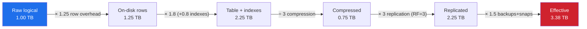
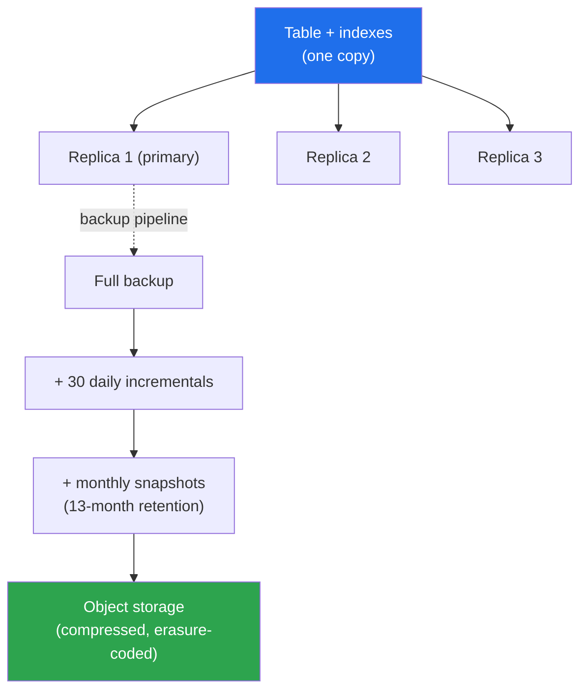
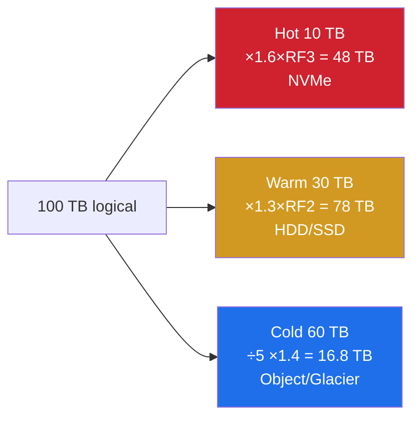

# Storage Estimation — Middle

<!-- level-focus -->
At middle level, focus on this question:

> Where does **Storage Estimation** belong in a maintainable component, and which trade-off selects the design?

Use the smallest realistic scenario that exposes the decision and its failure behavior.
Storage estimation at the middle level is no longer "rows × bytes-per-row." It is a layered amplification problem: the bytes a user gives you are multiplied by row overhead, then by indexes, then by replication, then by backups and snapshots, and finally divided by compression — with different multipliers applied to hot, warm, and cold tiers. A senior interviewer expects you to carry the arithmetic through every layer and to defend each multiplier. This page builds that discipline with three worked examples and a reusable amplification model.

## 1. The Storage Amplification Model

The single most useful mental model for storage estimation is a pipeline of multipliers. Start with **logical raw data** — the application-meaningful bytes — and pass it through each amplification or reduction stage:

```
effective_storage =
    raw_logical
  × row_overhead_factor      (per-row headers, null bitmaps, padding)
  × (1 + index_factor)       (secondary indexes)
  ÷ compression_ratio        (only for compressible data)
  × replication_factor       (RF, e.g. 3)
  × (1 + backup_factor)      (full + incremental + snapshots)
```

The order matters for clarity but the product is commutative, so the headline number is the same regardless of how you group the terms. What matters is that **you account for every stage and never silently drop one.** The two most commonly forgotten stages are indexes (which can equal table size) and backups (which can add 1–3× on top of replication).

Here is the staged amplification, shown as a flow where each box reports the running total for a baseline of **1 TB of raw logical data**:



The takeaway: **1 TB of "data" became 3.38 TB of provisioned storage** — a 3.4× amplification — and that is with a favorable 3× compression ratio. Without compression the same path lands at ~10 TB. Estimation errors of 3–10× are routine when the multiplier chain is ignored, which is exactly why interviewers probe it.

A useful sanity rule: for a typical replicated OLTP database with secondary indexes and backups, **budget 4–6× the raw logical size** before compression, or roughly **1.5–2× after a 3× text compression**. Carry this as your default and adjust per workload.

---

## 2. Precise Record Sizing

"Bytes per row" is never just the sum of the column widths. The on-disk row is larger because of fixed per-row metadata, null tracking, variable-length headers, and alignment padding. Getting this wrong by 30–50% per row is common and compounds across billions of rows.

### What a row actually contains

A row on disk is the **payload** (your columns) plus **overhead**:

| Component | Typical size (PostgreSQL) | Typical size (MySQL/InnoDB) | Notes |
|---|---|---|---|
| Row header / tuple header | 23 bytes | ~6 bytes (record header) | Per-row, unavoidable |
| Null bitmap | ⌈n_nullable_cols / 8⌉ bytes | part of record header | 1 bit per nullable column |
| Transaction / version info | included in header (xmin/xmax) | 6-byte trx id + 7-byte roll ptr | MVCC bookkeeping |
| Alignment padding | up to 7 bytes per row | varies | 8-byte alignment of fields |
| Variable-length headers | 1–4 bytes per varlena field | 1–2 bytes per VARCHAR | Length prefix |
| Page/block overhead | ~tens of bytes per 8 KB page | ~tens of bytes per 16 KB page | Amortized over rows |

### Worked record-size calculation

Consider a `users` row with these columns:

| Column | Type | Payload bytes | Nullable? |
|---|---|---|---|
| `id` | BIGINT | 8 | no |
| `email` | VARCHAR(255), avg 30 chars | 30 + 1 len | no |
| `name` | VARCHAR(100), avg 18 chars | 18 + 1 len | yes |
| `created_at` | TIMESTAMP | 8 | no |
| `status` | SMALLINT | 2 | yes |
| `bio` | TEXT, avg 60 chars | 60 + 2 len | yes |

Payload sum: `8 + 31 + 19 + 8 + 2 + 62 = 130 bytes`.

Now add overhead (PostgreSQL-style):
- Tuple header: **23 bytes**
- Null bitmap (6 columns, 3 nullable → still ⌈6/8⌉ = 1 byte): **1 byte**
- Alignment padding to 8-byte boundaries: **~6 bytes** (conservative)

On-disk row ≈ `130 + 23 + 1 + 6 = 160 bytes`.

That is a **row overhead factor of 160 / 130 ≈ 1.23**. For narrow rows (few small columns) the overhead factor is brutal — a 16-byte payload with a 23-byte header is **2.4×**. For wide rows it shrinks toward 1.05. The rule:

> **The narrower the row, the more the fixed header dominates. Always compute overhead as a factor, not a constant.**

### Page fill factor

Rows live inside fixed-size pages (8 KB in Postgres, 16 KB in InnoDB). Pages are rarely 100% full — a default fill factor of ~90%, plus the inability to split a row across the end of a page, means **add ~10–15% more** for realistic on-disk table size. Our 160-byte row, at a 90% fill factor, costs `160 / 0.90 ≈ 178 bytes` of allocated table space per row.

---

## 3. Index Storage — The Silent Doubler

Indexes are the most underestimated line item in storage planning. Engineers size the table, then forget that production tables carry 3–8 secondary indexes, each of which is a **separate on-disk structure roughly the size of (indexed key + row pointer) × number of rows.**

### How big is one secondary index?

A B-tree secondary index leaf entry holds:
- The **indexed key value(s)** — e.g. an 8-byte BIGINT, a 30-byte email, or a composite of several columns.
- A **pointer to the row** — in Postgres a 6-byte TID; in InnoDB secondary indexes, the **primary key value** (because InnoDB indexes are clustered and secondary indexes point via PK, not a physical pointer).
- B-tree node overhead — headers, child pointers in internal nodes, and ~30% empty space from B-tree fill factor.

A practical rule per secondary index:

```
index_bytes_per_row ≈ (key_size + pointer_size) × 1.5   (1.5 = B-tree overhead/fragmentation)
```

### Example: indexing our `users` table

| Index | Key | Key bytes | Pointer | Raw entry | ×1.5 overhead | Per row |
|---|---|---|---|---|---|---|
| PK on `id` (clustered) | id | 8 | — | (clustering, counted in table) | — | — |
| idx on `email` | email | 31 | 6 (TID) | 37 | 55.5 | ~56 B |
| idx on `created_at` | timestamp | 8 | 6 | 14 | 21 | ~21 B |
| idx on `status` | smallint | 2 | 6 | 8 | 12 | ~12 B |
| composite `(status, created_at)` | both | 10 | 6 | 16 | 24 | ~24 B |

Total secondary-index bytes per row: `56 + 21 + 12 + 24 = 113 bytes`.

Compare to the **table** row of ~178 bytes (with fill factor). The indexes add **113 bytes — about 64% on top of the table.** That is the index factor: `index_factor = 113 / 178 ≈ 0.63`, so `(1 + index_factor) ≈ 1.63`.

> **In many real OLTP schemas, indexes are 50–120% of table size.** A heavily indexed table (e.g. a multi-tenant table indexed on tenant_id + several foreign keys + several query columns) can have **more bytes in indexes than in the table itself.** Never estimate a table without explicitly enumerating its indexes.

### Why this bites in production

A common failure mode: you provision storage for the table, then a feature ships three new indexes to make a dashboard fast, and disk usage jumps 40% overnight. Estimation must include the **planned and likely** indexes, not just the ones in the v1 schema.

---

## 4. Replication and Backup Multipliers

The table-plus-index figure is the size of **one copy** of your data. Production never stores one copy. Two independent multipliers stack on top:

### Replication factor (RF)

For durability and read scaling, data is replicated. Standard configurations:

| System / config | Replication factor | Effective copies |
|---|---|---|
| Single primary + 1 sync replica | 2 | 2× |
| Primary + 2 replicas (common HA) | 3 | 3× |
| Cassandra/DynamoDB typical | RF = 3 | 3× |
| Cross-region DR (2 regions × RF 3) | 6 | 6× |
| Quorum systems (RF=3, but erasure-coded cold) | ~1.5 effective | varies |

The default assumption for a durable, highly-available datastore is **RF = 3**. Always state it explicitly. Erasure coding (common in object stores and cold tiers) can reduce the multiplier from 3× to ~1.4–1.5× while keeping comparable durability — a key lever for large cold data.

### Backup factor

Backups are **on top of** replication, because backups protect against logical errors (a bad migration, an accidental `DELETE`) that replication faithfully copies to every replica. Backup storage is its own line item:

| Backup component | Typical multiplier | Notes |
|---|---|---|
| One full backup | 1× (of one copy, compressed) | The baseline snapshot |
| Daily incrementals (retained 30 days) | +0.3 to +1× | Depends on churn rate |
| Weekly/monthly snapshots (retained 1 yr) | +0.5 to +2× | Long retention dominates |
| PITR WAL/binlog archive | +0.1 to +0.5× | Continuous log capture |

A modest backup policy (1 full + 30 daily incrementals + a few monthlies) commonly lands at **1.5–3× of a single copy.** Note backups are usually stored compressed and on cheap object storage, so they are counted against the *one-copy compressed* size, not the replicated size.

### Putting RF and backups together



**Effective multiplier:** `RF × (1 + backup_factor)`. With RF = 3 and a backup factor of 1.5, that is `3 × 2.5 = 7.5×` of one copy — but because backups are compressed and on cheaper, erasure-coded storage, the **cost-weighted** multiplier is lower than the raw-bytes multiplier. For a capacity estimate, report both: raw bytes provisioned and the dollar-weighted view.

> **Rule of thumb:** RF=3 + one full + incrementals + a snapshot policy lands you at an **effective 4–6× of a single uncompressed copy.** State the breakdown so reviewers can challenge any single multiplier.

---

## 5. Compression — Dividing the Bill

Compression is the one stage that *reduces* the estimate, and it is the stage with the widest variance. Applying the wrong ratio is how estimates go 5× off in either direction.

### Typical compression ratios

| Data type | Typical ratio | Why |
|---|---|---|
| Plain text / JSON / logs | 3–10× | Highly redundant, repeated keys/tokens |
| Structured row data (mixed) | 2–4× | Some redundancy, numeric noise |
| Columnar analytics (Parquet/ORC) | 8–15×+ | Same-type columns, dictionary + RLE encoding |
| Time-series metrics (Gorilla/delta) | 10–40× | Delta-of-delta + XOR on slow-changing values |
| Already-compressed media (JPEG, MP4, ZIP) | ~1.0–1.05× | Entropy already removed; do not re-compress |
| Encrypted blobs | ~1.0× | Ciphertext is incompressible |

### The two cardinal rules

1. **Apply compression to the data type, not the table.** A table with a 200-byte JSON column and a 4 KB binary thumbnail compresses very differently per column.
2. **Never assume compression on media or encrypted data.** A photo store gets ~1×. Pretending it compresses 3× will under-provision by 3×.

### Where compression applies in the pipeline

Compression typically reduces the **table+index** bytes (modern engines compress both) **and** the backups. It does *not* change the replication factor — each replica stores the compressed bytes. So:

```
effective = (table+index ÷ compression) × RF × (1 + backup_factor)
```

For our `users` example: `178 + 113 = 291 B/row` on disk. With a conservative 3× row-store compression, that becomes `~97 B/row` compressed, then × RF 3 = `291 B/row` replicated — interestingly, **compression at 3× exactly offsets RF 3×**, landing back near the single uncompressed copy. This coincidence is worth remembering as a quick sanity check: *3× compression cancels RF=3.*

---

## 6. Hot, Warm, Cold — Tiering the Estimate

A single average multiplier hides the most important cost lever: **most data is cold and should not sit on the same expensive storage as hot data.** Tiering changes both the storage class and the effective multiplier (cold tiers use fewer replicas and erasure coding).

### The tiers

| Tier | Access pattern | Typical share of data | Storage class | Effective replication |
|---|---|---|---|---|
| Hot | Read/written constantly (last 7–30 days) | 5–20% | NVMe SSD, in-memory cache in front | RF = 3, full indexes |
| Warm | Occasional reads (1–6 months) | 20–40% | Cheaper SSD / large HDD | RF = 2–3, fewer indexes |
| Cold | Rarely read (compliance, archive) | 40–75% | Object storage / Glacier | Erasure-coded ~1.4×, no live indexes |

### Why tiering changes the number

Cold data dominates volume but should carry the *cheapest* multipliers. Consider 100 TB of logical data split 10% hot / 30% warm / 60% cold:

- **Hot (10 TB):** × indexes 1.6 × RF 3 = **48 TB** on premium SSD.
- **Warm (30 TB):** × indexes 1.3 × RF 2 = **78 TB** on cheap SSD/HDD.
- **Cold (60 TB):** ÷ compression 5 × erasure 1.4 = **16.8 TB** on object storage, plus backups.

If you had applied the hot multipliers uniformly (`× 1.6 × 3 = 4.8×`), you would estimate **480 TB** — and budget accordingly. Tiering gives a far smaller and far cheaper footprint. **Tiering is where storage cost estimates are won or lost.**



---

## 7. Growth Modeling — Linear vs Accelerating

A storage estimate is a moving target. The same multipliers applied to *next year's* data is what determines what you provision today. Two growth shapes dominate:

### Linear growth

A fixed number of new records per day — e.g. an internal tool with a stable user base writing N rows/day. After `t` days, `data(t) = base + rate × t`. A 5-year forecast scales by `(base + rate × 1825)`. Plan capacity against the **end-of-horizon** value plus headroom.

### Accelerating (compounding) growth

User-generated or viral systems grow as a **percentage** per period: `data(t) = base × (1 + g)^t`. The trap: people estimate from today's daily volume and forget compounding.

| Monthly growth | Multiplier after 12 months | After 24 months | After 36 months |
|---|---|---|---|
| 5% | 1.80× | 3.23× | 5.79× |
| 10% | 3.14× | 9.85× | 30.9× |
| 20% | 8.92× | 79.5× | 708× |

At 10%/month, **data grows ~3.1× per year** — three years out it is ~31×. Provision for the horizon you actually need (often 12–18 months for cloud, where you re-provision elastically), not 5 years of a compounding curve, or you will over-build.

> **Rule:** For accelerating systems, estimate the *write rate at the end of the planning horizon*, multiply by retention, then apply the amplification chain. Estimating from *today's* rate undershoots badly.

---

## 8. Worked Example A — Relational Table With Indexes

**Scenario:** an e-commerce `orders` table. 50 million orders today, growing **linearly** at 5 million/month. Plan for 18 months.

### Step 1 — record size

| Column | Type | Payload B |
|---|---|---|
| order_id | BIGINT | 8 |
| user_id | BIGINT | 8 |
| status | SMALLINT | 2 |
| total_cents | BIGINT | 8 |
| currency | CHAR(3) | 3 |
| created_at | TIMESTAMP | 8 |
| updated_at | TIMESTAMP | 8 |
| shipping_json | JSONB, avg 220 B | 222 |

Payload = `8+8+2+8+3+8+8+222 = 267 B`. Add tuple header 23 + null bitmap 1 + padding 6 = **30 B overhead**. On-disk row ≈ **297 B**. With 90% fill factor → **330 B/row** table.

### Step 2 — indexes

| Index | Key bytes | + 6 ptr | ×1.5 | B/row |
|---|---|---|---|---|
| PK order_id (clustered) | — | — | — | (in table) |
| idx user_id | 8 | 14 | 21 | 21 |
| idx (status, created_at) | 10 | 16 | 24 | 24 |
| idx created_at | 8 | 14 | 21 | 21 |

Index total = **66 B/row**. Index factor = `66 / 330 = 0.20`. Combined table+index = **396 B/row**.

### Step 3 — row count at horizon

`50M + 5M × 18 = 140M rows.`

### Step 4 — amplification

| Stage | Calculation | Result |
|---|---|---|
| Table+index, one copy | 140M × 396 B | **55.4 GB** |
| ÷ compression (JSONB-heavy, ~3×) | 55.4 / 3 | 18.5 GB |
| × RF = 3 | 18.5 × 3 | 55.4 GB |
| × backups (1 full + incrementals, ~1.8) | 55.4 × 1.8 | **99.7 GB** |

**Effective: ~100 GB** for a 140M-row orders table. Note the same *3× compression cancels RF=3* identity — the replicated size returns to the raw one-copy figure of 55 GB, and backups push it to ~100 GB. A naive "140M × 267 B = 37 GB" estimate is **2.7× low.**

---

## 9. Worked Example B — Media Store With Backups

**Scenario:** a photo-sharing service. 2 million daily active users upload **3 photos/day** on average. Each upload produces an original (avg **3.5 MB**) plus 4 derived sizes (thumb, small, medium, large — totaling avg **1.0 MB**). Plan for 1 year. Photos are JPEG — **incompressible (~1×).**

### Step 1 — daily ingest

- Uploads/day = `2,000,000 × 3 = 6,000,000`.
- Bytes per upload = `3.5 MB original + 1.0 MB derivatives = 4.5 MB`.
- Daily raw = `6M × 4.5 MB = 27 TB/day`.

### Step 2 — one year of originals + derivatives

- Yearly raw = `27 TB × 365 = 9,855 TB ≈ 9.86 PB`.

### Step 3 — amplification (media specifics)

Media stores differ from databases: **no row overhead, no secondary indexes on the blobs** (metadata lives in a separate small DB), and **compression ≈ 1×**. The metadata DB is tiny by comparison (a few hundred bytes/photo → ~6M/day × 365 × ~300 B ≈ 0.66 TB, negligible vs petabytes of pixels). The blob multipliers are replication and backup:

| Stage | Multiplier | Calculation | Result |
|---|---|---|---|
| Raw blobs (1 yr) | 1.0× | — | 9.86 PB |
| Replication / erasure coding | object store erasure ≈ **1.4×** | 9.86 × 1.4 | 13.8 PB |
| Backup (cross-region copy of originals only) | originals = 3.5/4.5 = 78% × 1.0 copy | 0.78 × 9.86 × 1.4 | +10.8 PB |
| **Effective (hot+DR)** | | | **~24.6 PB** |

### Step 4 — tiering saves the budget

Photos are accessed heavily for ~30 days, then rarely. Apply tiering:

- **Hot (last 30 days, ~0.81 PB raw):** keep derivatives on SSD-backed object storage, erasure 1.4× → ~1.1 PB.
- **Cold (older, ~9.05 PB raw):** move to archival object storage (Glacier-class), drop redundant derivatives (regenerate on demand), erasure 1.4× → ~12.7 PB of originals only.

Storing **originals + on-demand derivatives** instead of all five sizes forever is the single biggest lever here: it can cut the derivative footprint (22% of bytes) for cold data. The headline: **petabyte-scale media is dominated by replication and retention, not by per-record overhead, because compression ≈ 1×.**

---

## 10. Worked Example C — Time-Series / Logs With Compression and Retention

**Scenario:** an observability platform ingesting application logs. **500,000 events/sec** at peak, averaging **180,000 events/sec** sustained. Each raw event is ~**400 bytes** of JSON. Retention: **hot 7 days, warm 30 days, cold 365 days.** Logs compress extremely well.

### Step 1 — daily and per-tier raw volume

- Events/day = `180,000 × 86,400 = 15.55 billion`.
- Raw bytes/day = `15.55e9 × 400 B = 6.22 TB/day` (raw, uncompressed).

### Step 2 — compression by tier

Logs compress 8–10× with columnar + dictionary encoding (group by service, level, repeated fields). Use **8×** conservatively. Compressed daily = `6.22 / 8 = 0.78 TB/day`.

### Step 3 — retention volumes (compressed)

| Tier | Days | Compressed/day | Subtotal | Storage class | RF / erasure |
|---|---|---|---|---|---|
| Hot | 7 | 0.78 TB | 5.46 TB | NVMe, fully indexed | RF 3 → 16.4 TB |
| Warm | 23 (8–30) | 0.78 TB | 17.9 TB | HDD, partial index | RF 2 → 35.8 TB |
| Cold | 335 (31–365) | 0.78 TB | 261 TB | Object store | erasure 1.4 → 366 TB |

### Step 4 — indexes for searchable logs

Searchable log stores (inverted indexes for full-text/field search) add a **major** index factor — often **0.5–1.5× of the compressed data**, because the index is what makes logs queryable. Apply index factor only to hot+warm (cold is typically not live-indexed):

- Hot+warm compressed = `5.46 + 17.9 = 23.4 TB`. Index factor ~1.0 → **+23.4 TB** of index.
- After RF: hot index × 3, warm index × 2. Roughly **+58 TB**.

### Step 5 — totals

| Component | Storage |
|---|---|
| Hot (data RF3 + index RF3) | 16.4 + ~16.4 = 32.8 TB |
| Warm (data RF2 + index RF2) | 35.8 + ~35.8 = 71.6 TB |
| Cold (data, erasure, no live index) | 366 TB |
| Backups (cold, compressed, +0.3×) | ~110 TB |
| **Effective total** | **~580 TB** |

### Step 6 — the lesson

Raw yearly logs would be `6.22 TB × 365 = 2,270 TB` uncompressed, then × RF 3 = **6.8 PB** if you naively replicated everything at full fidelity with indexes. By compressing 8×, tiering retention, and erasure-coding cold data without live indexes, the estimate drops to **~580 TB — a ~12× reduction.** For logs and time-series:

> **Compression ratio and retention policy dominate the estimate far more than per-event size.** A 2× error in compression assumption or a "365 days hot" mistake swings the bill by an order of magnitude.

---

## 11. The Multiplier Cheat Sheet

Carry this table into any estimation. It is the `raw → +index → +replication → +backup → effective` chain made concrete for three archetypes.

| Stage | OLTP table (Example A) | Media store (Example B) | Logs/TSDB (Example C) |
|---|---|---|---|
| Raw logical (per record) | 267 B payload | 4.5 MB/upload | 400 B/event |
| × row overhead | × 1.11 (→297 B) + fill 1.11 | n/a (blobs) | folded into compression |
| × (1 + index factor) | × 1.20 | × ~1.0 (metadata negligible) | × 2.0 (hot, searchable) |
| ÷ compression | ÷ 3 | ÷ 1.0 (incompressible) | ÷ 8 |
| × replication | × 3 (RF) | × 1.4 (erasure) | × 3 hot / 2 warm / 1.4 cold |
| × (1 + backup) | × 1.8 | × ~1.78 (originals DR) | × 1.3 (cold) |
| **Net amplification** | **~1.8× of raw** | **~3–4× of raw** | **~0.25× of raw (compression wins)** |

Notice the three archetypes land in completely different places:
- **OLTP:** indexes + RF + backups roughly *cancel* a 3× compression → ~2× of raw. Indexes are the swing factor.
- **Media:** no compression, so RF + DR dominate → the multiplier is *above* 1 no matter what; tiering is the only lever.
- **Logs:** strong compression *beats* all the multipliers combined → net *below* raw; compression and retention are everything.

The general default to memorize: **4–6× raw before compression** for a replicated, backed-up OLTP store; then divide by the realistic compression ratio of the dominant data type.

---

## 12. Checklist and Common Mistakes

Run this checklist on every storage estimate before you commit to a number:

**Record sizing**
- [ ] Computed row overhead as a **factor**, not a constant (narrow rows can be 2×+).
- [ ] Included tuple header, null bitmap, varlena length prefixes, and alignment padding.
- [ ] Applied a page fill factor (~90%), not 100%.

**Indexes**
- [ ] Enumerated **every** secondary index, including composites and the likely future ones.
- [ ] Sized each as `(key + pointer) × 1.5`, accounting for B-tree overhead.
- [ ] Asked: *could indexes exceed the table size?* (often yes).

**Replication & backup**
- [ ] Stated RF explicitly (default 3) and whether erasure coding applies to cold tiers.
- [ ] Added backups as a **separate** line on top of replication (full + incrementals + snapshots + retention).
- [ ] Noted backups are compressed and on cheap storage (cost-weight separately from raw bytes).

**Compression**
- [ ] Used a **per-data-type** ratio, not one global number.
- [ ] Assumed ~1× for media, encrypted, or already-compressed data.
- [ ] Sanity-checked the *3× compression cancels RF=3* identity where it applies.

**Tiering & growth**
- [ ] Split hot/warm/cold and applied tier-appropriate storage class and replication.
- [ ] Chose linear vs compounding growth deliberately and estimated at the **end of the planning horizon**.
- [ ] Did **not** apply hot multipliers uniformly to cold data.

**The five classic mistakes**
1. Summing column widths and calling it the row size (forgets ~25–140% overhead).
2. Sizing the table but forgetting indexes (under by 50–120%).
3. Forgetting backups exist on top of replication (under by 1.5–3×).
4. Assuming compression on incompressible media (over-optimistic by the assumed ratio).
5. Estimating compounding growth from today's rate (under by the compounding multiplier — often 3–30×).

A defensible estimate **shows the arithmetic at every stage** and **names every multiplier** so a reviewer can challenge any one of them independently. That transparency, not a single magic number, is what distinguishes a middle-level estimate from a junior guess.

---

*Next step:* [Senior level](senior.md)

---

## Apply it

1. Find a real component where **Storage Estimation** affects an interface or dependency.
2. Write two plausible choices and the constraint that favors each one.
3. Make the smallest reversible change at that boundary.
4. Exercise the component alone, then exercise the integrated flow.
5. Keep the decision note with the evidence that selected the option.

## Verify your work

- A focused check proves the local behavior.
- An integrated check proves callers and dependencies still agree.
- Logs, traces, compiler output, or benchmarks expose the boundary.
- Reverting the change restores the previous behavior without unrelated edits.

## Review questions

- Which boundary is most affected by Storage Estimation?
- What constraint would make you choose the alternative design?
- How would you isolate a local defect from an integration defect?
- What evidence shows that the change remains maintainable?
