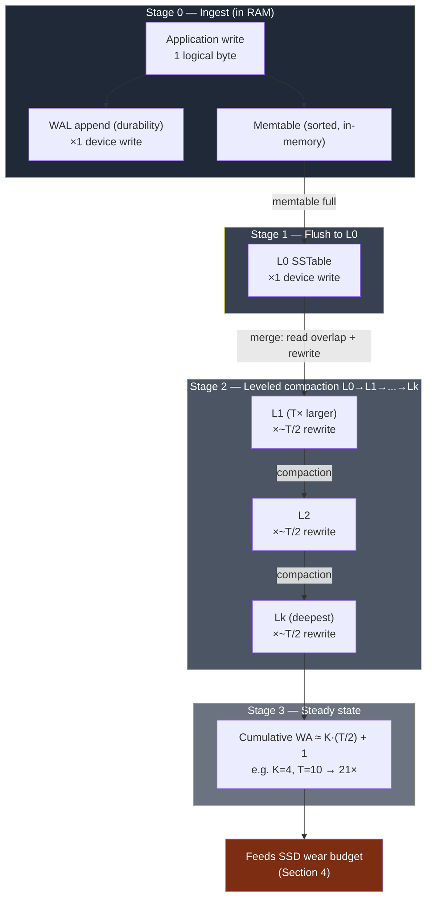

# Storage Estimation — Theory and Formal Foundations

<!-- level-focus -->
At professional level, focus on this question:

> How should teams adopt and operate **Storage Estimation — Theory and Formal Foundations** with measurable outcomes and limited coordination?

Use the smallest realistic scenario that exposes the decision and its failure behavior.
Storage estimation at the principal level is not "multiply records by bytes." It is the discipline of reasoning about how *logical* bytes become *physical* bytes after replication, encoding, indexing, and amplification — and how that physical footprint trades against durability, latency, and write throughput. This document develops the formal machinery: the RUM conjecture on amplification, the storage/durability mathematics of replication versus erasure coding, durability-in-nines derived from failure probabilities, and capacity-growth forecasting. Every claim is reduced to a worked number.

## 1. The Logical-to-Physical Mapping

Every storage estimate begins with one quantity: the **logical dataset size** `L` — the sum of user-meaningful bytes, before the system touches them. The physical footprint `P` provisioned on disk is a *product* of independent multipliers:

```
P = L × R_user × A_space × O_meta × (1 + headroom)
```

where:

- `R_user` is the user-visible redundancy factor (replication factor, or the erasure-coding expansion `n/k`).
- `A_space` is the **space amplification** of the storage engine — physical bytes the engine holds per logical byte, due to obsolete versions, compaction lag, fragmentation, and per-block padding.
- `O_meta` is the metadata multiplier — index entries, inode/object pointers, checksums, version vectors.
- `headroom` is the operational margin reserved so the system never runs at 100% (compaction needs free space; SSDs need over-provisioning; filesystems degrade past ~80% full).

A common principal-level mistake is to estimate `L` correctly and then assume `P ≈ L × 3` for a triple-replicated store. In reality a write-heavy LSM store with RF=3 can sit at `P ≈ L × 3 × 1.3 × 1.1 × 1.25 ≈ 5.4 × L`. The multipliers compound. Estimation that ignores `A_space` and `O_meta` routinely under-provisions by 40–80%.

The rest of this document gives each multiplier a formal treatment.

---

## 2. The RUM Conjecture: Read, Update, Memory Amplification

The **RUM conjecture** (Athanassoulis et al., "Designing Access Methods: The RUM Conjecture", EDBT 2016) formalizes a fundamental tension. Define three *amplification* overheads relative to the minimal work an ideal oracle would do:

- **Read Amplification (RA):** physical bytes read per logical byte requested. A point lookup that must probe multiple sorted runs has RA > 1.
- **Update Amplification (WA):** physical bytes written per logical byte updated. Re-writing a whole page to change one row, or re-compacting data many times, inflates WA.
- **Memory/Space Amplification (SA):** physical bytes stored per logical byte of live data. Keeping obsolete versions, padding, or auxiliary structures inflates SA.

The conjecture states: **an access method cannot minimize all three simultaneously.** Optimizing any two forces the third to grow. This is the storage analog of "pick two." It explains why no single storage engine wins every workload.

| Access method | Read amp (RA) | Write amp (WA) | Space amp (SA) | Optimized for |
|---|---|---|---|---|
| B-tree / B+-tree | Low (≈1, log-height) | High (in-place page rewrite, WAL) | Low–Med (≈1.3, fill-factor) | Read-heavy, point + range |
| LSM-tree (leveled) | Med–High (multi-level probes) | High (compaction WA 10–30×) | Low (≈1.1 after compaction) | Write-heavy, ingest |
| LSM-tree (tiered/size) | High (many overlapping runs) | Low–Med (less re-compaction) | High (duplicate versions, 2–3×) | Very write-heavy, scan-tolerant |
| Hash index | Low (≈1) | Med | High (load-factor, no range) | Point lookups only |
| Log-only / append store | High (full scan, no index) | Minimal (≈1) | High (no GC, all versions) | Append + replay |
| Bitmap / columnar | Low (compressed scan) | High (rewrite segments) | Low (heavy compression) | Analytics, low cardinality |

Two corollaries drive estimation:

1. **You cannot estimate physical storage without knowing the engine.** The same logical dataset costs 1.1× on a leveled LSM and 2.5× on a tiered LSM purely from space amplification.
2. **WA and SA trade against each other inside the LSM family.** Leveled compaction buys low SA by paying high WA; tiered compaction buys low WA by paying high SA. The next section makes this quantitative.

---

## 3. Write Amplification in LSM-Trees

Write amplification `WA` in an LSM-tree is the ratio of bytes physically written to the storage device to bytes logically inserted by the application:

```
WA = (bytes written to device) / (bytes inserted by application)
```

Data enters the memtable, is flushed to L0, then is rewritten on every compaction that carries it down a level. The dominant cost is **leveled compaction**, where each level `Lᵢ` is a size multiple `T` (the *fanout* or *size ratio*) larger than `Lᵢ₋₁`.

### 3.1 The leveled-compaction WA formula

For leveled compaction with size ratio `T` and `K` levels below L0, merging a key from level `i` into level `i+1` reads the incoming run plus the overlapping data already at `i+1`. On average this rewrites roughly `T` bytes of existing data per byte pushed down, at each of the `K` levels. A widely used approximation:

```
WA_leveled ≈ K × (T / 2) + 1      (memtable flush contributes the +1)

with  K = ⌈ log_T (DataSize / MemtableSize) ⌉
```

**Worked example.** Dataset target = 1 TB, memtable/L0 unit = 256 MB, size ratio `T = 10`.

```
DataSize / MemtableSize = 1,048,576 MB / 256 MB ≈ 4096
K = ⌈ log_10(4096) ⌉ = ⌈ 3.61 ⌉ = 4 levels
WA_leveled ≈ 4 × (10 / 2) + 1 = 20 + 1 = 21×
```

So inserting 1 TB of logical data drives **≈21 TB of physical writes** over the data's compaction lifetime. This is the number that determines SSD wear (Section 4), not the 1 TB the application "sees."

### 3.2 Tiered compaction

Tiered (size-tiered) compaction merges several same-size runs into one larger run, deferring re-compaction. WA drops to roughly:

```
WA_tiered ≈ K + 1          (each level is written ~once)
```

For the same `K = 4`, `WA_tiered ≈ 5×` — over **4× less write work** than leveled. The cost is paid in space amplification (many overlapping runs hold duplicate/obsolete keys, SA ≈ 2–3×) and read amplification (a lookup may probe every run in a tier). This is the RUM trade-off made concrete inside one engine family.

### 3.3 Staged view of the compaction write path



The diagram makes the cost structure explicit: the application's single logical byte is written to the device once for the WAL, once for the L0 flush, and then `~T/2` times at each of `K` levels. The WAL and L0 writes are the "+1" in the formula; the compaction cascade is the `K·(T/2)` term that dominates.

---

## 4. SSD Wear and Endurance Budgets

SSD NAND cells tolerate a finite number of program/erase (P/E) cycles. Vendors express endurance as **DWPD** (Drive Writes Per Day) over a warranty window, or as **TBW** (Terabytes Written total). The estimation chain links *application* write rate to *device* lifetime through write amplification.

```
Device write rate  = App write rate × WA_engine × R_replication × WA_ftl
Drive lifetime     = TBW / (Device write rate over the period)
```

`WA_ftl` is the flash translation layer's own internal amplification (garbage collection inside the SSD), typically 1.1–3× depending on over-provisioning and write pattern. The engine WA and the FTL WA multiply.

**Worked example.** A node ingests 50 GB/day of application writes. Engine is a leveled LSM with `WA_engine = 21` (from Section 3). The node holds one replica (`R = 1` at the node level; replication multiplies *fleet* writes, not this node's). FTL amplification `WA_ftl = 1.5`.

```
Device writes/day = 50 GB × 21 × 1.5 = 1,575 GB/day ≈ 1.54 TB/day
```

If the drive is a 3.84 TB unit rated at **1 DWPD for 5 years**, its TBW budget is:

```
TBW = 3.84 TB × 1 DWPD × 365 × 5 = 7,008 TB
Lifetime at this load = 7,008 TB / 1.54 TB/day ≈ 4,550 days ≈ 12.5 years
```

The drive survives. But note the leverage: a 50 GB/day application workload became **1.54 TB/day** of physical wear — a 31× multiplier — entirely from compaction and FTL amplification. Switching to tiered compaction (`WA_engine ≈ 5`) would cut device writes to ≈375 GB/day and quadruple endurance headroom, at the cost of higher read/space amplification. This is why endurance budgeting is a first-class input to engine and compaction-strategy selection, not an afterthought.

---

## 5. Replication Storage Overhead

Replication stores `R` full copies of every object. The math is trivial; its consequences are not.

```
Stored bytes = L × R
Storage overhead = (R − 1) × L
Storage efficiency = L / (L × R) = 1/R
```

| Replication factor | Stored bytes | Overhead | Efficiency | Tolerates losses |
|---|---|---|---|---|
| RF = 2 | 2L | 100% | 50% | 1 copy |
| RF = 3 | 3L | **200%** | 33.3% | 2 copies |
| RF = 5 | 5L | 400% | 20% | 4 copies |

RF=3 is the de-facto industry default (HDFS, Cassandra, Ceph default pools, GFS). It tolerates two simultaneous failures and gives a clean ~33% efficiency. The headline cost: **for every 1 PB of logical data you provision 3 PB of raw disk.** At hyperscale this is the single largest line item in storage spend, which is exactly what motivates erasure coding.

The durability of replication is governed by independent device failure probabilities (Section 8). Replication's virtues are *operational*, not storage-efficiency: trivial reads (any replica answers), trivial repair (copy one surviving replica), and no decode CPU. Its vice is the 2× overhead versus erasure coding for comparable durability.

---

## 6. Erasure Coding Storage Overhead

Erasure coding (EC) splits an object into `k` data fragments and computes `m` parity fragments, storing `n = k + m` fragments. Any `k` of the `n` fragments reconstruct the original. This is **Reed-Solomon** coding, which is *maximum distance separable* (MDS): it tolerates the loss of any `m` fragments, the theoretical maximum for the storage spent.

```
n = k + m
Stored bytes      = L × (n / k) = L × (k + m) / k
Storage overhead  = L × (m / k)          ← the key formula
Storage efficiency = k / n
Tolerates         = any m fragment losses
```

### 6.1 Worked overhead calculation: RS(10,4)

```
k = 10, m = 4, n = 14
Expansion (n/k)   = 14 / 10 = 1.4×
Storage overhead  = m / k = 4 / 10 = 0.40 → 40%
Storage efficiency = k / n = 10 / 14 ≈ 71.4%
Fault tolerance   = any 4 of 14 fragments lost
```

So **RS(10,4) stores 1.4 PB to protect 1 PB of logical data — a 40% overhead** — while tolerating *four* simultaneous failures. Compare RF=3, which stores 3 PB (200% overhead) to tolerate only *two* failures. EC delivers strictly more fault tolerance at one-fifth the overhead. This is why cold/warm tiers at scale (Facebook f4, Azure LRS, HDFS-EC, Ceph EC pools, Backblaze) are erasure-coded.

### 6.2 Why not always EC?

The overhead win is real but comes with costs that estimation must surface:

- **Read amplification on repair / degraded reads.** Replication repairs by copying one fragment. RS repair must read `k` fragments to reconstruct one lost fragment — a `k×` read and network amplification (Section 9). LRC codes mitigate this (below).
- **Encode/decode CPU.** Every write computes `m` parities; every degraded read decodes. Replication has zero coding CPU.
- **Small objects don't fit.** Splitting a 4 KB object into `k=10` fragments yields sub-block fragments; padding overhead can erase the efficiency gain (Section 10). EC pays off on large objects (≥ a few MB).
- **Latency tail.** A degraded read waits on `k` fragments across `k` machines — its tail is the slowest of `k`, which is worse than reading one replica.

### 6.3 Local Reconstruction Codes (LRC)

LRC (e.g., Azure's (k, l, r) codes, used in production) add *local* parities so that a single fragment loss is repaired by reading only a small local group rather than all `k` data fragments. Azure's LRC(12,2,2) tolerates broad failure patterns at ~1.33× overhead while cutting single-failure repair reads from 12 to 6. The estimation lesson: EC overhead and EC repair cost are *separately tunable* knobs, and LRC is the standard way to buy cheaper repair without paying full replication overhead.

---

## 7. Replication vs Erasure Coding: The Full Trade Table

The decision is multi-dimensional. The table below normalizes to "protect 1 unit of logical data" and assumes Reed-Solomon (MDS) for the EC rows.

| Scheme | Raw stored | Overhead | Efficiency | Failures tolerated | Single-loss repair reads | Encode/decode CPU | Best fit |
|---|---|---|---|---|---|---|---|
| RF = 2 | 2.00 | 100% | 50% | 1 | 1 fragment | none | hot data, low value |
| RF = 3 | 3.00 | 200% | 33% | 2 | 1 fragment | none | hot data, default |
| RS(6,3) | 1.50 | 50% | 67% | 3 | 6 fragments | moderate | warm tier |
| RS(10,4) | 1.40 | 40% | 71% | 4 | 10 fragments | moderate | warm/cold, common |
| RS(12,4) | 1.33 | 33% | 75% | 4 | 12 fragments | moderate | cold tier |
| RS(17,3) | 1.18 | 18% | 85% | 3 | 17 fragments | moderate | archival, max efficiency |
| LRC(12,2,2) | 1.33 | 33% | 75% | ≥3 (most patterns) | 6 fragments | moderate | cloud blob (Azure-style) |

Reading the table as a principal:

- **Overhead and repair cost move in opposite directions.** Pushing `k` up (RS(17,3) at 18% overhead) buys storage efficiency but makes every repair read 17 fragments — heavy network and a slow tail. There is no free lunch; it is the RUM trade-off at the cluster level.
- **Tier by temperature.** Hot data → RF=3 (cheap repair, fast reads, accept 200% overhead because the data is small relative to the cold tier). Cold/archival → wide RS (accept slow repair because failures are rare and reads are infrequent). A real fleet runs *both* and migrates objects across tiers as they cool.
- **LRC is the pragmatic middle.** Near-EC overhead with near-replication single-failure repair cost. Most modern cloud blob stores converge here.

---

## 8. Durability Mathematics — Counting Nines

**Durability** is the probability that an object survives a given period (usually one year). It is expressed in *nines*: "eleven nines" = 99.999999999% = a per-year object-loss probability of `10⁻¹¹`. Roughly, with `N` objects you expect `N × (1 − durability)` lost objects per year. At eleven nines, storing 10⁷ objects loses one object roughly every 10,000 years in expectation.

### 8.1 Replication durability from independent failures

Model each device with an annual failure probability `p` (derived from AFR — Annualized Failure Rate; HDDs run ~1–2%, so `p ≈ 0.01–0.02`). With `R` independent replicas, an object is lost only if **all `R` copies fail within the repair window before re-replication completes.** If failures are independent:

```
P(object loss) ≈ p_window^R        (all R replicas fail in one repair window)
Durability     = 1 − p_window^R
```

Here `p_window` is the probability a replica is lost *within the repair window* — not the annual probability — because once a replica dies, the system re-replicates quickly. The repair window is the crucial term: faster repair → lower `p_window` → far higher durability.

**Worked example — RF=3, naive annual.** Take `p = 0.01` (1% AFR) as the per-replica loss probability over the exposure window:

```
P(loss) ≈ 0.01³ = 10⁻⁶
Durability ≈ 1 − 10⁻⁶ = 99.9999% = six nines
```

Six nines from naive RF=3. Real systems achieve far more because the *exposure window* is the short re-replication time, not a year. If repair completes in hours, `p_window` might be `10⁻⁴` rather than `10⁻²`, giving:

```
P(loss) ≈ (10⁻⁴)³ = 10⁻¹²  →  twelve nines
```

This is why **repair speed is a durability lever, not just a cost lever.** Halving the repair window squares away orders of magnitude of durability.

### 8.2 Erasure-coding durability

With RS(k, m), an object is lost only if **more than `m` fragments are lost within the repair window.** This is the tail of a binomial distribution over `n = k + m` fragments each failing with probability `q` in the window:

```
P(object loss) = Σ_{j=m+1}^{n} C(n, j) · q^j · (1 − q)^(n−j)
```

For small `q`, the leading term dominates (losing exactly `m+1` fragments):

```
P(loss) ≈ C(n, m+1) · q^(m+1)
```

**Worked example — RS(10,4), q = 0.01 in window.**

```
n = 14, m = 4, need ≥ 5 fragment losses
P(loss) ≈ C(14, 5) · (0.01)^5 = 2002 · 10⁻¹⁰ ≈ 2.0 × 10⁻⁷
Durability ≈ 1 − 2.0×10⁻⁷ ≈ 99.99998% ≈ between seven and eight nines
```

RS(10,4) requires *five* concurrent fragment losses — its `q^5` term crushes the loss probability far below RF=3's `q³`, at less than one-fifth the storage overhead. This is the central quantitative result of the chapter: **erasure coding buys both more durability and less storage** versus replication, paying instead in repair bandwidth and CPU.

### 8.3 Durability comparison

| Scheme | Loss condition | Leading loss term | Approx durability (q=10⁻²) | Overhead |
|---|---|---|---|---|
| RF=2 | 2 of 2 lost | `q²` = 10⁻⁴ | ~99.99% (4 nines) | 100% |
| RF=3 | 3 of 3 lost | `q³` = 10⁻⁶ | ~99.9999% (6 nines) | 200% |
| RS(6,3) | 4 of 9 lost | `C(9,4)·q⁴` ≈ 1.3×10⁻⁷ | ~7 nines | 50% |
| RS(10,4) | 5 of 14 lost | `C(14,5)·q⁵` ≈ 2.0×10⁻⁷ | ~7 nines | 40% |
| RS(12,4) | 5 of 16 lost | `C(16,5)·q⁵` ≈ 4.4×10⁻⁷ | ~6–7 nines | 33% |

Caveat for the principal: this independent-failure model is optimistic. Correlated failures — a rack power loss, a bad firmware batch, a fire — violate independence and can take out many fragments at once. Real systems place fragments across independent **failure domains** (different racks, power zones, even regions) so that the `q` values stay independent. Durability math is only as good as the placement that enforces fragment independence.

---

## 9. Reconstruction Cost and Repair Bandwidth

Durability depends on fast repair; repair consumes network and disk bandwidth that must be budgeted. The repair cost differs sharply between schemes.

```
Replication repair: copy 1 surviving replica → repair I/O = (lost bytes) × 1
RS(k,m) repair:     read k fragments, decode  → repair I/O = (lost bytes) × k
```

**Worked example.** A 16 TB drive holding RS(10,4) data fails. Reconstructing its fragments requires reading `k = 10` fragments' worth of data from other drives:

```
Repair read = 16 TB × 10 = 160 TB of network/disk traffic
At 1 GB/s aggregate repair bandwidth: 160,000 s ≈ 44 hours
```

Forty-four hours is a long exposure window — during it, a second failure is more likely, eroding the durability the EC math promised. Contrast replication: repairing a 16 TB replicated drive reads 16 TB (1× amplification) and finishes in ~4.4 hours at the same bandwidth.

This `k×` repair amplification is the dominant *operational* reason wide EC codes are restricted to cold data and why **LRC codes exist**: by adding local parities, LRC repairs a single failure by reading only the local group (e.g., 6 fragments instead of 12), cutting repair traffic and shrinking the exposure window. When you estimate an EC tier you must budget repair bandwidth as a recurring cost: `(fleet failure rate) × (drive size) × k` bytes/year of repair traffic, sized so the cluster can always repair faster than failures accumulate.

---

## 10. Metadata Overhead and the Small-File Problem

The `O_meta` multiplier from Section 1 is negligible for large objects and catastrophic for small ones. Every stored object carries fixed-size bookkeeping: an index/inode entry, block pointers, checksums, version stamps, and — in distributed stores — a metadata-service record. Call the per-object fixed metadata cost `c_meta`.

```
O_meta = (object_size + c_meta) / object_size = 1 + c_meta / object_size
```

As `object_size → c_meta`, the multiplier approaches 2× and beyond. This is the **small-file problem**.

**Worked example — HDFS-style.** Suppose each file consumes ~150 bytes of NameNode (metadata) RAM and the on-disk block has a minimum allocation overhead, and you store 1 billion 10 KB files:

```
Metadata RAM = 10⁹ files × 150 B ≈ 150 GB of NameNode RAM (a hard ceiling)
```

The 150 GB metadata footprint can exhaust the metadata server long before disk fills. Worse, EC on small files fails outright: splitting a 10 KB file into `k = 10` fragments gives 1 KB fragments, each padded to a minimum block, so the "40% overhead" of RS(10,4) balloons toward replication-like or worse overhead. **Erasure coding is only economical above a size threshold** (typically a few MB), below which systems either replicate small objects or pack many small objects into large EC stripes.

The standard mitigations, each with its own estimate:

| Mitigation | Mechanism | Effect on `O_meta` |
|---|---|---|
| Object packing / compaction | Concatenate many small files into one large container (e.g., HDFS HAR, Haystack/f4 needles) | Amortizes `c_meta` over many objects → `O_meta → 1` |
| Inline small values | Store the value inside the index/metadata row (LSM small-value inlining) | Eliminates separate object block |
| Tiered metadata | Sharded/distributed metadata service instead of single-node RAM | Removes the central RAM ceiling |
| Min-size EC threshold | Replicate below N MB, EC above | Avoids fragment-padding blowup |

The principal estimate: always compute the **object-count cost** alongside the byte-count cost. A petabyte of 4 MB objects (~268 million objects) and a petabyte of 4 KB objects (~268 *billion* objects) have identical logical size but differ by 1000× in metadata and may need entirely different architectures.

---

## 11. Capacity-Growth Models and Forecasting

Storage is rarely static; it grows, and you must provision for the future, not the present. Two growth models cover most cases.

### 11.1 Linear growth

Constant ingest rate `g` (bytes/day). Useful for steady event/log ingestion:

```
L(t) = L₀ + g·t
```

### 11.2 Exponential (compound) growth

User-base or usage growing at a constant *rate* `r` per period — the realistic model for a scaling product:

```
L(t) = L₀ · (1 + r)^t
Doubling time: t₂ = ln(2) / ln(1 + r)
```

**Worked example.** `L₀ = 100 TB`, monthly growth `r = 8%`. The dataset doubles every:

```
t₂ = ln(2) / ln(1.08) = 0.693 / 0.0770 ≈ 9.0 months
After 24 months: L(24) = 100 TB × 1.08²⁴ ≈ 100 × 6.34 ≈ 634 TB logical
```

Now translate to *physical raw disk to provision* using the Section 1 mapping. Assume RF=3 hot tier, LSM space amp 1.3, metadata 1.1, and 25% operational headroom:

```
P(24) = 634 TB × 3 × 1.3 × 1.1 × 1.25 ≈ 3,400 TB ≈ 3.4 PB raw
```

A 100 TB-looking problem is a 3.4 PB procurement problem two years out. Provisioning to *today's* logical size under-orders by ~34×.

### 11.3 Forecasting discipline

- **Provision to a horizon, not to today.** Choose a lead time `T_lead` covering procurement + rack + burn-in (often 1–2 quarters) and provision to `L(now + T_lead)` plus headroom.
- **Forecast object count, not just bytes** (Section 10) — small-file growth can hit the metadata ceiling before the disk ceiling.
- **Model retention explicitly.** With TTL/retention `D` days and ingest `g`, steady-state size is `g·D`, not unbounded — but only if deletion actually reclaims space (LSM tombstones don't reclaim until compaction; this is itself space amplification).
- **Re-forecast against actuals.** Exponential models are sensitive to `r`; a sustained 8%→12% drift halves the doubling time and invalidates the order. Track measured growth and re-run the model monthly.

---

## 12. A Worked End-to-End Estimate

Bring every multiplier together for a concrete design: a write-heavy time-series store, two-year horizon.

**Inputs.**
- Ingest: 2 million events/sec, 200 bytes/event.
- Retention: 90 days hot (queryable), then move to cold archive indefinitely.
- Hot tier: leveled LSM, RF=3, space amp 1.2, metadata 1.05, headroom 25%.
- Cold tier: RS(10,4), space amp 1.05, metadata negligible (packed), headroom 15%.

**Step 1 — daily logical ingest.**

```
2,000,000 events/s × 200 B = 400 MB/s
× 86,400 s/day = 34.56 TB/day logical
```

**Step 2 — hot-tier logical (90-day window).**

```
L_hot = 34.56 TB/day × 90 = 3,110 TB ≈ 3.04 PB logical
```

**Step 3 — hot-tier physical.**

```
P_hot = 3,110 TB × 3 (RF) × 1.2 (SA) × 1.05 (meta) × 1.25 (headroom)
      ≈ 14,700 TB ≈ 14.4 PB raw
```

**Step 4 — cold-tier logical (2 years, minus the 90 hot days already counted).**

```
L_cold = 34.56 TB/day × (730 − 90) = 34.56 × 640 ≈ 22,120 TB ≈ 21.6 PB logical
```

**Step 5 — cold-tier physical (RS(10,4) → 1.4× expansion).**

```
P_cold = 22,120 TB × 1.4 (n/k) × 1.05 (SA) × 1.15 (headroom)
       ≈ 37,400 TB ≈ 36.5 PB raw
```

**Step 6 — total raw provisioning.**

```
P_total = 14.4 PB (hot) + 36.5 PB (cold) ≈ 50.9 PB raw
```

**Step 7 — the EC-vs-replication check on the cold tier.** Had we replicated the cold tier at RF=3 instead of RS(10,4):

```
P_cold_RF3 = 22,120 TB × 3 × 1.05 × 1.15 ≈ 80,100 TB ≈ 78.2 PB raw
Savings from EC = 78.2 − 36.5 ≈ 41.7 PB raw
```

Erasure coding the cold tier saves **~42 PB of raw disk** — over 50% of the total footprint — while providing *more* fault tolerance (4 losses vs 2). At even modest $/TB this is a multi-million-dollar line-item, paid for with decode CPU and `k×` repair bandwidth that we budget separately (Section 9).

**Step 8 — write-amplification / endurance sanity check (per hot node).** If the hot tier spreads 400 MB/s × 3 (RF) = 1.2 GB/s of device-bound logical writes across, say, 200 nodes, each node sees ~6 MB/s logical → ~518 GB/day. With LSM `WA ≈ 15` and FTL `WA ≈ 1.5`:

```
Per-node device writes = 518 GB × 15 × 1.5 ≈ 11.6 TB/day
```

That demands high-DWPD drives or more nodes — surfacing endurance as a real constraint that pure byte-capacity math would have hidden entirely.

---

## 13. Failure Modes and Estimation Pitfalls

The recurring ways storage estimates go wrong, each traceable to a section above:

- **Counting only RF, ignoring amplification.** `P = L × 3` instead of `P = L × 3 × A_space × O_meta × headroom`. Under-provisions 40–80%. (Sections 1–3.)
- **Estimating WA from application writes, ignoring compaction.** A 50 GB/day workload writing 1.5 TB/day to the device because of `WA_engine × WA_ftl`. Burns SSDs years early and exhausts write bandwidth. (Sections 3–4.)
- **Assuming independent failures when they're correlated.** The durability nines collapse if a rack, power zone, or firmware batch takes out many replicas/fragments together. Durability math requires enforced placement across failure domains. (Section 8.)
- **Applying EC to small objects.** Fragment padding erases the overhead win; the "40% overhead" code can cost more than replication below a few MB. (Section 10.)
- **Forgetting object count.** Same petabyte, 1000× different metadata footprint between 4 MB and 4 KB objects; the metadata server, not the disk, is the real ceiling. (Section 10.)
- **Provisioning to today, not to the horizon.** Exponential growth turns a 100 TB problem into a multi-PB procurement; lead time plus headroom must be priced in. (Section 11.)
- **Treating deletes as instant reclamation.** LSM tombstones and append-only logs hold space until compaction/GC; logical "deleted" bytes remain physical for a while — a hidden space-amplification term. (Sections 2, 11.)
- **Ignoring repair bandwidth as a steady cost.** Wide EC codes need `k×` repair traffic; if the cluster can't repair faster than drives fail, durability degrades regardless of the encoding math. (Section 9.)

---

## 14. Summary and Decision Heuristics

The formal core, compressed:

1. **Physical = Logical × redundancy × space-amp × metadata × headroom.** Every multiplier is independent and they compound. Never estimate redundancy alone.
2. **The RUM conjecture is inescapable.** Read, update, and space amplification trade off; the engine and compaction strategy choose *which two* you optimize. Estimation is impossible without knowing the engine.
3. **LSM write amplification ≈ `K·(T/2) + 1` (leveled)** or `≈ K + 1` (tiered). It drives SSD wear far more than application write rate does.
4. **Replication overhead = `(R−1)`; EC overhead = `m/k`.** RS(10,4) gives 40% overhead and tolerates 4 losses; RF=3 gives 200% overhead and tolerates 2. EC wins on both storage *and* durability, losing on repair cost and CPU.
5. **Durability is `1 − (loss-tail probability)`.** Replication's leading term is `q^R`; EC's is `C(n,m+1)·q^(m+1)`. Repair speed (the exposure window `q`) is the dominant lever — faster repair squares away nines.
6. **Small files break both metadata budgets and EC economics.** Always estimate object count alongside byte count.
7. **Forecast to a horizon under the right growth model.** Exponential growth makes today's size a poor proxy for the procurement you must place.

Decision heuristics for the principal:

- **Hot, small, latency-critical, frequently-repaired data → replication (RF=3).** Accept 200% overhead for trivial reads and fast repair.
- **Warm/cold, large-object, repair-tolerant data → erasure coding (RS or LRC).** Capture the 40–80% storage saving; budget the `k×` repair bandwidth and decode CPU.
- **Mixed reality → tier by temperature and migrate.** Run RF=3 hot and wide-EC cold, moving objects down as they cool — the only configuration that is simultaneously cheap, durable, and fast.
- **Always do the endurance and object-count checks**, not just the byte-capacity check — they surface the constraints that pure capacity math hides.


---

## Apply it

1. Define the user or business outcome that **Storage Estimation — Theory and Formal Foundations** should improve.
2. Assign one owner for code, contracts, operations, and incidents.
3. Split delivery into reversible increments that produce evidence early.
4. Publish responsibilities, escalation paths, and compatibility windows.
5. Stop or expand only when the agreed measures support that decision.

## Verify your work

- Each increment has an owner, rollback path, and observable exit condition.
- Adoption, reliability, delivery time, and coordination cost are measured.
- Incident and migration exercises prove that responsibility is executable.
- The old path is removed only after telemetry proves it is unused.

## Review questions

- Which measurable outcome justifies investing in Storage Estimation — Theory and Formal Foundations?
- Which team owns the full lifecycle and incident response?
- What reversible increment produces the earliest useful evidence?
- Which exit condition proves that migration or adoption is complete?
