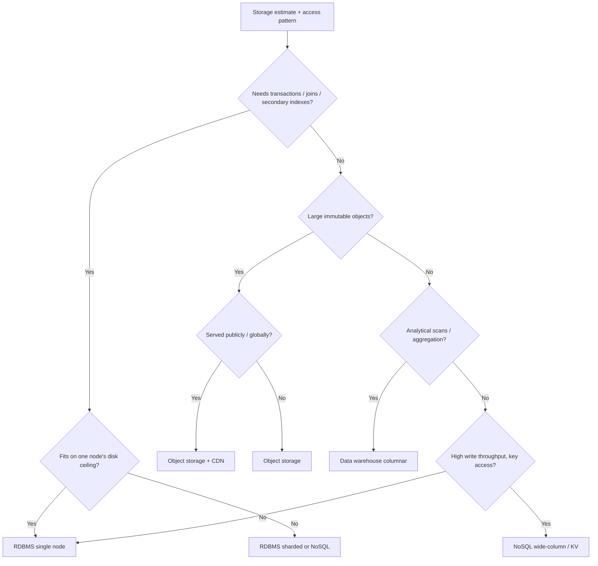
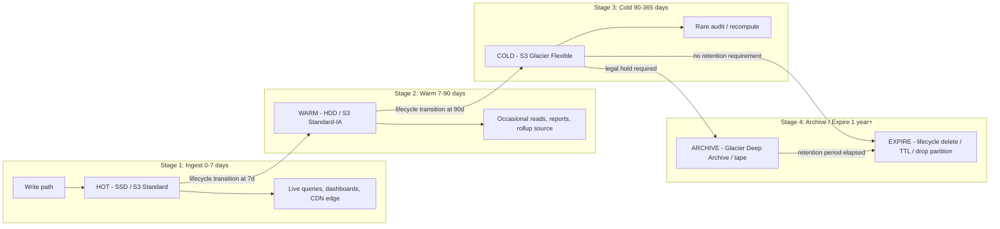
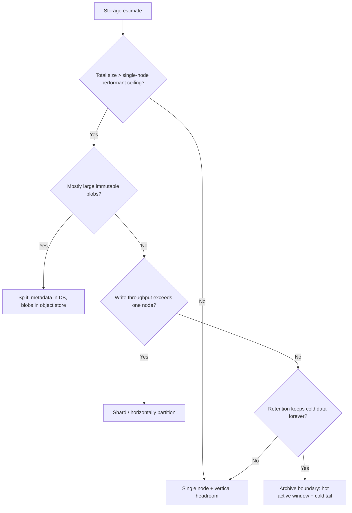

# Storage Estimation — Senior

<!-- level-focus -->
At senior level, focus on this question:

> Which system invariant is affected by **Storage Estimation** under failure, load, and change?

Use the smallest realistic scenario that exposes the decision and its failure behavior.
At the senior level, a storage number stops being an answer and becomes the *input* to a decision. A junior produces "we need 4.7 PB in year three." A senior takes that number and decides **what kind of storage**, **across how many tiers**, **at what cost**, **with what retention**, and **at what point the design is forced to shard or archive**. This page is about ownership: turning an estimate into a defensible, cost-bounded storage plan that survives three years of growth and an on-call page at 3 a.m.

## 1. From a number to a decision

A storage estimate that ends at a total byte count is a half-finished artifact. The senior deliverable answers a chain of dependent questions, each of which constrains the next:

1. **What is the access pattern?** Random point reads, sequential scans, append-only writes, large-object fetches, analytical aggregation. The pattern selects the *storage type*.
2. **What is the read/write ratio and the latency budget?** This selects the *tier* (SSD vs HDD vs object vs archive) and whether a cache or CDN sits in front.
3. **How does the data age?** A 30-day-old log line is almost never read. Aging selects the *lifecycle policy*.
4. **How long must it live?** Legal, compliance, and product requirements set *retention*, which is the single biggest multiplier on total cost.
5. **Where does a single node's disk ceiling break?** That selects *sharding/partitioning* and the archival boundary.

Every one of these has a dollar figure attached. The senior's job is to make the total bounded and explainable, not minimal at the expense of correctness. The cheapest plan that loses data on a compliance audit is not cheap.

A useful framing: storage cost is `bytes × dollars-per-GB-per-month × retention-months × replication-factor`. You control three of those four levers (the byte count is mostly given by the product). Tiering attacks the dollars-per-GB term; retention policy attacks the retention-months term; erasure coding vs replication attacks the replication-factor term. Master those three and a multi-PB estimate becomes a five-figure monthly bill instead of a six-figure one.

---

## 2. Choosing the storage type from the access pattern

The most common senior mistake is reaching for the storage type you know best instead of the one the access pattern demands. Picking RDBMS for a 50 TB append-only event stream, or object storage for a workload that needs transactional point updates, will cost you an order of magnitude in either money or latency. Map the *dominant* access pattern to a type first, then handle exceptions with a secondary store.

| Storage type | Access pattern it fits | Unit economics (order of magnitude) | Latency | Scales to | Avoid when |
|---|---|---|---|---|---|
| **Block storage** (EBS, local NVMe) | OS-level random R/W under a single attached host; databases, filesystems | $0.08–0.10/GB-mo (gp3); local NVMe cheaper but ephemeral | sub-ms (NVMe) | single host's attach limit (~16–64 TB/volume) | you need shared access across many hosts |
| **RDBMS** (Postgres, MySQL) | Transactional point reads/writes, joins, strong consistency, secondary indexes | dominated by IOPS-provisioned block + compute, effectively $0.20–1.00/GB-mo all-in | 1–10 ms | low-to-mid TB per node before sharding | data is append-only and rarely joined |
| **NoSQL** (Cassandra, DynamoDB, Mongo) | High-write-throughput, key/partition access, horizontal scale, flexible schema | $0.10–0.25/GB-mo + request charges | 1–10 ms | PB across a cluster | you need multi-row ACID transactions or ad-hoc joins |
| **Object storage** (S3, GCS) | Large immutable blobs, write-once-read-many, high durability, massive scale | ~$0.023/GB-mo (S3 Standard) | 10–100+ ms first byte | effectively unbounded | you need in-place mutation or low-latency random small reads |
| **Blob + CDN** (object origin + edge cache) | Public/static large objects served globally; images, video, downloads | origin $0.023/GB-mo + egress/CDN $0.02–0.085/GB transferred | edge: 10–50 ms | unbounded | objects are private, tiny, or rarely re-read |
| **Data warehouse** (Snowflake, BigQuery, Redshift) | Columnar analytical scans, aggregations over huge tables, BI | storage ~$0.02–0.04/GB-mo + per-query/per-slot compute | seconds | PB | you need single-row OLTP latency |

The decision is rarely "one store." Real systems separate concerns: the canonical example is **metadata in a database, payload in object storage**. A photo service keeps 1 KB of metadata per photo (owner, dimensions, EXIF, ACL) in Postgres or Dynamo — that's the part you query, filter, and join — and the multi-megabyte JPEG in S3 behind a CDN. The metadata store stays in the low TB and remains queryable; the blob store absorbs the PB and never needs an index. Conflating the two (BLOB columns in Postgres) is the single most expensive storage anti-pattern at scale: you pay database-grade dollars-per-GB for data the database never reasonably searches.

A quick decision flow for the dominant pattern:

Two patterns dominate "no" branches and deserve their own callout. **Time-series** (metrics, IoT, traces) is append-heavy, time-ordered, and read with time-range filters — a purpose-built TSDB (Prometheus, TimescaleDB, InfluxDB) or a partitioned columnar table beats a generic RDBMS by a wide margin because it can roll up and drop old data cheaply. **Search** (full-text, faceted) needs an inverted index (Elasticsearch/OpenSearch); never try to serve `LIKE '%term%'` from your OLTP database at scale.

---

## 3. Tiering: hot, warm, cold, archive

Not all bytes are equal. In almost every real dataset the **access frequency follows a steep decay**: the last 24 hours of data serves the overwhelming majority of reads, and data older than a quarter is read almost never — but still must exist. Storing every byte on the fastest, most expensive medium is how you turn a $5,000/month bill into a $50,000/month bill for no user-visible benefit.

Tiering means matching the *storage medium's cost and latency* to the *data's current access frequency*, and migrating data down the tiers as it ages. The four canonical tiers:

| Tier | Medium / service | Access frequency | Read latency | Retrieval cost | Typical age of data |
|---|---|---|---|---|---|
| **Hot** | NVMe SSD / in-memory / S3 Standard | constant, latency-critical | sub-ms to ~10 ms | none / included | 0–7 days |
| **Warm** | HDD / S3 Standard-IA / Infrequent Access | occasional, tolerant of higher latency | 10–50 ms | small per-GB retrieval fee | 7–90 days |
| **Cold** | S3 Glacier Flexible / nearline HDD | rare, audit/recompute | minutes to hours | meaningful retrieval + per-GB fee | 90 days–1 year |
| **Archive** | S3 Glacier Deep Archive / tape | almost never; legal hold | hours (up to 12+) | highest retrieval; cheapest storage | 1+ year |

The critical insight a senior internalizes: **the cheap tiers are cheap to *store* and expensive to *read*.** Glacier Deep Archive is roughly 23× cheaper per GB than S3 Standard for storage, but a bulk retrieval can take up to 12 hours and carries a per-GB retrieval charge plus a minimum-storage-duration penalty (180 days) if you delete early. That asymmetry is the whole game: you only push data to a cold tier when you are confident it will be read rarely, because reading it back frequently obliterates the savings. Misjudging access frequency — putting hot data in IA, or restoring Glacier objects in a tight loop — is the most common way a "cost optimization" backfires.

Tiering is implemented with **lifecycle policies**: rules attached to a bucket/table that automatically transition or expire objects based on age. On S3 these are object lifecycle rules; on a database they are partition-drop or rollup jobs. The senior designs these as part of the storage plan, not as an afterthought — because the lifecycle policy is what makes the cost model in section 4 actually hold in production rather than just on a spreadsheet.

---

## 4. Cost per GB drives the tiering decision

Tiering is only justified by arithmetic. Here are representative public list prices (us-east-1, mid-2020s order of magnitude — always re-check current pricing, but the *ratios* are stable). Use these to compute the break-even age at which transitioning data downward saves money net of the migration and retrieval costs.

| Tier (AWS S3 family) | Storage $/GB-mo | Retrieval $/GB | First-byte latency | Min storage duration |
|---|---|---|---|---|
| S3 Standard (hot) | ~$0.023 | $0 | ms | none |
| S3 Standard-IA (warm) | ~$0.0125 | ~$0.01 | ms | 30 days |
| S3 Glacier Flexible (cold) | ~$0.0036 | ~$0.01–0.03 + per-request | minutes–hours | 90 days |
| S3 Glacier Deep Archive | ~$0.00099 | ~$0.02 + per-request | up to 12 h | 180 days |

Reading the ratios: warm is ~2× cheaper than hot, cold is ~6× cheaper, deep archive is ~23× cheaper. The cost of *storing* 1 PB for a month:

- Hot (Standard): 1,000,000 GB × $0.023 = **~$23,000/mo**
- Warm (Standard-IA): **~$12,500/mo**
- Cold (Glacier): **~$3,600/mo**
- Deep Archive: **~$990/mo**

That single table is why tiering exists. If 90% of your PB is older than 90 days and read fewer than once a quarter, leaving it on Standard wastes ~$20,000/month — about a quarter-million dollars a year for one petabyte that nobody touches.

**The break-even calculation.** Transitioning costs a small per-object fee and (for cold tiers) commits you to a minimum storage duration. The decision rule: transition data to a cheaper tier once `expected-reads-per-month × retrieval-cost-per-GB < storage-savings-per-GB-per-month`. For Glacier vs Standard, savings ≈ $0.0194/GB-mo and retrieval ≈ $0.02/GB — so roughly, **if you read a given GB fewer than once per month, Glacier wins; more than that, you lose on retrieval.** This is exactly why access-frequency estimation (not just byte count) is a senior responsibility: the entire tiering ROI rides on getting that frequency right.

**Don't forget the multipliers that the headline price omits:**
- **Replication / durability factor.** Object stores price the durable copy; self-managed systems (HDFS 3× replication, Cassandra RF=3) multiply your raw bytes by 3. Erasure coding (e.g., 6+3) gets similar durability at ~1.5× overhead instead of 3× — a real lever on PB-scale bills.
- **Egress.** Moving data *out* of a cloud or across regions often costs more than storing it. A CDN that caches at the edge converts repeated origin egress into a one-time fetch — frequently the dominant cost saving for media workloads.
- **Request charges.** Millions of tiny objects incur per-request costs that can exceed storage costs; batch small objects or use a database for them.
- **Index/compute overhead.** Warehouse and database storage carries query/compute costs that dwarf the raw $/GB.

---

## 5. Retention as a first-class design output

Retention is the lever with the largest impact on total cost, and it is the one most often left undefined until an audit or a bill forces the question. A senior treats **"how long do we keep each class of data, and what happens when it expires"** as an explicit, written deliverable of the storage plan — not an emergent property of "we never delete anything."

Retention is driven by three forces that often conflict:

1. **Compliance / legal.** Financial records (often 7 years), health data, GDPR "right to be forgotten" (which mandates *deletion*, not retention), tax, audit logs. These set hard floors *and ceilings* — keeping personal data longer than lawful is itself a liability.
2. **Product value.** How far back do users actually look? Analytics dashboards, undo history, "your year in review." Value usually decays far faster than teams assume.
3. **Cost.** Every additional month of retention multiplies stored bytes. Indefinite retention of high-volume data (logs, metrics, events) is the classic silent budget killer.

The senior encodes retention as concrete mechanisms:

- **TTL (time-to-live).** Per-record expiry, native in DynamoDB, Cassandra, Redis, and most TSDBs. The record self-deletes at write-time + TTL. This is the cleanest mechanism for high-churn data because deletion cost is amortized and automatic — no batch job to fail.
- **Partition / time-bucket dropping.** For partitioned tables, "delete data older than 90 days" becomes "drop the partition," which is an O(1) metadata operation instead of a multi-hour `DELETE` that thrashes the database. Always prefer dropping partitions to row-by-row deletes at scale.
- **Lifecycle expiration rules.** On object stores, a lifecycle rule deletes objects past an age — the same mechanism that does tiering also does expiry.
- **Rollups / downsampling for time-series.** The most important senior pattern for metrics: you don't keep raw 1-second resolution forever. You keep raw data for, say, 7 days; then aggregate to 1-minute resolution for 30 days; then 1-hour for a year; then drop. Each rollup is a 60×+ reduction in volume while preserving the trend information that anyone actually queries at that age. A retention policy without rollups for time-series data is a retention policy that will bankrupt you.

Worked retention example for a metrics pipeline ingesting 100,000 data points/sec:

| Stage | Resolution | Retention | Effective rate vs raw | Why |
|---|---|---|---|---|
| Raw | 1 s | 7 days | 1× | live dashboards, incident debugging |
| Rollup 1 | 1 min | 30 days | 1/60× | recent trends, week-over-week |
| Rollup 2 | 1 hour | 13 months | 1/3600× | capacity planning, YoY |
| Expired | — | drop | 0 | no product or legal need |

Without rollups, 7-day raw at 100k pts/s × ~30 bytes/pt ≈ 1.8 TB just for the live window, and *thirteen months of raw* would be ~94 TB. With the rollup ladder, the 13-month tail collapses to a few hundred GB. The retention policy is what produces that 100× difference, and it is a *design decision*, not an operational accident.

---

## 6. The data lifecycle (staged)

The lifecycle ties tiering and retention together into a single automated pipeline. Every byte enters hot, ages downward through warm and cold, and eventually either expires or lands in archive for legal hold. The senior's plan specifies the *transition ages* and the *terminal action* for each data class. Below is the staged lifecycle for a typical event/object dataset.

Each transition arrow is a concrete lifecycle rule with a number on it, and each is reversible only at a cost (re-promoting Glacier data to hot is slow and incurs retrieval fees). The senior writes these ages down, justifies them against the access-frequency estimate, and — critically — makes the *terminal action* explicit. "Archive forever" and "expire after N years" are different decisions with different liability and cost profiles, and an undefined terminal action means the dataset grows without bound until someone notices the bill.

---

## 7. When an estimate forces sharding or archival

An estimate doesn't just tell you how much storage to buy — it tells you when your current architecture *breaks*. The senior reads the estimate for the moment a single node, table, or store hits a ceiling and must split. Three ceilings matter most.

**1. The single-node disk ceiling.** A Postgres or MySQL primary fits comfortably on a few TB of fast block storage; performance degrades well before the volume's hard limit because of index size, cache miss rates, vacuum/compaction cost, and backup/restore time. When the estimate projects the working set past what fits in RAM and the dataset past a few TB, the design is *forced* into one of:
- **Vertical first** (bigger instance, more IOPS) — buys time, not a solution; you hit the largest instance eventually.
- **Read replicas** — solves read scaling, not storage; every replica stores the full dataset.
- **Sharding / horizontal partitioning** — the real answer when *write throughput or total size* exceeds one node. The estimate tells you how many shards: `total bytes / per-shard target`. If you target 1 TB per shard and estimate 40 TB, you need ~40 shards plus headroom. Choosing the shard key is the hard part (covered in dedicated sharding material), but the *trigger* is a capacity estimate crossing the single-node ceiling.

**2. The metadata-vs-blob split.** When an estimate shows the bulk of bytes are large immutable payloads, the forcing function is to *not* store them in the transactional database at all. Separate the 1 KB queryable metadata (stays in the DB, indexable, joinable) from the 5 MB blob (goes to object storage, referenced by URL/key). This isn't an optimization — past a certain blob volume it's the only design that keeps the database operable. The estimate is what reveals the ratio: if 99.9% of your bytes are blobs, 99.9% of your bytes do not belong in the database.

**3. The archival boundary.** When retention requires keeping data the live system will never serve, the estimate forces an archival path: the hot store holds only the active window (sized to fit performantly), and everything older is migrated to cold/archive storage. This keeps the *operational* dataset bounded even as the *total retained* dataset grows. A trading system might keep 90 days hot for query and 7 years in Glacier for compliance — the live database never carries the 7-year weight.

The senior point: these are not premature optimizations. They are the architectural consequences the estimate *forces*. Detecting them early — at estimation time — is far cheaper than discovering them when the primary's disk fills during peak traffic.

---

## 8. Capacity headroom and the "running out of disk" failure mode

The most embarrassing storage incident is also the most preventable: the disk fills up. When a database's volume hits 100%, it doesn't degrade gracefully — it usually stops accepting writes entirely, and recovery can be slow because the very operations you need (compaction, vacuum, deleting old data, expanding the volume) themselves often need free space to run. A full disk on a primary can take down the whole write path.

Seniors design **headroom** as a first-class number, not a hope:

- **Never plan to run hot above ~70–80% utilization.** The top 20–30% is reserved for: write-ahead logs and compaction scratch space, sudden ingest spikes, the lag between "alert fired" and "more capacity provisioned," and the temporary doubling some operations require (e.g., a table rewrite or an index rebuild needs room for both old and new copies simultaneously).
- **Provision for the growth curve, not today's size.** If the estimate shows 20% month-over-month growth, a volume that's 60% full today is 100% full in ~3 months. The relevant question is never "are we full now?" but "given the growth rate, when do we hit the headroom threshold, and what's the lead time to add capacity?"
- **Alert on *time-to-full*, not just percent-full.** A disk at 50% growing 5%/day is more urgent than a disk at 85% that's been flat for a year. Compute and alert on projected days-until-full so on-call gets a runway, not a wall.
- **Make capacity addition non-disruptive.** Elastic volumes that grow online, auto-scaling object stores, and pre-planned shard-splitting procedures turn "running out of disk" from an outage into a routine operation. The plan should answer: *how, exactly, do we add 30% capacity, and how long does it take?* — before you need to.

The connective tissue back to estimation: the estimate's *growth rate* is what makes headroom planning possible. A point-in-time size tells you nothing about runway; the slope tells you everything. This is why a senior estimate always carries a growth assumption and a projection horizon, and why the headroom buffer is sized against that slope rather than picked arbitrarily.

---

## 9. Worked example: a multi-PB estimate to a tiered plan

A consumer video platform. The product team gives you usage; you produce the storage plan.

**Given (the estimate inputs):**
- 2 million videos uploaded per day, average 200 MB each after transcoding (original + 3 renditions stored).
- Each video carries ~2 KB of metadata (title, owner, tags, view counts, ACL).
- Access pattern: a video gets ~90% of its lifetime views in its first 30 days, then a long, thin tail. ~95% of all *reads* hit videos younger than 30 days.
- Retention: keep all videos indefinitely (product requirement), but originals (not the served renditions) only need to be reachable for re-transcoding — rarely.
- Served globally to a mobile and web audience.

**Step 1 — raw volume.** 2M videos/day × 200 MB = 400 TB/day of new video. Over a year: ~146 PB/year of *new* data, growing. Metadata: 2M × 2 KB = 4 GB/day ≈ 1.5 TB/year. Immediately the senior sees the dominant fact: **>99.99% of bytes are blobs; metadata is trivial.** This forces the metadata-vs-blob split.

**Step 2 — storage type per data class.**
- *Metadata* (1.5 TB/yr, queryable, joined, point-read by ID, filtered by owner/tags): a sharded NoSQL store (DynamoDB or Cassandra) or a partitioned RDBMS. Easily fits; no PB problem here.
- *Served renditions* (the bytes users stream): object storage origin + CDN. The CDN is non-negotiable here — global audience, large objects, heavy re-reads in the hot window. The CDN converts repeated origin egress into edge cache hits, which is the single largest cost saver for this workload.
- *Originals* (kept only for re-transcoding): object storage, destined for a cold tier almost immediately since they're read maybe once ever.

**Step 3 — tiering by age, using the access decay.** Because 95% of reads hit content younger than 30 days, the hot/warm boundary is obvious:

| Age | Tier | What lives here | Why |
|---|---|---|---|
| 0–30 days | Hot: S3 Standard + CDN | renditions of new uploads | 95% of reads; CDN absorbs the volume |
| 30–365 days | Warm: S3 Standard-IA | older renditions, thin-tail views | occasional reads, ~2× cheaper to store |
| 365 days+ | Cold: S3 Glacier Flexible | long-tail renditions | rare reads, ~6× cheaper |
| any age | Archive: Glacier Deep Archive | **originals**, immediately | read ~never, ~23× cheaper, only for re-transcode |

**Step 4 — cost the plan (one year of accumulated renditions ≈ 146 PB, modeling steady-state distribution).** Roughly: ~12 PB land in the hot 30-day window at any time, ~110 PB in warm (the 30–365 day band), ~24 PB rolling into cold, and the originals (~36 PB of the 146, the largest single rendition) sit in Deep Archive.

- Hot 12 PB × $0.023/GB = ~$276k/mo
- Warm 110 PB × $0.0125/GB = ~$1.38M/mo
- Cold 24 PB × $0.0036/GB = ~$86k/mo
- Archive originals 36 PB × $0.00099/GB = ~$36k/mo

Compare to the naive "everything on S3 Standard" plan: ~146 PB (renditions) + 36 PB (originals) ≈ 182 PB × $0.023 ≈ **$4.3M/mo**. The tiered plan totals roughly **$1.78M/mo** — a ~58% reduction, ~$30M/year saved, by doing nothing more than reading the access-frequency decay and attaching lifecycle rules. The biggest single lever was pushing originals straight to Deep Archive (36 PB that would otherwise cost ~$1M/mo on Standard now costs ~$36k/mo).

**Step 5 — sharding, retention, headroom.**
- *Sharding:* the blob store (object storage) scales horizontally for free — no sharding decision there. The *metadata* store grows ~1.5 TB/yr and will eventually shard by video-ID hash; the estimate says that's years away, so plan the shard key now but don't pre-shard.
- *Retention:* indefinite for renditions (product), but originals could carry a TTL if re-transcode demand proves negligible — flag it for review as a future lever. Lifecycle rules: transition renditions Standard→IA at 30 days, IA→Glacier at 365 days; PUT originals directly to Deep Archive.
- *Headroom:* object storage is elastic, so the "running out of disk" risk lives entirely in the metadata store. Size it to 70% and alert on projected days-until-full against the 1.5 TB/yr slope.

The point of the worked example is the *shape* of the reasoning, not the exact dollars: estimate → identify the dominant byte class → split metadata from blobs → tier by measured access decay → cost each tier → apply lifecycle/retention/headroom. Every number traces back to an access-pattern fact, and every fact maps to a storage decision.

---

## 10. Senior review checklist

When reviewing or producing a storage plan, a senior verifies all of the following are *explicitly answered*, not implied:

- [ ] **Dominant access pattern named**, and storage type chosen from it (not from familiarity).
- [ ] **Metadata and blobs separated** if the byte distribution is lopsided — queryable data in a DB, payloads in object storage.
- [ ] **Tier boundaries set by measured/estimated access decay**, not by guesswork; the hot window fits what 90%+ of reads touch.
- [ ] **Cost-per-GB computed per tier**, with the naive single-tier baseline shown for contrast so the savings are explicit.
- [ ] **Retention policy written down per data class**, with a concrete mechanism (TTL, partition drop, lifecycle expiry) and an explicit *terminal action*.
- [ ] **Rollups/downsampling specified for any time-series data** — raw retention plus a resolution-reduction ladder.
- [ ] **Replication / durability factor included** in the byte math (3× replication vs ~1.5× erasure coding), and **egress/request charges** accounted for, not just storage $/GB.
- [ ] **Sharding/archival trigger identified** — the specific estimate value at which a single node or store breaks, and the chosen split (vertical → replica → shard → archive boundary).
- [ ] **Headroom reserved** (target ~70–80% hot utilization) and **time-to-full alerting** based on the growth slope, with a known, non-disruptive capacity-addition procedure.
- [ ] **The whole plan traces back to the estimate** — every tier, retention, and shard decision points to a specific number and access-pattern fact.

A storage estimate that passes this checklist is an owned design: bounded in cost, defensible in an audit, resilient to growth, and free of the 3 a.m. full-disk page. That is the difference between producing a number and owning a system.

---

*Next step:* [Professional level](professional.md)

---

## Apply it

1. State the system invariant that **Storage Estimation** must protect.
2. Mark ownership, state, and failure propagation at each boundary.
3. Compare two designs under load, dependency failure, and future change.
4. Define recovery and compatibility behavior before implementation.
5. Test the riskiest assumption with a focused experiment.

## Verify your work

- The experiment supports the design with evidence, not preference.
- Failure injection shows the blast radius and recovery path.
- Compatibility checks cover old and new callers or data.
- Operational signals reveal invariant violations and recovery progress.

## Review questions

- Which invariant must remain true when Storage Estimation fails?
- Where should recovery responsibility live, and why?
- Which assumption deserves an experiment before implementation?
- How can the design evolve without changing every consumer at once?
