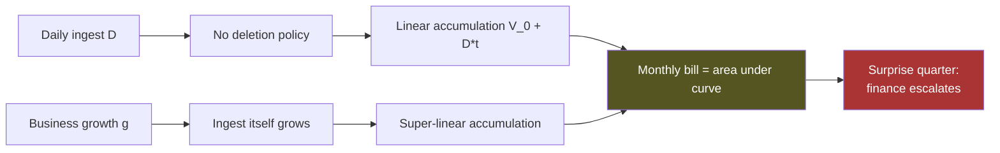
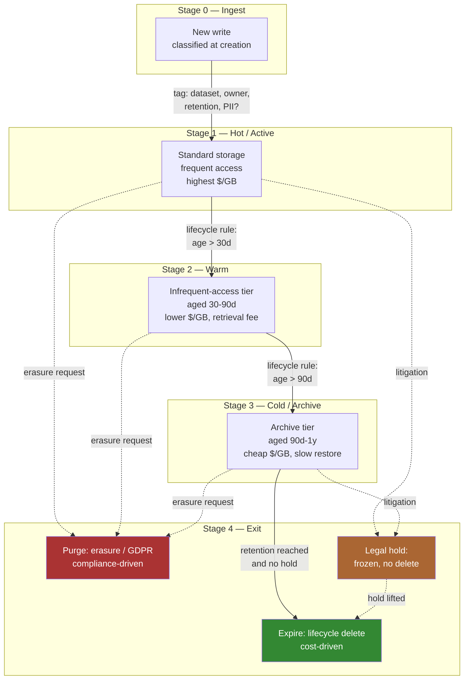
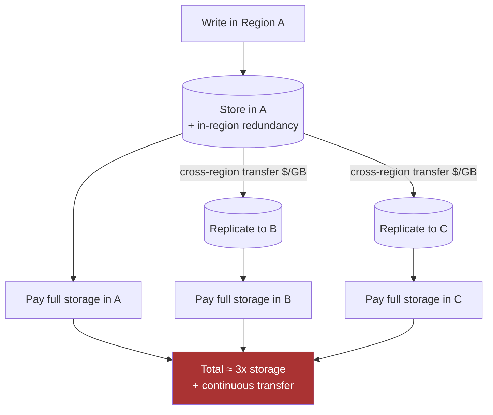
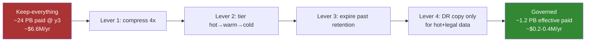

# Storage Estimation — Staff / Principal Level

Storage is the one resource in a system that, left ungoverned, only ever
grows. Compute scales up and down with load; bandwidth is rented by the
second; cache is bounded by RAM. Storage is different: every write that is
never deleted is a liability you pay rent on, every month, forever. At
megabyte scale nobody notices. At petabyte scale storage becomes one of the
largest and most politically charged lines on the infrastructure bill — and
the one no engineer feels they own.

This page is the organizational, cost-and-compliance view of storage
estimation. It is not more capacity arithmetic (that lives at the junior and
middle levels). It is about the judgment a Staff or Principal engineer is
expected to bring: forecasting petabyte growth before finance does, turning
retention into a deliberate legal-and-cost decision, deciding build-vs-buy,
understanding why multi-region multiplies the bill, and making storage growth
*visible* in capacity reviews so it can be governed instead of discovered.

---

## Table of contents

1. [Storage is the silent PB-scale cost driver](#1-storage-is-the-silent-pb-scale-cost-driver)
2. [The compounding bill: why growth is monotonic](#2-the-compounding-bill-why-growth-is-monotonic)
3. [Data-lifecycle governance: retention as a decision](#3-data-lifecycle-governance-retention-as-a-decision)
4. [The staged lifecycle-governance model](#4-the-staged-lifecycle-governance-model)
5. [Keep-everything vs governed-lifecycle: the cost comparison](#5-keep-everything-vs-governed-lifecycle-the-cost-comparison)
6. [Deletion and archival: the policies nobody owns](#6-deletion-and-archival-the-policies-nobody-owns)
7. [Build vs buy: running your own vs object storage](#7-build-vs-buy-running-your-own-vs-object-storage)
8. [Multi-region storage cost](#8-multi-region-storage-cost)
9. [Tiering and lifecycle automation as cost levers](#9-tiering-and-lifecycle-automation-as-cost-levers)
10. [Worked example: a PB-scale growth forecast](#10-worked-example-a-pb-scale-growth-forecast)
11. [Making storage visible in capacity reviews](#11-making-storage-visible-in-capacity-reviews)
12. [Staff takeaways](#12-staff-takeaways)

---

## 1. Storage is the silent PB-scale cost driver

Storage is silent because it fails *slowly* and *cheaply* until it doesn't.
A runaway query pages someone at 3am. A runaway storage trend pages no one —
it just appears, one quarter, as a 40% jump in the cloud bill that finance
escalates to engineering leadership, who escalate to you. By then the data is
years deep, owned by teams that have since reorganized, governed by retention
rules that were never written down.

The Staff-level framing is that **storage is a governance problem wearing a
capacity costume.** The arithmetic — bytes per record times records per day —
is trivial and any mid-level engineer can do it. What is hard, and what
distinguishes the senior judgment, is answering: *who decided we keep this
data, for how long, why, and what does that decision cost the company per
year?* In most organizations that question has no answer. The data exists
because deleting felt risky and keeping felt free. Neither is true at scale.

Three properties make storage uniquely dangerous as a cost driver:

- **It is cumulative, not instantaneous.** This quarter's bill includes every
  byte you have ever written and not deleted. You are paying for decisions made
  by people who have left the company.
- **The marginal write is invisible.** A single log line, event, or row append
  is sub-cent. The aggregate of a billion of them per day, retained for five
  years, is a seven-figure annual line item. Nobody connects the two at the
  point of the write.
- **Ownership diffuses.** Compute spend maps to a service with an on-call team.
  Storage spend maps to "the data lake" or "the logging pipeline" — shared
  infrastructure with no single accountable owner until finance assigns one
  retroactively.

The job, then, is to convert an invisible, cumulative, unowned cost into a
visible, forecasted, owned one *before* the surprise.

---

## 2. The compounding bill: why growth is monotonic

The defining feature of ungoverned storage is that it is **monotonically
non-decreasing.** Volume only goes up. Without an explicit deletion or
expiry mechanism, the steady-state size is "everything ever produced."

Model it simply. If a system ingests `D` bytes per day of net-new data and
nothing is ever deleted, total stored volume after `t` days is:

```
V(t) = V_0 + D * t
```

Linear — already a problem, because the *cost* is the area under that line
over the billing period, not the endpoint. But real systems are worse than
linear, because `D` itself grows with the business. If daily ingest grows at
rate `g` (more users, more events per user, more instrumentation, more
derived datasets), then volume is super-linear and cost compounds:

```
V(t) ≈ V_0 * (1 + g)^t       (when ingest scales with the business)
```

A 6% month-over-month ingest growth — modest for a healthy product — doubles
your data footprint roughly every twelve months. Two years of that is a 4x
footprint; three years is 8x. The bill follows. This is why "we'll deal with
storage later" is a strategically expensive sentence: every month of delay
compounds the base on which all future growth multiplies.



The strategic insight: because cost is cumulative, **the cheapest data to not
store is the data you have not written yet.** Governance applied today caps
the base of the exponential. Governance applied in two years only trims the
tail — by then the expensive years are already on the bill.

---

## 3. Data-lifecycle governance: retention as a decision

At Staff level, *retention is not a default — it is a decision with a name on
it.* Every dataset should be able to answer four questions:

1. **What is the minimum retention required?** Often a legal floor:
   financial records (frequently 7 years under tax/audit law), some health
   and transaction logs, regulator-mandated audit trails.
2. **What is the maximum retention permitted?** Often a legal ceiling: under
   GDPR's storage-limitation principle and the right to erasure (Article 17),
   personal data may not be kept longer than necessary for its purpose.
   "Keep forever" can be a *compliance violation*, not just a cost.
3. **What does keeping it cost?** Annual storage spend for that dataset,
   including replication and cross-region multipliers (sections 8–9).
4. **Who owns the trade-off?** A named team or role accountable for the
   retention setting — not "infra," not "nobody."

The tension that makes this a genuine decision: minimum and maximum retention
pull in opposite directions, and *both are non-negotiable.* You cannot delete
the audit log early to save money (regulatory floor). You must delete the
user's personal data on request and within bounded time (regulatory ceiling).
Between those constraints sits a cost optimization that finance cares about
and engineering usually ignores.

| Driver | Pushes retention | Failure mode if ignored |
| --- | --- | --- |
| Legal floor (tax, audit, SOX) | Longer / mandatory | Fines, failed audits, legal exposure |
| Legal ceiling (GDPR, CCPA) | Shorter / bounded | Regulatory penalties, erasure non-compliance |
| Litigation hold | Indefinite (specific scope) | Spoliation sanctions if deleted |
| Product/analytics value | Longer (often speculative) | Lost insight (usually overstated) |
| Cost | Shorter | Budget overrun, quarterly surprise |
| Operational recovery | Long enough for restore | Inability to recover from incident |

The most common organizational anti-pattern is treating retention as an
engineering default ("the bucket has no lifecycle rule, so objects live
forever") rather than a deliberate cross-functional decision. The Staff
engineer's contribution is to force the decision into the open: surface the
cost, name the legal constraints, and assign the owner. "Keep everything
forever" is a valid choice *only when someone has signed off on its annual
cost and its compliance risk* — which, once stated explicitly, almost nobody
does.

---

## 4. The staged lifecycle-governance model

Governance is best expressed as data moving through *stages*, each with a
defined storage class, access pattern, cost, and exit condition. The diagram
below is the canonical pipeline: data is born hot, cools as it ages, and
ultimately either expires (cost-driven) or is purged (compliance-driven).



The stages encode the two distinct exit reasons that organizations routinely
conflate:

- **Expire (Stage 4, green)** is *cost-driven* deletion: the data has aged
  past its useful life and its retention window, so a lifecycle rule reclaims
  the spend. This is the lever finance cares about.
- **Purge (Stage 4, red)** is *compliance-driven* deletion: a specific
  subject's data must be removed regardless of age, on request, within a
  legal deadline. This is the lever the DPO and legal care about — and it must
  reach *every* stage, including cold archive, which is exactly where erasure
  implementations tend to silently miss data.

The single most important governance property the diagram enforces:
**classification happens at ingest, not later.** If data is tagged at creation
with its dataset, owner, retention class, and PII status, every downstream
transition is automatable. If it is not, you are stuck running expensive,
error-prone retroactive scans to figure out what you have — the position most
organizations are in when finance first asks the question.

---

## 5. Keep-everything vs governed-lifecycle: the cost comparison

The clearest way to make the case for governance is to model the same dataset
under both policies. Consider a system ingesting **2 TB/day** of net-new data
(logs, events, derived tables), growing at **5% per month**, over a **3-year**
horizon. Assume representative object-storage pricing tiers (illustrative,
order-of-magnitude — verify against your provider's current rates):

- Standard (hot): ~$0.023 /GB-month
- Infrequent-access (warm): ~$0.0125 /GB-month
- Archive (cold): ~$0.004 /GB-month
- Deep archive: ~$0.001 /GB-month

Under **keep-everything**, all data stays in Standard forever. Under
**governed-lifecycle**, data moves hot → warm (>30d) → cold (>90d) and expires
at a retention boundary appropriate to its class, with only a legally required
fraction kept long-term.

| Dimension | Keep-everything | Governed lifecycle |
| --- | --- | --- |
| Retention policy | None (implicit "forever") | Tiered by data class, explicit expiry |
| Storage class | 100% Standard | ~5% hot, ~15% warm, ~30% cold, rest expired |
| Data footprint at 3y | ~2.4 PB and climbing | ~0.5 PB steady-state |
| Approx. annual storage cost at 3y | ~$660K and compounding | ~$70–90K, roughly flat |
| GDPR erasure | Manual, scans entire corpus | Bounded, lifecycle-integrated |
| Audit/legal floor | Met by accident (everything kept) | Met deliberately (class-specific) |
| Cost predictability | Low — surprises every quarter | High — forecastable, capped |
| Blast radius of a bad pipeline | Unbounded (writes forever) | Bounded (expiry caps growth) |

The footprint difference is the headline: governance does not shave 10% off
the bill, it changes the *shape* of the curve from compounding to flat. A
keep-everything corpus that is 2.4 PB at year three is on track to be ~5 PB at
year five; the governed corpus is still ~0.5 PB because expiry balances
ingest. The cost gap therefore widens every year — the comparison above
understates the long-run difference.

A second, subtler point: keep-everything is not even *compliant*. Holding
personal data with no expiry violates storage-limitation principles, and
servicing an erasure request against an ungoverned multi-petabyte corpus is
slow, expensive, and error-prone. Governance is the cheaper option *and* the
legally safer one. That alignment — cost and compliance pointing the same
direction — is the argument that wins capacity reviews.

---

## 6. Deletion and archival: the policies nobody owns

Here is the organizational truth a Staff engineer must internalize: **in most
companies, no one owns deletion until finance forces the question.** Creating
data is everyone's job; deleting it is no one's. The result is a corpus that
accretes by default and is governed only by retroactive panic.

Why deletion is structurally orphaned:

- **Asymmetric risk perception.** Deleting data feels dangerous ("what if we
  need it?"); keeping it feels free ("storage is cheap"). Both intuitions are
  wrong at scale, but they bias every individual decision toward retention.
- **No natural owner.** The team that *writes* the data (a service team) is
  not the team that *pays* for it (infra/finance) and not the team that bears
  the *compliance risk* (legal/DPO). Each assumes another owns the lifecycle.
- **Deletion has no feature value.** Nobody gets promoted for deleting data.
  It is pure cost-and-risk avoidance, which is chronically under-prioritized
  against shipping features.
- **Archival is mistaken for deletion.** Moving data to a cheaper tier reduces
  the per-GB cost but the data — and its compliance liability — still exists.
  Archival is a *cost* lever, not a *compliance* lever. Confusing the two
  leaves you holding personal data you believed was "dealt with."

The Staff intervention is to make deletion a *named, owned, automated*
function rather than a heroic one-off:

- **Assign an owner per dataset at creation.** The classification tag from
  Stage 0 must include an accountable team. No owner, no write.
- **Default to expiry, opt out deliberately.** New buckets/tables/topics
  should ship with a lifecycle rule by default; keeping data indefinitely
  should require an explicit, justified exception — inverting the current
  default.
- **Separate the two deletion paths.** Cost-driven expiry (automatable,
  lifecycle rules) and compliance-driven purge (must hit every tier, must be
  auditable, must respect legal holds) are different mechanisms. Build and
  test both. The purge path failing silently against cold archive is a classic
  audit finding.
- **Verify, don't assume.** A lifecycle rule that "should" delete data is not
  evidence it did. Reconcile actual footprint against expected footprint
  periodically; orphaned data (no owner, no rule) is where the surprise hides.

---

## 7. Build vs buy: running your own vs object storage

At petabyte scale the build-vs-buy question becomes real money, and the naive
per-GB comparison is misleading. Managed object storage (S3, GCS, Azure Blob)
charges roughly $0.02/GB-month for standard storage; raw disk amortized over
its life can look like a fraction of that. The instinct is "we can run it
cheaper ourselves." Sometimes true — but the comparison must be total cost of
ownership, not sticker price.

| Factor | Run your own | Managed object storage |
| --- | --- | --- |
| Per-GB sticker cost | Lower (raw disk) | Higher |
| Durability engineering | You build it (replication, repair, scrubbing) | 11-nines, included |
| Operational staffing | Dedicated storage team | None |
| Capacity planning | You forecast and procure ahead | Elastic, pay-as-you-go |
| Lifecycle/tiering | You build the automation | Native lifecycle rules |
| Egress | Free within your DC | Charged per GB out — the lock-in |
| Time-to-scale | Procurement lead times (weeks) | Immediate |
| Failure blast radius | Yours to own at 3am | Provider SLA |

Two factors dominate the real decision:

**Durability is expensive to build and easy to underestimate.** "11 nines"
of durability means erasure coding, background scrubbing, automatic repair,
multi-AZ placement, and constant verification. Reproducing that in-house is a
multi-team, multi-year investment. For most organizations the managed
durability is worth the premium outright — losing customer data is an
existential risk, not a line item.

**Egress is the lock-in, and it is the trap.** Cloud object storage is
cheap to fill and expensive to drain. Per-GB egress charges mean that once you
have multiple petabytes in a provider, *moving it out* costs more than a year
of storing it. This asymmetry is deliberate. The strategic consequences:

- Architect to keep egress-heavy compute *next to* the data (same region/cloud)
  so you do not pay to pull petabytes across the boundary repeatedly.
- Factor egress into any multi-cloud or repatriation plan — the migration bill
  can dwarf the storage savings you were chasing.
- The "we'll just move providers if it gets expensive" exit is largely
  illusory at petabyte scale. Negotiate egress and committed-use discounts
  *before* you are locked in, not after.

The defensible Staff position: **buy durability and elasticity; build only
where you have a genuine scale or cost advantage and the headcount to operate
it.** Self-hosting petabyte storage to save on sticker price, while staffing a
team to run it and accepting the durability risk, usually loses on TCO. The
exceptions are extreme scale (hyperscalers, where the math flips) or
data-gravity/sovereignty constraints that force on-prem.

---

## 8. Multi-region storage cost

Multi-region is where storage cost quietly multiplies, because most engineers
budget for *one* copy and the architecture stores *several.* Every regional
replica is a full copy you pay for in full — there is no discount for it being
a duplicate.

The cost multipliers stack:

- **Replica multiplication.** Active-active across 3 regions means ~3x the raw
  storage bill before you have stored a single new byte. Within each region,
  the provider already keeps redundant copies for durability; the regional
  factor is *on top* of that.
- **Cross-region transfer.** Replicating writes between regions incurs
  per-GB inter-region transfer charges — continuously, for every byte written,
  for as long as the system runs. At high ingest this is a substantial,
  recurring line item separate from the storage itself.
- **Asymmetric read/write geography.** Routing reads to the nearest region is
  cheap; routing them across regions re-incurs transfer. Misplaced data
  generates transfer cost on every access.



The Staff judgment is that **multi-region storage is a per-dataset decision,
not a blanket default.** The cost is justified only where the value —
disaster-recovery RPO, low-latency local reads, data-sovereignty compliance —
is real for *that* dataset. Replicating cold archival data to three regions
because the platform default does so is pure waste; that data needs durability
(provider-included) and perhaps one DR copy, not active multi-region. The
discipline is to ask, per dataset: does this need to be in N regions, or is N
an accident of a one-size-fits-all platform setting? Most of the corpus does
not need the most expensive geography.

---

## 9. Tiering and lifecycle automation as cost levers

Once you accept that storage growth is monotonic, the question becomes: how do
you reduce the *cost per byte* of the bytes you are obligated to keep?
Tiering is the primary lever, and lifecycle automation is what makes it
operate at organizational scale without per-team heroics.

The economics rest on access-frequency decay: most data is hot the day it is
written and effectively cold within weeks. A log line is queried during an
incident this week; it is almost never read again, yet may be legally required
for years. Storing that line in the hot tier for its entire retention is
paying first-class prices to warehouse data nobody reads.

| Tier | Relative $/GB | Access latency | Retrieval cost | Good for |
| --- | --- | --- | --- | --- |
| Hot / Standard | 1.0x | ms | none | Active data, recent logs/events |
| Warm / IA | ~0.5x | ms | per-GB fee | 30–90 day old, occasional access |
| Cold / Archive | ~0.17x | minutes–hours | higher fee | Compliance retention, rare restore |
| Deep archive | ~0.04x | hours | highest fee | Legal-floor data, almost never read |

The levers, in order of organizational leverage:

- **Automate transitions with lifecycle rules.** Hand-managed tiering does not
  survive contact with scale. Native lifecycle rules (age-based transitions
  and expirations) move data through stages 1→2→3→4 automatically. This is the
  difference between governance that holds and governance that decays the
  moment its champion changes teams.
- **Tier aggressively but watch retrieval economics.** Cold tiers are cheap to
  *store* and expensive to *read*. If a "cold" dataset is actually read during
  every incident, retrieval fees can exceed the storage savings. Tier by
  *actual* access pattern, measured, not assumed.
- **Compress and deduplicate before tiering.** A 3–5x compression ratio on
  logs is a direct multiplier on every downstream cost — storage, transfer,
  replication. The cheapest petabyte is the one compression made into 250 TB.
- **Expire, don't just tier.** Tiering reduces cost; expiry eliminates it.
  Archival is a discount on a liability you still hold (and still must purge
  on erasure requests). Where retention permits, deletion beats deep-archiving
  every time — on cost *and* on compliance surface area.

Tiering is the lever that handles the data you *must* keep; expiry (section 3)
is the lever for data you *may* delete. A mature lifecycle uses both: tier the
obligated, expire the optional.

---

## 10. Worked example: a PB-scale growth forecast

Bring it together with a forecast of the kind a Staff engineer presents in a
capacity review. The shape matters more than the exact numbers.

**System.** A platform's event + log pipeline.

**Inputs.**
- Net-new ingest today: **3 TB/day**.
- Ingest growth: **5% per month** (tracks product growth and added
  instrumentation).
- Replication: **2 regions** (1 primary + 1 DR copy).
- Current policy: keep-everything in Standard (the implicit status quo).

**Step 1 — Project the footprint (keep-everything).**
At 5% monthly ingest growth, daily ingest roughly doubles each year, and the
*cumulative* footprint grows super-linearly. Starting near 0:

- End of year 1: ~1.5 PB stored.
- End of year 2: ~5 PB stored.
- End of year 3: ~12 PB stored — and the curve is steepening.

Doubled for 2-region replication, the *paid* footprint is ~3 PB / ~10 PB /
~24 PB at years 1 / 2 / 3.

**Step 2 — Translate to annual cost.**
At ~$0.023/GB-month Standard, ~24 PB of replicated data at year three is
roughly **$6.6M/year** in storage alone, *plus* continuous cross-region
transfer on every written byte. And it keeps compounding into years four and
five. This is the number that, presented one quarter as a surprise, gets a
Staff engineer summoned to leadership.

**Step 3 — Apply governance levers.**



- **Compression (4x).** Logs and events compress well; this alone cuts the
  paid footprint by ~75% across every downstream cost. ~24 PB → ~6 PB.
- **Tiering.** Move >30d data to warm, >90d to cold/archive. The bulk of the
  corpus is old and rarely read; blended $/GB drops by roughly half to two
  thirds.
- **Expiry.** Apply class-specific retention: operational logs expire at, say,
  90 days; legal-floor records keep their mandated window; speculative
  analytics data expires at 1 year unless justified. Expiry caps cumulative
  growth so the footprint reaches a *steady state* instead of compounding —
  the single biggest structural win.
- **Replication discipline.** Replicate only hot and legal-floor data to the
  DR region, not the entire cold archive. This removes the blanket 2x on the
  cheapest, largest slice of data.

**Result.** The effective paid footprint drops from ~24 PB to roughly ~1–1.5
PB, and — crucially — *stops compounding*, because expiry now balances ingest.
Annual cost falls from ~$6.6M and rising to a few hundred thousand and roughly
flat. The levers are multiplicative: compression × tiering × expiry ×
replication-discipline compound in your favor exactly as ungoverned growth
compounded against you.

The point of the worked example is not the precision. It is the *story arc* a
Staff engineer must tell: here is where we are headed, here is the bill, here
are the named levers, here is the governed outcome, and here is who owns each
lever. That is a capacity review, not a calculation.

---

## 11. Making storage visible in capacity reviews

Governance only happens when growth is *visible to the people who can fund and
mandate it.* The reason storage surprises happen is that the trend lived in a
cloud-billing console nobody read until the number got scary. The Staff
engineer's enduring contribution is to put storage on the same review footing
as compute and reliability.

What "visible" means concretely:

- **Forecast, don't report.** A capacity review should show the *projected*
  footprint and bill 12–24 months out under current policy, not last month's
  actuals. The value is in seeing the surprise before it arrives, while levers
  are still cheap to pull.
- **Cost per dataset, with an owner.** Break the storage bill down by dataset
  and team. An aggregate "data lake: $X" is unactionable; "team A's event
  archive: $Y growing Z%/yr, owner: name" is a decision someone can make.
- **Show both curves.** Present keep-everything vs governed side by side (the
  section 5 table). Leadership funds governance when they can see the
  divergence, not when they are told storage is "growing."
- **Surface compliance alongside cost.** Pair the dollar figure with the
  retention/erasure posture. Cost and compliance pointing the same way (both
  favor governance) is the most persuasive argument you have.
- **Track orphaned data as a risk.** Data with no owner, no retention class,
  and no lifecycle rule is the highest-risk slice — both for cost (it grows
  unchecked) and compliance (it cannot be reliably purged). Report it as a
  number that should trend toward zero.

The deliverable that earns the Staff title is a recurring storage-capacity
review that turns the silent, cumulative, unowned cost into a forecasted,
itemized, owned one — *before* finance discovers it. Once growth is visible
and attributed, governance follows almost naturally, because now there is a
name attached to each decision and a number attached to each delay.

---

## 12. Staff takeaways

- **Storage grows monotonically forever unless governed.** Cost is cumulative
  (every undeleted byte, every month) and often super-linear (ingest scales
  with the business). The cheapest data to not store is the data not yet
  written — govern early, because delay compounds the base.
- **Retention is a decision, not a default.** It sits between a legal floor
  (audit/tax) and a legal ceiling (GDPR storage-limitation and erasure).
  "Keep everything forever" is both a cost liability and frequently a
  compliance violation; it is only valid when someone has explicitly signed
  off on its annual cost and its risk.
- **Deletion is structurally orphaned.** No one owns it until finance asks.
  Fix it by assigning per-dataset owners at ingest, defaulting to expiry,
  separating cost-driven expiry from compliance-driven purge, and verifying
  rather than assuming the data actually left.
- **Build-vs-buy turns on durability and egress, not sticker price.** Buy
  durability and elasticity; build only at extreme scale with the headcount to
  operate it. Treat egress as deliberate lock-in and price it into every
  migration and multi-cloud plan.
- **Multi-region multiplies the bill** — full-price replicas plus continuous
  cross-region transfer. Make it a per-dataset decision, not a platform
  default; most of the corpus does not need the most expensive geography.
- **Tiering and lifecycle automation are the levers at scale**, and they
  compound: compression × tiering × expiry × replication-discipline. Tier the
  data you must keep; expire the data you may delete — expiry beats archival
  on both cost and compliance surface.
- **Visibility is the whole game.** Forecast 12–24 months out, attribute cost
  per dataset to a named owner, show keep-everything vs governed side by side,
  and surface orphaned data as a tracked risk. Governance follows visibility,
  and the Staff engineer's job is to create the visibility before the surprise.

---

*Next step:* [Interview questions](interview.md)
