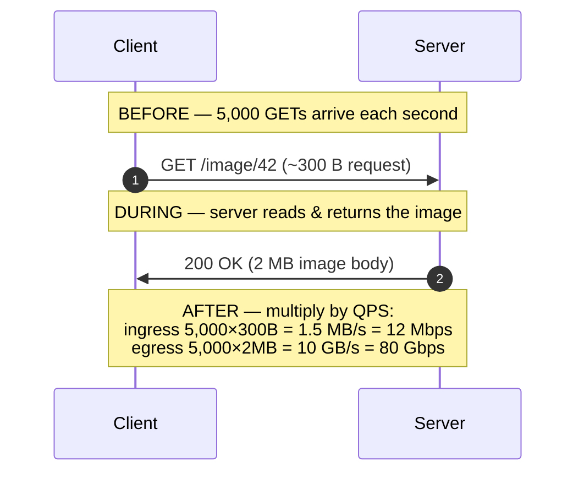

# Bandwidth Estimation — Junior

<!-- level-focus -->
At junior level, focus on this question:

> How can I apply **Bandwidth Estimation** in one small example and prove the result?

Use the smallest realistic scenario that exposes the decision and its failure behavior.
Bandwidth estimation answers one deceptively simple question: **how much
network capacity does my system move per second?** Get it wrong by a factor
of 8 (the classic bits-vs-bytes trap) and your design is off by an order of
magnitude. This page builds the intuition from first principles, shows every
arithmetic step, and never hides a unit conversion.

## 1. What "bandwidth" actually means

In capacity estimation, **bandwidth** is a *rate*: the amount of data crossing
a network link per unit of time. It is not "how much you store" and it is not
"how many requests you serve" — it is those two multiplied together and viewed
through the lens of *per second*.

Three quantities get confused constantly, so pin them down first:

| Quantity   | Question it answers          | Typical unit      | Example value        |
|------------|------------------------------|-------------------|----------------------|
| Throughput | How many ops per second?     | QPS / RPS         | 5,000 requests/s     |
| Payload    | How big is one op's data?    | bytes (B/KB/MB)   | 2 MB per image       |
| Bandwidth  | How many bits/s on the wire? | bits/s (Mbps/Gbps)| 80 Gbps egress       |

QPS tells you *how often*. Payload tells you *how heavy*. Bandwidth is the
product, converted into the bits-per-second units that network gear,
cloud bills, and NIC datasheets all speak.

Why care as a junior engineer? Because bandwidth decides whether a single
server can serve your traffic, whether you need a CDN, and how large your
cloud egress bill will be. It is one of the four pillars of back-of-the-envelope
capacity estimation, alongside QPS, storage, and memory.

---

## 2. The core formula

The entire topic rests on one line:

```
bandwidth (per direction) = QPS × average payload size (per direction)
```

That is it. Throughput times the size of one payload gives you bytes per
second. Then — and this is where discipline matters — you convert to bits per
second so the number is comparable to how networks are sold and measured.

```
bytes/s  = QPS × payload_bytes
bits/s   = bytes/s × 8
```

A few refinements you will reach for almost immediately:

- **Per direction.** Requests going *in* (ingress) and responses going *out*
  (egress) usually have very different payload sizes, so compute them
  separately. A 200-byte request that returns a 2 MB image is a 10,000:1
  asymmetry.
- **Average vs peak.** The formula above uses *average* payload. Real traffic
  is bursty, so multiply the average result by a peak factor (often 2–3×) to
  size links and pick instance types. Junior estimates state the average,
  then note the peak.
- **Overhead.** TCP/IP, TLS, and HTTP headers add roughly 2–10% on top of the
  payload. At the junior level we usually ignore it and call the estimate a
  *lower bound*; it is enough to be right to the nearest power of ten.

> 🎞️ **See it animated:** [How fast is your internet? bits vs bytes (CS Field Guide)](https://www.csfieldguide.org.nz/en/interactives/bits-and-bytes/)

---

## 3. Bits vs bytes — the number-one mistake

This single distinction causes more wrong capacity estimates than anything
else on this page. Internalize it now and you will avoid an 8× error for the
rest of your career.

- **1 byte (B) = 8 bits (b).** Lowercase `b` is bit, uppercase `B` is byte.
- **Storage and payloads are measured in bytes** — a JSON body is "2 KB",
  an image is "2 MB", a row is "300 bytes".
- **Networks are measured in bits per second** — a NIC is "10 Gbps", a home
  link is "100 Mbps", a peering port is "100 Gbps".

So whenever you compute bandwidth, your payload arrives in **bytes** but your
answer must be reported in **bits per second**. The bridge is the factor of 8.

```
80 Gbps  ÷ 8  = 10 GB/s     (bits → bytes: divide by 8)
10 GB/s  × 8  = 80 Gbps     (bytes → bits: multiply by 8)
```

A mental sanity check: a "100 Mbps" link does **not** download a 100 MB file
in one second. 100 Mbps = 100 ÷ 8 = 12.5 MB/s, so the file takes about 8
seconds. The factor of 8 is exactly why the file feels slower than the
megabit number suggests.

| Symbol | Name         | Equals    | Used for               |
|--------|--------------|-----------|------------------------|
| `b`    | bit          | —         | network rates          |
| `B`    | byte         | 8 bits    | storage, payload sizes |
| `Kb`   | kilobit      | 1,000 b   | network rates          |
| `KB`   | kilobyte     | 1,000 B   | storage (SI), payloads |
| `Mb`   | megabit      | 1,000 Kb  | network rates          |
| `MB`   | megabyte     | 1,000 KB  | storage, payloads      |

Rule of thumb to recite under interview pressure: **"Payload in bytes,
bandwidth in bits, bridge them with ×8 or ÷8."**

---

## 4. Units and the base-10 convention

Network bandwidth uses **base-10 (decimal SI) prefixes**, not base-2. When a
NIC says "1 Gbps" it means 1,000,000,000 bits per second — a clean billion —
not 2³⁰. This is convenient: you can move between units by sliding the decimal
point three places at a time.

| Unit | Name             | Bits per second           | In bytes/s          |
|------|------------------|---------------------------|---------------------|
| bps  | bit per second   | 1                         | 0.125 B/s           |
| Kbps | kilobit/s        | 1,000 (10³)               | 125 B/s             |
| Mbps | megabit/s        | 1,000,000 (10⁶)           | 125 KB/s            |
| Gbps | gigabit/s        | 1,000,000,000 (10⁹)       | 125 MB/s            |
| Tbps | terabit/s        | 1,000,000,000,000 (10¹²)  | 125 GB/s            |

Two clarifications juniors trip over:

- **`Kbps` uses a big K but is still base-10 (1,000).** Don't confuse it with
  the base-2 *kibibit* (`Kib`, 1,024). For bandwidth, decimal is the
  convention, and the difference is small enough to ignore at our precision.
- **Storage uses bytes; the same prefixes apply.** 1 MB = 1,000,000 bytes in
  SI terms. (Some tools use 1 MiB = 1,048,576 bytes, but at the estimation
  level we treat 1 MB ≈ 10⁶ bytes and move on.)

Handy anchors worth memorizing, because they let you convert in your head:

- **1 Gbps = 125 MB/s.** (1,000,000,000 ÷ 8 = 125,000,000 bytes.)
- **8 Gbps = 1 GB/s.** (The factor-of-8 anchor in the large units.)
- **1 Mbps = 125 KB/s.**

Once "8 Gbps = 1 GB/s" is in muscle memory, you can flip any bandwidth number
between the bits world and the bytes world in one second.

---

## 5. Ingress vs egress

Traffic flows in two directions, and you must estimate each separately because
their payloads differ wildly.

- **Ingress** = data flowing *into* your system (client → server). Uploads,
  request bodies, posted form data, incoming images.
- **Egress** = data flowing *out of* your system (server → client). Downloads,
  response bodies, served images, streamed video.

The formula is applied once per direction:

```
ingress_bps = QPS × avg_request_bytes  × 8
egress_bps  = QPS × avg_response_bytes × 8
```

Most read-heavy systems are **egress-dominated**: a client sends a tiny
request and receives a large response. A photo gallery, a video site, an API
returning JSON — all push far more bytes out than they take in.

| System type        | Typical request | Typical response | Dominant direction |
|--------------------|-----------------|------------------|--------------------|
| Image/CDN download | ~300 B URL/GET  | 500 KB–5 MB      | Egress (huge)      |
| Video streaming    | ~1 KB control   | 1–8 Mbps stream  | Egress (huge)      |
| JSON read API      | ~500 B          | 2–50 KB          | Egress             |
| Photo upload       | 2–10 MB file    | ~200 B ack       | Ingress            |
| Chat message send  | ~200 B          | ~200 B ack       | Roughly balanced   |
| Analytics ingest   | 1–5 KB events   | ~100 B ack       | Ingress            |

Knowing the dominant direction tells you where to focus: a download-heavy
service needs CDN and egress capacity; an upload-heavy service needs ingress
bandwidth and storage write throughput.

---

## 6. The estimation pipeline, staged

Here is the whole calculation as a staged flow — start with QPS and one
payload, branch into the two directions, and finish in bits per second.

And the same logic told as a request's life, before → during → after:



The asymmetry is the lesson: ingress is a trickle (12 Mbps), egress is a
flood (80 Gbps). One direction fits on a laptop's link; the other needs a
data-center-grade pipe and probably a CDN.

---

## 7. Worked example: an image API

**Scenario.** An image-serving API handles **5,000 reads/second**. Each read
returns one image averaging **2 MB**. Each request itself (the GET line plus
headers) is about **300 bytes**. Estimate the bandwidth in both directions.

**Step 1 — Egress (responses out), in bytes/s.**

```
egress_bytes/s = QPS × response_bytes
               = 5,000 × 2 MB
               = 10,000 MB/s
               = 10 GB/s
```

**Step 2 — Egress in bits/s (multiply by 8).**

```
egress_bits/s = 10 GB/s × 8
              = 80 Gb/s
              = 80 Gbps
```

That 80 Gbps is the headline number. For perspective, a single 10 Gbps server
NIC could not carry it — you would need at least eight such servers' worth of
network capacity, or a CDN to absorb the reads.

**Step 3 — Ingress (requests in).**

```
ingress_bytes/s = 5,000 × 300 B
                = 1,500,000 B/s
                = 1.5 MB/s
ingress_bits/s  = 1.5 MB/s × 8
                = 12 Mb/s
                = 12 Mbps
```

**Step 4 — Apply a peak factor.** Traffic is bursty; assume peak is ~2× the
average.

```
peak egress  ≈ 80 Gbps × 2 = 160 Gbps
peak ingress ≈ 12 Mbps × 2 = 24 Mbps
```

**Result.**

| Direction | Per request | × QPS (5,000) | bytes/s   | × 8 → bits/s | Peak (×2) |
|-----------|-------------|---------------|-----------|--------------|-----------|
| Egress    | 2 MB        | 10,000 MB/s   | 10 GB/s   | 80 Gbps      | 160 Gbps  |
| Ingress   | 300 B       | 1.5 MB/s      | 1.5 MB/s  | 12 Mbps      | 24 Mbps   |

The conclusion writes itself: this service is overwhelmingly egress-bound, and
no single origin server can serve 80 Gbps of images. The design answer is a
**CDN** that caches images at the edge so the origin only serves cache misses.

---

## 8. Worked example: a chat app

**Scenario.** A chat application has **50 million daily active users**. On
average each user sends **40 messages per day**, and each message is **about
200 bytes** on the wire (text plus small metadata). Estimate the message
bandwidth. For simplicity, assume each sent message is delivered to **1
recipient** (a one-to-one chat).

**Step 1 — Convert daily volume to QPS.**

```
messages/day = 50,000,000 users × 40 messages
             = 2,000,000,000 messages/day  (2 billion)

seconds/day  = 86,400

avg QPS = 2,000,000,000 ÷ 86,400
        ≈ 23,148 messages/second
        ≈ 23 K QPS
```

**Step 2 — Ingress (messages sent up to the server).**

```
ingress_bytes/s = 23,148 × 200 B
                ≈ 4,629,600 B/s
                ≈ 4.6 MB/s
ingress_bits/s  = 4.6 MB/s × 8
                ≈ 37 Mbps
```

**Step 3 — Egress (messages fanned out to recipients).** With one recipient
per message the server must also *send* each message back out, so egress
mirrors ingress.

```
egress_bytes/s ≈ 4.6 MB/s
egress_bits/s  ≈ 37 Mbps
```

**Step 4 — Apply a peak factor.** Chat is spiky (evenings, time zones); assume
peak ≈ 3× average.

```
peak ingress ≈ 37 Mbps × 3 ≈ 111 Mbps
peak egress  ≈ 37 Mbps × 3 ≈ 111 Mbps
```

**Result.**

| Direction | Rate (avg) | bytes/s | bits/s  | Peak (×3) |
|-----------|------------|---------|---------|-----------|
| Ingress   | 23 K QPS   | 4.6 MB/s| 37 Mbps | 111 Mbps  |
| Egress    | 23 K QPS   | 4.6 MB/s| 37 Mbps | 111 Mbps  |

Two takeaways. First, despite 50 million users, the *text* bandwidth is
modest — roughly 37 Mbps each way, because messages are tiny. The hard parts
of a chat system are connection count and storage, not raw text bandwidth.
Second, fan-out changes everything: in a **group chat** of average size 10,
each sent message becomes ~10 outbound copies, so egress jumps to ~370 Mbps
average and over 1 Gbps at peak. Always ask "how many recipients per message?"
before trusting the egress number.

---

## 9. Why egress is the one that costs money

Of the two directions, egress is the one that hurts — for two separate reasons.

**1. It costs real money.** Most cloud providers bill **outbound (egress)
data transfer to the internet by the gigabyte**, while inbound (ingress) is
usually free. So the egress number is not just a capacity figure, it is a line
item on your bill.

Take the image API from §7. At 80 Gbps of egress:

```
80 Gbps ÷ 8        = 10 GB/s
10 GB/s × 86,400   = 864,000 GB/day ≈ 864 TB/day
864 TB/day × 30    ≈ 25,920 TB/month ≈ 25.9 PB/month
```

At a representative internet-egress price of roughly **$0.08 per GB**:

```
25,920,000 GB × $0.08 ≈ $2,073,600 / month
```

Over two million dollars a month in bandwidth alone — which is exactly why a
CDN (cheaper per-GB egress, plus caching that slashes origin traffic) is not a
nice-to-have but a financial necessity for media-heavy systems.

**2. It saturates first.** Because read-heavy systems push far more bytes out
than in, the egress link is the one that hits its ceiling. A 10 Gbps NIC
serving 2 MB images tops out at:

```
10 Gbps ÷ 8 ÷ 2 MB = 1.25 GB/s ÷ 2 MB ≈ 625 images/second
```

So a single server caps at ~625 image reads/s on bandwidth alone — long before
CPU or memory becomes the bottleneck. The egress estimate is what tells you how
many servers (or how much CDN offload) you need.

The junior habit to build: **always compute egress, always state it in bits/s,
and always sanity-check it against per-server NIC capacity and per-GB cost.**

---

## 10. A reusable checklist

Run this sequence every time and you will not skip a conversion:

1. **Estimate QPS** (or derive it from daily volume ÷ 86,400).
2. **Estimate average payload per direction**, in **bytes**.
3. **Multiply**: `bytes/s = QPS × payload_bytes` for ingress and egress
   separately.
4. **Convert to bits**: multiply by 8.
5. **Scale to readable units**: ÷10⁶ for Mbps, ÷10⁹ for Gbps.
6. **Account for fan-out**: multiply egress by recipients/copies per request.
7. **Apply a peak factor** (×2–3) to size links and instances.
8. **Report both directions** and flag the dominant one.

Memorized conversions that make this fast:

- 1 byte = 8 bits.
- 1 Gbps = 125 MB/s; **8 Gbps = 1 GB/s**.
- 1 Mbps = 125 KB/s.
- 1 day = 86,400 seconds.

---

## 11. Common mistakes

- **Reporting bytes/s as if it were bits/s** (or vice versa). An 80 Gbps egress
  reported as "80 GB/s" is wrong by 8× and will mis-size every downstream
  decision. Bytes for payload, bits for the wire.
- **Forgetting the ×8.** The most common slip: computing 10 GB/s and writing it
  as "10 Gbps". It is 80 Gbps.
- **Estimating only one direction.** Always do ingress *and* egress; the small
  one is often free and the big one is often the bill.
- **Ignoring fan-out.** A "send message" with 100 group members is 100×
  egress. Multiplying by recipients is not optional.
- **Using base-2 for network units.** Bandwidth is base-10: 1 Gbps = 10⁹ bits.
- **Quoting averages with no peak.** Average bandwidth provisions a system that
  is overloaded half the time. State average, then apply a peak factor.

---

## Apply it

1. Choose one small, known input for **Bandwidth Estimation**.
2. Predict the output or observable behavior.
3. Run the smallest example or probe that exercises the concept.
4. Change one input to trigger a failure or boundary case.
5. Explain the evidence using the guide's vocabulary.

## Verify your work

- Record the exact input, command or code path, and output.
- Repeat the probe and confirm the result is consistent.
- Show one expected success and one expected failure.
- Resolve any difference between the prediction and the evidence.

## Review questions

- What problem does Bandwidth Estimation solve in the example?
- Which input changes the observed result, and why?
- What is the smallest useful success check?
- Which beginner mistake would your evidence catch?
