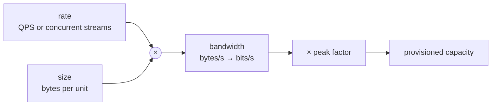
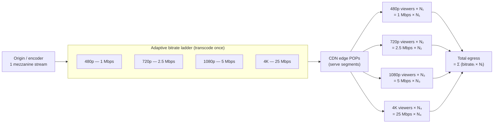
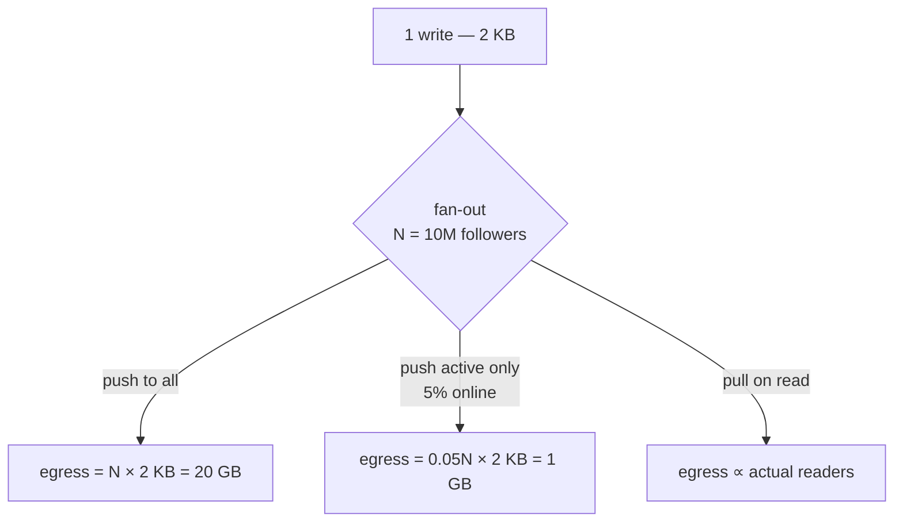
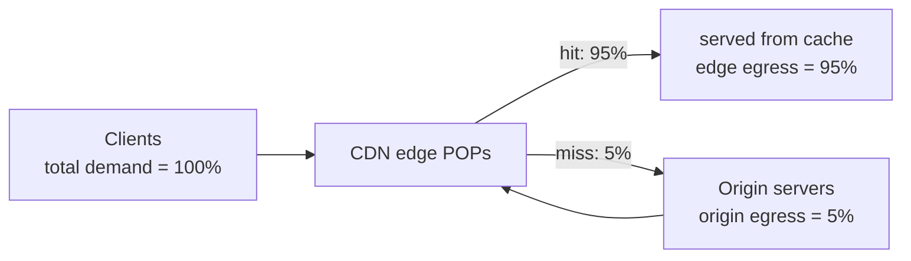

# Bandwidth Estimation — Middle

<!-- level-focus -->
At middle level, focus on this question:

> Where does **Bandwidth Estimation** belong in a maintainable component, and which trade-off selects the design?

Use the smallest realistic scenario that exposes the decision and its failure behavior.
Bandwidth is the rate at which bytes cross a boundary — a NIC, a load
balancer, a region link, a CDN edge. Unlike storage (a stock that
accumulates) bandwidth is a *flow*: it is consumed and immediately gone,
and it is provisioned for the **peak** you must survive, not the average
you happen to see. Getting this number wrong is expensive in both
directions: under-provision and requests queue, latency spikes, packets
drop; over-provision and you pay for egress capacity that sits idle. This
page makes the arithmetic explicit and applies it to the three workloads a
middle engineer is most often asked to size: an API, a video platform, and
a replication/backup stream.

## 1. The bandwidth identity

Every bandwidth estimate reduces to one product:

```
bandwidth = rate × size
```

- **rate** — requests, streams, messages, or rows per second (QPS, or
  concurrent stream count).
- **size** — bytes moved per unit of rate (per request, per second of
  video, per replicated row).

Two unit conventions cause most errors, so fix them up front:

- **bits vs bytes.** Network links and video bitrates are quoted in
  **bits per second** (Mbps, Gbps). Object sizes are in **bytes**.
  `1 byte = 8 bits`. A "5 Mbps" stream is `5 / 8 = 0.625 MB/s`.
- **directionality.** **Egress** (bytes leaving your servers, toward
  clients) is what cloud providers bill and what dominates read-heavy and
  media systems. **Ingress** (uploads, writes) is usually free to receive
  but still consumes NIC and LB capacity. Always state which direction a
  number refers to.

Decimal units (1 Mbps = 10⁶ bits/s, 1 GB = 10⁹ bytes) are standard for
networking and billing. We use decimal throughout.



---

## 2. Request and response sizing

For an API the response body is rarely the whole story. A single HTTP
request/response pair carries protocol overhead you must count:

| Component | Typical size (HTTP/1.1 + TLS) | Notes |
|---|---|---|
| Request line + method/path | 20–60 B | `GET /v1/users/42 HTTP/1.1` |
| Request headers | 400–800 B | Cookies, `Authorization`, `User-Agent`, `Accept` |
| Response status + headers | 200–500 B | `Content-Type`, `Cache-Control`, `Set-Cookie`, CORS |
| TLS record overhead | ~40 B/record | AEAD tag + record header; amortized over body |
| TCP/IP framing | 40 B/packet | 20 B IP + 20 B TCP per packet, not per request |
| **Body** | varies | The payload you actually care about |

The headers are the surprise. A 200-byte JSON body shipped with 700 bytes
of request headers and 400 bytes of response headers is **~1300 bytes on
the wire — 6.5× the payload.** For small, chatty APIs, headers, not data,
set the bandwidth bill.

Three levers move the wire size materially:

- **Cookies.** A fat session cookie (1–4 KB) rides on *every* request to
  the domain. This is pure repeated overhead; scope cookies narrowly or
  move to a token in an `Authorization` header sent only where needed.
- **Compression.** `gzip`/`br` on responses ≥ ~1 KB typically cut JSON to
  **20–30%** of raw size (it is highly repetitive). Compression applies to
  the **body**, not headers — HTTP/2 HPACK / HTTP/3 QPACK compress headers
  separately and dramatically (repeated headers cost a few bytes after the
  first request on a connection).
- **Encoding.** JSON is verbose. The same record in Protobuf or Avro is
  commonly **40–60% smaller** before compression because it drops field
  names and quotes and packs integers.

| Format | Relative size (typical record) | When it wins |
|---|---|---|
| JSON (uncompressed) | 1.0× (baseline) | Debuggability, browser-native |
| JSON + gzip | 0.25–0.35× | Public APIs, ≥1 KB bodies |
| Protobuf | 0.4–0.6× | Internal RPC, high QPS |
| Protobuf + gzip | 0.2–0.35× | Mobile, bandwidth-constrained |
| Avro / columnar | 0.3–0.5× | Bulk data, analytics, replication |

Rule of thumb: count **request headers + response headers + body**, then
apply your compression ratio to the body only. For HTTP/2+ on a warm
connection, header cost collapses to near-zero after the first exchange.

---

## 3. Worked estimate — a JSON API

A user-timeline API serves **50,000 QPS** at peak. Each response is a
JSON list averaging **8 KB** uncompressed; requests carry **0.8 KB** of
headers (including a session cookie); responses add **0.4 KB** of headers.
We serve `br` compression on bodies at a **0.3×** ratio.

**Per request, on the wire:**

```
request    = 0.8 KB headers + ~0.1 KB body        = 0.9 KB
response   = 0.4 KB headers + (8 KB × 0.3 body)   = 0.4 + 2.4 = 2.8 KB
total      ≈ 3.7 KB per request
```

**Egress (response) bandwidth at peak** is what we bill and provision:

```
egress = 50,000 req/s × 2.8 KB = 140,000 KB/s = 140 MB/s
       = 140 MB/s × 8 = 1,120 Mbps ≈ 1.12 Gbps
```

**Ingress (request) bandwidth:**

```
ingress = 50,000 × 0.9 KB = 45,000 KB/s = 45 MB/s = 360 Mbps
```

**Observations.**

- Without compression the response body alone would be
  `50,000 × 8 KB = 400 MB/s = 3.2 Gbps`. Compression saves ~2.2 Gbps of
  egress — directly proportional to the bill.
- The 0.4 KB of response headers contributes
  `50,000 × 0.4 KB = 20 MB/s = 160 Mbps` — more than 10% of egress, paid
  on every single response. Trimming `Set-Cookie` and verbose
  `Cache-Control` here is real money.
- A single 25 GbE NIC (≈ 25 Gbps usable ~20 Gbps) comfortably handles
  1.12 Gbps, but a fleet of LBs fronting this must aggregate egress —
  size the LB tier on the *sum* across instances, plus peak factor.

---

## 4. Media and streaming bandwidth

Video is the dominant bandwidth case in modern systems by orders of
magnitude. The unit is not "requests per second" but **concurrent
streams**, each consuming a continuous **bitrate** for as long as it
plays. Bitrate is set by resolution, codec, and frame rate.

| Resolution | H.264 (AVC) | H.265 / VP9 | AV1 | Notes |
|---|---|---|---|---|
| 480p (SD) | 1.0–1.5 Mbps | 0.6–0.9 Mbps | 0.5 Mbps | Mobile, low-bandwidth |
| 720p (HD) | 2.5–4 Mbps | 1.5–2.5 Mbps | 1.2 Mbps | Default mobile HD |
| 1080p (Full HD) | 4.5–6 Mbps | 3–4.5 Mbps | 2.5 Mbps | **~5 Mbps** is the planning number |
| 1440p (2K) | 9–12 Mbps | 6–9 Mbps | 5 Mbps | Desktop |
| 4K (UHD, ~25 Mbps) | 20–35 Mbps | 12–20 Mbps | 10–15 Mbps | **~25 Mbps** planning number |
| 4K HDR / high FPS | 40–60 Mbps | 25–40 Mbps | 18–28 Mbps | Premium tiers |

Newer codecs (H.265, VP9, AV1) deliver the same perceptual quality at
**40–50% lower bitrate** than H.264 — but at higher encode cost and with
device-support caveats. Picking the codec *is* a bandwidth decision.

The headline arithmetic every engineer should have memorized:

```
1 stream @ 1080p (5 Mbps)            = 5 Mbps
1,000 concurrent 1080p streams       = 5 Gbps
1,000,000 concurrent 1080p streams   = 5,000,000 Mbps = 5 Tbps
1,000,000 concurrent 4K streams      = 25 Tbps
```

A million concurrent 1080p viewers is **5 Tbps of sustained egress** —
far beyond any single datacenter's external links, which is precisely why
video is delivered from CDNs, not origin (see §8).



The key insight from the diagram: total media egress is a **weighted sum
across the bitrate ladder**, `Σ (bitrateᵢ × viewersᵢ)`, not a single
resolution times a single count. Most viewers sit on mid-tiers because
adaptive bitrate (ABR) drops them to fit their connection; sizing on "all
4K" overshoots badly, while sizing on "all 480p" undershoots.

---

## 5. Worked estimate — a video platform

A live-event platform expects **2,000,000 concurrent viewers** at the
peak moment. From historical ABR data the resolution mix is:

| Tier | Bitrate | Share | Concurrent viewers | Egress |
|---|---|---|---|---|
| 480p | 1 Mbps | 20% | 400,000 | 400 Gbps |
| 720p | 2.5 Mbps | 35% | 700,000 | 1,750 Gbps |
| 1080p | 5 Mbps | 35% | 700,000 | 3,500 Gbps |
| 4K | 25 Mbps | 10% | 200,000 | 5,000 Gbps |
| **Total** | — | 100% | 2,000,000 | **10,650 Gbps ≈ 10.65 Tbps** |

**Aggregate peak egress ≈ 10.65 Tbps.** Two sanity checks:

- A naive "2M × 5 Mbps (assume all 1080p)" gives 10 Tbps — close, because
  the 4K minority pulls the weighted average back up near 1080p. The
  blended average bitrate here is `10,650 / 2,000 = 5.3 Mbps/viewer`.
- This must be served from **CDN edge**, distributed across hundreds of
  POPs. No origin serves 10 Tbps. Origin only feeds each edge POP one copy
  of each ladder rung (see §8) — for live, origin egress is roughly
  `POP_count × ladder_bitrate_sum`, e.g. `300 POPs × 33.5 Mbps ≈ 10 Gbps`,
  a thousand-fold reduction.

**Daily data volume**, if the peak holds for a 3-hour event:

```
peak egress  = 10.65 Tbps = 10,650 / 8 = 1,331 GB/s
3 hours      = 1,331 GB/s × 3 × 3,600 s ≈ 14.4 PB egress for the event
```

At a representative CDN egress price of ~$0.02/GB this single event's
delivery is `14.4 × 10⁶ GB × $0.02 ≈ $288,000` — which is why codec
choice (AV1 could cut this ~40%) and cache efficiency are first-order
business levers, not micro-optimizations.

---

## 6. Fan-out bandwidth

Fan-out is the trap that turns a small write into a large egress bill: one
inbound event is **replicated to N destinations**, multiplying outbound
bandwidth by N. It shows up in notifications, chat, social feeds, and
cross-region replication.

**Example — a notification fan-out.** A "celebrity" account with
**10,000,000 followers** posts. The post is 2 KB. If we push it to every
follower's device/connection:

```
egress = 10,000,000 × 2 KB = 20,000,000 KB = 20 GB per post
```

One 2 KB write became **20 GB of egress** — a 10-million-fold
amplification. If 100 such accounts each post during a busy minute:

```
100 posts × 20 GB = 2,000 GB = 2 TB in one minute
≈ 2,000 GB / 60 s = 33.3 GB/s = 267 Gbps sustained
```

The fan-out factor — not the original write size — dominates. Mitigations
that reduce the multiplier:

- **Fan-out on read (pull)** for high-follower accounts: store once,
  let followers fetch on demand; egress now tracks *active* readers, not
  total followers.
- **Hybrid push/pull:** push to active/online users, pull for the long
  tail. Most followers are offline at any instant.
- **Multicast / pub-sub edges:** replicate once per region or per POP,
  then fan out locally, so the expensive long-haul link carries one copy.



Cross-region replication is the same shape: a write replicated to 3
regions multiplies inter-region egress by 3 (and inter-region egress is
billed at premium rates).

---

## 7. Peak vs average and burst

You provision for peak, not average. Three numbers describe the curve:

- **Average** — total bytes over a period ÷ the period. Useful for cost
  (you pay roughly for the average × time) and for capacity planning of
  background work.
- **Peak** — the highest sustained rate over a short window (often the
  busy-hour or the per-second max). NICs, LBs, and links must carry this.
- **Burst** — sub-second spikes above peak (a flash event, a cache flush,
  a thundering-herd retry storm).

Define the **peak-to-average ratio** (PAR):

```
peak = average × peak_factor
```

Typical peak factors by workload:

| Workload | Peak factor (peak ÷ average) | Driver |
|---|---|---|
| Internal batch / replication | 1.2–1.5× | Smooth, schedulable |
| Steady B2B API | 2–3× | Business-hours concentration |
| Consumer web/app | 3–5× | Evening prime-time |
| Live event / launch | 10–50× | Synchronized arrival |
| Viral / breaking news | 100×+ | Unbounded; needs autoscale + shed |

If the timeline API of §3 averages 20,000 QPS but peaks at 50,000 QPS, its
peak factor is 2.5×. Provisioning on the 20,000 average would drop ~60% of
peak traffic. Always size NIC/LB/CDN capacity on **peak × headroom**
(commonly 1.3–1.5× extra for burst and failover), and use **autoscaling +
load shedding + rate limiting** to bound the unbounded tail rather than
provisioning statically for it.

---

## 8. CDN offload — origin vs edge

A CDN caches responses at edge POPs close to users. The decisive metric is
the **cache-hit ratio (CHR)**: the fraction of requested bytes served from
edge cache without touching origin. Offload flips the bandwidth burden
from your origin to the CDN's edge network.

```
origin_egress = total_egress × (1 − CHR)
edge_egress   = total_egress × CHR
```

A **95% hit ratio** means **origin serves only 5% of bytes**; the edge
serves the other 95%.



**Worked offload calc.** A static-asset + API system has **10 Tbps** of
total client-facing egress demand at peak.

| Cache-hit ratio | Origin egress (× 10 Tbps) | Edge egress |
|---|---|---|
| 0% (no CDN) | 10 Tbps | 0 |
| 80% | 2 Tbps | 8 Tbps |
| 95% | **500 Gbps** | 9.5 Tbps |
| 99% | **100 Gbps** | 9.9 Tbps |

Going from 80% to 95% CHR cuts origin egress from 2 Tbps to 500 Gbps — a
**4× reduction in origin capacity** from a 15-point CHR improvement,
because origin load scales with `(1 − CHR)` and that term shrinks fast.
The last few points of CHR are the most valuable: 95% → 99% is another 5×
on origin. This non-linearity is why CDN tuning (longer TTLs, cache-key
normalization, `stale-while-revalidate`, tiered/origin-shield caching)
pays off so steeply.

**Caveats.**

- **Cacheability gates CHR.** Personalized, authenticated, or rapidly
  changing responses cache poorly. Separate static (highly cacheable) from
  dynamic (low CHR) and compute offload per class — don't apply one CHR to
  everything.
- **Cold cache and invalidation** cause origin spikes (a deploy that busts
  cache can momentarily push CHR toward 0 — size origin for that
  worst-case burst, or use staggered/soft purges).
- **Origin shield** (a mid-tier cache between edge POPs and origin)
  collapses many edge misses into one origin fetch, protecting origin
  during cold-cache events.

---

## 9. Worked estimate — a replication stream

A primary database streams its write-ahead log (WAL) to replicas and to a
backup target. Replication bandwidth is sized from the **write rate**, not
the read rate.

**Given:**

- Write rate: **40,000 writes/s** at peak.
- Average serialized change record (row + WAL framing): **1.5 KB**.
- Replication targets: **2 same-region replicas + 1 cross-region**.

**Per-target stream:**

```
per_stream = 40,000 × 1.5 KB = 60,000 KB/s = 60 MB/s = 480 Mbps
```

**Total replication egress from the primary** (fan-out factor 3):

```
total = 3 × 480 Mbps = 1,440 Mbps ≈ 1.44 Gbps
of which cross-region = 480 Mbps (billed at premium inter-region rate)
```

**Daily WAL / backup volume** (sustained near peak, say 16 active hours):

```
1 stream × 60 MB/s × 16 h × 3,600 s ≈ 3.46 TB/day per stream
```

**Optimizations that cut this stream:**

- **Compression** of the WAL stream (LZ4/zstd) typically yields **2–4×**
  on row data, dropping per-stream egress from 480 Mbps to ~120–240 Mbps.
- **Logical vs physical replication:** logical replication of only changed
  columns can be far smaller than shipping full physical pages — or far
  larger if it re-serializes whole rows; measure your workload.
- **Cascading replicas:** have the cross-region replica feed *its* local
  replicas, so the expensive long-haul link carries the stream **once**
  instead of N times (the multicast pattern from §6 applied to data).
- **Backups** should ride **incremental/changed-block** diffs after the
  initial full copy; a nightly full re-copy of a 10 TB database is 10 TB
  of egress, while a 2%-daily-change incremental is ~200 GB.

---

## 10. Checklist and pitfalls

A repeatable sizing procedure:

1. **Identify each boundary** that bytes cross (client↔edge, edge↔origin,
   service↔service, region↔region) and size them *separately* — they have
   different rates, CHRs, and prices.
2. **State the direction** (egress vs ingress) for every number; bill and
   capacity follow direction.
3. **Compute `rate × size`** including protocol/header overhead, then
   apply realistic **compression** and **encoding** ratios to the body.
4. **Multiply by fan-out** wherever one input produces N outputs.
5. **Apply CDN offload** `(1 − CHR)` to get origin load, computed per
   cacheability class.
6. **Scale average → peak** with a workload-appropriate peak factor, then
   add **headroom** for burst and failover.
7. **Convert bytes/s ↔ bits/s** exactly once, at the end, and label units.

Common pitfalls:

- **Bits/bytes confusion** — an 8× error; the most frequent mistake.
- **Counting body only, ignoring headers** — undersizes chatty APIs and
  fan-out by a large factor.
- **Sizing on average, not peak** — drops traffic exactly when it matters.
- **Ignoring fan-out** — the single largest source of "where did all this
  egress come from?" surprises.
- **Assuming a single resolution for media** — size the ABR ladder as a
  weighted sum, not one bitrate × one count.
- **Treating CHR as uniform** — dynamic/personalized traffic caches poorly
  and quietly lands on origin.
- **Forgetting cross-region egress is premium-priced** — a fan-out that
  crosses regions multiplies both bandwidth and dollars.

*Next step:* [Senior level](senior.md)

---

## Apply it

1. Find a real component where **Bandwidth Estimation** affects an interface or dependency.
2. Write two plausible choices and the constraint that favors each one.
3. Make the smallest reversible change at that boundary.
4. Exercise the component alone, then exercise the integrated flow.
5. Keep the decision note with the evidence that selected the option.

## Verify your work

- A focused check proves the local behavior.
- An integrated check proves callers and dependencies still agree.
- Logs, traces, compiler output, or benchmarks expose the boundary.
- Reverting the change restores the previous behavior without unrelated edits.

## Review questions

- Which boundary is most affected by Bandwidth Estimation?
- What constraint would make you choose the alternative design?
- How would you isolate a local defect from an integration defect?
- What evidence shows that the change remains maintainable?
