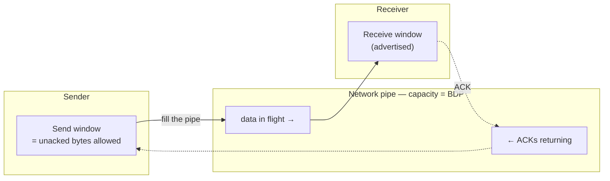
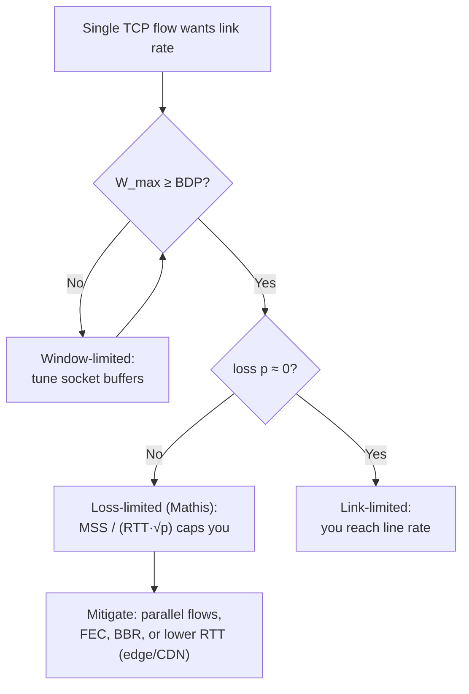
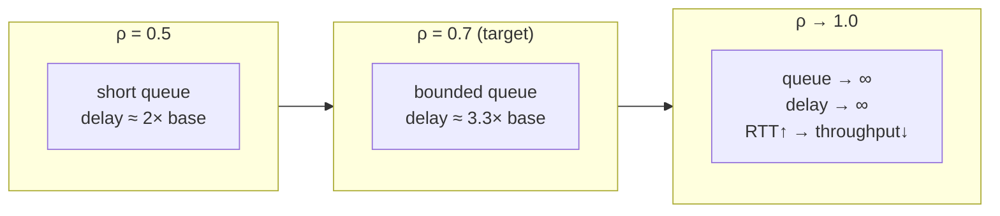
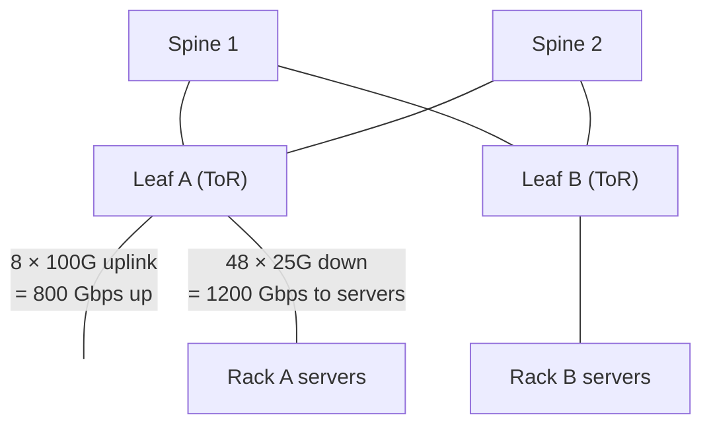

# Bandwidth Estimation — Theory and Formal Foundations

<!-- level-focus -->
At professional level, focus on this question:

> How should teams adopt and operate **Bandwidth Estimation — Theory and Formal Foundations** with measurable outcomes and limited coordination?

Use the smallest realistic scenario that exposes the decision and its failure behavior.
Bandwidth is the one capacity dimension that engineers most consistently get wrong, because the intuitive model — "a 10 Gbps NIC moves 10 gigabits per second" — is almost never true in practice. The deliverable throughput of a TCP flow is governed not by the link rate but by a control loop whose ceiling is set by latency, loss, window sizing, and the buffering of every hop in between. This document develops the formal model: the bandwidth-delay product, the window/RTT and Mathis throughput bounds, the unit and goodput corrections that separate marketing numbers from bytes on disk, the queueing reason a link cannot run at 100%, and the datacenter oversubscription that makes an advertised NIC rate a fiction at the fabric level.

## 1. The bandwidth-delay product

The **bandwidth-delay product** (BDP) is the amount of data that fits "on the wire" between two endpoints at any instant. It is the product of the bottleneck bandwidth and the round-trip time:

```
BDP (bits)  = bandwidth (bits/s) × RTT (s)
BDP (bytes) = BDP (bits) / 8
```

Physically, BDP is the volume of the pipe. If a path carries `B` bits per second and a bit takes `RTT` seconds to make the round trip, then `B × RTT` bits are in flight before the first acknowledgement returns. A sender that wants to keep the pipe full must have at least one BDP worth of unacknowledged data outstanding at all times — that is the **required in-flight window**.

This is the central insight: **throughput is bounded by how much data you are allowed to have unacknowledged, divided by how long it takes to get an acknowledgement.** If your window is smaller than the BDP, the sender stalls waiting for ACKs and the link sits idle for part of every RTT.



A worked BDP calculation. Consider a 1 Gbps path with a 60 ms RTT (a typical US coast-to-coast TCP connection):

```
BDP = 1 × 10^9 bits/s × 0.060 s = 6.0 × 10^7 bits
    = 60,000,000 / 8 = 7,500,000 bytes ≈ 7.5 MB
```

To saturate that 1 Gbps path you must keep **7.5 MB unacknowledged at all times**. The default TCP receive window on an untuned host is often 64 KiB (the classic 16-bit window field without scaling). 64 KiB / 7.5 MB means you can fill roughly 0.87% of the pipe — you would achieve about 8.7 Mbps on a 1 Gbps link. This is why TCP window scaling (RFC 7323) and OS autotuning of socket buffers exist: without them, long-fat networks are unusable.

### BDP reference table

The table below gives the BDP (the required in-flight window, in bytes) for common bandwidth × RTT combinations. Read it as "to run at this rate over this latency, you need at least this much window."

| Bandwidth | RTT 1 ms | RTT 10 ms | RTT 50 ms | RTT 100 ms | RTT 250 ms (satellite) |
|-----------|----------|-----------|-----------|------------|------------------------|
| 100 Mbps  | 12.5 KB  | 125 KB    | 625 KB    | 1.25 MB    | 3.125 MB               |
| 1 Gbps    | 125 KB   | 1.25 MB   | 6.25 MB   | 12.5 MB    | 31.25 MB               |
| 10 Gbps   | 1.25 MB  | 12.5 MB   | 62.5 MB   | 125 MB     | 312.5 MB               |
| 40 Gbps   | 5 MB     | 50 MB     | 250 MB    | 500 MB     | 1.25 GB                |
| 100 Gbps  | 12.5 MB  | 125 MB    | 625 MB    | 1.25 GB    | 3.125 GB               |

(Bytes here are base-10 MB = 10^6 bytes, since they derive from base-10 bit rates; see §6.) The diagonal trend is the key lesson: at 100 Gbps over a 100 ms intercontinental path you need **1.25 GB of in-flight data per flow**, far beyond any default buffer. A single TCP flow cannot fill such a pipe without enormous tuning; this is precisely why bulk transcontinental transfer uses many parallel flows or specialized protocols.

---

## 2. The window/RTT throughput bound

The most fundamental throughput limit follows directly from the BDP. A TCP sender may have at most `W` bytes outstanding (the effective window — the minimum of congestion window and the receiver's advertised window). Every `RTT` seconds, those `W` bytes are acknowledged and a new `W` bytes can be sent. Therefore:

```
Throughput ≤ W / RTT
```

This is an upper bound that holds regardless of link speed. It says throughput is a property of *window and latency*, not of the link rate, until the window is large enough to fill the link. The link rate becomes the binding constraint only when `W ≥ BDP`.

```
If W < BDP  →  throughput = W / RTT      (window-limited)
If W ≥ BDP  →  throughput = link rate    (link-limited)
```

A worked example. With the default 64 KiB window and a 60 ms RTT:

```
Throughput ≤ 65,536 bytes / 0.060 s = 1,092,266 bytes/s ≈ 8.74 Mbps
```

Identical to the BDP-fraction result above, as it must be. To reach 1 Gbps you would need:

```
W = throughput × RTT = (10^9 / 8) bytes/s × 0.060 s = 7.5 MB
```

The window-scaling option allows windows up to 1 GiB (a 14-bit shift of the 16-bit field), so the limit is removed in principle. In practice the limit becomes the OS socket-buffer size and its autotuning policy. The operational takeaway: **for any long-distance flow, check `net.ipv4.tcp_rmem` / `tcp_wmem` (or equivalent) against the BDP before blaming the network.**

---

## 3. The Mathis equation: throughput under loss

The window/RTT bound assumes the window can grow freely. In reality, loss-based congestion control (Reno, CUBIC in its Reno-compatible region) continuously probes for capacity and backs off on loss, so the *average* window is governed by the loss rate. The **Mathis equation** captures the steady-state throughput of a loss-driven additive-increase/multiplicative-decrease (AIMD) flow:

```
Throughput ≈ (MSS / RTT) × (C / √p)
```

where `MSS` is the maximum segment size (bytes), `RTT` is the round-trip time, `p` is the packet loss probability, and `C` is a constant near 1 (commonly taken as `√(3/2) ≈ 1.22` for the derivation with delayed ACKs absorbed into MSS). A frequently cited simplified form is:

```
Throughput ≈ MSS / (RTT × √p)
```

The derivation, in brief: a Reno flow grows its window by ~1 MSS per RTT and halves it on loss. Between two losses it sends roughly `W²/2` packets (the area under the sawtooth) and one of them is lost, so `p ≈ 2 / W²`, giving a peak window `W ≈ √(2/p)`. Average window is `(3/4)W`, and throughput is `avg_window × MSS / RTT`, which collapses to the form above with the constant folded in.

The structural consequences are stark:

- Throughput is **inversely proportional to RTT.** Doubling latency halves throughput.
- Throughput is **inversely proportional to the square root of loss.** Quadrupling the loss rate halves throughput.
- Throughput is **independent of link bandwidth** once the link exceeds what the loss/RTT regime permits. A faster link does nothing for a loss-limited Reno flow.

A worked under-loss calculation. Take MSS = 1460 bytes, RTT = 80 ms, loss probability `p = 0.0001` (0.01%):

```
√p = √0.0001 = 0.01
Throughput ≈ 1460 / (0.080 × 0.01) bytes/s
           = 1460 / 0.0008
           = 1,825,000 bytes/s
           ≈ 14.6 Mbps
```

Even at one lost packet in ten thousand, an 80 ms Reno flow tops out near **14.6 Mbps** — irrespective of whether the link is 1 Gbps or 100 Gbps. Raise loss to 0.1% (`p = 0.001`, `√p ≈ 0.0316`) and throughput falls to about 4.6 Mbps. This is the quantitative reason "the network feels slow" on a path that "has plenty of bandwidth": the bandwidth is there, but the loss/RTT product forbids a single flow from using it.

---

## 4. Why high-RTT and lossy links cap throughput

Combining §2 and §3 yields the operative ceiling for a single loss-based TCP flow:

```
Throughput ≈ min( link_rate, W_max / RTT, MSS / (RTT × √p) )
```

The flow runs at the *smallest* of three limits. The table below makes the dominance of RTT and loss concrete, using MSS = 1460 bytes and the Mathis bound, holding the link at a nominal 1 Gbps so the link is never the binding term.

| RTT    | p = 0.00001 (10⁻⁵) | p = 0.0001 (10⁻⁴) | p = 0.001 (10⁻³) | p = 0.01 (10⁻²) |
|--------|--------------------|-------------------|------------------|-----------------|
| 5 ms   | 738 Mbps           | 234 Mbps          | 74 Mbps          | 23 Mbps         |
| 20 ms  | 185 Mbps           | 58 Mbps           | 18 Mbps          | 5.8 Mbps        |
| 80 ms  | 46 Mbps            | 14.6 Mbps         | 4.6 Mbps         | 1.5 Mbps        |
| 200 ms | 18 Mbps            | 5.8 Mbps          | 1.8 Mbps         | 0.58 Mbps       |

Every cell is far below 1 Gbps. The only way to approach line rate with a loss-based flow is the top-left corner: very low RTT *and* very low loss. Read down any column — throughput falls linearly with RTT. Read across any row — throughput falls as `1/√p`, so it takes a 100× drop in loss to recover a single order of magnitude. A "lossy" path of even 1% is a hard cap in the single-digit Mbps for any wide-area RTT, no matter the underlying capacity.



---

## 5. Parallel connections and BBR as responses

The single-flow ceiling motivates two distinct engineering responses.

**Parallel connections.** Running `N` independent TCP flows over the same path multiplies the aggregate window by `N`. Aggregate throughput becomes roughly `N × MSS / (RTT × √p)` — each flow experiences its own sawtooth, and they fill the pipe collectively even when no single one can. This is why download accelerators, `aria2c -x16`, HTTP/1.1 with 6 connections per origin, and tools like GridFTP exist. The cost: parallel flows are aggressive toward other traffic (they grab more than their fair share of a shared bottleneck), and `N` is bounded by the BDP — once `N × W` exceeds the BDP you simply fill the pipe and adding flows only adds queueing.

**BBR (Bottleneck Bandwidth and Round-trip propagation time).** BBR abandons loss as the congestion signal entirely. Instead it models the path's two physical invariants — the bottleneck bandwidth (`BtlBw`, measured as the maximum delivery rate) and the minimum RTT (`RTprop`, the round-trip with empty queues) — and paces sending at `BtlBw` while keeping in-flight near `BtlBw × RTprop` (the BDP). Because it does not collapse its window on every random packet drop, BBR is largely immune to the `1/√p` penalty of the Mathis regime, which is why it dramatically outperforms CUBIC on long, slightly-lossy paths.

| Approach           | Congestion signal      | Behavior under random loss          | Fairness / cost                            | Best fit                                  |
|--------------------|------------------------|-------------------------------------|--------------------------------------------|-------------------------------------------|
| Reno / CUBIC       | Packet loss (AIMD)     | Collapses per Mathis `1/√p`         | RTT-fair-ish; well-behaved                 | Low-loss LAN / short-RTT paths            |
| Parallel TCP (N×)  | Loss, per flow         | Aggregate `N×` recovers throughput  | Aggressive; starves single flows           | Bulk transfer where you control both ends |
| BBR / BBRv2        | Modeled BtlBw + RTprop | Resilient — ignores non-queue loss  | Can be unfair to CUBIC; can bloat queues   | High-RTT, lossy WAN; video; CDN backbones |

The unifying principle: all three are attempts to keep one BDP of data in flight without letting a loss-based control loop strangle the window below `BDP`.

---

## 6. Bits, bytes, and base-10 vs base-2

Bandwidth estimation produces wrong answers by an order of magnitude when units are confused. Two independent confusions stack:

**Bits vs bytes.** Network rates are quoted in **bits** per second; storage and application payloads are in **bytes**. The factor is 8. A "1 Gbps" link delivers at most `10^9 / 8 = 125 × 10^6 bytes/s = 125 MB/s`. Forgetting the 8× is the single most common estimation error.

**Base-10 (SI) vs base-2 (IEC).** Network and disk vendors use **base-10**: kilo = 10³, mega = 10⁶, giga = 10⁹. Memory and many OS tools use **base-2**: kibi = 2¹⁰ = 1024, mebi = 2²⁰, gibi = 2³⁰. The correct symbols are `kB/MB/GB` (base-10) versus `KiB/MiB/GiB` (base-2), though usage is sloppy in the wild.

| Quantity         | Symbol  | Value         | Domain                         |
|------------------|---------|---------------|--------------------------------|
| Gigabit (SI)     | Gb      | 10⁹ bits      | Link rates (e.g. 1 Gbps NIC)   |
| Gigabyte (SI)    | GB      | 10⁹ bytes     | Disk vendors, throughput specs |
| Gibibyte (IEC)   | GiB     | 2³⁰ = 1.0737×10⁹ bytes | RAM, `free`, many OS tools |
| Kibibyte (IEC)   | KiB     | 1024 bytes    | TCP windows, page sizes        |

The cumulative discrepancy: `1 GiB / 1 GB = 1.0737`, so base-2 is ~7.4% larger per giga, compounding to ~7.4% at the giga scale and ~10% at the tera scale. Worked conversion — how long to move 1 TiB over a clean 1 Gbps link?

```
1 TiB = 2^40 bytes = 1,099,511,627,776 bytes = 8,796,093,022,208 bits
1 Gbps = 10^9 bits/s
Time (ideal) = 8.796 × 10^12 / 10^9 = 8,796 s ≈ 2 h 26 min
```

Note that even this "ideal" number assumes 100% goodput, which §7 shows is impossible. A common mistake is to compute `1000 GB / 1 Gbps = 1000 s ≈ 17 min`, which is wrong by a factor of ~8.8 because it conflated bytes with bits *and* base-2 with base-10.

---

## 7. Goodput vs throughput: the overhead stack

**Throughput** is bits on the wire. **Goodput** is application payload bytes delivered, per unit time — what the user actually receives. The gap is consumed by protocol headers, retransmissions, and acknowledgement traffic, and it is structural, not noise.

Consider a standard Ethernet/IPv4/TCP stack with a 1500-byte MTU and no jumbo frames. Per packet:

```
Ethernet header + FCS + preamble + inter-frame gap ≈ 38 bytes (on the wire)
IPv4 header                                          = 20 bytes
TCP header (with timestamps option)                  ≈ 32 bytes
─────────────────────────────────────────────────────────────
Payload (MSS) per 1500-byte IP packet                = 1500 − 20 − 32 = 1448 bytes
```

The framing efficiency at the IP layer is `1448 / 1500 ≈ 96.5%`. Including the Ethernet framing on the wire (`1448` payload out of `1500 + 38 = 1538` wire bytes) gives `1448 / 1538 ≈ 94.1%`. So a perfectly clean 1 Gbps link delivers at most:

```
Max goodput = 1 Gbps × 0.941 ≈ 941 Mbps ≈ 117.6 MB/s
```

This matches the well-known "~941 Mbps is the real ceiling of gigabit Ethernet" figure. Jumbo frames (9000-byte MTU) push framing efficiency to ~99%, recovering roughly 5%. On top of framing, retransmissions subtract a further `~p` fraction of capacity, and TLS adds per-record overhead (~5–40 bytes per record plus the handshake). The goodput-to-link ratio for a real HTTPS download over a lossy WAN is commonly **70–90% of the already-reduced throughput**, and the Mathis ceiling of §3 may bind well below that.

The estimation rule: **always discount the advertised rate by framing first (~6–10% off), then apply the window/loss ceiling, then subtract retransmissions and TLS.** Quoting line rate as goodput overstates capacity by a compounding margin.

---

## 8. Link utilization and why 100% is unreachable

A link cannot be safely driven to 100% utilization, and the reason is queueing theory, not implementation slack. Network traffic arrives in bursts; a link serves packets one at a time. When the instantaneous arrival rate exceeds the service rate, packets queue. The mean queue length (and hence the latency added by buffering) grows nonlinearly with utilization `ρ`.

For an M/M/1 queue (Poisson arrivals, exponential service — a rough but standard model), the expected number waiting and the expected sojourn time blow up as `ρ → 1`:

```
Mean queue occupancy  E[N] = ρ / (1 − ρ)
Mean delay multiplier        = 1 / (1 − ρ)
```

| Utilization ρ | Delay multiplier 1/(1−ρ) | Mean items in system ρ/(1−ρ) | Practical reading            |
|---------------|--------------------------|------------------------------|------------------------------|
| 0.50          | 2.0×                     | 1.0                          | Comfortable                  |
| 0.70          | 3.3×                     | 2.3                          | Typical engineering target   |
| 0.80          | 5.0×                     | 4.0                          | Latency rising sharply       |
| 0.90          | 10.0×                    | 9.0                          | Buffers filling; bufferbloat |
| 0.95          | 20.0×                    | 19.0                         | Near-collapse latency        |
| 0.99          | 100.0×                   | 99.0                         | Effectively unusable         |

At 90% utilization, queueing delay is already 10× its unloaded value; at 99% it is 100×. Because TCP's RTT *includes* this queueing delay, pushing utilization up raises RTT, which by §2 and §3 *lowers* achievable throughput — a self-defeating spiral. This is the mechanism behind **bufferbloat**: oversized buffers let utilization climb while latency explodes. Consequently, capacity planners provision links to a target utilization — commonly **70%** for latency-sensitive traffic and up to 80–85% for bulk/elastic traffic with AQM (active queue management, e.g. CoDel/FQ-CoDel) holding the queue short. **Usable bandwidth ≈ 0.7 × link rate** is a defensible planning default; treating the full link rate as usable headroom is an error.



---

## 9. Datacenter oversubscription

Inside a datacenter the advertised NIC bandwidth is an upper bound that the fabric cannot deliver under broad load, because the network is intentionally **oversubscribed**. In a leaf-spine (Clos) topology, each top-of-rack (ToR / leaf) switch has *downlink* capacity to its servers and *uplink* capacity to the spine. The **oversubscription ratio** is downlink ÷ uplink.

Consider a ToR with 48 server ports at 25 Gbps (1200 Gbps of downlink) and 8 uplinks at 100 Gbps to the spine (800 Gbps of uplink):

```
Oversubscription ratio = 1200 Gbps (down) : 800 Gbps (up) = 1.5 : 1
```

A 1.5:1 ratio means that if every server in the rack tries to send to a server in a *different* rack simultaneously, only `1/1.5 ≈ 67%` of each server's NIC rate is deliverable across the fabric. A server advertising a 25 Gbps NIC may, under all-to-all cross-rack traffic, sustain only ~16.7 Gbps off-rack. Common designs run anywhere from 1:1 (non-blocking, expensive) to 3:1 or even 6:1 at the spine layer for cost reasons.



The estimation consequences:

- **Intra-rack (server-to-server, same ToR)** traffic is typically non-blocking — full NIC rate is available.
- **Inter-rack** traffic is throttled by the oversubscription ratio at the bottleneck tier; deliverable bandwidth = `NIC rate / oversubscription`.
- **Placement matters.** Co-locating chatty services (a service and its cache, replicas of a shard) in the same rack or availability zone avoids the oversubscribed uplink. Capacity models for shuffle-heavy workloads (MapReduce, distributed joins, ML all-reduce) must use the *fabric bisection bandwidth*, not the NIC rate.

A bisection-bandwidth check: for the rack above, the cross-rack capacity per server is `800 Gbps / 48 servers ≈ 16.7 Gbps`, not 25 Gbps. Sizing a distributed-shuffle job against the 25 Gbps NIC figure overestimates network capacity by 50%.

---

## 10. A staged worked estimation

Bring the pieces together for a concrete question: *can a single server stream a 1 TB dataset to a peer in another datacenter (RTT 40 ms, measured loss 0.05%) over its 10 Gbps NIC in under one hour, and what is realistic?*

**Stage 1 — link and unit baseline.**

```
NIC = 10 Gbps = 10^9 ÷ 8 × 10 = 1.25 × 10^9 bytes/s = 1.25 GB/s (base-10)
1 TB target (vendor base-10) = 10^12 bytes
Ideal time at full NIC = 10^12 / 1.25×10^9 = 800 s ≈ 13.3 min
```

**Stage 2 — framing/goodput discount.** Apply ~94% Ethernet framing efficiency:

```
Goodput ceiling = 1.25 GB/s × 0.94 ≈ 1.175 GB/s
Time at goodput ceiling = 10^12 / 1.175×10^9 ≈ 851 s ≈ 14.2 min
```

**Stage 3 — single-flow Mathis ceiling (MSS 1448, RTT 40 ms, p = 0.0005).**

```
√p = √0.0005 ≈ 0.02236
Throughput ≈ 1448 / (0.040 × 0.02236) bytes/s
           ≈ 1448 / 0.0008944
           ≈ 1,619,000 bytes/s ≈ 12.95 Mbps
```

A *single* loss-based TCP flow delivers only ~13 Mbps — the 10 Gbps NIC is irrelevant. Time for 1 TB on one flow: `10^12 / 1.62×10^6 ≈ 617,000 s ≈ 7.1 days`. The "under an hour" target is impossible single-flow.

**Stage 4 — required in-flight window (BDP) and the fix.**

```
BDP = 10^10 bits/s × 0.040 s = 4 × 10^8 bits = 50 MB in-flight needed
```

To hit line rate you must keep 50 MB unacknowledged *and* escape the Mathis penalty. Options: (a) parallel flows — to reach the goodput ceiling at ~13 Mbps/flow you need `1175 / 13 ≈ 90` flows, each with its own ~50/90 MB window; or (b) a BBR/BBRv2 sender, which paces at the measured bottleneck rate and ignores the 0.05% random loss, approaching the ~1.175 GB/s goodput ceiling with a single flow given a 50 MB+ socket buffer.

**Stage 5 — fabric reality.** If the egress path crosses a 3:1 oversubscribed spine and the WAN uplink is shared, deliverable cross-DC bandwidth may be a fraction of 10 Gbps. The realistic plan: ~85 Mbps usable from one default flow, ~1 Gbps+ with tuned BBR or tens of parallel flows, and a transfer time of **15–25 minutes** rather than the naive 13 minutes — bounded by goodput, the WAN bottleneck, and oversubscription, with the single-flow Mathis trap avoided.

---

## 11. Summary and estimation checklist

The recurring failure mode in bandwidth estimation is to treat the advertised link rate as deliverable throughput. The formal model corrects this through a chain of independent discounts, each of which can dominate:

- **BDP** sets the in-flight window you must sustain: `BDP = bandwidth × RTT`. If your socket buffer is smaller, you are window-limited at `W / RTT`, period.
- **Window/RTT bound:** `throughput ≤ W / RTT`. Latency, not link rate, governs an untuned flow.
- **Mathis bound:** `throughput ≈ MSS / (RTT × √p)`. Loss and RTT impose a single-flow ceiling independent of link capacity; this is why parallel flows and BBR exist.
- **Units:** divide bit rates by 8 for bytes; keep base-10 (GB) and base-2 (GiB) distinct (~7.4% per giga).
- **Goodput:** discount ~6–10% for framing, more for retransmits and TLS; gigabit Ethernet tops out near 941 Mbps.
- **Utilization:** queueing forbids 100%; plan to ~70% of link rate to keep latency bounded.
- **Oversubscription:** deliverable cross-rack bandwidth = `NIC rate / oversubscription ratio`; size shuffle workloads against bisection bandwidth, not the NIC.

A defensible single-flow capacity estimate is therefore:

```
usable ≈ min( 0.7 × link_rate / oversubscription,
              W_max / RTT,
              MSS / (RTT × √p) ) × framing_efficiency
```

When this number is unacceptably low, the levers are concrete: enlarge `W` (socket-buffer tuning), lower RTT (edge/CDN placement), lower `p` (FEC, cleaner paths, BBR), or raise `N` (parallel flows) — each maps directly to one term in the formula.


---

## Apply it

1. Define the user or business outcome that **Bandwidth Estimation — Theory and Formal Foundations** should improve.
2. Assign one owner for code, contracts, operations, and incidents.
3. Split delivery into reversible increments that produce evidence early.
4. Publish responsibilities, escalation paths, and compatibility windows.
5. Stop or expand only when the agreed measures support that decision.

## Verify your work

- Each increment has an owner, rollback path, and observable exit condition.
- Adoption, reliability, delivery time, and coordination cost are measured.
- Incident and migration exercises prove that responsibility is executable.
- The old path is removed only after telemetry proves it is unused.

## Review questions

- Which measurable outcome justifies investing in Bandwidth Estimation — Theory and Formal Foundations?
- Which team owns the full lifecycle and incident response?
- What reversible increment produces the earliest useful evidence?
- Which exit condition proves that migration or adoption is complete?
