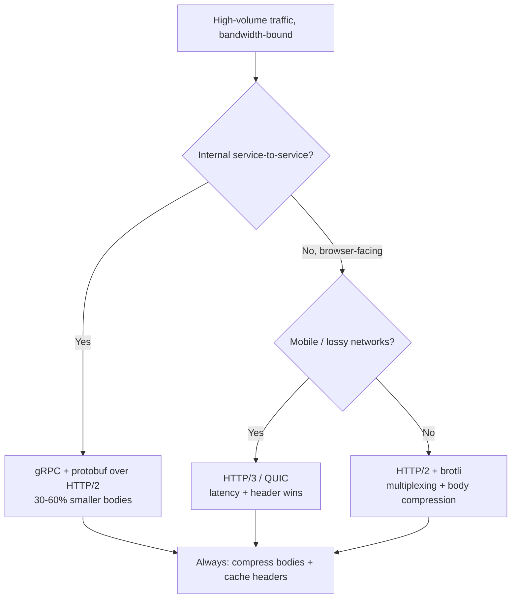
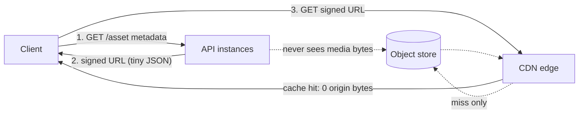

# Bandwidth Estimation — Senior

<!-- level-focus -->
At senior level, focus on this question:

> Which system invariant is affected by **Bandwidth Estimation** under failure, load, and change?

Use the smallest realistic scenario that exposes the decision and its failure behavior.
At the senior level, bandwidth estimation stops being a sizing exercise and becomes an **ownership decision**. A junior computes `bytes × QPS`. A middle engineer adds peak-to-average ratios and headroom. The senior engineer answers the question that actually matters to the business: *when bandwidth is the bottleneck, which lever do I pull, in what order, and how much does each one buy me?* This document is about converting an estimate into an action plan — and defending that plan when the egress bill arrives or the NIC saturates at 2 a.m.

## 1. When bandwidth is actually the bottleneck

Most engineers reach for "scale out" reflexively, but adding instances does nothing if each instance is already pinned on egress and the bytes are intrinsic to the workload. Before you spend the lever, confirm bandwidth is the constraint — not CPU, not connection count, not the database.

The tell-tale signatures of a **bandwidth-bound** service:

- Network egress (`tx_bytes/s`) is flat against a known ceiling while CPU sits at 30–50%.
- p99 latency rises with response *size*, not request *rate* — large responses queue behind the link.
- Adding replicas behind the load balancer does not improve throughput because each replica saturates its own NIC.
- The cloud bill is dominated by **data transfer out** line items, not compute.

Bandwidth becomes the bottleneck in a predictable set of workloads: media streaming and downloads, image-heavy feeds, data export/reporting APIs, log/telemetry shipping, backup and replication traffic, and chatty JSON APIs that ship far more bytes than the client renders. The discipline is the same in all of them: **find the byte source, then attack it at the cheapest layer.**

A useful framing — every byte you ship lands in one of three buckets, and each has a different cheapest lever:

| Byte source | Example | Cheapest first lever |
|---|---|---|
| Static / cacheable media | Images, video, JS/CSS bundles | CDN offload (don't serve from origin at all) |
| Compressible text | JSON, HTML, logs, API responses | Content compression (brotli/gzip) |
| Redundant / over-fetched | Fields the client ignores, full lists | Payload shaping (pagination, field selection) |

If you can't name which bucket your bytes are in, you are not ready to choose a lever.

## 2. The physical ceilings: NIC, instance, and link limits

Bandwidth is bounded by hardware long before it's bounded by your code. A single instance has a **NIC ceiling** and, in the cloud, an additional **per-instance bandwidth allocation** that is often *lower* than the raw NIC and is frequently a *burst-vs-baseline* number. Smaller instances are throttled to a baseline and only burst to the headline figure for a limited credit window.

The conversion every senior should have memorized: network speeds are quoted in **bits**, throughput in **bytes**. Divide by 8, then subtract ~5–10% for framing/TLS/TCP overhead.

| Link / instance class | Line rate | Theoretical max throughput | Realistic sustained (~90%) |
|---|---|---|---|
| 1 GbE NIC | 1 Gbps | 125 MB/s | ~112 MB/s |
| 10 GbE NIC | 10 Gbps | 1.25 GB/s | ~1.1 GB/s |
| 25 GbE NIC | 25 Gbps | 3.125 GB/s | ~2.8 GB/s |
| 100 GbE NIC | 100 Gbps | 12.5 GB/s | ~11 GB/s |
| Small cloud VM (e.g. 2 vCPU) | ~5 Gbps baseline (bursts higher) | ~625 MB/s | ~560 MB/s burst, far less sustained |
| Mid cloud VM (8–16 vCPU) | ~10–12.5 Gbps | ~1.25–1.5 GB/s | ~1.1–1.4 GB/s |
| Large cloud VM (32+ vCPU, network-optimized) | 25–100 Gbps | 3.1–12.5 GB/s | depends on placement group / ENA |

Three traps that bite teams in production:

1. **Burst credits expire.** A `t`/`e`-class burstable instance advertises "up to 5 Gbps" but sustains a fraction of that. A nightly export that runs for an hour will exhaust the credit and silently throttle to baseline — your transfer that "tested fine" for 5 minutes runs 4× slower in production.
2. **Egress is not symmetric with ingress.** Cloud providers meter and often cap *egress* (to the internet) far more aggressively than intra-region traffic, and bill it. A 100 GbE NIC does not mean 100 Gbps to the public internet.
3. **The NIC is shared.** Replication, health checks, log shipping, service mesh sidecars, and metrics scraping all consume the same NIC. Your application's usable egress is the NIC ceiling *minus* everything else co-resident on the box.

The senior takeaway: **always size against the per-instance cloud bandwidth allocation, not the datasheet NIC speed**, and always reserve a slice for non-application traffic.

## 3. The lever stack: what each fix buys you

When egress is the constraint, there is a canonical order to apply fixes, cheapest and highest-leverage first. The numbers below are typical, defensible reductions — your mileage varies with content type, but a senior should be able to quote these from memory and justify them.

| Lever | Mechanism | Typical egress reduction | Where it applies | Cost / caveat |
|---|---|---|---|---|
| **CDN offload** | Serve cacheable bytes from edge; origin sees only misses | **70–95%** of total egress for static/media-heavy traffic | Static assets, images, video, downloadable files | Cache-key discipline; invalidation; cost shifts to CDN bill (cheaper per GB) |
| **Brotli/gzip compression** | Entropy-code text on the wire | **3–10×** on JSON/HTML/JS (60–90% smaller) | Any text-based response | CPU cost; near-zero on already-compressed bytes (images, video, gzipped data) |
| **Better image codec** | WebP/AVIF vs JPEG/PNG | **25–50%** smaller at equal quality | User-facing images | Encode cost; client support (negotiate via `Accept`) |
| **Better video codec** | H.265/AV1 vs H.264 | **30–50%** smaller at equal quality | Video streaming/storage | Heavy encode cost; decode support |
| **Protocol: gRPC/protobuf vs JSON** | Binary, schema-driven encoding | **30–60%** smaller payloads + header compression | Service-to-service RPC | Tooling, schema management, debuggability |
| **HTTP/2 → HTTP/3 (QUIC)** | Header compression (HPACK/QPACK), multiplexing, 0-RTT | Modest bytes (header savings), large *latency* win on lossy links | All HTTP traffic, mobile especially | Header bytes, not body bytes — combine with body compression |
| **Pagination / field selection** | Don't send bytes the client ignores | **50–95%** when over-fetching is severe | List endpoints, wide objects | API design change; client coordination |

A critical mental model: **these levers compose multiplicatively.** Applying compression *after* CDN offload only matters for the bytes that still leave the origin. The art is sequencing them so each operates on the residual traffic the previous lever left behind.

## 4. Lever 1 — CDN: offload and edge termination

A CDN is the single highest-leverage egress lever because it doesn't make bytes smaller — it stops them leaving your origin at all. Every cache hit at the edge is a byte your NIC, your instance allocation, and your egress bill never see.

The metric to optimize is **offload ratio** = bytes served from edge ÷ total bytes requested. A well-tuned CDN on cacheable content reaches 90–98% offload. Origin egress drops to the miss traffic plus cache-fill — often a 10–30× reduction.

What makes content cacheable (and what destroys offload):

- **Stable, normalized cache keys.** Strip volatile query params (`?utm_*`, session tokens) from the cache key or you fragment one object into a million uncacheable variants.
- **Honest `Cache-Control`.** `public, max-age=...` with `immutable` for fingerprinted assets; `s-maxage` to let the edge cache longer than the browser.
- **Tiered caching.** Edge → regional shield → origin collapses concurrent misses into a single origin fetch, protecting origin egress during a cache-cold spike (a "thundering herd" of misses).
- **Stale-while-revalidate.** Serve slightly stale bytes from the edge while refreshing in the background — keeps origin egress flat even as content updates.

CDNs also absorb spikes. Edge capacity is the provider's problem, not your NIC's, so a viral event that would have melted a single 10 GbE origin is served from hundreds of edge POPs. The cost trade is real but favorable: CDN egress is typically cheaper per GB than cloud-origin egress, and you've converted a hard capacity ceiling into a billing line item.

## 5. Lever 2 — Compression: codecs and content encoding

Compression attacks the bytes the CDN couldn't offload — your dynamic, text-heavy responses.

**Content encoding (gzip / brotli)** for text on the wire:

- **gzip** is universal and cheap; ~3–4× on typical JSON.
- **brotli** (`Content-Encoding: br`) compresses text ~15–25% smaller than gzip and is supported by every modern browser. For static assets, pre-compress at the highest brotli level (11) at build time so you pay the CPU once; for dynamic responses, use a mid level (4–6) to balance CPU and ratio.
- **Negotiate, don't assume.** Respect `Accept-Encoding`; never re-compress already-compressed bytes (JPEG, PNG, MP4, gzipped payloads) — you'll burn CPU for ~0% gain or even grow the payload.

**Media codecs** attack the bytes compression can't touch (images and video are already entropy-dense):

- Images: serve **AVIF** or **WebP** with JPEG/PNG fallback, negotiated via the `Accept` header. AVIF is typically 30–50% smaller than JPEG at matched quality.
- Video: **H.265/HEVC** or **AV1** cut 30–50% off H.264 bitrate at equal perceptual quality; combine with adaptive bitrate (ABR) so you never ship a 4K stream to a phone on cellular.

Quantified intuition for a senior to carry: a 1 MB JSON response → ~150 KB with brotli (≈6.5×). A 400 KB hero JPEG → ~240 KB as WebP, ~200 KB as AVIF. Apply these across a feed and total egress halves before you've touched architecture.

## 6. Lever 3 — Protocol choice: HTTP/2, gRPC, HTTP/3

Protocol selection shifts both bytes and connection efficiency. The wins split into **header bytes**, **body encoding**, and **connection behavior** — keep them distinct.

- **HTTP/1.1 → HTTP/2.** HPACK header compression eliminates the repeated, verbose header blocks that dominate small-response APIs, and multiplexing removes head-of-line blocking at the application layer (many requests share one connection, killing the per-request TCP/TLS handshake tax). For an API issuing thousands of small calls, header compression alone is a meaningful egress reduction.
- **JSON → gRPC/protobuf.** Protobuf is a binary, schema-driven encoding: field names become tag numbers, integers use varint encoding, no whitespace or quoting. Payloads typically shrink 30–60% versus JSON, and the schema makes the wire format self-validating. The cost is tooling, generated stubs, and reduced human-readability — a fair trade for high-volume internal service-to-service traffic, a poor one for a public, browser-facing API.
- **HTTP/2 → HTTP/3 (QUIC).** QUIC runs over UDP, eliminates TCP head-of-line blocking (a lost packet no longer stalls *all* multiplexed streams), and offers 0-RTT resumption. The byte savings are mostly in headers (QPACK); the *real* win is latency and resilience on lossy/mobile networks. Pair it with body compression — HTTP/3 shrinks headers, not your 1 MB JSON body.

The decision flow:



The senior point: protocol choice is rarely a single egress silver bullet — it's a multiplier on top of compression and CDN. Choose it for the traffic *shape* (many small calls → HTTP/2 headers; internal RPC → protobuf; mobile → QUIC), not as a substitute for the body-level levers.

## 7. Lever 4 — Payload shaping: pagination and field selection

The cheapest byte is the one you never serialize. Over-fetching is endemic: an endpoint returns 40 fields, the client renders 4; a list endpoint returns 10,000 rows, the UI shows 20. This is **read amplification** — your egress is a multiple of what the client actually needs.

The levers:

- **Pagination.** Cursor-based (keyset) pagination caps response size and protects against deep-offset blowups. A list endpoint that returned the full collection now returns a bounded page — often a 50–95% egress cut for list-heavy traffic.
- **Field selection / sparse fieldsets.** Let clients request only what they render (`?fields=id,name,thumb`, GraphQL selection sets, protobuf `FieldMask`). A mobile client fetching a feed shouldn't pull full-resolution metadata it will never display.
- **Projection at the source.** Don't `SELECT *` and serialize the whole row — project in the query so the bytes never enter the application in the first place. This saves database bandwidth and serialization CPU, not just egress.
- **Avoid the N+1-of-bytes.** Embedding full nested objects on every list item multiplies payload; return references or thumbnails and let the client fetch detail on demand.

Field selection and pagination are API-design changes, so they're slower to ship than flipping on compression — but on a chronically over-fetching endpoint they deliver the largest *structural* reduction, and unlike compression they cost zero CPU at request time.

## 8. Separating media from API traffic

A recurring senior-level architecture decision: **never let large binary objects flow through your application's egress path.** Media (images, video, file downloads, exports) and API traffic (JSON, RPC) have opposite profiles — media is large, cacheable, and CDN-friendly; API responses are small, dynamic, and personalized. Serving both from the same instances means your media bytes starve your API of NIC headroom.

The pattern: push media to **object storage (S3/GCS/Blob) fronted by a CDN**, and have the application serve only a **signed URL or redirect**. The bytes flow client → CDN → object store, entirely bypassing your application instances.



The same logic applies to uploads: issue a **pre-signed upload URL** so clients write directly to object storage instead of streaming gigabytes through your API tier. Your application handles the metadata transaction (kilobytes); the storage layer handles the payload (gigabytes). This single separation is often the difference between a 10 GbE origin that's perpetually saturated and one that's idle on bandwidth.

## 9. Sizing the pipe and choosing headroom

Once you know the byte volume and which levers you'll apply, size the pipe against *post-lever, peak* egress — not average, not pre-optimization.

The sizing recipe:

1. **Start from peak, not average.** Compute peak egress = (peak QPS × post-compression response size) + media (if not offloaded). Use the measured or estimated peak-to-average ratio (commonly 2–5× for consumer traffic; spikier for event-driven).
2. **Subtract co-resident traffic.** Replication, log/metrics shipping, mesh sidecars, health checks — reserve a slice of the NIC.
3. **Apply headroom.** Run a saturated NIC and latency collapses (queuing). Target **50–70% sustained utilization** of the per-instance allocation so spikes and retries have room. Above ~80% sustained, you're one traffic burst from incident.
4. **Divide to get instance count.** `instances = ceil(peak_egress / (per_instance_allocation × target_utilization))`. Note this is the *bandwidth* instance count — take the max of this and your CPU/memory-derived count.
5. **Validate against burst credits.** If you chose burstable instances, confirm sustained (not burst) bandwidth covers steady-state load.

The headroom decision is a senior trade-off: more headroom = more cost, less risk of latency collapse under spike; less headroom = cheaper, but a thinner margin before queuing. Tie it to your SLO — a latency-sensitive p99 SLO demands lower utilization than a bulk-throughput batch job that can tolerate queuing.

## 10. Worked example: a service hitting its egress ceiling

**The situation.** A product feed API runs on instances with a **10 Gbps per-instance allocation (~1.1 GB/s usable)**. Each feed response is **800 KB of uncompressed JSON** that embeds **base64-inlined thumbnail images**. At peak, the service serves **2,000 req/s**.

**The diagnosis.** Peak egress demand:

```
2,000 req/s × 800 KB = 1,600 MB/s = 1.6 GB/s
```

That's **~1.45× a single instance's usable allocation** — a single box can't serve it, and even across two boxes you're running ~73% utilization with zero headroom for spikes. CPU is at 35%; this is unambiguously bandwidth-bound. Naively, you'd scale to 3–4 instances purely for bandwidth. Instead, apply the lever stack.

**Fix 1 — Pull media out of the response (separation + CDN).** The base64 thumbnails are ~500 KB of the 800 KB. Replace them with CDN URLs; clients fetch images from the edge. JSON body drops to ~300 KB, and those image bytes now leave from the CDN, not the origin.

```
2,000 × 300 KB = 600 MB/s   (was 1,600 MB/s)
→ 62.5% egress reduction
```

**Fix 2 — Brotli-compress the JSON.** 300 KB of JSON → ~50 KB at brotli level 5 (~6×). CPU rises modestly (still well under ceiling).

```
2,000 × 50 KB = 100 MB/s   (was 600 MB/s)
→ another 83% reduction
```

**Fix 3 — Field selection.** The mobile client renders 8 of the 30 fields. A `fields=` parameter on the mobile path cuts the *uncompressed* JSON roughly in half before compression, so the post-brotli payload drops to ~30 KB for that segment. Blending mobile (60% of traffic) and full clients:

```
Effective peak egress ≈ 70 MB/s
```

**The result.**

| Stage | Per-response (origin) | Peak origin egress | Reduction (cumulative) |
|---|---|---|---|
| Baseline | 800 KB | 1,600 MB/s | — |
| + Media → CDN | 300 KB | 600 MB/s | 62.5% |
| + Brotli on JSON | 50 KB | 100 MB/s | 93.75% |
| + Field selection (blended) | ~35 KB | ~70 MB/s | ~95.6% |

Origin egress fell from **1.6 GB/s to ~70 MB/s — a ~23× reduction** — without adding a single instance for bandwidth. The service now runs comfortably on *one* instance at ~6% of its allocation, the image bytes are served cheaply from the edge, and you have enormous headroom for growth. The CDN bill rose, but per-GB CDN egress is cheaper than origin egress, and you eliminated the capacity ceiling entirely. **This is what owning a bandwidth estimate looks like: a stack of composable fixes, each quantified, applied cheapest-first.**

## 11. Senior judgment checklist

Before declaring a bandwidth plan done, a senior confirms:

- **Confirmed bandwidth-bound** — egress flat against a ceiling while CPU/memory have headroom. Don't pull egress levers on a CPU-bound service.
- **Sized against the cloud per-instance allocation**, not the datasheet NIC — and accounted for burst-vs-baseline and burst-credit exhaustion.
- **Reserved NIC headroom** for replication, telemetry, mesh, and health-check traffic.
- **Media separated** from API traffic and pushed to object store + CDN (downloads *and* uploads via signed URLs).
- **Cacheable bytes offloaded** to a CDN with disciplined cache keys and a measured offload ratio (target 90%+).
- **Text compressed** with brotli (pre-compressed for static, mid-level for dynamic), respecting `Accept-Encoding`, never double-compressing.
- **Protocol matched to traffic shape** — protobuf for internal RPC, HTTP/2 for header-heavy chatty APIs, HTTP/3 for mobile/lossy.
- **Over-fetching eliminated** via pagination and field selection — the largest structural cut, zero request-time CPU.
- **Levers sequenced** so each operates on the residual the previous left behind, and the cumulative reduction is quantified.
- **Headroom tied to SLO** — sustained utilization at 50–70%, lower for latency-sensitive paths.
- **Cost trade made explicit** — egress saved vs. CDN/encode/CPU cost, with the per-GB economics named.

A senior doesn't just produce a smaller number. They produce a *defensible, ordered plan* that survives the next traffic spike, the next product launch, and the next finance review of the egress bill.

---

*Next step:* [Professional level](professional.md)

---

## Apply it

1. State the system invariant that **Bandwidth Estimation** must protect.
2. Mark ownership, state, and failure propagation at each boundary.
3. Compare two designs under load, dependency failure, and future change.
4. Define recovery and compatibility behavior before implementation.
5. Test the riskiest assumption with a focused experiment.

## Verify your work

- The experiment supports the design with evidence, not preference.
- Failure injection shows the blast radius and recovery path.
- Compatibility checks cover old and new callers or data.
- Operational signals reveal invariant violations and recovery progress.

## Review questions

- Which invariant must remain true when Bandwidth Estimation fails?
- Where should recovery responsibility live, and why?
- Which assumption deserves an experiment before implementation?
- How can the design evolve without changing every consumer at once?
