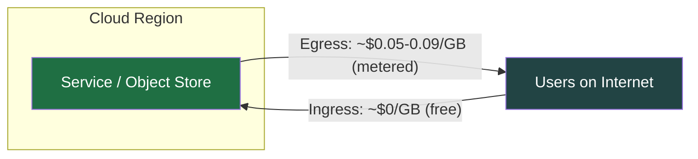
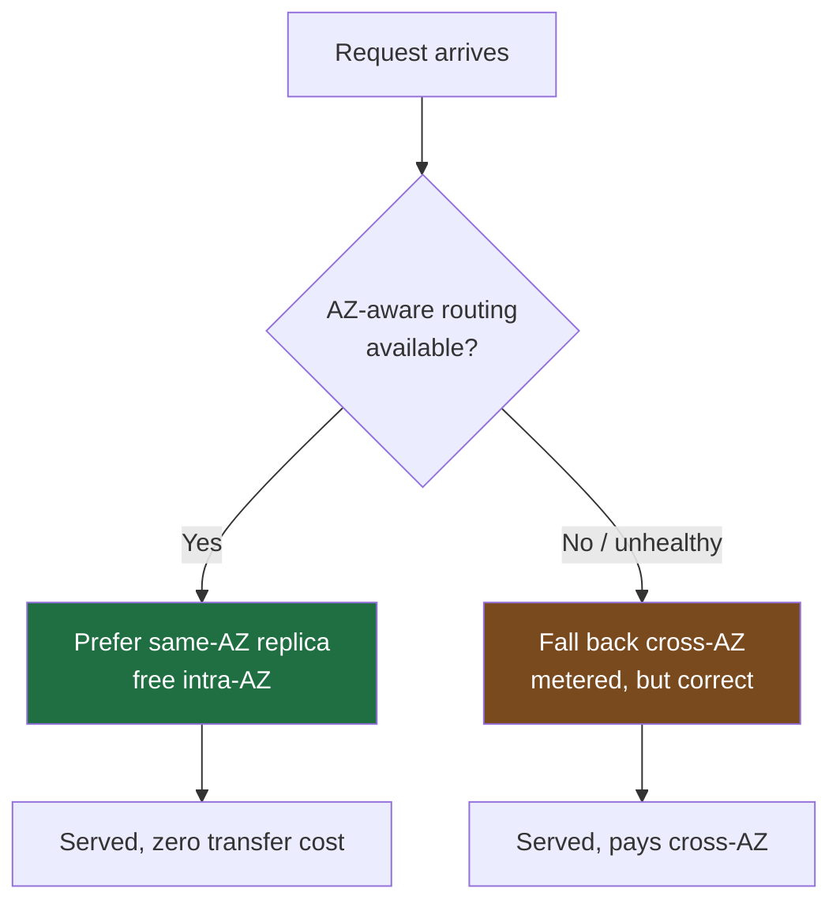
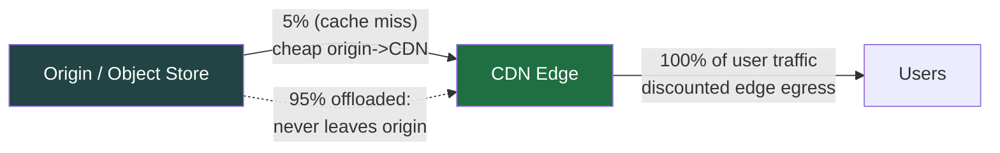
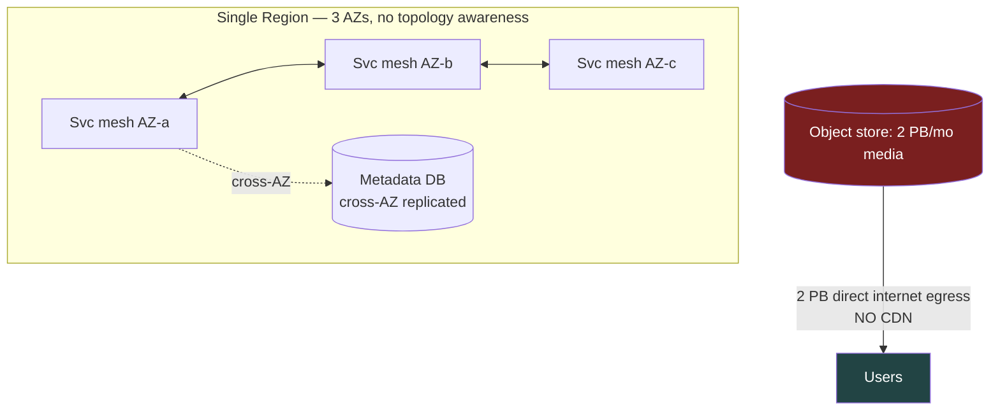
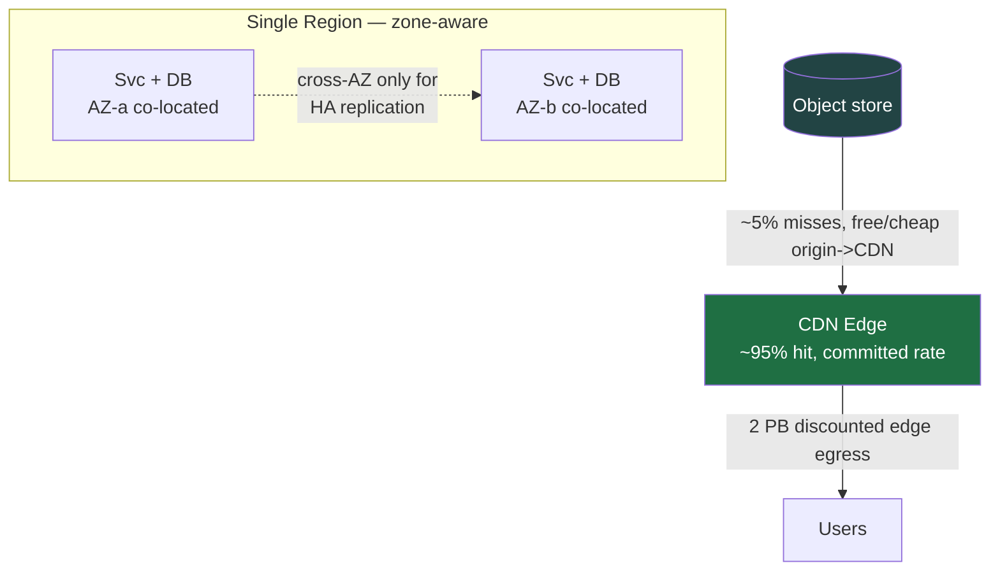
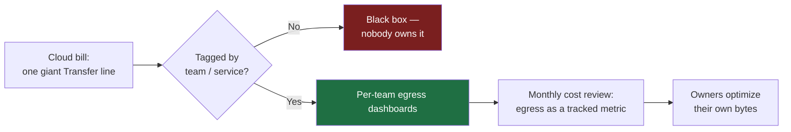

# Bandwidth Estimation — Staff / Principal Level

At junior and senior levels, bandwidth estimation answers a *technical* question:
will the pipe, the NICs, and the load balancers carry the traffic? At Staff and
Principal level the question becomes *economic and organizational*: who pays for
every gigabyte that leaves a machine, why is the finance team surprised every
quarter, and which architecture decisions are silently locking the company into a
single cloud vendor. Bandwidth — specifically **egress** — is one of the few
infrastructure costs that scales linearly with success and is almost invisible
until the bill arrives. This document treats bandwidth as a first-class
cost-and-strategy concern, not a throughput sizing exercise.

> **Pricing note:** every dollar figure below is **illustrative** and rounded for
> reasoning. Cloud transfer pricing changes, varies by region, and is often
> negotiable at scale. Treat numbers as orders of magnitude and **verify current
> published rates** before putting them in a cost model or a contract.

---

## Table of contents

1. [The egress asymmetry: why leaving costs money and arriving is free](#1-the-egress-asymmetry)
2. [The transfer cost matrix: internet vs cross-region vs cross-AZ vs CDN](#2-the-transfer-cost-matrix)
3. [Cross-AZ and cross-region: the chatty-service tax](#3-cross-az-and-cross-region)
4. [CDN economics: the dual win](#4-cdn-economics-the-dual-win)
5. [Peering and direct connect: bypassing the transit meter](#5-peering-and-direct-connect)
6. [Data gravity and egress lock-in](#6-data-gravity-and-egress-lock-in)
7. [Worked example: an egress-dominated bill and its redesign](#7-worked-example)
8. [Making bandwidth visible: cost attribution and FinOps](#8-making-bandwidth-visible)
9. [Estimation playbook and review checklist](#9-estimation-playbook-and-review-checklist)
10. [Anti-patterns and judgment heuristics](#10-anti-patterns-and-judgment-heuristics)

---

## 1. The egress asymmetry

The single most important fact about cloud bandwidth is **directional pricing**:

- **Ingress** (data *into* the cloud) is almost always **free**. Upload as much
  as you like.
- **Egress** (data *out* of the cloud to the public internet) is metered at
  roughly **$0.05–$0.09/GB**, with volume discounts at the high end.

This asymmetry is not an accident — it is a deliberate commercial design. Free
ingress lowers the activation energy to move data *in*; expensive egress raises
the cost of moving data *out*. The result shapes architecture in ways most teams
never consciously decide:

- Read-heavy, user-facing systems (video, images, APIs returning large payloads)
  are **egress factories**. Their cost grows with every active user.
- Write-heavy ingestion systems (logging, telemetry, uploads) are cheap to feed
  but expensive to *export* or *analyze elsewhere*.
- Any design that round-trips large blobs back out — re-encoding pipelines that
  ship the result to clients, "download your data" features, federated analytics
  — pays the egress tax twice if it isn't careful.

A useful Staff-level reframing: **egress is a usage-based cost that correlates
with revenue but is rarely modeled alongside revenue.** A product that doubles
DAU doubles its egress bill, and unless someone put that line in the unit-economics
model, the margin quietly erodes. The job is to make egress a number the business
*expects*, not a number it *discovers*.

The mental model to internalize: **money flows out with the bytes that flow out.**

---

## 2. The transfer cost matrix

Not all bandwidth is priced equally, and the differences are large enough to
*invert* an architecture's cost profile. The four buckets that matter:

| Transfer type | Typical illustrative rate | Direction billed | Architectural signal |
|---|---|---|---|
| **Internet egress** (cloud → end user) | $0.05–0.09/GB (discounts to ~$0.02 at PB scale, lower via CDN) | Outbound only | User-facing reads; the headline egress line |
| **Cross-region** (region A → region B, same cloud) | $0.02–0.09/GB depending on region pair | Outbound from source region | DR replication, multi-region active-active, global fan-out |
| **Cross-AZ** (AZ a → AZ b, same region) | ~$0.01–0.02/GB **each direction** (often billed both ways) | In *and* out | Chatty microservices, HA database replication, stateful rebalancing |
| **Same-AZ / intra-VPC** | Usually **free** or near-free | — | The "safe zone"; co-locate hot paths here |
| **CDN egress** (edge → user) | $0.02–0.085/GB list, **far lower with commits** | Outbound from edge | Cache-friendly static/streamable content |
| **Direct connect / private interconnect** | $0.01–0.03/GB + fixed port fee | Outbound | Steady high-volume off-cloud or on-prem traffic |

Three non-obvious consequences fall out of this table:

1. **Cross-AZ can be the most expensive line on a percentage basis** even though
   the per-GB rate looks small, because it is billed in *both* directions and a
   chatty service generates enormous internal volume that never reaches a user.
2. **CDN egress is cheaper than origin egress *and* removes load from origin** —
   a rare two-for-one (Section 4).
3. **The cheapest byte is the one that stays in the same AZ.** A surprising amount
   of optimization work is just *moving traffic down this table*.

---

## 3. Cross-AZ and cross-region

This is where bills surprise finance, because cross-AZ traffic is **invisible to
the product team** — no user ever sees it, no dashboard counts it, and it does
not appear in any latency SLO. It appears only on the invoice.

### Where it comes from

- **Chatty microservices** spread across AZs by an anti-affinity scheduler. Every
  internal RPC that crosses an AZ boundary is metered. A request that fans out to
  20 services, half of which happen to live in another AZ, pays cross-AZ on each
  hop — and on the response.
- **Synchronous database replication** for HA: writes are mirrored to a replica
  in another AZ. This is *necessary* (you want AZ-failure survivability) but its
  volume scales with write throughput and is easy to forget in the model.
- **Stateful systems rebalancing** — Kafka partition reassignment, Cassandra
  bootstrap/repair, Elasticsearch shard relocation — can move terabytes across
  AZs during routine operations.
- **Service meshes** that route without topology awareness, treating all replicas
  as equal regardless of AZ locality.

### The cross-region multiplier

Cross-region adds latency *and* a higher per-GB rate. Multi-region active-active
designs replicate every write to every region; a system with 3 regions replicates
each write twice over cross-region links. DR replication is cheaper to reason
about because it is one-directional and continuous — but at PB-scale datasets the
*initial* seed and *catch-up* after an outage can dwarf steady-state.

### The mitigations (move traffic down the matrix)

- **Topology-aware routing / zone-aware load balancing**: keep the hot request
  path within an AZ; only cross AZ for failover. This alone can cut a chatty
  system's transfer bill by half or more.
- **Co-locate the chatty pair**: if service A calls service B on every request,
  schedule them to the same AZ (or merge them) rather than letting anti-affinity
  scatter them.
- **Compress and batch cross-boundary traffic**: gzip/zstd on internal payloads,
  request coalescing, and protocol buffers over verbose JSON.
- **Accept the necessary cross-AZ**: HA replication crossing AZs is the *point*.
  The goal is to eliminate *accidental* cross-AZ chatter, not the deliberate kind.

The Staff judgment call: **availability requires some cross-AZ spend; the skill is
distinguishing the cross-AZ you are buying resilience with from the cross-AZ you
are paying for by accident.**

---

## 4. CDN economics: the dual win

A CDN is the rare lever that improves two cost lines at once, which is why it is
almost always the *first* move on an egress-heavy system.

**Win 1 — cheaper egress per GB.** CDN edge egress lists below origin egress and,
critically, comes with **commit and volume tiers** that origin egress rarely
matches. At scale you negotiate a committed-use rate ("we will push 5 PB/month")
in exchange for a per-GB rate a fraction of list. Some clouds make traffic from
their own object store **to their own CDN free or near-free**, so the only metered
hop is edge → user.

**Win 2 — origin offload.** Every byte served from edge cache is a byte the origin
never serves. A 95% cache hit ratio means the origin handles 5% of the traffic —
which shrinks origin egress, origin compute, and origin scaling all at once. The
cache hit ratio is therefore a **cost-engineering metric**, not just a latency one.

### What the model must include

- **Cache hit ratio** drives origin egress: `origin_egress ≈ total_traffic × (1 − hit_ratio)`.
  Raising hit ratio from 90% → 98% cuts origin egress *fivefold*.
- **Cacheability of the content**: static assets and video segments cache
  beautifully; personalized or per-request dynamic responses do not. Don't model
  CDN savings on content that can't be cached.
- **Commit risk**: committed-use discounts are a bet on volume. Under-commit and
  you pay list on the overflow; over-commit and you pay for bytes you didn't send.
  Model the commit at a confident floor, not the optimistic ceiling.
- **Egress to the CDN itself**: confirm whether origin → CDN is free on your
  provider. If it's metered, it changes the math.

The rule of thumb at Staff level: **if content is cacheable and user-facing, the
default is "put a CDN in front of it," and the burden of proof is on *not* doing so.**

---

## 5. Peering and direct connect

Above a certain volume, paying the cloud's metered public-internet egress for
*every* byte stops making sense. Two structural moves cut the transit meter:

- **Private interconnect / direct connect**: a dedicated physical link between your
  cloud VPC and your own data center, a colo, or a partner. Traffic over it is
  billed at a **lower per-GB rate plus a fixed port fee**. Above the break-even
  volume the blended rate beats public egress, and you also gain predictable
  latency and a private (non-internet) path.
- **Peering**: arranging for traffic to a major destination (another network, a
  large partner, an IXP) to traverse a settlement-free or low-cost peer rather
  than paid transit. Hyperscalers do this at planetary scale; large content
  companies negotiate it directly with ISPs to terminate eyeball traffic cheaply.

These are **fixed-cost-plus-lower-marginal** instruments: they carry a commitment
and a setup cost, so they pay off only above a steady, predictable volume. The
analysis is a classic break-even:

> `break_even_GB ≈ fixed_monthly_cost / (public_rate − interconnect_rate)`

Below break-even, stay on metered egress; above it, the interconnect is strictly
cheaper *and* faster. Principal-level framing: **peering and direct connect are
how you convert a variable, success-scaling cost into a capped, predictable one** —
which finance loves and which de-risks the unit economics of a growing product.

---

## 6. Data gravity and egress lock-in

Free ingress and expensive egress combine into a strategic effect known as **data
gravity**: data is cheap to accumulate in a cloud and expensive to remove. The
larger your dataset grows, the more it *attracts* compute and services to itself
(they want to be near the data to avoid transfer cost) and the more it *resists*
being moved.

The lock-in is concrete and quantifiable. Moving a multi-petabyte dataset out of a
cloud is not a technical inconvenience — it is a **seven-figure check**:

| Dataset size | Illustrative egress to exit (@ ~$0.05/GB list) |
|---|---|
| 100 TB | ~$5,000 |
| 1 PB | ~$50,000 |
| 10 PB | ~$500,000 |
| 50 PB | ~$2,500,000 |

(Negotiated and bulk rates lower these, and some regulatory "right to leave"
regimes have begun capping or waiving exit fees — **verify current terms**.) Even
so, the *time* to move tens of petabytes over a network is often months, which is
its own lock-in independent of the dollar cost.

The strategic implications a Staff/Principal engineer must surface:

- **Multi-cloud "for resilience" is far more expensive than it looks** if it means
  continuously replicating data across providers — every cross-provider byte is
  full-rate egress on the source side.
- **Vendor negotiations have a hidden anchor**: the incumbent knows your exit cost,
  and so should you. Quantifying egress-to-leave is part of any serious
  renegotiation or migration business case.
- **Architectural hedges** — keeping a portable data format, using open table
  formats, staging an authoritative copy in a neutral location, or replicating
  *derived* data rather than raw — reduce gravity *before* you need to move.

Data gravity is not inherently bad; co-locating compute with data is good
engineering. The risk is **accidental** gravity that becomes a strategic
constraint nobody chose.

---

## 7. Worked example

Consider **"Streamly,"** a media service serving 4K-thumbnail-rich feeds and short
video clips. Traffic: **2 PB/month** of user-facing reads. Backend: a microservice
mesh and a replicated metadata DB, both spread across 3 AZs with no topology
awareness.

### Naive architecture — egress and cross-AZ dominate the bill

Illustrative monthly bill:

| Cost line | Volume | Rate (illustrative) | Monthly cost |
|---|---|---|---|
| Origin internet egress (no CDN) | 2 PB | ~$0.045/GB (post-discount) | **~$90,000** |
| Cross-AZ service chatter (no zone routing) | ~800 TB | ~$0.02/GB (both ways) | **~$16,000** |
| Cross-AZ DB replication | ~200 TB | ~$0.02/GB | **~$4,000** |
| **Total transfer** | | | **~$110,000 / mo** |

Egress and cross-AZ are now the *largest* infrastructure line — larger than
compute — and growing linearly with users. Finance is alarmed.

### Egress-optimized redesign

Changes and their effect:

| Change | Mechanism | New monthly cost |
|---|---|---|
| **CDN in front of media** (95% hit) | Origin serves 5% × 2 PB = 100 TB; CDN serves 2 PB at committed ~$0.015/GB | Origin egress ~$0 (free to CDN) + CDN ~**$30,000** |
| **Zone-aware routing** | Hot path stays intra-AZ (free); cross-AZ only on failover | Cross-AZ chatter → ~**$2,000** |
| **Co-locate svc + DB primary per AZ** | Eliminates accidental cross-AZ RPC | (included above) |
| **Compress internal + replication traffic** (zstd) | ~40% volume reduction on metered hops | DB replication → ~**$2,400** |
| **Total transfer** | | **~$34,400 / mo** |

**Result: ~$110k → ~$34k/month, a ~69% cut**, with *better* latency (CDN edge,
intra-AZ hops) and *better* resilience (cross-AZ now spent deliberately on HA).
Note the dual win in action: the CDN line both *lowered the per-GB rate* and
*removed 95% of load from origin*.

The lesson generalizes: **egress-dominated bills are almost always fixed by moving
traffic down the cost matrix** — to the edge (CDN), into the AZ (zone routing), or
off the meter entirely (interconnect) — combined with compression to shrink what
remains.

---

## 8. Making bandwidth visible

A 69% saving is worthless if nobody *sees* the cost in the first place. The
recurring organizational failure is that egress and cross-AZ are **unattributed**:
they show up as one giant "Data Transfer" line on the cloud bill with no owner.
The Staff/Principal job is to make bandwidth a number that lands on a team's desk.

Concrete practices:

- **Tagging and cost allocation**: enforce resource tags (team, service,
  environment) and use the cloud's cost-allocation reports plus VPC flow logs to
  attribute transfer to owners. Untagged transfer is unmanaged transfer.
- **Egress as a tracked metric**, not just a bill line: put GB-egressed and
  cross-AZ-GB on the same dashboards as latency and error rate, per service.
- **Unit-economics framing**: express egress as **cost per active user** or **cost
  per 1,000 requests** so it lives in the product's margin model and is expected,
  not discovered.
- **Show it in design and cost reviews**: a new feature that ships large payloads
  to clients should arrive at architecture review with its projected egress, the
  same way it arrives with a latency budget.
- **Anomaly alerting**: a misbehaving client retry-storm or a misconfigured public
  bucket can 10× egress overnight; alert on transfer-cost spikes before the
  month-end invoice does.

The cultural goal: **the team that generates the bytes is the team that sees the
bill** — that single feedback loop drives more optimization than any central
mandate.

---

## 9. Estimation playbook and review checklist

When sizing or reviewing a system for bandwidth cost, work top-down:

1. **Find the user-facing egress.** What leaves the cloud to end users, in GB/mo?
   Multiply by the internet egress rate. This is usually the headline number.
2. **Is it cacheable?** If yes, model it behind a CDN with a *conservative* hit
   ratio and a committed-use rate. Compute origin egress as the miss fraction.
3. **Map the internal chatter.** Which hops cross AZ boundaries? Estimate
   cross-AZ GB (remember: often billed both ways) and apply the cross-AZ rate.
4. **Map deliberate cross-AZ/cross-region.** HA replication, DR, multi-region
   writes. Keep these — but cost them explicitly so they're a choice, not a leak.
5. **Check for compression headroom** on every metered hop.
6. **Test break-even for interconnect** if a single off-cloud or partner
   destination carries steady high volume.
7. **Quantify exit cost.** What would it cost to egress the whole dataset out?
   That number is your lock-in exposure; know it before you need it.
8. **Attribute every number to a team** and put it in the cost review.

A quick gut-check ratio: **if "Data Transfer" is a top-3 line on your cloud bill,
you have an architecture problem, not a pricing problem** — and the fix is almost
always somewhere in Sections 4–7.

---

## 10. Anti-patterns and judgment heuristics

| Anti-pattern | Why it bites | Staff move |
|---|---|---|
| Serving large static/media assets straight from origin | Full-rate origin egress on every byte, no offload | Put a CDN in front; treat it as the default |
| AZ-agnostic service mesh | Accidental cross-AZ on the hot path, billed both ways | Zone-aware routing; co-locate chatty pairs |
| Modeling egress as a fixed infra cost | It scales with users; margin erodes silently | Model it as cost-per-user in unit economics |
| Untagged "Data Transfer" bill line | No owner, no optimization, finance surprise | Tag, attribute, dashboard, review monthly |
| Multi-cloud replication "for resilience" | Continuous full-rate cross-provider egress | Replicate derived/portable data; quantify the spend |
| Ignoring data gravity until migration | Multi-PB exit = seven figures + months | Track exit cost; keep portable formats early |
| Over-committing CDN/interconnect volume | Pay for bytes you didn't send | Commit at a confident floor, true up later |
| Verbose internal protocols at scale | Inflates every metered internal hop | Compress (zstd), batch, use binary encodings |

Three heuristics to carry into any design or cost review:

- **The cheapest byte stays in the same AZ; the next cheapest is served from the
  edge; the most expensive crosses a region or leaves the cloud.** Most
  optimization is just moving bytes toward the cheap end of that spectrum.
- **Free ingress is bait; expensive egress is the hook.** Plan your exit posture
  *before* the data gets heavy.
- **A cost nobody can see is a cost nobody will fix.** Attribution precedes
  optimization. Make the bytes someone's problem and the architecture follows.

Bandwidth at Staff/Principal level is not about whether the pipe is big enough.
It is about understanding that **every byte that leaves a machine has a price, a
direction, and an owner** — and designing so that the business pays the smallest
defensible bill for the value it ships, while never being surprised by it.

---

*Next step:* [Interview questions](interview.md)
