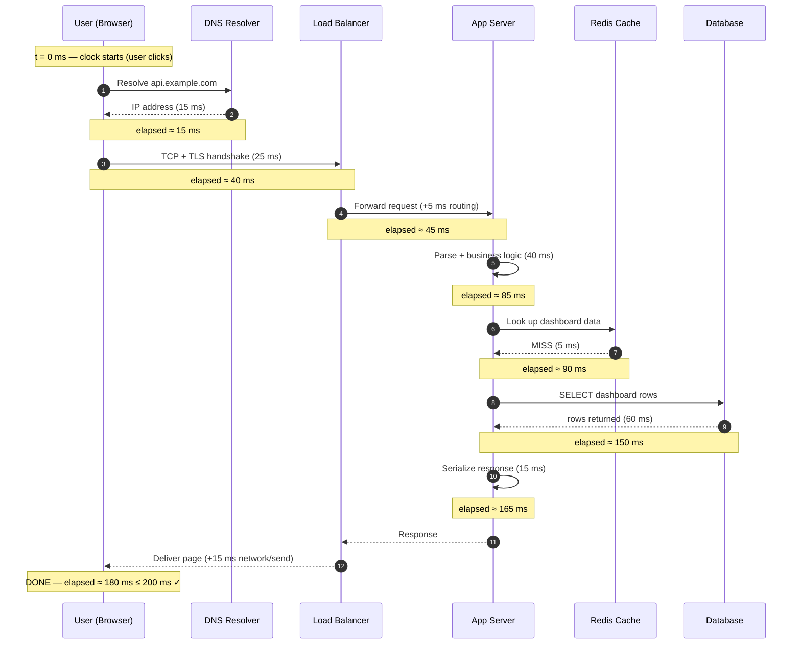
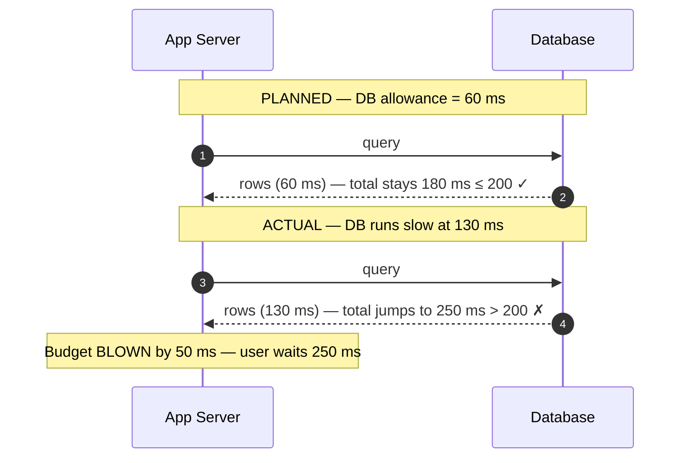

# Latency Budgets — Junior

<!-- level-focus -->
At junior level, focus on this question:

> How can I apply **Latency Budgets** in one small example and prove the result?

Use the smallest realistic scenario that exposes the decision and its failure behavior.
A **latency budget** is a promise about speed, written down as a number, and then split — fairly and explicitly — across every piece of machinery a request touches. If your product says "the page loads in under 200 ms," that 200 ms is not a hope. It is a *budget*. And like any budget, the only way to keep it is to know where every millisecond is being spent before you run out.

This page builds the intuition from the ground up: what a budget is, the handful of physical latency numbers you must memorize, how to draw up a budget table that *sums to your target*, why the tail (p99) matters more than the average (p50), and what happens the moment one component overspends.

---

## 1. What is a latency budget?

Imagine you are told: "Users must see their dashboard in under **200 ms**." That single number is a **target**. It is what the user experiences — the time from "I clicked" to "I see the result."

The trap juniors fall into is treating 200 ms as a single thing one piece of code is responsible for. It never is. A real request flows through DNS, TLS, a load balancer, your application server, a cache, a database, and several network hops along the way. Each of those is a separate piece of machinery with its own cost.

A **latency budget** takes the 200 ms target and *divides it into allowances* — one allowance per component. The rule is simple arithmetic:

> The sum of every component's allowance must be **less than or equal to** the target.

That's the whole idea. If DNS gets 20 ms, TLS gets 30 ms, the load balancer gets 5 ms, the app gets 60 ms, the cache gets 5 ms, the database gets 50 ms, and network hops eat 20 ms, then:

```
20 + 30 + 5 + 60 + 5 + 50 + 20 = 190 ms ≤ 200 ms  ✓
```

You have 10 ms of headroom. The budget *closes*. If those numbers had summed to 240 ms, the budget would be **over** before a single line of code shipped — and no amount of "we'll optimize later" fixes a plan that was impossible on paper.

Why bother writing it down? Three reasons:

- **It catches impossible designs early.** If your plan needs three sequential cross-continent calls (3 × 150 ms = 450 ms), no 200 ms target survives. You learn this in a spreadsheet, not in production.
- **It assigns ownership.** When the page is slow, "the app is slow" is useless. "The database is using 90 ms of its 50 ms allowance" tells you exactly where to look.
- **It forces trade-offs into the open.** If the database genuinely needs 80 ms, *something else must give up 30 ms*. The budget makes that conversation explicit instead of accidental.

A budget is just honest bookkeeping for time.

---

## 2. The request touches many components

Before you can split a budget, you must know what you are splitting it *across*. A typical web request — a user in a browser hitting your service — passes through these stops:

| Hop | Component | What it does | Why it costs time |
|-----|-----------|--------------|-------------------|
| 1 | **DNS lookup** | Turns `api.example.com` into an IP address | Often a network round trip to a resolver (cached after first lookup) |
| 2 | **TCP + TLS handshake** | Opens a secure connection | Multiple round trips to negotiate encryption |
| 3 | **Load balancer** | Picks which server handles the request | Small processing + an extra hop |
| 4 | **Application server** | Runs your code: parsing, business logic | CPU work, plus waiting on downstream calls |
| 5 | **Cache (Redis/Memcached)** | Returns hot data fast | A short same-datacenter round trip |
| 6 | **Database** | Returns data not in cache | Disk reads, query planning, locks |
| 7 | **Network hops** | Movement between all of the above | Distance and the speed of light |

Notice two things. First, **most of these are not "your code."** Your application logic might be hop 4, but six other stops happen with or without you. Second, **the slow parts are usually waiting, not computing.** The app server spends most of its budget *blocked* on the cache and database, not crunching numbers.

This is why a budget is drawn across components rather than across functions. You are accounting for *where time goes in the system*, and the system is bigger than your service.

> 🎞️ **See it animated:** [Latency Numbers Every Programmer Should Know](https://colin-scott.github.io/personal_website/research/interactive_latency.html)

---

## 3. Component latency numbers you must know

You cannot build a budget without rough costs for each operation. These are the "latency numbers every programmer should know" — order-of-magnitude figures, not exact specs. Memorize the *shape* of them: each row below is roughly 1000× slower than reaching memory.

| Operation | Typical latency | In human-scale terms (×1B) | Mental note |
|-----------|-----------------|----------------------------|-------------|
| L1 cache reference | ~1 ns | ~1 second | Effectively free |
| Main memory (RAM) read | ~100 ns | ~1.5 minutes | Fast; the baseline for "in-process" |
| Read 1 MB sequentially from RAM | ~10 µs | ~3 hours | Bulk memory work |
| SSD random read | ~100 µs | ~1 day | 1000× slower than RAM |
| **Same-datacenter round trip (RTT)** | **~0.5 ms** | **~6 days** | Cost of one in-DC network call |
| Read 1 MB sequentially from SSD | ~1 ms | ~12 days | |
| Rotating disk (HDD) seek | ~10 ms | ~4 months | Avoid in hot paths |
| **Cross-continent round trip (RTT)** | **~150 ms** | **~12 years** | Set by the speed of light — *unfixable* |

The four numbers in **bold-ish focus** for a junior to keep on the tip of the tongue:

- **Memory: ~100 ns** — anything you do purely in RAM is essentially instant compared to a network call.
- **SSD read: ~100 µs** — a thousand times slower than memory, but still a thousand times *faster* than a cross-continent call.
- **Same-DC RTT: ~0.5 ms** — one network call inside your datacenter. A cache hit costs roughly this.
- **Cross-continent RTT: ~150 ms** — light cannot go faster. New York ↔ London is ~28 ms one-way *at the speed of light in fiber*; round trips, queuing, and routing push the real RTT toward 70–150 ms.

The single most important lesson: **the gaps are enormous, and network distance dominates everything.** A cross-continent round trip (~150 ms) costs as much as **300 same-DC round trips** or **1.5 million memory reads**. When a budget is blown, distance and the number of network hops are almost always the culprit — not slow code.

The cross-continent number is special because you **cannot optimize it away**. You can make code faster, add a cache, buy a better disk — but you cannot make light travel faster. The only fix is to *not make the call*, or to put a copy of the data closer to the user.

---

## 4. Building your first budget table

Now we put it together. The recipe for a budget table:

1. Start with the **target** (the user-facing number).
2. List every component the request touches, in order.
3. Give each component an **allowance** based on the numbers from Section 3.
4. Keep a **running total** as you go down the list.
5. Confirm the final running total is **≤ target**. If not, redesign.

Here is a worked budget for a **"dashboard loads in < 200 ms"** target. Assume the user and servers are in the same region (no cross-continent call).

| # | Component | Allowance | Running total | Notes |
|---|-----------|-----------|---------------|-------|
| 1 | DNS lookup | 15 ms | 15 ms | Usually cached; budget the cold case |
| 2 | TCP + TLS handshake | 25 ms | 40 ms | ~2 round trips; reused on later requests |
| 3 | Load balancer | 5 ms | 45 ms | Routing + one extra in-DC hop |
| 4 | App server (CPU/logic) | 40 ms | 85 ms | Your code: parsing, serialization, glue |
| 5 | Cache read (Redis) | 5 ms | 90 ms | ~1 same-DC RTT; hot data |
| 6 | Database query | 60 ms | 150 ms | Cache miss path; the biggest single item |
| 7 | Network hops (in-DC, summed) | 15 ms | 165 ms | Several ~0.5 ms RTTs add up |
| 8 | Response serialization + send | 15 ms | 180 ms | Building and writing the response |
| — | **Total** | **180 ms** | **180 ms** | **≤ 200 ms ✓ — 20 ms headroom** |

Read the arithmetic top to bottom. Each allowance *adds* to the running total. The final 180 ms sits comfortably under the 200 ms target, leaving **20 ms of headroom** as a safety margin for surprises.

Two design notes a junior should internalize:

- **Always keep headroom.** A budget that sums to *exactly* 200 ms is a budget that fails the first time anything hiccups. Aim to close at 85–90% of the target. Here, 180/200 = 90% used.
- **The biggest line item is where you focus.** The database (60 ms) is a third of the whole budget. If you need to speed the page up, that is where the time is — not in shaving 2 ms off the load balancer.

If your first table sums to *more* than the target, you have three honest moves: (a) cut an allowance by making that component faster, (b) remove a component from the path entirely (e.g., serve from cache and skip the DB), or (c) renegotiate the target. There is no fourth option called "hope."

---

## 5. Watching a request accumulate latency

A budget table shows the *plan*. This diagram shows the *reality*: a single request walking through each hop, with the elapsed-time clock running. Watch the `Note over` markers — that is the running total ticking up, exactly mirroring the table above.



The key insight from the diagram: **latency accumulates — it does not reset.** Every hop adds to a running clock the user is watching. The user does not see "the database took 60 ms." The user sees "the page took 180 ms," which is the *sum* of everything. This is why a budget is additive bookkeeping, and why one slow hop drags the entire experience down with it.

Notice also that the request mostly *waits*. Between t=90 ms and t=150 ms the app server isn't computing — it's blocked on the database. Most latency in a real system is waiting on something downstream, which is exactly why budgeting per-component (not per-function) is the right model.

---

## 6. p50 vs p99 — the budget must hold at the tail

So far we've treated each allowance as a single number. Reality is messier: the same component is *fast most of the time and slow some of the time*. To describe this, we use **percentiles**.

- **p50 (median):** half of requests are faster than this, half are slower. This is the "typical" experience.
- **p99:** 99% of requests are faster than this; the slowest 1% are worse. This is the "tail" — your unlucky users.
- **p99.9:** the slowest 1 in 1000. Heavy systems care about this too.

Here is why this matters enormously. A database might return in **20 ms at p50** but **120 ms at p99**, because of cache misses, lock contention, a slow disk, or garbage collection. If you budgeted the database at 60 ms using only the *average*, your budget *looks* fine — but 1% of your users are blowing past it.

| Component | p50 latency | p99 latency | Budgeted allowance | Holds at p99? |
|-----------|-------------|-------------|--------------------|---------------|
| DNS | 5 ms | 20 ms | 15 ms | ❌ tail exceeds |
| TLS handshake | 20 ms | 30 ms | 25 ms | ❌ tail exceeds |
| App logic | 25 ms | 45 ms | 40 ms | ❌ tail exceeds |
| Cache | 1 ms | 5 ms | 5 ms | ✓ |
| Database | 20 ms | 120 ms | 60 ms | ❌ tail blows |

Look at the totals. At **p50** the sum is `5 + 20 + 25 + 1 + 20 = 71 ms` — wonderfully under 200 ms. At **p99** the sum is `20 + 30 + 45 + 5 + 120 = 220 ms` — **over budget**. The same system that feels instant for most users is broken for the unlucky 1%.

> **The rule:** a latency budget must hold at the **tail (p99)**, not just the average (p50). Budget against your p99 numbers, not your p50 numbers.

Why care about a mere 1%? Because at scale, 1% is a *lot* of people, and the tail compounds. If a page makes 10 backend calls and each has a 1% chance of being slow, the odds that *at least one* is slow on any given page load is about `1 − 0.99¹⁰ ≈ 9.6%`. Your tail latency becomes many users' *typical* experience. This is called **tail amplification**, and it's why mature teams obsess over p99 and p99.9 rather than averages.

For now, the junior takeaway is simple: **when you write an allowance in your budget table, fill it with the component's p99 number, not its average.** A budget built on averages is a budget that lies.

---

## 7. When a component blows its allowance

A budget is a contract. What happens when one component breaks it — when the database that was supposed to take 60 ms suddenly takes 130 ms?

The answer is the whole point of having a budget: **the overspend is borrowed from the headroom, then from the user.** There is no hidden reserve. Time is conserved.

Walk through it with our 200 ms dashboard budget (which closed at 180 ms, giving 20 ms of headroom):



The database overspent by 70 ms (130 − 60). The 20 ms of headroom absorbs the first 20 ms. The remaining 50 ms lands directly on the user, pushing the page from 180 ms to **250 ms — over the 200 ms target.** No other component did anything wrong. One blown allowance broke the whole promise.

This reveals three truths:

1. **Components are coupled through the shared budget.** Each one's allowance is only safe if every *other* one stays within bounds. The database overrunning steals the slack that protected everyone.
2. **The user pays the bill.** Internal accounting failures don't stay internal. Every borrowed millisecond is felt at the screen.
3. **Headroom is the shock absorber.** With 20 ms of slack, a small overspend (≤ 20 ms) is invisible to the user. This is precisely why you never plan to use 100% of your target.

What do you actually *do* when a component blows its budget? At a junior level, recognize the menu:

- **Make it faster** — add an index, fix the slow query, tune the cache hit rate.
- **Take it off the critical path** — return cached data; compute the slow part asynchronously after responding.
- **Parallelize** — if two downstream calls don't depend on each other, fire them at the same time so you pay `max(a, b)` instead of `a + b`.
- **Renegotiate** — if 250 ms is genuinely the floor, maybe the honest target is 300 ms. A truthful budget beats a pretty one.

The budget didn't *cause* the slowness — but it told you instantly, in milliseconds, exactly how much trouble you were in and where it came from.

---

## 8. Two more worked budgets

One example is a coincidence; let's do two more so the pattern sticks.

### Budget A — A fast API endpoint (target < 100 ms, everything in one datacenter)

This is a JSON API serving mostly cached data. Connections are kept alive, so there's no fresh DNS/TLS cost on each call.

| # | Component | Allowance | Running total |
|---|-----------|-----------|---------------|
| 1 | Load balancer | 3 ms | 3 ms |
| 2 | App logic (parse + validate) | 20 ms | 23 ms |
| 3 | Cache read (hit) | 5 ms | 28 ms |
| 4 | Auth check (in-memory token) | 2 ms | 30 ms |
| 5 | Response serialization | 10 ms | 40 ms |
| 6 | In-DC network hops (summed) | 10 ms | 50 ms |
| — | **Total** | **50 ms** | **50 ms ≤ 100 ms ✓** |

This budget closes at **50 ms against a 100 ms target — 50% used, a huge 50 ms of headroom.** The design choice that bought all that slack: serving from cache (5 ms) instead of the database (which would have cost ~60 ms). That single decision is the difference between a comfortable budget and a tight one. There is no cross-continent call here, so no 150 ms monster appears anywhere.

### Budget B — The cross-continent killer (target < 200 ms, user in Asia, database in the US)

Same logical work as our dashboard, but now the user is in Singapore and the database lives in Virginia. The data hop now crosses an ocean.

| # | Component | Allowance | Running total | Notes |
|---|-----------|-----------|---------------|-------|
| 1 | DNS lookup | 15 ms | 15 ms | |
| 2 | TLS handshake | 25 ms | 40 ms | |
| 3 | App logic | 40 ms | 80 ms | |
| 4 | **Cross-continent DB call (RTT)** | **150 ms** | **230 ms** | Singapore ↔ Virginia |
| 5 | Serialization + send | 15 ms | 245 ms | |
| — | **Total** | **245 ms** | **245 ms > 200 ms ✗** |

The budget is **blown by 45 ms before we even count percentiles** — and it's blown by *one line*. The cross-continent round trip alone (150 ms) is bigger than the entire 100 ms API budget from example A. No amount of faster code rescues this, because you cannot make light go faster.

The only real fixes change the *shape of the system*, not the speed of the code:

- **Put a read replica or cache in Asia**, so the data hop becomes same-DC (~0.5 ms) instead of cross-continent (~150 ms).
- **Use a CDN / edge** to serve the data near the user.
- **Accept a higher target** for users on the far side of the world, honestly.

This is the most important budgeting lesson of all: **geography is a line item, and it is usually the most expensive one.** A budget makes the cost of distance impossible to ignore.

---

## 9. Common mistakes juniors make

- **Budgeting with averages instead of p99.** Your budget will look healthy and your tail will be on fire. Always fill allowances with tail numbers.
- **Forgetting the components that aren't your code.** DNS, TLS, load balancers, and network hops cost real time. Leaving them out of the table is the fastest way to a budget that secretly doesn't close.
- **Planning to use 100% of the target.** A budget that sums to exactly the target has zero shock absorption. Leave 10–15% headroom.
- **Ignoring the speed of light.** A cross-continent round trip is ~150 ms and *cannot be optimized in code*. If your plan has several of them in sequence, the target was impossible from the start.
- **Adding latencies that should be parallel — or parallelizing ones that can't be.** Two independent calls cost `max(a, b)`; two *dependent* calls cost `a + b`. Knowing which is which can make or break a budget.
- **Treating "the app is slow" as a diagnosis.** Without a per-component budget, you can't say *which* component overspent. With one, the slow line item names itself.

---

## 10. Checklist and takeaways

A latency budget is the discipline of turning a single speed promise into per-component arithmetic that must add up. Before you call any design "fast enough," run this checklist:

- [ ] **There is a written target** — a specific user-facing number (e.g., "< 200 ms").
- [ ] **Every component the request touches is listed** — DNS, TLS, LB, app, cache, DB, network hops. Nothing your code doesn't own gets skipped.
- [ ] **Each component has an allowance**, drawn from realistic latency numbers (memory ~100 ns, SSD ~100 µs, same-DC RTT ~0.5 ms, cross-continent RTT ~150 ms).
- [ ] **A running total is computed**, and the final sum is **≤ the target**.
- [ ] **There is headroom** — you've closed the budget at ~85–90% of the target, not 100%.
- [ ] **The allowances are p99 numbers, not averages** — the budget holds at the tail.
- [ ] **Cross-continent hops are counted explicitly** — and there are as few of them as possible on the critical path.

Hold these four facts in your head and most of capacity reasoning follows:

1. A target is a **budget split across components**, and the allowances must **sum to ≤ the target**.
2. Know the orders of magnitude: **memory ~100 ns, SSD ~100 µs, same-DC RTT ~0.5 ms, cross-continent RTT ~150 ms** — each line is roughly 1000× the one above it.
3. **Budget at p99, not p50.** A budget that only holds on average is broken for the users who matter most.
4. **Latency accumulates and the user pays.** When one component overspends, it borrows from headroom first and from the user second — there is no free time.

Master the table and the arithmetic at this level, and you'll never again be surprised by a "fast" design that turns out to be slow on paper.

---

*Next step:* [Middle level](middle.md)

---

## Apply it

1. Choose one small, known input for **Latency Budgets**.
2. Predict the output or observable behavior.
3. Run the smallest example or probe that exercises the concept.
4. Change one input to trigger a failure or boundary case.
5. Explain the evidence using the guide's vocabulary.

## Verify your work

- Record the exact input, command or code path, and output.
- Repeat the probe and confirm the result is consistent.
- Show one expected success and one expected failure.
- Resolve any difference between the prediction and the evidence.

## Review questions

- What problem does Latency Budgets solve in the example?
- Which input changes the observed result, and why?
- What is the smallest useful success check?
- Which beginner mistake would your evidence catch?
