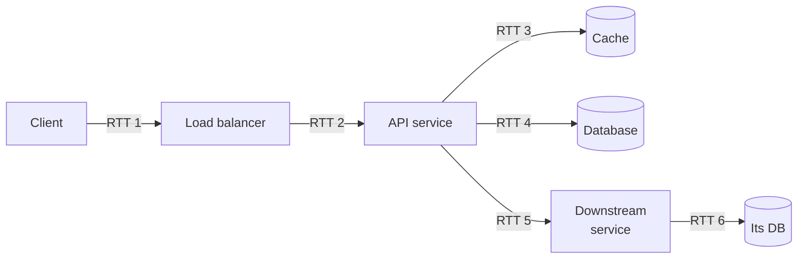
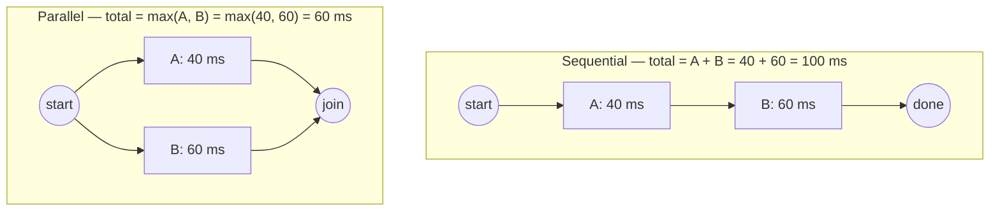
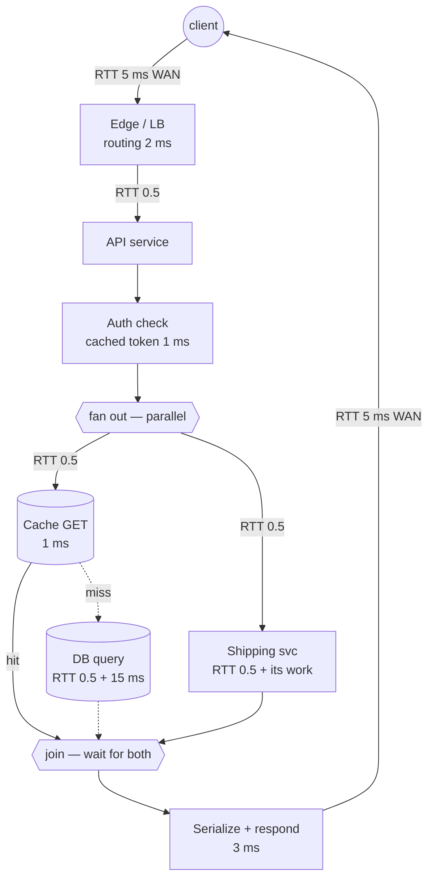

# Latency Budgets — Middle

<!-- level-focus -->
At middle level, focus on this question:

> Where does **Latency Budgets** belong in a maintainable component, and which trade-off selects the design?

Use the smallest realistic scenario that exposes the decision and its failure behavior.
A latency budget is a contract. You pick a target — "p99 of `GET /checkout` must be ≤ 300 ms" — and then you *spend* that number across every hop the request touches. If the hops sum to more than the target, the budget is already blown on paper, before a single line of code ships. This is the practitioner's craft: decompose the path, assign an allowance to each hop, count the network round-trips explicitly, and find out where the slack is (or isn't).

This page is arithmetic-shown. Every number adds up to a target you can defend in a design review.

## 1. What a latency budget actually is

The budget has three parts:

- **A target** — a single latency number, at a stated percentile (p99), for a named operation.
- **An allocation** — that target divided across the hops the request makes, so the parts sum to ≤ target.
- **Slack** — the difference between the target and the sum of allocations. Slack is your safety margin for the tail. A budget with zero slack is a budget that misses its target the first time any hop has a bad day.

The rule that makes the whole exercise honest:

```
sum(hop allowances on the critical path) + slack = target
```

If you cannot make the hops sum to the target with positive slack, you have a design problem, not a tuning problem. No amount of profiling recovers a path that is structurally too long. You change the architecture: cache the slow hop, parallelize independent calls, move data closer, or relax the target.

> 🎞️ **See it animated:** [Latency Numbers Every Programmer Should Know](https://colin-scott.github.io/personal_website/research/interactive_latency.html)

---

## 2. Decomposing the request path into hops

A "hop" is any unit of work that consumes time on the critical path: a network leg, a queue wait, a service's own compute, a database query, a cache lookup. The critical path is the chain of hops the response *cannot* be produced without. Work that happens off the critical path (fire-and-forget logging, async event publishing) does not spend the user-facing budget.

The decomposition discipline: walk the request from the client's perspective and write down every place time goes, including the boring parts people forget — TLS handshakes, connection acquisition from a pool, serialization, and especially the network RTT *between* every pair of tiers.



Each arrow is a network leg with its own RTT. Each box does its own compute. The total budget must cover *all* of it — and beginners routinely budget the boxes while forgetting the arrows.

---

## 3. The component-latency reference numbers

You cannot allocate a budget without knowing the order of magnitude of each operation. These are the standard reference numbers every engineer should have memorized (rounded, modern hardware):

| Operation | Latency | Notes |
|---|---|---|
| L1 cache reference | 1 ns | — |
| Branch mispredict | 3 ns | — |
| L2 cache reference | 4 ns | — |
| Mutex lock/unlock | 17 ns | uncontended |
| Main memory reference | 100 ns | ~100× L1 |
| Compress 1 KB (cheap codec) | ~2 µs | — |
| Read 1 MB sequentially from memory | ~3 µs | — |
| SSD random read | ~16 µs | NVMe; older SATA ~100 µs |
| Read 1 MB sequentially from SSD | ~50 µs | — |
| Round trip within same datacenter | ~500 µs | 0.5 ms |
| Read 1 MB sequentially from disk (HDD) | ~1 ms | spinning rust |
| Disk (HDD) seek | ~3–10 ms | — |
| Round trip CA → Netherlands → CA | ~150 ms | speed of light tax |

Three jumps dominate practical budgets, each ~3 orders of magnitude:

- **memory → SSD**: ~100 ns → ~16 µs (≈160×)
- **SSD → same-DC network round trip**: ~16 µs → ~500 µs (≈30×)
- **same-DC → cross-continent round trip**: ~500 µs → ~150 ms (≈300×)

The lesson is brutal and useful: **one cross-region round trip costs more than thousands of in-memory operations.** If your budget is in trouble, look at network round-trips first and CPU work last.

---

## 4. Counting the network round-trips

The single most common budgeting error is undercounting round-trips. Each request/response across a network boundary is at least one RTT. A naive design hides several:

- **TLS handshake**: a full TLS 1.2 handshake adds 2 RTTs before any application data; TLS 1.3 cuts it to 1 RTT (0-RTT on resumption). Connection pooling amortizes this away — *if* you pool. Cold connections pay it every time.
- **TCP connect**: the 3-way handshake is 1 RTT before TLS even begins.
- **Application round-trips**: every "call service, await response" is 1 RTT plus that service's processing time.
- **Chatty protocols**: an ORM that issues N queries for N rows pays N round-trips. This is the N+1 problem expressed as latency.

Worked example — same-datacenter RTT ≈ 0.5 ms:

```
1 query, pooled connection:        1 × 0.5 ms  =   0.5 ms network
50 queries (N+1), pooled:         50 × 0.5 ms  =  25.0 ms network
1 query, cold TLS 1.3 connection: (1 TCP + 1 TLS + 1 app) × 0.5 ms = 1.5 ms
```

The N+1 case spends 25 ms in pure network round-trips — likely more than your DB compute. Batching those 50 queries into 1 returns 24.5 ms straight to the budget. **Round-trip count is a design variable you control.**

---

## 5. Sequential vs parallel: sum vs max

Two downstream calls, A and B. How long do they take together? It depends entirely on whether one needs the other's result.

- **Sequential (dependent)** — you call A, use its result to call B. Total = `A + B`. Latencies **add**.
- **Parallel (independent)** — you fire A and B at once and wait for both. Total = `max(A, B)`. Latency is the **slower** of the two, *not* the sum.



Parallelizing independent calls is the cheapest latency win available — it costs no extra infrastructure, only correct code. But it has a sharp edge: in the parallel case, **the slowest call (the straggler) dominates completely.** Speeding up A from 40 ms to 10 ms does nothing for the parallel total; it's still gated by B at 60 ms. To win, you must attack the *max*, not the average.

This is also why parallel fan-out makes the tail worse, not better, for a different reason: when you wait on N parallel calls, your total latency is the *maximum* of N samples. The more parallel calls, the more chances one of them lands in its own tail. We return to this in §6.

| Property | Sequential | Parallel |
|---|---|---|
| Total latency | `sum(calls)` | `max(calls)` |
| Bottleneck | every call adds | the single slowest call |
| Speeding up a fast call | always helps | helps only if it was the max |
| Tail behavior | sums of tails | max of tails — worse with more fan-out |
| Requires | data dependency between calls | calls are independent |
| Resource cost | 1 in-flight call at a time | N in-flight calls at once |
| Typical use | "fetch user, then their orders" | "fetch profile + prefs + recommendations" |

The design move: **make dependent chains shorter, and make independent calls parallel.** Every call you move from the sequential sum into the parallel max gives the budget its full duration back.

---

## 6. Why you budget at p99, not the mean

If you budget at the average, you are budgeting for a request that essentially never happens at scale. Tail latency is the actual user experience, for two reasons.

**Reason 1 — distributions are right-skewed.** Service latency is not symmetric. A typical service might show mean = 20 ms but p99 = 200 ms. The mean is dragged toward the floor by the fast majority; the tail stretches far to the right because of GC pauses, lock contention, cache misses, queueing, and retries. Budgeting at the mean systematically understates real latency by an order of magnitude at the tail.

**Reason 2 — tail amplification through fan-out.** A request that touches multiple components experiences the *worst* of them. If a single backend has a p99 of 10 ms (1-in-100 requests is slow), and your request hits it once, you have a 99% chance of dodging that slow case. But fan out to N independent backends and wait for all:

```
P(all N fast) = 0.99^N
N = 1  →  99.0% fast   → p99-ish experience
N = 10 →  90.4% fast   → ~1 in 10 requests hits a slow backend
N = 100 → 36.6% fast   → ~63% of requests hit at least one slow backend
```

With 100 parallel backends, the request's *median* latency is now governed by each backend's p99. This is why large fan-out systems (search, ad serving, feed assembly) obsess over tail-tolerance — hedged requests, tied requests, and aggressive timeouts. The math: **the more components on the path, the higher the percentile of each component you must budget against.**

The practical rule: **budget each hop at p99, and the end-to-end target at p99.** Do not add p50s and call it a p99 — that under-budgets the tail badly. When you must compose, budget the per-hop allowances generously enough that the *combined* tail still fits, then verify against measured end-to-end percentiles, not just the arithmetic.

---

## 7. A worked end-to-end budget

Target: **p99 of `GET /order/{id}` ≤ 300 ms.** The endpoint authenticates, reads the order from a cache (falling back to the DB on miss), and enriches it with a shipping-status call to a downstream service. The order detail and the shipping status are independent — they can run in parallel.

Path, with same-DC RTT ≈ 0.5 ms counted on every hop:



### Allocation table (p99 per hop)

| Hop | Type | Allowance (p99) | Running total |
|---|---|---|---|
| Client ↔ edge WAN RTT (in) | network | 5 ms | 5 ms |
| Edge / LB routing | compute | 2 ms | 7 ms |
| Edge → API RTT | network | 0.5 ms | 7.5 ms |
| Auth check (cached token) | compute | 1 ms | 8.5 ms |
| **Parallel branch (take max)** | — | — | — |
| ↳ Cache GET + RTT (hit path) | network+work | 1.5 ms | — |
| ↳ DB query + RTT (miss path) | network+work | 15.5 ms | — |
| ↳ Shipping svc + RTT | network+work | 40 ms | — |
| **max(cache-or-db, shipping)** | parallel join | **40 ms** | 48.5 ms |
| Serialize + respond | compute | 3 ms | 51.5 ms |
| API ↔ client WAN RTT (out) | network | 5 ms | 56.5 ms |

The parallel branch is the key arithmetic. The order-detail sub-path is `max(cache-hit 1.5 ms, cache-miss-to-DB 15.5 ms)` — but on the *hit* path it's just 1.5 ms, and even on a miss it's 15.5 ms. The shipping call is 40 ms. Because both run in parallel:

```
parallel branch = max(order-detail, shipping)
                = max(15.5 ms worst-case, 40 ms)
                = 40 ms
```

Shipping is the straggler — it dominates the join. The order-detail path, even on a cache miss, is "free" because it hides under the 40 ms shipping call.

### Budget summary

```
sum of critical-path allowances = 56.5 ms
target                          = 300 ms
slack                           = 300 - 56.5 = 243.5 ms
```

That looks like enormous slack — and that is *correct and intentional*. These were per-hop **p99** allowances summed arithmetically, which over-counts the tail (it's unlikely every hop hits its own p99 on the same request). The slack absorbs: occasional cache stampedes, a downstream retry (which can double the shipping branch to ~80 ms), GC pauses, and a margin for growth. A budget with 240 ms of slack on a 300 ms target is healthy. A budget with 5 ms of slack is one bad GC away from breach.

---

## 8. Where the budget actually goes

Re-read §7's table and notice the shape of the spend:

| Category | Time | Share of 56.5 ms |
|---|---|---|
| WAN round-trips (client ↔ API, in + out) | 10 ms | 18% |
| One slow downstream (shipping) | 40 ms | 71% |
| Everything else (LB, auth, cache, serialize, in-DC RTTs) | 6.5 ms | 11% |

This is the universal pattern. In almost every real request budget, the time is dominated by **(a) network round-trips and (b) the single slowest downstream call.** Your own service's CPU work is usually a rounding error by comparison.

Consequences for where you spend optimization effort:

- **Cut round-trips before cutting compute.** Collapsing the WAN RTT (CDN, edge termination, keep-alive, HTTP/2 multiplexing) or eliminating an N+1 buys more than any algorithm tweak.
- **The slowest downstream is the budget.** In a parallel fan-out, optimizing anything but the straggler is wasted effort. Find the max, attack the max.
- **Cache to remove a hop entirely.** A cache hit doesn't make the DB faster; it deletes the DB hop from the critical path. Removing a hop beats speeding one up.
- **Put a timeout below the budget.** If shipping is allotted 40 ms but occasionally takes 2 s, a 60 ms timeout + graceful degradation (show "status pending") protects the whole endpoint's p99. An un-timed-out straggler blows the budget for everyone behind it.

---

## 9. Enforcing the budget in production

A budget on a whiteboard is a wish. To make it a contract:

1. **Set timeouts from the budget, top-down.** The end-to-end timeout is the target. Each downstream call's timeout is *less than* its allocated allowance plus the remaining slack — never more. A downstream timeout larger than its budget allowance means a slow downstream silently consumes the whole budget.

2. **Make timeouts shrink down the call tree.** If the API has 250 ms left and calls shipping, shipping's deadline should be passed down (deadline propagation) so it never works longer than the caller will wait. A call that returns after the caller already gave up is pure waste.

3. **Measure the percentile you budgeted.** Instrument each hop and the end-to-end path, and alert on **p99**, not mean. Per-hop histograms tell you *which* hop blew the budget — without them you only know the total moved, not why.

4. **Watch the straggler, not the average.** For parallel fan-out, track the max-of-branch latency and the per-branch p99 separately. The average branch latency can look fine while one branch quietly drags the join.

5. **Re-derive the budget when the path changes.** Adding one more synchronous downstream call adds its full latency to a sequential sum — and tightens everyone's slack. Every new hop is a withdrawal from the budget; check the balance before you ship it.

6. **Treat the tail as the SLO.** Your SLO should be stated at the percentile you budget — "p99 ≤ 300 ms, 99.9% of the time." When the tail breaches, the budget told you exactly which hop to interrogate.

---

## 10. Checklist

- [ ] Target stated as a **percentile** (p99), not a mean, for a **named** operation.
- [ ] Request path decomposed into hops, with every **network RTT between tiers** written down explicitly.
- [ ] Each hop assigned a **p99 allowance**; allowances **sum to ≤ target** with **positive slack**.
- [ ] **Sequential** chains use `sum`; **independent** calls run in **parallel** and use `max`.
- [ ] The **straggler** (slowest parallel branch) identified — it *is* the budget for that branch.
- [ ] **Round-trip count** audited: no hidden N+1, cold TLS, or chatty protocols on the hot path.
- [ ] Slack is **large enough to absorb a retry and a GC pause** without breach.
- [ ] **Timeouts** derived from the budget, **deadline propagated** down the call tree, and shrinking toward the leaves.
- [ ] Per-hop **p99 histograms** instrumented so a breach points to the guilty hop.
- [ ] Budget **re-derived** whenever a hop is added to the critical path.

*Next step:* [Senior level](senior.md)

---

## Apply it

1. Find a real component where **Latency Budgets** affects an interface or dependency.
2. Write two plausible choices and the constraint that favors each one.
3. Make the smallest reversible change at that boundary.
4. Exercise the component alone, then exercise the integrated flow.
5. Keep the decision note with the evidence that selected the option.

## Verify your work

- A focused check proves the local behavior.
- An integrated check proves callers and dependencies still agree.
- Logs, traces, compiler output, or benchmarks expose the boundary.
- Reverting the change restores the previous behavior without unrelated edits.

## Review questions

- Which boundary is most affected by Latency Budgets?
- What constraint would make you choose the alternative design?
- How would you isolate a local defect from an integration defect?
- What evidence shows that the change remains maintainable?
