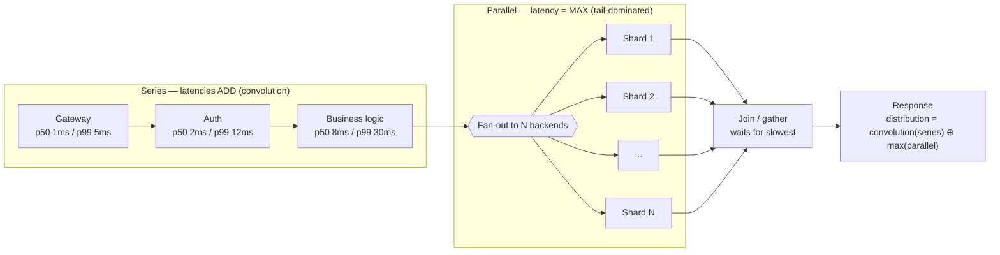
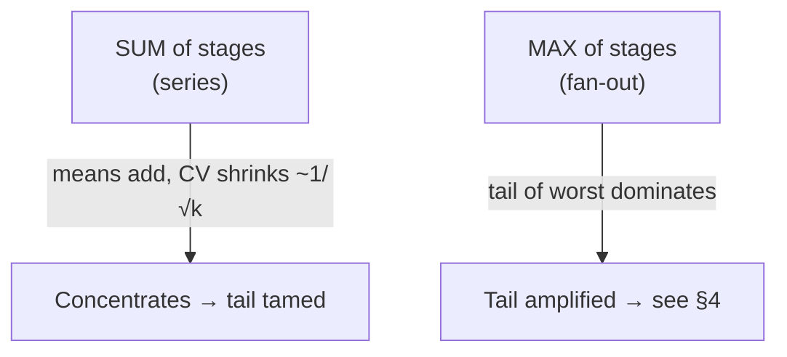
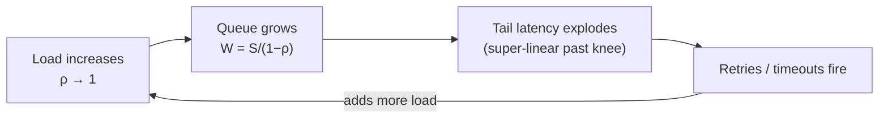
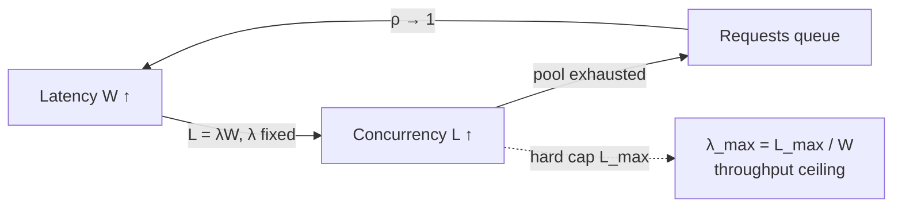

# Latency Budgets — Theory and Formal Foundations

<!-- level-focus -->
At professional level, focus on this question:

> How should teams adopt and operate **Latency Budgets — Theory and Formal Foundations** with measurable outcomes and limited coordination?

Use the smallest realistic scenario that exposes the decision and its failure behavior.
A latency budget is only as honest as the math behind it. Most engineers treat
latency as a scalar — "the service does 40 ms" — and then compose those scalars
by addition. That arithmetic is wrong in three independent ways, and each error
inflates the real tail by an order of magnitude. This document develops the
formal machinery you need to allocate latency budgets that survive contact with
production: latency as a distribution, the non-additivity of percentiles, tail
amplification under fan-out (the Dean & Barroso "tail at scale" result), the
queueing contribution near saturation, coordinated omission as a measurement
trap, and Little's Law as the bridge between latency, concurrency, and
throughput.

## 1. Latency Is a Distribution, Not a Number

Latency for any real service is a *random variable* — call it `L`. A single
request draws one sample from `L`'s distribution. The "average latency" number
on your dashboard is `E[L]`, the first moment of that distribution, and it
discards almost everything that matters for user experience and SLOs.

Why the mean lies: latency distributions are **heavy-tailed and right-skewed**.
The body is dominated by cache hits, fast paths, and warm connections; the tail
is dominated by GC pauses, lock contention, cold caches, page faults, TCP
retransmits, and noisy neighbors. A distribution like this has a mean that sits
far below the experiences of a meaningful fraction of users.

Consider a service whose latency is 1 ms for 99% of requests and 1000 ms for the
remaining 1%:

```
E[L] = 0.99 × 1 ms + 0.01 × 1000 ms = 0.99 + 10 = 10.99 ms
```

The mean is ~11 ms, yet **no single request is ever served in 11 ms**. The mean
is a value the system essentially never produces. This is why we report
percentiles (quantiles): `p50` (median), `p90`, `p99`, `p99.9`. The percentile
`p_q` is the value `x` such that `P(L ≤ x) = q/100`.

The relationships you must internalize:

| Statistic | What it answers | Sensitivity to tail |
|-----------|-----------------|---------------------|
| `mean` (`E[L]`) | Average cost; useful for capacity/throughput math | Pulled up by tail but hides it |
| `p50` (median) | Typical experience | Insensitive to tail |
| `p90` | Common bad case | Mild |
| `p99` | One in a hundred requests | Strong |
| `p99.9` | One in a thousand; what fan-out exposes | Dominated by tail |
| `max` | Worst observed; noisy, unbounded | Pure tail |

A useful mental model: **`p50` describes your code, `p99` describes your
infrastructure, and `p99.9` describes your worst day's physics.** As you push the
percentile higher you stop measuring the algorithm and start measuring
contention, scheduling, and hardware variance.

> 🎞️ **See it animated:** [Latency Numbers Every Programmer Should Know](https://colin-scott.github.io/personal_website/research/interactive_latency.html)

The practical consequence: **a latency budget must be expressed at a percentile**
(usually `p99` or `p99.9`), and every composition step must preserve that
percentile semantics. Adding `p50`s tells you nothing about the `p99` of the
whole. Adding `p99`s — as we'll prove next — overestimates wildly in some regimes
and dangerously underestimates in others.

---

## 2. Why Percentiles Don't Add

The single most common budgeting error is:

```
p99(A + B) ≟ p99(A) + p99(B)        ← FALSE in general
```

Only **means** compose by addition, and they do so unconditionally — no
independence assumption required. By linearity of expectation:

```
E[A + B] = E[A] + E[B]      (always true, even when A and B are correlated)
```

Percentiles obey no such law. The percentile of a sum is determined by the
**distribution of the sum**, which is the *convolution* of the component
distributions (under independence), not a sum of their individual percentiles.

### Worked example: means add, percentiles don't

Two independent stages, `A` and `B`, each a "mostly fast, sometimes slow" stage.
Each is 10 ms with probability 0.9 and 100 ms with probability 0.1.

For a single stage:

```
E[A]   = 0.9 × 10 + 0.1 × 100 = 9 + 10 = 19 ms
p90(A) = 10 ms    (P(A ≤ 10) = 0.9)
p99(A) = 100 ms   (the slow branch is the top 10%, so it covers p90..p100)
```

Now compose `A + B` (independent). Enumerate the joint outcomes:

| Outcome | Latency | Probability |
|---------|---------|-------------|
| both fast | 10 + 10 = 20 ms | 0.9 × 0.9 = 0.81 |
| one slow | 10 + 100 = 110 ms | 2 × (0.9 × 0.1) = 0.18 |
| both slow | 100 + 100 = 200 ms | 0.1 × 0.1 = 0.01 |

**Means:** `E[A + B] = 20×0.81 + 110×0.18 + 200×0.01 = 16.2 + 19.8 + 2.0 = 38 ms`.
And indeed `E[A] + E[B] = 19 + 19 = 38 ms`. Means add. ✓

**Percentiles:** the CDF of the sum is:

```
P(A+B ≤ 20)  = 0.81
P(A+B ≤ 110) = 0.81 + 0.18 = 0.99
P(A+B ≤ 200) = 1.00
```

So `p90(A+B) = 110 ms` and `p99(A+B) = 110 ms`. But naive addition gives
`p99(A) + p99(B) = 100 + 100 = 200 ms`. The naive sum **overestimates the p99 by
nearly 2×** here, because it assumes both stages hit their tail on the *same*
request — an event with probability only 0.01, which lives at `p99.9`, not `p99`.

The direction of the error is regime-dependent, and that's the trap:

- When tails are **independent and rare**, `p99(A)+p99(B)` *overestimates* — both
  stages rarely spike together, so the joint p99 is closer to "one stage spikes."
- When tails are **positively correlated** (shared GC, shared lock, shared noisy
  host, retry storms), the joint tail can *exceed* `p99(A)+p99(B)` — they spike
  together far more often than independence predicts.

There is no scalar rule. You must reason about the *distributions* and their
dependence structure. The table below summarizes what actually composes:

| Quantity | Composition rule for `A + B` | Conditions |
|----------|------------------------------|------------|
| Mean | `E[A+B] = E[A] + E[B]` | Always — even correlated |
| Variance | `Var(A+B) = Var(A) + Var(B) + 2·Cov(A,B)` | `Cov = 0` if independent |
| Full CDF | `F_{A+B} = F_A * F_B` (convolution) | Independence |
| Percentile `p_q` | No closed form; read off the convolved CDF | — |

The takeaway for budgeting: **allocate the budget in distribution space, then
read the percentile of the composite — never sum component percentiles.** If you
must use a quick conservative bound, `p99(A)+p99(B)` is a valid *upper* bound on
`p99(A+B)` only under independence and only because the union bound makes the
joint tail event rarer; it is *not* safe when tails correlate.

---

## 3. Composing Distributions: Convolution and Staging

A request path is usually a **chain of stages in series** (the total is a sum)
mixed with **branches in parallel** (the total is a max). The two compose
differently and you must track which is which.

**Series (sum).** When latencies accumulate sequentially — RPC, then DB read,
then serialization — the path latency is `L = L_1 + L_2 + ... + L_k`. Under
independence the distribution is the convolution `f_1 * f_2 * ... * f_k`. The mean
adds; the *relative* spread shrinks (variances add but the coefficient of
variation falls as `1/√k` for i.i.d. stages), so long serial chains tend to
*concentrate* around their mean — the central limit theorem at work. Serial
chains are the friendly case.

**Parallel (max / fan-out).** When you issue `N` calls and wait for all of them,
the path latency is `L = max(L_1, ..., L_N)`. The max is governed by the **tail**
of the components, and its distribution is `F_max(x) = ∏ F_i(x)`. This is the
hostile case and the subject of Section 4: the max drags the whole path toward
the worst component's tail.

The diagram below shows a representative staged path and how each composition
operator transforms the distribution shape.



The mental model to carry into design reviews:



In practice you rarely have clean analytic distributions. You compose
empirically: capture the per-stage latency histogram (e.g. an HDR histogram per
stage), then either Monte-Carlo sample the path (draw one value per stage,
sum/max, repeat 10⁶ times, read the percentile of the simulated path) or convolve
the histograms numerically. Both give you the **composite percentile** honestly,
which is the only number a budget can be built on.

---

## 4. Tail Amplification Under Fan-Out

This is the result that reframes how you think about service latency at scale. It
comes from Jeffrey Dean and Luiz André Barroso's 2013 CACM paper *"The Tail at
Scale,"* and it is the single most important quantitative fact in latency
budgeting.

**Setup.** A root request fans out to `N` leaf services and must wait for *all* of
them (a scatter-gather). Suppose each leaf, independently, is "slow" (exceeds some
latency threshold `t`) with probability `p`. The root request is slow if **at
least one** leaf is slow.

**Derivation.** The root is *fast* only when *every* leaf is fast:

```
P(all N fast) = (1 − p)^N
P(root slow) = 1 − (1 − p)^N
```

That `(1 − p)^N` decays geometrically in `N` is the whole story. Even a tiny
per-leaf slow probability compounds into a near-certainty of a slow root as `N`
grows.

**The canonical number from the paper.** Take a leaf whose `p99 = 10 ms`, i.e.
each leaf is "slow" (> 10 ms) with probability `p = 0.01`. Fan out to `N = 100`:

```
P(root slow) = 1 − (1 − 0.01)^100 = 1 − 0.99^100 ≈ 1 − 0.366 = 0.634
```

**63% of root requests are slow** even though each leaf is slow only 1% of the
time. The leaf's 1-in-100 tail event has become the *common* case at the root.
Said differently: the root's `p50` is now controlled by the leaves' `p99`.

### Fan-out tail-probability table

`P(root slow) = 1 − (1 − p)^N`, the probability that at least one leaf exceeds its
single-service tail threshold.

| Fan-out `N` | `p = 0.1%` (p99.9 leaf) | `p = 1%` (p99 leaf) | `p = 5%` (p95 leaf) |
|-------------|------------------------|---------------------|---------------------|
| 1 | 0.10% | 1.00% | 5.00% |
| 5 | 0.50% | 4.90% | 22.6% |
| 10 | 1.00% | 9.56% | 40.1% |
| 20 | 1.98% | 18.2% | 64.2% |
| 50 | 4.88% | 39.5% | 92.3% |
| 100 | 9.52% | 63.4% | 99.4% |
| 200 | 18.1% | 86.6% | 99.997% |
| 500 | 39.4% | 99.3% | ~100% |
| 1000 | 63.2% | 99.996% | ~100% |

Read the diagonal trend: to keep the root's slow-rate tolerable at `N = 100`, the
**leaf must control its `p99.9`, not its `p99`.** At `p = 0.001` (leaf p99.9 =
threshold) and `N = 100`, the root slow-rate is 9.5% — still high but workable. The
rule of thumb that falls out: **as fan-out grows, each leaf must be evaluated one
or two "nines" deeper than the SLO you care about at the root.** A 99% leaf SLA is
worthless behind a 100-way fan-out.

### Latency-tolerance techniques (Dean & Barroso)

The paper's whole point is that you can't eliminate per-leaf tails (they come from
shared hardware, GC, queueing — irreducible variance), so you engineer *around*
them:

- **Hedged requests** — after the leaf's `p95`, send a duplicate to a second
  replica and take the first response. Costs ~5% extra load, cuts the tail
  dramatically because both replicas hitting their tail simultaneously is rare
  (independence again, working *for* you).
- **Tied requests** — send to two replicas immediately with a cross-cancel; the
  faster server cancels the slower's queued copy.
- **Reduce fan-out / hierarchical aggregation** — fewer leaves per root, or a
  tree of partial aggregators, shrinks `N` at each level.
- **"Good enough" responses** — return after `M of N` leaves answer (partial
  results), trading completeness for a bounded tail.
- **Micro-partition + reactive replication** — spread tail-prone partitions so a
  single slow host can't dominate.

Every one of these is a budget lever. When the convolution/fan-out math says the
composite `p99.9` blows the budget, hedging is usually the cheapest fix because it
attacks the *independence* of tails directly.

---

## 5. The Queueing Contribution to Latency

So far we treated per-stage latency as exogenous. But a large part of real tail
latency is **queueing delay**, and queueing delay is not a fixed cost — it
*explodes* as a service approaches saturation. This is why a budget computed at
50% load is meaningless at 80% load.

Model a single server as an **M/M/1 queue**: Poisson arrivals at rate `λ`,
exponential service at rate `μ`, utilization `ρ = λ/μ` (with `ρ < 1` required for
stability). Standard results:

```
Average number in system:      L  = ρ / (1 − ρ)
Average time in system:        W  = (1/μ) / (1 − ρ)
Average waiting time in queue:  W_q = ρ / (μ(1 − ρ)) = W − 1/μ
```

The term that matters is the **`1/(1 − ρ)` blow-up factor.** Let `S = 1/μ` be the
raw service time. The total time in system is:

```
W = S / (1 − ρ)
```

So the *queueing multiplier* on your service time is `1/(1 − ρ)`. Tabulate it:

| Utilization `ρ` | Multiplier `1/(1−ρ)` | If `S = 10 ms`, total `W` |
|-----------------|----------------------|---------------------------|
| 0.50 | 2.0× | 20 ms |
| 0.70 | 3.3× | 33 ms |
| 0.80 | 5.0× | 50 ms |
| 0.90 | 10.0× | 100 ms |
| 0.95 | 20.0× | 200 ms |
| 0.99 | 100.0× | 1000 ms |

**Worked queueing contribution.** A backend with a 10 ms raw service time, run at
80% utilization, contributes `10 / (1 − 0.8) = 50 ms` of *average* total time —
40 ms of which is pure queueing wait that doesn't appear in any single-request
benchmark. Push the same server to 90% and the contribution doubles to 100 ms; at
95% it quadruples to 200 ms. The service code didn't change. **The latency tax is
the utilization.**

Three consequences for budgeting:

1. **Latency is a function of headroom, not just code.** A latency budget is
   implicitly a *utilization budget*. Targeting `p99` at a given latency forces a
   maximum `ρ` per server, which forces a minimum replica count. The capacity
   plan and the latency budget are the same plan.

2. **The tail is worse than the mean blow-up.** M/M/1 *waiting* time is itself
   exponentially distributed, so the `p99` of the queue grows even faster than the
   mean `W_q`. The numbers above are averages; the tail percentiles climb steeper.

3. **Operate well below the knee.** The curve has a knee around `ρ ≈ 0.7–0.8`.
   Beyond it, small load increases or brief bursts (and arrivals are bursty, not
   Poisson — real traffic is worse than M/M/1) cause super-linear latency growth.
   This is why mature systems target 50–70% steady-state utilization and treat the
   remaining headroom as latency insurance, not waste.



That feedback loop — saturation → tail → timeouts → retries → more load — is the
mechanism of **metastable failure**. The queueing math is what tells you where the
cliff is *before* you drive off it.

---

## 6. Coordinated Omission: The Measurement Trap

Every number above assumes you can *measure* your latency distribution correctly.
You usually can't, because of **coordinated omission** — a systematic measurement
bias, named by Gil Tene, that silently deletes the worst samples from your
results and makes your tail look far better than it is.

**The mechanism.** A typical load generator works like this: send a request,
*wait for the response*, record the latency, then send the next request. If the
system stalls for 1 second (GC pause, lock, failover), the in-flight request
records ~1000 ms — but the load generator was *blocked* during that second and
therefore **never sent** the dozens of requests it was supposed to send during the
stall. Those would-be-slow requests are simply omitted. The pause is recorded as a
*single* slow sample instead of the hundreds of slow samples real users would have
experienced.

The result: your measured `p99` reflects only the requests that happened to be
issued *between* stalls — the easy ones. The percentiles are computed over a
sample that **coordinated** with the system's own pauses to exclude the bad
period. Reported `p99.9` can be off by **one to two orders of magnitude**.

**Illustration.** Suppose a 100-second test issues one request every 10 ms
(10,000 requests at 1 ms each), but the server freezes for 1 full second at the
50-second mark:

- *Naive measurement (coordinated omission):* ~9,900 requests at 1 ms, plus **one**
  request at 1000 ms. `p99 = 1 ms`, `p99.99 ≈ 1 ms`. The tail is invisible.
- *Correct measurement:* during the 1-second freeze, 100 requests *should* have
  been issued; the first is delayed 1000 ms, the next 990 ms, ... down to 10 ms.
  Those 100 requests have a uniform spread of latencies up to 1 s. Now
  `p99 ≈ 990 ms`. The tail is real and enormous.

The corrected distribution is dramatically worse — and it's the one users feel,
because a real user who clicked during the freeze waited the full second.

**How to avoid it:**

- **Measure against a fixed schedule, not a closed loop.** Record latency as
  `(time_response_received − time_request_was_supposed_to_be_sent)`, not
  `(received − actually_sent)`. The intended start time is anchored to the target
  rate, so stalls inflate every queued request's latency, as they should.
- **Use an open-model load generator** (constant arrival rate independent of
  responses), or a tool with built-in correction — `wrk2`, `Gatling`, modern JMeter
  with throughput shaping, or anything backed by **HdrHistogram** with coordinated-
  omission correction enabled.
- **Be suspicious of any benchmark where `p99` ≈ `p50`.** Flat tails almost always
  mean the slow samples were omitted, not that the system is uniformly fast.

Coordinated omission interacts viciously with everything prior: an under-measured
leaf `p99` plugged into the fan-out formula of Section 4 makes the predicted root
slow-rate look fine while production catches fire. **Garbage tail in, garbage
budget out.**

---

## 7. Little's Law: Latency ↔ Concurrency ↔ Throughput

The three quantities you care about — latency, throughput, and concurrency — are
not independent. **Little's Law** ties them together with one of the most robust
results in all of queueing theory:

```
L = λ × W
```

where, for any stable system over a long interval:

- `L` = average number of requests *in the system* concurrently (concurrency),
- `λ` = average throughput (arrival = completion rate in steady state),
- `W` = average time a request spends in the system (latency).

Little's Law is **distribution-free**: it holds for *any* arrival process, *any*
service-time distribution, *any* scheduling discipline, as long as the system is
stable. That generality makes it a powerful sanity check and design tool.

**Rearrangements you use constantly:**

```
W = L / λ      latency = concurrency / throughput
λ = L / W      throughput = concurrency / latency
L = λ × W      concurrency = throughput × latency
```

**Worked sizing.** Your service must sustain `λ = 10,000 req/s` at `W = 50 ms`
(0.05 s) average latency. Required in-flight concurrency:

```
L = λ × W = 10,000 × 0.05 = 500 concurrent requests
```

You need worker/thread/connection capacity for **500 simultaneous requests**. If
your pool only holds 200, requests queue, `W` rises (Section 5), and Little's Law
re-balances at a *worse* operating point — higher `W` for the same `λ`, or lower
`λ` if you start shedding.

**The latency–concurrency coupling is the key budgeting insight.** Fix throughput,
and latency and concurrency move together:

- If `W` doubles (tail regression, GC, a slow dependency), concurrency `L` doubles
  for the same `λ` — you suddenly need 2× the connections/threads, often
  exhausting pools and triggering the saturation spiral of Section 5.
- Conversely, a hard concurrency cap (thread pool, connection limit, semaphore)
  imposes a *throughput ceiling* of `λ_max = L_max / W`. Raising latency lowers
  your max throughput; this is why a single slow downstream dependency can collapse
  the QPS of an upstream service even though the upstream's own code is unchanged.



Little's Law is also how you back-solve budgets: given a thread pool of 500 and a
target of 10k req/s, the *implied* latency budget is `W = L/λ = 500/10000 = 50 ms`.
Exceed 50 ms average and you cannot hit 10k req/s with that pool — the math
forecloses it regardless of how fast individual requests run.

---

## 8. Building a Budget That Respects the Math

Putting the theory to work, a defensible latency budget is constructed
*top-down* from a percentile SLO and *bottom-up* from measured component
distributions, reconciled in the middle. The process:

1. **State the SLO as a percentile, at the edge.** "p99.9 ≤ 300 ms at the API
   gateway." Pick the percentile deep enough that fan-out (Section 4) won't expose
   a deeper one you didn't budget for.

2. **Decompose the path into series and parallel segments.** Tag every edge as a
   sum (series) or a max (fan-out). This is the structure of Section 3.

3. **Pull per-component distributions, not point numbers** — and make sure they're
   measured without coordinated omission (Section 6). A point estimate hides
   exactly the variance the budget is meant to control.

4. **Compose in distribution space.** Convolve series segments; take the max-CDF
   for fan-out segments; Monte-Carlo the whole path. Read the composite percentile.
   **Never sum component percentiles** (Section 2).

5. **Apply the fan-out correction.** For any scatter-gather of width `N`, require
   each leaf to hold its tail at the percentile implied by
   `P(slow) = 1 − (1 − p)^N` for your target root slow-rate. Budget hedging if the
   raw leaf tail can't meet it (Section 4).

6. **Reserve a queueing/utilization margin.** Every component's contribution is
   `S/(1 − ρ)`; pin a maximum `ρ` (≤ 0.7 for latency-sensitive paths) and let that
   set replica counts. The latency budget *is* a capacity decision (Section 5).

7. **Close the loop with Little's Law.** Check that `L = λ × W` at the budgeted `W`
   fits your pool/connection limits; if not, the budget is infeasible at the target
   throughput (Section 7).

A budget produced this way will have explicit, defensible margins and will name
the *distributional* assumptions (independence of tails, utilization ceilings) it
depends on — which is exactly what lets you spot when production violates them.

---

## 9. Key Formulas and Reference Numbers

| Concept | Formula | Note |
|---------|---------|------|
| Mean composition (series) | `E[A+B] = E[A] + E[B]` | Always holds, even correlated |
| Variance (series, independent) | `Var(A+B) = Var(A) + Var(B)` | Add `2·Cov` if correlated |
| Percentile of a sum | from CDF `F_A * F_B` | **No** scalar add rule |
| Fan-out slow probability | `P(slow) = 1 − (1 − p)^N` | Dean & Barroso, tail at scale |
| Fan-out latency | `L = max(L_1..L_N)`, `F_max = ∏F_i` | Tail-dominated |
| M/M/1 time in system | `W = S / (1 − ρ)`, `ρ = λ/μ` | Queueing multiplier `1/(1−ρ)` |
| M/M/1 number in system | `L = ρ / (1 − ρ)` | Blows up as `ρ → 1` |
| Little's Law | `L = λ × W` | Distribution-free, any stable system |
| Throughput ceiling | `λ_max = L_max / W` | From a hard concurrency cap |

**Anchor numbers worth memorizing:**

- 100-way fan-out, 1% slow leaves → **63% slow roots** (`1 − 0.99^100`).
- 80% utilization → **5×** service-time blow-up; 90% → 10×; 95% → 20×.
- 10k req/s at 50 ms latency → **500 concurrent requests** (`L = λW`).
- A leaf must control its tail **one or two nines deeper** than the root SLO it
  sits behind.

---

## 10. Pitfalls Checklist

- ❌ Reporting or budgeting with the **mean** — it's a value the system may never
  produce. Budget at `p99`/`p99.9`.
- ❌ **Summing percentiles** across stages. Only means add; percentiles need the
  convolved distribution.
- ❌ Ignoring **tail correlation**. Shared GC/locks/hosts make tails spike together,
  defeating both the independence-based bound and hedging.
- ❌ Forgetting **fan-out amplification**. A "fast" 99% leaf is a slow root behind a
  wide scatter-gather.
- ❌ Benchmarking at **low utilization** and budgeting for production load — the
  `1/(1−ρ)` queueing tax is invisible until you're near the knee.
- ❌ Trusting a load test with **coordinated omission** — flat `p99 ≈ p50` tails are
  a measurement artifact, not a fast system.
- ❌ Treating latency and concurrency as independent — Little's Law couples them; a
  latency regression silently exhausts your pools.
- ❌ Running latency-sensitive services above `ρ ≈ 0.7` and calling the headroom
  "waste." That headroom is your tail insurance.

---


---

## Apply it

1. Define the user or business outcome that **Latency Budgets — Theory and Formal Foundations** should improve.
2. Assign one owner for code, contracts, operations, and incidents.
3. Split delivery into reversible increments that produce evidence early.
4. Publish responsibilities, escalation paths, and compatibility windows.
5. Stop or expand only when the agreed measures support that decision.

## Verify your work

- Each increment has an owner, rollback path, and observable exit condition.
- Adoption, reliability, delivery time, and coordination cost are measured.
- Incident and migration exercises prove that responsibility is executable.
- The old path is removed only after telemetry proves it is unused.

## Review questions

- Which measurable outcome justifies investing in Latency Budgets — Theory and Formal Foundations?
- Which team owns the full lifecycle and incident response?
- What reversible increment produces the earliest useful evidence?
- Which exit condition proves that migration or adoption is complete?
