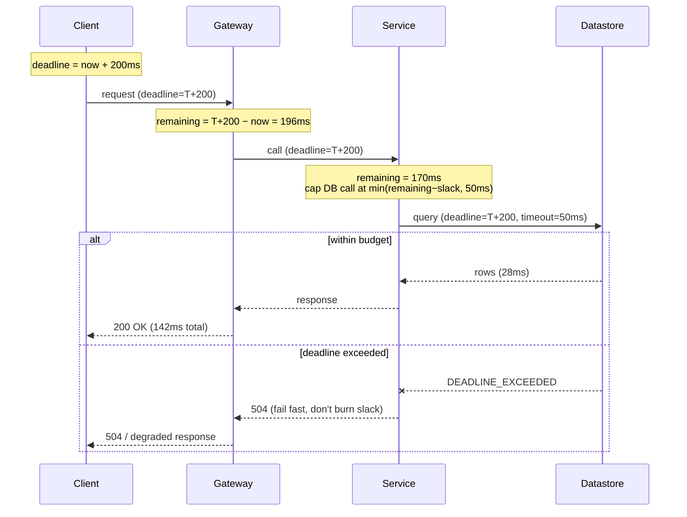
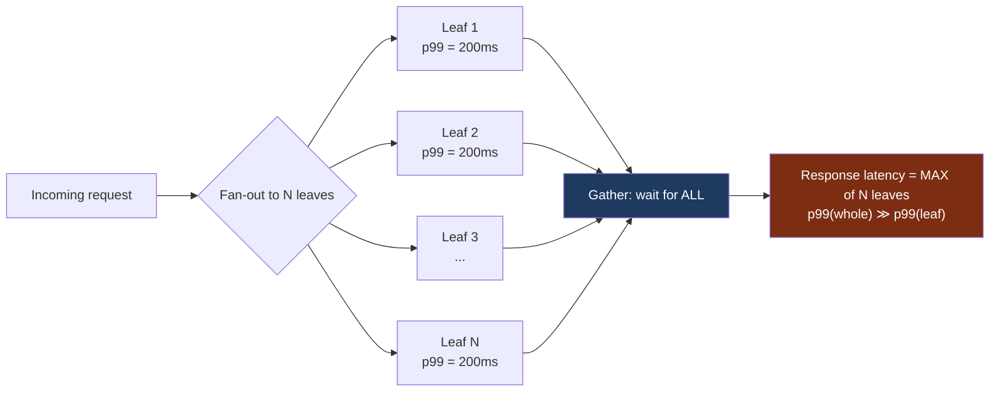
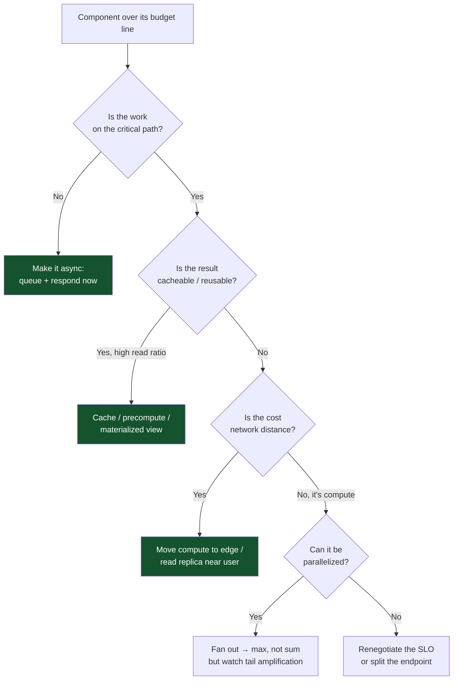

# Latency Budgets — Senior

<!-- level-focus -->
At senior level, focus on this question:

> Which system invariant is affected by **Latency Budgets** under failure, load, and change?

Use the smallest realistic scenario that exposes the decision and its failure behavior.
A latency budget is a *contract*. You own a user-facing Service Level Objective — say, **p99 read latency < 200 ms** — and that number is not negotiable downward by accident. Every hop, every dependency, every retry, every serialization step spends from a fixed pool of milliseconds. The senior engineer's job is to derive that pool from the SLO, allocate it across components with reserved slack, enforce the allocation with timeouts and deadline propagation, and then confront the brutal arithmetic of fan-out: at scale, the tail of the *whole* is far worse than the tail of any *part*. When the budget cannot be met by tuning, the budget itself dictates architecture — you remove hops, precompute, cache at the edge, or go async. This page is about owning the number end to end.

---

## 1. The budget as a contract: SLO → milliseconds

An SLO is a statement about a *distribution*, not a single request. "p99 < 200 ms" means: of all requests in the measurement window, at least 99% complete in under 200 ms. Three consequences follow immediately, and seniors who skip them ship budgets that lie.

**Pick the right percentile.** Averages hide the tail; the tail is where users churn. A service with a 40 ms mean can still have a 600 ms p99 if 1% of requests hit a cold cache, a GC pause, or a slow replica. Budget against the percentile in your SLO — usually p99, sometimes p99.9 for revenue-critical paths — never the mean.

**Pick the measurement point.** Latency measured at the load balancer differs from latency measured in the client. The contract must name the vantage point: *server-side* (excludes client network and DNS) or *client-side / end-to-end* (includes them). A 200 ms server SLO with a 90 ms median RTT to mobile users is a 290 ms+ user experience. Decide which one the SLO governs and budget that one.

**Account for the percentile coupling.** When you fan out, the percentiles compound (Section 4). A 200 ms p99 *user* SLO cannot be built from sub-services that each merely promise 200 ms p99 — you need them far tighter, or you need tail-tolerance mechanisms. This is the single most common budgeting mistake, and it is why this page exists.

> 🎞️ **See it animated:** [Latency Numbers Every Programmer Should Know](https://colin-scott.github.io/personal_website/research/interactive_latency.html)

Anchor every budget to physical reality. The numbers below are the floor — you cannot allocate 0.5 ms for a cross-region round trip and expect to keep your contract.

| Operation | Order of magnitude | Budget implication |
|---|---|---|
| L1/L2 cache reference | ~1 ns | Free; never a budget line item |
| Main memory reference | ~100 ns | Free for in-process lookups |
| Mutex lock/unlock | ~25 ns | Free, unless contended (then it's a tail) |
| Compress 1 KB (Snappy) | ~2 µs | Negligible per request |
| SSD random read | ~16 µs | Counts when you do many per request |
| Read 1 MB sequentially from SSD | ~50 µs | Matters for large payloads |
| Round trip within same datacenter | ~0.5 ms | The unit of intra-DC hop cost |
| Read 1 MB sequentially from disk (HDD) | ~5 ms | Avoid on the hot path |
| Round trip across continents (e.g. CA↔NL) | ~150 ms | Blows most SLOs alone; precompute or cache at edge |

The discipline: before you write a single budget line, write down the *unavoidable* physics for the path — RTTs, disk hits, serialization of large blobs. What remains after subtracting physics is what you actually get to allocate.

---

## 2. Deriving and allocating the budget

Start from the SLO and walk *inward*, subtracting reserved slack at each layer, then distribute the remainder across components in proportion to their irreducible work.

**Step 1 — Reserve slack at the top.** Never allocate 100% of the SLO. Reserve 15–25% as headroom for jitter, GC pauses, queueing under load, and the cost of the enforcement machinery itself (timeout bookkeeping, context propagation). For a 200 ms p99 SLO, target an *engineering budget* of ~160 ms and treat the remaining 40 ms as the buffer that absorbs the tail.

**Step 2 — Enumerate the components on the critical path.** Only the critical path counts. Work that runs in parallel costs `max`, not `sum`; work that runs sequentially costs `sum`. Draw the path before you allocate.

**Step 3 — Allocate proportional to irreducible work, then add per-component slack.** A database that must do an indexed read across a 500 GB table genuinely needs more than a Redis GET. Allocate accordingly, and give each component its own internal slack so it has a real number to enforce against.

Here is a 200 ms p99 SLO decomposed into a 160 ms engineering budget across a typical read path:

| Component (critical path) | Allocated p99 | Notes / irreducible cost |
|---|---|---|
| Edge / TLS termination + L7 routing | 8 ms | TLS resume, header parse, route match |
| API gateway: authn/authz | 12 ms | Token validation, one cache hit; cache miss is a separate budget |
| Network hops (3 × intra-DC RTT) | 6 ms | 3 × ~2 ms with TCP + serialization overhead |
| Application service (business logic) | 20 ms | CPU work, fan-out coordination, response assembly |
| Cache lookup (Redis, in-DC) | 5 ms | p99 GET incl. connection-pool wait |
| Primary datastore (indexed read) | 50 ms | The heaviest line; the read that defines the path |
| Serialization + response encoding | 9 ms | Protobuf/JSON encode, gzip of payload |
| **Reserved slack (top-level buffer)** | **40 ms** | Absorbs jitter, GC, queueing, retries |
| **Total** | **150 ms** | Leaves 10 ms margin under the 160 ms engineering target |

Two rules make this table honest. First, **every allocated number is itself a p99**, not a mean — a component's mean can be tiny while its allocated tail is generous. Second, **the sum of per-hop p99s is not the path's p99** when hops are independent; the table above is a *worst-case sequential ceiling* you enforce with timeouts, while the *expected* path p99 is lower because not every hop hits its tail simultaneously. Budget against the ceiling; measure against reality.

---

## 3. Enforcing the budget: timeouts and deadline propagation

An allocation is worthless if nothing stops a component from overrunning it. Enforcement has three pillars.

**Per-hop timeouts that sum within budget.** Each call must carry a timeout no larger than its allocation. The classic failure is independently-configured timeouts that add up to far more than the SLO — a service with a 30 s default client timeout calling another with a 30 s timeout will happily wait 60 s while your "200 ms SLO" burns. Set each timeout to its budget line plus a thin margin, and verify the *sum along the longest path* is ≤ the engineering budget.

**Deadline propagation (context deadlines).** Static per-hop timeouts double-count slack: if hop A finishes in 5 ms but you gave hop B a fixed 50 ms timeout, B can run until 55 ms even though the *request* only has, say, 30 ms of budget left. The fix is to propagate an absolute deadline — a wall-clock timestamp — with the request, not a duration. Each service computes its remaining budget as `deadline − now`, and never lets a downstream call exceed it. In Go this is `context.WithDeadline`; in gRPC it's the deadline carried in call metadata; in a custom protocol it's an explicit `X-Deadline-Unix-Millis` header.



**Deadline-aware fail-fast.** When the propagated deadline has already passed before a downstream call begins, do not make the call — it is guaranteed to miss and only adds load. A service should check `now > deadline` at entry and immediately return `DEADLINE_EXCEEDED`, shedding work it cannot complete in time. This is what turns a latency budget into a *load-shedding* mechanism under stress.

**Budgets as SLOs per service.** Push the contract down. Each component's allocation becomes *its own* SLO, owned by its team, with its own error budget and alerting. The user-facing 200 ms p99 decomposes into a tree of per-service objectives (datastore: 50 ms p99; auth: 12 ms p99), each independently monitored. When a downstream service burns its error budget, the breach is localized and ownership is unambiguous — you don't debug a global number, you debug the one line that regressed.

---

## 4. The tail-at-scale problem

This is the heart of senior-level latency ownership, and it is counterintuitive enough that it derails teams who reason only about averages. The canonical reference is Dean & Barroso, *"The Tail at Scale"* (CACM, 2013).

**The setup.** Modern requests rarely touch one machine. A search query, a feed render, a product page — each fans out to tens or hundreds of leaf services (shards, microservices, partitions) and waits for *all* of them before responding. The response cannot be assembled until the **slowest** dependency returns.

**The consequence.** If a request depends on N services and must wait for all of them, the request is as slow as the worst of the N. Even if each service is fast *almost* always, the probability that *at least one* of N is slow grows rapidly with N. A 1-in-100 slow event (p99) at a single service becomes near-certain across 100 services.



**The math.** Let `p` be the probability that a *single* service responds slowly (exceeds its tail threshold). With one service, `P(slow request) = p`. With N independent services and a wait-for-all gather, the request is fast only if *every* leaf is fast:

```
P(request fast)  = (1 − p)^N
P(request slow)  = 1 − (1 − p)^N
```

For `p = 0.01` (each service slow 1% of the time), the request-level slow probability climbs from 1% to nearly 64% as N reaches 100. The 99th percentile of the *fan-out* is governed not by p99 of a leaf but by a much deeper percentile of the leaf distribution — to keep the *request* at p99, each leaf effectively must hit roughly its p99.99. That is why "each service meets its p99 SLO" does not give you a p99 SLO for the whole.

---

## 5. Tail amplification: the math of fan-out

Make the cost concrete. The table below uses `P(slow) = 1 − (1 − p)^N` for a per-service slow probability `p = 0.01` (i.e. each leaf exceeds its tail threshold 1% of the time), assuming independence and wait-for-all.

| Fan-out N | P(at least one slow) = 1 − 0.99ᴺ | Effect on request tail |
|---|---|---|
| 1 | 1.0% | Request tail ≈ leaf tail |
| 5 | 4.9% | Already 5× more slow requests than a single leaf |
| 10 | 9.6% | ~1 in 10 requests sees a slow leaf |
| 20 | 18.2% | Nearly 1 in 5 |
| 50 | 39.5% | The "fast" path is now a minority event for the tail |
| 100 | 63.4% | Majority of requests hit at least one slow leaf |
| 200 | 86.6% | Slow-leaf exposure is the common case |

Read this as a forcing function. To deliver a 99% fast request rate (1% slow) at N = 100, you cannot tolerate `p = 0.01` per leaf — you must drive each leaf's slow probability down to roughly `p ≈ 1 − 0.99^(1/100) ≈ 0.0001`, i.e. each leaf must be at its **p99.99**, not its p99. Pushing a service two more nines deep into its tail is enormously expensive (it's where GC, hardware blips, and contention live). The practical answer is rarely "make every leaf perfect" — it's to add **tail tolerance** so a few slow leaves don't sink the request, and to **cap fan-out** so N stays small.

Two structural levers fall directly out of this table:

- **Cap N.** Sharding a dataset across 100 partitions when 10 would do *multiplies your tail exposure by ~6×* (9.6% → 63.4%). Coarser sharding, request coalescing, and routing only to relevant shards (partition pruning) are latency wins, not just cost wins.
- **Break the gather.** If you don't need all N before responding — e.g. search can return after the first 95 of 100 shards reply — a "good enough" early return (return after a quorum or after a deadline) converts a wait-for-all into a wait-for-most, collapsing the tail.

---

## 6. Mitigations: hedged and tied requests

Dean & Barroso's central operational tools attack the tail without making any single service faster. They trade a small amount of extra load for a large reduction in tail latency.

**Hedged requests.** Send the request to one replica. If no response arrives by a threshold — typically the p95 of the service's own latency — send a *second* request to a different replica, and take whichever returns first, cancelling the other. The first request covers the common case; the hedge covers the case where the first replica hit a transient slow path (GC pause, hot neighbor, slow disk). Because you only hedge the slow ~5% of requests, the added load is small (~5%), but the tail improvement is dramatic: the hedged request's latency is roughly `min(replica_A, replica_B)`, and the probability *both* are simultaneously slow is `p²`.

```mermaid
sequenceDiagram
    participant C as Coordinator
    participant A as Replica A
    participant B as Replica B
    Note over C: deadline budget = 50ms<br/>hedge after p95 = 20ms
    C->>A: request (t=0)
    Note over C: start hedge timer at p95
    alt A is fast (common case)
        A-->>C: response @ 14ms
        Note over C: no hedge sent; done
    else A is slow (tail case)
        Note over C: 20ms elapsed, no reply
        C->>B: hedged request (t=20ms)
        par race
            A-->>C: response @ 60ms (too late)
        and
            B-->>C: response @ 31ms (winner)
        end
        Note over C: take B (31ms), cancel A
    end
```

**Tied requests.** Hedging waits a fixed delay before issuing the backup, which still pays p95 of latency before reacting. Tied requests are tighter: send the request to *two* replicas at once, but "tie" them — each replica's queue entry carries the identity of the other. The instant one replica *dequeues and begins executing*, it sends a cancellation to its twin, removing the duplicate from the other queue before it does real work. This eliminates queueing-induced tail (the dominant cause in many systems) at near-zero wasted execution, because only the *waiting* copy is duplicated, not the *running* one. A small cross-replica race window remains (both could start nearly simultaneously), which is acceptable.

**Comparison of tail-tolerance techniques.**

| Technique | When backup is issued | Extra load | Best against | Cost / caveat |
|---|---|---|---|---|
| Plain timeout + retry | After full timeout (e.g. 50 ms) | Low (only failures) | Hard failures, not slowness | Pays the full timeout before reacting; useless for tail |
| Hedged request | After p95 threshold (~20 ms) | ~5% (only slow tail) | Transient per-replica slowness | Must be idempotent; wasted work if both run |
| Tied request | Both sent; loser cancelled on dequeue | Near-zero wasted execution | Queueing delay (the common tail) | Needs cross-replica cancellation protocol |
| Backup request (delayed copy) | After short fixed delay | Tunable by delay | General tail smoothing | Tuning delay vs. load is workload-specific |

**Non-negotiable prerequisites.** Hedging and tying *duplicate* requests, so the operation must be **idempotent** (or made so with an idempotency key) — duplicating a `POST /charge` is a billing incident. They also need **cancellation** to keep the extra-load cost low; without it, every hedge runs to completion and your load doubles. And they only help against *independent* slowness — if the slowness is a shared overload (the whole shard is hot), hedging adds load to an already-overloaded system and makes things worse. Gate hedging behind a circuit breaker that disables it under systemic overload.

---

## 7. When the budget forces architecture

Sometimes you do the arithmetic and the path simply does not fit. A 150 ms RTT to a cross-continent primary cannot live inside a 200 ms p99 budget that already spends 50 ms on the database read. When tuning can't close the gap, the budget *is* the design constraint — you change the shape of the system to remove or relocate the hop that doesn't fit.

The decision flow seniors run when a component overruns its allocation:



The four architectural moves, each justified by what it does to the budget:

- **Cache / precompute.** Replaces an N ms computed read with a sub-millisecond lookup *for the cache-hit path*. A 95% hit rate turns a 50 ms DB line into `0.95 × 1 ms + 0.05 × 50 ms ≈ 3.5 ms` on average — but remember the budget is about the **tail**: your p99 may still hit the 50 ms miss path, so a cache only fixes the *budget* if the hit rate is high enough that the miss path falls *below* the percentile you're protecting. At 95% hit rate, the p99 is still the miss path; you need ~99.5%+ to push misses past p99.
- **Edge / read replica.** When the cost is distance (a 150 ms cross-region RTT), move a copy of the data near the user. A read replica in-region turns a 150 ms hop into a 2 ms hop, at the cost of replication lag (you trade latency for staleness — acceptable for many reads, fatal for read-your-writes).
- **Precompute / materialized view.** When a read requires expensive aggregation, compute it ahead of time on write or on a schedule. The read becomes a single lookup; the cost moves off the user's critical path entirely.
- **Async.** When work doesn't *need* to finish before the response (sending an email, updating a search index, recomputing a recommendation), take it off the critical path: enqueue it and respond immediately. The user's budget drops by the full cost of that hop. This is the most powerful move available — the cheapest hop is the one you don't make synchronously.

The senior framing: **the budget is the architecture review.** When someone proposes adding a synchronous call to the hot path, the first question is "what's its allocation, and where does it come from?" If there's no slack to give it, the call must be cached, precomputed, parallelized, or made async — or the feature changes. The budget turns vague "make it faster" debates into a subtraction problem with a definite answer.

---

## 8. Worked example: a 200 ms SLO, end to end

Put it all together on a product-detail page for a global e-commerce site. **SLO: server-side p99 < 200 ms.** Engineering budget after 20% slack: **160 ms**.

**Critical path (initial design).** The page aggregates from five backends, fanned out in parallel: pricing, inventory, reviews, recommendations, and seller info. The response waits for all five. Each backend has p99 ≈ 60 ms. The product record itself lives in a primary in `us-east`, but 40% of traffic is from Europe.

**Step 1 — Quantify the tail.** Five-way fan-out with `p = 0.01` per leaf gives `P(slow) = 1 − 0.99^5 ≈ 4.9%` — so ~5% of requests see at least one slow leaf, and the page p99 is governed by `max` of five 60 ms-p99 services, which empirically lands around **140–160 ms** just from the gather. Layer on the cross-region primary read for European users (150 ms RTT) and that 40% of traffic is already at ~190 ms *before* any backend work. **The budget is blown for European reads.**

**Step 2 — Apply the levers.**

| Problem | Lever (from §6–§7) | Budget effect |
|---|---|---|
| 150 ms cross-region read for EU traffic | Region-local read replica | 150 ms → 2 ms; EU now in-budget (staleness ≤ replica lag, fine for catalog) |
| 5-way `max` tail ≈ 150 ms | Hedge the 2 slowest backends (reviews, recs) after p95 | Their tail collapses to `min(A,B)`; page p99 drops ~30 ms |
| Recommendations slow + non-critical | Make recs async / progressive (render page, lazy-load recs) | Removes recs from critical path entirely (−60 ms ceiling) |
| Reviews aggregate is expensive | Precompute review summary (materialized count + avg) on write | 60 ms read → 4 ms lookup |
| Pricing recomputed per request | Cache price by SKU, 30 s TTL, ~99.6% hit | p99 hit path < 5 ms; misses past p99 |

**Step 3 — Re-derive the budget.**

| Component | Before (p99) | After (p99) | Lever applied |
|---|---|---|---|
| Product record read | 150 ms (EU) | 2 ms | Region-local replica |
| Pricing | 60 ms | 5 ms | Cache by SKU (99.6% hit) |
| Inventory | 60 ms | 30 ms | Kept; within allocation |
| Reviews | 60 ms | 4 ms | Precomputed materialized view |
| Recommendations | 60 ms (sync) | 0 ms on path | Async / lazy-load |
| Seller info | 60 ms | 20 ms | Hedged read |
| Gather + assembly + serialization | 25 ms | 18 ms | Fewer sync leaves to wait on |
| **Critical-path p99 (max of parallel + serial)** | **~190+ ms (EU)** | **~58 ms** | — |
| **Reserved slack** | — | **40 ms** | Top-level buffer |
| **Total p99** | **blown** | **~98 ms** | Comfortably under 160 ms |

**The lesson.** No single change saved the SLO. The cross-region replica fixed the geography; precompute and cache flattened two heavy reads; async removed a whole leaf from the critical path; hedging tamed the remaining tail; and capping the synchronous fan-out from 5 to 3 cut the tail-amplification exposure (`P(slow)` from 4.9% to ~3%). The budget table is the artifact that made each decision legible: every millisecond has an owner, and every lever has a quantified effect.

---

## 9. Operating the budget: dashboards, alerts, regression gates

A budget that lives in a design doc decays. To *own* it, instrument it.

**Measure the right percentile at the right place.** Export per-component latency histograms (not just averages — you cannot recover a percentile from a mean). Compute p99/p99.9 from the histogram. Tag by the vantage point your SLO names (server-side vs. end-to-end). Per-hop histograms let you attribute a regression to a *line* in the budget table, not a vague "the page got slow."

**Alert on the error budget, not on instantaneous spikes.** An SLO of p99 < 200 ms implies an *error budget*: at most 1% of requests may exceed 200 ms over the window. Burn-rate alerts fire when you're consuming the budget too fast (e.g. "at this rate you'll exhaust the month's budget in 2 days"), which is far less noisy than alerting on every transient p99 blip. This ties the latency budget directly into SRE-style error-budget operations.

**Gate regressions in CI.** The most durable enforcement is preventing the budget from eroding hop by hop. Run latency benchmarks (or load tests) in the pipeline and fail the build if a component's p99 regresses past its allocation. Latency rot is incremental — a 3 ms creep here, a new synchronous call there — and only a hard gate against the per-component budget catches it before production does.

**Track fan-out as a first-class metric.** Because tail amplification is exponential in N, monitor the fan-out factor per endpoint. An endpoint whose fan-out silently grows from 10 to 40 shards (e.g. after a resharding) has quietly moved its `P(slow)` from ~9.6% to ~33% with no code change to the leaves. Alert on fan-out growth the way you alert on latency.

---

## 10. Anti-patterns and senior checklist

**Anti-patterns that quietly break budgets:**

- **Budgeting against the mean.** The mean is comfortable and lies about the tail. Always budget against the SLO's percentile.
- **Summing independent timeouts.** Three services each with a 30 s default timeout do not honor a 200 ms SLO. Set timeouts to budget lines and verify the longest-path sum.
- **Static timeouts instead of propagated deadlines.** Fixed per-hop timeouts double-count slack and let downstream calls run after the request has already given up. Propagate an absolute deadline.
- **Assuming p99 leaves give a p99 fan-out.** They don't. At N = 100, a p99 leaf yields a ~63% slow request rate. Add tail tolerance or shrink N.
- **Unbounded fan-out.** Sharding finer than necessary multiplies tail exposure. Cap N; prune to relevant shards; coalesce.
- **Hedging non-idempotent operations.** Duplicating a write without an idempotency key is a data-corruption or double-charge incident waiting to happen.
- **Hedging under systemic overload.** When the whole tier is hot, hedging adds load and worsens the tail. Gate hedging behind a circuit breaker.
- **Caching that doesn't move the percentile.** A 90% cache hit rate leaves your p99 firmly on the miss path. A cache fixes the *budget* only when the miss rate falls below the percentile you protect.
- **No CI gate on latency.** Without a per-component regression gate, the budget erodes one small commit at a time.

**Senior checklist for owning a latency budget:**

- [ ] SLO names the percentile *and* the measurement vantage point.
- [ ] Engineering budget reserves 15–25% slack below the SLO.
- [ ] Critical path is drawn; parallel vs. sequential work is explicit (`max` vs. `sum`).
- [ ] Each component has a p99 allocation, and the longest-path sum ≤ engineering budget.
- [ ] Absolute deadlines are propagated; every hop computes remaining budget and fails fast when expired.
- [ ] Each allocation is enforced as that service's own SLO with its own error budget.
- [ ] Fan-out N is quantified; `P(slow) = 1 − (1−p)^N` computed for the real N.
- [ ] Tail tolerance (hedged/tied requests) applied to the heaviest independent leaves, gated on idempotency and overload.
- [ ] Hops that don't fit are cached, precomputed, edged, parallelized, or made async — with the budget effect quantified.
- [ ] Per-hop latency histograms exported; burn-rate alerts on the error budget; CI regression gate against per-component allocations; fan-out tracked as a metric.

Own the number. Derive it from the SLO, allocate it with slack, enforce it with propagated deadlines, defeat the tail with hedging and bounded fan-out, and when the arithmetic refuses to close, let the budget reshape the architecture. That is what it means to be the owner of latency.

---

*Next step:* [Professional level](professional.md)

---

## Apply it

1. State the system invariant that **Latency Budgets** must protect.
2. Mark ownership, state, and failure propagation at each boundary.
3. Compare two designs under load, dependency failure, and future change.
4. Define recovery and compatibility behavior before implementation.
5. Test the riskiest assumption with a focused experiment.

## Verify your work

- The experiment supports the design with evidence, not preference.
- Failure injection shows the blast radius and recovery path.
- Compatibility checks cover old and new callers or data.
- Operational signals reveal invariant violations and recovery progress.

## Review questions

- Which invariant must remain true when Latency Budgets fails?
- Where should recovery responsibility live, and why?
- Which assumption deserves an experiment before implementation?
- How can the design evolve without changing every consumer at once?
