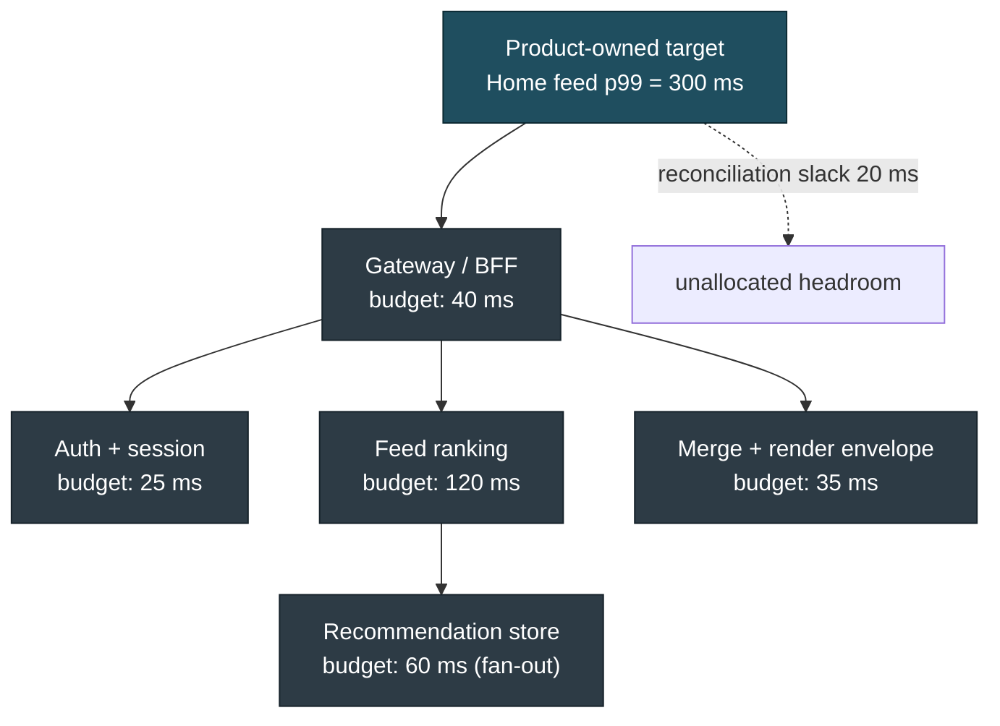
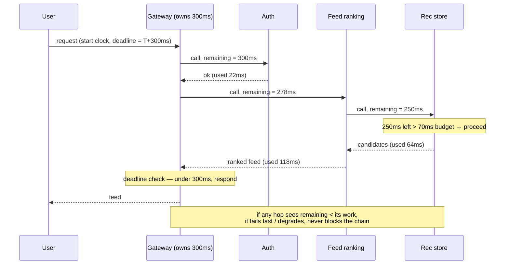
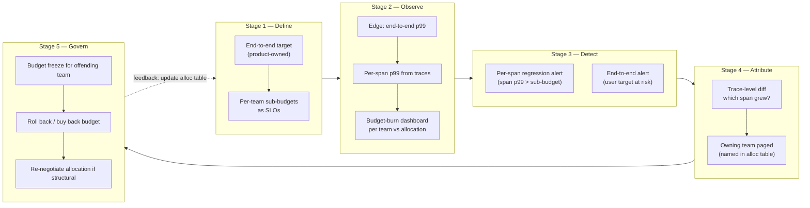

# Latency Budgets — Staff / Principal Level

A latency budget is not a performance optimization. It is an **organizational contract**: a single user-facing number, owned by the product, decomposed into per-team allocations, and enforced across service boundaries that no individual engineer controls end to end. At staff/principal level your job is less about shaving microseconds and more about answering three questions that span the whole company: *what is the user-facing target, who owns each slice of it, and what stops one team's regression from silently eating everyone else's headroom.*

This document treats latency as a product/business number and a cross-team SLO, not as more queueing theory. The math you need lives in the sibling pages; here we are concerned with revenue, allocation, cost, partner SLAs, and governance.

## Table of contents

1. [Latency is a business metric, not an engineering one](#1-latency-is-a-business-metric-not-an-engineering-one)
2. [From one user target to per-team sub-budgets](#2-from-one-user-target-to-per-team-sub-budgets)
3. [Worked example: a 300 ms budget across four teams](#3-worked-example-a-300-ms-budget-across-four-teams)
4. [Deadline propagation as the enforcement contract](#4-deadline-propagation-as-the-enforcement-contract)
5. [Cross-team enforcement: the staged regression-control loop](#5-cross-team-enforcement-the-staged-regression-control-loop)
6. [The cost of latency — buying the last 10 ms](#6-the-cost-of-latency--buying-the-last-10-ms)
7. [Latency SLAs with partners and customers](#7-latency-slas-with-partners-and-customers)
8. [Governance: who owns the end-to-end budget](#8-governance-who-owns-the-end-to-end-budget)
9. [Anti-patterns and staff-level judgment calls](#9-anti-patterns-and-staff-level-judgment-calls)
10. [Checklist](#10-checklist)

---

## 1. Latency is a business metric, not an engineering one

The reason latency deserves a *budget* — a governed, allocated, defended number — rather than a best-effort target is that latency moves money. The canonical industry results are worth knowing precisely, because they are the lever you use to get latency funded as a first-class product KPI rather than a backlog item that loses to features every quarter.

| Source | Reported effect | Why it matters for budgeting |
|---|---|---|
| Amazon | ~100 ms of added latency cost roughly **1% of sales** | Establishes latency as directly revenue-linked, not a vanity metric |
| Google (search) | An extra **500 ms** of delay drove a **~20% drop in traffic/searches** | Shows the effect is non-linear and large at the margins users actually feel |
| Google / Bing joint study | Delays of **500 ms–2 s** measurably reduced queries-per-user and revenue-per-user, with effects that *persisted* after speed was restored | Latency damage has hysteresis — users don't fully come back |
| Akamai / retail studies | A large fraction of users abandon a page that takes more than a few seconds; conversion falls as load time climbs | Connects latency to the conversion funnel product owners already track |

Treat these as **direction and order of magnitude**, not as laws of physics for your product. The studies are old, the populations differ, and your own A/B latency-injection experiment is the only number you should put in a planning doc. But the shape is consistent everywhere it has been measured: latency is roughly linear in lost revenue/engagement over the range users notice, the effect is real at tens-to-hundreds of milliseconds, and it does not recover instantly.

The organizational consequence is the actual point of this section:

- **Latency is a product KPI, and product owns it.** If the only people who care about p99 are SREs, latency will lose every prioritization fight against shipping features — because the people who decide priorities don't see latency on their dashboard. The budget exists so that "we spent 40 ms of the checkout budget on this new fraud check" is a sentence a PM can say in a planning meeting.
- **It must be expressed in the user's terms.** Not "the recommendation service p99 is 80 ms" but "the home feed renders meaningful content in under 1 s for 99% of sessions." The user-facing number is what the business signed up to defend; the per-service numbers are implementation detail derived from it.
- **It must be a *distribution*, not a mean.** A budget of "200 ms average" is meaningless — the average hides the tail, and the tail is what users abandon over. Budgets are stated at percentiles: p50 for the typical experience, p99 (or p99.9) for the worst experience you're willing to ship. Most of this document's hard problems are tail problems.

A useful staff-level framing: **a latency budget is the SLO that the product, not engineering, signs.** Engineering then decomposes it.

---

## 2. From one user target to per-team sub-budgets

You start with one number that product owns — say, *home feed interactive in 300 ms at p99 for logged-in users*. That number is a constraint on a request path that crosses many teams. Budget allocation is the act of cutting that single constraint into per-service slices, each of which becomes an SLO that one team owns and is on the hook for.

The decomposition rule for **sequential** work is additive at each percentile, with one critical caveat: **percentiles do not add cleanly.** If service A's p99 is 50 ms and service B's p99 is 50 ms, the chain's p99 is *not* 100 ms — the chain p99 is usually better than the sum of component p99s, because both services rarely hit their tail on the same request. Conversely, **fan-out** is worse than any single call: when a request waits on N parallel backends, its latency is the *maximum* of the N, so a backend that is fast at p99 but has a fat p99.9 tail will dominate the parent's p99 as N grows. Allocate accordingly:

- **Sequential dependencies:** allocate the budget as a sum of per-service budgets, then add a reconciliation slack (typically 10–20% of the total) so the chain's measured p99 lands inside the user target. Tighten by measuring, not by assuming sum-of-p99s.
- **Parallel fan-out:** the parent's budget is the budget of its *slowest required* child plus merge cost. Every fan-out child must independently meet the target percentile, and you must budget for the long-tail child. This is where hedged requests, tail-tolerant designs, and "wait for k of n" patterns earn their keep.
- **Network and serialization:** allocate explicit budget for inter-service hops (RPC, TLS, serialization, queueing) — these are nobody's "feature" so they get forgotten, then they eat 30% of the budget in a fan-out-heavy path.

The allocation is only real if three properties hold. First, **every slice has exactly one owning team** — a budget owned by "the platform" is owned by no one. Second, **each slice is an SLO with an error budget**, so a team that blows its latency slice triggers the same response as blowing an availability SLO (freeze, investigate, roll back). Third, **the slices sum (with slack) to the user target**, and that arithmetic is written down somewhere a planning meeting can see it.

---

## 3. Worked example: a 300 ms budget across four teams

Take the concrete path: a logged-in user opens the home feed, and product has committed to **300 ms at p99** for "interactive content visible." The request flows through four teams. Here is the allocation table — the single most important artifact this document produces, because it is the thing teams actually sign.

| # | Service / span | Sub-budget (p99) | Owning team | What it covers | Enforcement signal |
|---|---|---|---|---|---|
| 1 | Edge + Gateway/BFF | 45 ms | Edge Platform | TLS termination, routing, request shaping, response assembly, gzip | p99 measured at the edge, per-route |
| 2 | Auth & session resolution | 25 ms | Identity | Token validation, session lookup, entitlement check (cached) | p99 of auth RPC, cache hit ratio |
| 3 | Feed ranking service | 120 ms | Feed/ML | Candidate generation, model scoring, business-rule filtering | p99 of rank call, model inference p99 |
| 4 | Recommendation/candidate store (fan-out) | 70 ms | Data Platform | Parallel reads across N shards, returns top-K candidates | p99 of *slowest required shard*, not mean |
| — | Reconciliation slack | 40 ms | End-to-end owner | Inter-hop network, serialization, scheduling jitter, percentile non-additivity | gap between Σ sub-budgets and user target |
| | **Total** | **300 ms** | | | end-to-end p99 measured at edge |

Read the table carefully, because the design decisions are encoded in it:

- **Feed/ML gets the largest slice (120 ms)** because model scoring is genuinely expensive and is where the product value lives. Budget follows value, not fairness. A staff engineer resists the instinct to split evenly.
- **The recommendation store budget is stated as "slowest required shard," not mean.** Span 4 is a fan-out; its p99 is the max over shards. If Data Platform reports a healthy *mean* of 20 ms while one shard's p99.9 is 200 ms, the parent's p99 is blown and the team is technically meeting a metric that doesn't matter. The enforcement signal column forces the right metric.
- **The 40 ms slack is owned by the end-to-end owner, not donated to a team.** This is the buffer that absorbs percentile non-additivity and network reality. If a team wants to grow into the slack ("we need 15 more ms for a better model"), that is a *negotiation against the buffer*, conducted in the open, not a silent overrun.
- **Every row names a team and a signal.** A row without an owner is a latency leak waiting to happen; a row without a measurable signal is an SLO you cannot enforce.

The key staff move: this table is reviewed every planning cycle. When Feed/ML wants to ship a heavier model, the conversation is "you're asking for 135 ms; that's 15 ms over budget — do we buy it from slack, take it from another team, or improve the gateway to free up room?" The budget turns a quiet performance regression into an explicit, fundable trade.

---

## 4. Deadline propagation as the enforcement contract

An allocation table is a planning document. **Deadline propagation is how the allocation becomes self-enforcing at runtime** — it is the mechanism that prevents a slow service from making the *whole request* slow, and it is the contract that makes per-team budgets mean something to a running system.

The pattern: the entry point (gateway) stamps each request with an absolute deadline — "this request must complete by T+300 ms." Every downstream call passes the *remaining* time, and every service refuses to start work it cannot finish in time:

Why this is the enforcement contract and not just a resilience trick:

- **It converts a budget into a runtime invariant.** A team that consumes more than its slice doesn't silently steal from downstream — the deadline arrives, downstream callers see negative remaining time, and the system *fails fast or degrades* rather than letting one overrun cascade. The budget defends itself.
- **It localizes blame.** When a request times out, deadline propagation tells you *which* hop ran out of budget. Without it, every team points at every other team and you spend a war room arguing about whose dashboard is right. With it, the answer is in the trace.
- **It enables graceful degradation tied to the budget.** If only 40 ms remain and ranking needs 120, the system can return a cached/simpler feed instead of timing out. Degradation policy is a *budget decision*: "below X ms remaining, skip personalization." This is a product-owned rule, not an engineering convenience.
- **It is the only honest way to enforce fan-out budgets.** In a parallel fan-out, you cancel the slow children once you have enough responses (or the deadline forces it), bounding the parent at its budget regardless of one shard's tail.

The contract obligations are concrete and should be in your platform standards: every RPC carries a deadline; every service checks remaining time *before* expensive work; deadlines are *propagated, never reset* by intermediate hops (a service that resets the clock breaks the whole chain); and retries must fit inside the remaining budget, not restart it. A service that ignores propagated deadlines is, in budget terms, an untrustworthy partner — it can blow the user target while every component dashboard looks green.

---

## 5. Cross-team enforcement: the staged regression-control loop

The hardest failure mode in latency budgeting is the **silent regression**: Team C ships a change that adds 18 ms to their slice, every component SLO is still "green" because each was set with slack, and three weeks later the end-to-end p99 has drifted from 280 ms to 310 ms with no single alert firing. By the time product notices the conversion dip, the regression is buried under twenty deploys and nobody can name the cause.

Staff-level enforcement is a *staged control loop* that catches drift before it reaches the user and assigns it to an owner. The stages:

Each stage has a non-obvious staff requirement:

- **Stage 1 — Define.** The sub-budgets must be SLOs with **error budgets**, so latency gets the same enforcement machinery as availability. "We exceeded the latency SLO" must mean something — a freeze, an action item — or the budget is decoration.
- **Stage 2 — Observe.** You cannot enforce what you can't attribute. This requires **distributed tracing with per-span timing** wired to a budget-burn dashboard that shows each team's actual p99 against its allocation. The dashboard, not a Slack thread, is the source of truth.
- **Stage 3 — Detect.** Alert at *two* levels. Per-span alerts catch a single team's regression early (before it reaches the user). The end-to-end alert is the backstop for the case that no single span blew its budget but the *combination* drifted (percentile non-additivity working against you). Without the per-span alert, you only find out at the user.
- **Stage 4 — Attribute.** The alert must page the **owning team named in the allocation table**, automatically. The whole point of one-owner-per-slice is that attribution is mechanical, not political.
- **Stage 5 — Govern.** The response to a confirmed regression: freeze the offending team's latency-affecting deploys, roll back or "buy back" the budget (optimize elsewhere), and if the regression is *structural and justified* (the new model really is worth 15 ms), re-open the allocation table and re-negotiate — possibly buying the latency back with the cost-of-latency techniques in §6.

The loop's value is that it makes **regressions loud and owned** instead of quiet and orphaned. The single biggest difference between an organization that hits its latency target and one that slowly drifts off it is whether this loop exists and has teeth.

---

## 6. The cost of latency — buying the last 10 ms

Latency reduction has sharply **diminishing returns**: each additional millisecond shaved off the tail costs more than the last. The first 100 ms of improvement might come from an obvious N+1 query fix (nearly free). The last 10 ms — getting from p99 = 60 ms to p99 = 50 ms — can require edge POPs on three continents, precomputed materializations, or doubling your replica count to thin the tail. The staff question is never "can we make it faster" — it is **"is the next 10 ms worth what it costs, in revenue terms?"**

| Technique to buy latency | Typical latency bought | Cost driver | When it's worth it |
|---|---|---|---|
| Fix obvious waste (N+1, missing index, sync→async) | tens–hundreds of ms | Engineering time only, one-off | Always — this is free latency |
| Add cache layer / increase cache TTL | tens of ms on hits | Memory, staleness/correctness risk | Read-heavy, tolerant of slight staleness |
| Precompute / materialize on write | moves cost off the read path | More write cost, storage, freshness lag | Read:write ratio high, value fits precompute |
| Add read replicas | thins the tail (less queueing) | Linear $ per replica, replication lag | Tail driven by contention, not compute |
| Edge POPs / CDN for dynamic content | cuts RTT, big for distant users | High fixed + ongoing infra cost | Geographically dispersed users, RTT-bound |
| Hedged / tail-tolerant requests | cuts p99.9 specifically | Extra load (duplicate work) | Tail dominated by occasional slow nodes |
| Co-locate services / cut a network hop | one RTT + serialization | Architectural coupling cost | Chatty paths inside the budget |

The decision framework a staff engineer brings:

- **Quantify the latency you're buying in revenue, not milliseconds.** Using your *own* latency-injection A/B result (per §1), "10 ms is worth ~$X/year in conversion." Now compare to the annualized cost of the edge POPs that buy it. If the POPs cost more than the latency is worth, *don't buy it* — that's the right call, and saying so is a staff-level act of judgment, not a failure to optimize.
- **Spend the cheap latency first, always.** Never authorize edge infrastructure while an N+1 query is still in the path. The diminishing-returns curve means the order of operations dominates the economics.
- **Know where you are on the curve.** Going from 1 s to 500 ms is almost always worth it (large revenue effect, usually cheap fixes available). Going from 60 ms to 50 ms may be worth nothing — the user can't perceive it and the conversion delta is in the noise. **Buy latency where the revenue curve is steep, stop where it flattens.**
- **Budget the cost, not just the latency.** "We will hold p99 at 300 ms" has a price tag — replicas, POPs, cache infra. That price is part of the latency budget's *total cost of ownership* and belongs in the same planning conversation as the latency number itself.

The mature position: a latency budget is a *spending* budget in two currencies at once — milliseconds and dollars. You are constantly trading one for the other, and the exchange rate is set by your measured revenue-per-millisecond.

---

## 7. Latency SLAs with partners and customers

Internal sub-budgets are SLOs — internal goals with internal consequences. When latency is promised to a *paying customer or external partner*, it becomes an **SLA**: a contractual commitment with financial penalties (credits, breach clauses) for missing it. The escalation from SLO to SLA changes how conservatively you must budget.

Key distinctions a staff engineer must get right:

- **SLA targets are looser than internal SLOs, deliberately.** If you internally aim for p99 = 100 ms, you do *not* sign an SLA at 100 ms — you sign at, say, 250 ms, leaving a margin so that normal variance and the occasional bad day don't trigger contractual penalties. The internal SLO is your operating target; the external SLA is the line below which you pay money. Confusing the two is how teams end up writing checks for transient blips.
- **Specify the percentile, the measurement point, and the exclusions.** "p99 latency under 200 ms" is incomplete. *Measured where* — at your edge or at the customer's client (which includes the internet path you don't control)? *Excluding what* — maintenance windows, the customer's own slow callbacks, force-majeure regional outages? Ambiguity here is litigated, not debugged.
- **Dependencies in an SLA path must themselves be under SLA.** If your 200 ms customer SLA depends on a third-party API you call synchronously, your SLA is only as strong as *their* SLA to you. Either get a back-to-back SLA from them, make the dependency async/optional, or budget for their worst case. A staff engineer maps the SLA's critical path and refuses to sign a number you can't independently defend.
- **The SLA must trace back to an internal budget you actually own.** Never sign an external latency number that isn't backed by an allocation table and a deadline-propagation contract internally. The SLA is the *output* of your budgeting discipline, not a number sales picked.

The governance link: external SLAs are the strongest possible forcing function for internal budget hygiene, because a breach costs cash and reaches the executive level. Use them — when latency keeps losing to features internally, a customer SLA is often what finally gets the budget funded.

---

## 8. Governance: who owns the end-to-end budget

Here is the structural problem at the center of latency budgeting: **the user-facing target spans teams, but org charts assign ownership to services, not to user journeys.** Team A owns the gateway, Team B owns auth, Team C owns ranking — and *nobody* owns "the home feed loads in 300 ms." Each team can be green while the user experience is red. This is the single most common reason latency budgets fail in large organizations.

The governance answer is to **name an end-to-end owner for the budget itself**, separate from any single service owner:

- **Assign a single accountable owner per user-facing latency target.** This is usually a staff/principal engineer or a small "journey" owner role, explicitly responsible for the *number*, with the authority to convene teams and freeze deploys when the budget is breached. Without a named owner, the budget is everyone's responsibility, which is no one's.
- **The owner maintains the allocation table and the budget-burn dashboard.** They are the keeper of the §3 table and the arbiter of §5's enforcement loop. When Feed/ML wants 15 more ms, they negotiate against the owner, not against a vacuum.
- **Make budget overrun a blocking event, not a tracking metric.** A regression that breaches the end-to-end budget triggers the same gravity as an availability incident: investigation, rollback, and — if the team can't recover — a freeze. If breaching the budget has no consequence, the budget is a wish.
- **Tie the budget to a product KPI with an executive sponsor.** The end-to-end owner needs air cover. The latency target should map to a metric a VP cares about (conversion, retention, NPS) so that "we're over latency budget" is a sentence with weight in a prioritization meeting. This is the §1 point made operational.
- **Review the budget every planning cycle.** Allocations are not set once. As traffic grows, fan-out widens, and new features land, the table drifts. The owner re-derives it each cycle and re-negotiates slices openly.

A concise way to state the whole governance model: **someone must own the sum, or every team will optimize their part while the whole gets slower.** The silent-regression failure of §5 is, at root, a governance failure — it happens precisely when no one owns the end-to-end number and so no one is watching the place where the regression shows up.

---

## 9. Anti-patterns and staff-level judgment calls

- **Budgeting the mean instead of the tail.** Means hide the experience users abandon over. Budget at p99/p99.9. The entire document's hard problems are tail problems; a mean-based budget is no budget.
- **Summing component p99s and calling it the end-to-end p99.** Percentiles don't add. Sequential chains are usually better than the sum (uncorrelated tails); fan-out is worse than any child (max of N). Measure the end-to-end number; use sums only as a planning starting point with slack.
- **Sub-budgets with no owner.** A slice owned by "the platform" is owned by no one and becomes the place regressions hide. One team per row, always.
- **Resetting deadlines mid-chain.** An intermediate service that restarts the clock breaks the whole enforcement contract — it can let a request run far past the user target while looking locally healthy. Propagate, never reset.
- **Signing an SLA at your internal SLO number.** No margin means you pay penalties on normal variance. SLAs are looser than SLOs by design.
- **Buying expensive latency before cheap latency.** Authorizing edge POPs while an N+1 query is in the path. Spend free latency first; the diminishing-returns curve makes order-of-operations dominate the economics.
- **Optimizing past the revenue curve's flat region.** Spending engineer-quarters to go from 50 ms to 45 ms that no user perceives and no conversion metric reflects. Knowing when to *stop* is as senior as knowing how to speed up.
- **Treating latency as engineering-only.** If product doesn't own the user-facing number, latency loses every prioritization fight. The budget exists to put latency on the product owner's dashboard.
- **No end-to-end owner.** Every team green, user experience red, no one accountable for the sum. This is the governance failure that produces silent regressions.

The throughline of staff-level judgment here is *economic and organizational*, not technical: know the revenue value of a millisecond on your product, spend the budget where that value is steep, stop where it flattens, give every slice an owner, give the sum an owner, and make the enforcement loud enough that a regression cannot hide.

---

## 10. Checklist

- [ ] The user-facing latency target is a **product-owned KPI**, stated as a percentile distribution in the user's terms.
- [ ] The target is decomposed into **per-team sub-budgets**, each an SLO with an error budget and exactly one owner.
- [ ] An **allocation table** (service → sub-budget → owner → signal) exists, is written down, and is reviewed every planning cycle.
- [ ] Fan-out budgets are stated as **"slowest required child,"** not mean; reconciliation slack absorbs percentile non-additivity.
- [ ] **Deadline propagation** is enforced platform-wide: deadlines carried, checked before expensive work, never reset, retries fit remaining budget.
- [ ] A **budget-burn dashboard** fed by distributed tracing shows each team's actual p99 vs allocation.
- [ ] **Two-level alerting** (per-span and end-to-end) catches silent drift; alerts page the owning team automatically.
- [ ] Budget breach is a **blocking, owned event** with freeze/rollback/re-negotiate consequences.
- [ ] Latency-buying decisions are evaluated in **revenue terms** against cost; cheap latency is spent before expensive latency.
- [ ] External **SLAs are looser than internal SLOs**, specify percentile/measurement-point/exclusions, and trace back to an owned internal budget.
- [ ] A **single named end-to-end owner** is accountable for the sum, with authority and an executive-sponsored product KPI behind them.

---

*Next step:* [Interview questions](interview.md)
