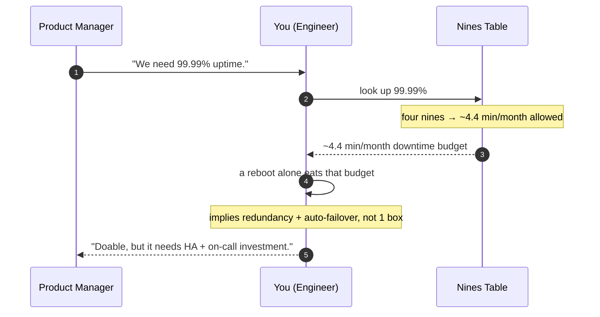

# Number Tables — Junior

<!-- level-focus -->
At junior level, focus on this question:

> How can I apply **Number Tables** in one small example and prove the result?

Use the smallest realistic scenario that exposes the decision and its failure behavior.
Back-of-envelope estimation is the senior-engineer party trick that looks like magic but is really just arithmetic on a handful of memorized numbers. This page is that handful. It is **the cheat sheet** — the curated reference tables you keep open in another tab (or, eventually, in your head) so that when an interviewer or a design doc asks *"can one box handle this?"*, you can answer in 30 seconds instead of 30 minutes.

Important framing: this topic is the **toolkit**, not the **technique**. Here we collect and learn to *read* the numbers. The next topic teaches you how to *combine* them into an estimate. Think of this as memorizing your multiplication tables before you do long division.

## 1. How to use these tables

Every table below follows the same shape: the raw number, a rounded "easy" version, and a one-line reason it earns a spot on your cheat sheet. **You almost never need the precise figure.** Back-of-envelope work runs on order-of-magnitude reasoning: is this a thousand, a million, or a billion? Getting the *power of ten* right matters far more than getting the leading digit right.

Three rules govern how to read everything that follows:

- **Round aggressively.** `1,048,576` is "a million." `86,400` is "about 100,000." Precision is the enemy of speed and adds nothing to a sanity check.
- **Track the unit, not the digits.** The dangerous errors are unit errors — confusing milliseconds with microseconds, megabits with megabytes, requests-per-second with requests-per-day. A digit error makes you 2× off; a unit error makes you 1000× off.
- **Anchor, don't derive.** These numbers are *anchors* — fixed reference points you trust without re-deriving. You don't recompute the speed of light every time; you don't recompute "a disk seek is ~10 ms" either.

The flow you'll repeat for the rest of your career:

> 🎞️ **See it animated:** [Latency Numbers Every Programmer Should Know](https://colin-scott.github.io/personal_website/research/interactive_latency.html)

---

## 2. The latency ladder

This is the single most famous table in systems engineering. It tells you how long different operations take, ordered from fastest (CPU cache) to slowest (a packet crossing the planet). The numbers span **eight orders of magnitude** — from sub-nanosecond to hundreds of milliseconds — which is exactly why memorizing them pays off: the gaps are huge, and a design that puts a slow operation on a hot path is a design that won't scale.

The killer feature of this table is the **"scaled to human time"** column. Computer time is too small to feel. So we multiply every number by roughly one billion, turning nanoseconds into seconds. Now an L1 cache hit feels like *one second*, and a trip to spinning disk feels like *months*. Suddenly the cost of a cache miss is visceral.

| Operation                          | Real latency   | Scaled (×~1 billion) | Why you keep this handy |
|------------------------------------|----------------|----------------------|-------------------------|
| L1 cache reference                 | ~0.5 ns        | ~0.5 sec             | The baseline "free" operation — your unit of 1. |
| Branch mispredict                  | ~5 ns          | ~5 sec               | Reminds you that control flow isn't free. |
| L2 cache reference                 | ~7 ns          | ~7 sec               | ~14× slower than L1; the first real cliff. |
| Mutex lock/unlock                  | ~25 ns         | ~25 sec              | Cheap, but contention multiplies it fast. |
| Main memory (RAM) reference        | ~100 ns        | ~100 sec (~1.5 min)  | RAM is ~200× slower than L1 — the "memory wall." |
| Compress 1 KB (fast algo)          | ~3 µs          | ~50 min              | CPU work on real payloads costs real time. |
| Read 1 MB sequentially from RAM    | ~10 µs         | ~3 hours             | Sets your "memory bandwidth" intuition. |
| SSD random read                    | ~100 µs        | ~1 day               | SSD ≈ 1000× slower than RAM, 1000× faster than disk seek. |
| Round trip within same datacenter  | ~500 µs        | ~6 days              | The cost of *any* network hop to a sibling service. |
| Read 1 MB sequentially from SSD    | ~1 ms          | ~11 days             | Streaming from flash; compare to RAM's 10 µs. |
| Disk seek (spinning HDD)           | ~10 ms         | ~4 months            | The classic "avoid random disk I/O" red flag. |
| Read 1 MB sequentially from HDD    | ~20 ms         | ~8 months            | Sequential disk is OK; *random* disk is death. |
| Round trip California ↔ Netherlands| ~150 ms        | ~5 years             | Cross-continent RTT — bounded by the speed of light. |

**How to read it.** Find your operation, glance one column right for the human-scale feel. The three numbers to tattoo on your brain: **RAM ≈ 100 ns**, **SSD read ≈ 100 µs**, **disk seek ≈ 10 ms**, and **same-DC round trip ≈ 0.5 ms**. Everything else you can interpolate.

**The pattern underneath.** Each major tier is roughly 10–1000× slower than the one above it.

| Jump                       | Approximate factor |
|----------------------------|--------------------|
| L1 → RAM                   | ~200×              |
| RAM → SSD                  | ~1,000×            |
| SSD → disk seek            | ~100×              |
| Same-DC → cross-continent  | ~300×              |

Two cross-cutting truths fall out of this table:
- **Cross-continent latency is physics, not engineering.** Light in fiber travels ~200,000 km/s. A round trip to the other side of the planet (~20,000 km × 2) costs ~150–200 ms no matter how much money you throw at it. You cannot buy your way under the speed of light — you can only move the data closer (caches, CDNs, regional replicas).
- **Sequential beats random by orders of magnitude**, especially on disk. This single fact shapes how databases, log-structured storage, and file formats are designed.

---

## 3. Powers of two and data-size units

Computers count in binary, so capacities, address spaces, and sizes cluster around powers of two. You need fluency in `2^n` because storage and memory questions ("how many bytes for a billion users?") resolve into them constantly. The magic trick that makes this table usable for mental math: **`2^10 ≈ 10^3`**. One kibi is about one thousand. That tiny approximation lets you bounce between binary and decimal without a calculator.

| Power   | Exact value           | Approx (≈10ⁿ) | Unit name | Why you keep this handy |
|---------|-----------------------|---------------|-----------|-------------------------|
| 2^10    | 1,024                 | ~10³ (thousand) | 1 KB     | The foundational ≈1000 approximation. |
| 2^16    | 65,536                | ~6.5×10⁴      | —         | Max value of a 16-bit number; port count, `uint16`. |
| 2^20    | 1,048,576             | ~10⁶ (million)  | 1 MB     | "A million-ish" — covers most cache/object sizes. |
| 2^30    | 1,073,741,824         | ~10⁹ (billion)  | 1 GB     | RAM and file sizes live here. |
| 2^32    | 4,294,967,296         | ~4×10⁹        | —         | The 32-bit ceiling: ~4 billion (IPv4 space, `uint32`). |
| 2^40    | ~1.1×10¹²             | ~10¹² (trillion)| 1 TB     | Disk and dataset sizes. |
| 2^50    | ~1.1×10¹⁵             | ~10¹⁵ (quadrillion)| 1 PB  | "Big data" scale — total fleet storage. |

**The unit ladder.** Each step up is **×1024 in binary** but you treat it as **×1000 in decimal**:

| Unit | Bytes (decimal approx) | Real-world anchor |
|------|------------------------|-------------------|
| 1 KB | ~10³ bytes             | A short email, a small JSON payload. |
| 1 MB | ~10⁶ bytes             | A high-res photo, a minute of MP3. |
| 1 GB | ~10⁹ bytes             | A movie, a small database, a RAM stick's worth. |
| 1 TB | ~10¹² bytes            | A modern SSD, a year of one person's photos. |
| 1 PB | ~10¹⁵ bytes            | A large company's entire dataset. |

**How to read it.** Counting users or events? Translate to a power of ten, then know that 10³≈KB, 10⁶≈MB, 10⁹≈GB. For example: "1 billion 1 KB records" = 10⁹ × 10³ bytes = 10¹² bytes = **~1 TB**. You just did a storage estimate in your head, and the only fact you needed was `2^10 ≈ 10^3`.

**One more critical distinction: bits vs. bytes.** Network speeds are quoted in **bits** per second (Gbps); storage and memory in **bytes**. There are 8 bits in a byte. A "1 Gbps" link moves ~125 **MB**/s, not 1 GB/s. Mixing these up is the single most common back-of-envelope blunder — see §6 and §10.

---

## 4. Typical object sizes

Estimation questions almost always start with *"how big is one of these?"* — one user record, one tweet, one photo. Multiply that by *"how many?"* and you have storage and bandwidth. So you keep a rough size for every common object. None of these are exact; they're "good enough to be within 2×" anchors.

| Object                        | Rough size      | Why you keep this handy |
|-------------------------------|-----------------|-------------------------|
| One ASCII character           | 1 byte          | The atom of text sizing. |
| One Unicode char (UTF-8)      | 1–4 bytes       | Reminds you non-English text inflates size. |
| Integer (`int32` / `int64`)   | 4 / 8 bytes     | Counting numeric columns and IDs. |
| Boolean / small enum          | 1 byte          | Flags are cheap; rarely the bottleneck. |
| UUID (128-bit, as bytes/text) | 16 B / 36 chars | Every distributed ID costs more as text than binary. |
| Timestamp (epoch)             | 8 bytes         | Logs and events are full of these. |
| A typical database row        | ~100 B – 1 KB   | The workhorse unit for storage estimates. |
| A tweet / short post (text)   | ~200 – 300 B    | Classic "design a feed" estimation seed. |
| A small JSON API response     | ~1 – 10 KB      | Sizing bandwidth for chatty APIs. |
| A web page (HTML, no assets)  | ~50 – 100 KB    | Front-end transfer budgets. |
| A photo (compressed JPEG)     | ~200 KB – 2 MB  | Image-heavy product storage. |
| One minute of video (1080p)   | ~5 – 50 MB      | Streaming/upload bandwidth — varies with codec & bitrate. |
| One minute of audio (MP3)     | ~1 MB           | Podcast/voice storage. |

**How to read it.** Reach for the row that matches the dominant payload in your system. For a text-only social feed, the **tweet ≈ 300 bytes** anchor drives everything. For a photo-sharing app, the **photo ≈ 1 MB** anchor dominates and you can ignore the text metadata entirely (it's three orders of magnitude smaller — round it away). Knowing which object dominates is half the skill: in any estimate, the largest object usually swamps everything else, so find it first and ignore the rest.

A worked micro-example, just to see the anchors compose:

> *"Store 500 million tweets."*
> 500M × 300 B ≈ (5×10⁸) × (3×10²) = 15×10¹⁰ = **~150 GB** of raw text.
> Add overhead (indexes, metadata, replication ×3) and you're in the **~0.5–1 TB** ballpark. Good enough to decide "one beefy DB or a cluster?" — which is the entire point.

---

## 5. Availability: nines to downtime

Availability is quoted in **"nines"** — 99.9% is "three nines," 99.99% is "four nines." These percentages feel abstract until you convert them to **allowed downtime**, which is what actually matters: how many minutes per month is your system permitted to be broken? You keep this table because SLA conversations, on-call expectations, and architecture decisions ("do we need multi-region?") all hinge on which nine you're targeting.

| Availability | "Nines"     | Downtime / year  | Downtime / month | Downtime / day | Why you keep this handy |
|--------------|-------------|------------------|------------------|----------------|-------------------------|
| 90%          | one nine    | ~36.5 days       | ~3 days          | ~2.4 hours     | A toy/dev service; basically "best effort." |
| 99%          | two nines   | ~3.65 days       | ~7.2 hours       | ~14 min        | Internal tools tolerate this; users won't. |
| 99.9%        | three nines | ~8.76 hours      | ~43.8 min        | ~1.4 min       | The common baseline SaaS SLA. |
| 99.99%       | four nines  | ~52.6 min        | ~4.4 min         | ~8.6 sec       | "Serious product" target; needs redundancy. |
| 99.999%      | five nines  | ~5.26 min        | ~26 sec          | ~0.86 sec      | Telecom-grade; very expensive to reach. |

**How to read it.** Pick the nine in the SLA, read across to the downtime budget. The mental anchor worth memorizing: **three nines ≈ ~43 minutes/month**, and **each additional nine divides downtime by 10**. So four nines is ~4 minutes/month, five nines ~26 seconds/month.

**The cost intuition this table gives you (and why it's on the cheat sheet):**
- Every extra nine roughly **10×'s your engineering cost**. Going from 99.9% → 99.99% means eliminating 90% of your remaining downtime — that buys redundant instances, multi-AZ deployment, automated failover, and far more rigorous on-call.
- **Five nines is ~26 seconds of downtime per month.** That's less time than a single server reboot. You cannot achieve it with one machine, one datacenter, or any manual recovery process — it forces real distributed-systems work.
- A useful gut check: if someone casually promises "five nines" for a CRUD app on a single VM, the number table tells you it's not credible.



---

## 6. Throughput anchors

Latency answers *"how long does one operation take?"* Throughput answers *"how many can I do per second?"* These two are related but distinct, and throughput anchors are what let you size fleets: *"If one box does 5,000 requests/sec and we expect 50,000, we need ~10 boxes (plus headroom)."* You keep these because they convert demand into machine count — the bottom line of most capacity questions.

| Resource                          | Rough capacity        | Why you keep this handy |
|-----------------------------------|-----------------------|-------------------------|
| Single app server, simple request | ~1,000 – 10,000 RPS   | Sizing how many web boxes you need. |
| Redis / in-memory cache           | ~100,000+ ops/sec     | Why caches absorb read storms — they're ~100× a DB. |
| Database primary (writes)         | ~1,000 – 10,000 writes/sec | The classic write bottleneck; forces sharding. |
| Database (reads, with indexes)    | ~10,000 – 50,000 reads/sec | Why read replicas exist. |
| Message queue (Kafka, per broker) | ~100,000s msgs/sec    | High-throughput async pipelines. |
| 1 Gbps NIC                        | ~125 MB/sec           | Network bandwidth ceiling per link (bits→bytes!). |
| 10 Gbps NIC                       | ~1.25 GB/sec          | Modern server/DC network link. |
| SSD sequential read               | ~500 MB – 3 GB/sec    | Disk-bound batch jobs and scans. |
| SSD random read (IOPS)            | ~100,000s IOPS        | Random-access workloads on flash. |
| HDD sequential read               | ~100 – 200 MB/sec     | Cold-storage / archival throughput. |

**How to read it.** Take your required rate, divide by the per-unit anchor, round up, then **add headroom** (real systems should not run above ~70% of capacity — see Common Mistakes). Example: "We expect 30,000 reads/sec." A DB read replica does ~15,000/sec → you need ~2 replicas at the limit, so provision **3–4** for headroom and failure tolerance.

**The asymmetries to internalize** (these recur in nearly every design):
- **Writes are far more expensive than reads.** A DB might serve 50,000 reads/sec but only 5,000 writes/sec, because writes hit disk, update indexes, and need durability. Write-heavy systems hit walls first — and that's *why* sharding and write-optimized stores exist.
- **In-memory ≫ disk-backed.** Redis at 100,000+ ops/sec vs. a DB at 5,000 writes/sec is the entire economic argument for caching. One cache box can shield ten database boxes.
- **Network is bits, storage is bytes.** A 1 Gbps NIC moves ~125 MB/s. If each response is 1 MB, that single link tops out at ~125 responses/sec *on bandwidth alone* — often the hidden bottleneck people forget while obsessing over CPU.

---

## 7. Time conversions

Estimates constantly flip between rates and totals: "2 million requests per day — what's that per second?" To answer instantly you need the **number of seconds** in common time spans. You keep this because almost every capacity question hands you a *daily* or *monthly* total and asks for a *per-second* rate (or vice versa), and the conversion is just one division — *if* you have the seconds memorized.

| Time span | Seconds (exact)   | Easy approximation | Why you keep this handy |
|-----------|-------------------|--------------------|-------------------------|
| 1 minute  | 60                | 60                 | The base unit. |
| 1 hour    | 3,600             | ~3.6×10³           | Hourly batch windows. |
| 1 day     | 86,400            | **~10⁵** (100,000) | The workhorse: convert daily totals → RPS. |
| 1 month   | ~2,592,000        | **~2.6×10⁶**       | Monthly active users, billing cycles. |
| 1 year    | ~31,536,000       | **~π×10⁷ ≈ 3.15×10⁷** | The famous "pi times ten-to-the-seven" trick. |

**The three to memorize:**
- **1 day ≈ 86,400 ≈ 10⁵ seconds.** Rounding 86,400 up to 100,000 is the most useful approximation in the whole cheat sheet — it makes daily→per-second conversions trivial and only over-counts by ~15%, which is fine for a sanity check.
- **1 month ≈ 2.6 × 10⁶ seconds.** (30 days.) For MAU-style numbers.
- **1 year ≈ π × 10⁷ seconds.** A genuinely delightful coincidence: the real value is 31.5 million, and π×10⁷ = 31.4 million. Off by 0.4%. Engineers love this one because it's both precise and easy.

**How to read it (the daily-active-users pattern).** This conversion appears in *every* capacity estimate, so drill it:

> *"100 million requests per day. What's the average RPS?"*
> 100M / 86,400 ≈ 10⁸ / 10⁵ = **~1,000 RPS** average.
> But traffic isn't flat — peak is often **~2–3× the average**. So size for **~2,000–3,000 RPS**. Two divisions and a multiply, no calculator, and now you know roughly how many app servers (§6) you need.

---

## 8. A mini-walkthrough: looking up the number you need

The tables are only useful if you know *which* table to reach for. Here is the lookup loop in practice, end to end, for a single small question. Watch how each step pulls exactly one anchor from one table.

**Question:** *"We're designing a photo-sharing app. 10 million users each upload 2 photos per day. Roughly how much storage per year, and is a single DB primary enough for the write rate?"*

```mermaid
sequenceDiagram
    autonumber
    participant Q as Question
    participant T4 as §4 Object Sizes
    participant T7 as §7 Time
    participant T6 as §6 Throughput
    participant A as Answer

    Q->>Q: 10M users × 2 photos/day = 20M uploads/day
    Q->>T4: how big is one photo?
    Note over T4: photo ≈ 1 MB
    T4-->>Q: 20M × 1 MB = 20 TB/day
    Q->>T7: how many days in a year?
    Note over T7: 1 year ≈ 365 days
    T7-->>Q: 20 TB/day × 365 ≈ 7 PB/year
    Q->>T7: convert daily uploads → per second
    Note over T7: 1 day ≈ 10⁵ s
    T7-->>Q: 20M / 10⁵ ≈ 200 writes/sec avg
    Q->>T6: can one DB primary take it?
    Note over T6: DB primary ≈ 1k–10k writes/sec
    T6-->>Q: 200 (peak ~600) ≪ capacity → yes, easily
    Q->>A: ~7 PB/year storage; one primary handles metadata writes
```

Notice the discipline:
1. **Decompose into "how many × how big."** Everything starts as a count times a size.
2. **Pull anchors, don't derive them.** Photo ≈ 1 MB (§4), day ≈ 10⁵ s (§7), DB ≈ thousands of writes/sec (§6). No calculator touched.
3. **Round at every step.** 20 TB/day × 365 → "~7 PB/year," not "7,300 TB."
4. **Sanity check the unit and the verdict.** Storage came out in petabytes (plausible for photos at scale); write rate came out in the low hundreds/sec (trivial for one DB — the *bytes* are the challenge here, not the *write rate*). That mismatch is itself a finding: the photos go to blob storage, and the DB only stores tiny metadata rows.

That last insight — "storage is the hard part, the write rate is easy" — is exactly the kind of conclusion these tables let you reach in under a minute. You don't need the *exact* answer; you need to know *which dimension hurts*.

---

## 9. The one-page summary

If you internalize nothing else, internalize this. These are the dozen-odd anchors that cover ~80% of back-of-envelope questions.

| Category    | Anchor to memorize                                              |
|-------------|----------------------------------------------------------------|
| Latency     | RAM ≈ 100 ns · SSD read ≈ 100 µs · disk seek ≈ 10 ms           |
| Latency     | Same-DC RTT ≈ 0.5 ms · cross-continent RTT ≈ 150 ms           |
| Powers of 2 | 2^10 ≈ 10³ · 2^20 ≈ 10⁶ · 2^30 ≈ 10⁹ · 2^32 ≈ 4 billion       |
| Sizes       | char = 1 B · UUID = 16 B · tweet ≈ 300 B · row ≈ 1 KB · photo ≈ 1 MB |
| Bits/bytes  | 1 byte = 8 bits · 1 Gbps ≈ 125 MB/s                            |
| Availability| 3 nines ≈ 43 min/month · each extra nine ÷10 the downtime      |
| Throughput  | App box ≈ 1k–10k RPS · Redis ≈ 100k+ ops/s · DB writes ≈ 1k–10k/s |
| Time        | 1 day ≈ 10⁵ s · 1 month ≈ 2.6×10⁶ s · 1 year ≈ π×10⁷ s         |

---

## 10. Common mistakes

These are the errors that turn a 2× estimate into a 1000× estimate. The tables protect you only if you avoid these traps:

- **Bits vs. bytes.** Network is bits (Gbps), storage is bytes (GB). Always divide network bandwidth by 8 to get a byte rate. A "10 Gbps" link is ~1.25 GB/s, not 10 GB/s.
- **Confusing latency with throughput.** A 100 ms operation does *not* mean 10 requests/sec total — with concurrency, one machine handles many in flight at once. Latency is per-operation; throughput is aggregate. Keep them in separate columns of your head.
- **Forgetting peak ≠ average.** Daily total ÷ seconds gives the *average* rate. Real traffic spikes — size for peak, typically 2–3× average (sometimes 10× for spiky workloads).
- **Forgetting overhead.** Raw data size is never the storage bill. Add indexes, replication (usually ×3), metadata, and free-space headroom. A rule of thumb: multiply raw size by ~3–5×.
- **Running at 100% capacity.** Never size a fleet to run at its theoretical max. Target ~70% so you survive traffic spikes, a node failure, and deploys. If a box does 10k RPS, plan around 7k.
- **Over-precision.** Carrying `86,400` instead of `10⁵` through five steps wastes time and adds zero accuracy to an order-of-magnitude answer. Round early, round often.

---

## 11. What to memorize first

You don't need all of this on day one. Learn it in this order — each tier is enough to be genuinely useful:

1. **The big three latencies:** RAM ≈ 100 ns, SSD ≈ 100 µs, disk seek ≈ 10 ms. (Ratios of ~1000× and ~100×.)
2. **`2^10 ≈ 10^3`** and the KB→MB→GB→TB ladder. This unlocks all storage estimates.
3. **1 day ≈ 10⁵ seconds.** Unlocks all rate conversions.
4. **One server ≈ thousands of RPS; one DB ≈ thousands of writes/sec.** Unlocks all fleet-sizing.
5. **3 nines ≈ 43 min/month, each extra nine ÷10.** Unlocks all availability conversations.

Everything else you can look up or interpolate. The goal isn't to be a human calculator — it's to develop the reflex that says *"hold on, that number is off by a thousand"* before a bad design ships. Once these anchors live in your head, the next topic — turning them into full estimates — is just arithmetic.

*Next step:* [Middle level](middle.md)

---

## Apply it

1. Choose one small, known input for **Number Tables**.
2. Predict the output or observable behavior.
3. Run the smallest example or probe that exercises the concept.
4. Change one input to trigger a failure or boundary case.
5. Explain the evidence using the guide's vocabulary.

## Verify your work

- Record the exact input, command or code path, and output.
- Repeat the probe and confirm the result is consistent.
- Show one expected success and one expected failure.
- Resolve any difference between the prediction and the evidence.

## Review questions

- What problem does Number Tables solve in the example?
- Which input changes the observed result, and why?
- What is the smallest useful success check?
- Which beginner mistake would your evidence catch?
