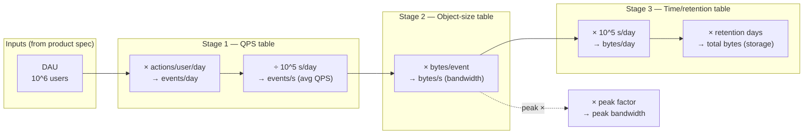

# Number Tables — Middle

<!-- level-focus -->
At middle level, focus on this question:

> Where does **Number Tables** belong in a maintainable component, and which trade-off selects the design?

Use the smallest realistic scenario that exposes the decision and its failure behavior.
You already have the reference tables memorized. The junior level handed you the raw numbers: latency ladder, QPS bands, object sizes, the byte/SI prefix ladder. This level is about *using them together*. A real estimate almost never comes from one table — it comes from **chaining** two or three of them and watching the units cancel until a single answer falls out. That discipline (round hard, carry units, cancel them, sanity-check the magnitude) is what separates someone who memorized a table from someone who can size a system on a whiteboard in ninety seconds.

## 1. Rounding and Unit Discipline

Three habits make back-of-envelope math fast and reliable. Skip any of them and you will either grind for minutes on arithmetic that doesn't matter or ship an answer off by 1000×.

**Habit 1 — Round to powers of ten.** You are estimating, not auditing. `86,400` seconds in a day becomes `10^5`. `1,048,576` bytes in a MiB becomes `10^6`. `73,000` QPS becomes `10^5` (or `7 × 10^4` if you want to keep the leading digit). The error you introduce by rounding is almost always smaller than the error already baked into your input assumptions — you guessed the QPS, so don't pretend the seventh significant figure matters.

**Habit 2 — Carry units on every line.** Write `bytes`, `req/s`, `GB/day` next to every number. Units are a free correctness checker: if your final answer reads `bytes·seconds` you chained something wrong. The unit you *want* tells you the operation you need — to turn `req/s` into `bytes/s` you must multiply by something measured in `bytes/req`, which immediately tells you to reach for the object-size table.

**Habit 3 — Cancel units explicitly.** Treat units as algebra. They multiply and divide and strike out, exactly like numbers:

```
   2000 req/s  ×  50 KB/req   =  100,000 KB/s  =  100 MB/s
        │            │
        └── req cancels ──┘   leaving KB/s
```

The `req` in the numerator of QPS cancels the `req` in the denominator of "KB per req," and you are left with `KB/s` — precisely the bandwidth unit you wanted. If the units don't cancel cleanly, you used the wrong table or inverted a factor.

The table below is the prefix ladder you round *to*. For estimation, the binary/decimal distinction (KiB vs KB) is noise — collapse both to powers of ten.

| Prefix | Decimal | Power | Binary (exact) | Estimate as |
|--------|---------|-------|----------------|-------------|
| Kilo   | 1,000   | 10^3  | 1,024 (KiB)    | 10^3 |
| Mega   | 1,000,000 | 10^6 | 1,048,576 (MiB) | 10^6 |
| Giga   | 10^9    | 10^9  | ~1.07×10^9 (GiB) | 10^9 |
| Tera   | 10^12   | 10^12 | ~1.10×10^12 (TiB) | 10^12 |
| Peta   | 10^15   | 10^15 | ~1.13×10^15 (PiB) | 10^15 |

The binary column drifts ~7% per step from the decimal one. Over four steps (GiB → TiB → PiB) the gap reaches ~13%, still well under the 2–3× uncertainty in your assumptions. Round to decimal and move on.

---

## 2. The Derived Constants Worth Memorizing

The reference tables give you raw numbers. But a handful of *combinations* recur so often that memorizing the combined result saves a multiplication step every single time. Burn these into muscle memory — they are the connective tissue between tables.

| Derived constant | Why it's true | What it converts |
|------------------|---------------|------------------|
| **1 Gbps ≈ 125 MB/s** | 10^9 bits ÷ 8 bits/byte = 1.25×10^8 bytes/s | network bandwidth (bits) → throughput (bytes) |
| **1 day ≈ 10^5 s** | 86,400 s rounded down | per-second rate → per-day volume |
| **1 M rows × 1 KB = 1 GB** | 10^6 × 10^3 = 10^9 bytes | row count × row size → storage |
| **1000 QPS × 1 KB = 1 MB/s** | 10^3 × 10^3 = 10^6 bytes/s | request rate × payload → bandwidth |
| **1 B rows × 1 KB = 1 TB** | 10^9 × 10^3 = 10^12 bytes | large row count → storage at scale |
| **2.5 M s ≈ 1 month** | 30 × 86,400 ≈ 2.6×10^6 | per-second rate → per-month volume |
| **3×10^7 s ≈ 1 year** | 365 × 86,400 ≈ 3.15×10^7 | per-second rate → annual volume |

Two of these deserve a second look because they collapse an entire estimate into one line:

- **"A day is 10^5 seconds."** Any per-second rate times `10^5` is its daily volume. 50 writes/s → 5 million writes/day. No calculator. The true value is 86,400, so you under-count by ~14% — deliberately conservative, which is the right direction for a headroom estimate, and trivially corrected by bumping the result up ~15% if precision ever matters.

- **"A million 1-KB rows is a gigabyte."** This is the storage table's single most useful anchor. Scale it freely: a *billion* 1-KB rows is a terabyte; a million *10-KB* rows is 10 GB. You rarely need anything else for a first-pass storage estimate.

These constants are not separate facts to memorize — each one is just two reference-table entries already multiplied together. Recognizing that is the whole point of this level.

---

## 3. Chaining Tables: The Core Technique

A chained estimate is a pipeline. Each stage takes the output of the previous one and multiplies by a factor pulled from a *different* table. The units thread through and cancel, and the magnitude grows or shrinks predictably. Here is the canonical storage-and-bandwidth chain laid out as stages — note how every arrow is "× a number from one named table."



Read the chain left to right and watch one thing: **the unit of the running value changes at every stage, and each change names the table you reach into.** You go from *users* → *events/s* (QPS table) → *bytes/s* (object-size table) → *bytes* (retention table). When you can name the table behind each arrow, you have understood the estimate; when you can't, you've memorized a recipe.

> 🎞️ **See it animated:** [Latency Numbers Every Programmer Should Know](https://colin-scott.github.io/personal_website/research/interactive_latency.html)

The mechanical procedure:

1. **Write the target unit first.** "I want GB/day." That fixes where the chain must end.
2. **Find your starting unit.** Usually a rate (QPS) or a count (users, rows).
3. **Bridge the gap with table lookups.** Each lookup is a conversion factor with units; pick the one whose units cancel toward the target.
4. **Round at every multiplication**, not just at the end — it keeps the mental arithmetic to single digits times powers of ten.
5. **Sanity-check the exponent.** The mantissa can be loose; an exponent that's off by one is a 10× error and the most common failure mode.

---

## 4. Worked Problem A: QPS × Object Size → Bandwidth

**Spec:** An image-thumbnail service serves 2,000 thumbnail requests per second. Each thumbnail is ~50 KB. What egress bandwidth do we need, and what does it cost in network terms?

**Step 1 — Identify the chain.** Target unit is bytes/s (then convert to a network rate). Start unit is req/s. Bridge with bytes/req from the object-size table.

```
   QPS table:          2,000 req/s
   Object-size table:  50 KB/req

   2,000 req/s  ×  50 KB/req  =  100,000 KB/s
        └──────── req cancels ────────┘
              = 10^5 KB/s = 100 MB/s
```

**Step 2 — Convert to a network bandwidth unit** using the derived constant `1 Gbps ≈ 125 MB/s`:

```
   100 MB/s  ÷  125 MB/s per Gbps  ≈  0.8 Gbps
```

So average egress is **100 MB/s ≈ 0.8 Gbps**. A single 1 Gbps NIC handles the *average* but leaves almost no headroom — and traffic is never flat.

**Step 3 — Apply a peak factor** (see §7). Thumbnails for a consumer app peak around 2–3× the daily average:

```
   100 MB/s  ×  3 (peak)  =  300 MB/s  ≈  2.4 Gbps peak
```

**Conclusion:** plan for ~2.4 Gbps at peak. That's past a single 1 Gbps link — you need either a 10 Gbps NIC, multiple load-balanced nodes, or (correctly) a CDN that absorbs this read-heavy static traffic at the edge. The estimate didn't just produce a number; it pointed at an architectural decision, and it took three multiplications.

---

## 5. Worked Problem B: Records × Size × Retention → Storage

**Spec:** A logging pipeline ingests events from 10 million daily active users. Each user generates ~20 log events/day. Each event is ~500 bytes. We retain logs for 90 days. How much storage, and what's the steady-state ingest bandwidth?

**Step 1 — Events per day** (DAU table × actions/user):

```
   10^7 users  ×  20 events/user/day  =  2 × 10^8 events/day
```

**Step 2 — Bytes per day** (× object-size table):

```
   2 × 10^8 events/day  ×  500 bytes/event
       └──────── events cancels ────────┘
   = 2 × 10^8 × 5 × 10^2  =  10^11 bytes/day  =  100 GB/day
```

**Step 3 — Storage over retention** (× retention from the time table):

```
   100 GB/day  ×  90 days  =  9,000 GB  ≈  9 TB
       └──── days cancels ────┘
```

**Step 4 — Add the replication factor.** Raw bytes are never the deployed bytes. A 3× replicated store (typical for durability) needs:

```
   9 TB  ×  3 (replicas)  =  27 TB raw disk
```

**Step 5 — Steady-state ingest bandwidth** (re-use the per-day figure ÷ the day constant):

```
   100 GB/day  ÷  10^5 s/day  =  10^11 bytes ÷ 10^5 s  =  10^6 bytes/s  =  1 MB/s
```

| Quantity | Value | Tables chained |
|----------|-------|----------------|
| Events/day | 2 × 10^8 | DAU × actions/user |
| Ingest volume | 100 GB/day | × object size |
| Logical storage (90 d) | 9 TB | × retention |
| Physical storage (3×) | 27 TB | × replication factor |
| Average ingest rate | 1 MB/s | ÷ day constant |

**Conclusion:** 1 MB/s average ingest is trivial; 27 TB of replicated storage growing 100 GB/day (≈ 3 TB/month) is the real story. The estimate tells you to invest in tiered storage and a retention policy, not in ingest throughput. Notice how `1 M rows × 1 KB = 1 GB` would have gotten you to the same daily figure faster: 2×10^8 events at 500 B = half of "(2×10^8) KB" = 10^8 KB = 100 GB.

---

## 6. Worked Problem C: Latency Ladder → A Request Budget

The latency table isn't only for "is this fast enough?" — chained, it tells you how many serial operations fit inside a latency budget, which directly bounds your design.

**Spec:** A product page must render server-side in under 200 ms (P99). Each render fans out to fetch user profile, cart, recommendations, and inventory. What does the latency ladder permit?

The ladder entries you'll pull (rounded, single-machine / same-datacenter):

| Operation | Rounded latency | Budget fraction (of 200 ms) |
|-----------|-----------------|-----------------------------|
| L1 cache reference | ~1 ns | negligible |
| Main memory reference | ~100 ns | negligible |
| Read 1 MB sequentially from memory | ~10 µs | 0.005% |
| Round trip within same datacenter | ~0.5 ms | 0.25% |
| Read 1 MB sequentially from SSD | ~1 ms | 0.5% |
| Disk seek (HDD) | ~10 ms | 5% |
| Read 1 MB from disk (HDD) | ~20 ms | 10% |
| Round trip CA ↔ Netherlands | ~150 ms | 75% |

**The budget arithmetic.** With a 200 ms budget:

```
   Same-datacenter round trip:  0.5 ms each.
   200 ms ÷ 0.5 ms  =  400 sequential DC round trips possible — in principle.
```

But you don't get to spend all 400. Reserve half the budget for the slowest dependency and serialization overhead, and you have ~100 ms of "movable" time. The four fan-out calls, if issued **in parallel**, cost just one round-trip's worth of latency (~the slowest call, say 20 ms for a DB-backed inventory lookup). Issued **serially**, they cost the sum (~4 × 20 ms = 80 ms) — still inside budget, but now a fifth dependency would blow it.

**The decisive read from the table:** a single cross-continent round trip is ~150 ms — that *alone* nearly exhausts a 200 ms budget. So the ladder tells you, before you write a line of code, that you cannot make a synchronous cross-region call on this path. The data must be replicated regionally or fetched off the critical path. That is a hard architectural constraint derived from one table row.

**Conclusion:** parallelize the fan-out (fold 4 calls into ~1 round trip), keep every dependency in-region, and you spend ~25 ms of a 200 ms budget — comfortable. The latency table converted "feels slow" into a concrete fan-out and placement decision.

---

## 7. Read:Write Ratios and Peak Factors

Two multipliers turn an *average* into a *plannable* number. They belong in your tables right next to QPS and object size, because you apply them on almost every estimate.

**Read:write ratio.** Most systems read far more than they write. You estimate writes from the product spec (user actions), then multiply by the read:write ratio to get reads — which usually dominate bandwidth and cache sizing. Typical anchors:

| Workload type | Read:Write ratio | Implication |
|---------------|------------------|-------------|
| Social feed / timeline | 100:1 to 1000:1 | reads dominate; cache hard, replicate reads |
| E-commerce catalog browse | 100:1 | CDN + read replicas |
| Messaging / chat | ~1:1 | balanced; writes are first-class |
| Analytics ingest pipeline | 1:100 (write-heavy) | optimize write path, batch |
| Ledger / audit log | append-only, ~10:1 | durable writes, immutable reads |

If a spec gives you "5,000 posts/s written" on a social feed at 100:1, you instantly know reads are ~500,000/s — and *that* is the number that sizes your cache fleet and read replicas, not the write rate.

**Peak factor.** Daily averages hide the spikes that actually break systems. Capacity must be sized for peak, not mean:

| Traffic pattern | Peak ÷ average | Why |
|-----------------|----------------|-----|
| Smooth global consumer app | 2× | follows the sun, no sharp edges |
| Regional app (business hours) | 3–4× | concentrated daytime usage |
| Event-driven (sales, sports) | 10× or more | flash crowds |
| Internal/batch system | 1.5× | predictable, schedulable |

The standard move: estimate average from `daily volume ÷ 10^5 s`, then **multiply by the peak factor** to get the QPS your hardware must survive. Skipping this is the most common way an estimate under-provisions a real system. A service sized for its 2,000 req/s average and hit with a 3× peak melts at 6,000 req/s — the table told you to provision for 6,000.

```
   avg QPS  =  daily events ÷ 10^5 s
   peak QPS =  avg QPS × peak factor   ← size hardware to THIS
   read QPS =  write QPS × read:write ratio
```

---

## 8. The Routing Table: Product Spec → Which Table

When a spec lands on the whiteboard, the bottleneck is rarely the arithmetic — it's knowing *which table answers which quantity*. This routing table is the index. Read the quantity you need on the left; it tells you the starting input, the table(s) to chain, and the constant that shortcuts the math.

| You need to estimate | Start from (spec input) | Pull from these tables | Shortcut constant |
|----------------------|-------------------------|------------------------|-------------------|
| **Average QPS** | DAU + actions/user/day | QPS / activity table | ÷ 10^5 s/day |
| **Peak QPS** | average QPS | peak-factor table | × 2–10 |
| **Read QPS** | write QPS | read:write ratio table | × 100 (feeds) |
| **Bandwidth (egress)** | QPS + payload size | object-size table | 1000 QPS × 1 KB = 1 MB/s |
| **Storage (total)** | row count + row size + retention | object-size + time table | 1 M × 1 KB = 1 GB |
| **Daily data growth** | QPS + object size | object-size table | × 10^5 s/day |
| **Physical disk** | logical storage | replication factor | × 3 |
| **Cache size (hot set)** | active items + item size | object-size + working-set % | 80/20 → cache ~20% |
| **Latency budget** | target P99 | latency ladder | DC RTT ~0.5 ms |
| **Cross-region feasibility** | request path | latency ladder | inter-region RTT ~150 ms |
| **Memory for index** | key count + entry size | object-size table | 1 B keys × 16 B = 16 GB |
| **Cost per month** | storage/bandwidth/compute | per-unit price table | $/GB, $/M-requests |

Three reading tips for this table:

- **Quantities chain downward.** "Average QPS" feeds "peak QPS" feeds the bandwidth/storage rows. You rarely use one row in isolation — the routing table is itself a small dependency graph.
- **The shortcut column is the payoff of §2.** Each one collapses a two-table multiply into a single remembered fact. When the shortcut applies, you skip straight to the answer.
- **When two rows disagree on the bottleneck, that's the finding.** If "storage" says 27 TB (big) and "bandwidth" says 1 MB/s (tiny), the estimate has already told you where to spend engineering effort.

---

## 9. Pitfalls and Sanity Checks

The arithmetic is easy; the *mistakes* are predictable. Each of these has bitten every engineer at a whiteboard at least once.

**Bits vs bytes.** Network gear is spec'd in *bits* per second (Gbps); your payloads are in *bytes*. The factor of 8 between them is the single most common off-by-one-order error in capacity work. Anchor on `1 Gbps = 125 MB/s` and always note which unit you're in.

**Dropping the peak factor.** An estimate that stops at the daily average has answered the wrong question. Hardware dies at peak, not at mean. Always carry the ×2–×10 through to the final number.

**Forgetting replication / overhead.** Logical storage is not deployed storage. Multiply by the replication factor (typically 3×), then add ~20–30% for indexes, write-ahead logs, and free-space headroom before you call it sized.

**Exponent slips.** The mantissa can be loose; the exponent cannot. After every chain, count the powers of ten independently: `10^7 users × 10^1 actions × 10^2 bytes = 10^10 bytes = 10 GB`. If the exponent count and the written answer disagree, trust the exponent count.

**Binary/decimal over-precision.** Don't agonize over KiB vs KB mid-estimate. The ~7%-per-step gap is far inside your assumption error. Collapse to powers of ten; reconcile binary units only in the final spec document, never on the whiteboard.

A fast self-check for any chained result:

```
   1. Do the units cancel to exactly what I wanted?   (else: wrong table)
   2. Is the exponent independently correct?          (else: 10× error)
   3. Did I apply peak × and replication ×?           (else: under-sized)
   4. Does the magnitude pass the smell test?          (1 PB for a to-do app? no.)
```

If all four pass, the estimate is good enough to make a decision on — which is the entire point of back-of-envelope math.

---

## Apply it

1. Find a real component where **Number Tables** affects an interface or dependency.
2. Write two plausible choices and the constraint that favors each one.
3. Make the smallest reversible change at that boundary.
4. Exercise the component alone, then exercise the integrated flow.
5. Keep the decision note with the evidence that selected the option.

## Verify your work

- A focused check proves the local behavior.
- An integrated check proves callers and dependencies still agree.
- Logs, traces, compiler output, or benchmarks expose the boundary.
- Reverting the change restores the previous behavior without unrelated edits.

## Review questions

- Which boundary is most affected by Number Tables?
- What constraint would make you choose the alternative design?
- How would you isolate a local defect from an integration defect?
- What evidence shows that the change remains maintainable?
