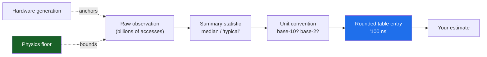
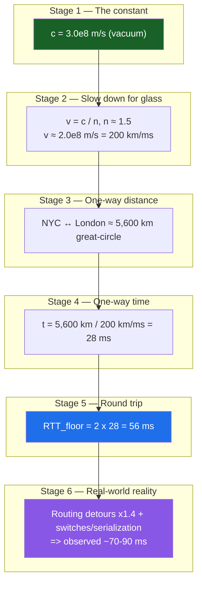

# Number Tables — Theory and Formal Foundations

<!-- level-focus -->
At professional level, focus on this question:

> How should teams adopt and operate **Number Tables — Theory and Formal Foundations** with measurable outcomes and limited coordination?

Use the smallest realistic scenario that exposes the decision and its failure behavior.
The "latency numbers every programmer should know" table is one of the most-cited artifacts in systems engineering — and one of the most-misunderstood. Engineers memorize the digits but rarely interrogate where they come from, how precise they are, or how they decay with time. This document treats the table as a *measurement model*: each entry is a point estimate drawn from a distribution, anchored to physics, conventions, and a particular hardware generation. We derive the canonical numbers from first principles, fix the base-10/base-2 ambiguities that silently corrupt estimates, separate the floors that never move (the speed of light) from the numbers that drift every product cycle, and define how to recalibrate a number rigorously.

## 1. The Table Is a Measurement Model, Not a Constant

When you write "DRAM access ≈ 100 ns" on a whiteboard, you are asserting a model with four hidden parameters:

1. **A physical mechanism** — why DRAM *can't* be faster than ~50 ns and isn't slower than ~150 ns.
2. **A unit convention** — is that 100 ns a nanosecond of 10⁻⁹ s, and is the "GB/s" alongside it base-10 or base-2?
3. **A summary statistic** — is 100 ns the median, the mean, the mode, or a hand-rounded "typical"?
4. **A generation tag** — measured on what microarchitecture, what DDR standard, what year?

The original Jeff Dean / Peter Norvig table (circulated internally at Google ~2009, popularized via talks and Norvig's "Teach Yourself Programming in Ten Years") rounded aggressively and deliberately. Its purpose was *order-of-magnitude reasoning*, not benchmarking. The danger is treating its rounded scalars as ground truth a decade later, on different silicon, with the wrong unit base.

> 🎞️ **See it animated:** [Latency Numbers Every Programmer Should Know](https://colin-scott.github.io/personal_website/research/interactive_latency.html)

The professional skill is not memorizing the numbers — it is knowing each number's *provenance and error bars* so you can decide when the rounded value is safe and when it will mislead an estimate by 10×.



Every arrow above loses information. The job of this section's remaining sections is to recover what each arrow throws away.

---

## 2. The Memory Hierarchy and Why Each Level Is What It Is

Latency numbers are not arbitrary — they fall out of the physical organization of storage. Each level trades capacity for proximity, and proximity is the dominant variable because *signals propagate at finite speed and circuits have finite switching time*.

### 2.1 The hierarchy and its physical drivers

| Level | Typical latency | Capacity | Dominant physical cause |
|---|---|---|---|
| Register | ~0.3 ns (≈1 cycle @ 3 GHz) | ~1–2 KB | On-die, adjacent to ALU; gated only by clock period |
| L1 cache | ~1 ns (3–4 cycles) | 32–64 KB | SRAM, tens of µm from core; tag compare + data array |
| L2 cache | ~4 ns (~12 cycles) | 256 KB–2 MB | Larger SRAM array, longer wire delay |
| L3 cache (LLC) | ~10–20 ns (40–75 cycles) | 8–64 MB | Shared, on-die mesh/ring traversal across the die |
| DRAM (local) | ~80–100 ns | 16 GB–1 TB | Row activation (tRCD), column select (CAS), bus turnaround |
| DRAM (remote NUMA) | ~140–200 ns | per-socket | Above + inter-socket interconnect hop (UPI/Infinity Fabric) |
| NVMe SSD | ~10–20 µs | TBs | Flash page read + controller + PCIe/NVMe queue |
| Disk (HDD) seek | ~3–10 ms | TBs | Mechanical: actuator seek + rotational latency |
| Network (same DC RTT) | ~250–500 µs | — | Switch hops + serialization + stack |
| Network (cross-continent RTT) | ~70–150 ms | — | Speed of light in fiber (see §6–7) |

### 2.2 Why the cache line is 64 bytes

The cache *line* — the atomic transfer unit between levels — is 64 bytes on essentially all modern x86 and ARM server parts. This is not a law of nature; it is an optimization equilibrium:

- **Too small** (e.g., 8 B): every miss pays the fixed DRAM access overhead (row activation, command/address latency) while amortizing it over almost no payload. Bandwidth utilization collapses.
- **Too large** (e.g., 512 B): you fetch data you won't use (poor spatial-locality fit), pollute the cache, and lengthen the miss penalty.

64 B happens to match a DRAM burst (DDR4/DDR5 transfer 8 beats × 64-bit channel = 64 B per burst) and roughly two to eight cache-resident objects. That alignment is *why* the line size and the DRAM burst length co-evolved.

### 2.3 Why DRAM is ~100 ns and not 10 ns

DRAM latency decomposes into a sequence of timed steps governed by JEDEC timing parameters:

```
DRAM read (row miss) ≈ tRP  (precharge open row)
                     + tRCD (activate target row → sense amps)
                     + CL   (CAS latency: column read → data on bus)
                     + bus/controller overhead
```

For DDR4-3200, each of tRP, tRCD, and CL is roughly 13.75 ns, so an unfavorable (row-miss) access easily reaches ~45–50 ns at the chip, and ~80–100 ns end-to-end once you add the memory controller, the on-die interconnect, and queuing. Crucially, **DRAM *bandwidth* has grown ~10× since 2009 while DRAM *latency* has barely improved (~1.3×)**. The capacitor sense-and-restore cycle is a fixed analog operation; you can widen the pipe, not shorten the pour. This is the single most important asymmetry in the whole table: *bandwidth scales, latency stagnates.*

### 2.4 Why DRAM > SSD > disk follows from mechanism

- **SSD (~10–20 µs)**: flash read is electrical (no moving parts) but pays a multi-kilobyte page read plus FTL translation, controller firmware, and the NVMe submission/completion queue round-trip over PCIe. Two to three orders slower than DRAM, two to three orders *faster* than a spinning seek.
- **HDD (~3–10 ms)**: dominated by mechanics — the actuator must physically *seek* (move the head) and then wait for the platter to *rotate* the sector under the head. A 7,200 RPM drive completes one revolution in 8.33 ms, so average rotational latency alone is ~4.17 ms. No firmware trick beats Newtonian mechanics.

The hierarchy's shape — roughly one order of magnitude between adjacent fast levels, three orders at the DRAM→storage and storage→network cliffs — is a *consequence* of these mechanisms, not a coincidence to be memorized.

---

## 3. Base-10 vs Base-2: The Precision Trap

The fastest way to be wrong by 7–20% in a capacity estimate is to confuse decimal and binary prefixes. The error is small per conversion but **compounds multiplicatively** through a chain of estimates.

### 3.1 The two prefix systems

| Decimal (SI, base-10) | Value | Binary (IEC, base-2) | Value | Ratio (binary/decimal) |
|---|---|---|---|---|
| kB (kilobyte) | 10³ = 1,000 | KiB (kibibyte) | 2¹⁰ = 1,024 | 1.024 (+2.4%) |
| MB (megabyte) | 10⁶ = 1,000,000 | MiB (mebibyte) | 2²⁰ = 1,048,576 | 1.0486 (+4.9%) |
| GB (gigabyte) | 10⁹ | GiB (gibibyte) | 2³⁰ = 1,073,741,824 | 1.0737 (+7.4%) |
| TB (terabyte) | 10¹² | TiB (tebibyte) | 2⁴⁰ ≈ 1.0995×10¹² | 1.0995 (+10.0%) |
| PB (petabyte) | 10¹⁵ | PiB (pebibyte) | 2⁵⁰ ≈ 1.1259×10¹⁵ | 1.1259 (+12.6%) |

The discrepancy *grows* with magnitude: ~2.4% at kilo, ~10% at tera, ~12.6% at peta. At exabyte scale it approaches 15%.

### 3.2 Which world uses which convention

This is the part that catches senior engineers:

- **RAM** is sold and addressed in **binary** units. A "16 GB" DIMM is 16 GiB = 17,179,869,184 bytes. RAM is binary because addressing is binary — address lines come in powers of two.
- **Storage vendors** (HDD/SSD) advertise in **decimal**. A "1 TB" drive is 10¹² bytes; your OS may report it as ~931 GiB. The "missing" 69 GB is the 7.4% (well, 9.95%) base mismatch, not fraud.
- **Networking** is **decimal** *and* bit-based. "1 Gbps" = 10⁹ **bits** per second = 125 MB/s decimal = ~119.2 MiB/s. Two conversions stack here: bits→bytes (÷8) and decimal→binary.
- **Throughput in MB/s** from a tool may be either base depending on the tool. Always check.

### 3.3 The cumulative-error worked example

Estimate the storage for 5 billion 200 KB images, then the time to replicate it over a 10 Gbps link.

**Sloppy (mixing bases, dropping the bit/byte factor):**
- 5×10⁹ × 200 KB = 10¹⁵ "bytes" ≈ "1 PB"
- 10 Gbps treated as "10 GB/s" → 1 PB / 10 GB/s = 10⁵ s ≈ 27.8 hours.

**Rigorous:**
- Images: 5×10⁹ × 200 × 10³ B = 1.0×10¹⁵ B = **1 PB (decimal)** = 0.888 PiB.
- Link: 10 Gbps = 10×10⁹ bits/s ÷ 8 = 1.25×10⁹ B/s = **1.25 GB/s** (decimal), *not* 10 GB/s.
- Time: 1.0×10¹⁵ B / 1.25×10⁹ B/s = **8.0×10⁵ s ≈ 222 hours ≈ 9.3 days.**

The sloppy answer was **8× too optimistic** — almost entirely from the missing ÷8 (bits→bytes), with the base-2/base-10 confusion adding a further ~7–12% on top. The lesson: *the bit/byte factor dominates; the binary/decimal factor is the second-order correction you still owe.* Carry units symbolically (b vs B, decimal vs IEC) until the final line.

---

## 4. Latency as a Distribution, Not a Scalar

"DRAM = 100 ns" is a **point estimate of a random variable**. Real latency is a distribution with a body and a tail, and at scale the tail is what hurts you.

### 4.1 Why latency is heavy-tailed

A single memory or network operation can be delayed by, in increasing order of severity:

- queuing behind other in-flight requests (controller, NIC, switch),
- contention for a shared resource (memory bus, NUMA interconnect, lock),
- background activity (DRAM refresh ~every 64 ms, SSD garbage collection, GC pauses, TLB misses, page faults),
- retransmission / retry (network packet loss → +RTT or more),
- scheduling (the OS descheduled your thread).

These are *additive, rare, and large* — the signature of a heavy (often log-normal or worse) tail. The median is dominated by the fast path; p99 and p99.9 are dominated by these intrusions.

### 4.2 The tail-amplification math you must internalize

If a user request fans out to **N** backend calls and waits for *all* of them, the user-perceived latency is the **maximum** of N samples. Even with a modest tail, the max climbs fast. If each backend exceeds its p99 latency independently with probability 0.01:

P(at least one call is "slow") = 1 − (1 − 0.01)ᴺ

| Fan-out N | P(request hits ≥1 p99-slow call) |
|---|---|
| 1 | 1.0% |
| 10 | 9.6% |
| 100 | 63.4% |
| 500 | 99.3% |

A "1-in-100" backend event becomes the *common case* for the user once fan-out reaches ~100. This is precisely why the table's scalar is a trap for distributed reasoning: **you provisioned for the median, but your users live in the tail.** The mitigations — hedged requests, tied requests, request reissue after a p95 timeout — are the practical response Dean and Barroso describe in "The Tail at Scale."

### 4.3 Coordinated omission: the measurement bug that hides the tail

Most naive benchmarks *systematically under-report the tail*. If a load generator sends a request, waits for the response, then sends the next, then when the system stalls the generator also stalls — it stops issuing the requests that *would have* observed the stall. The slow period is sampled once instead of for every request that should have been in flight. This is **coordinated omission** (named by Gil Tene). It can make p99.9 look 10–100× better than reality. The corrections:

- Issue requests on a **fixed schedule** (open-loop / constant arrival rate), independent of responses, so a stall produces a backlog whose latency is fully counted.
- Or back-fill omitted samples by attributing the stall duration to every request that should have been sent during it.
- Always report **percentiles, never averages**, and state the **maximum**. A mean of 1 ms with a p99.9 of 200 ms is a very different system than a mean of 1 ms with a p99.9 of 1.2 ms.

The single-number table entry is the *body* of this distribution. When the entry matters for SLOs, you must replace the scalar with a percentile profile measured without coordinated omission.

---

## 5. Drift Across Hardware Generations: 2009 vs Modern

The canonical table was calibrated on ~2009 commodity server hardware. The relative *order* of magnitudes has held remarkably well, but several absolute values have moved by an order of magnitude — and they have moved *unevenly*, which can invert design decisions that were correct in 2009.

### 5.1 The comparison

| Operation | Jeff Dean ~2009 | Modern (~2024) | Change | Why |
|---|---|---|---|---|
| L1 cache reference | 0.5 ns | ~0.5–1 ns | ~flat | Bound by clock period; clocks plateaued ~3–5 GHz |
| Branch mispredict | 5 ns | ~3 ns | ~1.7× faster | Deeper but smarter predictors; higher clocks |
| L2 cache reference | 7 ns | ~4 ns | ~1.75× faster | Larger/faster SRAM, better fabric |
| Mutex lock/unlock | 25 ns | ~15 ns | ~1.7× faster | Faster cores, better atomics |
| Main memory (DRAM) reference | 100 ns | ~80–100 ns | ~flat | Latency wall — analog cycle barely improved |
| Compress 1 KB (Snappy/Zippy) | 3,000 ns | ~500 ns | ~6× faster | Faster cores + better codecs |
| Send 1 KB over 1 Gbps network | 10,000 ns (10 µs) | ~500 ns over 100 GbE | ~20× faster | 1 Gbps → 100 GbE serialization |
| Read 1 MB sequentially from memory | 250,000 ns | ~20,000–50,000 ns | ~5–12× faster | DRAM bandwidth grew ~10× |
| Round trip within same datacenter | 500,000 ns (500 µs) | ~100–250 µs | ~2–5× faster | Faster switches, kernel-bypass NICs |
| **Disk/storage random read** | **10,000,000 ns (10 ms HDD seek)** | **~10–20 µs (NVMe)** | **~500–1000× faster** | **HDD → NAND flash over NVMe** |
| Read 1 MB sequentially from storage | 20,000,000 ns (HDD) | ~50,000–100,000 ns (NVMe) | ~200–400× faster | NVMe bandwidth (GB/s) |
| Round trip CA ↔ Netherlands | 150,000,000 ns (150 ms) | ~150 ms | **unchanged** | Speed of light — see §6 |

### 5.2 The four shifts that change design decisions

1. **The storage cliff collapsed.** In 2009, the rule "avoid random disk I/O at all costs" justified elaborate sequential-write designs (LSM trees, append-only logs). NVMe random reads at ~10–20 µs are now only ~100–200× slower than DRAM, not ~100,000×. Random access to fast storage is *cheap enough* that some 2009-era contortions are now premature optimization.

2. **Network caught up to (and passed) local I/O.** At 100 GbE with kernel-bypass (DPDK, RDMA), sending data across the datacenter can rival or beat reading it from local storage. This is the premise of disaggregated storage and "the datacenter is the computer."

3. **NUMA became unavoidable.** 2009's table assumed roughly uniform memory access. Modern multi-socket servers have *non-uniform* memory: a remote-socket DRAM access (~140–200 ns) is ~1.5–2× a local one (~80–100 ns). The table's single "DRAM = 100 ns" now needs a NUMA asterisk.

4. **Latency stalled while bandwidth and core counts exploded.** Per-operation latencies (DRAM, mispredict, mutex) are roughly flat, but you now have 64–192 cores and 10× the bandwidth. The modern bottleneck is *parallelism and tail latency*, not single-stream speed. Design for throughput and p99, not for shaving nanoseconds off one path.

The meta-lesson: **re-derive the table for your generation.** Treat the famous numbers as a 2009 *snapshot*; the ratios that physics fixes (next section) are the only ones safe to quote verbatim forever.

---

## 6. The Physical Floors That Never Change

Some numbers in the table are not measurements of *technology* — they are measurements of *physics*, and no engineering will improve them. The dominant one is the **speed of light**.

### 6.1 The speed of light in fiber

In vacuum, light travels at c ≈ 299,792,458 m/s ≈ 3×10⁸ m/s. But signals in fiber-optic cable travel through glass with refractive index n ≈ 1.47–1.5, so the propagation speed is:

v = c / n ≈ (3×10⁸) / 1.5 = **2.0×10⁸ m/s** ≈ 200,000 km/s.

Equivalently, light in fiber covers **~200 km per millisecond**, or **~5 µs per kilometer, one way**. This is a *floor*: routers, serialization, and protocol overhead only ever *add* to it. You can never go below it without changing the medium (and even hollow-core fiber, n≈1.0, only buys back the ~1.5× index factor — it cannot beat c).

### 6.2 Floors vs technology in the table

| Quantity | Floor or technology? | Can it improve? |
|---|---|---|
| Speed of light in fiber (~5 µs/km) | **Physical floor** | No — fixed by physics |
| Transcontinental RTT (~75–150 ms) | **Floor (geometry × speed of light)** | No, only by shorter routes |
| Same-rack RTT serialization | Technology | Yes — faster NICs, kernel bypass |
| DRAM access latency | Mostly physics (analog cycle) | Marginally |
| DRAM bandwidth | Technology | Yes — has, ~10×/decade |
| SSD/NVMe latency | Technology | Yes — steadily improving |
| HDD seek time | Mechanics (near-floor) | Barely — mechanical limit |
| Cache latency | Technology (clock-bound) | Slowly — clocks plateaued |

The practical consequence: **you cannot cache or optimize your way under the speed of light.** A user in Sydney hitting a server in Virginia pays the great-circle RTT no matter how fast your code is. The only fixes are *geographic*: move the data closer (CDN, edge, regional replicas) or do less round-tripping (batching, protocols with fewer RTTs). This is why "place compute near data near users" is the one architectural rule that physics guarantees will never become obsolete.

---

## 7. Speed-of-Light RTT Floor: A Staged Derivation

Let's derive the cross-continent latency floor from physics, stage by stage, so you can reconstruct it for *any* pair of cities without memorizing a table.



### 7.1 Working the stages numerically

**Stage 1 — Vacuum constant.** c ≈ 3.0×10⁸ m/s.

**Stage 2 — Glass slowdown.** Fiber index n ≈ 1.5, so v ≈ 2.0×10⁸ m/s = 200 km/ms = 5 µs/km (one way).

**Stage 3 — Distance.** Great-circle NYC↔London ≈ 5,585 km (round to 5,600 km). Use the great-circle (geodesic) distance, because that is the shortest path on Earth's surface.

**Stage 4 — One-way propagation.** t = 5,600 km ÷ 200 km/ms = **28 ms**.

**Stage 5 — Round-trip floor.** RTT must traverse the distance twice: 2 × 28 = **56 ms**. This is the *absolute minimum* — the answer to "how fast could a ping ever be between these cities."

**Stage 6 — Reality multiplier.** Fiber never runs straight. Cable follows roads, coastlines, and existing rights-of-way, inflating the path by a routing factor of roughly **1.3–1.5×**. Add per-hop switch/router processing (~tens of µs each) and serialization. Observed NYC↔London RTT is typically **~70–90 ms** — comfortably above the 56 ms floor, but the same order. The floor explains 60–80% of the observed latency; everything else is engineering.

### 7.2 The reusable mental formula

> **RTT_floor (ms) ≈ distance_km / 100** &nbsp;&nbsp; *(because 200 km/ms one way, doubled for round trip)*

So per 100 km of separation you pay ~1 ms of unavoidable RTT. A 2,000 km separation ⇒ ~20 ms floor; 10,000 km (roughly antipodal-ish, e.g., London↔Singapore) ⇒ ~100 ms floor, observed ~150–180 ms. Memorize the *derivation*, not the cities — then you can sanity-check any "our cross-region call takes 5 ms" claim (impossible if the regions are 2,000 km apart) on the spot.

### 7.3 Worked sanity check

A team reports their US-East ↔ US-West (≈3,900 km) database replication RTT as "8 ms." Floor check using `RTT_floor ≈ distance_km / 100`: 3,900 / 100 ≈ 39 ms RTT. An 8 ms claim is **below the speed-of-light floor and therefore physically impossible** — the measurement is wrong (likely measuring same-AZ, or measuring a cached/local path). The number table just caught a bug no profiler would have flagged.

---

## 8. Measuring and Recalibrating a Number Correctly

When the rounded table entry isn't precise enough, you must measure. Measuring latency *correctly* is subtle; most naive measurements are biased optimistic.

### 8.1 The checklist for a trustworthy number

| Pitfall | Symptom | Correct practice |
|---|---|---|
| Reporting the mean | Tail hidden; one number lies | Report p50/p90/p99/p99.9 **and** max |
| Coordinated omission | p99.9 looks 10–100× too good | Open-loop generator / back-fill stalls (use HdrHistogram, wrk2) |
| Cold vs warm cache | First run 100× slower than steady state | Warm up; report cold and warm separately, label which |
| Too few samples | p99.9 has huge variance | Need ≥10⁵–10⁶ samples to estimate p99.9 stably |
| Measurement overhead | Timer cost ≈ the thing measured | Use rdtsc/monotonic clock; measure the timer's own cost |
| Wrong clock | Wall clock jumps (NTP), low resolution | Use a monotonic high-resolution clock |
| Aggregating percentiles wrong | Averaging p99s is mathematically invalid | Merge histograms, then recompute percentiles |

### 8.2 Why you cannot average percentiles

A common error: "Service A's p99 is 10 ms, Service B's p99 is 20 ms, so the combined p99 is 15 ms." **False.** Percentiles are not linear; you cannot average them. The correct method is to merge the underlying *distributions* (e.g., add the two HdrHistograms bucket-by-bucket) and recompute the percentile from the combined data. This is why latency telemetry should ship histograms (or t-digest/HDR sketches), never pre-computed averages — averages and pre-aggregated percentiles cannot be re-aggregated faithfully.

### 8.3 Warm vs cold, and what "the number" even means

The table's "DRAM = 100 ns" implicitly means a **warm, steady-state, cache-miss-but-row-hit-typical** access. Report context explicitly:

- **Cold**: first access, TLB miss, page fault possible, branch predictor untrained. Can be 10–1000× the warm number.
- **Warm**: steady state, structures resident, predictors trained. This is what the table reports.
- **Loaded vs unloaded**: a number measured on an idle machine ignores queuing. Under load, latency rises *non-linearly* near saturation (Little's Law / queuing theory: as utilization ρ → 1, queue wait → ∞). Always state the load level at which a number was measured.

### 8.4 The recalibration protocol

1. **State the question precisely**: which percentile, warm or cold, at what utilization, on what hardware generation.
2. **Generate load open-loop** at a fixed arrival rate to avoid coordinated omission.
3. **Collect ≥10⁵–10⁶ samples** into a histogram (HdrHistogram/HDR sketch), not a running mean.
4. **Report the full profile**: p50, p90, p99, p99.9, max, plus the sample count and load level.
5. **Cross-check against the floor** (§6–7): if your measured number is below the physical floor, the measurement is wrong, full stop.
6. **Tag the number** with hardware generation and date so future readers know its provenance — exactly the metadata the 2009 table lacked, which is why it now misleads.

A recalibrated number that carries its percentile, load, generation, and floor-check is no longer a fragile scalar — it is a small measurement model, which is what every entry in the table always was.

---

## 9. Practitioner's Synthesis

- **The table is a model, not a fact.** Each entry hides a mechanism, a unit convention, a summary statistic, and a generation tag. Know all four before you quote it.
- **Latency stagnates; bandwidth and parallelism scale.** DRAM latency is ~flat since 2009; bandwidth grew ~10×, storage random-read got ~500–1000× faster (HDD→NVMe), networks ~20× faster. Re-derive absolute numbers for your generation.
- **Mind the bases.** Carry bits-vs-bytes and decimal-vs-binary symbolically. The ÷8 (bits→bytes) error is the big one (up to 8×); the base-2/base-10 error is the ~7–12% correction you still owe.
- **A scalar is the body of a distribution.** Provision for p99/p99.9, not the median — fan-out turns rare tails into common user pain. Measure without coordinated omission.
- **Physics is the one permanent floor.** ~5 µs/km one way ⇒ RTT_floor ≈ distance_km / 100. You cannot cache or optimize under the speed of light — only move data closer or do fewer round trips.
- **Recalibrate rigorously**: open-loop load, ≥10⁵ samples, full percentile profile, generation tag, floor cross-check. Never average percentiles; merge histograms.

The famous numbers are scaffolding for order-of-magnitude reasoning. The principal-level skill is holding both the rounded number *and* its error bars in mind at once — quoting the floor verbatim because physics fixed it, and re-measuring everything else because silicon moved on.


---

## Apply it

1. Define the user or business outcome that **Number Tables — Theory and Formal Foundations** should improve.
2. Assign one owner for code, contracts, operations, and incidents.
3. Split delivery into reversible increments that produce evidence early.
4. Publish responsibilities, escalation paths, and compatibility windows.
5. Stop or expand only when the agreed measures support that decision.

## Verify your work

- Each increment has an owner, rollback path, and observable exit condition.
- Adoption, reliability, delivery time, and coordination cost are measured.
- Incident and migration exercises prove that responsibility is executable.
- The old path is removed only after telemetry proves it is unused.

## Review questions

- Which measurable outcome justifies investing in Number Tables — Theory and Formal Foundations?
- Which team owns the full lifecycle and incident response?
- What reversible increment produces the earliest useful evidence?
- Which exit condition proves that migration or adoption is complete?
