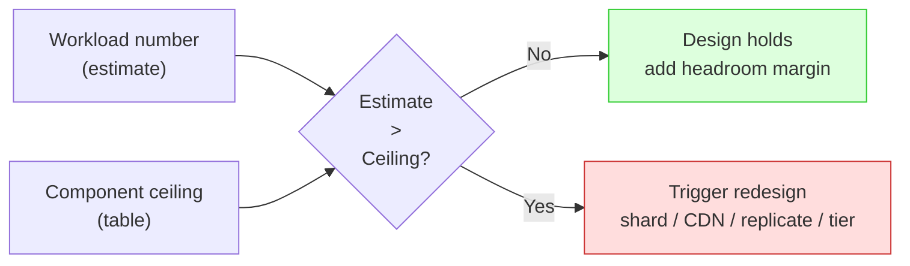
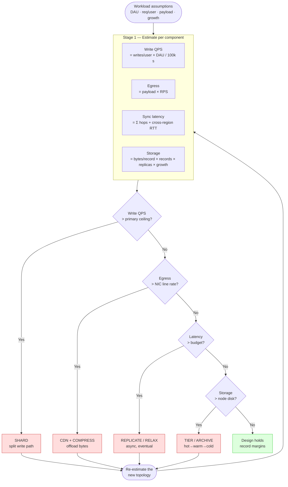

# Number Tables — Senior

<!-- level-focus -->
At senior level, focus on this question:

> Which system invariant is affected by **Number Tables** under failure, load, and change?

Use the smallest realistic scenario that exposes the decision and its failure behavior.
At the senior level you stop treating the number tables as trivia to memorize and start treating them as **instruments**. A number table is a calibrated gauge: you read a workload off it and it tells you which architectural ceiling you are about to hit. The junior asks "how many requests per second can this do?" The senior asks "at what number does this design stop being correct?" — and then designs the next version on the far side of that threshold *before* it breaks.

This page is about ownership. You own the mapping from **a number to a decision**, the **ceilings** that bound every component, the **30-second smell test** that catches a bad claim in a meeting, and the discipline of **calibrating your own tables** from production rather than trusting a generic chart someone copied off a blog in 2012.

## 1. The Core Discipline: Number → Decision

A latency table or a QPS estimate is worthless until it is attached to a **decision boundary**. The senior move is to invert the table. Instead of "what is the throughput of a Postgres primary?", you ask "what write rate forces me off a single primary?" — and you keep that ceiling in your head as a *trigger*.

Every architectural decision in a back-of-envelope review is really a comparison of two numbers:

- A number you **estimate** from the workload (writes/sec, payload × RPS, cross-region RTT, total bytes).
- A number that is a **ceiling** of a component (single-primary write rate, NIC line rate, latency budget, node disk capacity).

When the estimate crosses the ceiling, the current design is dead and a specific redesign is triggered. That is the whole game. The tables exist so you can do this comparison in your head, in thirty seconds, without a spreadsheet.

The reason this matters more at senior than at any junior tier: a junior who is wrong by 10x produces a slow service. A senior who is wrong by 10x signs off on an architecture that cannot be incrementally fixed — the sharding decision was deferred past the point where it was cheap, and now it is a six-month migration. **The number tables are how you find the fork in the road while you can still take it.**

A note on precision. You are not computing — you are *bounding*. Round aggressively: 86,400 seconds/day is "~100k", a year is "~30M seconds", 2^20 is "a million", 2^30 is "a billion". The goal is to land within one order of magnitude of the truth, fast. If a decision flips depending on whether the number is 1.2M or 1.4M, you do not have a back-of-envelope decision — you have a benchmark to run.

---

## 2. The Threshold Table: This Number → This Action

This is the table you actually carry into a design review. The left column is a number you can estimate in seconds; the middle is the ceiling it crosses; the right is the redesign it triggers. The thresholds are deliberately conservative single-node defaults — your calibrated numbers (Section 7) will differ, and that is the point.

| Estimated number crosses… | …this ceiling | → Triggered action |
|---|---|---|
| **Write QPS > ~5k–10k/s** sustained | single-primary write throughput | Shard by key, or split write-heavy entities into their own store; introduce a write-ahead queue to absorb bursts |
| **Read QPS > ~50k/s** on hot keys | single-node read + cache miss storm | Add read replicas; add a cache tier; replicate hot keys; consider CQRS read model |
| **Payload × RPS > ~1–10 Gbps** egress | NIC line rate (1/10/25 GbE) | Push static/large objects to a CDN; enable compression; move to range requests; split media off the API path |
| **Cross-region RTT > latency budget** (e.g. >100 ms of a 200 ms p99 budget) | speed of light + serialization | Replicate data closer to users; relax to async/eventual consistency; move the operation off the synchronous path |
| **Working set > ~64–256 GB** | single-node RAM | Partition the cache; shard the dataset; demote cold data to disk-backed tiers |
| **Stored bytes > ~10–50 TB/node** | single-disk / single-node capacity | Tier hot→warm→cold; archive to object storage; shard storage; apply TTL/retention |
| **Random IOPS > ~10k–20k/disk** | single SSD IOPS ceiling | Spread across disks/nodes; batch writes; switch to append-only/LSM; add a write buffer |
| **Open connections > ~5k–10k** to one primary | per-primary connection limit | Introduce a connection pooler (PgBouncer/ProxySQL); cap pool size per app instance; move to a serverless data proxy |
| **Fan-out writes > ~1k/event** | amplification on a single ingest path | Switch push→pull (or hybrid); precompute timelines async; rate-limit the fan-out worker |
| **p99 / p50 ratio > ~10x** | tail-latency from coordination/GC/queueing | Hedged requests; request budgets; remove synchronous chains; isolate noisy neighbors |

Two things to internalize. First, **every ceiling is a "single-X" ceiling** — single primary, single NIC, single disk, single region hop. The redesign almost always converts a "single" into a "many" (shard, replicate, fan out) or removes the work entirely (cache, CDN, async). Second, the thresholds are ranges, not points. You design with **margin**: trigger the redesign conversation at 50–60% of the ceiling, because the gap between "it works" and "it fell over" is one traffic spike wide.

> 🎞️ **See it animated:** [Latency Numbers Every Programmer Should Know](https://colin-scott.github.io/personal_website/research/interactive_latency.html)

---

## 3. The Ceilings That Matter

You do not need to memorize a hundred numbers. You need a dozen **ceilings** and an order-of-magnitude feel for each. These are the walls your estimates run into. Memorize the shape, calibrate the exact value per Section 7.

| Ceiling | Order-of-magnitude default | Why it bites | First redesign when crossed |
|---|---|---|---|
| **Single-node write throughput** | ~5k–10k writes/s (durable, fsync'd rows) | One primary serializes durable commits; group commit and WAL fsync cap it | Shard; batch; queue ahead of the DB |
| **Single-node read throughput** | ~10k–100k reads/s (cached/in-mem much higher) | CPU + lock contention + buffer cache misses | Replicas; cache tier; denormalized read model |
| **NIC line rate** | 1 GbE ≈ 125 MB/s, 10 GbE ≈ 1.25 GB/s, 25 GbE ≈ 3 GB/s | Bytes/sec is `payload × RPS`; egress saturates silently | CDN; compress; offload large objects |
| **Single SSD random IOPS** | NVMe ~100k–500k, SATA SSD ~10k–50k | Random 4K reads/writes, not sequential MB/s | LSM/append-only; batch; spread disks |
| **Single SSD sequential throughput** | NVMe ~2–7 GB/s, SATA ~500 MB/s | Bulk scans, backups, replication catch-up | Parallelize across disks; compress |
| **Per-primary connection limit** | ~5k–10k (PG: hundreds before memory pain) | Each conn costs memory + a backend process/thread | Connection pooler; cap per-instance pools |
| **Single-node RAM (working set)** | ~64–512 GB common; >1 TB exotic | Cache/index/working set must fit or thrash | Partition; shard; tier cold to disk |
| **Single-node storage** | ~1–50 TB/node before ops pain | Backup, recovery, and rebuild time scale with size | Shard storage; archive; tiering + TTL |
| **Same-region RTT** | ~0.5–2 ms (intra-AZ <1 ms, cross-AZ ~1–2 ms) | Bounds synchronous chains within a region | Reduce hops; batch; co-locate |
| **Cross-region RTT** | ~10–150 ms (e.g. US↔EU ~80–100 ms) | Speed of light; ~5 µs/km one way, doubled round trip | Replicate; async; relax consistency |
| **Memory vs SSD vs network latency** | RAM ~100 ns, SSD ~16 µs–150 µs, intra-DC RTT ~0.5 ms | Each tier is ~100–1000x slower than the last | Move hot data up the hierarchy |

The most useful mental anchor in this table is the **latency hierarchy**: L1 ≈ 1 ns, main memory ≈ 100 ns, SSD random read ≈ tens of µs, same-DC round trip ≈ 0.5 ms, cross-region round trip ≈ 100 ms. Each step is roughly two to three orders of magnitude. When someone proposes "we'll just call the other region synchronously inside this request," you do not need a benchmark — you already know they just added ~100 ms to a chain that probably has a budget of 200 ms, and you know what to say.

A second anchor: **bytes per second = payload size × requests per second.** This single multiplication catches more bad designs than any other. A 2 MB response at 5,000 RPS is 10 GB/s — you have saturated a 25 GbE NIC eight times over before you have done anything useful. The fix (CDN, compression, smaller payloads) is obvious once the number is on the table; the failure mode is never doing the multiplication.

---

## 4. The Staged Pipeline: Estimate → Cross a Ceiling → Redesign

Owning the tables means running this loop on every component, in order. The loop is the same whether you are sizing a URL shortener or a global feed. The diagram is staged on purpose: an estimate that *passes* one stage flows on; an estimate that *crosses a ceiling* forks out of the synchronous design into a redesign and re-enters the loop.

The two senior subtleties hidden in this diagram:

1. **Redesign changes the estimate.** Sharding by user does not just raise the write ceiling — it can multiply your cross-shard query cost, change your storage replication math, and add a coordinator hop to your latency chain. So you re-enter the loop. A redesign that fixes one ceiling often pushes you into another; the loop terminates only when *all four* estimates clear *all four* ceilings simultaneously with margin.

2. **Order matters.** Resolve write throughput and latency before storage, because those decisions (sharding, replication topology) determine how the bytes are physically laid out, which is what you are estimating in the storage stage. Estimating storage first and topology second is how you end up re-doing the storage math three times.

---

## 5. The 30-Second Smell Test

Most of the value the number tables deliver in your career is not in your own designs — it is in **catching other people's claims** in real time. A vendor says their database does "a million writes per second." A teammate's design doc assumes "we'll serve 4K video from the app servers." A capacity plan says "one box is enough for the next two years." The senior move is to run a 30-second reality check before the room accepts the number.

The procedure:

1. **Restate the claim as a number with units.** "A million writes/sec" — durable writes? per node or per cluster? what payload?
2. **Pick the nearest ceiling** from Section 3.
3. **Do one multiplication or division** to compare them.
4. **Demand the missing assumption** if the claim survives, or **reject it** if it does not.

| Claim you hear | Nearest ceiling | The 30-second check | Verdict |
|---|---|---|---|
| "One Postgres primary, 1M durable writes/s" | single-node write ~5k–10k/s | 1M / 10k = **100x over** a generous single-primary ceiling | Reject (or: it's a cluster / not durable / not row writes) |
| "Serve 4K video (25 Mbps) to 10k concurrent from app tier" | NIC line rate | 25 Mbps × 10k = **250 Gbps**; a 25 GbE box does 25 — **10x over** | Reject → CDN |
| "Sync call to EU region inside our 150 ms p99 budget" | cross-region RTT ~100 ms | one RTT eats **~2/3 of the budget** before any work | Reject → async / replicate |
| "10 TB dataset fits one node, no problem" | node storage + rebuild time | fits, but a rebuild/backup at ~500 MB/s is **~5.5 hours** | Conditional → ask about RTO |
| "Cache it all in RAM, it's only 500M items × 1 KB" | single-node RAM | 500M × 1 KB = **500 GB** — possible on a big box, tight | Conditional → partition / verify item size |

The discipline is to **always carry the units through the arithmetic.** "A million" is meaningless; "a million durable single-row writes per second on one fsync'd primary" is a falsifiable claim, and it is false. Half of bad capacity numbers survive only because nobody attached units and did the one division.

---

## 6. Three Worked Rejections

The smell test is a reflex; here it is in slow motion on three claims, the way you would actually reason in the meeting.

**Rejection 1 — "Our single primary handles the launch, 2M writes/sec peak."**
Restate: 2,000,000 durable writes/sec on one primary. Ceiling: a well-tuned single primary commits on the order of 5k–10k durable writes/sec because each commit pays an fsync and the WAL is a serial log; group commit batches help but do not move you two orders of magnitude. Check: 2M / 10k = **200x over**. This is not "needs a bigger box" — no single box closes a 200x gap. Triggered action from the threshold table: shard the write path, and put a durable queue (Kafka/SQS) in front to absorb the launch spike so the DB sees a smoothed rate, not the peak. Verdict: rejected, redesign named.

**Rejection 2 — "We'll thumbnail and serve user avatars (200 KB) straight from the API, ~20k RPS."**
Restate: bytes/sec = 200 KB × 20,000 = **4 GB/s = 32 Gbps** of egress, sustained, from the API tier. Ceiling: a 25 GbE NIC tops out at ~3 GB/s (25 Gbps). Check: 4 GB/s vs 3 GB/s — **over a single NIC**, and that is before headers, TLS, and connection overhead, and before any actual API logic competes for the same NIC. Triggered action: serve images from a CDN (cache-hit egress never touches your origin NIC), and offload the media path off the API entirely. Verdict: rejected, CDN.

**Rejection 3 — "Strongly consistent reads, replicated US↔Singapore, p99 under 120 ms."**
Restate: a synchronous quorum or read-your-writes path that crosses US↔Singapore. Ceiling: that round trip is ~160–180 ms of pure propagation (≈ 5 µs/km, ~15,000 km, doubled). Check: **one RTT alone exceeds the entire 120 ms budget** — before serialization, before the DB does any work. Strong cross-Pacific consistency on a sub-120 ms budget is physically impossible; no amount of tuning beats the speed of light. Triggered action: relax to async replication with read-your-writes pinned to the local region, or accept eventual consistency for the cross-region case, or move the strongly-consistent operation off the synchronous user path. Verdict: rejected, relax consistency.

In all three the pattern is identical: the claim is a single number, you compare it to a single ceiling with a single arithmetic operation, and the gap is so large (200x, 1.3x, 1.5x) that no tuning closes it — only a topology change does. **A gap inside ~2x is a tuning conversation; a gap beyond ~10x is an architecture conversation.** Knowing which conversation you are in is the senior skill.

---

## 7. Calibrating Your Own Tables

The generic numbers in Sections 2 and 3 are starting points, not truth. A senior engineer who has owned a system distrusts every generic number and replaces it with a **measured** one, because real ceilings depend on your hardware, your schema, your access pattern, and your durability settings. The difference between "5k writes/sec" and "40k writes/sec" on the *same* database is whether you fsync per commit, batch, or run unsafe — a 8x swing that changes the sharding decision entirely.

How to calibrate, and where the generic number lies to you:

| Generic assumption | What actually moves it | How to calibrate |
|---|---|---|
| "DB does 10k writes/s" | row size, indexes, fsync/durability mode, group commit, replication factor | Load-test *your* schema at *your* durability setting; record the knee where p99 latency turns up |
| "RAM is 100 ns" | NUMA, cache misses, GC pauses, allocator | Microbench the hot path; watch the p99, not the mean |
| "SSD does 50k IOPS" | queue depth, read vs write, 4K vs 16K, fsync, controller | `fio` with your block size and queue depth; separate read and write IOPS |
| "NIC is 25 Gbps" | TLS overhead, packet size, connection count, cloud instance caps | Cloud instances often cap bandwidth *below* the NIC — read the instance spec, then measure |
| "Cross-region is 100 ms" | actual provider routing, peering, not geodesic | Measure RTT between *your* actual regions; do not trust the great-circle estimate |

The senior practice is to maintain a **living number table for your own systems** — a short doc that says "our user-events primary saturates at 18k writes/sec p99=20 ms; our CDN-origin egress caps at 4 GB/s per origin; US-east↔EU-west is 78 ms p50." That document is worth more than any blog table, because every threshold decision in Section 2 fires against *your* ceiling, not a stranger's. Re-measure after major version upgrades, instance-type changes, and schema changes — ceilings drift, and a stale calibration is a confident wrong answer.

Two calibration disciplines that separate seniors from staff:

- **Measure the knee, not the max.** The number you want is where p99 latency starts climbing, not the absolute throughput where the system is already drowning. You design against the knee with margin, because past the knee the system is in a regime you do not control.
- **Record the assumptions next to the number.** "18k writes/sec" is useless in six months; "18k writes/sec, 1.5 KB rows, fsync per commit, RF=3, on r6g.4xlarge" is reusable forever and re-derivable when the hardware changes.

---

## 8. Anti-Patterns at the Owner Altitude

- **Memorizing numbers instead of ceilings.** Reciting "L1 is 1 ns" wins no arguments. Knowing that *one cross-region RTT eats two-thirds of a 150 ms budget* ends them. Tables are for triggering decisions, not for show.
- **Skipping the units.** "A million writes" is not a claim. Carry the units — durable? per node? what payload? — and half the bad numbers fall over on their own.
- **Estimating to false precision.** If your decision flips between 1.2M and 1.4M, stop estimating and start benchmarking. Back-of-envelope is for order-of-magnitude forks, not 10% calls.
- **Designing to the ceiling, not to the margin.** A system sized at 95% of a ceiling fails on the first spike. Trigger the redesign conversation at ~50–60% of the calibrated ceiling.
- **Trusting generic tables for production sizing.** Generic numbers find the *shape* of the problem; only your calibrated numbers commit a budget. Never sign a capacity plan off a blog table.
- **Fixing one ceiling and not re-running the loop.** Sharding the write path can blow your latency budget with a coordinator hop. After every redesign, re-estimate all four dimensions.
- **Confusing a tuning gap with an architecture gap.** A 1.5x miss is a config change; a 50x miss is a topology change. Proposing query tuning to close a 50x gap wastes a sprint.

---

## 9. Senior Checklist

You are operating at the owner altitude on number tables when you can, in a live design review:

- [ ] Invert any table on demand — name the **ceiling**, not just the throughput.
- [ ] Map any workload number to its **triggered redesign** (shard / CDN / replicate / tier) in one step.
- [ ] Run the **30-second smell test** on a vendor or teammate claim and classify the gap as tuning (≤2x) vs architecture (≥10x).
- [ ] Compute **bytes/sec = payload × RPS** reflexively and check it against NIC line rate.
- [ ] Quote the **latency hierarchy** (RAM→SSD→same-DC→cross-region) from memory and use it to kill a synchronous cross-region call.
- [ ] Run the **estimate → ceiling → redesign** loop across all four dimensions, in order, and re-run it after each redesign.
- [ ] Maintain a **calibrated number table for your own systems**, measured at the knee, with assumptions recorded.
- [ ] Design to **margin**, not to the ceiling, and say so out loud when the room is sizing to 95%.

The thread through all of it: the number tables are not facts to recall, they are **decision instruments**. The senior reads a workload, finds the ceiling it is about to cross, and names the redesign — fast enough that the fork in the road is still cheap to take.

*Next step:* [Professional level](professional.md)

---

## Apply it

1. State the system invariant that **Number Tables** must protect.
2. Mark ownership, state, and failure propagation at each boundary.
3. Compare two designs under load, dependency failure, and future change.
4. Define recovery and compatibility behavior before implementation.
5. Test the riskiest assumption with a focused experiment.

## Verify your work

- The experiment supports the design with evidence, not preference.
- Failure injection shows the blast radius and recovery path.
- Compatibility checks cover old and new callers or data.
- Operational signals reveal invariant violations and recovery progress.

## Review questions

- Which invariant must remain true when Number Tables fails?
- Where should recovery responsibility live, and why?
- Which assumption deserves an experiment before implementation?
- How can the design evolve without changing every consumer at once?
