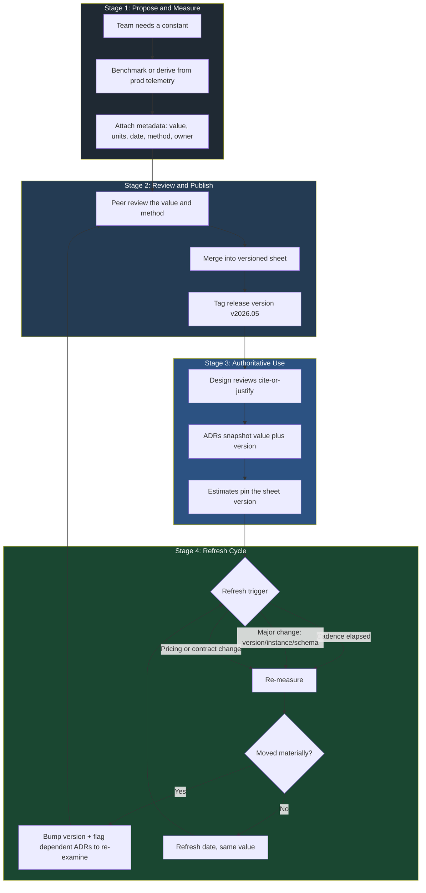

# Number Tables — Staff / Principal Level

At junior and mid levels, number tables are a memory aid: you keep a handful of latency, throughput, and storage constants in your head so a back-of-envelope estimate takes minutes instead of a half-day of measurement. At staff and principal level the object of attention changes. The numbers are no longer something *you* memorize — they are an organizational asset that hundreds of engineers estimate from. Your job stops being "know the numbers" and becomes "own the system that keeps the numbers true, shared, and authoritative."

This page treats the number table as an **organizational artifact**: a curated, versioned, internally-benchmarked set of constants — the company "numbers sheet" — that makes back-of-envelope work across the whole engineering org consistent and trustworthy. The technical content of estimation is assumed; the leverage here is governance, calibration, and trust.

## Table of Contents

1. [From Personal Mnemonic to Org Asset](#1-from-personal-mnemonic-to-org-asset)
2. [What Lives in a Company Numbers Sheet](#2-what-lives-in-a-company-numbers-sheet)
3. [Generic vs Your-Calibrated Numbers](#3-generic-vs-your-calibrated-numbers)
4. [Why Stale and Cargo-Culted Constants Are Dangerous](#4-why-stale-and-cargo-culted-constants-are-dangerous)
5. [A Worked Example: The Wrong-Constant Decision](#5-a-worked-example-the-wrong-constant-decision)
6. [Making the Sheet Authoritative in Reviews and ADRs](#6-making-the-sheet-authoritative-in-reviews-and-adrs)
7. [Ownership, Benchmarking, and the Refresh Cycle](#7-ownership-benchmarking-and-the-refresh-cycle)
8. [Governance Lifecycle Diagram](#8-governance-lifecycle-diagram)
9. [Anti-Patterns and Failure Modes](#9-anti-patterns-and-failure-modes)
10. [The Numbers Sheet as a Force Multiplier](#10-the-numbers-sheet-as-a-force-multiplier)
11. [Staff Checklist](#11-staff-checklist)

---

## 1. From Personal Mnemonic to Org Asset

The famous "latency numbers every programmer should know" tables exist because the *shape* of the numbers — the orders of magnitude, the ratios between memory, SSD, network, and cross-region — rarely changes and is genuinely worth carrying in your head. That intuition is necessary and you should still build it. But intuition trained on generic, decade-old constants produces estimates that are directionally right and quantitatively wrong, and at scale "quantitatively wrong" buys the wrong hardware, signs the wrong cloud commitment, and staffs the wrong headcount.

The shift in mindset:

- **Junior/mid:** "I remember roughly what an SSD read costs."
- **Senior:** "I can do a clean BOE estimate for a new service and defend each number."
- **Staff/principal:** "The numbers everyone in the org estimates *from* are calibrated to our actual stack, versioned, owned, refreshed on a cadence, and cited in design reviews — so that two engineers on two teams who have never met will produce compatible capacity numbers for the same workload."

The last bullet is the whole point. The value of a shared numbers sheet is not that it's more *accurate* than one good engineer's mental model. It's that it is **consistent across the org**. A thousand slightly-different mental models cannot be reconciled; one curated sheet can. Consistency is what makes a capacity-planning review, a cloud-spend forecast, and a reliability budget *composable* across teams instead of a pile of mutually-incompatible guesses.

A useful framing: the numbers sheet is to estimation what a style guide is to code. Nobody claims the style guide makes any single function better than a great engineer would write. It makes ten thousand functions written by a thousand engineers *legible to each other*. The numbers sheet does the same for capacity and cost arithmetic.

## 2. What Lives in a Company Numbers Sheet

A mature numbers sheet has four layers, ordered from most universal (changes slowly, copy from the literature) to most specific (changes constantly, must be measured in-house).

| Layer | Examples | Source of truth | Refresh cadence |
|---|---|---|---|
| Physical constants | speed of light in fiber (~5 µs/km), bytes per cache line, page size | Physics / hardware datasheets | Effectively never |
| Generic hardware/protocol | SSD random read latency, DRAM bandwidth, TCP handshake RTT cost | Published references, vendor specs | Yearly, low priority |
| Vendor/cloud pricing | $/GB-month stored, $/GB egress, $/million requests, $/vCPU-hour | Your cloud bill + contract | Quarterly, or on contract change |
| Your-stack-calibrated | real QPS/instance for *your* services, p99 between *your* regions, write amplification of *your* DB, cache hit ratio of *your* edge | In-house benchmarking + production telemetry | Monthly, plus on major change |

The most valuable and most neglected layer is the bottom one. Anyone can copy a generic latency table off a blog. Almost no organization maintains an accurate, current record of *its own* services' real per-instance throughput, its real cross-region p99, its real cost-per-request after overhead. That bottom layer is where the leverage lives and where staleness does the most damage.

Concrete entries the bottom layer should pin down, each with units and a measured date:

- **Per-instance saturation QPS** for each major service class (API tier, search tier, write-heavy tier), measured at the QPS where p99 latency exits SLO — *not* the QPS where CPU hits 100%.
- **Cross-region round-trip p50/p99** for each region pair you actually deploy in, measured from your own probes, not the provider's marketing latency map.
- **Effective storage cost** including replication factor, backups, and snapshot retention — not the headline $/GB. If you store 3 replicas plus daily snapshots kept 30 days, your *effective* $/GB is several times the sticker price.
- **Egress cost by path** — same-AZ, cross-AZ, cross-region, and internet egress differ by orders of magnitude and are a classic source of surprise bills.
- **Real cache hit ratio and the cost of a miss** for your hottest read paths.
- **Write amplification** of your primary datastore (LSM compaction, index maintenance, WAL) so storage and IOPS estimates use bytes-written-to-disk, not bytes-written-by-the-app.

Every entry carries metadata, not just a value: the number, its units, the date measured, the method (benchmark vs production-derived), the owning team, and a confidence/freshness flag. A naked number with no provenance is a future incident.

## 3. Generic vs Your-Calibrated Numbers

This is the table to internalize. The left column is what a generic reference (or an engineer's memory) supplies. The right column is the kind of number a calibrated sheet supplies — and the gap between them is where capacity and cost decisions go wrong. The right-column values are **illustrative** placeholders to show the *shape* and *magnitude* of the correction; your real values come from your own benchmarks.

| Constant | Generic / cargo-culted value | Your-calibrated value (illustrative) | Why the gap matters |
|---|---|---|---|
| QPS per instance | "~1,000 QPS/instance" | 280 QPS/instance at p99-SLO for our auth service (heavy crypto per request) | 3.5× under-provisioning if you trust the generic number |
| Cross-region RTT | "~70 ms US-east ↔ EU" | 91 ms p50 / 148 ms p99 on our actual links | Replication and quorum math wrong by ~2× at the tail |
| Storage $/GB-month | "$0.02/GB" (sticker) | $0.11/GB effective (3× replicas + snapshots + backup) | 5× cost surprise on a multi-PB plan |
| Egress $/GB | "egress is cheap" | $0.09/GB internet, $0.01/GB cross-AZ, free same-AZ | Topology choices change spend by 10× |
| Cache hit ratio | "assume ~90%" | 62% on the product-detail path after a cardinality change | Backend QPS under-estimated by 4× |
| Disk seek | "~10 ms seek" (2009 spinning disk) | 0.1 ms (NVMe), seeks not the bottleneck at all | Whole storage design optimizes the wrong thing |
| Write amplification | "1× (app writes = disk writes)" | 8–12× under our LSM compaction settings | IOPS and SSD-wear budget off by an order of magnitude |
| Replication lag | "near-zero, ignore it" | 200 ms–4 s p99 under peak write load | Read-after-write assumptions silently broken |

Two patterns recur in this table. First, generic numbers tend to be **optimistic** — they assume the happy path (90% cache, 1× write amplification, near-zero lag) because that's what makes a clean blog example. Production lives in the tail. Second, the errors **compound**: an estimate that uses three optimistic generic constants doesn't err by 30%, it errs by a multiplicative factor, and a 4× under-provision is how a launch falls over.

## 4. Why Stale and Cargo-Culted Constants Are Dangerous

A constant is dangerous when it is treated as a law of nature but is actually a snapshot of one stack at one moment. Three distinct failure flavors:

**Stale.** The number was true once. The 2009 "10 ms disk seek" is the canonical example — it predates the SSD/NVMe transition entirely. Designs that still optimize to avoid seeks (heavy sequential-IO layouts, elaborate caching to dodge random reads) are solving a problem that hardware deleted. Staleness also bites in pricing: a cloud egress or storage number from a contract two renewals ago can be off by 2–3×.

**Cargo-culted.** The number was true for *someone else's* stack and got copied without measurement. "1,000 QPS per instance" is the archetype — it's a real number for *some* stateless service somewhere, and meaningless for a service doing per-request RSA verification, or a fat-query GraphQL resolver, or anything memory-bound. The engineer who pasted it never measured their own service; they imported a stranger's reality.

**Context-collapsed.** A number that's correct in aggregate but applied at the wrong granularity — using a fleet-average cache hit ratio for a specific cold path, or a region-pair latency for a different pair, or a global p50 where a p99 is required. The number is "from the sheet" and still wrong because the dimensionality was dropped.

The corrosion mechanism is the same in all three: BOE estimates feel rigorous *because* they cite a number, and a cited number carries unearned authority. Nobody re-derives a constant mid-review; they trust it and move on. So a single wrong constant doesn't produce one wrong estimate — it silently poisons *every* estimate that cites it, across every team, until someone hits production and discovers the gap the expensive way. The blast radius of a bad shared constant is the entire org's planning surface.

This is exactly why the sheet must carry provenance and freshness metadata. A number you can't date is a number you can't trust, and a number nobody owns is a number nobody will fix when reality moves.

## 5. A Worked Example: The Wrong-Constant Decision

A concrete, composite scenario (numbers illustrative) showing how one cargo-culted constant drives a six-figure mistake.

**Setup.** A team is capacity-planning a new notification service expected to handle 200,000 QPS at peak. The lead does a clean BOE estimate in the design doc:

> "Our services do roughly 1,000 QPS/instance, so 200,000 / 1,000 = 200 instances. Add 50% headroom → 300 instances. At ~$0.40/vCPU-hour for 8-vCPU boxes, that's ~$700K/year. Approved."

The "1,000 QPS/instance" is the cargo-culted number — lifted from a blog, never measured against *this* service, which fans out each notification to push, email, and SMS providers and does template rendering plus a signed-payload step per message. It is CPU-bound on rendering and crypto, nothing like a thin proxy.

**What the calibrated sheet would have said.** The numbers sheet, had it been consulted, carries an entry: *"notification-class service: ~240 QPS/instance at p99-SLO (rendering + per-message signing dominate), measured 2026-05, owner: messaging-infra."*

Re-running the estimate with the real number:

- 200,000 / 240 ≈ **834 instances** at saturation.
- With 50% headroom → **1,250 instances**, not 300.
- Real cost ≈ **$2.9M/year**, not $700K.

**What changed because of the wrong constant.** The original plan under-provisioned by roughly 4×. Had it shipped on the generic number, the service saturates at about 72,000 QPS — it falls over at roughly a third of expected peak, during the highest-traffic event of the year, with on-call paging into a cascading retry storm. The "cheap" plan was never cheap; it was a $2.2M/year cost deferred into an outage plus an emergency reprovision.

The calibrated number doesn't just fix the arithmetic. It changes the *decision*: at $2.9M/year the team re-examines whether per-message signing can be batched, whether SMS can be tiered, whether a cheaper instance class fits the rendering profile — an architecture conversation that the false $700K number suppressed entirely. **A wrong-cheap estimate hides the trade-offs that a right-expensive estimate forces you to confront.** That suppression of design pressure is the deeper cost, beyond the dollars.

## 6. Making the Sheet Authoritative in Reviews and ADRs

A numbers sheet that exists but isn't *binding* is a wiki page that rots. Authority comes from process, not from the document being good. The mechanisms:

**Cite-or-justify in design reviews.** Any capacity, cost, or latency claim in a design doc must either cite a sheet entry (with its version/date) or explicitly flag a novel number with its measurement method. "We expect 240 QPS/instance [numbers-sheet v2026.05, messaging-class]" passes. A bare "we expect ~1,000 QPS/instance" gets blocked by the reviewer the same way an unsubstantiated security claim would. Reviewers are trained to treat an uncited constant as a review defect.

**ADRs record the constants they relied on.** When an architecture decision record commits to a design, it snapshots the *specific numbers and sheet version* that justified it. This does two things: it makes the decision auditable later ("we chose 3 regions because cross-region p99 was 148 ms in v2026.05"), and it creates a tripwire — when the sheet is refreshed and a key number moves materially, you can mechanically find every ADR that depended on the old value and re-examine it. The constants become a dependency graph you can invalidate.

**The sheet is versioned like code.** It lives in source control (or a system with equivalent history), changes go through review, every value has a diff history, and consumers pin a version. "The numbers changed and three downstream plans are now wrong" should be a reviewable, traceable event — not a surprise someone discovers in an incident.

**Templates pre-wire the citation.** The capacity section of the design-doc template and the ADR template have a "constants used (cite numbers-sheet version)" field. Making the right behavior the default path is what turns a policy into a habit; relying on engineers to remember does not scale.

The cultural shift you're driving: an estimate is not "done" because it has numbers in it. It's done because every number is *traceable* to a calibrated, owned, dated source — or explicitly marked as a new measurement that just got added to the sheet.

## 7. Ownership, Benchmarking, and the Refresh Cycle

Unowned data rots. The sheet needs a named owner — typically a platform, performance, or infrastructure team — accountable for its accuracy, with individual entries delegated to the teams closest to each number (the messaging team owns notification QPS; the storage team owns effective $/GB and write amplification; the networking team owns cross-region latency).

Refresh is **tiered by volatility**, matching the layer model from §2:

- **Physical/generic constants:** revisit yearly; mostly a no-op.
- **Pricing/cloud:** refresh quarterly and on every contract renegotiation or provider price change. Pull from the actual bill, not the public price list — committed-use discounts and negotiated rates make the public number fiction.
- **Your-stack constants:** refresh monthly *and* event-driven — any major version bump, instance-class change, schema migration, or traffic-shape shift invalidates the affected entries. This is where most rot happens, because these change quietly and constantly.

Two sourcing disciplines keep the bottom layer honest:

1. **Production-derived where possible.** The truest QPS/instance, cache hit ratio, and replication lag come from telemetry under real load and real traffic mix — not a synthetic benchmark that exercises the happy path. Wire the refresh to read from your metrics pipeline so popular entries can be *continuously* re-derived rather than hand-measured.
2. **Benchmark for the saturation/tail values you can't get safely in prod.** Per-instance saturation QPS at the p99-SLO knee needs a controlled load test; you don't find the cliff by pushing production over it. Document the benchmark method alongside the number.

Each entry's freshness is visible: a "last verified" date and a staleness flag that trips when an entry exceeds its refresh interval. A stale flag on a high-traffic constant is a priority signal, not a cosmetic one — it means every estimate citing that number is now flying on expired data.

## 8. Governance Lifecycle Diagram

The staged lifecycle of a single constant, from proposal through authoritative use to refresh or retirement:

The load-bearing arrow is `D4 → B1`: when a refreshed number moves materially, it re-enters review *and* triggers re-examination of every ADR that pinned the old value. That feedback edge is what keeps decisions and reality from silently diverging — without it, the sheet stays current but the decisions built on it quietly expire.

## 9. Anti-Patterns and Failure Modes

**The dusty wiki page.** A numbers sheet created once, never owned, never refreshed. Within a year half its entries are stale and nobody knows which half — which is worse than no sheet, because it carries false authority. A wrong number that *looks* official does more damage than an honest "we don't know, measure it."

**Naked numbers.** Values with no units, date, method, or owner. `QPS/instance: 1000` is a liability: you can't tell if it's stale, which service it's for, or whether it's saturation or comfortable load. Every number without provenance is a future argument or a future incident.

**Single global number for a multi-dimensional reality.** One "QPS/instance" for an org running auth, search, and streaming services is a category error — those differ by 10×. The sheet must be dimensioned by service class, region pair, and path, or it will be confidently misapplied.

**Optimism baked into the constant.** Recording the demo-day cache hit ratio (90%) instead of the steady-state ratio (62%), or 1× write amplification, or near-zero replication lag. Constants should encode the *operating reality including the tail*, not the best case, because estimates that chain optimistic constants fail multiplicatively.

**Sheet exists but isn't binding.** Without cite-or-justify enforcement in reviews, engineers fall back to mental models and the sheet becomes decorative. Authority is a process property, not a document property.

**Refreshing everything on one cadence.** Treating physical constants and your-stack QPS with the same refresh interval wastes effort on the stable layer and under-serves the volatile one. Tier the cadence to volatility (§7) or you'll refresh the wrong things.

## 10. The Numbers Sheet as a Force Multiplier

The strategic case, stated plainly: a calibrated numbers sheet converts estimation from an individual skill into an **organizational capability**.

Without it, the quality of every capacity, cost, and latency estimate is bounded by whichever engineer happens to be in the room and how good their personal mental constants are. That's unbounded variance — some estimates are excellent, some are off by 4×, and you can't tell which until production tells you. With it, the floor rises: even a mid-level engineer doing a BOE estimate produces a number compatible with everyone else's, because they all draw from the same calibrated well.

The compounding effects:

- **Composability.** Estimates from different teams can be summed and reconciled because they share constants. A fleet-wide capacity forecast is the sum of team estimates only if those estimates used the same numbers — otherwise you're adding apples to guesses.
- **Faster, cheaper reviews.** Reviewers stop re-litigating "is 1,000 QPS right?" in every meeting. The constant is settled, owned, and dated; the review spends its time on the architecture instead of re-deriving physics.
- **Auditable decisions.** Because ADRs pin the constants they used, a decision can be re-examined when reality moves, instead of being an undocumented judgment lost to time.
- **A learning loop.** Every refresh that moves a number is a signal about your stack — write amplification climbing, cache ratio dropping, cross-region latency creeping. The sheet becomes a longitudinal record of how your system's economics evolve, not just a lookup table.

The leverage is multiplicative in the literal sense: a single principal engineer who establishes and governs a trustworthy numbers sheet improves the estimation quality of *every* engineer who consults it, on *every* design they touch, indefinitely. That is the difference between doing good estimation and building the system that makes good estimation the default.

## 11. Staff Checklist

- [ ] A versioned, owned numbers sheet exists, layered by volatility (physical → generic → pricing → your-stack).
- [ ] Every entry carries value, units, measured-date, method, owner, and a freshness flag — no naked numbers.
- [ ] Your-stack constants (per-instance saturation QPS, cross-region p99, effective $/GB, egress by path, real cache hit ratio, write amplification) are measured in-house, not copied.
- [ ] Constants are dimensioned by service class / region pair / path, not collapsed to single global values.
- [ ] Refresh cadence is tiered to volatility; your-stack layer is monthly + event-driven.
- [ ] Design reviews enforce cite-or-justify; an uncited constant is treated as a review defect.
- [ ] ADRs snapshot the constants and sheet version they relied on, so refreshes can invalidate dependent decisions.
- [ ] Pricing is pulled from the actual bill/contract and labeled illustrative when shared externally.
- [ ] A material number move re-enters review *and* flags every dependent ADR (the `D4 → B1` loop).
- [ ] The sheet is binding by process, not just available by link.

*Next step:* [Interview questions](interview.md)
