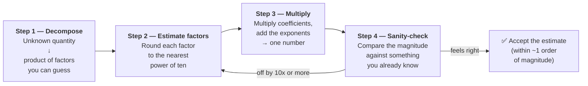

# Fermi Estimation — Junior

<!-- level-focus -->
At junior level, focus on this question:

> How can I apply **Fermi Estimation** in one small example and prove the result?

Use the smallest realistic scenario that exposes the decision and its failure behavior.
Fermi estimation is the single most useful arithmetic skill in a system-design interview, and one of the most useful in real engineering. It is the art of producing a *good enough* number for an unknown quantity in under a minute, using nothing but a pencil, a few facts you already carry in your head, and multiplication. The output is not a precise figure — it is a **magnitude**: a power of ten that tells you whether the answer is closer to a thousand, a million, or a billion. That is usually exactly what a design decision needs.

This page teaches the technique itself. We work the classic warm-up (piano tuners in Chicago) step by step, then apply the identical method to a systems question (storage for a year of a chat app's messages). By the end you should be able to take *any* "how many / how much" question and break it into a product of factors you can guess.

## 1. What a Fermi estimate is

Enrico Fermi was a physicist who, famously, estimated the yield of the first atomic bomb test by dropping scraps of paper as the blast wave passed and watching how far they were pushed. No instruments, no time to compute — just a quick decomposition and a number that landed in the right range. The genre of problem named after him follows the same spirit: **estimate an apparently unanswerable quantity by reasoning from things you do know.**

The key insight is that almost any large unknown is secretly a *product of smaller knowns*. You cannot directly know "how many gas stations are there in the United States," but you can guess:

- roughly how many people live in the US,
- roughly how many people one gas station serves,

and divide. Each of those sub-questions is something you can reason about from daily life. You have effectively replaced one impossible question with two tractable ones.

A Fermi estimate has three defining properties:

- **It is fast.** Seconds to a couple of minutes, done in your head or on a napkin.
- **It targets a magnitude, not a value.** The goal is to be within a factor of ~10 (one order of magnitude) of the truth — sometimes a factor of 3.
- **It is built from a decomposition you can defend.** Anyone listening can follow each factor and challenge it. The number is auditable.

That auditability is what makes it valuable in an interview. The interviewer rarely cares whether you said 47 GB or 130 GB. They care that your *reasoning chain* was sound and that you knew which factor dominated the result.

---

## 2. Why order-of-magnitude is usually enough

Engineers new to this technique often resist it: "How can a guess that might be off by 2x or 3x be useful?" The answer is that design decisions are themselves quantized into magnitudes. The *action* you take rarely changes between 80 GB and 200 GB — but it changes dramatically between 80 GB, 80 TB, and 80 PB.

Consider what a storage estimate decides:

| Estimated yearly storage | What it implies | What you'd reach for |
| --- | --- | --- |
| ~10 GB | Fits on one laptop | A single SQLite file or one small DB |
| ~1 TB | Fits on one server's disk | One Postgres instance, daily backups |
| ~100 TB | Too big for one machine | Sharding, object storage (S3), a data tier |
| ~10 PB | A genuine infrastructure program | Distributed storage, dedicated team, tiered cold storage |

Each row is a *different architecture*. The boundaries between them are roughly factors of 100 to 1000 apart. So an estimate that nails the order of magnitude lands you in the right row — and the right row is the decision. Refining 100 TB into "actually 140 TB" does not move you to a different row, so the extra precision buys nothing at this stage.

This is why "roughly right, fast" beats "precisely right, slow." In an interview you have minutes; in real planning you often need a number *before* you have real data to measure. A magnitude that is directionally correct lets you proceed. You can always tighten it later with a load test once the design is chosen.

The one caution: order-of-magnitude is enough for *picking an approach*, not for *capacity planning a launch*. When you size the actual cluster, you measure. Fermi estimation gets you to the right ballpark; production gets you to the right seat.

---

## 3. The four-step method

Every Fermi estimate, whether about pianos or petabytes, follows the same four steps.

**Step 1 — Decompose.** Rewrite the unknown as a *product* (or quotient) of factors you can guess. This is the creative step and the one that matters most. If your decomposition is good, the arithmetic is trivial.

**Step 2 — Estimate each factor to the nearest power of ten.** Round aggressively. Is the number of daily messages per user closer to 10, 100, or 1000? Pick one. Do not agonize between 40 and 60 — round to 50 or even just 10^1.5 territory and move on. Precision here is wasted effort.

**Step 3 — Multiply.** Combine the factors. The easiest way to avoid arithmetic mistakes is to handle the *coefficients* and the *powers of ten* separately: multiply the leading digits, then add the exponents. `(2×10^8) × (5×10^1) = 10 × 10^9 = 10^10`.

**Step 4 — Sanity-check the magnitude.** Step back and ask: "Does this number feel right?" Compare against something you know. If your estimate says a chat app needs 5 exabytes a year, you have a bug — that is more than the largest companies on earth store in total. Re-examine your factors; usually one is off by a power of ten.

The discipline is in steps 2 and 4. Beginners over-invest in precision (step 2) and skip the reality check (step 4). Reverse that. Round brutally, then sanity-check hard.

---

## 4. Worked example: piano tuners in Chicago

This is the canonical Fermi problem. How many piano tuners work in Chicago? You almost certainly do not know — but you can build the answer.

**Step 1 — Decompose.** A piano tuner's workload is: pianos exist, each needs tuning periodically, and one tuner can only do so many tunings a year. So:

```
tuners = (tunings needed per year) / (tunings one tuner does per year)
```

and the numerator further decomposes:

```
tunings per year = (pianos in Chicago) × (tunings per piano per year)
```

and the number of pianos decomposes from population:

```
pianos in Chicago = (people in Chicago) × (fraction owning a piano, roughly)
```

**Step 2 — Estimate each factor.**

| Factor | Reasoning | Estimate |
| --- | --- | --- |
| People in Chicago | A large US city, well under New York | ~3,000,000 |
| People per household | A household, not a person, owns a piano | ~3 |
| Households in Chicago | 3M ÷ 3 | ~1,000,000 |
| Fraction of households with a tuned piano | Pianos are uncommon; maybe 1 in 20 | ~1/20 |
| Pianos in Chicago | 1M × 1/20 | ~50,000 |
| Tunings per piano per year | Most owners tune once a year, many less | ~1 |
| Tunings needed per year | 50,000 × 1 | ~50,000 |
| Tunings one tuner does per day | A tuning takes ~2 hours, ~4 per workday | ~4 |
| Working days per year | ~50 weeks × 5 days, minus travel slack | ~200 |
| Tunings one tuner does per year | 4 × 200 | ~800, call it ~1,000 |

**Step 3 — Multiply (here, divide).**

```
tuners = 50,000 tunings per year / 1,000 tunings per tuner per year
       ≈ 50
```

**Step 4 — Sanity-check.** Around 50 piano tuners for a city of three million. Does that feel right? It is not 5 (too few to serve 50,000 pianos), and it is not 5,000 (that would be one tuner per 600 people, absurd for a niche trade). Fifty is plausible. Published estimates and business directories for Chicago land in the same ballpark — typically dozens to a couple hundred. We are within an order of magnitude. **Success.**

Notice what just happened: a question you could not answer became five questions you *could*, and the only inputs were facts from ordinary life (city sizes, how long a tuning takes, how often people tune). That is the entire skill.

---

## 5. The decomposition diagram

The four-step method is best held in your head as a pipeline: a hard unknown flows in on the left, gets broken into guessable factors, the factors get multiplied, and a sanity check guards the exit. Each stage feeds the next.



The loop back from the sanity check to the estimation step is important: when the final number feels wrong, you do **not** throw away the method. You return to step 2, find the one factor that is off by a power of ten, fix it, and re-multiply. Almost every "wildly wrong" Fermi answer traces to a single misplaced exponent, not to a flawed decomposition.

---

## 6. Worked example: one year of chat-app storage

Now the same machine, pointed at a systems question. *How much storage does a chat app need to keep one year of messages?* This is a textbook back-of-envelope question, and it decomposes beautifully.

**Step 1 — Decompose.** Total bytes is just the number of messages times the size of each message:

```
yearly storage = (messages per year) × (bytes per message)
```

and messages per year decomposes from users and their activity:

```
messages per year = (users) × (messages per user per day) × (days per year)
```

So the full product is:

```
yearly storage = users × messages-per-user-per-day × days-per-year × bytes-per-message
```

Four factors, every one of them guessable.

**Step 2 — Estimate each factor.**

| Factor | Reasoning | Estimate |
| --- | --- | --- |
| Active users | Assume a mid-size app | 10,000,000  (10^7) |
| Messages per user per day | Light chatters and heavy chatters average out | 50  (≈ 5×10^1) |
| Days per year | A rounded year | 365 ≈ 400  (4×10^2) |
| Bytes per message | Short text + metadata (IDs, timestamps, flags) | 1,000 bytes  (10^3) |

A short text message is maybe 100 characters, but the *stored* record carries a message ID, sender ID, conversation ID, timestamp, and status flags. Rounding the whole row to ~1 KB is honest and keeps the arithmetic clean.

**Step 3 — Multiply.** Separate coefficients from powers of ten.

```
messages per year = 10^7 users × (5×10^1) × (4×10^2)
                  = (5 × 4) × 10^(7+1+2)
                  = 20 × 10^10
                  = 2 × 10^11 messages per year   (200 billion)

yearly storage    = 2×10^11 messages × 10^3 bytes
                  = 2 × 10^14 bytes
                  = 200 × 10^12 bytes
                  ≈ 200 TB per year
```

**Step 4 — Sanity-check.** Two hundred terabytes a year for a ten-million-user chat app. Cross-check it two ways:

- *Per user:* 200 TB ÷ 10M users = 20 MB per user per year. For someone sending ~50 messages a day, that is a reasonable text footprint. Plausible.
- *Against the decision table* in section 2: ~100 TB lands in the "too big for one machine — needs sharding and object storage" row. That is a *believable* conclusion for a real chat product, and it is genuinely useful: it tells you the design must not assume a single database.

Both checks agree. The estimate holds. Note that we did **not** include media (photos, video, voice) — that is deliberately out of scope for a junior pass, and worth flagging aloud, because media would dominate and push the number up by one to two orders of magnitude. Knowing *what you left out* is part of a good estimate.

---

## 7. Numbers worth memorizing

Fermi estimation is only fast if you do not have to derive your base facts each time. A small kit of memorized numbers does most of the work. Internalize these and the arithmetic becomes mechanical.

| Quantity | Value to remember |
| --- | --- |
| Seconds in a day | ~100,000  (86,400 → round to 10^5) |
| Seconds in a month | ~2.5 million |
| Seconds in a year | ~30 million (~3×10^7) |
| Bytes in 1 KB / MB / GB / TB | 10^3 / 10^6 / 10^9 / 10^12 |
| A short text message stored | ~1 KB (text + metadata) |
| A typical web page / API response | ~100 KB – 1 MB |
| A compressed photo | ~1 MB |
| A minute of standard video | ~10 MB |
| World population | ~8 billion (10^10 order) |
| A "big" social app's daily active users | 10^8 – 10^9 |

The most valuable trick on this list is **"seconds in a day ≈ 100,000."** It converts any per-day rate into a per-second rate (and vice versa) with a single power of ten. For example, 1 billion requests per day ÷ 100,000 seconds ≈ 10,000 requests per second. That conversion appears in almost every capacity question.

A second habit: always carry your powers of ten explicitly. Writing `2 × 10^11` instead of "two hundred billion" makes the final multiplication trivial and slashes the chance of dropping or adding a zero — the single most common error in this whole exercise.

---

## 8. Why the errors cancel out

A reasonable worry: "If I round four different factors, don't the errors pile up into nonsense?" In practice they tend to *cancel*, and this is the mathematical reason Fermi estimation works as well as it does.

When you guess a factor, you are about as likely to guess too high as too low. If you overestimate one factor by 2x and underestimate another by 2x, the product is unchanged. Across four or five independent factors, the over- and under-shoots partially offset. The combined error of a product of several rounded factors grows *much* more slowly than the worst case, because the random direction of each error matters.

A useful way to think about it: errors in a Fermi estimate multiply, but they multiply *both ways*. A factor that is "off by 2x" might be 2x too big or 2x too small, and with several such factors the net drift toward either extreme is unlikely. This is why a five-factor estimate, each factor only known to a factor of 2 or 3, still typically lands within a single order of magnitude overall. You will essentially never see all five errors line up in the same direction.

The practical lesson: **do not agonize over any single factor.** The estimate's accuracy comes from the structure of the decomposition, not from the precision of any one guess. Spend your effort making sure you have not *forgotten a factor entirely* (forgetting "days per year" or a 10x metadata overhead is a real error that does not cancel) rather than polishing a factor from 50 to 47.

---

## 9. Common mistakes

A short catalog of the failures that trip up people new to the technique.

- **Skipping the decomposition.** Blurting a single number ("uh, maybe 50 TB?") with no factors behind it. The number is unverifiable and you cannot recover when it is challenged. Always show the product.
- **Chasing false precision.** Spending thirty seconds deciding between 45 and 55 messages per day. Round to 50 (or 10^1.5) and move on; the extra digit will be swamped by your other guesses anyway.
- **Dropping or adding a zero.** The number-one source of being off by 10x or 100x. Defend against it by writing every factor in `coefficient × 10^exponent` form and adding the exponents separately.
- **Forgetting a whole factor.** Computing messages per *day* and reporting it as messages per *year*, or ignoring metadata overhead so each message is "100 bytes" instead of ~1 KB. Missing factors do not cancel — they shift the whole answer by their own magnitude.
- **Skipping the sanity check.** Reporting "5 EB/year" with a straight face because the arithmetic produced it. Always end by comparing to something you know; the largest cloud providers, total human population, the per-user footprint.
- **Mixing units mid-calculation.** Multiplying messages-per-day by days-per-year by bytes is fine; multiplying messages-per-day by *seconds*-per-year is a unit error. Keep your units aligned and, when in doubt, write them next to each factor and cancel them like in physics.
- **Over-scoping for the level.** Trying to include media, replication factor, indexes, and compression all at once on a first pass. Estimate the dominant term first; flag the rest as "next, I'd add…". A clean order-of-magnitude beats a tangled, half-finished precise calculation.

---

## 10. Practice prompts

The technique only sticks through repetition. Try these aloud, on paper, in under two minutes each — and always finish with a sanity check.

- How many photos does a 100-million-user photo app store per year? (Decompose: users × photos/user/day × days × bytes/photo.)
- How many requests per second does an app serving 1 billion page views per day handle on average? (Use seconds-per-day ≈ 10^5.)
- How much bandwidth does a video platform push if it streams 10 million hours of video per day at ~5 MB per minute?
- How many emails are sent worldwide per day? (Start from world population and active-user fraction.)
- How much RAM would you need to cache the user profiles of a 50-million-user service if each profile is ~2 KB?
- How many gas stations are there in your country? (A non-systems warm-up to keep the decomposition muscle loose.)

For each, write the factor table first (like in sections 4 and 6), *then* multiply. If your answer feels wrong, do not discard the method — find the one factor that is off by a power of ten and fix it.

---

## Apply it

1. Choose one small, known input for **Fermi Estimation**.
2. Predict the output or observable behavior.
3. Run the smallest example or probe that exercises the concept.
4. Change one input to trigger a failure or boundary case.
5. Explain the evidence using the guide's vocabulary.

## Verify your work

- Record the exact input, command or code path, and output.
- Repeat the probe and confirm the result is consistent.
- Show one expected success and one expected failure.
- Resolve any difference between the prediction and the evidence.

## Review questions

- What problem does Fermi Estimation solve in the example?
- Which input changes the observed result, and why?
- What is the smallest useful success check?
- Which beginner mistake would your evidence catch?
