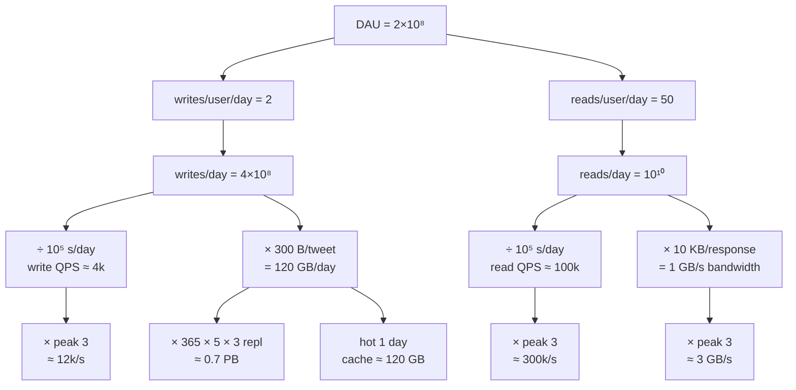
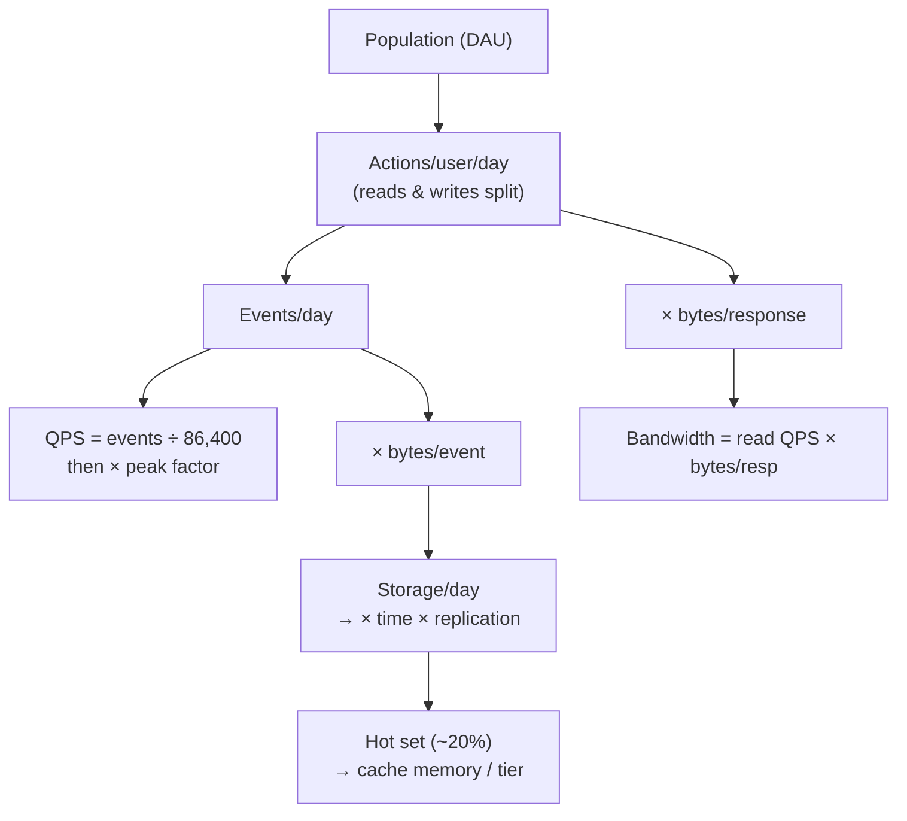

# Fermi Estimation — Middle

<!-- level-focus -->
At middle level, focus on this question:

> Where does **Fermi Estimation** belong in a maintainable component, and which trade-off selects the design?

Use the smallest realistic scenario that exposes the decision and its failure behavior.
Fermi estimation is the discipline of getting within an order of magnitude of an unknown quantity by *decomposing* it into pieces you can defend, *anchoring* each piece on a stated assumption, and *multiplying through*. At the junior level you learned the reference numbers (a SSD seek is ~100 µs, a sequential 1 MB read is ~250 µs, an intercontinental round trip is ~150 ms, a day is ~86,400 s ≈ 10^5 s). At this level you stop estimating isolated quantities and start estimating *whole systems*: given "design Twitter" or "design a photo store," you produce QPS, storage, bandwidth, and cache-memory numbers in five minutes, with every assumption written down so a reviewer can push back on exactly one number instead of the whole answer.

This page is the *method*. It gives you a fixed template, an anchoring discipline, a bounding (low/high) technique, ratio reasoning to scale a known system, dimensional analysis as an error check, and two estimates carried end-to-end.

## 1. Why a template beats cleverness

A Fermi estimate is only useful if it is *reproducible* and *auditable*. The number itself matters less than the chain that produced it. Two engineers who write down the same decomposition should land within 2× of each other; if they land 50× apart, one of them made an assumption the other can now point at.

A fixed template buys you three things:

- **Coverage.** You will not forget bandwidth because you got excited about storage. The template's rows are a checklist.
- **Speed.** You are filling in blanks, not inventing structure under interview pressure.
- **Debuggability.** When the final number looks wrong, you walk the template top to bottom and find the row that is off by 10×. Without structure, a wrong answer is just wrong; with structure, it is wrong *at a specific line*.

The rule of thumb that makes all of this work: **carry one significant figure and round aggressively.** 86,400 seconds becomes 10^5. 1,024 becomes 10^3. A "few hundred million" becomes 10^8 or 10^9 and you *bound it both ways* (see §4). Precision is a trap — it hides the order-of-magnitude error that actually matters.

## 2. The standard system-estimation template

Almost every capacity estimate is the same Fermi decomposition. You start from a population of users and flow downward through actions, rate, and size, branching into the four quantities an interviewer asks for: **QPS, storage, bandwidth, memory.**

The canonical chain:

```
DAU → actions/user/day → events/day → QPS(avg) → QPS(peak)
                                    ↘ bytes/event → storage/day → storage/N-years
                                    ↘ bytes/response → bandwidth
                              hot-set → cache memory
```

Here is the template as a table. Fill the left column with your stated assumption, do the arithmetic in the middle, and the right column tells you the typical multiplier so you do not lose a factor of 10.

| Row | Quantity | How to compute | Typical anchor |
|-----|----------|----------------|----------------|
| 1 | DAU (daily active users) | given or assumed | 10^6–10^9 |
| 2 | Actions per user per day | reads + writes separately | reads 10–100, writes 1–10 |
| 3 | Events per day | DAU × actions/user/day | — |
| 4 | Seconds per day | constant | 86,400 ≈ 10^5 |
| 5 | **QPS (average)** | events per day ÷ 10^5 | — |
| 6 | **QPS (peak)** | QPS_avg × peak factor | peak ≈ 2–3× avg |
| 7 | Bytes per write | sum field sizes, round up | tweet ~300 B, photo ~1–2 MB |
| 8 | **Storage per day** | writes/day × bytes/write | — |
| 9 | **Storage over N years** | storage/day × 365 × N × replication | replication ×3 |
| 10 | Bytes per read response | payload size | — |
| 11 | **Read bandwidth** | read QPS × bytes/response | — |
| 12 | Hot-set fraction | "80/20": 20% of data is 80% of reads | keep ~20% in cache |
| 13 | **Cache memory** | hot-set bytes (often daily working set) | — |

Memorize the row *order*, not the numbers. The numbers come from the problem; the order is what keeps you from skipping a step. Notice that QPS, storage, bandwidth, and memory are *four leaves of one tree* — they share rows 1–3, then branch. This is why a single clean decomposition answers all four questions at once.

## 3. Anchoring: state your assumptions out loud

An **anchor** is a number you cannot derive, so you assert it — and then you say it aloud so it can be corrected. Every Fermi estimate rests on a handful of anchors; the skill is making them *explicit and individually challengeable* rather than baking them silently into a product.

Say the sentence: *"I'll assume 200 million daily active users, 50 reads and 2 writes per user per day, 300 bytes per tweet, a peak factor of 3, a read:write ratio that falls out of those actions, and 3× replication."* Now every one of those is a knob the interviewer can turn. If they say "assume a billion DAU," you change one row and re-multiply; you do not start over.

The anchors that appear in almost every system estimate:

| Anchor | Default to state | Why it's a default, not a fact |
|--------|-----------------|-------------------------------|
| Peak-to-average ratio | **2–3×** | Traffic concentrates in waking hours / events; rarely flat |
| Read:write ratio | **10:1 to 100:1** | Most consumer systems are read-heavy; a feed is read far more than written |
| Bytes per text record | **100 B–1 KB** | A row with a few short fields plus overhead |
| Bytes per media object | **100 KB–10 MB** | Compressed photo ~1–2 MB, short video tens of MB |
| Replication factor | **3×** | Standard for durability across a quorum |
| Cache hit-set | **~20% of data, ~80% of traffic** | Power-law / recency of access |
| Metadata overhead | **+20–30%** | Indexes, keys, timestamps you forgot |

The discipline is: **never let an anchor hide.** If a number entered your calculation and you cannot point to the row where you declared it, you have a silent assumption — the most common source of a 10× miss. When you present, lead with the anchor list. It signals that you know which numbers are assumptions (correctable) versus arithmetic (mechanical).

## 4. Bounding: compute a low and a high estimate

A single point estimate is fragile — one shaky anchor and it's off by 10×. The fix is **bracketing**: for each uncertain anchor, plug in a plausible *low* value and a plausible *high* value, and carry both through. You end with a *range* — and crucially, you learn *which anchor the answer is sensitive to.*

The mechanics: pick the 2–3 anchors you're least sure about. For each, write a low and a high. Multiply the lows together for the floor, the highs together for the ceiling. If floor and ceiling are within ~10×, you have a usable answer and you can quote the geometric mean. If they're 1000× apart, the spread tells you *exactly which anchor to go nail down* before trusting the number.

Worked bounding for "tweets stored per day" with DAU = 2×10^8:

| Anchor | Low | High |
|--------|-----|------|
| Writes per user per day | 0.5 | 5 |
| Bytes per tweet (with metadata) | 200 B | 1 KB |
| Replication | 3× | 3× |

- **Floor:** 2×10^8 × 0.5 × 200 B × 3 = 6×10^10 B ≈ **60 GB/day**
- **Ceiling:** 2×10^8 × 5 × 1 KB × 3 = 3×10^12 B ≈ **3 TB/day**

Floor to ceiling is ~50×, driven almost entirely by the *writes-per-user* anchor (10× spread) and *bytes* (5× spread). The geometric mean is √(60 × 3000) ≈ **420 GB/day**, which is the number to quote. The lesson the bound teaches: if this estimate mattered, the highest-leverage thing to measure is *how often users actually tweet* — not the byte size, and certainly not replication (which has zero spread and cancels out of the ratio).

Bounding turns "I guessed" into "the answer is between X and Y, and it's most sensitive to Z." That sentence is what separates a practitioner's estimate from a number pulled out of the air.

## 5. Proportional reasoning: scale a known system

When you already know a *reference* system's numbers, you can reach the target by **ratio**, skipping the full decomposition. The trick is that most quantities scale linearly with the driver, so:

```
target = reference × (target driver / reference driver)
```

Suppose you know a service handles **10,000 QPS** at **1 million DAU**, and you're asked to size it for **50 million DAU** with the same usage pattern. QPS scales linearly with DAU, so:

```
QPS_target = 10,000 × (50M / 1M) = 10,000 × 50 = 500,000 QPS
```

No template needed — one multiplication. The same ratio works for storage and bandwidth *as long as the per-user behavior is unchanged*. This is the fastest path when you have a known anchor system.

The caveats that separate good ratio reasoning from bad:

- **Linear in the right driver.** QPS scales with active users, *not* total registered users. Storage scales with *cumulative* writes, not DAU — a system can have flat DAU but storage growing every day. Pick the driver that the quantity actually depends on.
- **Watch for non-linearity.** Some costs are super-linear: an all-pairs feature (everyone sees everyone) scales as N². Coordination overhead, fan-out, and join costs can break linearity. If you suspect N² behavior, *say so* and scale by the squared ratio.
- **Per-user behavior must hold.** If the bigger system also changes *how* users behave (more engagement, richer media), the ratio undercounts. State "assuming identical per-user usage" so the assumption is visible.

Ratio reasoning and the template are two paths to the same place. Use the ratio when you have a trustworthy reference; use the template when you're starting cold. A strong answer often does both: full template once, then *"to double-check, this is 50× a system I know runs at 10k QPS, so ~500k QPS — consistent."*

## 6. Dimensional analysis as an error check

The cheapest bug-catcher in Fermi estimation is **units**. Every quantity has dimensions; if you write the units alongside the numbers and *cancel them like fractions*, a unit that survives where it shouldn't reveals a missing or extra factor. This is how you catch a "per day" you forgot to divide out.

The rule: **carry units through every multiplication and division, and check the final unit is what the question asked for.**

Bandwidth example, units explicit:

```
reads      bytes        reads × bytes      bytes
─────── × ───────  =  ─────────────────  = ───────   ✓  (this is bandwidth)
second     read         second × read       second
```

The `read` cancels top and bottom, leaving bytes/second — correct for bandwidth. If instead you had multiplied *reads/day* by *bytes/read* you'd get bytes/**day**, and the surviving "day" tells you to divide by 86,400 to get a rate. The unit is the alarm.

Storage-over-time example:

```
writes    bytes    seconds   days
────── × ─────── × ─────── × ──── × years  =  bytes
second    write      day      year
```

Walk it: writes/second × bytes/write = bytes/second; × seconds/day = bytes/day; × days/year × years = bytes. The dimensions cancel to a pure `bytes` — a *quantity*, which is what "storage" should be. If you'd accidentally left a rate, the leftover "/second" would scream that you described a flow, not a stockpile.

Two habits that make this automatic:

- **Distinguish rates from quantities.** QPS and bandwidth are *rates* (something / second). Storage and cache memory are *quantities* (bytes). If your "storage" answer has a "/second" in it, you computed bandwidth by mistake.
- **Sanity-check magnitudes against units.** "500 TB/second of bandwidth" should make you stop: no single service does that; you likely multiplied a daily total by a per-request size without dividing by 86,400.

Dimensional analysis won't tell you the answer is *right*, but it reliably tells you when it's *wrong by a structural mistake* — which is the kind of error that costs you 10× or more.

## 7. Worked estimate A: a Twitter-style feed

The brief: estimate QPS, storage, bandwidth, and cache memory for a Twitter-like feed.

**Anchors, stated out loud:**

- DAU = 2×10^8 (200 million)
- Writes (tweets) per user per day = 2 → read:write follows from reads
- Reads (feed loads) per user per day = 50
- Bytes per tweet, with metadata = 300 B
- Bytes per feed response (≈ 20 tweets + media refs) = 10 KB
- Peak factor = 3×
- Replication = 3×, retention = 5 years

**Row-by-row through the template:**

Events per day:
```
writes/day = 2×10^8 × 2  = 4×10^8 tweets/day
reads/day  = 2×10^8 × 50 = 10^10 feed-loads/day
```

QPS (average), dividing by 10^5 s/day:
```
write QPS = 4×10^8 / 10^5 = 4×10^3   ≈ 4,000 writes/s
read  QPS = 10^10  / 10^5 = 10^5      ≈ 100,000 reads/s
```

QPS (peak), ×3:
```
peak write QPS ≈ 12,000/s
peak read  QPS ≈ 300,000/s
```

Storage per day, then over 5 years with replication:
```
storage/day = 4×10^8 writes × 300 B = 1.2×10^11 B ≈ 120 GB/day
5-year raw   = 120 GB × 365 × 5      ≈ 2.2×10^5 GB ≈ 220 TB
with ×3 repl ≈ 660 TB  ≈ ~0.7 PB
```

Read bandwidth, using bytes/response and read QPS:
```
bandwidth = 10^5 reads/s × 10^4 B/read = 10^9 B/s = 1 GB/s  (avg)
peak      ≈ 3 GB/s
```

Cache memory — hold one day of tweets hot (recency dominates a feed):
```
hot set ≈ 1 day of tweets = 120 GB
round to a cache tier of ~100–200 GB of RAM (sharded across nodes)
```

**Decomposition tree for this estimate (staged):**



**Result summary:** ~100k read QPS (300k peak), ~4k write QPS (12k peak), ~0.7 PB over five years replicated, ~1 GB/s read bandwidth (3 GB/s peak), ~120 GB hot cache. Every one of those traces back to a stated anchor; change DAU to 10^9 and multiply the leaf numbers by 5.

## 8. Worked estimate B: a photo-storage system

The brief: estimate the same four quantities for an Instagram-like photo store. The shape is identical; only the bytes-per-object anchor explodes, which shifts where the cost lives — from QPS to *storage and bandwidth*.

**Anchors, stated out loud:**

- DAU = 10^8 (100 million)
- Photo uploads per user per day = 2
- Photo views per user per day = 100
- Bytes per stored photo (original + thumbnails) = 2 MB
- Bytes served per view (a single sized image) = 300 KB
- Peak factor = 2×
- Replication = 3×, retention = 5 years

**Row-by-row:**

Events per day:
```
uploads/day = 10^8 × 2   = 2×10^8 photos/day
views/day   = 10^8 × 100 = 10^10 views/day
```

QPS:
```
write QPS = 2×10^8 / 10^5 = 2,000/s        peak ≈ 4,000/s
read  QPS = 10^10  / 10^5 = 100,000/s       peak ≈ 200,000/s
```

Storage — this is where photos diverge from tweets (2 MB vs 300 B is ~7,000×):
```
storage/day = 2×10^8 × 2 MB = 4×10^14 B ≈ 400 TB/day
5-year raw  = 400 TB × 365 × 5 ≈ 7.3×10^5 TB ≈ 730 PB
with ×3 repl ≈ 2,200 PB ≈ ~2 EB
```

Read bandwidth — likewise dominated by object size:
```
bandwidth = 10^5 views/s × 3×10^5 B = 3×10^10 B/s = 30 GB/s  (avg)
peak      ≈ 60 GB/s
```

Cache — caching 2 EB of photos in RAM is absurd; cache *hot objects* (~20%) and lean on a CDN:
```
hot daily working set ≈ 20% × 400 TB = 80 TB  → not RAM; CDN edge + SSD tier
metadata cache (rows, not blobs) ≈ small, fits in RAM
```

**Comparison — the same template, two very different cost centers:**

| Quantity | Twitter feed | Photo store | Driving anchor |
|----------|-------------|-------------|----------------|
| Read QPS (peak) | ~300k/s | ~200k/s | reads/user (similar) |
| Write QPS (peak) | ~12k/s | ~4k/s | writes/user |
| Storage / 5 yr (×3) | ~0.7 PB | ~2 EB | **bytes/object (300 B vs 2 MB)** |
| Read bandwidth (peak) | ~3 GB/s | ~60 GB/s | **bytes/response** |
| Cache strategy | 1-day RAM hot set | CDN + SSD tier | object size forces tiering |

The point of running both: the *method is identical* but the *bottleneck moves*. For a text feed, QPS and cache dominate the design conversation. For a media store, storage and bandwidth dominate, RAM caching becomes infeasible, and the design pivots to object storage plus a CDN. The Fermi estimate told you *which problem you're actually solving* before you drew a single box.

## 9. The decomposition tree, generalized

Strip away the specific numbers and every system estimate is the same tree. Internalize this shape and you can estimate anything by hanging anchors on its branches:



The four answers — QPS, storage, bandwidth, cache — are leaves. The shared trunk (population → actions → events) means a change near the root propagates to all leaves, which is *why* one clean decomposition answers every capacity question and why bounding the root anchors brackets the whole system at once.

## 10. Common mistakes and how the method catches them

| Mistake | Symptom | The method that catches it |
|---------|---------|---------------------------|
| Forgot to divide by 86,400 | QPS off by 10^5 | Dimensional analysis: leftover "/day" |
| Silent anchor | Reviewer can't challenge it | Anchoring: read every assumption aloud |
| Single fragile point estimate | One bad guess → 10× wrong | Bounding: low/high bracket |
| Wrong scaling driver | Storage tied to DAU not cumulative writes | Ratio reasoning: pick the real driver |
| Confused rate with quantity | "500 TB/s of storage" | Units: storage is bytes, not bytes/s |
| Over-precision | "86,431 seconds" | Round to one sig-fig: 10^5 |
| Ignored replication / metadata | Storage low by 3–4× | Template rows 9 and 7 force the multiplier |
| Cached the uncacheable | "2 EB in RAM" | Hot-set row + magnitude sanity check |

The through-line: a wrong Fermi answer is almost never wrong by a little. It's wrong by 10× or 1000×, and it's wrong *at one identifiable row*. The template, the explicit anchors, the bounds, and the unit-cancellation are four independent nets — each catches a different class of structural error before it reaches the final number.

## 11. Checklist

Before you quote a system estimate, confirm:

- [ ] You wrote the template rows top to bottom — DAU, actions, events, QPS avg, QPS peak, bytes, storage, bandwidth, cache.
- [ ] Every anchor is stated out loud and individually challengeable (peak factor, read:write, bytes/record, replication).
- [ ] Reads and writes are split — they have different rates and different byte sizes.
- [ ] You divided daily events by ~10^5 to get QPS, and applied a 2–3× peak factor.
- [ ] Storage carried time *and* replication (and metadata overhead if it matters).
- [ ] You bounded at least the two shakiest anchors (low/high) and know which one the answer is sensitive to.
- [ ] Units cancel to the dimension the question asked for (rate vs quantity).
- [ ] You rounded to one significant figure and didn't fake precision.
- [ ] If you had a reference system, you cross-checked by ratio.

Master this template and the four nets, and "design Twitter — give me the numbers" becomes five minutes of mechanical, defensible arithmetic instead of a guess.

*Next step:* [Senior level](senior.md)

---

## Apply it

1. Find a real component where **Fermi Estimation** affects an interface or dependency.
2. Write two plausible choices and the constraint that favors each one.
3. Make the smallest reversible change at that boundary.
4. Exercise the component alone, then exercise the integrated flow.
5. Keep the decision note with the evidence that selected the option.

## Verify your work

- A focused check proves the local behavior.
- An integrated check proves callers and dependencies still agree.
- Logs, traces, compiler output, or benchmarks expose the boundary.
- Reverting the change restores the previous behavior without unrelated edits.

## Review questions

- Which boundary is most affected by Fermi Estimation?
- What constraint would make you choose the alternative design?
- How would you isolate a local defect from an integration defect?
- What evidence shows that the change remains maintainable?
