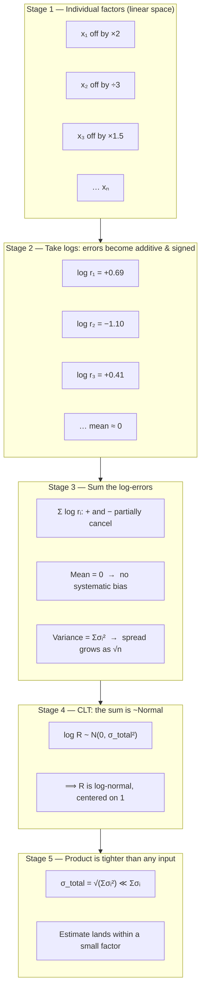

# Fermi Estimation — Theory and Formal Foundations

<!-- level-focus -->
At professional level, focus on this question:

> How should teams adopt and operate **Fermi Estimation — Theory and Formal Foundations** with measurable outcomes and limited coordination?

Use the smallest realistic scenario that exposes the decision and its failure behavior.
A Fermi estimate is a *product of guesses*, yet it routinely lands within a factor of 2–4 of the truth even when each input guess is off by a factor of 3 or more. That is not luck and it is not folklore. It is a theorem. When you multiply many independent factors, each known only to within some multiplicative tolerance, the **relative** errors combine in **log space**, where they *add* rather than *amplify* — and by the Central Limit Theorem the sum of those log-errors tends toward a normal distribution. Over- and under-estimates partially cancel, the product's fractional error grows only as the *square root* of the number of factors, and the result is far tighter than any single input. This document makes that argument precise: log-normal distributions, the geometric mean as the correct "average" for multiplicative quantities, propagation of uncertainty in quadrature, significant-figure discipline, dimensional analysis as a formal correctness check, and the conditions under which the cancellation guarantee fails.

## 1. The Core Claim, Stated Precisely

A Fermi estimate computes a quantity `Q` as a product of `n` estimated factors:

```
Q = x₁ · x₂ · x₃ · … · xₙ
```

Each factor `xᵢ` has a true value `x̂ᵢ` and an estimate `xᵢ`. Define the **multiplicative error** of factor `i`:

```
rᵢ = xᵢ / x̂ᵢ
```

`rᵢ = 1` means a perfect guess; `rᵢ = 2` means you overshot by a factor of 2; `rᵢ = 0.5` means you undershot by half. The total error of the product is:

```
R = Q / Q̂ = (x₁·x₂·…·xₙ) / (x̂₁·x̂₂·…·x̂ₙ) = r₁ · r₂ · … · rₙ
```

The naive fear is that errors *compound*: if every factor is off by 2×, surely a 5-factor product is off by 2⁵ = 32×? That fear is only justified if every error points the **same direction**. In practice your guesses are unbiased — sometimes high, sometimes low — and the directions are independent. The claim of this document:

> If the `rᵢ` are independent and unbiased in log space, then `R` concentrates near 1 much more tightly than any individual `rᵢ`. The *spread* of the product grows only as `√n`, not `n`, and certainly not exponentially.

The rest of this document proves and quantifies that claim, and tells you exactly when it stops being true.

[↑ Back to top](#table-of-contents)

---

## 2. Why Multiplicative Quantities Live in Log Space

Estimation error is naturally *multiplicative*, not additive. When you guess "a city has about a million people," your error bar is not "± 50,000"; it is "somewhere between 300k and 3M" — a factor of ~3 either way. The natural unit of uncertainty is a **ratio**, not a difference.

Taking logarithms converts the multiplicative structure into an additive one:

```
log Q = log x₁ + log x₂ + … + log xₙ
log R = log r₁ + log r₂ + … + log rₙ
```

This single transformation is the engine behind every result that follows. Three consequences fall out immediately:

| Property | In linear space (sums) | In log space (products) |
|---|---|---|
| Natural error measure | Absolute: `x ± Δx` | Relative: `x ×/÷ f` (factor `f`) |
| Errors combine by | Adding values | Adding logarithms |
| Correct "average" | Arithmetic mean | Geometric mean |
| Limiting distribution (CLT) | Normal on the value | Normal on the **log** → **log-normal** on the value |
| Symmetry | Symmetric about the value | Symmetric about the *ratio* (×2 and ÷2 are equidistant) |

The log transform also restores symmetry that linear thinking destroys. A guess of 2× too high and a guess of 2× too low are *equally wrong* — but on a linear scale, "+1M" and "−0.5M" look asymmetric. In log space they are mirror images: `+log 2` and `−log 2`. This symmetry is precisely what makes cancellation possible: equal and opposite log-errors sum to zero.

[↑ Back to top](#table-of-contents)

---

## 3. The Log-Normal Distribution and the Geometric Mean

A random variable `X` is **log-normal** if `log X` is normally distributed. Formally, if `Y = log X ~ N(μ, σ²)`, then `X = e^Y` is log-normal with parameters `μ` (the log-mean) and `σ` (the log-standard-deviation, often called the **geometric standard deviation** when exponentiated).

Log-normal distributions appear *everywhere* a quantity is the product of many positive factors: city populations, file sizes, request latencies, income, particle sizes. The reason is structural, not coincidental — it is the multiplicative CLT (Section 4). For estimation, the key facts are:

- **The geometric mean is the natural center.** For a log-normal `X`, the median equals `e^μ`, and `μ` is the mean of `log X`. The estimator that minimizes expected *log-error* is the geometric mean:

  ```
  GM(x₁,…,xₙ) = (x₁ · x₂ · … · xₙ)^(1/n) = exp( (1/n) Σ log xᵢ )
  ```

- **The geometric mean is the right way to combine bracketing guesses.** When you bracket an unknown with a low guess `L` and a high guess `H` (e.g., "between 1,000 and 100,000"), the correct single point estimate is `√(L·H)`, the geometric mean — *not* the arithmetic mean `(L+H)/2`. For `L=1,000`, `H=100,000`: the geometric mean is 10,000 (one order of magnitude up from L, one down from H — the true "middle" on a log scale), whereas the arithmetic mean is 50,500, which is absurdly biased toward the larger endpoint.

- **Geometric standard deviation expresses uncertainty as a factor.** If `σ` is the standard deviation of `log X` (natural log), then a 1-σ interval is `[GM/e^σ, GM·e^σ]`. People who say "I know this to within a factor of 3" are stating `e^σ ≈ 3`, i.e., `σ ≈ 1.1` in natural-log units (or `σ ≈ 0.48` in base-10 log units, since one order of magnitude is `log₁₀10 = 1`).

The practical takeaway: **a Fermi estimate is implicitly a statement about a log-normal distribution.** The point estimate is the geometric mean; the honest error bar is a multiplicative factor.

[↑ Back to top](#table-of-contents)

---

## 4. Why Errors Cancel: CLT in Log Space

Now the central result. We have, from Section 1:

```
log R = Σᵢ log rᵢ
```

Model each `log rᵢ` as an independent random variable with mean 0 (you are unbiased — equally likely to overshoot or undershoot by a given factor) and variance `σᵢ²`. Then:

**Mean of the total log-error is zero.** By linearity of expectation:

```
E[log R] = Σᵢ E[log rᵢ] = 0
```

So the *expected* product is exactly correct — there is no systematic drift. This is the cancellation: positive and negative log-errors are equally likely, and in expectation they sum to nothing.

**Variance adds.** For independent terms, variance is additive:

```
Var(log R) = Σᵢ σᵢ²        ⟹        σ_total = √(Σᵢ σᵢ²)
```

This is the quadrature rule (Section 5). The standard deviation of the total log-error grows as the **square root** of the sum, not the linear sum.

**The distribution becomes normal.** By the **Central Limit Theorem**, a sum of many independent zero-mean random variables converges to a normal distribution regardless of the shape of the individual terms. Therefore `log R ~ N(0, σ_total²)` approximately, which means **`R` is approximately log-normal centered on 1.** This is *why* products of estimates are log-normally distributed and why the geometric mean is the right estimator — the same theorem explains both.

The following staged diagram traces the mechanism from individual guesses to the concentrated product:



The intuition compresses to one line: **`n` factors each spread by `σ` produce a product spread by `σ√n`, not `σn`** — because in log space the errors are signed and independent, so they cancel rather than accumulate.

[↑ Back to top](#table-of-contents)

---

## 5. Propagation of Uncertainty: Quadrature

The general first-order rule for how uncertainty propagates through a function `f(x₁,…,xₙ)` is:

```
σ_f² ≈ Σᵢ ( ∂f/∂xᵢ )² · σ_{xᵢ}²        (independent inputs)
```

For a **pure product** `Q = x₁·x₂·…·xₙ`, it is cleaner to work with *relative* uncertainties. Define the relative uncertainty `εᵢ = σ_{xᵢ} / xᵢ`. The classical result for products and quotients is that **relative uncertainties add in quadrature**:

```
ε_Q = √( ε₁² + ε₂² + … + εₙ² )
```

This is exactly the log-space variance rule from Section 4, because for small errors `log(1+ε) ≈ ε`, so the standard deviation of `log rᵢ` *is* the relative uncertainty `εᵢ` to first order. For larger Fermi-scale errors (factors of 2–3), the log-space form is the more honest one:

```
σ_log(Q) = √( σ_log(x₁)² + σ_log(x₂)² + … + σ_log(xₙ)² )
```

The single most important consequence is **sub-additivity**. The total uncertainty is *less* than the sum of the parts:

```
√(Σ εᵢ²)  ≤  Σ εᵢ        (equality only if all but one εᵢ = 0)
```

For `n` *equal* uncertainties `ε`, the contrast is stark:

```
Linear sum (worst case, all same direction):   n · ε
Quadrature (independent, signed):               √n · ε
Ratio of pessimism to reality:                  n / √n = √n
```

So the naive "errors compound" fear overstates the true uncertainty by a factor of `√n`. With 9 factors, the worst-case reasoning is 3× too pessimistic; the real spread is one-third of what compounding would predict. This is the formal content of "errors cancel."

[↑ Back to top](#table-of-contents)

---

## 6. A Fully Worked Error-Propagation Calculation

Estimate the **daily volume of data ingested by a photo-sharing backend**. We build it as a product of five factors, each with an honest "I know this to within factor `f`" uncertainty. We work in **base-10 log units**, where one order of magnitude = 1.0, and a factor-of-`f` uncertainty contributes `σ = log₁₀ f`.

| Factor | Symbol | Estimate | "Within factor of" | `σ = log₁₀ f` |
|---|---|---|---|---|
| Active users | `U` | 100,000,000 | 1.5 | 0.176 |
| Photos / user / day | `P` | 2 | 2.0 | 0.301 |
| Fraction that upload daily | `A` | 0.10 | 1.5 | 0.176 |
| Bytes / photo (post-compression) | `B` | 3,000,000 | 2.0 | 0.301 |
| Replication + metadata overhead | `O` | 1.4 | 1.3 | 0.114 |

**Step 1 — the point estimate (product of estimates):**

```
Q = U · P · A · B · O
  = 1e8 · 2 · 0.10 · 3e6 · 1.4
  = 8.4e13 bytes/day  ≈  84 TB/day
```

**Step 2 — combine the log-space uncertainties in quadrature:**

```
σ_log(Q) = √(0.176² + 0.301² + 0.176² + 0.301² + 0.114²)
         = √(0.0310 + 0.0906 + 0.0310 + 0.0906 + 0.0130)
         = √0.2562
         = 0.506   (base-10 log units)
```

**Step 3 — convert back to a multiplicative factor:**

```
Total uncertainty factor = 10^0.506 ≈ 3.2×
```

So the honest answer is: **84 TB/day, known to within a factor of ~3.2** — i.e., a 1-σ range of roughly `[26 TB/day, 270 TB/day]`.

**Step 4 — compare against the pessimistic "compounding" view.** If we had naively added the worst-case factors (assuming every error stacked in the same direction):

```
Naive compounded factor = 1.5 · 2.0 · 1.5 · 2.0 · 1.3 = 11.7×
```

The quadrature result (3.2×) is **3.7× tighter** than the compounded fear (11.7×). The product is *more accurate than its single worst inputs*: two of our five factors individually carry a factor-of-2 uncertainty, yet the assembled estimate sits at factor 3.2 overall rather than the 4× you'd get from just those two alone stacking — the other factors do not pile on, they partially cancel.

**Step 5 — sanity-check the dominant contributors.** The variance contributions were `0.0310, 0.0906, 0.0310, 0.0906, 0.0130`. The two factor-of-2 inputs (`P` and `B`) together supply `0.181` of the total `0.256` variance — about 71%. This tells you exactly where to invest if you want a tighter estimate: refining the two factor-of-2 guesses, not the already-tight `O`. **Variance contributions, being squared, concentrate on the worst factor** — a practical corollary of Section 10's "dominant factor" caveat.

[↑ Back to top](#table-of-contents)

---

## 7. How Many Factors Buys How Much Accuracy

Suppose every factor is estimated to within the *same* multiplicative tolerance, with per-factor log-uncertainty `σ`. The product's log-uncertainty is `σ√n`, so the product's multiplicative error factor is `10^(σ√n)` (base-10). The table below fixes a per-factor "within a factor of 3" guess (`σ = log₁₀ 3 = 0.477`) and shows how the assembled 1-σ accuracy degrades with `n` — and crucially, how it compares to the naive compounding bound `3ⁿ`:

| # factors `n` | Naive compounding `3ⁿ` | Quadrature spread `10^(0.477√n)` | How much tighter |
|---|---|---|---|
| 1 | 3.0× | 3.0× | 1.0× |
| 2 | 9.0× | 4.7× | 1.9× |
| 3 | 27× | 6.4× | 4.2× |
| 4 | 81× | 8.1× | 10× |
| 5 | 243× | 10.0× | 24× |
| 7 | 2,187× | 14.4× | 152× |
| 9 | 19,683× | 19.5× | 1,010× |
| 16 | 4.3e7× | 70× | 6.1e5× |

Two lessons jump out. First, **the product's accuracy degrades gracefully** — going from 3 factors to 9 factors only loosens the estimate from ~6× to ~20×, not from 27× to 20,000×. Second, **the cancellation benefit grows explosively with `n`**: by 9 factors, the quadrature estimate is three orders of magnitude tighter than the compounding fear. This is why Fermi estimation works *better* the more steps you decompose into — provided the steps stay independent. Each additional factor adds only `√`-scaled noise while sharpening the model's faithfulness to reality.

A useful rule of thumb falls out: for a typical Fermi chain of 4–7 factors each known to a factor of ~3, expect the final answer to be good **to within one order of magnitude** (`10^(0.477·√5) ≈ 10×`), which is precisely the accuracy claim Fermi estimation advertises. The single-order-of-magnitude promise is not aspirational — it is what `σ√n` predicts.

[↑ Back to top](#table-of-contents)

---

## 8. Significant Figures and Precision Discipline

Given that a 5-factor estimate carries a factor-of-3 uncertainty, **reporting more than one significant figure is dishonest** — it claims precision the method cannot deliver. If your computed product is `8.4 × 10¹³`, the honest report is `≈ 10¹⁴` or "tens of TB/day," because the `8.4` mantissa is meaningless when the true value could be anywhere from `2.6 × 10¹³` to `2.7 × 10¹⁴`.

The discipline rests on a hard rule of error arithmetic:

> **The result cannot be more precise than its least precise input.** A product of one-significant-figure inputs is a one-significant-figure output. Manufacturing extra digits is fabricating information.

Concrete guidance for Fermi work:

- **Carry one significant figure (sometimes two) through the calculation; report one.** Round each factor to a single significant figure before multiplying — `100,000,000` not `97,431,228`. The rounding error introduced is at most ~5% per factor, negligible against factor-of-2 estimation uncertainty.

- **Track powers of ten separately from mantissas.** This is the single most error-resistant Fermi technique. Compute `(1·2·0.1·3·1.4) × 10^(8+0+0+6+0)` as a small mantissa product times a summed exponent. The mantissa rarely overflows your mental arithmetic, and the exponent is just integer addition — which is exactly the log-space additivity from Section 2 applied by hand.

- **Round the final exponent, not the mantissa.** Because uncertainty is multiplicative, what matters is getting the *order of magnitude* right. An estimate of `8.4 × 10¹³` and `2 × 10¹⁴` are "the same answer" at Fermi precision; an estimate that lands at `10¹²` instead of `10¹⁴` is the failure mode to guard against.

- **State the uncertainty as a factor, never as ±.** "84 TB/day, good to a factor of 3" is honest and actionable. "84.2 ± 1.7 TB/day" is a lie about a quantity whose true 1-σ band spans an order of magnitude. The error bar of a Fermi estimate is *geometric*, and writing it additively misrepresents the entire method.

Precision discipline is not pedantry; it is the consumer-facing expression of the variance math. The math says you know the answer to a factor of `10^(σ√n)`; significant-figure discipline is how you avoid promising more.

[↑ Back to top](#table-of-contents)

---

## 9. Dimensional Analysis as a Correctness Check

Before trusting any Fermi product, verify that the **units balance**. Dimensional analysis is a formal, mechanical correctness check that catches a large class of structural errors — multiplying where you should divide, dropping a factor, double-counting a dimension — *before* you ever evaluate the numbers. It is the type system of estimation.

The rule: treat units as algebraic symbols that multiply, divide, and cancel. The dimensions of the result must match the dimensions of the quantity you set out to estimate. Worked through the Section 6 example:

```
[users] · [photos/(user·day)] · [dimensionless] · [bytes/photo] · [dimensionless]

= users · ─photos─ · ─bytes── · (1) · (1)
          user·day   photo

  cancel 'user':       photos/day · bytes/photo · users → (users cancels)...
  full cancellation:
    users × photos/(user·day) × bytes/photo
  = (users · photos · bytes) / (user · day · photo)
  = bytes/day        ✓   ← matches target dimension
```

The `user` cancels against `user`, the `photo` cancels against `photo`, and you are left with `bytes/day` — exactly the dimension you wanted. If instead you had accidentally written `bytes·photo/day`, the leftover `photo` would flag a missing division and tell you a factor is misplaced.

Three formal properties make dimensional analysis indispensable:

| Property | What it guarantees |
|---|---|
| **Units must balance** | The result's dimension equals the target's dimension — a necessary condition for correctness. |
| **Catches structure errors, not magnitude errors** | It will not catch "I guessed 2 photos instead of 5," but it *will* catch "I multiplied by users twice" or "I forgot to divide by seconds." |
| **Forces explicit conversion factors** | Crossing dimensions (`days → seconds`, `GB → bytes`) demands you write `86,400 s/day` or `10⁹ bytes/GB` explicitly, surfacing factors you might otherwise drop. |

A passing dimensional check is *necessary but not sufficient* — correct units do not guarantee a correct number — but a *failing* check is a guaranteed bug. Run it first, every time. It is the cheapest possible verification, and it is fully formal: there is no judgment involved, only symbol cancellation.

[↑ Back to top](#table-of-contents)

---

## 10. When the Cancellation Assumption Fails

The `σ√n` guarantee rests on three assumptions: errors are **independent**, **unbiased** (zero-mean in log space), and **no single factor dominates the variance**. When these break, the product's error can compound, drift, or explode. A principal-level estimator names the failure mode out loud:

**Failure 1 — Correlated errors.** Quadrature requires independence. If two factors share a hidden common cause, their errors move together and *add linearly* rather than in quadrature. Classic case: estimating peak QPS as `users × requests-per-user`, then estimating storage as `users × bytes-per-user`. Both share `users`; if you underestimated `users` by 2×, *both* derived quantities are low by 2× in the same direction — and any ratio or downstream product inherits the correlated bias instead of canceling it. The covariance term reappears: `Var(A+B) = σ_A² + σ_B² + 2·Cov(A,B)`, and positive covariance defeats cancellation. **Mitigation:** estimate shared sub-factors *once* and propagate the single value, so the correlation is explicit rather than double-counted.

**Failure 2 — A single dominant factor.** Quadrature is sub-additive only when uncertainties are comparable. If one factor's `σ` dwarfs the rest, the root-sum-square collapses to that one term: `√(σ_big² + small²) ≈ σ_big`. Cancellation buys you nothing because there is nothing to cancel against — the product is exactly as uncertain as its worst input. In the Section 6 example, the two factor-of-2 inputs supplied 71% of the variance; push one of them to a factor of 10 and it would dominate completely. **Mitigation:** identify the largest-variance factor (Section 6, Step 5) and spend your refinement effort there; tightening the already-good factors is wasted work.

**Failure 3 — Heavy-tailed / wide-spread inputs.** The CLT convergence to log-normal assumes each `log rᵢ` has finite variance and that no single term carries most of the weight. If a factor is genuinely heavy-tailed in log space (e.g., "anywhere from 1 to 10,000, no idea"), its `σ` is huge, convergence is slow, and the product's distribution stays skewed and dominated by that one wild term. The "errors cancel" intuition silently assumes each guess is *roughly* a factor of 2–4 off, not arbitrarily off. **Mitigation:** decompose the wild factor further until each sub-factor is estimable to a factor of a few, restoring comparable, finite variances.

**Failure 4 — Systematic bias (non-zero mean).** Everything above assumed `E[log rᵢ] = 0`. If you consistently round in the same direction — always picking the optimistic number, or anchoring on a memorable but unrepresentative value — then `E[log R] = Σ E[log rᵢ] ≠ 0`, and the biases **add linearly and do not cancel**. Bias is not noise; the square-root law does nothing for it. A 1.3× systematic optimism per factor across 5 factors yields `1.3⁵ ≈ 3.7×` of pure, uncancellable drift. **Mitigation:** deliberately alternate the direction of your rounding, and bracket each factor with an explicit low/high pair, using the geometric mean as the point estimate to neutralize directional bias.

| Failure mode | What breaks | Symptom | Mitigation |
|---|---|---|---|
| Correlated errors | Independence | Shared factor biases two outputs the same way | Estimate shared sub-factors once |
| Dominant factor | Comparable σ | RSS ≈ the single largest σ | Refine the worst factor only |
| Heavy tails | Finite, comparable variance | Skewed, slow CLT convergence | Decompose the wild factor |
| Systematic bias | Zero-mean assumption | Drift that scales as `n`, not `√n` | Alternate rounding; bracket + GM |

[↑ Back to top](#table-of-contents)

---

## 11. Practitioner's Summary

The mathematics of Fermi estimation reduces to a small set of load-bearing facts:

- **Multiplicative quantities live in log space.** Take logs, and a product becomes a sum; estimation error becomes additive and signed. Everything else follows from this one move.
- **The geometric mean is the correct estimator.** For multiplicative quantities, average in log space. To collapse a low/high bracket to a point, use `√(L·H)`, never `(L+H)/2`.
- **Errors cancel because the CLT acts in log space.** The sum of independent zero-mean log-errors is approximately normal with mean 0 and variance `Σσᵢ²`. The product is therefore log-normal, centered on the truth, with spread `σ√n` — not `σn`, and never `σⁿ`.
- **Uncertainties combine in quadrature.** `σ_total = √(Σσᵢ²)`. This is sub-additive: the assembled estimate is `√n`-times tighter than the naive "compounding" fear, and that advantage grows with every factor you decompose into.
- **More independent factors make estimates *better*.** Accuracy degrades only as `√n`, so a well-decomposed 5–7 factor chain reliably lands within one order of magnitude — exactly the Fermi promise.
- **Report one significant figure and a multiplicative error bar.** "≈ 10¹⁴, good to a factor of 3," not "84.2 ± 1.7." Track powers of ten separately and round the exponent.
- **Dimensional analysis is your free, formal correctness check.** Cancel units like algebra; a failing check is a guaranteed bug. Run it before evaluating numbers.
- **Know when the guarantee dies.** Correlated errors, a single dominant factor, heavy tails, and systematic bias all defeat cancellation. The first three loosen the estimate; the fourth — bias — *adds linearly and never cancels*, and is the one to fear most.

Master these and a back-of-envelope estimate stops being a guess and becomes a *bounded, defensible inference* — one whose accuracy you can predict before you compute it.

[↑ Back to top](#table-of-contents)

---


---

## Apply it

1. Define the user or business outcome that **Fermi Estimation — Theory and Formal Foundations** should improve.
2. Assign one owner for code, contracts, operations, and incidents.
3. Split delivery into reversible increments that produce evidence early.
4. Publish responsibilities, escalation paths, and compatibility windows.
5. Stop or expand only when the agreed measures support that decision.

## Verify your work

- Each increment has an owner, rollback path, and observable exit condition.
- Adoption, reliability, delivery time, and coordination cost are measured.
- Incident and migration exercises prove that responsibility is executable.
- The old path is removed only after telemetry proves it is unused.

## Review questions

- Which measurable outcome justifies investing in Fermi Estimation — Theory and Formal Foundations?
- Which team owns the full lifecycle and incident response?
- What reversible increment produces the earliest useful evidence?
- Which exit condition proves that migration or adoption is complete?
